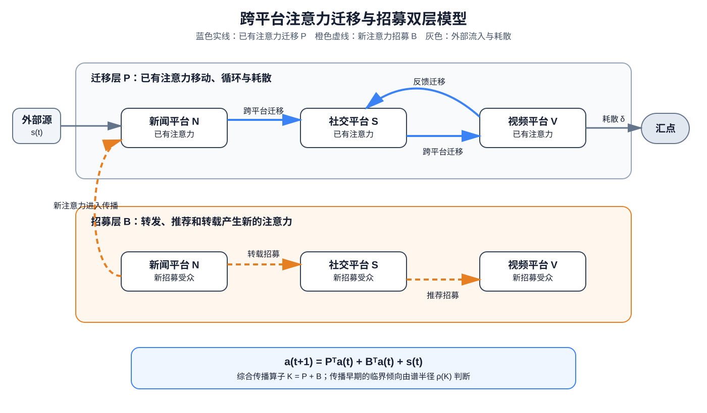
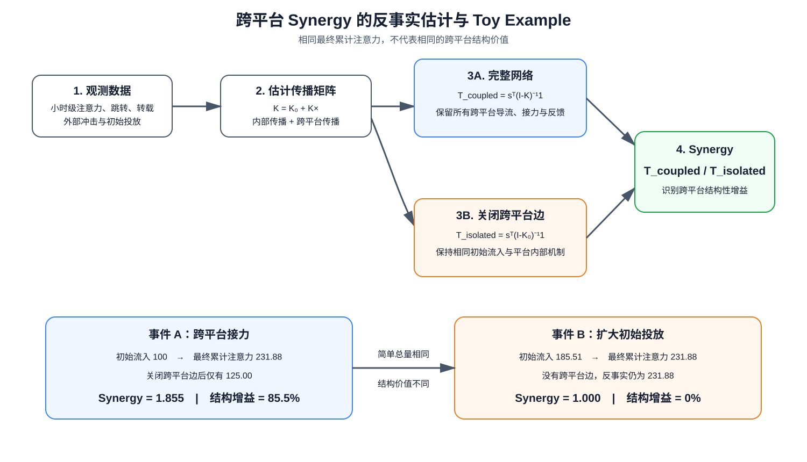

# 跨平台注意力迁移、招募与 Synergy 模型

## 1. 研究目标

本文提出一套可估计的跨平台注意力模型，用于回答三个相互关联的问题：

1. 注意力如何在平台内部及平台之间迁移、循环和耗散？
2. 已有注意力如何招募新的注意力并触发病毒式传播？
3. 跨平台连接相较于各平台独立运行，实际产生了多少结构性增益？

模型连接两类理论：

- **开放流网络**：将注意力视为从外部源进入、沿节点迁移并最终流向汇点的有限流；
- **分枝传播过程**：允许已有注意力招募新用户，因此能够描述注意力增长和临界爆发。

本文中的 `Synergy` 是跨平台连接产生的反事实注意力增益，不等同于 PEID 中以 bit 为单位的不可分解联合因果信息。后者可以作为进一步识别多平台联合机制的扩展指标。



## 2. 状态、节点与注意力单位

设传播事件为 \(e\)，平台集合为 \(\mathcal P=\{1,\ldots,n\}\)。令

```math
\mathbf a_{e,t}
=
(a_{1,e,t},\ldots,a_{n,e,t})^\top
```

表示时段 \(t\) 各平台上的有效注意力状态。建议优先使用有效观看人数或标准化观看时长：

```math
a_{p,e,t}
=
\sum_u
\min\left(\frac{d_{u,p,e,t}}{d_0},1\right),
```

其中 \(d_{u,p,e,t}\) 是用户 \(u\) 投入的观看时长，\(d_0\) 是一个标准注意力单位，例如 30 秒。

若无法获得观看时长，可将 \(\mathbf a_{e,t}\) 视为潜变量，使用曝光、浏览、点赞、评论、转发、收藏和搜索等计数指标估计：

```math
X_{k,p,e,t}
\sim
\operatorname{NegBin}
\left(
\exp(\alpha_{k,p}+\lambda_{k,p}\log(1+a_{p,e,t})),
\phi_{k,p}
\right).
```

该观测模型让数据学习不同平台行为指标对潜在注意力的反映程度，避免手工规定“一次转发等于若干次点赞”。

## 3. 双层传播动力学

### 3.1 注意力迁移层

定义迁移矩阵

```math
\mathbf P
=
\left[P_{ij}\right],
```

其中 \(P_{ij}\) 表示节点 \(i\) 上已有的一单位注意力，在下一时段迁移到节点 \(j\) 的比例。迁移可以发生在平台内部，也可以跨平台发生。

将矩阵拆分为

```math
\mathbf P
=
\mathbf P_{\mathrm{within}}
+
\mathbf P_{\mathrm{cross}}.
```

每一行未被转移的部分流向汇点：

```math
\delta_i
=
1-\sum_jP_{ij},
```

其中 \(\delta_i\) 是节点 \(i\) 的注意力耗散率。

### 3.2 注意力招募层

严格守恒的迁移无法解释病毒式增长。因此定义非负招募矩阵

```math
\mathbf B
=
\left[B_{ij}\right],
```

其中 \(B_{ij}\) 表示节点 \(i\) 上的一单位已有注意力，在节点 \(j\) 招募的新注意力数量。转发带来的新曝光、推荐算法扩散以及跨平台转载产生的新受众均属于招募。

同样拆分为

```math
\mathbf B
=
\mathbf B_{\mathrm{within}}
+
\mathbf B_{\mathrm{cross}}.
```

### 3.3 完整动力学

令 \(\mathbf s_{e,t}\) 表示外部新闻冲击、广告投放和搜索入口等外生注意力，则

```math
\boxed{
\mathbf a_{e,t+1}
=
\mathbf P^\top\mathbf a_{e,t}
+
\mathbf B^\top\mathbf a_{e,t}
+
\mathbf s_{e,t}
}
```

定义综合传播算子

```math
\mathbf K
=
\mathbf P+\mathbf B.
```

当参数在分析窗口内近似稳定时，系统满足：

```math
\rho(\mathbf K)<1
\quad\Rightarrow\quad
\text{注意力最终耗散},
```

```math
\rho(\mathbf K)>1
\quad\Rightarrow\quad
\text{线性近似下存在爆发增长趋势}.
```

真实平台存在用户规模和注意力容量上限。超过阈值后的长期动力学需要加入饱和项；谱半径条件主要用于刻画传播早期的临界倾向。

## 4. 基于反事实路径的 Synergy

### 4.1 累计注意力

先考虑稳定且次临界的综合传播算子 \(\rho(\mathbf K)<1\)。对于一次性外部输入行向量 \(\mathbf s^\top\)，完整网络中的累计注意力为

```math
T_{\mathrm{coupled}}
=
\mathbf s^\top
(\mathbf I-\mathbf K)^{-1}
\mathbf 1.
```

定义仅保留平台内部传播的反事实算子：

```math
\mathbf K_0
=
\mathbf P_{\mathrm{within}}
+
\mathbf B_{\mathrm{within}}.
```

关闭所有跨平台迁移和招募边后：

```math
T_{\mathrm{isolated}}
=
\mathbf s^\top
(\mathbf I-\mathbf K_0)^{-1}
\mathbf 1.
```

于是定义：

```math
\boxed{
\operatorname{Synergy}
=
\frac{T_{\mathrm{coupled}}}{T_{\mathrm{isolated}}}
}
```

以及更容易解释的相对增益：

```math
\boxed{
G
=
\operatorname{Synergy}-1
=
\frac{T_{\mathrm{coupled}}-T_{\mathrm{isolated}}}
{T_{\mathrm{isolated}}}
}
```

- \(\operatorname{Synergy}=1\)：跨平台连接没有带来额外累计注意力；
- \(\operatorname{Synergy}>1\)：跨平台路径产生净放大；
- \(G=0.4\)：跨平台连接相较于独立传播增加了 40% 的累计注意力。

### 4.2 路径分解

令

```math
\mathbf U_0
=
(\mathbf I-\mathbf K_0)^{-1},
\qquad
\mathbf K_\times
=
\mathbf P_{\mathrm{cross}}+\mathbf B_{\mathrm{cross}}.
```

则完整传播基础矩阵可以展开为：

```math
(\mathbf I-\mathbf K)^{-1}
=
\mathbf U_0
+
\mathbf U_0\mathbf K_\times\mathbf U_0
+
\mathbf U_0\mathbf K_\times\mathbf U_0
\mathbf K_\times\mathbf U_0
+\cdots.
```

各项依次表示：

- 未跨平台传播；
- 恰好跨平台一次；
- 恰好跨平台两次；
- 更长的跨平台接力与反馈路径。

因此，该 Synergy 不只是一个比率，还可以分解出增益主要来自单次导流、跨平台接力，还是长反馈回路。

## 5. Toy example：相同总注意力，不同结构价值

### 5.1 场景设定

考虑三个平台：

- \(N\)：新闻平台；
- \(S\)：社交平台；
- \(V\)：视频平台。

为便于手工复算，本例先将迁移和招募合并为综合传播矩阵 \(\mathbf K\)。平台内部传播为：

```math
\mathbf K_0
=
\begin{bmatrix}
0.20 & 0 & 0\\
0 & 0.30 & 0\\
0 & 0 & 0.40
\end{bmatrix}.
```

跨平台传播为：

```math
\mathbf K_\times
=
\begin{bmatrix}
0 & 0.30 & 0.10\\
0.05 & 0 & 0.20\\
0 & 0.10 & 0
\end{bmatrix}.
```

例如：

- \(K_{NS}=0.30\)：新闻平台的一单位注意力会在社交平台产生 0.30 单位后续注意力；
- \(K_{SV}=0.20\)：社交平台会继续向视频平台传播；
- \(K_{SN}=0.05\)：社交讨论也可能反馈至新闻平台。

事件 A 首先在新闻平台获得 100 单位外部注意力：

```math
\mathbf s_A^\top
=
\begin{bmatrix}
100 & 0 & 0
\end{bmatrix}.
```

### 5.2 关闭跨平台边的反事实

如果三个平台相互独立：

```math
\mathbf U_0
=
(\mathbf I-\mathbf K_0)^{-1}
=
\begin{bmatrix}
1.25 & 0 & 0\\
0 & 1.4286 & 0\\
0 & 0 & 1.6667
\end{bmatrix}.
```

因此：

```math
T_{\mathrm{isolated},A}
=
\mathbf s_A^\top\mathbf U_0\mathbf 1
=
125.
```

这表示新闻平台最初的 100 单位注意力，经过平台内部延续后累计产生 125 单位注意力。

### 5.3 完整网络结果

加入跨平台传播后：

```math
\mathbf U
=
(\mathbf I-\mathbf K_0-\mathbf K_\times)^{-1}
\approx
\begin{bmatrix}
1.2882 & 0.6119 & 0.4187\\
0.0966 & 1.5459 & 0.5314\\
0.0161 & 0.2576 & 1.7552
\end{bmatrix}.
```

累计注意力在三个平台上的分布为：

| 平台 | 累计注意力 |
|---|---:|
| 新闻 \(N\) | 128.82 |
| 社交 \(S\) | 61.19 |
| 视频 \(V\) | 41.87 |
| **合计** | **231.88** |

所以：

```math
\operatorname{Synergy}_A
=
\frac{231.88}{125}
\approx
1.855,
```

```math
G_A
\approx
0.855.
```

解释为：跨平台连接使事件 A 的累计注意力相较于平台独立传播增加约 **85.5%**。

### 5.4 跨平台路径贡献

利用路径展开，可以得到：

| 跨平台次数 | 累计注意力贡献 |
|---:|---:|
| 0 次：仅平台内部 | 125.00 |
| 1 次：直接跨平台导流 | 74.40 |
| 2 次：跨平台接力 | 24.18 |
| 3 次 | 5.72 |
| 4 次及以上 | 2.58 |
| **合计** | **231.88** |

因此，事件 A 的主要额外收益来自一次直接导流，但两次及以上的接力仍贡献约：

```math
24.18+5.72+2.58
\approx
32.48.
```

这部分增益无法通过只统计直接转载量获得。

### 5.5 为什么比简单流量求和更有用

再考虑事件 B。事件 B 没有跨平台边，但通过更大的初始投放，使其最终累计注意力同样为约 231.88：

```math
\mathbf s_B^\top
=
\begin{bmatrix}
185.51 & 0 & 0
\end{bmatrix},
\qquad
T_{\mathrm{coupled},B}
=
T_{\mathrm{isolated},B}
\approx
231.88.
```

因此：

```math
\operatorname{Synergy}_B=1.
```

| 指标 | 事件 A：跨平台接力 | 事件 B：扩大初始投放 |
|---|---:|---:|
| 最终累计注意力 | 231.88 | 231.88 |
| 独立传播反事实 | 125.00 | 231.88 |
| Synergy | **1.855** | **1.000** |
| 相对增益 \(G\) | **85.5%** | **0%** |

如果只比较累计浏览或互动总量，两个事件表现完全相同。但 Synergy 能识别：

- 事件 A 具有可复用的跨平台传播结构；
- 事件 B 的表现主要来自更大的初始资源投入；
- 若要优化跨平台协同，应研究事件 A 的导流边和接力路径；
- 若要预测撤除投放后的自然传播能力，事件 A 明显优于事件 B。



## 6. 参数估计与数据需求

### 6.1 最优数据：用户级连续行为日志

建议采集：

| 字段 | 用途 |
|---|---|
| `anonymous_user_id` | 识别连续访问与受众去重 |
| `timestamp` | 构建时间窗口和传播滞后 |
| `platform`、`content_id`、`event_id` | 定义传播节点 |
| `referrer_platform`、`referrer_content_id` | 识别直接迁移路径 |
| `exposure_id`、`action_type` | 区分曝光、点击、转发与招募 |
| `watch_duration`、`completion_rate` | 构造有效注意力 |
| `account_id`、`follower_count` | 控制账号基础影响 |
| `recommendation_slot`、`paid_flag` | 控制算法推荐和广告投放 |

由连续行为日志估计迁移：

```math
\widehat P_{ij}
=
\frac{\text{从 }i\text{ 连续转移到 }j\text{ 的有效注意力}}
{\text{节点 }i\text{ 的有效注意力总量}}.
```

由新增受众估计招募：

```math
\widehat B_{ij}
=
\frac{\text{可归因于 }i\text{ 的节点 }j\text{ 新增有效注意力}}
{\text{节点 }i\text{ 的有效注意力总量}}.
```

### 6.2 只有平台聚合数据时

当跨平台用户身份不可关联时，可通过非负约束 Hawkes 或 VAR 模型估计综合传播算子：

```math
\mathbf a_{e,t+1}
=
\sum_{\ell=0}^{L}
\mathbf K_\ell^\top\mathbf a_{e,t-\ell}
+
\mathbf C^\top\mathbf z_{e,t}
+
\boldsymbol\epsilon_{e,t},
```

其中 \(\mathbf z_{e,t}\) 包括共同新闻冲击、账号规模、推荐位、广告投放、主题和发布时间等控制变量。最终令：

```math
\widehat{\mathbf K}
=
\sum_{\ell=0}^{L}\widehat{\mathbf K}_\ell.
```

该方法估计的是聚合传播关联。若没有自然实验或平台政策冲击，不能直接解释为严格因果效应。

## 7. 估计流程

1. 将跨平台内容匹配为同一事件，并构建小时级有效注意力序列；
2. 控制共同外部冲击，估计迁移矩阵 \(\mathbf P\) 和招募矩阵 \(\mathbf B\)，或直接估计综合传播矩阵 \(\mathbf K\)；
3. 检查谱半径、稳定性和参数置信区间；
4. 使用完整矩阵计算 \(T_{\mathrm{coupled}}\)；
5. 将所有跨平台边置零，计算 \(T_{\mathrm{isolated}}\)；
6. 计算 Synergy、相对增益和各阶跨平台路径贡献；
7. 使用留出事件检验累计注意力预测；
8. 使用随机时间置换、伪事件匹配和平台政策冲击检验因果稳健性。

## 8. 可识别性与验证

### 8.1 主要风险

- 多个平台可能同时响应同一外部新闻，而非相互传播；
- 推荐算法可能同时提高多个平台的曝光；
- 未观测平台会形成隐藏传播路径；
- 内容质量和初始投放可能同时影响传播矩阵与最终注意力；
- 聚合时间窗口过大会混合迁移与招募过程。

### 8.2 建议验证

- 在已知 \(\mathbf P\) 和 \(\mathbf B\) 的合成系统上验证恢复误差；
- 使用内容级、事件级和时间级留出预测；
- 对跨平台边进行随机置换，确认 Synergy 回到接近 1；
- 使用平台限流、接口故障或政策变化作为外生冲击；
- 比较不同时间窗口、事件匹配阈值和隐藏平台删减下的稳定性；
- 对 Synergy 和路径贡献使用事件级 bootstrap 置信区间。

## 9. 与 PEID Synergy 的后续结合

本文 Synergy 回答：

> 跨平台连接相较于关闭跨平台边的反事实，增加了多少累计注意力？

PEID Synergy 则可以进一步回答：

> 平台 \(i\) 与平台 \(j\) 的联合状态，对目标平台未来注意力是否提供了任何单个平台都无法单独提供的机制信息？

对目标平台 \(k\)，可以在拟合动力学模型或干预模拟器上计算：

```math
\operatorname{Syn}^{\mathrm{PEID}}_{\{i,j\}\to k}
=
EI(\{a_i,a_j\}\to a_k')
-
EI(a_i\to a_k')
-
EI(a_j\to a_k').
```

推荐分工如下：

- 反事实流量 Synergy：作为主要传播效果指标，单位为倍数或百分比；
- PEID Synergy：作为联合跨平台机制诊断，单位为 bit；
- 路径分解：定位直接导流、接力传播和反馈回路；
- 谱半径：刻画传播早期的临界爆发倾向。

四者不应混用，但可以共同形成从传播效果、路径结构到联合因果机制的完整分析框架。

## 10. 参考文献与理论来源

- Zhang, J. & Guo, L. *The Atlas of Chinese World Wide Web Ecosystem Shaped by Collective Attention Flows*. PLOS ONE (2016).  
  <https://journals.plos.org/plosone/article?id=10.1371/journal.pone.0165240>
- Wu, L. & Zhang, J. *The Collective Direction of Attention Diffusion*. Scientific Reports (2016).  
  <https://www.nature.com/articles/srep34059>
- Zhang, J. *Open Flow Networks*.  
  <https://jake.swarma.org/research/open_flow_networks.html>
- Zhang, J. & Guo, L. *Universal Patterns and Constructal Law in Open Flow Networks*.  
  <https://www.iieta.org/journals/ijht/paper/10.18280/ijht.34S109>

开放流网络为注意力迁移、循环、耗散和路径影响提供理论基础；本文在此基础上显式加入招募矩阵与关闭跨平台边的反事实，从而扩展至病毒传播和结构性 Synergy 估计。
