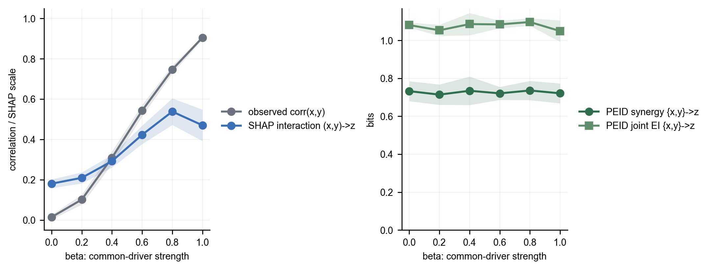

# 统一动力系统：共同驱动 + sine 协同

这个例子把两种容易混淆的结构放进同一个动力系统：一方面，`w` 是 `x`、`y` 背后的共同原因；另一方面，`x`、`y` 对 `z` 的作用不是两条可分离的 pairwise 边，而是一个二源协同项。系统为

$$
\begin{aligned}
w_{t+1} &= 0.78w_t + \eta^w_t,\\
x_{t+1} &= 0.42x_t + 0.82w_t + \eta^x_t,\\
y_{t+1} &= 0.38y_t + 0.76w_t + \eta^y_t,\\
z_{t+1} &= 0.22z_t + \alpha\sin\left(x_t y_t\right) + \eta^z_t.
\end{aligned}
$$

其中 `w` 不直接进入 `z` 的结构方程。真实机制应读成两层：

- pairwise 层面：`w -> x`、`w -> y`；
- 高阶层面：`{x, y} -> z`；
- 非结构边：`w -> z` 不是直接机制边，单独的 `x -> z`、`y -> z` 也只是 sine 协同项的 pairwise 投影。

## 读出方式

同一条模拟时间序列先用于训练一个 MLP 一步转移模型，输入为 `[x_t, y_t, z_t, w_t]`，输出为 `[x_{t+1}, y_{t+1}, z_{t+1}, w_{t+1}]`。随后在固定 MLP 上读出四类量：

- Granger/ablation：把某个 source 的输入列替换为均值，记录目标预测 MSE 的增量。它回答“去掉这个变量会不会损害预测”。
- SHAP 类归因：在同一 fitted MLP 上只保留一个常用背景替换式 SHAP 基线，用经验背景替换未给定特征。单特征 SHAP 报告 mean absolute attribution；二阶 SHAP interaction 报告 `x:y` 的 mean absolute interaction。前者回答“某个特征分到多少预测贡献”，后者回答“两个特征的非加性预测贡献有多大”。
- 交互项 probe：在同一 fitted MLP 的最大熵干预预测面上，用标准化主效应加一个二阶乘积项拟合目标输出，并记录该乘积项相对于主效应模型的 incremental `R^2`。它回答“固定这个预测器时，响应面是否含有可由 `x:y` 近似的二阶非加性形状”。
- PEID：先做最大熵独立干预，再计算 single-source EI、joint EI 和 synergy：

$$
\mathrm{Syn}(\{x,y\}\to z)
= EI(\{x,y\}\to z)-EI(x\to z)-EI(y\to z).
$$

## 第一章：二源协同情形：`{x,y} -> z`

### 代表性结果

| quantity | value |
| --- | ---: |
| fitted MLP final training loss | 0.16 |
| Granger/ablation `w -> x` | 0.4901 |
| Granger/ablation `w -> y` | 0.4105 |
| Granger/ablation `w -> z` | 0.01194 |
| Granger/ablation `x -> z` | 0.2161 |
| Granger/ablation `y -> z` | 0.2305 |
| SHAP mean abs `w -> x` | 0.5004 |
| SHAP mean abs `w -> y` | 0.4622 |
| SHAP mean abs `w -> z` | 0.03244 |
| SHAP mean abs `x -> z` | 0.1456 |
| SHAP mean abs `y -> z` | 0.1425 |
| SHAP interaction mean abs `x:y -> z` | 0.2212 |
| product interaction `x:y -> z` incremental `R^2` | 0.4634 |
| product interaction `x:y -> z` coefficient | 0.2389 |
| product interaction `w:x -> z` incremental `R^2` | 0.003497 |
| product interaction `w:y -> z` incremental `R^2` | 0.01562 |
| PEID pairwise EI `w -> x` | 0.6253 |
| PEID pairwise EI `w -> y` | 0.7456 |
| PEID pairwise EI `w -> z` | 0.02398 |
| PEID pairwise EI `x -> z` | 0.09064 |
| PEID pairwise EI `y -> z` | 0.114 |
| PEID joint EI `{x, y} -> z` | 0.7879 |
| PEID synergy `{x, y} -> z` | 0.5833 |

图中左侧热图把 Granger、SHAP 和 PEID 的单源读出放在同一组边上比较。因为三行的单位不同，颜色只在每一行内部归一化，格子里的数字才是原始读数。右上角显示标准化乘积项对 `z` 的增量解释度：`x:y` 明显高于 `w:x` 与 `w:y`。右下角显示 PEID 对 `z` 的信息分解，联合 EI 与 synergy 高于单源 EI。

### alpha 扫描：SHAP 交互与 PEID 协同

| alpha | SHAP `x->z` | SHAP `y->z` | SHAP `w->z` | SHAP interaction `|x:y|` | Granger `x->z` | Granger `y->z` | Granger `w->z` | TM PEID joint EI `{x,y}->z` | TM PEID synergy `{x,y}->z` |
| ---: | ---: | ---: | ---: | ---: | ---: | ---: | ---: | ---: | ---: |
| 0.00 | 0.001942 | 0.001324 | 0.0007372 | 0.0006254 | 1.843e-05 | 1.302e-05 | 1.777e-05 | 0.03093 | -0.002546 |
| 0.20 | 0.03113 | 0.03195 | 0.01068 | 0.05843 | 0.008518 | 0.008888 | 0.0001599 | 0.7449 | 0.6899 |
| 0.40 | 0.06357 | 0.06288 | 0.01511 | 0.139 | 0.03565 | 0.03363 | 0.001393 | 0.8727 | 0.828 |
| 0.60 | 0.09526 | 0.09575 | 0.02041 | 0.2181 | 0.07952 | 0.07362 | 0.00362 | 0.9068 | 0.8594 |
| 0.80 | 0.127 | 0.1283 | 0.02525 | 0.2961 | 0.1417 | 0.1317 | 0.006221 | 0.9265 | 0.8803 |
| 1.00 | 0.1588 | 0.1605 | 0.03084 | 0.3733 | 0.2229 | 0.2085 | 0.009188 | 0.9335 | 0.8885 |

这里的 `alpha` 是 sine 项前面的强度系数。`alpha=0` 时，`z` 只剩自身记忆与噪声，SHAP 二阶交互接近零；TM PEID 仅保留少量连续估计底噪。随着 `alpha` 增大，SHAP 单源 `x->z`、`y->z` 与 SHAP interaction 同时上升，但单源项是对协同响应的归因分摊，不是结构边；Granger/ablation 的 `x->z`、`y->z` 也会随 `alpha` 上升，因为它衡量单源置换对 fitted MLP 预测误差的影响；这里的 PEID 曲线改用连续 transport-map EI，在同一最大熵联合干预样本上直接读出 `{x,y}` 对连续目标预测的机制信息约束。

### beta 扫描：共同驱动增强但结构协同固定

这里固定 `alpha=1`，只改变 `x,y` 的共同驱动强度 `beta`。生成式中 `beta` 增大只让 `x` 与 `y` 在观测轨迹上更相关，并没有增强 `z_{t+1}` 中的 `sin(x_t y_t)` 结构项。因此理论预期是：`{x,y}->z` 的 PEID 协同不应因为 `beta` 增大而单调增加。

beta 扫描对应的动力学为

$$
\begin{aligned}
w_{t+1} &= 0.78w_t + \eta^w_t,\\
x_{t+1} &= 0.42x_t + 0.82\left(\beta w_t + \sqrt{1-\beta^2}\,\xi^x_t\right) + \eta^x_t,\\
y_{t+1} &= 0.38y_t + 0.76\left(\beta w_t + \sqrt{1-\beta^2}\,\xi^y_t\right) + \eta^y_t,\\
z_{t+1} &= 0.22z_t + \sin\left(x_t y_t\right) + \eta^z_t.
\end{aligned}
$$

其中 `beta=0` 时，`x` 与 `y` 主要由各自私有扰动驱动；`beta=1` 时，它们的新增驱动完全共享同一个 `w_t`。`\sqrt{1-\beta^2}` 是 `beta` 的互补私有驱动权重，使共享驱动项和私有驱动项的平方权重和保持为 1；这样 beta 扫描主要改变源变量之间的观测相关性，而不是简单放大或缩小 `x,y` 的总驱动强度。`z` 的结构项始终是同一个 `sin(x_t y_t)`，因此 beta 不改变二源机制本身。

| beta | corr(`x`,`y`) | SHAP interaction `(x,y)->z` | PEID synergy `{x,y}->z` | PEID joint EI `{x,y}->z` |
| ---: | ---: | ---: | ---: | ---: |
| 0.00 | 0.01436 | 0.1803 | 0.7325 | 1.081 |
| 0.20 | 0.1014 | 0.2094 | 0.7142 | 1.053 |
| 0.40 | 0.3089 | 0.2919 | 0.7346 | 1.086 |
| 0.60 | 0.5427 | 0.4229 | 0.7209 | 1.084 |
| 0.80 | 0.7463 | 0.538 | 0.7361 | 1.097 |
| 1.00 | 0.9052 | 0.4702 | 0.7211 | 1.049 |

图中左侧把两个读数叠在同一坐标轴上：灰色线是观测轨迹里 `x` 与 `y` 的 Pearson 相关系数，用来显示共同驱动造成的源变量相关性；蓝色线是同一 fitted MLP 上面向 `z` 的 SHAP `(x,y)->z` 二阶交互强度。右侧 PEID 曲线比较的是同一个源集合 `{x,y}` 到目标 `z` 的 synergy 与 joint EI。为保持图面简洁，图中 PEID 曲线使用离散化估计器；transport-map PEID 不再单独绘制，只在趋势读数中作为稳健性补充。灰线不是因果边或 PEID 读数，而是 beta 扫描的观测相关性参照。

线性趋势读数显示，SHAP interaction 的 beta 斜率为 0.3666 (bootstrap 95% CI [0.2956, 0.4617])；离散化 PEID synergy 的 beta 斜率为 -0.000766 (bootstrap 95% CI [-0.05571, 0.05186])；transport-map PEID synergy 的 beta 斜率为 -0.3193 (bootstrap 95% CI [-0.5234, -0.1593])。这说明在这个对照里，SHAP interaction 更容易随观测相关性增强而上升；离散化 PEID 与 transport-map PEID 都没有相同的上升趋势。

### 解释

`w -> x` 和 `w -> y` 在 Granger/ablation 与 PEID pairwise EI 中都很强，说明 fitted MLP 学到了共同驱动结构。`w -> z` 很小，符合结构方程中 `w` 不直接进入 `z` 的设定；若某些归因方法给出非零 `w -> z`，应解释为 `w` 通过诱导 `x,y` 相关性形成的代理贡献，而不是直接结构边。

对 `z` 来说，Granger/ablation 会给出明显的 `x -> z` 与 `y -> z`，SHAP 类单特征归因也会倾向把 sine 项拆成单变量贡献。交互项 probe 则能进一步指出 fitted MLP 的响应面中确实存在强 `x:y` 二阶非加性项，因此它比纯单特征 SHAP 更接近“有交互”的诊断；但它仍然是响应面形状分析，不是源侧最大熵干预语义下的机制信息分解。这些读出有预测解释价值，但它们把

$$
\alpha\sin(x_t y_t)
$$

投影成了 pairwise 贡献或低阶乘积项，不能单独表达“只有联合给定 `x_t` 和 `y_t` 时才稳定确定目标响应”的机制事实。

PEID 的关键读数是 `EI({x, y} -> z)` 与 `Syn({x, y} -> z)` 均显著高于单源投影。它说明联合干预 `{x,y}` 后，目标分布的约束远超过两个单源 EI 的加和。因此这个例子的结论不是“PEID 消除了所有代理效应”，而是：在同一个 learned transition surrogate 上，PEID 可以同时保留 `w -> x,y` 的共同驱动边，以及 `{x,y} -> z` 的协同超边；Granger 和 SHAP 单特征方法主要给出预测贡献的 pairwise 投影，交互项 probe 可以提示 `x:y` 非加性存在，但 PEID 才把这个非加性读成源集合到目标的协同有效信息。

## 第二章：代理变量情形：`x` 作为 `w -> y` 的 proxy

同一个动力系统还包含一个不需要额外造数的代理变量实验。对目标 `y_{t+1}`，结构方程中有直接项 `w_t -> y_{t+1}` 与自回归项 `y_t -> y_{t+1}`，但没有 `x_t -> y_{t+1}`。不过 `x_t` 由自相关的 `w` 驱动，因此在观测分布上是 `w_t` 的代理变量。

| method | `w->y` true driver | `x->y` proxy | `y->y` memory | `x/w` ratio |
| --- | ---: | ---: | ---: | ---: |
| SHAP | 0.4622 | 0.0454 | 0.2652 | 0.09822 |
| PEID EI | 0.7456 | 0.02086 | 0.1523 | 0.02797 |
| Granger | 0.4105 | 0.006092 | 0.1348 | 0.01484 |

这里不再区分不同 SHAP 口径，只保留当前应用最常见的背景替换式 SHAP 基线。该读出在同一 fitted MLP 上计算 mean absolute attribution，用来表示特征对预测输出的平均贡献；PEID 使用最大熵独立干预读出，主要保留直接 driver `w->y` 与自回归 `y->y`，而不是把观测 proxy 当作强机制边。
