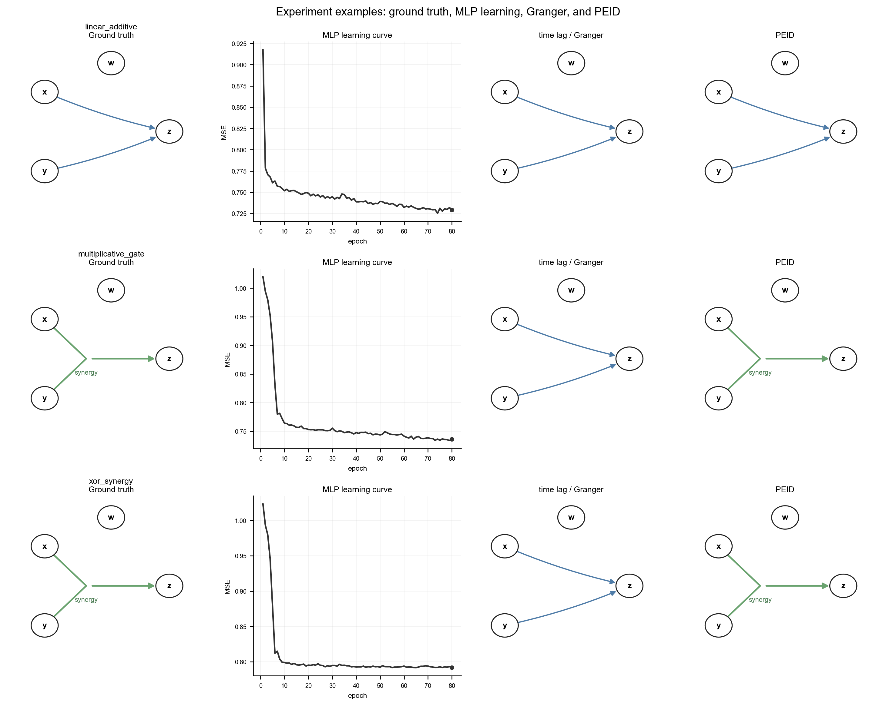
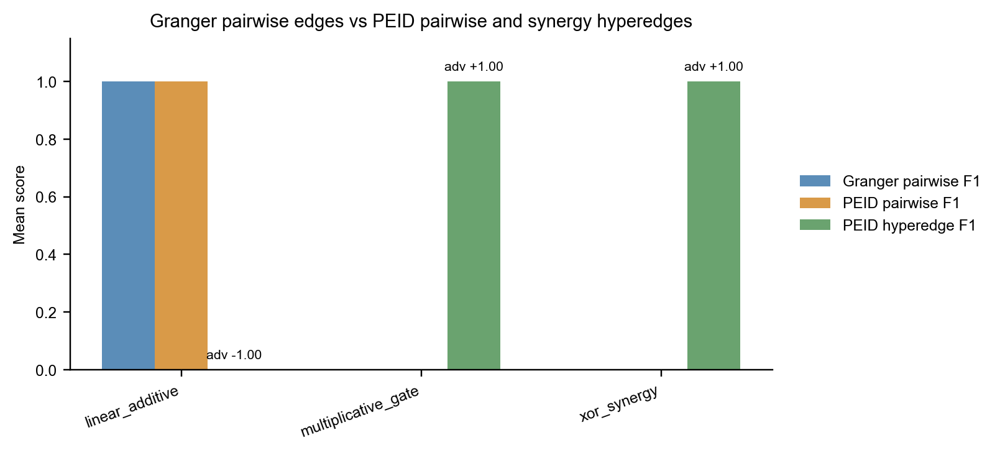
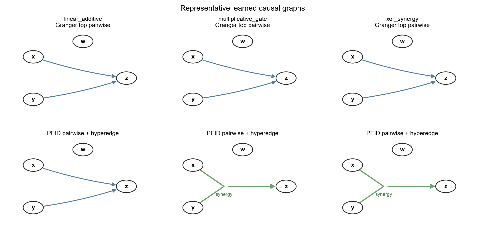

# MLP 学习下 Granger 与 PEID 因果图对照实验

本文档记录一个模拟实验：先生成带有已知因果结构的时间序列，用 MLP 学习一步转移动力学，再分别用基于 time lag 的 Granger/ablation 方法和 PEID 最大熵干预方法识别变量之间的因果关系。

## 实验设计

变量为 `x, y, z, w`。`w` 主要作为无关变量或 common-driver 对照。当前 smoke 结果包含三类机制：

- `linear_additive`：真实机制是 `x -> z` 与 `y -> z` 的线性加性 pairwise 因果关系。这是 sanity check。
- `multiplicative_gate`：真实机制是 `{x, y} -> z` 的连续非线性协同门控关系，单独看 `x` 或 `y` 都不足以解释目标。
- `xor_synergy`：真实机制是 `{x, y} -> z` 的 XOR/parity 协同关系，是 PEID 应该明显优于 pairwise time-lag 图的核心例子。

## Ground truth 因果图、MLP 学习情况与两种识别结果

下图每一行是一个机制；四列分别是 Ground truth 因果图、MLP 学习情况（loss 曲线）、time lag / Granger 识别的因果图、PEID 识别的因果图。蓝色箭头表示普通 pairwise 边，绿色结构表示 PEID 的协同超边。

## 汇总结果图

下图汇总不同机制下的平均 F1。对协同机制，Granger 只能输出 pairwise 边，而 PEID 可以输出 `{x, y} -> z` 的 synergy hyperedge，因此 `peid_advantage` 为正。

## 代表性因果图对照

下图单独放大比较 Granger 与 PEID 的代表性因果图。可以看到，在 `multiplicative_gate` 和 `xor_synergy` 中，Granger 倾向给出 `x -> z`、`y -> z` 这样的 pairwise 解释；PEID 则把同一机制表达为 `{x, y} -> z` 的协同超边。

## 数值汇总

| 指标 | 含义 |
| --- | --- |
| `granger_pairwise_f1` | time lag / Granger pairwise 图相对真实 pairwise 边的 F1 |
| `peid_pairwise_f1` | PEID pairwise EI 图相对真实 pairwise 边的 F1 |
| `peid_hyperedge_f1` | PEID synergy hyperedge 相对真实协同超边的 F1 |
| `peid_advantage` | `peid_hyperedge_f1 - granger_pairwise_f1`，越大越凸显 PEID 在协同机制中的优势 |

| mechanism | granger_pairwise_f1 | peid_pairwise_f1 | peid_hyperedge_f1 | peid_advantage |
| --- | ---: | ---: | ---: | ---: |
| linear_additive | 1.000 | 1.000 | 0.000 | -1.000 |
| multiplicative_gate | 0.000 | 0.000 | 1.000 | 1.000 |
| xor_synergy | 0.000 | 0.000 | 1.000 | 1.000 |

## 结论

这个实验凸显了两类方法差异显著的条件：真实机制不是单变量滞后可以还原的 pairwise 关系，而是需要多个源变量联合出现才产生目标响应的协同机制。此时 Granger/time-lag 图容易把联合机制拆成若干 pairwise 箭头；PEID 在最大熵独立干预下比较 joint EI 与 single-source EI，可以把这种结构表示为协同超边，因此更接近 ground truth。
