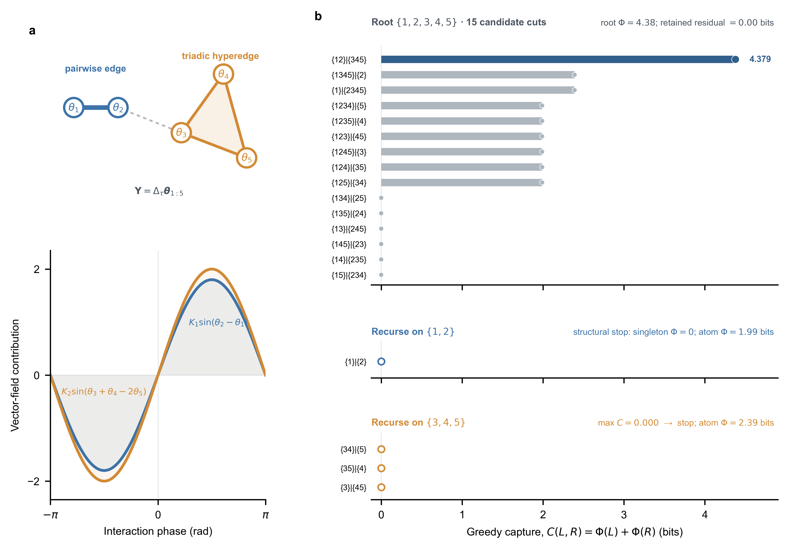

# 混合阶 Kuramoto：从随机转移数据恢复 Greedy 层级

## 实验问题

该正对照检验：从有限的随机动力学转移中学习模型后，使用完整五振子未来响应作为 target，Greedy 层级能否在过程噪声和弱跨模块连接下恢复已知的 `2+3` 分区。

## 已知动力学

五个相位振子包含对称 pairwise 模块

$$
C_2=\{\theta_1,\theta_2\},
$$

以及对称三体模块

$$
C_3=\{\theta_3,\theta_4,\theta_5\}.
$$

模块内部动力学为

$$
\begin{aligned}
\dot{\theta}_1
&=\omega_1+K_1\sin(\theta_2-\theta_1),\\
\dot{\theta}_2
&=\omega_2+K_1\sin(\theta_1-\theta_2),\\
\dot{\theta}_i
&=\omega_i+K_2\sin(\theta_j+\theta_k-2\theta_i),
\qquad
i,j,k\in\{3,4,5\},\ i\ne j\ne k,
\end{aligned}
$$

其中 $K_1=1.8$，$K_2=2.0$。三体项在全局相位平移下不变，并同时依赖三个振子。两个模块之间使用 degree-normalized all-to-all pairwise coupling；弱连接条件取 $K_{\mathrm{out}}=0.04$。

## 配对的 $2\times2$ 对照

两个 treatment factor 为：

- 过程噪声强度：$0$ 或 $0.08$；
- 跨模块耦合：$0$ 或 $0.04$。

四个条件使用相同 seeds、初始训练相位、训练/测试划分、干预相位、模型结构、训练预算和 EI 估计器。实验单位为 seed，共使用三个 seeds。

每个 seed 和条件先生成 4800 个随机有限时转移。初始相位独立服从

$$
\theta_i\sim\mathrm{Uniform}(-\pi,\pi).
$$

积分步长为 $0.01$，预测跨度为 $\tau=0.2$。过程噪声在每个积分步加入，标准差按 $\sqrt{dt}$ 缩放。

## 动力学识别与 target

非线性动力学模型接收五个振子的圆周特征，并直接预测完整五维未来相位变化

$$
\mathbf{Y}
=\Delta_\tau\boldsymbol{\theta}_{1:5}
=\operatorname{wrap}\!\left(
\boldsymbol{\theta}_{t+\tau}-\boldsymbol{\theta}_t
\right).
$$

直接使用绝对未来相位曾被审计，但短时连续动力学的 identity/persistence 使 singleton EI 主导；从 $\tau=0.2$ 到 $\tau=2$，五个 singleton EI 之和仍超过 whole EI，根 $\Phi$ 为负。因此最终 target 使用所有五个振子的未来变化，而不是只读取振子 1 和 5，也不是使用标量汇总。

模型在训练转移上拟合后，从 held-out 残差协方差估计随机响应。PEID readout 使用另外 3600 个独立均匀相位干预，并对学习模型采样。真实条件三个 seeds 的 held-out 圆周 MAE 为 $0.066$–$0.074$ rad。

## EI 估计器审计

优先尝试了 polynomial triangular TM。五个 source block 使用圆周特征；三体模块还保留二阶谐波，使
$\sin(\theta_j+\theta_k-2\theta_i)$ 可表达。完整 source dictionary 为 16 维，target 为 5 维。

该设置下：

- degree-3 joint TM 的 whole EI 退化为 0；
- degree-2 TM 只能稳定识别 pairwise 通道，不能恢复三体模块；
- 将五个 target 分量分别估计后求和也没有解决高维 source TM 的退化。

因此最终使用替代估计器：对每个非空 source subset 拟合相同容量的非线性条件均值模型，并在未参与拟合的后 $1/3$ 样本上计算多元 Gaussian log-det 熵差。该方法直接处理五维 target，但把 held-out 条件残差近似为 Gaussian；它不是对高维 TM 的无损替代。

## 层级一致性修正

31 个 subset 分别拟合会产生有限样本非单调，即某个父节点的估计 $\Phi(S)$ 可能略低于其最佳子捕获。进入 Greedy 前，对全部二阶及以上 subset 执行最小向上投影：

$$
\widetilde{\Phi}(S)
=\max\left[
\widehat{\Phi}(S),
\max_{S=L\mathbin{\dot\cup}R}
\left\{
\widetilde{\Phi}(L)+\widetilde{\Phi}(R)
\right\}
\right].
$$

当前 PEID 定义要求 $\Phi(S)\ge0$。因此投影还显式包含非负约束：

$$
\widetilde{\Phi}(S)
=\max\left[
0,
\widehat{\Phi}(S),
\max_{S=L\mathbin{\dot\cup}R}
\left\{
\widetilde{\Phi}(L)+\widetilde{\Phi}(R)
\right\}
\right].
$$

该递推是同时支配原始估计、满足非负性和 partition monotonicity 的逐层最小向上修正。负 plug-in 值只被视为算法偏差，不能作为 signed 信息保留。真实条件三个 seeds 的根修正量分别为 $0.234$、$0.138$ 和 $0.094$ bits。修正量是数值一致性诊断，不是观测信息。

投影后调用共享 Greedy 层级：

$$
C(L,R)=\widetilde{\Phi}(L)+\widetilde{\Phi}(R).
$$

捕获停止阈值为 $10^{-5}$ bits，负残差仅保留 $10^{-8}$ bits 的数值容忍度。

## 代表 seed



代表 seed 的真实条件满足

$$
\widetilde{\Phi}(\{1,2,3,4,5\})=4.379\ \text{bits}.
$$

15 个根候选中，正确切分

$$
\{1,2\}\mid\{3,4,5\}
$$

捕获 $4.379$ bits；第二名为 $2.390$ bits。两个终止原子为

$$
\widetilde{\Phi}(\{1,2\})=1.989\ \text{bits},
\qquad
\widetilde{\Phi}(\{3,4,5\})=2.390\ \text{bits}.
$$

`{1,2}` 的唯一下一步切分是两个 singleton，因此捕获量按定义为 0。`{3,4,5}` 的三个原始 plug-in 候选受到有限数据、动力学拟合和 subset EI 拟合误差影响而落到负侧；非负可行投影将它们修正为 0。Greedy 因最大捕获不超过停止阈值而终止。这里的 0 是理论约束下的边界解，不意味着数据生成和模型拟合没有噪声。

## 跨 seed 结果

| 条件 | 根分区恢复 | pairwise atom（bits） | triadic atom（bits） |
|---|---:|---:|---:|
| 无噪声、无跨模块连接 | 3/3 | $2.055\pm0.023$ | $2.889\pm0.284$ |
| 仅过程噪声 | 3/3 | $1.922\pm0.014$ | $2.581\pm0.220$ |
| 仅弱跨模块连接 | 3/3 | $2.064\pm0.043$ | $2.800\pm0.230$ |
| 过程噪声与弱连接同时存在 | 3/3 | $1.943\pm0.023$ | $2.542\pm0.198$ |

四个条件共 $12/12$ 个 seed-condition 组合恢复 planted 根切分，其他正原子质量均为 0。真实条件的三个 target-shuffle 根 $\Phi$ 均为 0。

## 解释边界

该实验支持：在当前噪声、弱连接、模型容量和干预支持下，learned-dynamics Greedy 能稳定恢复已知 `2+3` 根分区。

该实验不支持以下更强结论：

- 高维 TM 已经解决；本实验恰恰记录了它的退化；
- Gaussian residual readout 对非线性条件分布无偏；
- 单调投影可以忽略；部分 subset 的修正达到约 $0.8$ bits；
- Greedy 树能唯一表示共享节点或重叠超边。

## 复现

```bash
python scripts/validate_mixed_order_kuramoto_hierarchy.py --mode full --seeds 3
```

机器可读结果保存在
`results/mixed_order_kuramoto_hierarchy/summary.json`，其中包含每个条件和 seed 的动力学拟合误差、原始与投影 EI 表、投影修正量、完整 Greedy trace 和 target-shuffle 负控。图保存在
`docs/ref/assets/mixed_order_kuramoto_hierarchy/validation.{png,svg,pdf}`。
