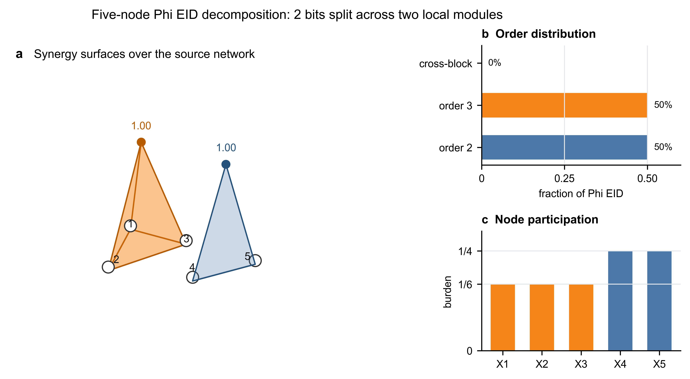

# 五维系统上的 Phi EID 层级贪婪分解示例

本文给出一个可以手算的五维布尔动力学例子，用来展示如何把系统级
$\Phi^{\mathrm{EID}}$ 按层级可加性分解成协同或高阶关系的分布。例子刻意选择两个互不耦合的机制：一个三源 XOR 机制和一个二源 XOR 机制。这样可以看清算法如何把总协同预算分到不同阶数和不同源模块上。

## 1. 五维动力学

令

$$
X_t=\bigl(X_t^{(1)},X_t^{(2)},X_t^{(3)},X_t^{(4)},X_t^{(5)}\bigr),
$$

并在源侧最大熵干预下取

$$
X_t^{(1)},\dots,X_t^{(5)} \stackrel{\mathrm{i.i.d.}}{\sim} \mathrm{Bernoulli}(1/2).
\tag{1}
$$

定义五维下一时刻状态为

$$
\begin{aligned}
X_{t+1}^{(1)} &= X_t^{(1)} \oplus X_t^{(2)} \oplus X_t^{(3)},\\
X_{t+1}^{(2)} &= X_t^{(4)} \oplus X_t^{(5)},\\
X_{t+1}^{(3)} &= 0,\\
X_{t+1}^{(4)} &= 0,\\
X_{t+1}^{(5)} &= 0,
\end{aligned}
\tag{2}
$$

其中 $\oplus$ 表示 XOR。后面把完整目标记为 $Y=X_{t+1}$。由于后三个目标分量是常数，它们不贡献有效信息；真正有信息的目标只有
$Y_1=X_{t+1}^{(1)}$ 和 $Y_2=X_{t+1}^{(2)}$。

对任意源子集 $A\subseteq \{1,2,3,4,5\}$，记

$$
F(A)=EI(X_t^A\to Y).
\tag{3}
$$

在这个例子中，$F(A)$ 有一个简单闭式：

$$
F(A)=
\mathbf{1}_{\{1,2,3\}\subseteq A}
+
\mathbf{1}_{\{4,5\}\subseteq A}
\quad \text{bits}.
\tag{4}
$$

原因是：只有同时看到 $\{1,2,3\}$ 才能确定三源 XOR 目标 $Y_1$；只有同时看到 $\{4,5\}$ 才能确定二源 XOR 目标 $Y_2$。任何真子集都不能单独提供对应 XOR 目标的信息。

因此

$$
F(\{1,2,3,4,5\})=2,
\qquad
F(\{i\})=0 \quad (i=1,\dots,5).
\tag{5}
$$

系统级协同为

$$
\Phi^{\mathrm{EID}}(X_t)
=F(\{1,2,3,4,5\})-\sum_{i=1}^{5}F(\{i\})
=2 \ \text{bits}.
\tag{6}
$$

## 2. 贪婪分解准则

对任意源块 $C$，定义该块相对于最细划分的内部协同预算为

$$
S(C)=F(C)-\sum_{i\in C}F(\{i\}).
\tag{7}
$$

若把 $C$ 二分成 $L$ 与 $R$，则层级可加性给出

$$
S(C)
=
\rho_C(L,R)+S(L)+S(R),
\tag{8}
$$

其中

$$
\rho_C(L,R)=F(C)-F(L)-F(R)
\tag{9}
$$

是当前分裂层上仍跨越 $L$ 与 $R$ 的协同残差。

贪婪规则如下：

1. 从根块 $C=\{1,2,3,4,5\}$ 开始。
2. 枚举候选二分 $C=L\cup R$。
3. 选择使 $S(L)+S(R)$ 最大的二分；等价于选择使 $\rho_C(L,R)$ 最小的二分。
4. 若最优二分能把正协同预算下放到子块，则递归处理子块；若不能，则把 $S(C)$ 记录为该块上的终端高阶关系。

这个版本不是在每一步寻找最大的 pairwise gain，而是在寻找最能把协同预算局部化到子模块的分裂。因此它能处理纯三源 XOR 这类所有二源读数都为零、但三源联合读数为正的机制。

## 3. 第一步：根块分裂

根块为

$$
V=\{1,2,3,4,5\}, \qquad S(V)=2.
\tag{10}
$$

几个代表性候选分裂如下。

| 候选分裂 $L/R$ | $F(L)$ | $F(R)$ | $S(L)+S(R)$ | $\rho_V(L,R)$ |
|---|---:|---:|---:|---:|
| $\{1,2,3\}/\{4,5\}$ | 1 | 1 | 2 | 0 |
| $\{1,2\}/\{3,4,5\}$ | 0 | 1 | 1 | 1 |
| $\{1,3\}/\{2,4,5\}$ | 0 | 1 | 1 | 1 |
| $\{4\}/\{1,2,3,5\}$ | 0 | 1 | 1 | 1 |
| $\{5\}/\{1,2,3,4\}$ | 0 | 1 | 1 | 1 |

最优分裂是

$$
\{1,2,3,4,5\}
\longrightarrow
\{1,2,3\}\ /\ \{4,5\}.
\tag{11}
$$

这一层的跨块残差为

$$
\rho_V(\{1,2,3\},\{4,5\})
=2-1-1=0.
\tag{12}
$$

解释：系统级协同不是跨越两个模块产生的，而是完全落在两个模块内部。

## 4. 第二步：处理三源块

对三源块

$$
C_1=\{1,2,3\},
\qquad
S(C_1)=F(C_1)=1.
\tag{13}
$$

任意二分都会把一个非空真子集和它的补集分开。例如

$$
\{1,2,3\}\longrightarrow \{1,2\}/\{3\}.
\tag{14}
$$

因为三源 XOR 的任何真子集都不能确定 $Y_1$，所以

$$
F(\{1,2\})=0,\qquad F(\{3\})=0.
\tag{15}
$$

于是

$$
\rho_{C_1}(\{1,2\},\{3\})=1-0-0=1.
\tag{16}
$$

这说明 $C_1$ 的 1 bit 协同不能再下放到二源或单源子块。它应记录为一个三源高阶关系：

$$
\{1,2,3\}\Rightarrow Y_1,
\qquad
\gamma_{\{1,2,3\}}=1 \ \text{bit}.
\tag{17}
$$

在这个特殊 XOR 例子里，该终端高阶关系同时也是精确三阶 Möbius interaction；但一般系统中，终端块的 $S(C)$ 是非负的层级协同残差，不必等同于纯 $|C|$ 阶原子。

## 5. 第三步：处理二源块

对二源块

$$
C_2=\{4,5\},
\qquad
S(C_2)=F(C_2)=1.
\tag{18}
$$

唯一分裂是

$$
\{4,5\}\longrightarrow \{4\}/\{5\}.
\tag{19}
$$

单源均不能确定二源 XOR 目标 $Y_2$，因此

$$
F(\{4\})=F(\{5\})=0,
\tag{20}
$$

并且

$$
\rho_{C_2}(\{4\},\{5\})=1-0-0=1.
\tag{21}
$$

这 1 bit 记录为二源协同关系：

$$
\{4,5\}\Rightarrow Y_2,
\qquad
\gamma_{\{4,5\}}=1 \ \text{bit}.
\tag{22}
$$

## 6. 分解结果

最终协同预算满足严格加和：

$$
\Phi^{\mathrm{EID}}(X_t)
=
0
+
1
+
1
=2 \ \text{bits}.
\tag{23}
$$

其中三项分别对应根层跨模块残差、三源 XOR 模块、二源 XOR 模块。

| 层级关系 | 目标分量 | 协同质量 | 阶数 | 占 $\Phi^{\mathrm{EID}}$ 比例 |
|---|---|---:|---:|---:|
| $\{1,2,3\}\Rightarrow Y_1$ | $X_{t+1}^{(1)}$ | 1 bit | 3 | 50% |
| $\{4,5\}\Rightarrow Y_2$ | $X_{t+1}^{(2)}$ | 1 bit | 2 | 50% |
| $\{1,2,3\}/\{4,5\}$ 跨模块残差 | $Y$ | 0 bit | cross-block | 0% |

阶数分布为

$$
p_2=0.5,\qquad p_3=0.5,\qquad p_{\mathrm{cross}}=0.
\tag{24}
$$

源变量参与负担可按协同质量在成员之间均分：

$$
b_i=\sum_{C\ni i}\frac{\gamma_C}{|C|\Phi^{\mathrm{EID}}}.
\tag{25}
$$

于是

| 源变量 | 参与关系 | $b_i$ |
|---|---|---:|
| $X_t^{(1)}$ | 三源 XOR | $1/6$ |
| $X_t^{(2)}$ | 三源 XOR | $1/6$ |
| $X_t^{(3)}$ | 三源 XOR | $1/6$ |
| $X_t^{(4)}$ | 二源 XOR | $1/4$ |
| $X_t^{(5)}$ | 二源 XOR | $1/4$ |

该分布说明：虽然 $\Phi^{\mathrm{EID}}$ 只有一个标量值 2 bits，但层级分解能进一步说明其中一半来自三源高阶机制，另一半来自二源协同机制；没有额外跨模块协同。

## 7. 三维棱锥可视化

一种直观展示方式是把 5 个源变量先放在同一个二维底面上，再把每个协同模块画成一个三维立体面或棱锥。几何体底部顶点对应参与该协同关系的输入变量；若只有两个源变量，就画由两个源节点和顶部强度点构成的三角面；若有三个或更多源变量，就画以这些源节点为底面的棱锥。顶部高度对应协同质量，颜色对应不同阶数或不同模块。

图中橙色棱锥的底面连接 $\{X_t^{(1)},X_t^{(2)},X_t^{(3)}\}$，高度为 1 bit，表示三源 XOR 模块贡献的三阶协同；蓝色三角面连接 $\{X_t^{(4)},X_t^{(5)}\}$ 与顶部强度点，高度同样为 1 bit，表示二源 XOR 模块贡献的二阶协同。右上角的阶数分布把总 $\Phi^{\mathrm{EID}}=2$ bits 归一化为比例：二阶和三阶各占 50%。右下角的节点参与负担把每个协同模块的质量均分给其成员，因此 $X_t^{(1)},X_t^{(2)},X_t^{(3)}$ 各承担 $1/(3\times2)=1/6$，而 $X_t^{(4)},X_t^{(5)}$ 各承担 $1/(2\times2)=1/4$。

这个画法适合展示“局部整合信息”的空间分布：底面网络保留变量之间的几何或拓扑位置，棱锥高度提供强度读数，颜色区分不同阶数或不同机制模块。对真实高维系统，可以只显示 top-k 个协同模块，避免三维图过密。

## 8. 高维实现时的含义

这个例子也暴露了一个实际问题：如果只用自底向上的 pairwise 贪婪合并，算法会很快找到 $\{4,5\}$，但会看不到 $\{1,2,3\}$，因为 $\{1,2,3\}$ 内部所有二源 EI 和二源协同都是零。高维系统中更稳妥的做法是：

1. 先用便宜的 pairwise EI、Jacobian interaction 或候选因果图限制候选块；
2. 对候选块使用上面的 top-down 最小跨块残差准则；
3. 对无法继续下放但仍有正 $S(C)$ 的块，直接记录为终端高阶关系；
4. 只对 top 模块再计算 signed Möbius interaction，用来区分是否存在更精确的三阶或四阶原子。

因此，推荐的主报告对象是非负的层级协同残差分布；signed Möbius 原子适合作为补充诊断，而不是替代主分布。
