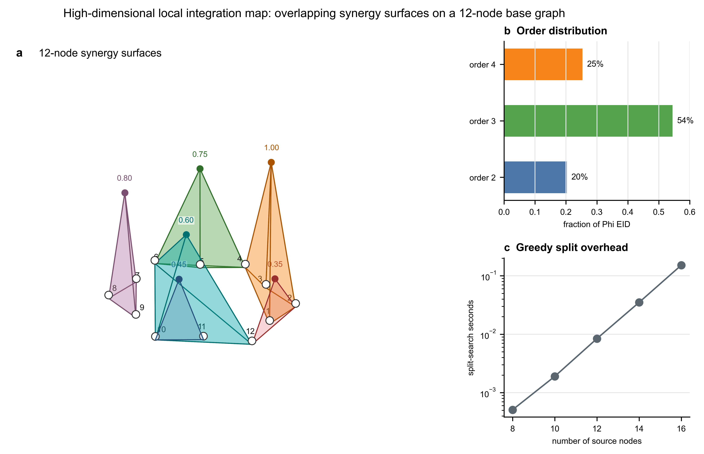

# 高维 Phi EID 层级协同可视化与耗时估计

本文在五维示例的基础上，把源变量扩展到 12 个节点，并人为设置 6 个局部协同模块，用来观察三维协同面在更高维系统上的可读性，以及贪婪分解的耗时来源。

## 1. 12 节点 synthetic synergy field

令源节点为

$$
V=\{1,\dots,12\}.
$$

这里不再枚举完整布尔 TPM，而是直接指定一个模块化的目标相关协同场：

| 模块 | 源节点 | 协同质量 |
|---|---|---:|
| 4-way | $\{1,2,3,4\}$ | 1.00 |
| 3-way | $\{4,5,6\}$ | 0.75 |
| 3-way | $\{7,8,9\}$ | 0.80 |
| 3-way | $\{6,10,12\}$ | 0.60 |
| 2-way | $\{10,11\}$ | 0.45 |
| 2-way | $\{2,12\}$ | 0.35 |

总系统级协同为

$$
\Phi^{\mathrm{EID}} = 1.00+0.75+0.80+0.60+0.45+0.35=3.95.
$$

该设定模拟多个目标分量上分别存在的局部整合信息。由于模块可以共享节点，例如节点 4、6、10、12 都参与不止一个模块，因此图中会出现重叠的协同面。

## 2. 三维协同面展示

图中每个源节点位于同一个二维底面。二源协同画成由两个源节点和顶部强度点构成的三角面；三源或四源协同画成以对应源节点为底面的棱锥。顶部高度与协同质量成正比，颜色区分不同模块。

这个图能表达两点：

1. 对 10 个以上节点，三维协同面仍能直观展示局部整合模块的位置和强度。
2. 当模块数量增加且共享节点时，遮挡和颜色混合会明显增加。因此真实高维系统中不宜一次性画出所有候选超边，更适合展示 top-k 模块、按阶数分面展示，或做可旋转交互图。

右上角显示阶数分布：

$$
p_2=0.20,\qquad p_3=0.54,\qquad p_4=0.25.
$$

也就是说，该 synthetic field 的协同预算主要落在三源模块，其次是四源模块，二源模块占比较小。

## 3. 实测贪婪分裂耗时

脚本使用闭式 synthetic synergy field，因此这里测到的是“贪婪分裂搜索本身”的耗时，不包含真实 EI 或 MI 估计器的代价。

| 源节点数 $n$ | 根层二分数量 $2^{n-1}-1$ | 实际检查二分数 | 分裂搜索耗时 |
|---:|---:|---:|---:|
| 8 | 127 | 177 | about 0.001 s |
| 10 | 511 | 571 | about 0.002 s |
| 12 | 2047 | 2135 | about 0.008 s |
| 14 | 8191 | 8387 | about 0.04 s |
| 16 | 32767 | 33395 | about 0.16 s |

12 节点主例子的完整贪婪树检查了 2533 个二分，最近几次运行耗时约 0.01--0.03 s。这个数值说明：在 synthetic 闭式函数下，分裂搜索不是瓶颈。小规模 timing 会受 Python 启动、缓存和后台负载影响，因此表中数字只作为量级参考。

## 4. 真实 PEID 高维耗时主要来自哪里

真实系统的耗时通常不是画图，也不是贪婪树 bookkeeping，而是 EI 估计调用数量：

$$
EI(X_A\to Y)
$$

必须对许多候选源子集 $A$ 计算。若完全枚举所有非空源子集，候选数是

$$
2^n-1,
$$

随维度指数增长。若限制最高阶数为 $r$，候选数变为

$$
N_{\le r}(n)=\sum_{k=1}^{r}\binom{n}{k},
$$

其主阶约为 $O(n^r)$。例如只算到四阶时：

| $n$ | $\sum_{k=1}^4 \binom{n}{k}$ |
|---:|---:|
| 8 | 162 |
| 10 | 385 |
| 12 | 793 |
| 14 | 1470 |
| 16 | 2516 |

如果还要对每个单目标节点分别计算，则 EI 调用数还要再乘以目标数，通常近似变为 $O(n^{r+1})$。例如 $n=16$、最高四阶、单目标全扫描时，大约是

$$
16\times2516=40256
$$

次 EI 调用。

每次 EI 调用本身也会随样本数 $N$、源子集维度 $k$ 和估计器类型增加。Gaussian log-det 估计通常接近

$$
O(Nk^2+k^3),
$$

而 kNN、transport map 或神经估计器一般更贵。因此真实耗时通常由两项共同决定：

$$
\text{runtime}
\approx
\#\text{EI calls}
\times
\text{cost per EI call}.
$$

## 5. 实用结论

高维时，耗时确实会随维度数量大幅增加，但主要不是因为最终的贪婪树有多少层，而是因为候选源子集和目标组合爆炸。实际可行方案应当先做候选筛选：

1. 用 pairwise EI、Jacobian interaction、Granger/PCMCI 或模型注意力筛出候选邻域；
2. 只在候选邻域内搜索二源、三源或四源模块；
3. 对每个目标只保留 top-k 候选模块；
4. 用贪婪层级分解解释已筛出的 top 模块，而不是全子集暴力枚举；
5. 图上只画 top-k 协同面，并按阶数或空间区域分面，避免三维遮挡。

因此，三维协同面适合做解释性可视化；高维计算本身需要候选剪枝、缓存 EI 结果和并行估计。
