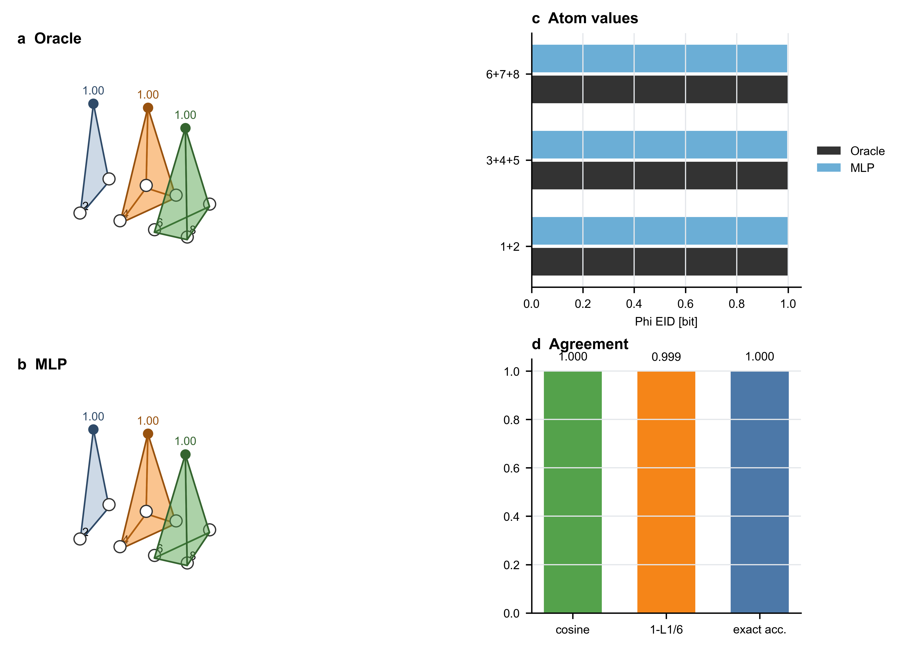

# Phi EID MLP surrogate validation

本实验构造 8 维布尔动力学，目标由三个不可约局部模块产生：
`X1 xor X2`、`X3 xor X4 xor X5`、`X6 xor X7 xor X8`。
MLP 只从生成的状态转移样本训练，随后在 uniform intervention 口径下读取 Phi EID 层次分布。

## Metrics

- Oracle total Phi: `3.000000` bits
- MLP total Phi: `2.992219` bits
- L1 difference: `0.008311` bits
- Linf difference: `0.003933` bits
- Cosine similarity: `0.999999`
- Test exact-match accuracy: `1.000000`

结论：在这个可精确枚举的高阶布尔动力学中，MLP surrogate 从数据恢复了 oracle 的 Phi EID 支持集与数值分布；因此该图可作为数据驱动读出流程的正对照。
