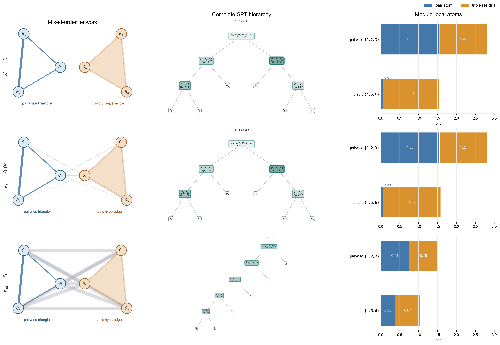

# 对比方法介绍

同一模拟数据用于比较以下方法：

- **Neural Granger**：读取非线性预测器对各历史源变量的依赖强度。
- **SHAP interaction**：衡量两个源变量对 MLP 预测的非加性交互贡献。
- **PCMCI-CMIknn**：检验控制其他历史变量后仍存在的滞后条件依赖。
- **Whole-minus-sum（WMS）**：计算
$$
\operatorname{WMS}(X,Y;Z)=I(\{X,Y\};Z)-I(X;Z)-I(Y;Z).
$$
  正值表示协同占优，负值表示冗余占优。
- **MLP+PEID**：在 MLP 近似的动力学机制上计算干预语义下的不可约联合约束。
- **MMI-PID**：在同一观测上使用
$$
S_{\mathrm{MMI}}(X,Y;Z)=I(\{X,Y\};Z)-\max\{I(X;Z),I(Y;Z)\}.
$$
- **SURD**：按目标状态分解冗余、独有信息与协同：

$$
R_{xy}(z)=\min\{i_x(z),i_y(z)\},\quad
U_x(z)=i_x(z)-R_{xy}(z),\quad
U_y(z)=i_y(z)-R_{xy}(z),\quad
S_{xy}(z)=i_{xy}(z)-\max\{i_x(z),i_y(z)\}.
$$

其中 $S_{xy}$ 为 SURD synergy。

# 共同驱动压力测试：原模型邻域的一位小数动力学

本节不重新设计动力学，只把附录 B 的原始两位小数系数局部改写为一位小数，以检验原有定性结论是否对这种表示简化稳健。$\beta\in[0,1]$ 是扫描变量，不属于固定系数。最终动力学为

$$
\begin{aligned}
w_{t+1} &= 0.8w_t + \eta^w_t,\\
x_{t+1} &= 0.4x_t + 0.8\left(\beta w_t + \sqrt{1-\beta^2}\,\xi^x_t\right) + \eta^x_t,\\
y_{t+1} &= 0.4y_t + 0.8\left(\beta w_t + \sqrt{1-\beta^2}\,\xi^y_t\right) + \eta^y_t,\\
z_{t+1} &= 0.2z_t + 1.0\sin\left(x_t y_t\right) + 0.1\beta w_t + \eta^z_t.
\end{aligned}
$$

其中 $\eta^w_t\sim\mathcal N(0,0.4^2)$、$\xi^x_t,\xi^y_t\sim\mathcal N(0,0.6^2)$、$\eta^x_t,\eta^y_t\sim\mathcal N(0,0.3^2)$、$\eta^z_t\sim\mathcal N(0,0.1^2)$。固定结构项 $1.0\sin(x_ty_t)$ 不随 $\beta$ 改变。

## 系数简化与控制协议

`0.78,0.42,0.82,0.38,0.76,0.22` 分别改为 `0.8,0.4,0.8,0.4,0.8,0.2`。原 `0.15` 位于一位小数的中点，因此只预先比较 `0.1` 与 `0.2` 两个局部候选，不扩展其他系数搜索。两个候选在五个 $\beta$ 点、两个 seeds 的预检中都保留六项主读出的趋势符号；`0.1` 的归一化斜率偏差较小，因而在完整实验前固定为正文版本。随后一次性运行 `21` 个 $\beta$ 点和 seeds `0,1,2,3`，不再按完整结果调整系数。

四维 MLP 学习完整一步转移

$$
[w_t,x_t,y_t,z_t]\mapsto[w_{t+1},x_{t+1},y_{t+1},z_{t+1}].
$$

MLP+PEID 使用 `5120` 个随机干预样本，固定 $x,y\in[-1.8,1.8]$ 的均匀干预支持，$w,z$ 从每个 $\beta$ 对应的经验支持中采样。为降低有限样本造成的源顺序不对称，$x,y$ 使用交换配对样本，同一对样本共享相同的 $w,z$ 上下文。读出直接对完整预测 $\hat z_{t+1}$ 做三阶 transport-map PEID，不提取函数 ANOVA 交互面。MMI-PID、SURD 和 WMS 使用自然轨迹 $(x_t,y_t,z_{t+1})$；图中不绘制 Oracle。各方法的绝对量纲不同，因此只在同一方法内比较 $\beta$ 趋势，或在同为 bits 的协同读出之间比较敏感性。

这里沿用仓库当前的 PEID 原子口径：不单独分配 redundancy，并令

$$
R=0,\qquad
U_x=I_{\mathrm{TM}}(x;\hat z),\qquad
U_y=I_{\mathrm{TM}}(y;\hat z),\qquad
S_{xy}=I_{\mathrm{TM}}(x,y;\hat z)-U_x-U_y.
$$

因此图中的 $U_x/U_y$ 是干预分布上的单源 EI 原子；增加样本量只能降低其估计噪声，不能保证把 MLP 学到的真实单源响应强制归零。

## 四维 MLP 的全方法对比曲线

曲线为四个配对 seeds 的均值，MLP+PEID 的 $U_x,U_y$ 和 synergy 均使用 `5120` 个干预样本。$U_x$ 的 beta 均值为 `0.0223` bits、线性斜率为 `0.0009` bits / $\beta$；$U_y$ 的 beta 均值为 `0.0169` bits、线性斜率为 `0.0062` bits / $\beta$。两条曲线因而没有明显的单调 beta 漂移，但仍保留约 `0.02` bits 的非零偏移。MLP+PEID synergy 从 $\beta=0$ 时的 `0.675` 降至 $\beta=1$ 时的 `0.593` bits，线性斜率为 `-0.0634` bits / $\beta$；SHAP interaction 从 `0.225` 增至 `0.527`，而 observational WMS、MMI-PID synergy 和 SURD synergy 总体下降。MLP 对 $z_{t+1}$ 的平均增量 $R^2$ 为 `0.937`，没有出现由拟合失效造成的整体读出崩塌。

图 1b 的关键不在于哪条曲线数值最大，而在于固定结构下各方法是否把共同驱动造成的分布变化误读为协同机制变化。随着 $\beta$ 从 `0` 增至 `1`，观测相关 $\lvert\operatorname{corr}(x,y)\rvert$ 从 `0.018` 增至 `0.859`，但结构项 $\sin(x_ty_t)$ 的系数始终为 `1.0`。在这一受控条件下，SHAP interaction 从 `0.225` 增至 `0.527`，说明它会把共同驱动改变后的预测归因放大为更强的交互；WMS 从 `0.346` 降至 `-0.032`，MMI-PID synergy 从 `0.350` 降至 `0.037`，SURD synergy 从 `0.205` 降至 `0.039`，说明观测冗余的增加会压低甚至反转这些分布依赖的协同读出。Neural Granger 的二源汇总分数从 `3.346` 降至 `3.093`，PCMCI-CMIknn 从 `0.479` 降至 `0.100`；它们仍能报告预测或条件依赖，却没有给出不可约二源协同原子，因此这些变化不能直接解释为 hyperedge 强度。

相比之下，MLP+PEID 在整个 sweep 中始终保持约 `0.6` bits 的正协同，只从 `0.675` 缓慢降至 `0.593` bits，且两个单源 EI 始终很小。已知生成机制上的 Oracle PEID 在所有 $\beta$ 下严格不变，进一步确认理论目标确实是固定的；MLP+PEID 的轻微下降应归因于有限样本、动力学拟合和变化状态分布下的估计误差，而不是被表述为完全不变。由此，图 1b 支持的最终结论是：**共同驱动可以让观测型信息分解、预测归因和成对因果读出产生方向相反的变化，但这些变化都不等同于结构协同的改变；在当前实验范围内，干预式 PEID 最接近保持固定 causal hyperedge 的强度，因此能更可靠地区分“共同出现的依赖”与“不可约的联合因果机制”。**

# 五方法协同比较

每个系统比较 WMS、SURD synergy、SHAP interaction、MLP+PEID synergy 和 MMI-PID synergy。六个 panel 分别基于 coupled standard map、Wilson–Cowan、active-rotator/Kuramoto、受控 Hénon-style、Ikeda 和 Nicholson–Bailey 动力学；各系统的经典来源分别见 [Chirikov (1979)](https://doi.org/10.1016/0370-1573(79)90023-1)、[Wilson & Cowan (1972)](https://doi.org/10.1016/S0006-3495(72)86068-5)、[Shinomoto & Kuramoto (1986)](https://doi.org/10.1143/PTP.75.1105)、[Hénon (1976)](https://doi.org/10.1007/BF01608556)、[Ikeda (1979)](https://doi.org/10.1016/0030-4018(79)90090-7) 和 [Nicholson & Bailey (1935)](https://doi.org/10.1111/j.1096-3642.1935.tb01680.x)。各 panel 内五种方法使用相同的源变量与目标变量；曲线为 `3` 个 seed 的均值，浅色区域表示 `mean ± std`。MI 本身不作为曲线绘制。

## Coupled Standard Map

**领域背景**：Standard Map 是哈密顿混沌中的经典受冲击转子模型；本文在其基础上加入第二转子及正弦差分耦合。$K$ 控制单转子非线性，$J$ 控制转子间耦合（[Chirikov, 1979](https://doi.org/10.1016/0370-1573(79)90023-1)）。

双转子 Coupled Standard Map 的冲量方程为

$$
\begin{aligned}
I_{1,t}&=K\sin q_{1,t}+J\sin(q_{2,t}-q_{1,t}),\\
I_{2,t}&=K\sin q_{2,t}-J\sin(q_{2,t}-q_{1,t}).
\end{aligned}
$$

冲量 $I_i$ 先更新动量，再由更新后的动量推进角度：

$$
\begin{aligned}
p_{i,t+1}&=\operatorname{wrap}\left(p_{i,t}+I_{i,t}\right),\\
q_{i,t+1}&=\operatorname{wrap}\left(q_{i,t}+p_{i,t+1}\right),\\
\operatorname{wrap}(a)&=\left((a+\pi)\bmod 2\pi\right)-\pi .
\end{aligned}
$$

**协同源和目标**：计算 `q1+q2->I1`。随着 $J$ 增大，两个角度对第一转子冲量的联合约束增强。SURD 在弱耦合处的大幅波动主要来自周期、多对一映射下的不稳定估计，不宜解释为真实协同。

## Wilson-Cowan Refractory Map

**领域背景**：Wilson-Cowan 模型描述兴奋性与抑制性神经元群体的平均活动。sigmoid gain $g$ 控制群体对净输入的响应陡峭程度（[Wilson & Cowan, 1972](https://doi.org/10.1016/S0006-3495(72)86068-5)）。

连续方程写为

$$
\begin{aligned}
\dot E&=-E+(1-\rho E)S\{g(w_{EE}E-w_{EI}I+P_E)\},\\
\dot I&=-I+(1-\rho I)S\{g(w_{IE}E-w_{II}I+P_I)\},
\qquad S(z)=\frac{1}{1+e^{-z}} .
\end{aligned}
$$

本实验扫描 sigmoid gain $g$，其余参数固定为

$$
\rho=0.5,\quad w_{EE}=3.2,\quad w_{EI}=2.6,\quad
w_{IE}=2.4,\quad w_{II}=1.7,\quad P_E=0.35,\quad P_I=-0.20 .
$$

**协同源和目标**：只计算 `E+I->E_tau`。目标映射为

$$
E_{t+\Delta t}
=E_t+\Delta t\left[-E_t+(1-\rho E_t)S\{g(w_{EE}E_t-w_{EI}I_t+P_E)\}\right].
$$

`gain=0` 时 $I_t$ 不影响目标，是结构零点；随着 $g$ 增大，非线性门控变陡，$E_t$ 与 $I_t$ 对目标形成更强的联合约束。

## Kuramoto Active-Rotator Phase Model

**领域背景**：Kuramoto 模型用于研究耦合振荡器的同步与锁相。Active-rotator 扩展加入周期势，$K$ 表示相位差耦合强度（[Shinomoto & Kuramoto, 1986](https://doi.org/10.1143/PTP.75.1105)）。

该 panel 使用经典 active-rotator/Kuramoto 相位动力学：

$$
\begin{aligned}
\dot{\theta}_1&=\omega_1+A\sin\theta_1+K\sin(\theta_2-\theta_1),\\
\dot{\theta}_2&=\omega_2+A\sin\theta_2,
\end{aligned}
\qquad
\omega_1=1.0,\quad \omega_2=0.9,\quad A=0.2.
$$

其中 $A\sin\theta_i$ 是周期相位势，$K\sin(\theta_2-\theta_1)$ 是相位耦合。

**协同源和目标**：所有算法只计算同一条 `theta1+theta2->dtheta1`，即

$$
\{\theta_{1,t},\theta_{2,t}\}\longrightarrow
\dot{\theta}_{1,t}.
$$

目标是第一振子的瞬时速度。该 sweep 现在覆盖
$K\in\{0,0.05,0.1,0.15,0.2,0.3,0.5,0.75,1.0,1.5,2.0\}$，
使参数范围从锁相转变区延伸到高耦合的有序同步相。

随着 $K$ 增大，系统逐渐锁相；WMS 受同步冗余影响转为负值，而 MLP+PEID 保留相位差机制的正协同。SURD 在锁相转变附近波动较大，不宜作定量解释。

## 高阶 Kuramoto：从 pairwise 边到多体相位作用

普通 Kuramoto 的每个相互作用只涉及一对振子。真正的高阶 Kuramoto 在向量场中加入不可约三体或四体项。本节实验采用的三体形式为

$$
\dot{\theta}_i
=\omega_i
+\frac{K_1}{d_i^{(1)}}\sum_j A_{ij}\sin(\theta_j-\theta_i)
+\frac{K_2}{d_i^{(2)}}\sum_{j,k}B_{ijk}
\sin(\theta_j+\theta_k-2\theta_i),
$$

其中 $\mathbf{A}$ 是 pairwise adjacency matrix，$\mathbf{B}$ 是三元 adjacency tensor。$B_{ijk}=1$ 表示 $\{i,j,k\}$ 形成一个真正的动力学超边。这里的“高阶”不能与 $\sin 2(\theta_j-\theta_i)$ 之类的二体高次谐波混淆：后者仍只涉及两个振子，前者才要求同时知道 $\theta_i,\theta_j,\theta_k$。

### 六振子混合阶 $K_{\mathrm{out}}$ 扫描：纯三体与 pairwise 子树

六振子生成机制包含两个三节点模块

$$
A=\{\theta_1,\theta_2,\theta_3\},
\qquad
B=\{\theta_4,\theta_5,\theta_6\}.
$$

模块 $A$ 是不对称 pairwise 三角形：

$$
(w_{12},w_{13},w_{23})
=c(\rho)(1,\rho,\rho),
\qquad
c(\rho)=\frac{K_{\mathrm{in}}}{2}
\sqrt{\frac{3}{1+2\rho^2}},
\qquad \rho=0.25,
$$

即 $(w_{12},w_{13},w_{23})=(1.225,0.306,0.306)$。模块 $B$ 只包含三体超边：

$$
\dot{\theta}_i
=\omega_i+K_3\sin(\theta_j+\theta_k-2\theta_i),
\qquad
\{i,j,k\}=\{4,5,6\},
$$

其中 $K_3=K_{\mathrm{in}}/\sqrt{2}=1.061$。两个模块之间加入九条全连接 pairwise 边，每条权重为 $K_{\mathrm{out}}/3$。最终只保留三个代表条件：

$$
K_{\mathrm{out}}\in\{0,0.04,5\}.
$$

三个条件统一使用 4,800 个有限时间转移训练同一容量、800 epochs 的 MLP，时间窗 $\tau=0.20$、积分步长 $0.01$、过程噪声尺度 $0.08$。MLP 对所有节点使用相同的一、二阶圆周 Fourier 特征。随后在 4,000 个独立均匀相位干预上采样 learned channel。除了 $K_{\mathrm{out}}$，初始相位、随机种子、训练预算、干预支持和概率估计预算全部固定。

EI 的输入干预分布固定为六个相位相互独立的最大熵均匀分布

$$
p_{\mathrm{do}}(\boldsymbol{\theta}^t)
=\prod_{i=1}^{6}\operatorname{Unif}(-\pi,\pi).
$$

所有 SPT 节点共享同一个六维 target：完整系统在同一未来时间窗内的 wrapped phase increment

$$
\boldsymbol{y}
=\Delta_\tau\boldsymbol{\theta}_{1:6}
=\operatorname{wrap}\!\left(
\boldsymbol{\theta}^{t+\tau}_{1:6}-\boldsymbol{\theta}^{t}_{1:6}
\right).
$$

分裂时只改变 source 子集，target 不缩减为局部模块或代表节点。MLP held-out 残差的完整协方差定义随机读出，不额外加入人为噪声下限。完整 SPT 对每个 learned dependency component 拟合一个条件 neural TM，全部 63 个非空 source 子集始终使用同一分量判定规则和同一估计预算；每个 TM 均使用 100 epochs、512 个 scrambled Sobol 评价点和 256 个边缘积分样本。TM context 在基础圆周特征之外显式加入对应的 pairwise、triadic 与候选跨边 Fourier 项；三个条件使用完全相同的特征字典。

概率通道使用同一个 MLP permutation-effect 规则发现可辨识分量，门槛预先固定为 0.25 个输出标准差。$K_{\mathrm{out}}=0$ 和 0.04 的最大跨模块效应约为 0.19，因而 learned channel 仍分成两个模块；$K_{\mathrm{out}}=5$ 明显越过门槛，六节点作为一个联合通道。该规则不读取 $K_{\mathrm{out}}$ 标签或 planted 根分区。SPT 在每个内部节点枚举全部非平凡二分并递归到单节点叶子。

作为同一批条件下的机制阶数诊断，右栏使用 degree-3 polynomial TM 对两个三节点模块各自计算 7 个 source 子集。它只负责报告模块内 pair atom 与 triple residual，不与完整树中的 neural-TM Syn 混写。两种估计都固定 0.10-bit 原生非负容差；三个条件均无负原子或超容差违例，不使用 jackknife、非负裁剪或单调投影。

| $K_{\mathrm{out}}$ | 根 $\Xi$ | 根 Syn | 根分裂 | pairwise：二阶 / 三阶 | triadic：二阶 / 三阶 |
|---:|---:|---:|:---|---:|---:|
| 0 | 6.829 | 0.000 | $\{1,2,3\}\mid\{4,5,6\}$ | 1.547 / 1.267 | 0.065 / 1.472 |
| 0.04 | 6.914 | 0.000 | $\{1,2,3\}\mid\{4,5,6\}$ | 1.548 / 1.270 | 0.065 / 1.521 |
| 5 | 8.084 | 1.765 | $\{1,2,3,4,5\}\mid\{6\}$ | 0.745 / 0.781 | 0.379 / 0.673 |

在 $K_{\mathrm{out}}=0$ 时，根 Syn 精确为 0，自由 SPT 恢复两个模块。弱连接 0.04 的物理跨边已经存在，但其效应低于统一的 learned-channel 分辨门槛；因此树仍保留平衡 3–3 结构，模块内原子相对零连接几乎不变。这一档应解释为“存在但当前模型不可分辨的弱跨模块耦合”，而不是严格断连。

当 $K_{\mathrm{out}}=5$ 时，六节点越过分量门槛，根首先分成 $\{1,2,3,4,5\}\mid\{6\}$，随后继续以 $4$–$1$、$3$–$1$、$2$–$1$ 递归，形成链式结构；根 Syn 升至 1.765 bits。因而三档在同一算法下依次表现为断连平衡树、弱连接平衡树和强连接链。

同批条件的模块内 polynomial-TM 诊断也恢复了预期阶数差异：在 0 与 0.04 下，纯三体模块的二源原子只有 0.065 bits，而三阶原子为 1.47–1.52 bits，三阶质量约占 96%。强跨边会让任意二节点共同约束完整未来，因此该模块的二源原子升至 0.379 bits；这表示跨模块信息约束增强，不表示纯三体模块内部新增了物理 pairwise 边。

已有研究显示，多体相位作用可以产生普通 pairwise 模型中没有或不稳定出现的现象：

- 同一参数下存在大量同步吸引子，最终同步度强烈依赖初始相位；
- 同步参数突然跳变并形成向上/向下扫描不同的滞回环；
- 即使 pairwise 耦合为排斥，高阶项仍可稳定同步分支；
- 两个反相同步簇使一阶序参量 $R_1$ 接近零，但二阶序参量
  $$
  R_2=\left|N^{-1}\sum_j e^{2\mathrm{i}\theta_j}\right|
  $$
  仍接近 1，并可发生突然的 $\pi$-transition；
- 近期三振子纯三体模型还报告了 devil's staircase、multistability 和 synchronization revival。

这些现象分别由三体多稳态研究、simplicial Kuramoto、multicluster 稳定性分析和双簇相变工作支持，而不是本仓库已经完成的实验结果。关键来源包括 [Tanaka & Aoyagi 2011](https://doi.org/10.1103/PhysRevLett.106.224101)、[Skardal & Arenas 2020](https://www.nature.com/articles/s42005-020-00485-0)、[Millán et al. 2020](https://doi.org/10.1103/PhysRevLett.124.218301)、[Xu & Skardal 2021](https://doi.org/10.1103/PhysRevResearch.3.013013)、[Carballosa et al. 2023](https://doi.org/10.1016/j.chaos.2023.114197) 和 [Li et al. 2026](https://doi.org/10.1103/5rg2-4xkq)。

上述 learned-dynamics SPT 短时机制实验已经完成。下一步应检验联合 TM 与共同边缘积分向更高维系统扩展时的容量和计算成本，再转向自然轨迹与集体态：同时扫描 $K_1,K_2$，记录 $R_1$、$R_2$、滞回面积和 basin occupancy，并补充 triangle-without-hyperedge、degree-preserving hyperedge permutation 与统一谐波字典对照。详细文献边界、方程和后续失败判据见[高阶 Kuramoto 调研与实验方案](../ref/higher_order_kuramoto_research.md)。

## Controlled Hénon Unique-Information Sweep

**领域背景**：Hénon 映射是经典二维耗散混沌模型（[Hénon, 1976](https://doi.org/10.1007/BF01608556)）。这里使用的是由其二次非线性构造的受控 Hénon-style 读出，而不是未经修改的经典迭代映射；该构造把显式二源交互项和单源观测通道分开。

读出定义为

$$
\mathbf{z}_{t+1}
=\left[
1-1.4x_t^2+\kappa(\lambda) x_ty_t,\;
\gamma(\lambda) y_t+\epsilon_t
\right],
\qquad
\gamma:0.3\to2.0,\quad \kappa:0.5\to0.1,\quad \sigma_\epsilon=0.5 .
$$

**协同源和目标**：计算 `x+y->z_tau`。扫描参数为 `lambda`，令单源通道 $\gamma(\lambda)y_t+\epsilon_t$ 增强，同时令显式交互项 $\kappa(\lambda)x_ty_t$ 减弱。因此该 panel 用来展示：PEID 可随真实交互减弱而下降，而 MMI-PID 仍会因为弱源单源信息增加而上升；MI 本身仍只作为诊断保存在 JSON 中，不在图中绘制。

## Ikeda Optical Cavity

**领域背景**：Ikeda 映射源自非线性光学环形腔，描述光场在逐次反馈后的演化。$u$ 控制反馈中保留的场幅（[Ikeda, 1979](https://doi.org/10.1016/0030-4018(79)90090-7)）。

Ikeda 离散映射为

$$
x_{t+1}=1+u(x_t\cos\theta_t-y_t\sin\theta_t),\qquad
y_{t+1}=u(x_t\sin\theta_t+y_t\cos\theta_t),\qquad
\theta_t=0.4-\frac{6}{1+x_t^2+y_t^2}.
$$

**协同源和目标**：只计算 `x+y->y_tau` 这一条一步映射协同读出。

该映射可写为

$$
y_{t+1}=u\,r(x_t,y_t),\qquad
r(x,y)=x\sin\theta(x,y)+y\cos\theta(x,y),
$$

其中 $u$ 主要缩放同一非线性联合响应。因此 `u=0` 是结构零点；`u>0` 后信息协同近似保持平台，而 SHAP interaction 随输出幅值增大。

## Nicholson–Bailey Host–Parasitoid Map

**领域背景**：Nicholson-Bailey 模型描述宿主与寄生蜂的世代更新。$R$ 是宿主繁殖率，$a$ 是寄生蜂攻击效率（[Nicholson & Bailey, 1935](https://doi.org/10.1111/j.1096-3642.1935.tb01680.x)）。

宿主密度 $H_t$ 与寄生蜂密度 $P_t$。离散映射为

$$
H_{t+1}=R H_t e^{-aP_t},\qquad
P_{t+1}=H_t\left(1-e^{-aP_t}\right),\qquad R=1.6.
$$

**协同源和目标**：只计算 `H+P->H_tau`。

当 $a=0$ 时，$P_t$ 不影响目标；当 $a>0$ 时，指数项形成乘性门控。随着攻击效率继续增大，指数响应逐渐饱和，因此信息协同表现为平台而非线性增长。

# 图 1c 六类经典非线性动力系统附录

本附录集中给出图 1c 六个 benchmark 的领域背景、实验方程和经典来源。正文关注参数扫描的比较结果；这里明确区分经典模型与为受控比较所作的耦合或读出改写。

## Coupled Standard Map

Standard map 是周期受冲击转子的面积保持 Poincaré 映射，也是研究哈密顿混沌、共振重叠和全局随机化的经典模型（[Chirikov, 1979](https://doi.org/10.1016/0370-1573(79)90023-1)）。本文使用两个转子，并以 $J\sin(q_{2,t}-q_{1,t})$ 引入反对称耦合：

$$
\begin{aligned}
I_{1,t}&=K\sin q_{1,t}+J\sin(q_{2,t}-q_{1,t}),\\
I_{2,t}&=K\sin q_{2,t}-J\sin(q_{2,t}-q_{1,t}),\\
p_{i,t+1}&=\operatorname{wrap}(p_{i,t}+I_{i,t}),\\
q_{i,t+1}&=\operatorname{wrap}(q_{i,t}+p_{i,t+1}).
\end{aligned}
$$

其中 $\operatorname{wrap}(a)=((a+\pi)\bmod 2\pi)-\pi$。图 1c 扫描转子间耦合 $J$，并计算 $\{q_{1,t},q_{2,t}\}\to I_{1,t}$。

## Wilson–Cowan Refractory Map

Wilson–Cowan 方程以兴奋性群体活动 $E$ 和抑制性群体活动 $I$ 描述神经群体的平均动力学，并用 sigmoid 响应表示净输入到群体激活率的转换（[Wilson & Cowan, 1972](https://doi.org/10.1016/S0006-3495(72)86068-5)）。本文使用带 refractory factor 的形式：

$$
\begin{aligned}
\dot E&=-E+(1-\rho E)S\!\left(g(w_{EE}E-w_{EI}I+P_E)\right),\\
\dot I&=-I+(1-\rho I)S\!\left(g(w_{IE}E-w_{II}I+P_I)\right),\\
S(z)&=(1+e^{-z})^{-1}.
\end{aligned}
$$

实验采用 $\Delta t=0.05$ 的一步 Euler 映射，固定 $\rho=0.5$、$(w_{EE},w_{EI},w_{IE},w_{II})=(3.2,2.6,2.4,1.7)$、$(P_E,P_I)=(0.35,-0.20)$，扫描 gain $g$，并计算 $\{E_t,I_t\}\to E_{t+\Delta t}$。

## Kuramoto Active-Rotator Phase Model

Active-rotator 模型把周期相位势与正弦相位差耦合结合起来，可描述自持振荡器或可激发元件的锁相与集体转变（[Shinomoto & Kuramoto, 1986](https://doi.org/10.1143/PTP.75.1105)）。本文的有向双振子系统为

$$
\begin{aligned}
\dot{\theta}_1&=1.0+0.2\sin\theta_1+K\sin(\theta_2-\theta_1),\\
\dot{\theta}_2&=0.9+0.2\sin\theta_2.
\end{aligned}
$$

图 1c 扫描 $K$，并计算 $\{\theta_{1,t},\theta_{2,t}\}\to\dot\theta_{1,t}$。$K=0$ 时第二振子不进入目标机制；增大 $K$ 后，相位差项引入不可分的联合响应，同时锁相也会增强观测冗余。

## Controlled Hénon-Style Readout

经典 Hénon 映射以二次折叠和耗散收缩生成二维 strange attractor（[Hénon, 1976](https://doi.org/10.1007/BF01608556)）。图 1c 使用的是受 Hénon 二次非线性启发的受控读出，而不是经典 Hénon 轨迹本身：

$$
\mathbf{z}_{t+1}
=
\begin{bmatrix}
1-1.4x_t^2+\kappa(\lambda)x_ty_t\\
\gamma(\lambda)y_t+\epsilon_t
\end{bmatrix},
\qquad
\epsilon_t\sim\mathcal N(0,0.5^2).
$$

随 $\lambda:0\to1$，$\kappa(\lambda):0.5\to0.1$ 线性减小，而 $\gamma(\lambda):0.3\to2.0$ 线性增大。该单因素路径同时削弱显式交互项并增强独立单源通道，用于检验方法能否区分 synergy 与 unique information。

## Ikeda Optical-Cavity Map

Ikeda 模型源自含非线性介质的光学环形腔，反馈相位依赖场强，因此可产生多稳态、失稳和混沌响应（[Ikeda, 1979](https://doi.org/10.1016/0030-4018(79)90090-7)）。本文使用

$$
\begin{aligned}
\theta_t&=0.4-\frac{6}{1+x_t^2+y_t^2},\\
x_{t+1}&=1+u(x_t\cos\theta_t-y_t\sin\theta_t),\\
y_{t+1}&=u(x_t\sin\theta_t+y_t\cos\theta_t).
\end{aligned}
$$

图 1c 扫描反馈保留系数 $u$，并计算 $\{x_t,y_t\}\to y_{t+1}$。$u=0$ 是结构零点；$u>0$ 时，两源通过强度依赖相位形成联合非线性响应。

## Nicholson–Bailey Host–Parasitoid Map

Nicholson–Bailey 模型是离散世代 host–parasitoid 动力学的经典起点；其指数逃逸概率来自寄生蜂随机、独立搜索宿主的假设（[Nicholson & Bailey, 1935](https://doi.org/10.1111/j.1096-3642.1935.tb01680.x)）。本文使用

$$
H_{t+1}=R H_t e^{-aP_t},
\qquad
P_{t+1}=H_t(1-e^{-aP_t}),
\qquad R=1.6.
$$

图 1c 扫描攻击效率 $a$，并计算 $\{H_t,P_t\}\to H_{t+1}$。当 $a=0$ 时，$P_t$ 不进入宿主更新；当 $a>0$ 时，$H_t$ 与 $P_t$ 通过指数存活门控共同决定下一代宿主密度。

# 附录 A：`1/0.5` 简化系数对照

正文更新前曾使用只含 `1` 和 `0.5` 的对称动力学：

$$
\begin{aligned}
w_{t+1} &= 0.5w_t + \eta^w_t,\\
x_{t+1} &= 0.5x_t + 1.0\left(\beta w_t + \sqrt{1-\beta^2}\,\xi^x_t\right) + \eta^x_t,\\
y_{t+1} &= 0.5y_t + 1.0\left(\beta w_t + \sqrt{1-\beta^2}\,\xi^y_t\right) + \eta^y_t,\\
z_{t+1} &= 0.5z_t + 1.0\sin\left(x_t y_t\right) + 0.5\beta w_t + \eta^z_t.
\end{aligned}
$$

## A.1 三维隐藏共同驱动结果

三维 MLP 不观察 $w_t$。MLP+PEID synergy 从 `0.560` 降至 `0.409` bits，线性斜率为 `-0.140` bits / $\beta$；SHAP interaction 从 `0.504` 降至 `0.383`。它们没有把共同驱动增强写成结构协同增强，但曲线的下降仍较明显。

## A.2 四维完整状态结果

四维 MLP+PEID synergy 从 `0.607` 降至 `0.424` bits，线性斜率为 `-0.177` bits / $\beta$；SHAP interaction 从 `0.259` 增至 `0.525`。这组结果保留为负面对照：显式提供共同驱动并不足以自动保证信息读出对 $\beta$ 稳定，还需要固定干预支持并隔离目标函数中的非加性交互部分。

# 附录 B：原小数系数共同驱动实验

本附录保留最早的小数系数共同驱动实验。该版本固定 `alpha=1`；其扫描设置、seeds、样本量、噪声、MLP 预算、PCMCI 设置、TM 估计器、干预支持和 Oracle 样本均与附录 A 的历史实验一致，但动力学使用原始小数系数：

$$
\begin{aligned}
w_{t+1} &= 0.78w_t + \eta^w_t,\\
x_{t+1} &= 0.42x_t + 0.82\left(\beta w_t + \sqrt{1-\beta^2}\,\xi^x_t\right) + \eta^x_t,\\
y_{t+1} &= 0.38y_t + 0.76\left(\beta w_t + \sqrt{1-\beta^2}\,\xi^y_t\right) + \eta^y_t,\\
z_{t+1} &= 0.22z_t + \sin\left(x_t y_t\right) + 0.15\beta w_t + \eta^z_t.
\end{aligned}
$$

## B.1 四维 `wxyz` MLP 结果

在原小数系数下，四维 MLP+PEID synergy 从 `beta=0` 的 `0.656` bits 降至 `beta=1` 的 `0.508` bits，线性斜率为 `-0.108` bits / beta（bootstrap 95% CI `[-0.151,-0.068]`）；SHAP interaction 从 `0.180` 增至 `0.415`，斜率为 `0.409` / beta（bootstrap 95% CI `[0.357,0.460]`）。因此，四维口径下 SHAP 对共同驱动的代理作用较敏感，而 MLP+PEID 没有把共同驱动增强解释成二源结构增强。

## B.2 三维 `xyz` MLP 结果

原小数系数的三维 MLP 隐藏 `w`，并使用固定干预支持的历史读出协议。MLP+PEID synergy 从 `0.661` bits 降至 `0.530` bits，线性斜率为 `-0.111` bits / beta（bootstrap 95% CI `[-0.146,-0.077]`）；SHAP interaction 从 `0.465` 降至 `0.349`，斜率为 `-0.0437` / beta（bootstrap 95% CI `[-0.0723,-0.0198]`）。三维 MLP 的两种读数均未随共同驱动增强而上升。

## B.3 与 `1/0.5` 简化系数版本的结论一致性

原小数系数下，`corr(x,y)` 从 `0.014` 增至 `0.905`，observational WMS 从 `0.330` 降至 `-0.0868` bits，MMI-PID synergy 从 `0.335` 降至 `0.0256` bits；固定真实结构的 Oracle+PEID synergy 始终为 `0.603` bits。与附录 A 的 `1/0.5` 系数版本做严格配对比较后，`corr(x,y)` 的 beta 斜率在两组中均为正，observational WMS 与 MMI-PID synergy 的斜率在两组中均为负，而且三个方向都达到 `4/4` seeds 一致。

因此，首次系数简化改变了部分读数的绝对值，但没有改变核心结论：共同驱动增强观测冗余，而固定的 `sin(x_ty_t)` 二源结构不随 `beta` 改变。正文的一位小数版本现在直接位于该原模型的局部邻域；附录 A--D 同时保留，便于区分系数表示简化、动力学替换、读出协议和干预样本量变化带来的影响。

# 附录 C：先前的一位小数稳健性动力学

正文更新前曾采用另一组一位小数动力学：

$$
\begin{aligned}
w_{t+1} &= 0.5w_t + \eta^w_t,\\
x_{t+1} &= 0.5x_t + 0.8\left(\beta w_t + \sqrt{1-\beta^2}\,\xi^x_t\right) + \eta^x_t,\\
y_{t+1} &= 0.5y_t + 0.8\left(\beta w_t + \sqrt{1-\beta^2}\,\xi^y_t\right) + \eta^y_t,\\
z_{t+1} &= 0.5z_t + 1.0\sin\left(x_t y_t\right) + 0.8\beta w_t + \eta^z_t.
\end{aligned}
$$

该组系数不是由附录 B 的原模型直接舍入得到，并且早期选择过程曾使用函数 ANOVA 交互预处理。为保证公平，下面只保留完全取消 ANOVA 后的直接读出结果，作为负面对照。

在四维 MLP、$x,y\in[-1.8,1.8]$ 固定干预支持下，MLP+PEID synergy 从 `0.613` 降至 `0.337` bits，absolute TV 为 `0.2756`，高于 SURD 的 `0.1026` 和 MMI-PID 的 `0.1889`。因此这组动力学不能支持“MLP+PEID synergy 最稳健”的结论。

为排除干预区间选择的影响，另扫描 $x,y\in[-a,a]$，$a\in\{0.5,0.75,1.0,1.25,1.5,1.8,2.0\}$，仍不使用函数 ANOVA。

仅最小化 absolute TV 会选中 $a=0.5$，但平均 synergy 同时被压缩到 `0.0554` bits，说明窄干预域几乎没有激活 $\sin(xy)$。要求保留非平凡 synergy 后仍选中 $a=1.8$，且 validation TV 高于 SURD 和 MMI-PID。该审计说明不能通过缩窄干预区间人为获得稳健结论，也解释了为何正文改回原模型邻域的一位小数化检验。

# 附录 D：干预样本数量鲁棒性

本附录只改变 MLP+PEID 的干预样本数 $n_I\in\{320,640,1280,2560,5120\}$。动力学、四维 MLP、训练数据、模型容量、90 epochs、21 个 $\beta$ 点、seeds `0,1,2,3` 和 $x,y\in[-1.8,1.8]$ 均保持不变。每个 $\beta\times\mathrm{seed}$ 只训练一次 MLP；五个样本量使用同一组嵌套的交换配对干预样本，因此差异只来自读出样本量。实验不使用函数 ANOVA，也不使用 Oracle 信息。

| 干预样本数 | mean $U_x$ | mean $U_y$ | TV $U_x$ | TV $U_y$ | synergy slope |
|---:|---:|---:|---:|---:|---:|
| 320 | 0.0285 | 0.0216 | 0.0867 | 0.0759 | -0.0992 |
| 640 | 0.0231 | 0.0160 | 0.0834 | 0.0541 | -0.0794 |
| 1280 | 0.0236 | 0.0172 | 0.0967 | 0.0659 | -0.0704 |
| 2560 | 0.0217 | 0.0165 | 0.1025 | 0.0692 | -0.0670 |
| 5120 | 0.0223 | 0.0169 | 0.1015 | 0.0718 | -0.0634 |

从 `320` 增至 `640` 时，$U_x/U_y$ 的平均偏移明显下降；从 `640` 继续增至 `5120` 后，均值稳定在约 `0.02/0.017` bits，没有继续趋近零。`5120` 样本时 $U_x/U_y$ 的线性斜率分别只有 `0.0009/0.0062` bits / $\beta$，说明它们没有稳定的单调 beta 趋势；但 absolute TV 并未随样本量单调下降，局部起伏主要来自各 beta 下重新训练的 MLP，而不是干预 Monte Carlo 样本不足。正文使用用户预先指定的最大样本量 `5120`，并保留这一非零偏移，不通过改变动力学、缩窄干预区间或事后平滑将其人为压到零。
