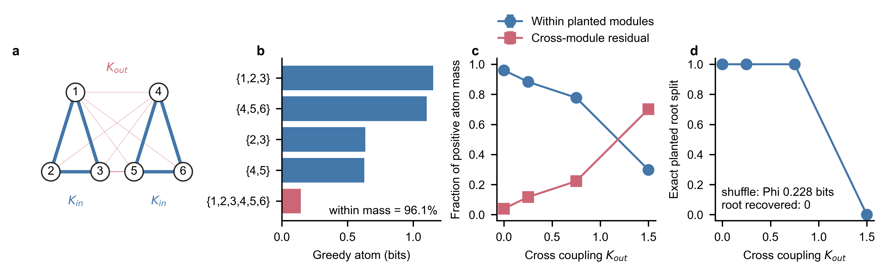

# 对比方法介绍

同一模拟数据用于比较以下方法：

- **Neural Granger**：读取非线性预测器对各历史源变量的依赖强度。
- **SHAP interaction**：衡量两个源变量对 MLP 预测的非加性交互贡献。
- **PCMCI-CMIknn**：检验控制其他历史变量后仍存在的滞后条件依赖。
- **Whole-minus-sum（WMS）**：计算
$$
\operatorname{WMS}(X,Y;Z)=I(\{X,Y\};Z)-I(X;Z)-I(Y;Z).
$$
  正值表示协同占优，负值表示冗余占优。
- **MLP+PEID**：在 MLP 近似的动力学机制上计算干预语义下的不可约联合约束。
- **MMI-PID**：在同一观测上使用
$$
S_{\mathrm{MMI}}(X,Y;Z)=I(\{X,Y\};Z)-\max\{I(X;Z),I(Y;Z)\}.
$$
- **SURD**：按目标状态分解冗余、独有信息与协同：

$$
R_{xy}(z)=\min\{i_x(z),i_y(z)\},\quad
U_x(z)=i_x(z)-R_{xy}(z),\quad
U_y(z)=i_y(z)-R_{xy}(z),\quad
S_{xy}(z)=i_{xy}(z)-\max\{i_x(z),i_y(z)\}.
$$

其中 $S_{xy}$ 为 SURD synergy。

# 共同驱动压力测试：原模型邻域的一位小数动力学

本节不重新设计动力学，只把附录 B 的原始两位小数系数局部改写为一位小数，以检验原有定性结论是否对这种表示简化稳健。$\beta\in[0,1]$ 是扫描变量，不属于固定系数。最终动力学为

$$
\begin{aligned}
w_{t+1} &= 0.8w_t + \eta^w_t,\\
x_{t+1} &= 0.4x_t + 0.8\left(\beta w_t + \sqrt{1-\beta^2}\,\xi^x_t\right) + \eta^x_t,\\
y_{t+1} &= 0.4y_t + 0.8\left(\beta w_t + \sqrt{1-\beta^2}\,\xi^y_t\right) + \eta^y_t,\\
z_{t+1} &= 0.2z_t + 1.0\sin\left(x_t y_t\right) + 0.1\beta w_t + \eta^z_t.
\end{aligned}
$$

其中 $\eta^w_t\sim\mathcal N(0,0.4^2)$、$\xi^x_t,\xi^y_t\sim\mathcal N(0,0.6^2)$、$\eta^x_t,\eta^y_t\sim\mathcal N(0,0.3^2)$、$\eta^z_t\sim\mathcal N(0,0.1^2)$。固定结构项 $1.0\sin(x_ty_t)$ 不随 $\beta$ 改变。

## 系数简化与控制协议

`0.78,0.42,0.82,0.38,0.76,0.22` 分别改为 `0.8,0.4,0.8,0.4,0.8,0.2`。原 `0.15` 位于一位小数的中点，因此只预先比较 `0.1` 与 `0.2` 两个局部候选，不扩展其他系数搜索。两个候选在五个 $\beta$ 点、两个 seeds 的预检中都保留六项主读出的趋势符号；`0.1` 的归一化斜率偏差较小，因而在完整实验前固定为正文版本。随后一次性运行 `21` 个 $\beta$ 点和 seeds `0,1,2,3`，不再按完整结果调整系数。

四维 MLP 学习完整一步转移

$$
[w_t,x_t,y_t,z_t]\mapsto[w_{t+1},x_{t+1},y_{t+1},z_{t+1}].
$$

MLP+PEID 使用 `5120` 个随机干预样本，固定 $x,y\in[-1.8,1.8]$ 的均匀干预支持，$w,z$ 从每个 $\beta$ 对应的经验支持中采样。为降低有限样本造成的源顺序不对称，$x,y$ 使用交换配对样本，同一对样本共享相同的 $w,z$ 上下文。读出直接对完整预测 $\hat z_{t+1}$ 做三阶 transport-map PEID，不提取函数 ANOVA 交互面。MMI-PID、SURD 和 WMS 使用自然轨迹 $(x_t,y_t,z_{t+1})$；图中不绘制 Oracle。各方法的绝对量纲不同，因此只在同一方法内比较 $\beta$ 趋势，或在同为 bits 的协同读出之间比较敏感性。

这里沿用仓库当前的 PEID 原子口径：不单独分配 redundancy，并令

$$
R=0,\qquad
U_x=I_{\mathrm{TM}}(x;\hat z),\qquad
U_y=I_{\mathrm{TM}}(y;\hat z),\qquad
S_{xy}=I_{\mathrm{TM}}(x,y;\hat z)-U_x-U_y.
$$

因此图中的 $U_x/U_y$ 是干预分布上的单源 EI 原子；增加样本量只能降低其估计噪声，不能保证把 MLP 学到的真实单源响应强制归零。

## 四维 MLP 的全方法对比曲线

曲线为四个配对 seeds 的均值，MLP+PEID 的 $U_x,U_y$ 和 synergy 均使用 `5120` 个干预样本。$U_x$ 的 beta 均值为 `0.0223` bits、线性斜率为 `0.0009` bits / $\beta$；$U_y$ 的 beta 均值为 `0.0169` bits、线性斜率为 `0.0062` bits / $\beta$。两条曲线因而没有明显的单调 beta 漂移，但仍保留约 `0.02` bits 的非零偏移。MLP+PEID synergy 从 $\beta=0$ 时的 `0.675` 降至 $\beta=1$ 时的 `0.593` bits，线性斜率为 `-0.0634` bits / $\beta$；SHAP interaction 从 `0.225` 增至 `0.527`，而 observational WMS、MMI-PID synergy 和 SURD synergy 总体下降。MLP 对 $z_{t+1}$ 的平均增量 $R^2$ 为 `0.937`，没有出现由拟合失效造成的整体读出崩塌。

# 五方法协同比较

每个系统比较 WMS、SURD synergy、SHAP interaction、MLP+PEID synergy 和 MMI-PID synergy。各 panel 内五种方法使用相同的源变量与目标变量；曲线为 `3` 个 seed 的均值，浅色区域表示 `mean ± std`。MI 本身不作为曲线绘制。

## Coupled Standard Map

**领域背景**：Standard Map 是哈密顿混沌中的经典受冲击转子模型。$K$ 控制单转子非线性，$J$ 控制转子间耦合。

双转子 Coupled Standard Map 的冲量方程为

$$
\begin{aligned}
I_{1,t}&=K\sin q_{1,t}+J\sin(q_{2,t}-q_{1,t}),\\
I_{2,t}&=K\sin q_{2,t}-J\sin(q_{2,t}-q_{1,t}).
\end{aligned}
$$

冲量 $I_i$ 先更新动量，再由更新后的动量推进角度：

$$
\begin{aligned}
p_{i,t+1}&=\operatorname{wrap}\left(p_{i,t}+I_{i,t}\right),\\
q_{i,t+1}&=\operatorname{wrap}\left(q_{i,t}+p_{i,t+1}\right),\\
\operatorname{wrap}(a)&=\left((a+\pi)\bmod 2\pi\right)-\pi .
\end{aligned}
$$

**协同源和目标**：计算 `q1+q2->I1`。随着 $J$ 增大，两个角度对第一转子冲量的联合约束增强。SURD 在弱耦合处的大幅波动主要来自周期、多对一映射下的不稳定估计，不宜解释为真实协同。

## Wilson-Cowan Refractory Map

**领域背景**：Wilson-Cowan 模型描述兴奋性与抑制性神经元群体的平均活动。sigmoid gain $g$ 控制群体对净输入的响应陡峭程度。

连续方程写为

$$
\begin{aligned}
\dot E&=-E+(1-\rho E)S\{g(w_{EE}E-w_{EI}I+P_E)\},\\
\dot I&=-I+(1-\rho I)S\{g(w_{IE}E-w_{II}I+P_I)\},
\qquad S(z)=\frac{1}{1+e^{-z}} .
\end{aligned}
$$

本实验扫描 sigmoid gain $g$，其余参数固定为

$$
\rho=0.5,\quad w_{EE}=3.2,\quad w_{EI}=2.6,\quad
w_{IE}=2.4,\quad w_{II}=1.7,\quad P_E=0.35,\quad P_I=-0.20 .
$$

**协同源和目标**：只计算 `E+I->E_tau`。目标映射为

$$
E_{t+\Delta t}
=E_t+\Delta t\left[-E_t+(1-\rho E_t)S\{g(w_{EE}E_t-w_{EI}I_t+P_E)\}\right].
$$

`gain=0` 时 $I_t$ 不影响目标，是结构零点；随着 $g$ 增大，非线性门控变陡，$E_t$ 与 $I_t$ 对目标形成更强的联合约束。

## Kuramoto Active-Rotator Phase Model

**领域背景**：Kuramoto 模型用于研究耦合振荡器的同步与锁相。Active-rotator 扩展加入周期势，$K$ 表示相位差耦合强度。

该 panel 使用经典 active-rotator/Kuramoto 相位动力学：

$$
\begin{aligned}
\dot{\theta}_1&=\omega_1+A\sin\theta_1+K\sin(\theta_2-\theta_1),\\
\dot{\theta}_2&=\omega_2+A\sin\theta_2,
\end{aligned}
\qquad
\omega_1=1.0,\quad \omega_2=0.9,\quad A=0.2.
$$

其中 $A\sin\theta_i$ 是周期相位势，$K\sin(\theta_2-\theta_1)$ 是相位耦合。

**协同源和目标**：所有算法只计算同一条 `theta1+theta2->dtheta1`，即

$$
\{\theta_{1,t},\theta_{2,t}\}\longrightarrow
\dot{\theta}_{1,t}.
$$

目标是第一振子的瞬时速度。该 sweep 现在覆盖
$K\in\{0,0.05,0.1,0.15,0.2,0.3,0.5,0.75,1.0,1.5,2.0\}$，
使参数范围从锁相转变区延伸到高耦合的有序同步相。

随着 $K$ 增大，系统逐渐锁相；WMS 受同步冗余影响转为负值，而 MLP+PEID 保留相位差机制的正协同。SURD 在锁相转变附近波动较大，不宜作定量解释。

## 模块化 Kuramoto 的 Greedy 层级恢复正对照

前一小节只考察两个振子到一个瞬时速度 target 的二源协同。为了在真实数据应用之前检验系统级 Greedy 层级分解能否恢复已知连续动力学模块，进一步构造六振子模块化 Kuramoto 系统：

$$
\dot{\theta}_i
=\omega_i+\sum_{j\ne i}K_{ij}\sin(\theta_j-\theta_i),
$$

并植入两个已知模块

$$
C_1=\{1,2,3\},\qquad C_2=\{4,5,6\}.
$$

群内总耦合固定为 $K_{\mathrm{in}}=1.5$，只扫描跨模块耦合
$K_{\mathrm{out}}\in\{0,0.25,0.75,1.5\}$。每个 seed 使用相同的 1200 个独立均匀相位干预、固有频率和标准化过程噪声，由已知向量场直接生成短时相位速度。每个振子以 $(\cos\theta_i,\sin\theta_i)$ 作为一个源块，用 degree-2 polynomial triangular transport map 估计全部 63 个非空源子集的 EI，再调用与真实数据分析相同的 `greedy_phi_atoms`。

*图：模块化 Kuramoto 正对照。a，蓝色为两个 planted 群内耦合模块，红色为跨群耦合。b，在 $K_{\mathrm{out}}=0$ 的代表 seed 中，两个最大 Greedy atom 恰好为 $\{1,2,3\}$ 和 $\{4,5,6\}$。c，跨群耦合增强时，正 atom 质量由群内模块连续转移到跨模块残差；点和误差线为三个配对 seeds 的均值与 SEM。d，planted 根分裂在弱到中等跨群耦合时稳定恢复，但在 $K_{\mathrm{out}}=K_{\mathrm{in}}$ 时消失。*

| $K_{\mathrm{out}}$ | planted 根分裂 | 群内 atom 质量 | 跨模块质量 | 根层跨模块残差 |
|---:|---:|---:|---:|---:|
| 0.00 | 3/3 | $0.960\pm0.002$ | $0.040\pm0.002$ | $0.145\pm0.009$ bits |
| 0.25 | 3/3 | $0.883\pm0.005$ | $0.117\pm0.005$ | $0.454\pm0.018$ bits |
| 0.75 | 3/3 | $0.777\pm0.006$ | $0.223\pm0.006$ | $0.864\pm0.029$ bits |
| 1.50 | 0/3 | $0.299\pm0.001$ | $0.701\pm0.001$ | $1.273\pm0.019$ bits |

在 $K_{\mathrm{out}}=0$ 的代表 seed 中，系统级 $\Phi$ 为 3.663 bits，96.1% 的正 atom 质量位于 planted 模块内。target shuffle 后 $\Phi$ 降至 0.228 bits，根分裂变为五振子对单振子，不再恢复 planted 模块。全部条件的层级闭合误差低于 $5\times10^{-16}$ bits。

因此，该正对照说明：Greedy 层级分解不是无条件输出预设社区；它在两个模块确实近似动力学可分时恢复它们，并在跨群作用增大时把质量转移到跨模块残差，在原分区失去动力学优势时停止恢复。不过，标准 Kuramoto 的多条边会共享节点，而 Greedy 输出是一棵不重叠二叉树，因此该实验验证的是动力学模块恢复，不是所有 pairwise 边的一一唯一分解。完整实验设计、原子结果和边界见[模块化 Kuramoto 已知动力学说明](../ref/kuramoto_greedy_hierarchy_known_dynamics.md)。

## 高阶 Kuramoto：从 pairwise 边到多体相位作用

普通 Kuramoto 的每个相互作用只涉及一对振子。真正的高阶 Kuramoto 在向量场中加入不可约三体或四体项。最适合下一步已知真值实验的三体形式为

$$
\dot{\theta}_i
=\omega_i
+\frac{K_1}{d_i^{(1)}}\sum_j A_{ij}\sin(\theta_j-\theta_i)
+\frac{K_2}{d_i^{(2)}}\sum_{j,k}B_{ijk}
\sin(\theta_j+\theta_k-2\theta_i),
$$

其中 $\mathbf{A}$ 是 pairwise adjacency matrix，$\mathbf{B}$ 是三元 adjacency tensor。$B_{ijk}=1$ 表示 $\{i,j,k\}$ 形成一个真正的动力学超边。这里的“高阶”不能与 $\sin 2(\theta_j-\theta_i)$ 之类的二体高次谐波混淆：后者仍只涉及两个振子，前者才要求同时知道 $\theta_i,\theta_j,\theta_k$。

### 二元边与三元超边的同层级辨识

按照这一形式，进一步完成了一个五振子 mixed-order 正对照。已知向量场同时植入一个对称 pairwise 模块和一个对称三体模块：

$$
\begin{aligned}
\dot{\theta}_1&=\omega_1+K_1\sin(\theta_2-\theta_1),\\
\dot{\theta}_2&=\omega_2+K_1\sin(\theta_1-\theta_2),\\
\dot{\theta}_i&=\omega_i+K_2\sin(\theta_j+\theta_k-2\theta_i),
\qquad i,j,k\in\{3,4,5\},\ i\ne j\ne k.
\end{aligned}
$$

真值分别是二阶模块 $C_2=\{\theta_1,\theta_2\}$ 和三阶超边
$C_3=\{\theta_3,\theta_4,\theta_5\}$。两个模块之间另加归一化强度
$K_{\mathrm{out}}=0.04$ 的弱 pairwise coupling；它用于检验近似模块，而不是把 planted 分区设为完全断开。

实验不再从真值向量场直接读取一个标量 target。每个 seed 先从独立均匀初始相位生成 4800 个有限时随机转移，积分步长为 $0.01$，预测跨度为 $\tau=0.2$，每一步加入强度 $0.08$ 的过程噪声。随后用这些转移拟合非线性动力学模型。模型输入为五个振子的圆周状态，输出为完整五维未来相位变化

$$
\mathbf{Y}
=\Delta_\tau\boldsymbol{\theta}_{1:5}
=\operatorname{wrap}\!\left(
\boldsymbol{\theta}_{t+\tau}-\boldsymbol{\theta}_t
\right).
$$

使用未来变化而不是绝对未来相位，是因为短时连续动力学的绝对 next state 被 identity/persistence 主导：审计中即使把 $\tau$ 增至 2，五个 singleton EI 之和仍超过 whole EI，使根 $\Phi$ 为负。未来变化仍包含所有五个振子的响应，但去除了平凡的状态复制。

拟合完成后，另取 3600 个独立均匀相位干预输入学习到的动力学模型，并从 held-out 残差协方差中采样随机响应。代表 seed 的 held-out 圆周 MAE 为 $0.072$ rad；三个 seeds 为 $0.066$–$0.074$ rad。

高维 polynomial TM 已先行审计，但在 16 维圆周 source dictionary 和五维 target 上退化：degree-3 joint TM 的 EI 被压到 0，degree-2 TM 又只能识别 pairwise 通道。因此本实验使用可扩展的替代估计：对每个 source subset 拟合相同容量的非线性条件均值模型，并在未参与拟合的后 $1/3$ 样本上用多元 Gaussian log-det 熵差估计 EI。该方法保留完整五维 target，但假设 held-out 条件残差可用 Gaussian 协方差概括。

31 个 subset 分别拟合会产生有限样本偏差，甚至使原始 plug-in 值短暂落到 0 以下；这违反当前 PEID 推导中的非负性，不能解释为真实负信息。进入 Greedy 前，对全部 $\Phi(S)$ 做最小向上可行投影，使每个 subset 同时满足

$$
\widetilde{\Phi}(S)\ge 0,
\qquad
\widetilde{\Phi}(S)\ge
\max_{S=L\mathbin{\dot\cup}R}
\left\{
\widetilde{\Phi}(L)+\widetilde{\Phi}(R)
\right\}.
$$

因此该修正可以向正偏，但不会保留任何负 $\Phi$。三个真实条件 seeds 的根修正量为 $0.094$–$0.234$ bits；所有 subset 的修正量均保存在结果文件中，不能解释为观测到的信息。随后使用

$$
\Phi(S)=\mathrm{EI}(S)-\sum_{i\in S}\mathrm{EI}(\{i\}),
$$

再枚举全部非平凡二分 $S=L\cup R$，选择使

$$
C(L,R)=\Phi(L)+\Phi(R)
$$

最大的切分。若最优 $C(L,R)\le10^{-5}$ bits，当前节点终止；否则保留残差并递归处理。投影后只使用 $10^{-8}$ bits 的数值闭合容忍度，不再用较大的负残差阈值掩盖估计不一致。

*图：从学习到的 mixed-order Kuramoto 动力学恢复 Greedy 层级。a，蓝色 pairwise edge、橙色 triadic hyperedge 与灰色弱跨模块连接共同产生五维未来相位变化 target。b，代表 seed 的根节点和两个子节点候选均按 $C(L,R)$ 降序排列。根节点从 15 个候选中选择 $\{1,2\}\mid\{3,4,5\}$。二元节点只能切成 singleton，因而结构性停止；三元节点的三个原始 plug-in 候选受到有限样本负偏，但在进入 Greedy 前均按 $\Phi\ge0$ 的理论约束投影为 0，因此停止为 triadic 原子。这里的 0 表示数学可行域边界，不表示数据或拟合过程没有噪声。*

| Greedy 输出 | 均值 $\pm$ SEM | 结构解释 |
|---|---:|---|
| 根层整合残差 $\{1,2,3,4,5\}$ | $0$ bits | 单调投影后的最佳切分完全分配根 $\Phi$ |
| 二阶原子 $\{1,2\}$ | $1.943\pm0.023$ bits | planted pairwise coupling |
| 三阶原子 $\{3,4,5\}$ | $2.542\pm0.198$ bits | planted symmetric triadic hyperedge |
| 其他正原子 | 0 | 未检出非植入组合 |

在代表 seed 中，根 $\Phi=4.379$ bits，正确切分捕获同为
$4.379$ bits；第二名为 $2.390$ bits。递归后得到
$\Phi(\{1,2\})=1.989$ bits 和
$\Phi(\{3,4,5\})=2.390$ bits。三个 seeds 在四个配对条件——无扰动、仅过程噪声、仅弱跨模块连接、二者同时存在——中均恢复 planted 根切分，共 $12/12$ 次。真实条件的三个 target shuffle 根 $\Phi$ 均为 0。投影后的层级闭合误差为机器精度，但这一闭合依赖上述显式单调修正。

因此，这个例子不再是“真值向量场到标量读出”的理想演示，而是数据生成、动力学拟合、独立干预和层级分解相互分离的 learned-dynamics 正对照。证据支持：在当前噪声和弱连接范围内，根层 `2+3` 分区稳定恢复。证据不支持：当前 Gaussian readout 可无偏替代高维 TM，或单调投影的修正量可以忽略。当前真值模块仍互不重叠；共享节点的边与超边继续受不重叠二叉树限制。完整方程、EI 表、估计失败和修正诊断见[混合阶 Kuramoto 已知动力学说明](../ref/mixed_order_kuramoto_hierarchy.md)。

已有研究显示，多体相位作用可以产生普通 pairwise 模型中没有或不稳定出现的现象：

- 同一参数下存在大量同步吸引子，最终同步度强烈依赖初始相位；
- 同步参数突然跳变并形成向上/向下扫描不同的滞回环；
- 即使 pairwise 耦合为排斥，高阶项仍可稳定同步分支；
- 两个反相同步簇使一阶序参量 $R_1$ 接近零，但二阶序参量
  $$
  R_2=\left|N^{-1}\sum_j e^{2\mathrm{i}\theta_j}\right|
  $$
  仍接近 1，并可发生突然的 $\pi$-transition；
- 近期三振子纯三体模型还报告了 devil's staircase、multistability 和 synchronization revival。

这些现象分别由三体多稳态研究、simplicial Kuramoto、multicluster 稳定性分析和双簇相变工作支持，而不是本仓库已经完成的实验结果。关键来源包括 [Tanaka & Aoyagi 2011](https://doi.org/10.1103/PhysRevLett.106.224101)、[Skardal & Arenas 2020](https://www.nature.com/articles/s42005-020-00485-0)、[Millán et al. 2020](https://doi.org/10.1103/PhysRevLett.124.218301)、[Xu & Skardal 2021](https://doi.org/10.1103/PhysRevResearch.3.013013)、[Carballosa et al. 2023](https://doi.org/10.1016/j.chaos.2023.114197) 和 [Li et al. 2026](https://doi.org/10.1103/5rg2-4xkq)。

上述 learned-dynamics 与 Greedy 短时机制实验已经完成。下一步应解决高维 TM 退化与 subset EI 单调修正问题，再转向自然轨迹与集体态：同时扫描 $K_1,K_2$，记录 $R_1$、$R_2$、滞回面积和 basin occupancy，并补充 triangle-without-hyperedge、degree-preserving hyperedge permutation 与统一谐波字典对照。详细文献边界、方程和后续失败判据见[高阶 Kuramoto 调研与实验方案](../ref/higher_order_kuramoto_research.md)。

## Controlled Hénon Unique-Information Sweep

**领域背景**：Hénon 映射是经典二维耗散混沌模型。这里使用受控 Hénon-style 读出，把显式二源交互项和单源观测通道分开。

读出定义为

$$
\mathbf{z}_{t+1}
=\left[
1-1.4x_t^2+\kappa(\lambda) x_ty_t,\;
\gamma(\lambda) y_t+\epsilon_t
\right],
\qquad
\gamma:0.3\to2.0,\quad \kappa:0.5\to0.1,\quad \sigma_\epsilon=0.5 .
$$

**协同源和目标**：计算 `x+y->z_tau`。扫描参数为 `lambda`，令单源通道 $\gamma(\lambda)y_t+\epsilon_t$ 增强，同时令显式交互项 $\kappa(\lambda)x_ty_t$ 减弱。因此该 panel 用来展示：PEID 可随真实交互减弱而下降，而 MMI-PID 仍会因为弱源单源信息增加而上升；MI 本身仍只作为诊断保存在 JSON 中，不在图中绘制。

## Ikeda Optical Cavity

**领域背景**：Ikeda 映射源自非线性光学环形腔，描述光场在逐次反馈后的演化。$u$ 控制反馈中保留的场幅。

Ikeda 离散映射为

$$
x_{t+1}=1+u(x_t\cos\theta_t-y_t\sin\theta_t),\qquad
y_{t+1}=u(x_t\sin\theta_t+y_t\cos\theta_t),\qquad
\theta_t=0.4-\frac{6}{1+x_t^2+y_t^2}.
$$

**协同源和目标**：只计算 `x+y->y_tau` 这一条一步映射协同读出。

该映射可写为

$$
y_{t+1}=u\,r(x_t,y_t),\qquad
r(x,y)=x\sin\theta(x,y)+y\cos\theta(x,y),
$$

其中 $u$ 主要缩放同一非线性联合响应。因此 `u=0` 是结构零点；`u>0` 后信息协同近似保持平台，而 SHAP interaction 随输出幅值增大。

## Nicholson–Bailey Host–Parasitoid Map

**领域背景**：Nicholson-Bailey 模型描述宿主与寄生蜂的世代更新。$R$ 是宿主繁殖率，$a$ 是寄生蜂攻击效率。

宿主密度 $H_t$ 与寄生蜂密度 $P_t$。离散映射为

$$
H_{t+1}=R H_t e^{-aP_t},\qquad
P_{t+1}=H_t\left(1-e^{-aP_t}\right),\qquad R=1.6.
$$

**协同源和目标**：只计算 `H+P->H_tau`。

当 $a=0$ 时，$P_t$ 不影响目标；当 $a>0$ 时，指数项形成乘性门控。随着攻击效率继续增大，指数响应逐渐饱和，因此信息协同表现为平台而非线性增长。

# 附录 A：`1/0.5` 简化系数对照

正文更新前曾使用只含 `1` 和 `0.5` 的对称动力学：

$$
\begin{aligned}
w_{t+1} &= 0.5w_t + \eta^w_t,\\
x_{t+1} &= 0.5x_t + 1.0\left(\beta w_t + \sqrt{1-\beta^2}\,\xi^x_t\right) + \eta^x_t,\\
y_{t+1} &= 0.5y_t + 1.0\left(\beta w_t + \sqrt{1-\beta^2}\,\xi^y_t\right) + \eta^y_t,\\
z_{t+1} &= 0.5z_t + 1.0\sin\left(x_t y_t\right) + 0.5\beta w_t + \eta^z_t.
\end{aligned}
$$

## A.1 三维隐藏共同驱动结果

三维 MLP 不观察 $w_t$。MLP+PEID synergy 从 `0.560` 降至 `0.409` bits，线性斜率为 `-0.140` bits / $\beta$；SHAP interaction 从 `0.504` 降至 `0.383`。它们没有把共同驱动增强写成结构协同增强，但曲线的下降仍较明显。

## A.2 四维完整状态结果

四维 MLP+PEID synergy 从 `0.607` 降至 `0.424` bits，线性斜率为 `-0.177` bits / $\beta$；SHAP interaction 从 `0.259` 增至 `0.525`。这组结果保留为负面对照：显式提供共同驱动并不足以自动保证信息读出对 $\beta$ 稳定，还需要固定干预支持并隔离目标函数中的非加性交互部分。

# 附录 B：原小数系数共同驱动实验

本附录保留最早的小数系数共同驱动实验。该版本固定 `alpha=1`；其扫描设置、seeds、样本量、噪声、MLP 预算、PCMCI 设置、TM 估计器、干预支持和 Oracle 样本均与附录 A 的历史实验一致，但动力学使用原始小数系数：

$$
\begin{aligned}
w_{t+1} &= 0.78w_t + \eta^w_t,\\
x_{t+1} &= 0.42x_t + 0.82\left(\beta w_t + \sqrt{1-\beta^2}\,\xi^x_t\right) + \eta^x_t,\\
y_{t+1} &= 0.38y_t + 0.76\left(\beta w_t + \sqrt{1-\beta^2}\,\xi^y_t\right) + \eta^y_t,\\
z_{t+1} &= 0.22z_t + \sin\left(x_t y_t\right) + 0.15\beta w_t + \eta^z_t.
\end{aligned}
$$

## B.1 四维 `wxyz` MLP 结果

在原小数系数下，四维 MLP+PEID synergy 从 `beta=0` 的 `0.656` bits 降至 `beta=1` 的 `0.508` bits，线性斜率为 `-0.108` bits / beta（bootstrap 95% CI `[-0.151,-0.068]`）；SHAP interaction 从 `0.180` 增至 `0.415`，斜率为 `0.409` / beta（bootstrap 95% CI `[0.357,0.460]`）。因此，四维口径下 SHAP 对共同驱动的代理作用较敏感，而 MLP+PEID 没有把共同驱动增强解释成二源结构增强。

## B.2 三维 `xyz` MLP 结果

原小数系数的三维 MLP 隐藏 `w`，并使用固定干预支持的历史读出协议。MLP+PEID synergy 从 `0.661` bits 降至 `0.530` bits，线性斜率为 `-0.111` bits / beta（bootstrap 95% CI `[-0.146,-0.077]`）；SHAP interaction 从 `0.465` 降至 `0.349`，斜率为 `-0.0437` / beta（bootstrap 95% CI `[-0.0723,-0.0198]`）。三维 MLP 的两种读数均未随共同驱动增强而上升。

## B.3 与 `1/0.5` 简化系数版本的结论一致性

原小数系数下，`corr(x,y)` 从 `0.014` 增至 `0.905`，observational WMS 从 `0.330` 降至 `-0.0868` bits，MMI-PID synergy 从 `0.335` 降至 `0.0256` bits；固定真实结构的 Oracle+PEID synergy 始终为 `0.603` bits。与附录 A 的 `1/0.5` 系数版本做严格配对比较后，`corr(x,y)` 的 beta 斜率在两组中均为正，observational WMS 与 MMI-PID synergy 的斜率在两组中均为负，而且三个方向都达到 `4/4` seeds 一致。

因此，首次系数简化改变了部分读数的绝对值，但没有改变核心结论：共同驱动增强观测冗余，而固定的 `sin(x_ty_t)` 二源结构不随 `beta` 改变。正文的一位小数版本现在直接位于该原模型的局部邻域；附录 A--D 同时保留，便于区分系数表示简化、动力学替换、读出协议和干预样本量变化带来的影响。

# 附录 C：先前的一位小数稳健性动力学

正文更新前曾采用另一组一位小数动力学：

$$
\begin{aligned}
w_{t+1} &= 0.5w_t + \eta^w_t,\\
x_{t+1} &= 0.5x_t + 0.8\left(\beta w_t + \sqrt{1-\beta^2}\,\xi^x_t\right) + \eta^x_t,\\
y_{t+1} &= 0.5y_t + 0.8\left(\beta w_t + \sqrt{1-\beta^2}\,\xi^y_t\right) + \eta^y_t,\\
z_{t+1} &= 0.5z_t + 1.0\sin\left(x_t y_t\right) + 0.8\beta w_t + \eta^z_t.
\end{aligned}
$$

该组系数不是由附录 B 的原模型直接舍入得到，并且早期选择过程曾使用函数 ANOVA 交互预处理。为保证公平，下面只保留完全取消 ANOVA 后的直接读出结果，作为负面对照。

在四维 MLP、$x,y\in[-1.8,1.8]$ 固定干预支持下，MLP+PEID synergy 从 `0.613` 降至 `0.337` bits，absolute TV 为 `0.2756`，高于 SURD 的 `0.1026` 和 MMI-PID 的 `0.1889`。因此这组动力学不能支持“MLP+PEID synergy 最稳健”的结论。

为排除干预区间选择的影响，另扫描 $x,y\in[-a,a]$，$a\in\{0.5,0.75,1.0,1.25,1.5,1.8,2.0\}$，仍不使用函数 ANOVA。

仅最小化 absolute TV 会选中 $a=0.5$，但平均 synergy 同时被压缩到 `0.0554` bits，说明窄干预域几乎没有激活 $\sin(xy)$。要求保留非平凡 synergy 后仍选中 $a=1.8$，且 validation TV 高于 SURD 和 MMI-PID。该审计说明不能通过缩窄干预区间人为获得稳健结论，也解释了为何正文改回原模型邻域的一位小数化检验。

# 附录 D：干预样本数量鲁棒性

本附录只改变 MLP+PEID 的干预样本数 $n_I\in\{320,640,1280,2560,5120\}$。动力学、四维 MLP、训练数据、模型容量、90 epochs、21 个 $\beta$ 点、seeds `0,1,2,3` 和 $x,y\in[-1.8,1.8]$ 均保持不变。每个 $\beta\times\mathrm{seed}$ 只训练一次 MLP；五个样本量使用同一组嵌套的交换配对干预样本，因此差异只来自读出样本量。实验不使用函数 ANOVA，也不使用 Oracle 信息。

| 干预样本数 | mean $U_x$ | mean $U_y$ | TV $U_x$ | TV $U_y$ | synergy slope |
|---:|---:|---:|---:|---:|---:|
| 320 | 0.0285 | 0.0216 | 0.0867 | 0.0759 | -0.0992 |
| 640 | 0.0231 | 0.0160 | 0.0834 | 0.0541 | -0.0794 |
| 1280 | 0.0236 | 0.0172 | 0.0967 | 0.0659 | -0.0704 |
| 2560 | 0.0217 | 0.0165 | 0.1025 | 0.0692 | -0.0670 |
| 5120 | 0.0223 | 0.0169 | 0.1015 | 0.0718 | -0.0634 |

从 `320` 增至 `640` 时，$U_x/U_y$ 的平均偏移明显下降；从 `640` 继续增至 `5120` 后，均值稳定在约 `0.02/0.017` bits，没有继续趋近零。`5120` 样本时 $U_x/U_y$ 的线性斜率分别只有 `0.0009/0.0062` bits / $\beta$，说明它们没有稳定的单调 beta 趋势；但 absolute TV 并未随样本量单调下降，局部起伏主要来自各 beta 下重新训练的 MLP，而不是干预 Monte Carlo 样本不足。正文使用用户预先指定的最大样本量 `5120`，并保留这一非零偏移，不通过改变动力学、缩窄干预区间或事后平滑将其人为压到零。
