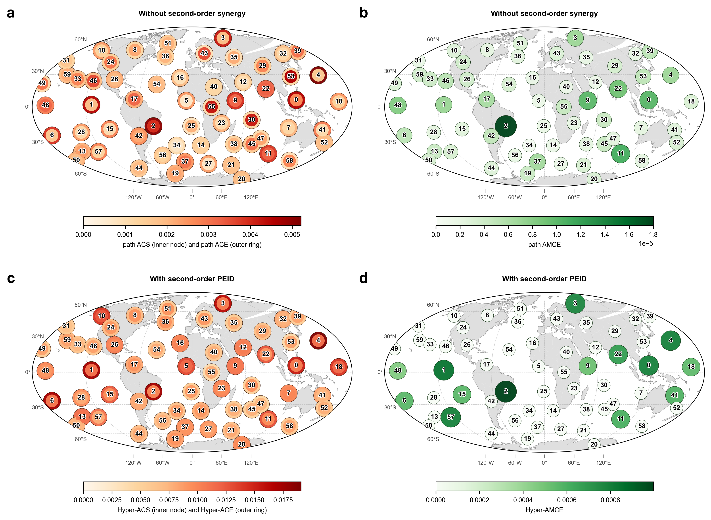
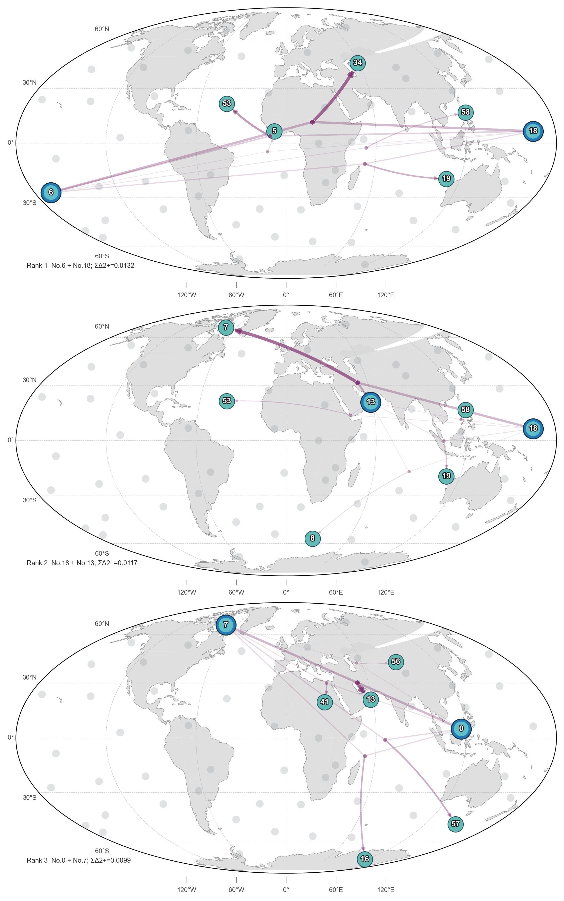
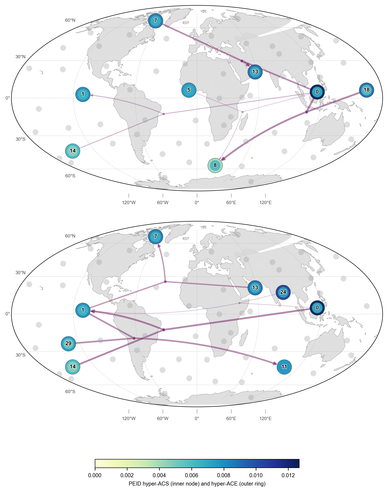
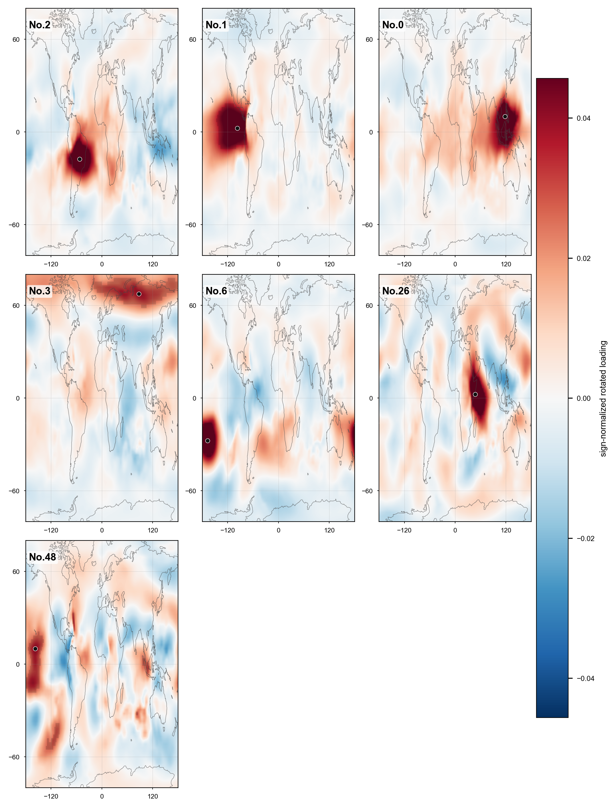
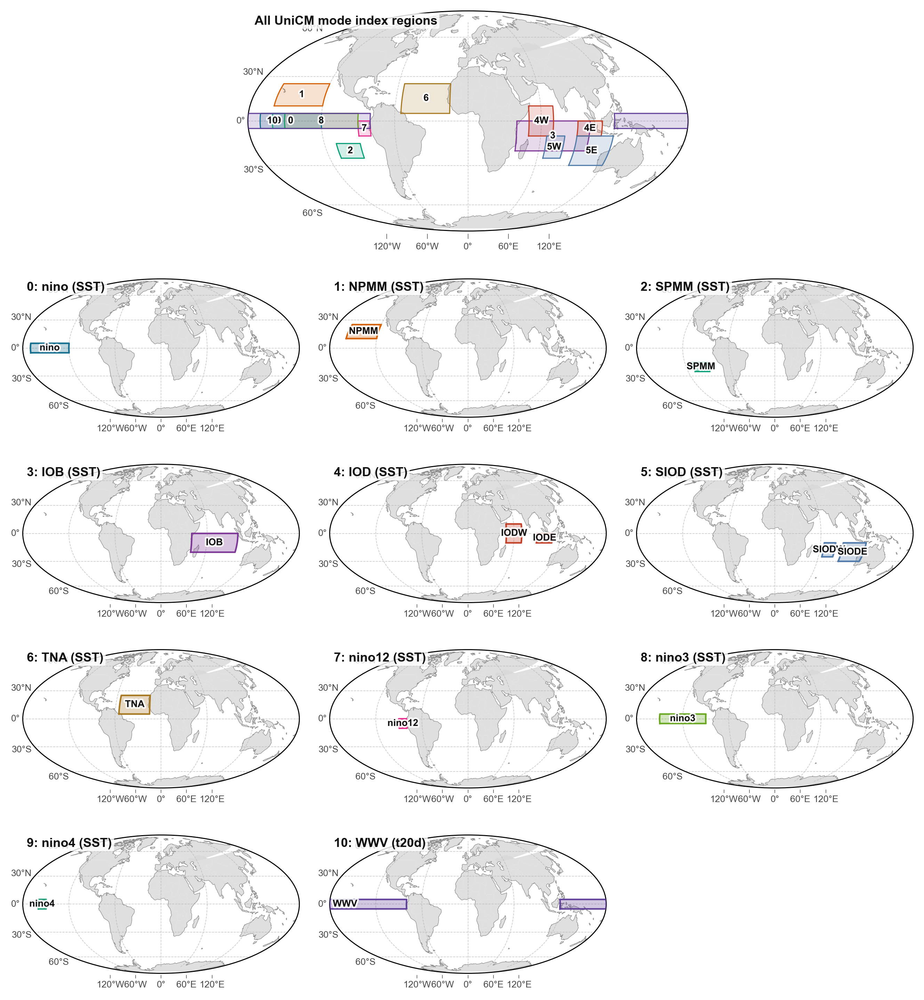
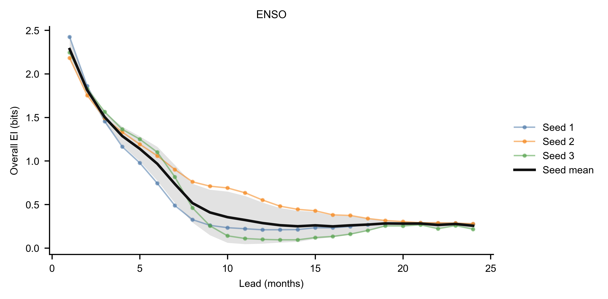
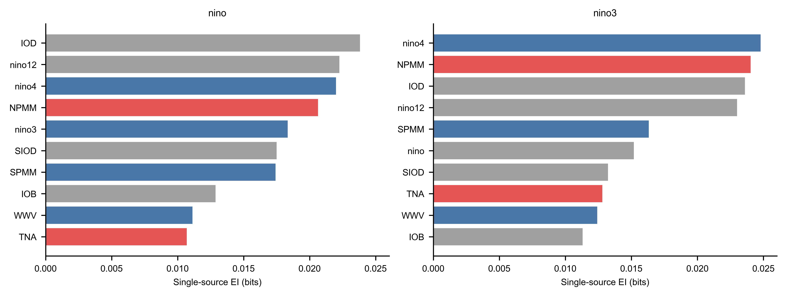
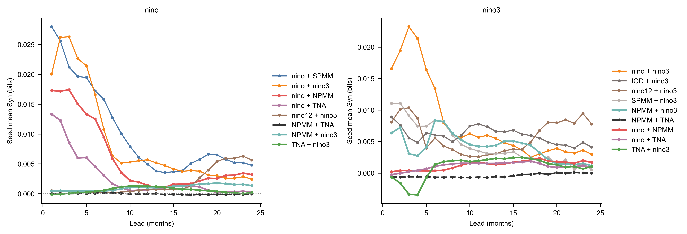
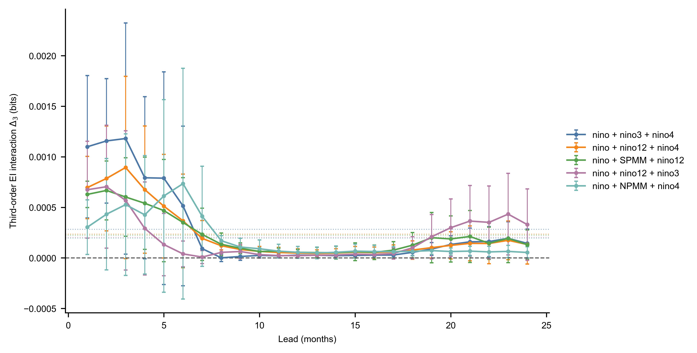

# Part 2: Runge 与 UniCM ENSO 时空因果机制证据

## Runge 因果网：二阶协同改变了哪些节点

这一组实验放在最前面，因为它直接检验 PEID 二阶协同对 gateway / mediator 解释的影响。实验使用 Runge 等人 [R1] 的 NCEP SLP 口径下得到的 60 维周尺度 Varimax 分量，输入最近 4 周状态，预测下一周状态；随后比较两种读出：

- 不考虑二阶协同时，只用 pairwise MLP-TM-EI 构造路径效应，得到 path ACE / AMCE。
- 考虑二阶协同时，用 PEID 的二阶增量补充 pairwise 路径效应，得到 Hyper-ACE / Hyper-AMCE。

非线性读出使用同一组 60 维周尺度分量。保存运行中的 MLP/Ridge 融合模型 test RMSE 为 `0.714863`、MAE 为 `0.569984`、相关系数为 `0.450806`；相对 tuned Ridge 的 RMSE 改进为 `0.001376`，block bootstrap 95% CI 为 `[0.000893, 0.001825]`，单侧 \(p=0.0002\)。该提升很小，只用于支持“预测器没有失效，可以作为结构读出模型”，不应解释为显著提升天气或气候预测技能。



*图 1. 不考虑二阶协同与考虑二阶协同后的 Runge 地理对比。A、B：pairwise MLP-TM-EI path-effect；C、D：加入二阶协同后的 PEID Hyper-ACE / Hyper-ACS 与 Hyper-AMCE。节点位置来自对应 Varimax loading 的高载荷中心。*

图 1 比柱状排序更直接：加入二阶协同后，gateway 的高值区仍保留 Indo-Pacific、东太平洋、热带大西洋等热带核心节点，但源侧强度在更多远端模态上被抬高；mediator 图的变化更明显，Hyper-AMCE 不再只反映 pairwise path product，而更多反映节点是否经常作为二阶协同源成员参与目标读出。按当前结果文件，gateway 排序的 Spearman / Kendall 相关为 `0.8678` / `0.6780`，top-5 有 4 个节点重合；mediator 排序相关为 `0.9044` / `0.8531`，top-5 只重合 No.0 和 No.2。

因此，二阶 PEID 没有推翻 pairwise path-effect，而是把解释重心从“单源路径强度”推进到“哪些空间模态需要和另一个源一起看”。空间分布的作用是给 No. 标签定下解释边界。No.0 位于海洋大陆/东印度洋附近，可理解为 Walker 环流西侧上升支和 Indo-Pacific 暖池对流区；No.1 对应东太平洋 ENSO 区；No.2 对应热带大西洋相关模态。ENSO 与 Walker 环流是全球遥相关的经典源区 [R2]，热带热源激发的大尺度罗斯贝波响应也为“热带异常影响远端中高纬”的解释提供动力学背景 [R3]。但是这些 No. 节点是旋转 PCA/Varimax 空间模态，不是地面站点或单一气候指数；低排名或未标注节点只能先按空间载荷位置理解，不能直接命名成确定气候过程。

### 二源协同超边

MLP-TM-EI/PEID 的源对综合排序按显著正二阶 \(\Delta_2\) target 求和。前三个源对为 `{No.6, No.18}`、`{No.18, No.13}` 和 `{No.0, No.7}`，total positive \(\Delta_2\) 分别为 `0.013160`、`0.011660` 和 `0.009892`。



*图 2. MLP-TM-EI/PEID 中按总正二阶协同排序最高的三个源对及其各自前五个正协同 target。紫色汇合点表示二源联合读出；面板角标标出源变量和目标变量的预测时间间隔。当前 Runge 读出使用 latest source，即 \(X_t \rightarrow X_{t+1}\)，所以图中超边均为 1 周间隔。汇合点沿源对到目标的路径交错展开，箭头宽度和颜色深浅随 \(\Delta_2\) 增大而增强；节点位置来自对应 Varimax loading 的高载荷中心。*



*图 3. No.0 与 No.1 附近的二阶 PEID 协同关系。节点外圈表示 hyper-ACE，内圈表示 hyper-ACS；紫色汇合箭头表示显著正二阶协同超边，面板角标中的 \(\Delta t=1\) week 表示 latest source \(X_t\) 到目标 \(X_{t+1}\) 的时间间隔。灰色小点只提供空间参照。*

二阶 PEID 进一步问一个更强的问题：目标模态的变化，是否需要两个源模态一起看才解释得更好。图 3 中的紫色超边不是风场轨迹，也不是能量沿线传播路径，而是“两个空间模态联合起来比两个单独模态之和提供更多信息”的统计关系。当前图上的 \(\Delta t=1\) week 也限制了地理遥相关解释：跨洋或跨半球超边不能被说成异常在 1 周内从源区物理传播到目标区，更稳妥的解释是同一周背景态、低频模态记忆、共同驱动或已有遥相关型态对下一周目标读出的统计增量。No.0 相关超边有较强可读性：海洋大陆位于 Indo-Pacific 暖池和 Walker 环流上升支附近，这一区域的深对流和潜热释放容易影响大尺度环流 [R5]；ENSO 的 atmospheric bridge 也说明热带太平洋异常可以通过大气桥传到远端海盆 [R4]。因此，`{No.0, No.18} -> No.8`、`{No.0, No.14} -> No.1` 这类关系更适合作为 Indo-Pacific 背景态与远端模态共同调制目标区域的候选信号，而不是短时传播证据。

但这还不是机制证明。印度洋偶极子会改变 ENSO 与印度夏季风之间的关系 [R6]，IOD 本身也对应热带印度洋的东西向异常模态 [R7]；ENSO 与年循环的相互作用还可以产生 combination mode [R8]。这些文献支持“两个气候模态联合影响第三个响应”的物理可能性，但不能自动证明每一条 PEID 超边都是真实大气过程。本文因此只把这些超边解释为可验证假说：它们提示哪些源对值得继续做季节分层、ENSO/IOD 位相分层和响应面检验。

### Runge 指标公式

记 \(n=60\) 为 Runge Varimax 分量数，\(E_{ij}\) 为源分量 \(i\) 到下一步目标分量 \(j\) 的 pairwise MLP-TM-EI。先把负值和自环去掉，再按谱半径缩放得到非负路径矩阵 \(A\)。总路径效应用有限路径和表示：

```math
T=\sum_{\ell=1}^{L} A^\ell .
```

这里 \(T_{ij}\) 不是单条直接边，而是从 \(i\) 出发、经过最多 \(L\) 步传播后到达 \(j\) 的累计影响。于是三个 Runge-style 指标为：

```math
\mathrm{ACE}(i)=\frac{1}{n-1}\sum_{j\ne i}T_{ij},
\qquad
\mathrm{ACS}(i)=\frac{1}{n-1}\sum_{j\ne i}T_{ji}.
```

```math
\mathrm{AMCE}(m)=\frac{1}{(n-1)(n-2)}
\sum_{\substack{s\ne m,\ t\ne m\\ s\ne t}}
A_{sm}T_{mt}.
```

ACE 看一个分量作为源头能往外影响多少对象，ACS 看一个分量作为目标被多少对象影响，AMCE 看一个分量是否常处在“别人先到它、再由它传出去”的中介位置。简单说，ACE 是 outgoing gateway，ACS 是 incoming susceptibility，AMCE 是 mediator。

图中的 PEID Hyper-ACE / Hyper-ACS / Hyper-AMCE 是在上面 pairwise 路径口径上加入二阶协同。对源集合 \(K\) 和目标 \(t\)，协同增量用 Möbius 反演定义：

```math
\Delta_K(t)=\sum_{\emptyset\ne A\subseteq K}(-1)^{|K|-|A|}
EI(X_A\rightarrow X_t).
```

显著的高阶超边按源成员均分后计入节点分数：

```math
\mathrm{Hyper\text{-}ACE}(i)=
\frac{1}{n-1}\sum_{\substack{(K,t):\,i\in K}}
\frac{|\Delta_K(t)|}{|K|}.
```

```math
\mathrm{Hyper\text{-}ACS}(i)=
\frac{1}{n-1}\sum_{\substack{(K,t):\,t=i}}
|\Delta_K(i)|.
```

```math
\mathrm{Hyper\text{-}AMCE}(m)=
\mathrm{AMCE}(m)+
\frac{1}{n-1}\sum_{\substack{(K,t):\,m\in K,\ |K|\ge 2}}
\frac{|\Delta_K(t)|}{|K|}.
```

这些 Hyper 指标的意思也很直接：如果一个分量经常出现在“两个源一起看才有额外信息”的组合里，它的源侧或中介侧重要性就会被抬高；如果它经常是这种协同关系的目标，Hyper-ACS 就会更高。

### 分量载荷



*图 4. ACE、ACS、AMCE 前五节点并集的全球 SLP Varimax loading。红色方向经过符号统一；黑色半透明区域标出高正载荷核心区。*

图 4 给 No. 标签定下解释口径：No.0、No.1、No.2、No.26、No.48 可以结合 Runge 原文和载荷位置做气候解释；No.3、No.6 等高 ACE 节点则先作为强传播空间模态处理。除非经过季节、相位和独立资料验证，本文不把低排名或未标注分量解释成确定的气候指数。

## UniCM ENSO 实验口径

这里分析的是 frozen UniCM Modeformer learned mechanism，不是 reanalysis 预测技能评估，也不是单个历史事件归因。每个干预样本同时采样 12 个历史月份和 11 个 UniCM mode 维度，形成 `(B, 12, 11)` 的 bounded uniform 最大熵输入，历史张量写入 Modeformer encoder 的 12 个月历史段，未来 24 个月由 decoder 自回归生成。

核心配置如下：

| Item | Value |
|---|---|
| checkpoint seeds | `1, 2, 3` |
| current intervention samples | `8192` |
| intervention support | all 12 historical months x 11 mode dimensions sampled independently from `[-4, 4]` |
| sampling seed | `20260619` |
| bootstrap repeats | `200` |
| target mode | ENSO |
| source modes | ENSO, NPMM, SPMM, IOB, IOD, SIOD, TNA, nino12, nino3, nino4, WWV |

整体 EI 使用 flattened full-history source，即 132 维历史 mode 输入，对每个 lead 的 ENSO 输出估计 `EI(history; target_lead)`。先定义二源 Syn：

```math
\mathrm{Syn}_{ij}=EI_{ij}-EI_i-EI_j.
```

再用布尔子集格 Möbius 反演定义三源 interaction：

```math
\Delta_{ijk}=EI_{ijk}-EI_{ij}-EI_{ik}-EI_{jk}+EI_i+EI_j+EI_k.
```

所有这些读数都使用 Gaussian log-det 估计，适合作为 full-history 机制筛查；它们不等同于最终的非线性 transport-map PEID 分解。

## Mode 地理含义



*图 5. UniCM mode 输入的地理区域。ENSO 相关指数来自赤道太平洋不同经向区段；NPMM、SPMM 和 TNA 提供太平洋经向模态与热带北大西洋背景；IOD/SIOD/IOB 表示印度洋盆地和偶极型 SST 结构。*

这张图是解释后续 EI/Syn 的基础。`nino3`、`nino4` 和 `nino12` 不是 ENSO 之外的独立外部强迫，而是赤道太平洋内部空间结构的不同读数。因此当 `ENSO + nino3` 或 `ENSO + nino4` 出现高 Syn 时，更自然的解释是 ENSO 的当前强度需要和东西向 SST 型态一起读，才能判断未来几个月的演变。

## Overall EI: ENSO 信息主要集中在短中期

| Target | mean EI 1..24 | mean EI 6..18 | Pearson min | Spearman min | top-3 overlap min |
|---|---:|---:|---:|---:|---:|
| ENSO | 0.617162 | 0.395603 | 0.950 | 0.482 | 3 |



*图 6. ENSO target 的 full-history overall EI lead 曲线。彩色细线为 checkpoint seed，黑线为 seed mean，阴影为 seed standard deviation。*

这张图说明，UniCM learned mechanism 对 ENSO 的有效信息主要集中在 lead 1 到 6 个月。短 lead 的 EI 明显高于后期，符合 ENSO 预测中短期记忆强、长期不确定性上升的物理直觉。三个 checkpoint 的曲线形状相近，Pearson min 达到 `0.950`；但 Spearman min 只有 `0.482`，说明不同 checkpoint 对具体 lead 排序仍不够稳定。因此 overall EI 可以支持“短中期记忆强”的方向性判断，但不能把每个 lead 的细粒度排序解释得太重。

## 单源 EI

| Target | self EI | strongest non-self sources | NPMM EI | TNA EI |
|---|---:|---|---:|---:|
| ENSO | 0.473612 | nino12 0.015768; nino3 0.015599; IOD 0.013361; SPMM 0.012534 | 0.011671 | 0.005806 |



*图 7. ENSO target 的单源 EI lead 曲线。左图单独显示 ENSO self source；右图显示按 24 个月平均 EI 选出的非自身 Top-5，并保留 NPMM/TNA。实线和浅色带分别为 checkpoint seed mean 和 standard deviation。*

单源 EI 曲线显示，ENSO 自身历史在短 lead 占绝对主导，但随后快速衰减。排除自身后，`nino3`、`nino12` 和 IOD 的 EI 随 lead 增长并在较长 lead 位于前列，NPMM 则在中期达到较高水平后回落；这些长 lead 曲线的 checkpoint 波动也明显扩大，因此不宜过度解释精细排序。TNA 的曲线始终较低，更稳妥的说法是，它可能只在 ENSO 背景态或其他太平洋/印度洋模态共同存在时提供弱增量。

## 二源 Syn

| Target | Source pair | rank | mean Syn 1..24 | Syn seed SD | 95% CI | seed rank range | joint EI 1..24 | left EI 1..24 | right EI 1..24 |
|---|---|---:|---:|---:|---|---|---:|---:|---:|
| ENSO | ENSO + nino3 | 1 | 0.005216 | 0.000672 | [0.003545, 0.006886] | 1-3 | 0.494427 | 0.473612 | 0.015599 |
| ENSO | ENSO + nino4 | 2 | 0.005194 | 0.002359 | [-0.000666, 0.011054] | 1-4 | 0.489874 | 0.473612 | 0.011068 |
| ENSO | ENSO + SPMM | 3 | 0.004559 | 0.002518 | [-0.001697, 0.010815] | 2-5 | 0.490705 | 0.473612 | 0.012534 |
| ENSO | ENSO + IOD | 4 | 0.004278 | 0.004353 | [-0.006535, 0.015091] | 1-19 | 0.491251 | 0.473612 | 0.013361 |
| ENSO | ENSO + NPMM | 5 | 0.002686 | 0.002452 | [-0.003404, 0.008777] | 4-9 | 0.487969 | 0.473612 | 0.011671 |
| ENSO | ENSO + nino12 | 6 | 0.002589 | 0.001873 | [-0.002064, 0.007241] | 3-11 | 0.491968 | 0.473612 | 0.015768 |
| ENSO | ENSO + TNA | 8 | 0.001499 | 0.000294 | [0.000768, 0.002230] | 7-9 | 0.480917 | 0.473612 | 0.005806 |
| ENSO | NPMM + TNA | 55 | -0.000139 | 0.000141 | [-0.000488, 0.000210] | 44-55 | 0.017338 | 0.011671 | 0.005806 |



*图 8. ENSO target 的 mode-pair Syn lead 曲线。实线为每个 lead 的 seed mean；同色浅虚线为该 pair 在 lead 1..24 上的平均 Syn.*

这张图的核心信息很直接：模型不是只看“ENSO 现在有多强”，还在看“暖异常更偏东、偏中太平洋，还是和其他海盆背景态一起出现”。前 1 到 7 个月，`ENSO + nino3` 和 `ENSO + nino4` 的 Syn 明显更高，说明 ENSO 的短期未来演变对赤道太平洋东西向 SST 结构很敏感。同样强度的 ENSO，如果空间型态不同，后续几个月的增长、衰减和位相演变也可能不同。

这个解释和 ENSO diversity 文献一致。Trenberth and Stepaniak [1] 指出，单一 ENSO 指数不足以描述事件演变，需要额外刻画中东太平洋 SST 梯度；Capotondi et al. [2] 把事件间差异总结为 ENSO 的振幅、空间型态、生命周期和触发机制差异；Ren and Jin [3] 进一步用 Niño3/Niño4 组合区分两类 ENSO。Kao and Yu [4] 与 Ashok et al. [5] 则分别从 EP/CP ENSO 和 ENSO Modoki 角度说明，中太平洋型和东太平洋型事件不能简单当作同一种 ENSO 强度的线性放大。

因此，`nino3` 和 `nino4` 更适合被解释为 ENSO 内部空间型态的调制因子，而不是 ENSO 之外的独立强迫源。曲线在 9 到 12 个月后整体贴近零，说明这种额外协同信息主要集中在短中期；到更长 lead，模型已经很难从这些二源组合里读出稳定的增量。


## 三源 interaction: 高阶增量仍依赖 ENSO 背景态

三源 interaction 已在同一组 8192-sample cache 上重算，覆盖 11 个 source mode 的全部 165 个无序三元组和 24 个 leads。

| Rank | Source triple | mean delta3 | seed SD | seed rank range | positive seeds | joint EI |
|---:|---|---:|---:|---|---:|---:|
| 1 | ENSO + nino3 + nino4 | 0.000282 | 0.000185 | 1-10 | 3/3 | 0.511657 |
| 2 | ENSO + nino12 + nino4 | 0.000235 | 0.000111 | 4-9 | 3/3 | 0.508868 |
| 3 | ENSO + SPMM + nino12 | 0.000225 | 0.000140 | 2-8 | 3/3 | 0.509713 |
| 4 | ENSO + nino12 + nino3 | 0.000203 | 0.000177 | 1-63 | 3/3 | 0.514345 |
| 5 | ENSO + NPMM + nino4 | 0.000195 | 0.000165 | 3-14 | 3/3 | 0.504753 |



*图 9. 平均三阶 interaction 排名前五的 lead 曲线。点线为三个 checkpoint seed 的均值；同色虚线为该三元组在全部 lead 和 seed 上的平均值。*

8192 结果的 top-10 仍有 `10/10` 个三元组包含 ENSO 自身历史，因此“高阶增量依赖 ENSO 背景态”的方向未变。但是三源细排名并未收敛：1024→8192 的 165 项 rank Spearman 仅为 `0.016`，top-5 只重合 `1/5`，top-10 只重合 `2/10`；原 1024 rank 1 的 `ENSO + TNA + nino4` 在 8192 下为 rank `8`。因此三源结果只能支持背景态层面的弱结论，不能支持具体 top triple 的稳定机制排序。

## 参考文献

[1] Trenberth, K. E., & Stepaniak, D. P. (2001). Indices of El Niño Evolution. *Journal of Climate*, 14(8), 1697-1701. https://doi.org/10.1175/1520-0442(2001)014%3C1697:LIOENO%3E2.0.CO;2

[2] Capotondi, A., Wittenberg, A. T., Newman, M., Di Lorenzo, E., Yu, J.-Y., Braconnot, P., Cole, J., Dewitte, B., Giese, B., Guilyardi, E., Jin, F.-F., Karnauskas, K., Kirtman, B., Lee, T., Schneider, N., Xue, Y., & Yeh, S.-W. (2015). Understanding ENSO Diversity. *Bulletin of the American Meteorological Society*, 96(6), 921-938. https://doi.org/10.1175/BAMS-D-13-00117.1

[3] Ren, H.-L., & Jin, F.-F. (2011). Niño indices for two types of ENSO. *Geophysical Research Letters*, 38, L04704. https://doi.org/10.1029/2010GL046031

[4] Kao, H.-Y., & Yu, J.-Y. (2009). Contrasting Eastern-Pacific and Central-Pacific Types of ENSO. *Journal of Climate*, 22(3), 615-632. https://doi.org/10.1175/2008JCLI2309.1

[5] Ashok, K., Behera, S. K., Rao, S. A., Weng, H., & Yamagata, T. (2007). El Niño Modoki and its possible teleconnection. *Journal of Geophysical Research: Oceans*, 112, C11007. https://doi.org/10.1029/2006JC003798

[R1] Runge, J., Petoukhov, V., Donges, J. F., Hlinka, J., Jajcay, N., Vejmelka, M., Hartman, D., Marwan, N., Palus, M., & Kurths, J. (2015). Identifying causal gateways and mediators in complex spatio-temporal systems. *Nature Communications*, 6, 8502. https://doi.org/10.1038/ncomms9502

[R2] Bjerknes, J. (1969). Atmospheric teleconnections from the equatorial Pacific. *Monthly Weather Review*, 97(3), 163-172. https://doi.org/10.1175/1520-0493(1969)097%3C0163:ATFTEP%3E2.3.CO;2

[R3] Hoskins, B. J., & Karoly, D. J. (1981). The steady linear response of a spherical atmosphere to thermal and orographic forcing. *Journal of the Atmospheric Sciences*, 38(6), 1179-1196. https://doi.org/10.1175/1520-0469(1981)038%3C1179:TSLROA%3E2.0.CO;2

[R4] Alexander, M. A., Bladé, I., Newman, M., Lanzante, J. R., Lau, N.-C., & Scott, J. D. (2002). The atmospheric bridge: The influence of ENSO teleconnections on air-sea interaction over the global oceans. *Journal of Climate*, 15(16), 2205-2231. https://doi.org/10.1175/1520-0442(2002)015%3C2205:TABTIO%3E2.0.CO;2

[R5] Neale, R., & Slingo, J. (2003). The Maritime Continent and its role in the global climate: A GCM study. *Journal of Climate*, 16(5), 834-848. https://doi.org/10.1175/1520-0442(2003)016%3C0834:TMCAIR%3E2.0.CO;2

[R6] Ashok, K., Guan, Z., & Yamagata, T. (2001). Impact of the Indian Ocean Dipole on the relationship between the Indian monsoon rainfall and ENSO. *Geophysical Research Letters*, 28(23), 4499-4502. https://doi.org/10.1029/2001GL013294

[R7] Saji, N. H., Goswami, B. N., Vinayachandran, P. N., & Yamagata, T. (1999). A dipole mode in the tropical Indian Ocean. *Nature*, 401, 360-363. https://doi.org/10.1038/43854

[R8] Stuecker, M. F., Timmermann, A., Jin, F.-F., McGregor, S., & Ren, H.-L. (2013). A combination mode of the annual cycle and the El Niño/Southern Oscillation. *Nature Geoscience*, 6, 540-544. https://doi.org/10.1038/ngeo1826
