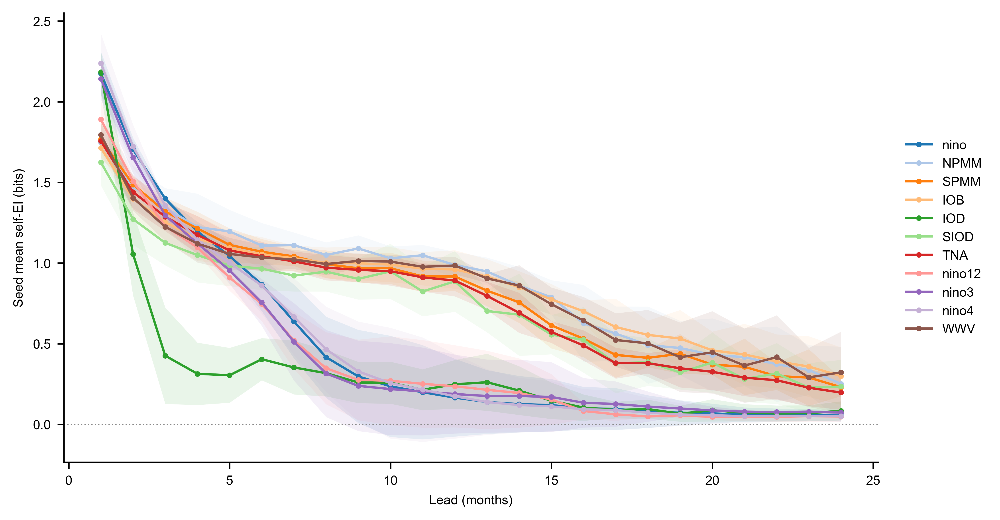
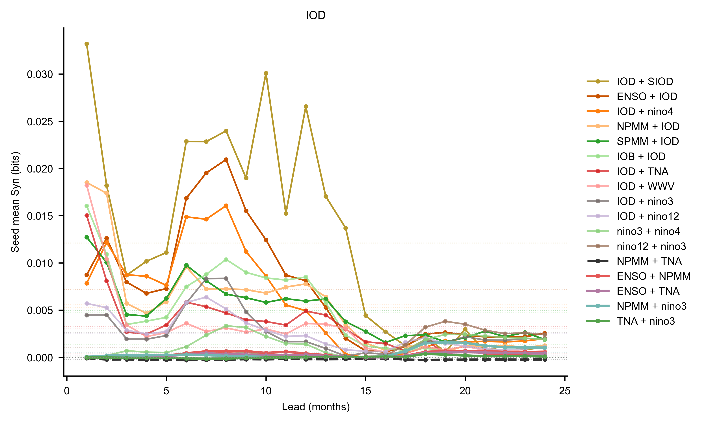

# Part 2: Runge 与 UniCM ENSO 时空因果机制证据

## Runge SLP：ACE/ACS 的原文口径与 MLP+PEID 对齐

这一组实验只展示 ACE 和 ACS，不再展示 AMCE 或一阶/二阶消融图。目的很窄：在同一套 1948-2026 NCEP SLP 周尺度 Varimax 分量上，对比 Runge 等人 [R1] 的线性 causal gateway / susceptibility 算法，与当前 MLP+PEID 的非线性 Hyper-ACE / Hyper-ACS 读数。输入为 60 维 component，使用最近 4 周状态预测下一周状态。

数据处理统一到旧实验口径：删除 2 月 29 日，按 365-day calendar day 做逐格点多年均值和标准差标准化，再沿时间轴线性去趋势。随后在 1948-2026 数据上重新拟合 60 个 Varimax component，并生成周尺度 component scores。MLP/Ridge 融合读出模型也在新数据上重训；有效 lagged samples 为 `4074`，验证集 RMSE / correlation 为 `0.70420 / 0.45116`。

Runge 面板使用原文算法的核心步骤：先用 PC-stable parent selection 得到 sparse causal graph，再用线性 SEM 估计跨 lag causal effect。此前本地复现误把 `run_pcmci` 的最终 MCI `p_matrix` 当成 parent set，导致 No.3 排名异常偏高；这里已改为 `run_pc_stable` parents，再做稀疏线性回归和 link-density threshold。修正后，1948-2026 新数据上 No.3 从 ACE 第 5、ACS 第 3 降为 ACE 第 12、ACS 第 13。

记 \(C_{ij}\) 为源分量 \(i\) 到目标分量 \(j\) 的跨 lag 最大绝对 causal effect，则 Runge 原文口径下

$$
\mathrm{ACE}_{\mathrm{Runge}}(i)=\frac{1}{n-1}\sum_{j\ne i}C_{ij},
\qquad
\mathrm{ACS}_{\mathrm{Runge}}(i)=\frac{1}{n-1}\sum_{j\ne i}C_{ji},
\qquad n=60 .
$$

MLP+PEID 面板使用同一套 1948-2026 component scores，但读数来自非线性 MLP 干预。PEID 候选设置为旧口径：`candidate_top_sources=14`、`candidate_target_topk=10`、`order_max=2`、`null_reps=20`、显著门槛 \(|z|\ge2\)。记 \(EI_{i\to j}\) 为一阶有效信息，\(Syn_{K\Rightarrow j}^{\mathrm{EID}}\) 为二源集合 \(K\) 对目标 \(j\) 的 EID 协同项：

$$
Syn_{K\Rightarrow j}^{\mathrm{EID}}
=
EI\bigl(X_t^K\to X_{t+1}^{(j)}\bigr)
-\sum_{a\in K}EI\bigl(X_t^{(a)}\to X_{t+1}^{(j)}\bigr).
$$

图中的 Hyper-ACE 和 Hyper-ACS 保留一阶 EI 基线，并只加入满足 \(|z_{K\Rightarrow j}|\ge2\) 的二阶协同项：

$$
\mathrm{Hyper\text{-}ACE}(i)=
\frac{1}{n-1}\left[
\sum_j|EI_{i\to j}|
+\sum_{\substack{(K,j):\,i\in K,\ |K|=2,\ |z_{K\Rightarrow j}|\ge2}}
\frac{|Syn_{K\Rightarrow j}^{\mathrm{EID}}|}{|K|}
\right],
$$

$$
\mathrm{Hyper\text{-}ACS}(i)=
\frac{1}{n-1}\left[
\sum_s|EI_{s\to i}|
+\sum_{\substack{(K,j):\,j=i,\ |K|=2,\ |z_{K\Rightarrow i}|\ge2}}
|Syn_{K\Rightarrow i}^{\mathrm{EID}}|
\right].
$$

这两个 Hyper 指标是一步预测读出上的直接一阶边和显著二阶超边聚合，不计算“二阶超边影响一个节点后再沿 causal graph 多步传播”的高阶路径中心性。当前原始量纲下二阶项整体只占一阶项约 `1.61%`，因此主排序主要由一阶 EI 决定；二阶项主要提供小幅修正。


*图 1. 同一套 1948-2026 SLP component 上，修正后的 Runge 2015 PC-stable ACE/ACS 与 MLP+PEID Hyper-ACE/Hyper-ACS 对比。外圈表示 ACE 或 Hyper-ACE，内圈表示 ACS 或 Hyper-ACS。两个面板使用独立 colorbar，因为线性 SEM 与 MLP+PEID 的数值尺度不同；b 面板的 0 号 Hyper-ACE 是单点极值，色标截断在非极值最大值，右端箭头表示仍有超上限值。*

修正后的 Runge 方法 ACE top-3 是 `No.1/0/16`，ACS top-3 是 `No.0/1/26`；MLP+PEID 的 ACE top-3 是 `component_01/02/04`，ACS top-3 是 `component_11/04/01`。源侧 ACE 仍有低阶热带节点重合，但目标侧 ACS 的差别更明显。需要保留两个限制：第一，修正后的 PC-stable graph 仍不等于原文 Fig. 4 的逐项复刻；第二，60 个 Varimax component 的编号不是官方固定标签，当前只对少数论文讨论节点做了视觉校准，因此不能把低排名或未校准节点直接命名为确定气候过程。

## UniCM ENSO 实验口径

这里分析的是 frozen UniCM Modeformer learned mechanism，不是 reanalysis 预测技能评估，也不是单个历史事件归因。每个干预样本同时采样 12 个历史月份和 11 个 UniCM mode 维度，形成 `(B, 12, 11)` 的 bounded uniform 最大熵输入，历史张量写入 Modeformer encoder 的 12 个月历史段，未来 24 个月由 decoder 自回归生成。

核心配置如下：

| Item | Value |
|---|---|
| checkpoint seeds | `1, 2, 3` |
| current intervention samples | `8192` |
| intervention support | all 12 historical months x 11 mode dimensions sampled independently from `[-4, 4]` |
| sampling seed | `20260619` |
| bootstrap repeats | ENSO summary: `200`; IOD pair curve: seed mean only |
| target mode | 图 3-4 和图 6 为 ENSO；图 5 为 all modes；图 7 为 IOD |
| source modes | ENSO, NPMM, SPMM, IOB, IOD, SIOD, TNA, nino12, nino3, nino4, WWV |

整体 EI 使用 flattened full-history source，即 132 维历史 mode 输入，对每个 lead 的目标 mode 输出估计 `EI(history; target_lead)`。本文保留二源 Syn 读数：

```math
\mathrm{Syn}_{ij}=EI_{ij}-EI_i-EI_j.
```

其中 `EI_i` 和 `EI_j` 是两个 source mode 的 12 个月历史分别到同一目标 lead 输出的单源 EI，`EI_{ij}` 是二者联合 source 到同一目标的 EI。所有这些读数都使用 Gaussian log-det 估计，适合作为 full-history 机制筛查；它们不等同于最终的非线性 transport-map PEID 分解。

## Mode 地理含义


*图 2. UniCM mode 输入的地理区域。ENSO 相关指数来自赤道太平洋不同经向区段；NPMM、SPMM 和 TNA 提供太平洋经向模态与热带北大西洋背景；IOD/SIOD/IOB 表示印度洋盆地和偶极型 SST 结构。*

这张图是解释后续 EI/Syn 的基础。`nino3`、`nino4` 和 `nino12` 不是 ENSO 之外的独立外部强迫，而是赤道太平洋内部空间结构的不同读数。因此当 `ENSO + nino3` 或 `ENSO + nino4` 出现高 Syn 时，更自然的解释是 ENSO 的当前强度需要和东西向 SST 型态一起读，才能判断未来几个月的演变。

## Overall EI: ENSO 信息主要集中在短中期

| Target | mean EI 1..24 | mean EI 6..18 | Pearson min | Spearman min | top-3 overlap min |
|---|---:|---:|---:|---:|---:|
| ENSO | 0.617162 | 0.395603 | 0.950 | 0.482 | 3 |


*图 3. ENSO target 的 full-history overall EI lead 曲线。彩色细线为 checkpoint seed，黑线为 seed mean，阴影为 seed standard deviation。*

这张图说明，UniCM learned mechanism 对 ENSO 的有效信息主要集中在 lead 1 到 6 个月。短 lead 的 EI 明显高于后期，符合 ENSO 预测中短期记忆强、长期不确定性上升的物理直觉。三个 checkpoint 的曲线形状相近，Pearson min 达到 `0.950`；但 Spearman min 只有 `0.482`，说明不同 checkpoint 对具体 lead 排序仍不够稳定。因此 overall EI 可以支持“短中期记忆强”的方向性判断，但不能把每个 lead 的细粒度排序解释得太重。

## 单源 EI

| Target | self EI | strongest non-self sources | NPMM EI | TNA EI |
|---|---:|---|---:|---:|
| ENSO | 0.473612 | nino12 0.015768; nino3 0.015599; IOD 0.013361; SPMM 0.012534 | 0.011671 | 0.005806 |


*图 4. ENSO target 的单源 EI lead 曲线。左图单独显示 ENSO self source；右图显示按 24 个月平均 EI 选出的非自身 Top-5，并保留 NPMM/TNA。实线和浅色带分别为 checkpoint seed mean 和 standard deviation。*

单源 EI 曲线显示，ENSO 自身历史在短 lead 占绝对主导，但随后快速衰减。排除自身后，`nino3`、`nino12` 和 IOD 的 EI 随 lead 增长并在较长 lead 位于前列，NPMM 则在中期达到较高水平后回落；这些长 lead 曲线的 checkpoint 波动也明显扩大，因此不宜过度解释精细排序。TNA 的曲线始终较低，更稳妥的说法是，它可能只在 ENSO 背景态或其他太平洋/印度洋模态共同存在时提供弱增量。

## All-mode self EI: 不同模态的自身记忆尺度不同

为了和二源 Syn 的量级作对照，这里进一步把每个 mode 都作为 target，并只输入该 mode 自己的 12 个月历史，计算 self EI 随 lead 的变化。也就是说，每条曲线都对应 `source = target`，没有引入其他 mode 的历史。



*图 5. UniCM 11 个 mode 的 self EI lead 曲线。实线为 checkpoint seed mean，浅色带为 seed standard deviation；横轴为 target lead，纵轴为该 mode 自身 12 个月历史到未来状态的 EI。*

这张图说明，self EI 的绝对量级显著大于前面的二源 Syn：多数 mode 在 lead 1 都有约 `1.6-2.2` bits 的自身历史信息，而二源 Syn 通常只有 `10^{-3}` 到 `10^{-2}` bits。`NPMM`、`IOB`、`WWV`、`SPMM`、`TNA` 和 `SIOD` 的 self EI 衰减较慢，lead 12 仍约 `0.89-0.99` bits；相反，ENSO 相关的 `nino`、`nino3`、`nino4`、`nino12` 以及 `IOD` 在前 6 到 10 个月后快速下降，lead 24 基本接近 `0.05-0.08` bits。

因此，self EI 主要读到的是各模态状态本身的持久性和自回归记忆，不应直接拿它和二源 Syn 当作同一层面的机制强度比较。二源 Syn 更像是在“已经有各自单源信息之后，两个历史变量联合读数还能额外提供多少目标信息”；它小很多是预期内的结果，也解释了为什么在分析协同项时需要单独画 Syn 曲线，而不能只看总 EI 或 self EI。

## 二源 Syn

| Target | Source pair | rank | mean Syn 1..24 | Syn seed SD | 95% CI | seed rank range | joint EI 1..24 | left EI 1..24 | right EI 1..24 |
|---|---|---:|---:|---:|---|---|---:|---:|---:|
| ENSO | ENSO + nino3 | 1 | 0.005216 | 0.000672 | [0.003545, 0.006886] | 1-3 | 0.494427 | 0.473612 | 0.015599 |
| ENSO | ENSO + nino4 | 2 | 0.005194 | 0.002359 | [-0.000666, 0.011054] | 1-4 | 0.489874 | 0.473612 | 0.011068 |
| ENSO | ENSO + SPMM | 3 | 0.004559 | 0.002518 | [-0.001697, 0.010815] | 2-5 | 0.490705 | 0.473612 | 0.012534 |
| ENSO | ENSO + IOD | 4 | 0.004278 | 0.004353 | [-0.006535, 0.015091] | 1-19 | 0.491251 | 0.473612 | 0.013361 |
| ENSO | ENSO + NPMM | 5 | 0.002686 | 0.002452 | [-0.003404, 0.008777] | 4-9 | 0.487969 | 0.473612 | 0.011671 |
| ENSO | ENSO + nino12 | 6 | 0.002589 | 0.001873 | [-0.002064, 0.007241] | 3-11 | 0.491968 | 0.473612 | 0.015768 |
| ENSO | ENSO + TNA | 8 | 0.001499 | 0.000294 | [0.000768, 0.002230] | 7-9 | 0.480917 | 0.473612 | 0.005806 |
| ENSO | NPMM + TNA | 55 | -0.000139 | 0.000141 | [-0.000488, 0.000210] | 44-55 | 0.017338 | 0.011671 | 0.005806 |


*图 6. ENSO target 的 mode-pair Syn lead 曲线。实线为每个 lead 的 seed mean；同色浅虚线为该 pair 在 lead 1..24 上的平均 Syn.*

这张图的核心信息很直接：模型不是只看“ENSO 现在有多强”，还在看“暖异常更偏东、偏中太平洋，还是和其他海盆背景态一起出现”。前 1 到 7 个月，`ENSO + nino3` 和 `ENSO + nino4` 的 Syn 明显更高，说明 ENSO 的短期未来演变对赤道太平洋东西向 SST 结构很敏感。同样强度的 ENSO，如果空间型态不同，后续几个月的增长、衰减和位相演变也可能不同。

这个解释和 ENSO diversity 文献一致。Trenberth and Stepaniak [1] 指出，单一 ENSO 指数不足以描述事件演变，需要额外刻画中东太平洋 SST 梯度；Capotondi et al. [2] 把事件间差异总结为 ENSO 的振幅、空间型态、生命周期和触发机制差异；Ren and Jin [3] 进一步用 Niño3/Niño4 组合区分两类 ENSO。Kao and Yu [4] 与 Ashok et al. [5] 则分别从 EP/CP ENSO 和 ENSO Modoki 角度说明，中太平洋型和东太平洋型事件不能简单当作同一种 ENSO 强度的线性放大。

因此，`nino3` 和 `nino4` 更适合被解释为 ENSO 内部空间型态的调制因子，而不是 ENSO 之外的独立强迫源。曲线在 9 到 12 个月后整体贴近零，说明这种额外协同信息主要集中在短中期；到更长 lead，模型已经很难从这些二源组合里读出稳定的增量。


## IOD target 二源 Syn: 自身记忆与印度洋/ENSO 背景共同调制

作为对照，这里把 target 从 ENSO 换成 IOD，其他 full-history 最大熵干预口径保持一致：`8192` samples、checkpoint seeds `1, 2, 3`、lead `1..24`、intervention bound `[-4, 4]`，source modes 仍为 11 个 UniCM mode。图中展示按 IOD target 的 mean Syn 排名前 12 的 source pair，并保留同一组固定对照 pair。

| Rank | Source pair | mean Syn 1..24 | seed SD | positive seeds | joint EI | left EI | right EI |
|---:|---|---:|---:|---:|---:|---:|---:|
| 1 | IOD + SIOD | 0.012107 | 0.009310 | 3/3 | 0.350317 | 0.320329 | 0.017881 |
| 2 | ENSO + IOD | 0.007147 | 0.002376 | 3/3 | 0.347583 | 0.020106 | 0.320329 |
| 3 | IOD + nino4 | 0.005648 | 0.002882 | 3/3 | 0.345515 | 0.320329 | 0.019538 |
| 4 | NPMM + IOD | 0.005263 | 0.004317 | 3/3 | 0.336838 | 0.011246 | 0.320329 |
| 5 | SPMM + IOD | 0.004950 | 0.004075 | 3/3 | 0.334724 | 0.009445 | 0.320329 |
| 6 | IOB + IOD | 0.004779 | 0.003570 | 3/3 | 0.333782 | 0.008674 | 0.320329 |
| 7 | IOD + TNA | 0.003301 | 0.002480 | 3/3 | 0.331301 | 0.320329 | 0.007671 |
| 8 | IOD + WWV | 0.003011 | 0.001956 | 3/3 | 0.329901 | 0.320329 | 0.006562 |



*图 7. IOD target 的二源 mode-pair Syn lead 曲线。实线为每个 lead 的 seed mean；同色浅虚线为该 pair 在 lead `1..24` 上的平均 Syn。*

IOD 结果的主信号与 ENSO target 不同：排名靠前的 pair 大多包含 IOD 自身历史，说明 IOD 未来状态的主要可预测部分仍由自身 12 个月历史提供；但 `IOD + SIOD`、`ENSO + IOD`、`IOD + nino4`、`NPMM + IOD` 等组合有正的额外二源增益。`IOD + SIOD` 在 lead 1 达峰，`ENSO + IOD` 和 `IOD + nino4` 在 lead 8 附近更强，说明印度洋内部结构和 ENSO/太平洋背景态主要影响短中期 IOD 演变。到 lead 15 后多数曲线贴近 0，不能支持长期稳定二源协同。

需要注意，`IOD + SIOD` 的 seed SD 仍接近均值，说明具体 rank 不宜过度解释。这里更稳妥的结论是：在当前 UniCM learned mechanism 中，IOD target 的二阶协同主要表现为 IOD 自身记忆与印度洋/ENSO 背景态的条件调制，而不是单个外部 mode 的独立强迫。

## 参考文献

[1] Trenberth, K. E., & Stepaniak, D. P. (2001). Indices of El Niño Evolution. *Journal of Climate*, 14(8), 1697-1701. https://doi.org/10.1175/1520-0442(2001)014%3C1697:LIOENO%3E2.0.CO;2

[2] Capotondi, A., Wittenberg, A. T., Newman, M., Di Lorenzo, E., Yu, J.-Y., Braconnot, P., Cole, J., Dewitte, B., Giese, B., Guilyardi, E., Jin, F.-F., Karnauskas, K., Kirtman, B., Lee, T., Schneider, N., Xue, Y., & Yeh, S.-W. (2015). Understanding ENSO Diversity. *Bulletin of the American Meteorological Society*, 96(6), 921-938. https://doi.org/10.1175/BAMS-D-13-00117.1

[3] Ren, H.-L., & Jin, F.-F. (2011). Niño indices for two types of ENSO. *Geophysical Research Letters*, 38, L04704. https://doi.org/10.1029/2010GL046031

[4] Kao, H.-Y., & Yu, J.-Y. (2009). Contrasting Eastern-Pacific and Central-Pacific Types of ENSO. *Journal of Climate*, 22(3), 615-632. https://doi.org/10.1175/2008JCLI2309.1

[5] Ashok, K., Behera, S. K., Rao, S. A., Weng, H., & Yamagata, T. (2007). El Niño Modoki and its possible teleconnection. *Journal of Geophysical Research: Oceans*, 112, C11007. https://doi.org/10.1029/2006JC003798

[R1] Runge, J., Petoukhov, V., Donges, J. F., Hlinka, J., Jajcay, N., Vejmelka, M., Hartman, D., Marwan, N., Palus, M., & Kurths, J. (2015). Identifying causal gateways and mediators in complex spatio-temporal systems. *Nature Communications*, 6, 8502. https://doi.org/10.1038/ncomms9502

[R2] Bjerknes, J. (1969). Atmospheric teleconnections from the equatorial Pacific. *Monthly Weather Review*, 97(3), 163-172. https://doi.org/10.1175/1520-0493(1969)097%3C0163:ATFTEP%3E2.3.CO;2

[R3] Hoskins, B. J., & Karoly, D. J. (1981). The steady linear response of a spherical atmosphere to thermal and orographic forcing. *Journal of the Atmospheric Sciences*, 38(6), 1179-1196. https://doi.org/10.1175/1520-0469(1981)038%3C1179:TSLROA%3E2.0.CO;2

[R4] Alexander, M. A., Bladé, I., Newman, M., Lanzante, J. R., Lau, N.-C., & Scott, J. D. (2002). The atmospheric bridge: The influence of ENSO teleconnections on air-sea interaction over the global oceans. *Journal of Climate*, 15(16), 2205-2231. https://doi.org/10.1175/1520-0442(2002)015%3C2205:TABTIO%3E2.0.CO;2

[R5] Neale, R., & Slingo, J. (2003). The Maritime Continent and its role in the global climate: A GCM study. *Journal of Climate*, 16(5), 834-848. https://doi.org/10.1175/1520-0442(2003)016%3C0834:TMCAIR%3E2.0.CO;2

[R6] Ashok, K., Guan, Z., & Yamagata, T. (2001). Impact of the Indian Ocean Dipole on the relationship between the Indian monsoon rainfall and ENSO. *Geophysical Research Letters*, 28(23), 4499-4502. https://doi.org/10.1029/2001GL013294

[R7] Saji, N. H., Goswami, B. N., Vinayachandran, P. N., & Yamagata, T. (1999). A dipole mode in the tropical Indian Ocean. *Nature*, 401, 360-363. https://doi.org/10.1038/43854

[R8] Stuecker, M. F., Timmermann, A., Jin, F.-F., McGregor, S., & Ren, H.-L. (2013). A combination mode of the annual cycle and the El Niño/Southern Oscillation. *Nature Geoscience*, 6, 540-544. https://doi.org/10.1038/ngeo1826
