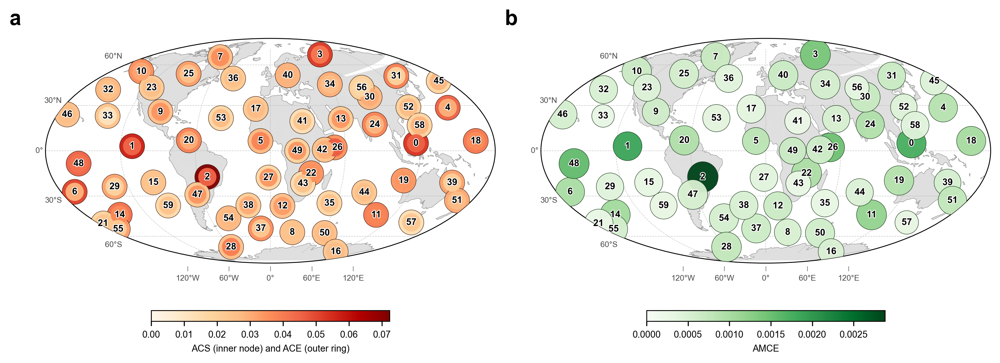
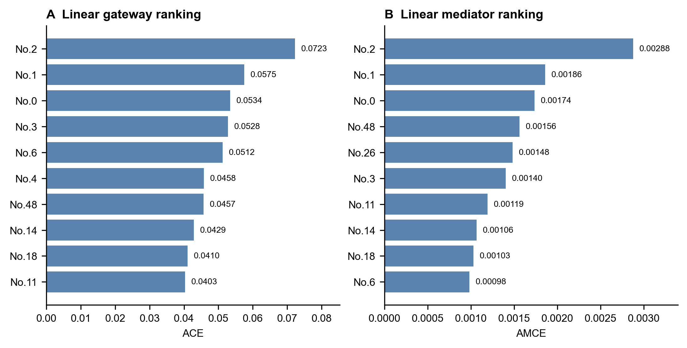
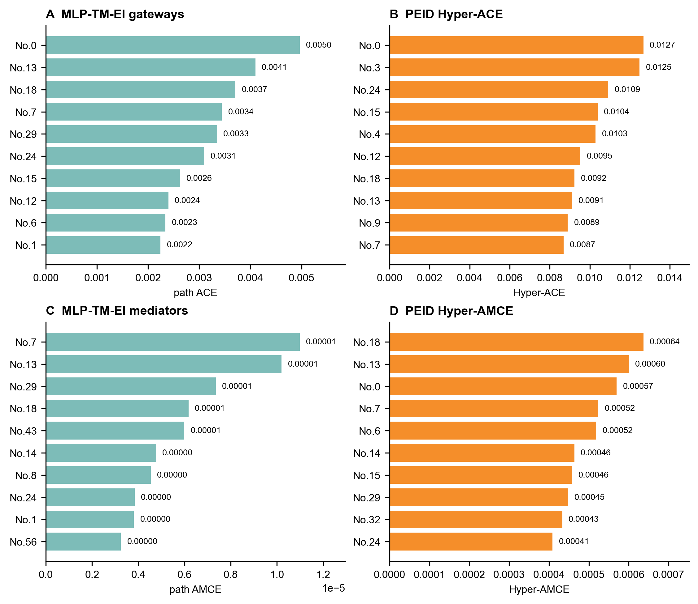
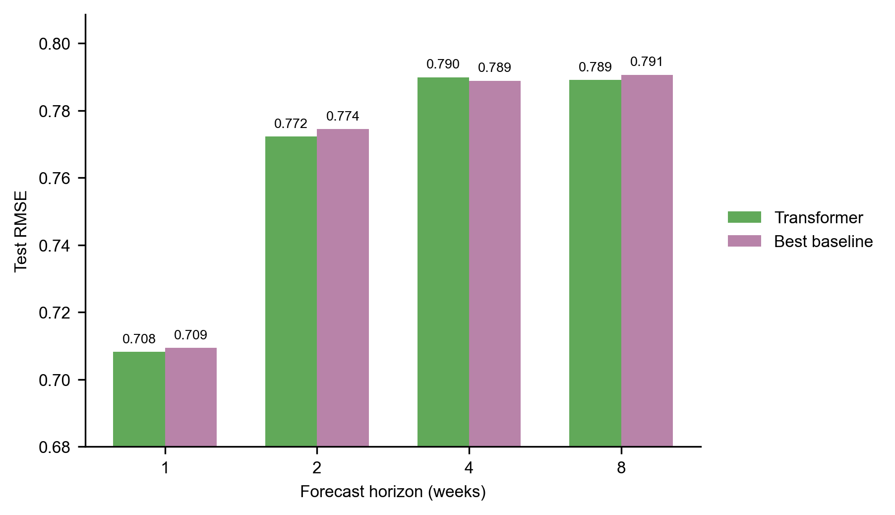
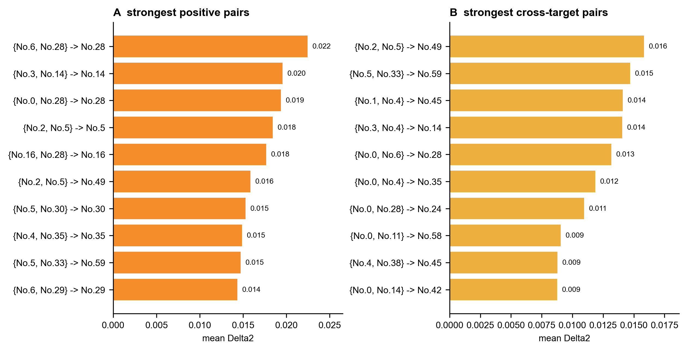

# Part 2：Runge 时空因果网关中的 EI、PEID 与预测读出
核心问题是：在同一组 Runge-NCEP 60 维周尺度分量上，线性滞后因果递归、非线性 effective information 读出、以及 PEID 二阶协同是否指向一致的 gateway / mediator 结构；如果引入 Transformer 预测器，这些结构性读出是否仍能恢复 Runge 原文 Fig. 3 中的关键链路。

高分节点首先要经得起地理检验。当前复现中，最强的线性 gateway / mediator 仍集中在 Runge 等人讨论过的 Indo-Pacific、东太平洋 ENSO、热带大西洋以及印度洋-西非季风相关区域 [1]。

*图 1. 线性 Runge 复现中的 60 个空间模态。A：ACE/ACS；B：AMCE。节点位置来自对应 Varimax loading 的高载荷中心。*

图 1 的关键信息很直接：No.0、No.1、No.2 仍是最稳的核心节点。No.0 位于海洋大陆/东印度洋附近，可理解为 Walker 环流西侧上升支和 Indo-Pacific 暖池对流区；No.1 对应东太平洋 ENSO 区；No.2 对应热带大西洋相关模态。ENSO 与 Walker 环流本来就是全球遥相关的经典源区 [2]，热带热源激发的大尺度罗斯贝波响应也为“热带异常影响远端中高纬”的解释提供了动力学背景 [3]。因此，这些节点进入高 ACE、AMCE 排名，不只是统计编号上的巧合。

也要保留一个边界：这些 No. 节点是旋转 PCA/Varimax 空间模态，不是地面站点或单一气候指数。原文重点讨论过的节点可以做较强物理解释；低排名或未标注节点只能先按其空间载荷位置理解，不能直接命名成某个确定气候过程。

二阶 PEID 进一步问一个更强的问题：目标模态的变化，是否需要两个源模态一起看才解释得更好。图 2 中的紫色超边表示这种 source-pair-target 协同；它不是风场轨迹，也不是能量沿线传播路径，而是“两个空间模态联合起来比两个单独模态之和提供更多信息”的统计关系。

*图 2. No.0 与 No.1 附近的二阶 PEID 协同关系。节点外圈表示 hyper-ACE，内圈表示 hyper-ACS；紫色汇合箭头表示显著正二阶协同超边。灰色小点只提供空间参照。*

从地球科学背景看，图 2 的超边更适合被称为 **teleconnection candidates**，而不是已确认的物理通道。No.0 相关超边有较强可读性：海洋大陆位于 Indo-Pacific 暖池和 Walker 环流上升支附近，这一区域的深对流和潜热释放本来就容易影响大尺度环流 [5]；ENSO 影响全球海气相互作用的“atmospheric bridge”也说明热带太平洋异常可以通过大气桥传到远端海盆 [4]。因此，\(\{No.0,No.18\}\to No.8\)、\(\{No.0,No.14\}\to No.1\) 这类关系可以被看作 Indo-Pacific 背景态与远端模态共同调制目标区域的候选信号。

但这还不是机制证明。地球系统里确实存在非加性调制的例子，例如印度洋偶极子会改变 ENSO 与印度夏季风之间的关系 [6]，IOD 本身也对应热带印度洋的东西向异常模态 [7]；ENSO 与年循环的相互作用还可以产生 combination mode [8]。这些文献支持“两个气候模态联合影响第三个响应”的物理可能性，但不能自动证明每一条 PEID 超边都是真实大气过程。本文因此只把这些超边解释为可验证假说：它们提示哪些源对值得继续做季节分层、ENSO/IOD 位相分层和响应面检验。

图 3 展示这些关键节点的完整空间载荷。它比单个圆点更重要，因为一个 Varimax 分量常常有多个正负 lobe；地理命名应来自整张载荷图，而不是只看最大值所在位置。

*图 3. ACE、ACS、AMCE 前五节点并集的全球 SLP Varimax loading。红色方向经过符号统一；黑色半透明区域标出高正载荷核心区。*

这张图给后文的 No. 标签定下解释口径：No.0、No.1、No.2、No.26、No.48 可以结合 Runge 原文和载荷位置做气候解释；No.3、No.6 等高 ACE 节点则先作为强传播空间模态处理。除非经过季节、相位和独立资料验证，本文不把低排名或未标注分量解释成确定的气候指数。

## 1. 数据与指标口径

实验对象是 NCEP/NCAR sea-level pressure 场经 Varimax 旋转后得到的 60 个周尺度分量。记第 \(t\) 周状态为

$$
\mathbf{x}_t=(x_{1,t},\ldots,x_{60,t})^\top .
\tag{1}
$$

线性复现使用最大周滞后 \(\tau_{\max}=4\)，以稀疏滞后回归描述目标分量：

$$
x_{j,t}
=\sum_{\tau=1}^{4}\sum_i A_{ji}^{(\tau)}x_{i,t-\tau}+\varepsilon_{j,t}.
\tag{2}
$$

其中 \(\mathbf{A}^{(\tau)}\) 是滞后 \(\tau\) 的线性因果系数矩阵。Runge 式 total causal effect 由滞后递归得到，并据此计算平均因果效应 ACE、平均因果易感性 ACS，以及阻断候选中介后的 AMCE。

非线性 EI 实验改用学习到的一步转移 \(f_\theta\)。对源分量 \(i\) 和目标分量 \(j\)，在最大熵干预样本下估计

$$
\mathrm{EI}_{i\to j}=I_{\mathrm{do}}\!\left(X_i;\widehat{X}_{j,t+1}\right).
\tag{3}
$$

Pairwise EI 图只能描述单源贡献。PEID 二阶扩展进一步计算源对 \(\{i,j\}\) 对目标 \(T\) 的 Mobius interaction：

$$
\Delta_{\{i,j\}}(T)
=\mathrm{EI}(X_i,X_j\to T)
-\mathrm{EI}(X_i\to T)
-\mathrm{EI}(X_j\to T).
\tag{4}
$$

本轮 PEID hypergraph 只估计到二阶，因此正的 \(\Delta_{\{i,j\}}(T)\) 被解释为两个源分量在该目标上的超加性协同。

## 2. 线性 Runge 复现：No.0/1/2 是最稳定的经典网关组

线性复现覆盖 1948-2011 年，共 3339 个周样本，最终保留 837 条滞后因果边。当前分量编号已按本地 orthomax / Varimax 路径和原文重点空间模式做 paper-label 校准：特别是本地 No.7、No.8、No.21 分别映射到原文 No.18、No.26、No.48。

*图 4. 线性 Runge 复现的前十名 gateway 与 mediator。A：ACE 排序；B：AMCE 排序。*

| 排名 | Gateway 分量 | ACE | Mediator 分量 | AMCE |
|---:|---|---:|---|---:|
| 1 | No.2 | 0.072274 | No.2 | 0.002879 |
| 2 | No.1 | 0.057493 | No.1 | 0.001859 |
| 3 | No.0 | 0.053431 | No.0 | 0.001738 |
| 4 | No.3 | 0.052788 | No.48 | 0.001561 |
| 5 | No.6 | 0.051232 | No.26 | 0.001483 |

线性结果给出一个清晰的复现基线：No.2、No.1、No.0 同时位于 ACE 和 AMCE 前列，是最稳定的全局传播分量。No.48 与 No.26 进入 AMCE 前五，说明原文强调的 mediator 候选在当前校准后重新出现在高 mediated-effect 区域。No.18 的 ACE 排第 9、AMCE 排第 9，仍属于较强但不是最高的线性传播节点。

这组结果回答的是“线性滞后递归下哪些分量支配全局传播”。它不等同于非线性预测贡献，也不保证 pairwise 图能捕捉所有源对协同。

## 3. MLP-TM-EI 与二阶 PEID：pairwise 结构被保留，但协同改写 gateway 优先级

非线性读出使用同一组 60 维周尺度分量，输入最近 4 周状态，预测下一周状态。保存运行中的 MLP/Ridge 融合模型 test RMSE 为 0.714863、MAE 为 0.569984、相关系数为 0.450806；相对 tuned Ridge 的 RMSE 改进为 0.001376，block bootstrap 95% CI 为 [0.000893, 0.001825]，单侧 \(p=0.0002\)。该提升很小，但足以支持把模型作为结构读出的非线性预测器。

*图 5. Pairwise MLP-TM-EI 与二阶 PEID 的 gateway / mediator 排序。A、C 为 pairwise path-effect；B、D 为加入二阶协同后的 Hyper-ACE 与 Hyper-AMCE。*

| 口径 | 前五名 | 主要解释 |
|---|---|---|
| MLP-TM-EI gateway | No.0, No.13, No.18, No.7, No.29 | No.0 仍是最强 outgoing source；No.18 在非线性 EI path-effect 中升至第 3。 |
| MLP-TM-EI mediator | No.7, No.13, No.29, No.18, No.43 | mediator 更偏稀疏 EI 图中的 path product，数值量级小于线性 AMCE。 |
| PEID Hyper-ACE | No.0, No.3, No.24, No.15, No.4 | 二阶协同把部分 pairwise 非前列分量推到 gateway 前列。 |
| PEID Hyper-AMCE | No.18, No.13, No.0, No.7, No.6 | mediator 解释转向“作为协同源成员的强度”；No.18 成为最高 Hyper-AMCE 节点。 |

Pairwise 与 PEID 的 gateway 排序 Spearman 相关为 0.7663、Kendall 相关为 0.5797；top-5 gateway 只有 No.0 重合，top-10 有 7 个重合。Mediator 排序更稳定：Spearman 0.9530、Kendall 0.8915，top-5 重合 No.18、No.13、No.7 三个节点。

因此，PEID 没有推翻 pairwise path-effect，而是改变了源侧输出能力的优先级。最稳健的解释是：No.0 是跨口径稳定 gateway；No.18 和 No.13 是 pairwise path 与二阶协同都支持的传播/协同节点；二阶 PEID 对 gateway 的影响大于对 mediator 的影响。

## 4. Transformer 预测：平均 RMSE 略优，但 horizon 4 是明确例外

最新 Transformer 预测调参完成 338 个候选，无失败候选。最终报告采用 TransformerHorizonSelector：每个 horizon 只按 validation RMSE 选择一个 Transformer 候选，不用 test split 做选择。

*图 6. TransformerHorizonSelector 与 validation-selected best baseline 在 held-out test split 上的多步 RMSE。*

| 系统 | validation avg RMSE | test avg RMSE |
|---|---:|---:|
| TransformerHorizonSelector | 0.756903 | 0.764835 |
| BestBaseline | - | 0.765801 |
| GRU reference | - | 0.765320 |

| Horizon | Transformer RMSE | BestBaseline RMSE | RMSE 改进 | bootstrap 结论 |
|---:|---:|---:|---:|---|
| 1 | 0.708132 | 0.709344 | 0.001212 | 95% CI [0.000682, 0.001732] |
| 2 | 0.772234 | 0.774436 | 0.002203 | 95% CI [0.001319, 0.003159] |
| 4 | 0.789916 | 0.788826 | -0.001091 | 劣于 baseline |
| 8 | 0.789059 | 0.790600 | 0.001541 | 95% CI [0.000398, 0.002649] |
| average | 0.764835 | 0.765801 | 0.000966 | 95% CI [0.000501, 0.001448] |

相对 BestBaseline，Transformer 的 average RMSE 改进为 0.000966，bootstrap 证据较强。相对 GRU reference，average RMSE 改进为 0.000485，单侧 \(p=0.042\)，但 95% CI 为 [-0.000072, 0.001016]，略跨 0。准确表述应是：Transformer 在平均 RMSE 上提供小幅正向证据，但不能声称所有 horizon 均提升；horizon 4 当前明确劣于 baseline 和 GRU。

## 5. Transformer 上的 PEID 检查：Fig. 3 主链路部分恢复，二阶协同集中于少数源对

在 Transformer h=1 候选上，实验检查 Runge 原文 Fig. 3 的关键链路。读出使用 4096 个独立最大熵干预样本，按 60 个可能 source 在同一目标上的 EI 排名判断支持强度。

| 检查边 | 期望滞后 | 最佳滞后 | EI | source rank | 支持 |
|---|---:|---:|---:|---:|---|
| No.1 -> No.0 | 2 | 2 | 0.053079 | 2 | strong top-10 |
| No.0 -> No.33 | 1 | 1 | 0.031158 | 3 | strong top-10 |
| No.1 -> No.53 | 1-3 | 2 | 0.032475 | 2 | strong top-10 |
| No.53 -> No.33 | 1-3 | 2 | 0.000235 | 50 | weak positive |
| No.1 -> No.33 total effect | 3 | 3 | 0.126488 | 1 | strong top-10 |
| No.59 -> No.1 dashed driver | 1-3 | 2 | 0.002135 | 39 | weak positive |
| No.59 -> No.33 dashed driver | 1-3 | 1 | 0.008664 | 15 | moderate top-20 |

这说明 Transformer PEID/TM-EI 对实线 mediator chain 和 total effect 有部分恢复能力：4 条关键检查达到 top-10，No.53 -> No.33 只剩弱正值。虚线 No.59 共同驱动项不应被当作必须恢复的实线路径，其中 No.59 -> No.33 只是 moderate top-20。

二阶检查中，针对 Fig. 3 的 No.1+No.0 -> No.33 在 3 周滞后下 joint EI 为 0.196218，单源 EI 分别为 0.126488 和 0.054849，\(\Delta_2=0.014882\)，约占 joint EI 的 7.58%。这说明主链路并非纯 pairwise 加和；源对有可测的协同增量。

*图 7. Transformer 全量二阶 PEID 扫描中的强正协同关系。A：所有正协同关系中的前十；B：排除部分自目标关系后的 cross-target 前十。*

全量二阶扫描覆盖 106200 个 source-pair-target 关系，使用 seeds 42-46、4096 个干预样本，并对 top relations 做 permutation null 检查。最强正协同包括 \(\{No.6, No.28\}\to No.28\)、\(\{No.3, No.14\}\to No.14\)、\(\{No.0, No.28\}\to No.28\)；最强 cross-target 关系包括 \(\{No.2, No.5\}\to No.49\)、\(\{No.5, No.33\}\to No.59\)、\(\{No.1, No.4\}\to No.45\)。

按源对汇总的总正协同也高度集中：\(\{No.0,No.28\}\) 的 total positive \(\Delta_2\) 为 0.074013，\(\{No.0,No.24\}\) 为 0.069249，\(\{No.0,No.4\}\) 为 0.067484。这再次强化 No.0 的 gateway 地位：它不仅在一阶/路径读出中强，也频繁参与强二阶协同源对。

## 6. 综合结论

1. 线性 Runge 复现把 No.2、No.1、No.0 识别为最稳定的经典 gateway / mediator 组；No.26 与 No.48 在校准后重新进入高 AMCE 区域。
2. MLP-TM-EI 保留 No.0 的主导地位，并把 No.18、No.13 等节点提升为重要非线性传播候选。
3. 二阶 PEID 对 gateway 排序的改变大于对 mediator 排序的改变；No.18 的 Hyper-AMCE 最高，说明其更适合解释为协同参与节点，而不只是 pairwise path mediator。
4. Transformer 预测器在平均 RMSE 上小幅优于 BestBaseline，但改善幅度很小，且 horizon 4 是明确负例；因此结构读出不应被包装成大幅预测性能提升。
5. Transformer 上的 PEID/TM-EI 能部分恢复 Runge Fig. 3 的关键实线路径，并在 No.1+No.0 -> No.33 上观察到正二阶协同；全量二阶扫描进一步显示 No.0 频繁参与强协同源对。

最稳健的表述是：Runge 实验支持一个从线性传播到非线性 EI、再到二阶 PEID 的层级结论。No.0 是跨口径最稳定的 gateway；No.18 与 No.13 是非线性和协同口径下更突出的传播节点；Transformer 结果提供了更强模型族下的补充验证，但目前只能支持小幅预测改进和部分结构恢复，不能支持对气候机制的强因果定论。

## 7. 地球科学背景文献

[1] Runge, J., Petoukhov, V., Donges, J. F., Hlinka, J., Jajcay, N., Vejmelka, M., Hartman, D., Marwan, N., Palus, M., & Kurths, J. (2015). Identifying causal gateways and mediators in complex spatio-temporal systems. *Nature Communications*, 6, 8502. https://doi.org/10.1038/ncomms9502

[2] Bjerknes, J. (1969). Atmospheric teleconnections from the equatorial Pacific. *Monthly Weather Review*, 97(3), 163-172. https://doi.org/10.1175/1520-0493(1969)097%3C0163:ATFTEP%3E2.3.CO;2

[3] Hoskins, B. J., & Karoly, D. J. (1981). The steady linear response of a spherical atmosphere to thermal and orographic forcing. *Journal of the Atmospheric Sciences*, 38(6), 1179-1196. https://doi.org/10.1175/1520-0469(1981)038%3C1179:TSLROA%3E2.0.CO;2

[4] Alexander, M. A., Bladé, I., Newman, M., Lanzante, J. R., Lau, N.-C., & Scott, J. D. (2002). The atmospheric bridge: The influence of ENSO teleconnections on air-sea interaction over the global oceans. *Journal of Climate*, 15(16), 2205-2231. https://doi.org/10.1175/1520-0442(2002)015%3C2205:TABTIO%3E2.0.CO;2

[5] Neale, R., & Slingo, J. (2003). The Maritime Continent and its role in the global climate: A GCM study. *Journal of Climate*, 16(5), 834-848. https://doi.org/10.1175/1520-0442(2003)016%3C0834:TMCAIR%3E2.0.CO;2

[6] Ashok, K., Guan, Z., & Yamagata, T. (2001). Impact of the Indian Ocean Dipole on the relationship between the Indian monsoon rainfall and ENSO. *Geophysical Research Letters*, 28(23), 4499-4502. https://doi.org/10.1029/2001GL013294

[7] Saji, N. H., Goswami, B. N., Vinayachandran, P. N., & Yamagata, T. (1999). A dipole mode in the tropical Indian Ocean. *Nature*, 401, 360-363. https://doi.org/10.1038/43854

[8] Stuecker, M. F., Timmermann, A., Jin, F.-F., McGregor, S., & Ren, H.-L. (2013). A combination mode of the annual cycle and the El Niño/Southern Oscillation. *Nature Geoscience*, 6, 540-544. https://doi.org/10.1038/ngeo1826

## 8. 局限与复现信息

- 60 个分量是旋转 PCA / Varimax 分量，编号依赖当前实现和校准；除原文重点分量外，低排名分量不能解释为官方逐点认证标签。
- PEID hypergraph 只估计二阶；三阶及以上 interaction 未纳入本轮结论。
- 二阶候选仍受 pairwise EI 预筛选和模型预测质量影响，弱 pairwise 但强纯协同的关系可能被漏掉。
- Transformer full-pair synergy 的 permutation null 方差很小，导致 z 值很大；本文只把它用于排序和稳定性辅助，不把它解释为物理机制证明。
- 旧版 Part2 的 DMF \(\Phi^R\) / whole-system \(\Phi^{EID}\) 内容已另存为 `docs/log/Part2_dmf_phi_original.md`。

主要产物位置：

- 线性 Runge 复现：`results/runge/2015_gateways/`
- MLP-TM-EI path-effect：`results/runge/pairwise_mlp_tm_ei_path_effects/`
- 二阶 PEID hypergraph：`results/runge/peid_hypergraph/`
- Transformer forecast sweep：`results/runge_transformer_forecast_sweep/`
- Transformer Fig. 3 PEID 检查：`results/runge/transformer_peid_fig3_edges/`
- Transformer full-pair synergy：`results/runge/transformer_full_pair_synergy/`
- 本文新增原文风格节点地图：`scripts/plot_runge_gateway_mediator_map.py`
- 本文新增空间节点图：`scripts/plot_runge_component_regions.py`
