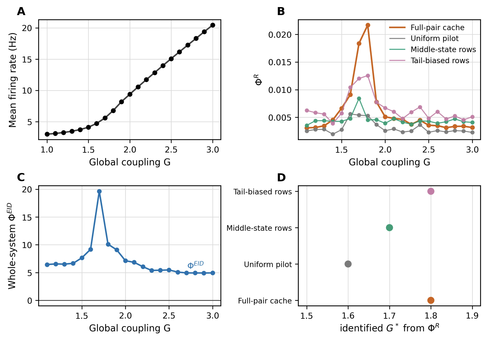

# Part 2：全脑 DMF 相变中的 $\Phi^R$ 与 whole-system $\Phi^{EID}$

本部分回顾全脑 Dynamic Mean Field（DMF）模型的全局耦合扫描实验。实验问题是：经验状态分布上计算的 $\Phi^R$ 能否稳定定位 firing-rate 转变区，以及采用最大熵干预口径的 whole-system $\Phi^{EID}$ 能否提供更接近机制层面的对照。

*图 1. 全局耦合 $G$ 扫描结果。A：平均放电率；B：不同经验采样方案下的 $\Phi^R$；C：最大熵源干预下的 whole-system $\Phi^{EID}$；D：各 $\Phi^R$ 曲线识别出的峰值位置 $G^*$。峰值分析统一排除扫描边界 $G=1.0$。*

## 1. 实验与数据口径

实验以 Lausanne2008-33 count 数据派生的 83 脑区**经验代理耦合矩阵**近似复现 Mediano et al. (2025) 的 DMF Fig. 6 设置，并扫描

$$
G=1.0,1.1,\ldots,3.0.
$$

### 1.1 真实数据、脑区划分与动力学出处

原论文与当前近似复现使用了相同的 83 节点尺度，但二者的连接数据并不相同，不能都笼统称为“结构连接矩阵”。

- **原论文的数据来源。** Mediano et al. (2025) 的补充材料说明，其 DMF 使用 Human Connectome Project（HCP）900 subjects release 的扩散 MRI 数据，经 Luppi and Stamatakis (2020) 的代表性脑网络流程预处理后，得到 Lausanne-83 分区下的 $83\times83$ 结构连接矩阵 $\mathbf{C}$。Lausanne 多尺度解剖分区最初由 Cammoun et al. (2012) 基于 diffusion spectrum MRI 提出。
- **当前复现的数据来源。** 当前使用的 `Lausanne2008-33.zip` 来自 F-TRACT 人脑连接图谱。F-TRACT 基于癫痫患者立体脑电（SEEG）期间的直接电刺激和 cortico-cortical evoked potentials（CCEP）汇总跨脑区响应；公开记录说明该版本汇集了 780 名患者，并提供 Lausanne2008 多种分辨率。归档中的 Lausanne2008-33 含 84 个标签；移除 `Unknown` 后保留 83 个节点，包括双侧皮层区、皮层下区和脑干。
- **当前矩阵的实际含义。** 代码读取归档内 19 个条目的 `count` 字段；该字段是刺激区—记录区组合的观测计数，矩阵非对称，并不是纤维数或 HCP diffusion-MRI 结构连接。复现取第一个 `count` 矩阵，移除 `Unknown`，再按最大值归一化并乘以 $0.2$，最后将所得矩阵作为 DMF 的 $\mathbf{C}$。因此，本实验保留了真实脑区划分和经验跨区覆盖模式，但 $\mathbf{C}$ 只能解释为用于近似复现的代理耦合权重。

脑区之间的时间演化不是直接从 F-TRACT 数据估计，而是由 Deco et al. (2014, 2018) 的 E-I Dynamic Mean Field 模型生成；Mediano et al. (2025) 按 Herzog et al. (2020) 的配置使用该模型。每个脑区 $j$ 包含相互耦合的兴奋性与抑制性神经群体，跨脑区作用只通过兴奋性 NMDA 门控变量传播。原模型为

$$
I_j^{(E)}
=W_E I_0+w_+J_{\mathrm{NMDA}}S_j^{(E)}
+GJ_{\mathrm{NMDA}}\sum_{k=1}^{N}C_{jk}S_k^{(E)}
-J_j^{\mathrm{FIC}}S_j^{(I)},
$$

$$
I_j^{(I)}=W_I I_0+J_{\mathrm{NMDA}}S_j^{(E)}-S_j^{(I)},
$$

$$
r_j^{(E)}=F_E\!\left(I_j^{(E)}\right)
=\frac{g_E\!\left(I_j^{(E)}-I_{\mathrm{thr}}^{(E)}\right)}
{1-\exp\!\left[-d_Eg_E\!\left(I_j^{(E)}-I_{\mathrm{thr}}^{(E)}\right)\right]},
$$

$$
r_j^{(I)}=F_I\!\left(I_j^{(I)}\right)
=\frac{g_I\!\left(I_j^{(I)}-I_{\mathrm{thr}}^{(I)}\right)}
{1-\exp\!\left[-d_Ig_I\!\left(I_j^{(I)}-I_{\mathrm{thr}}^{(I)}\right)\right]},
$$

$$
\frac{\mathrm{d}S_j^{(E)}}{\mathrm{d}t}
=-\frac{S_j^{(E)}}{\tau_{\mathrm{NMDA}}}
+\left(1-S_j^{(E)}\right)\gamma r_j^{(E)}
+\sigma v_j^{(E)}(t),
$$

$$
\frac{\mathrm{d}S_j^{(I)}}{\mathrm{d}t}
=-\frac{S_j^{(I)}}{\tau_{\mathrm{GABA}}}
+r_j^{(I)}
+\sigma v_j^{(I)}(t).
$$

其中，$S_j^{(E)}$ 与 $S_j^{(I)}$ 分别为第 $j$ 个脑区的兴奋性 NMDA 和抑制性 GABA 门控变量，$r_j^{(E)}$ 与 $r_j^{(I)}$ 为对应放电率，$C_{jk}$ 为从脑区 $k$ 到脑区 $j$ 的代理耦合权重，$G$ 是本实验扫描的全局耦合强度，$J_j^{\mathrm{FIC}}$ 是将低耦合基线平均放电率校准至约 $3\ \mathrm{Hz}$ 的反馈抑制控制参数，$v_j^{(E)}(t)$ 与 $v_j^{(I)}(t)$ 为相互独立的 Gaussian 白噪声。当前实现使用 Euler–Maruyama 积分，并与原模型一致地采用 $W_E=1$、$W_I=0.7$、$I_0=0.382\ \mathrm{nA}$、$w_+=1.4$、$J_{\mathrm{NMDA}}=0.15\ \mathrm{nA}$、$\tau_{\mathrm{NMDA}}=100\ \mathrm{ms}$、$\tau_{\mathrm{GABA}}=10\ \mathrm{ms}$、$\gamma=0.641$ 和 $\sigma=0.01$。

每个耦合点记录全脑平均兴奋性放电率，并基于滞后一步的区域状态 $(\mathbf{X}_t,\mathbf{X}_{t+1})$ 计算两类信息指标：

- **$\Phi^R$**：在经验 lagged Gaussian distribution 上计算脑区对的 whole-minus-sum，并加回 double-redundancy 修正后对全部脑区对求平均。该指标描述当前经验状态分布中的信息动力学，因此可能随采样窗口和状态权重变化。
- **whole-system $\Phi^{EID}$**：先拟合标准化线性 Gaussian 转移
  $$
  \mathbf{X}_{t+1}=\mathbf{A}\mathbf{X}_t+\boldsymbol{\varepsilon},
  $$
  再在独立的标准化最大熵源干预下计算
  $$
  \Phi^{EID}=I_{\mathrm{do}}(\mathbf{X}_t;\mathbf{X}_{t+1})-
  \sum_i I_{\mathrm{do}}(X_t^i;\mathbf{X}_{t+1}).
  $$
  该量对应系统级源侧协同；在当前 Gaussian 构造下等价于条件 total correlation，因此保持非负。

为检验 $\Phi^R$ 对经验状态分布的敏感性，图 B 比较四种曲线：缓存中的全部脑区对结果、uniform pilot、靠近中位 activity 的 middle-state rows，以及偏离中位 activity 较远的 tail-biased rows。后三者使用同一 DMF 状态序列，仅改变进入估计器的时间行。

## 2. 关键数值

| 观测量 | 结果 | 数值解释 |
|---|---:|---|
| 最大 firing-rate 离散斜率 | $G=1.8$，约 $13.060\ \mathrm{Hz}/G$ | 与 $G=1.9$ 的 $13.027$ 很接近，单点临界值不稳定 |
| Full-pair $\Phi^R$ 峰值 | $G^*=1.8$，$\Phi^R=0.02168$ | 位于放电率快速上升区 |
| Uniform pilot 峰值 | $G^*=1.6$ | 改变经验采样后峰值提前 |
| Middle-state rows 峰值 | $G^*=1.7$ | 更接近快速上升区左侧 |
| Tail-biased rows 峰值 | $G^*=1.8$ | 与 full-pair 结果一致 |
| whole-system $\Phi^{EID}$ 峰值 | $G^*=1.7$，$\Phi^{EID}=19.636$ | 在快速上升区内达到最大值 |
| $G>1.0$ 范围内最小 $\Phi^{EID}$ | $4.927$，位于 $G=2.9$ | 全扫描分析区间内保持非负 |

平均放电率从 $G=1.6$ 的 $4.727\ \mathrm{Hz}$ 上升到 $G=1.9$ 的 $8.195\ \mathrm{Hz}$，随后继续单调增加。因 $G=1.8$ 与 $G=1.9$ 的离散斜率几乎相同，本实验只把 $G\approx1.7\text{-}1.9$ 解释为快速转变区，而不把某一个网格点当作精确相变常数。

## 3. 分图解读

### A. 动力学转变区

低耦合区的平均放电率约为 $3\text{-}5\ \mathrm{Hz}$，从 $G\approx1.7$ 开始明显加速，并在更高耦合下持续上升。这为信息指标提供了独立的动力学参照：可信的临界性信号应出现在该快速上升区附近，而不应只由信息估计器的边界峰值决定。

### B 与 D. $\Phi^R$ 能定位转变区，但峰值依赖采样分布

Full-pair $\Phi^R$ 在 $G=1.8$ 形成尖峰，和 firing-rate 快速上升区对齐，说明它确实能够描述临界区附近增强的信息整合。然而，uniform 与 middle-state 重采样把峰值分别移动到 $G=1.6$ 和 $G=1.7$。因此，$\Phi^R$ 的峰值不仅反映动力学机制，也受系统在经验轨迹中如何访问状态空间影响。

该结果不意味着 $\Phi^R$ 无效。更准确的结论是：它适合作为经验状态分布下的信息动力学描述量，但由其峰值给出的 $G^*$ 不是采样分布不变的机制参数。

### C. whole-system $\Phi^{EID}$ 提供机制干预口径的对照

$\Phi^{EID}$ 在 $G=1.7$ 达到 $19.636$，随后在 $G=1.8$ 降至 $10.110$，表明系统级不可约联合约束在 firing-rate 转变区左侧最强。它使用统一的最大熵源干预分布，不继承 full、middle 或 tail 经验采样权重的差异，因此回答的是“拟合动力学机制在统一干预下产生多少系统级协同”，而不是“当前轨迹中出现了多少协同”。

需要注意，$\Phi^{EID}$ 峰值与 full-pair $\Phi^R$ 峰值相差一个扫描步长（$0.1$）。在当前离散网格和代理耦合矩阵下，这支持二者共同指向同一宽转变区，但不足以声称两种指标识别了完全相同的临界点。

## 4. $G=1.0$ 边界值为何不作为相变证据

缓存中 $G=1.0$ 的 $\Phi^{EID}=14.102$，部分 $\Phi^R$ 重采样曲线在该点也偏高，但它没有对应 firing-rate 的快速上升。低耦合、低放电率状态下，lagged dynamics 更接近自保持且残差协方差较小，线性 Gaussian EI 因而可能升高。该现象更应视为扫描边界和估计口径效应，而不是第二个物理相变。因此图 B、C 及峰值识别统一使用 $G>1.0$，同时保留原始边界值供审计。

## 5. 实验结论

1. firing-rate 曲线把主要动力学转变限定在 $G\approx1.7\text{-}1.9$，但当前网格不足以确定唯一临界点。
2. Full-pair $\Phi^R$ 在 $G=1.8$ 给出清晰峰值，能够标记转变区；但重采样使峰值移动到 $1.6$ 或 $1.7$，说明该判据依赖经验状态分布。
3. whole-system $\Phi^{EID}$ 在统一最大熵干预下于 $G=1.7$ 达峰，并在分析区间内保持非负，为经验 $\Phi^R$ 提供了机制归一化的系统级协同对照。
4. 最稳健的表述不是“某个指标精确找到了相变点”，而是两类指标与 firing-rate 曲线共同把增强区定位在 $G\approx1.7\text{-}1.9$，其中 $\Phi^R$ 更偏行为分布描述，$\Phi^{EID}$ 更偏干预机制描述。

## 6. 局限与复现信息

- 当前使用 F-TRACT Lausanne2008-33 的非对称观测 `count` 派生代理耦合矩阵，而不是原论文未随数据包公开的 HCP Lausanne-83 diffusion-MRI 结构连接矩阵，因此只能视为 Fig. 6 的近似复现，不能将当前结果解释为对原结构连接网络的精确复现。
- 原论文将模拟 firing rate 经血流动力学模型转换为 BOLD 后计算 $\Phi$；当前报告直接使用兴奋性 firing-rate 状态，因此信息指标的观测层也与原论文不同。
- 主 $\Phi^R$ 曲线来自已缓存的全部脑区对计算，三条敏感性曲线来自重采样 pilot；不同曲线的计算预算并不完全等价。
- 扫描步长为 $0.1$，相邻峰值点的差异不应被过度解释。
- 使用兴奋性 firing-rate 状态、滞后 $\tau=1$、ridge $10^{-6}$；whole-system 估计在各 $G$ 下使用约 $249\text{-}499$ 个有效滞后样本。

主要出处如下：

- Mediano et al. (2025), *Toward a unified taxonomy of information dynamics via Integrated Information Decomposition*，尤其是补充材料 Sec. VIII：给出 Fig. 6 的 HCP Lausanne-83 数据口径、完整 DMF 方程与参数。
- Deco et al. (2014), *How local excitation-inhibition ratio impacts the whole brain dynamics*；Deco et al. (2018), *Whole-brain multimodal neuroimaging model using serotonin receptor maps explains non-linear functional effects of LSD*：DMF 动力学来源。
- Herzog et al. (2020), *A mechanistic model of the neural entropy increase elicited by psychedelic drugs*：Mediano et al. 所沿用的模型配置。
- Van Essen et al. (2013) 与 Glasser et al. (2013)：HCP 数据与预处理；Luppi and Stamatakis (2020)：代表性结构脑网络构建；Cammoun et al. (2012), *Mapping the human connectome at multiple scales with diffusion spectrum MRI*：Lausanne 多尺度分区。
- F-TRACT atlas, Zenodo record [7015415](https://zenodo.org/records/7015415)；Trebaul et al. (2018), *Probabilistic functional tractography of the human cortex revisited*：当前代理矩阵所用 CCEP 图谱的数据来源与性质。
- Yang, Wang, and Zhang (2026), *Partial Effective Information Decomposition for Synergistic Causality*：最大熵干预下 PEID 协同的机制解释。
