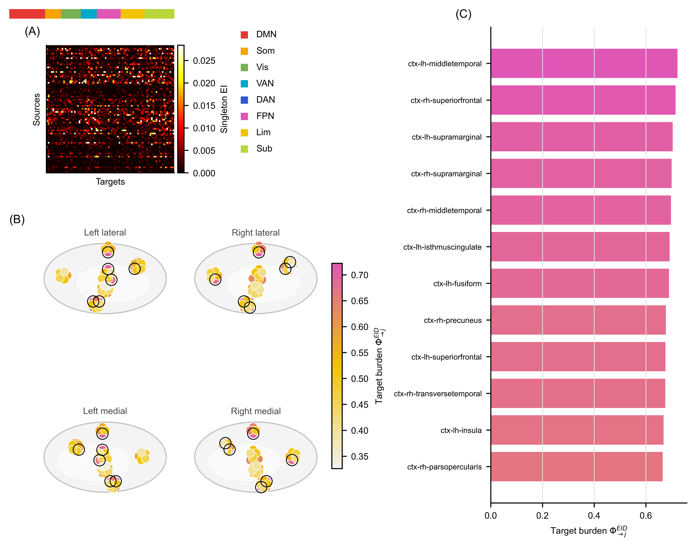
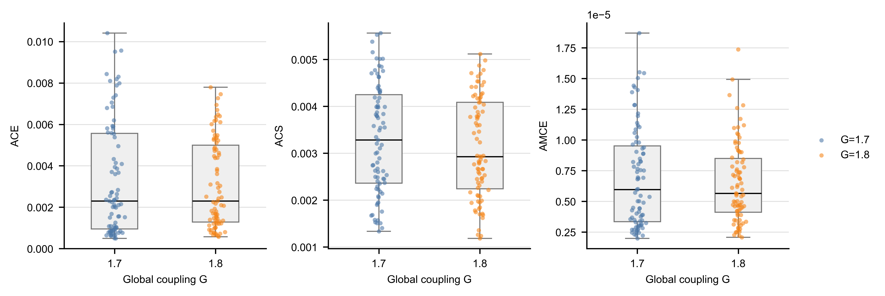

# Part 2: Phi / PhiEID 识别临界相变与脑区贡献拆分

本文合并 `docs/log/Part2_dmf_phi_original.md` 与 `docs/log/iid_fig6_phi_eid_comparison.md`，并新增一版按 Luppi et al. *A synergistic workspace for human consciousness revealed by Integrated Information Decomposition* 风格整理的脑区分布图。核心问题有两个：

1. 全脑 DMF 是否存在一个由 $\Phi$ 类指标标记的临界转变区。
2. Whole-system $\Phi^{EID}$ 达峰后，能否进一步定位到若干关键未来脑区、源侧脑区或中介脑区。

当前结论应保持克制：$\Phi^R$ 与 whole-system $\Phi^{EID}$ 都把不可约信息增强区定位在 $G\approx1.7\text{-}1.9$，但还不能声称某个单点就是唯一相变点。新增 target-burden 图给出了一个可解释的脑区级读数：哪些未来脑区的状态最依赖全脑联合源状态，而不是单个源脑区的简单相加。

*图 1. 全局耦合 $G$ 扫描结果。A：平均放电率；B：不同经验采样方案下的 $\Phi^R$；C：最大熵源干预下的 whole-system $\Phi^{EID}$；D：各 $\Phi^R$ 曲线识别出的峰值位置 $G^*$。峰值分析统一排除扫描边界 $G=1.0$。*

## 1. 实验口径

当前实验近似复现 Mediano et al. (2025) Fig. 6 的全脑 Dynamic Mean Field (DMF) 设置。它使用 F-TRACT `Lausanne2008-33.zip` 中第一个 `count` 矩阵，移除 `Unknown` 后得到 83 个脑区，再按最大值归一化并乘以 0.2，作为 DMF 的代理耦合矩阵 $\mathbf{C}$。

这个连接矩阵来自 SEEG 直接电刺激和 CCEP 汇总中的观测计数，不是 HCP diffusion-MRI 结构连接矩阵。因此，当前结果适合做方法验证和区域拆分原型，不能写成原论文数值的严格复现。

全局耦合扫描为

$$
G=1.0,1.1,\ldots,3.0.
$$

每个耦合点记录兴奋性 firing-rate 状态，并基于一步滞后的区域状态 $(\mathbf{X}_t,\mathbf{X}_{t+1})$ 计算两个指标。

经验分布指标 $\Phi^R$ 在 lagged Gaussian distribution 上计算脑区对的 whole-minus-sum，并加回 double-redundancy 修正后对全部脑区对求平均。它描述轨迹实际访问状态空间时的信息整合。

机制干预指标 $\Phi^{EID}$ 先拟合标准化线性 Gaussian 转移

$$
\mathbf{X}_{t+1}=\mathbf{A}\mathbf{X}_t+\boldsymbol{\varepsilon},
$$

再在独立标准化最大熵源干预下计算

$$
\Phi^{EID}
= I_{\mathrm{do}}(\mathbf{X}_t;\mathbf{X}_{t+1})
-\sum_i I_{\mathrm{do}}(X_t^i;\mathbf{X}_{t+1}).
$$

按 PEID 的解释，它是 singleton source partition 下的 system-level source-side synergy。在当前 Gaussian 构造下可写成条件 total correlation，因此保持非负。

## 2. 主结果

| 观测量 | 结果 | 解释 |
|---|---:|---|
| 最大 firing-rate 离散斜率 | $G=1.8$，约 $13.060\ \mathrm{Hz}/G$ | 与 $G=1.9$ 的 $13.027$ 很接近，不能把单点当作精确临界常数 |
| Full-pair $\Phi^R$ 峰值 | $G^*=1.8$，$\Phi^R=0.02168$ | 落在 firing-rate 快速上升区 |
| Uniform pilot $\Phi^R$ 峰值 | $G^*=1.6$ | 改变经验采样后峰值提前 |
| Middle-state rows $\Phi^R$ 峰值 | $G^*=1.7$ | 更靠近快速上升区左侧 |
| Tail-biased rows $\Phi^R$ 峰值 | $G^*=1.8$ | 与 full-pair 结果一致 |
| Whole-system $\Phi^{EID}$ 峰值 | $G^*=1.7$，$\Phi^{EID}=19.636$ | 在快速上升区内达到最大值 |
| $G>1.0$ 范围内最小 $\Phi^{EID}$ | $4.927$，位于 $G=2.9$ | 分析区间内保持非负 |

平均放电率从 $G=1.6$ 的 $4.727\ \mathrm{Hz}$ 上升到 $G=1.9$ 的 $8.195\ \mathrm{Hz}$，随后继续单调增加。由于 $G=1.8$ 与 $G=1.9$ 的离散斜率几乎相同，更稳妥的写法是转变区约为 $G\approx1.7\text{-}1.9$。

$\Phi^R$ 的 full-pair 曲线在 $G=1.8$ 形成峰值，说明经验轨迹上的信息整合在临界区附近增强。但 uniform、middle-state 和 tail-biased 重采样把峰值移动到 $G=1.6$、$1.7$ 或 $1.8$，说明 $\Phi^R$ 的峰值不只是机制属性，也依赖轨迹样本如何覆盖状态空间。

Whole-system $\Phi^{EID}$ 在 $G=1.7$ 达峰，并在 $G>1.0$ 内保持非负。它不继承 full、middle 或 tail 经验采样权重，而是在统一最大熵干预下读取拟合动力学的机制协同。因此它更适合用作机制归一化的系统级对照。

$G=1.0$ 的高 $\Phi$ 值不应解释为另一个相变。该点是扫描边界，没有对应 firing-rate 快速上升；低耦合、低 firing-rate 状态下，lagged dynamics 更接近自保持且残差协方差较小，线性 Gaussian EI 可以偏高。主图和峰值识别因此统一排除 $G=1.0$，但保留原始数值用于审计。

## 3. 为什么临界区会增强

临界峰值不是“耦合越强，协同越强”。低 $G$ 时，各脑区近似独立，联合源状态相对单源状态没有太多不可约增量；高 $G$ 时，系统更接近同步或共同饱和，许多脑区携带相似信息，联合信息更多表现为冗余。

中间转变区同时满足两点：动力学 regime 正在改变，且单个脑区或少数局部源不足以解释下一步全局状态。此时联合状态对未来状态的不可约解释力最大。

这也解释了 $\Phi^R$ 与 $\Phi^{EID}$ 的差异。$\Phi^R$ 使用经验 lagged distribution，因此强调轨迹实际采到的状态；$\Phi^{EID}$ 使用标准化最大熵干预源分布，因此更接近“如果统一干预这个拟合机制，它本身产生多少系统级 source-side synergy”。

## 4. 从 whole-system PhiEID 拆到脑区

Whole-system $\Phi^{EID}$ 是一个系统级数值，不能直接平均摊给脑区。要做脑区地图，必须先明确“贡献”的口径。当前建议分三层。

第一层是 target burden map。对每个未来脑区 $j$ 计算

$$
\Phi^{EID}_{\rightarrow j}
= I_{\mathrm{do}}(\mathbf{X}_t;X_{t+1}^j)
-\sum_i I_{\mathrm{do}}(X_t^i;X_{t+1}^j).
$$

它回答：哪个未来脑区的状态最需要联合源状态来解释。这个量适合直接画在脑图上，因为 target index $j$ 是明确的脑区标签。

第二层是 source contribution map。把

$$
v(S)=I_{\mathrm{do}}(\mathbf{X}_t^S;\mathbf{X}_{t+1})
-\sum_{i\in S}I_{\mathrm{do}}(X_t^i;\mathbf{X}_{t+1})
$$

作为源集合 $S$ 的协同值，再用 Monte Carlo Shapley 或 leave-one-source loss 给源脑区分配贡献。83 区精确 Shapley 不现实，需要采样近似，并同时报告 signed contribution 与 positive-only contribution。

第三层是 pair / hyperedge screen。先计算脑区对

$$
\Delta_{ij\rightarrow B}
=I_{\mathrm{do}}((X_t^i,X_t^j);\mathbf{X}_{t+1}^B)
-I_{\mathrm{do}}(X_t^i;\mathbf{X}_{t+1}^B)
-I_{\mathrm{do}}(X_t^j;\mathbf{X}_{t+1}^B),
$$

其中 $B$ 可以是全脑目标，也可以是单个目标脑区。它用于识别关键源组合，而不是单个脑区。

## 5. Luppi 风格的 target-burden 图

参考 Luppi et al. 的可视化风格，重新绘图时采用了三个元素：按 canonical network 色条排序的信息矩阵、脑图上的高低分布、以及 top 区域排行。由于当前数据是 Lausanne-83 label，且本地没有可用的 fsaverage / nilearn surface 渲染环境，图 2 使用的是 schematic brain layout，不是正式皮层表面投影。

*图 2. $G=1.7$ 下的 $\Phi^{EID}_{\rightarrow j}$ target-burden 分布。A：singleton EI source-target 矩阵，脑区按粗略功能模块排序，顶部色条模拟 Luppi 图中的 network ordering。B：四个示意脑视角上的 target-burden 热度，黑圈标出 top-12 target 区域。C：top-12 target burden 排名。*

这张图的读法如下。

Panel A 显示单源到单目标的 Gaussian effective information 矩阵。颜色越亮，说明某个源脑区单独干预时对某个未来目标脑区的信息越高。这个矩阵不是 $\Phi^{EID}_{\rightarrow j}$ 本身，而是 target burden 公式中的 singleton subtraction 项来源。

Panel B 显示 target burden。颜色越偏 magenta / yellow，说明该未来脑区越需要全脑联合源状态解释；黑圈是 top-12 区域。它回答“哪些未来脑区是临界协同读出的高负担目标”，不回答“哪个源脑区贡献最大”。

Panel C 给出 top-12 数值，便于不依赖脑图位置直接读取区域名。

本次图 2 来自新的 continuation-aligned DMF rerun。旧的 `whole_system_phi_eid_phase_comparison.npz` 只保存了 whole-system 曲线，没有保存每个 $G$ 的转移矩阵和残差协方差，因此 target-burden 图不能从旧曲线反推。新 rerun 在 $G=1.7$、$\tau=1$、399 个有效 lagged samples 下得到 whole-system $\Phi^{EID}=15.091$；旧主曲线中 $G=1.7$ 的值为 $19.636$。这里优先解释空间排序，不用这次 rerun 的绝对数值替换图 1 的主曲线。

Top target burden 区域为：

| Rank | Region | $\Phi^{EID}_{\rightarrow j}$ |
|---:|---|---:|
| 1 | `ctx-lh-middletemporal` | 0.722 |
| 2 | `ctx-rh-superiorfrontal` | 0.715 |
| 3 | `ctx-lh-supramarginal` | 0.704 |
| 4 | `ctx-rh-supramarginal` | 0.700 |
| 5 | `ctx-rh-middletemporal` | 0.698 |
| 6 | `ctx-lh-isthmuscingulate` | 0.692 |
| 7 | `ctx-lh-fusiform` | 0.690 |
| 8 | `ctx-rh-precuneus` | 0.678 |
| 9 | `ctx-lh-superiorfrontal` | 0.676 |
| 10 | `ctx-rh-transversetemporal` | 0.675 |
| 11 | `ctx-lh-insula` | 0.669 |
| 12 | `ctx-rh-parsopercularis` | 0.665 |

这些区域的共同含义是：它们的下一步状态不能被各个源脑区的单独 EI 简单相加解释，联合源状态提供了额外解释力。换句话说，它们是 target-side 的“协同读出负担”高点。

需要注意两个限制。第一，target-wise burden 是逐 target 重复读取全源信息，$\sum_j \Phi^{EID}_{\rightarrow j}=44.429$ 不是 whole-system $\Phi^{EID}=15.091$ 的加和分解，不能解释成百分比分摊。第二，当前 network 颜色是根据 Lausanne label 做的粗略显示分组，不是 Luppi 文中严格的 Yeo-7 + Tian subcortical parcellation。

## 6. Runge-style ACE / ACS / AMCE 区域读数

为了进一步从 target burden 向下拆，脚本还把 singleton EI 矩阵当作非负有向图，删掉自环后累加最多 60 阶路径效应，得到三个 Runge-style 区域分数：

| 指标 | 当前定义 | 解释 |
|---|---|---|
| ACE | 区域作为源点向外传播的总路径效应 | outgoing source / gateway 候选 |
| ACS | 区域作为终点接收的总路径效应 | incoming susceptibility 候选 |
| AMCE | 区域作为中间节点参与路径的效应 | mediator / relay 候选 |

*图 3. 在 $G=1.7$ 与 $G=1.8$ 上，把 singleton Gaussian EI 矩阵作为有向图后得到的 Runge-style ACE、ACS 和 AMCE 区域分布。每个点是一个 Lausanne 区域，箱线图显示区域分布。*

Top 区域如下：

| $G$ | Top ACE | Top ACS | Top AMCE |
|---:|---|---|---|
| 1.7 | `ctx-lh-superiortemporal`, `ctx-rh-precentral`, `ctx-rh-superiortemporal` | `ctx-lh-frontalpole`, `ctx-lh-lateraloccipital`, `ctx-lh-cuneus` | `ctx-rh-precentral`, `ctx-lh-parstriangularis`, `ctx-rh-superiorfrontal` |
| 1.8 | `ctx-rh-supramarginal`, `ctx-lh-insula`, `ctx-rh-middletemporal` | `ctx-lh-frontalpole`, `ctx-rh-medialorbitofrontal`, `ctx-rh-frontalpole` | `ctx-rh-middletemporal`, `ctx-rh-supramarginal`, `ctx-lh-middletemporal` |

与 target burden 的相关支持三者分工。在 $G=1.7$，target burden 与 ACE / AMCE 的相关约为 0.765 / 0.805，与 ACS 的相关约为 -0.570；在 $G=1.8$，对应相关为 0.509 / 0.671 / -0.248。

因此，ACE 和 AMCE 更接近“哪些区域参与临界协同读出”的源侧和中介侧粗筛；ACS 是入向易感性排序，不能直接当作 target burden 的替代指标。

这仍然只是 EI path summary，不是正式 $\Phi^{EID}$ Shapley attribution，也不能解释为解剖直接因果路径。它的价值是快速产生区域候选，并为后续 bootstrap、pair synergy 和正式脑图缩小搜索范围。

## 7. 当前输出文件

| 文件 | 含义 |
|---|---|
| `docs/reports/assets/part2_dmf_phi_comparison.png` | 图 1，原始 $\Phi^R$ / $\Phi^{EID}$ 临界扫描主图 |
| `docs/reports/assets/part2_dmf_phi_eid_target_burden.csv` | $G=1.7$ target-burden 表，含 top 区域、metadata、ACE/ACS/AMCE |
| `docs/reports/assets/part2_dmf_phi_eid_singleton_ei_matrix.csv` | singleton source-to-target EI 矩阵，用于图 2A 和 path-effect 计算 |
| `docs/reports/assets/part2_dmf_phi_eid_target_burden_map.png` | 图 2 PNG |
| `docs/reports/assets/part2_dmf_phi_eid_target_burden_map.svg` | 图 2 SVG |
| `docs/reports/assets/part2_dmf_phi_eid_target_burden_map.pdf` | 图 2 PDF |
| `docs/reports/assets/part2_dmf_runge_path_scores_g17_g18.csv` | $G=1.7$ 与 $G=1.8$ 的 ACE / ACS / AMCE 表 |
| `docs/reports/assets/part2_dmf_runge_path_scores.png` | 图 3 PNG |
| `docs/reports/assets/part2_dmf_runge_path_scores.svg` | 图 3 SVG |
| `docs/reports/assets/part2_dmf_runge_path_scores.pdf` | 图 3 PDF |
| `scripts/plot_dmf_phi_eid_target_burden_map.py` | 重新计算 target burden、singleton EI 矩阵、Runge-style 分数并绘图 |

## 8. 下一步建议

正式论文图还需要四个增强步骤。

1. 在 $G=1.7$、$G=1.8$ 以及非临界对照点保存 transition matrix、残差协方差、标准化参数和 label，避免每次画图都重新随机模拟。
2. 对 lagged samples 做 bootstrap，报告 target burden、ACE、AMCE 是否稳定进入 top-$k$。
3. 用 FreeSurfer / fsaverage 或 nilearn surface map 做真实皮层投影；皮层下区域用单独的玻璃脑点图或条形图显示。
4. 对 top target 区域继续做 source Shapley 或 pair synergy，区分“高负担 target”和“高贡献 source / mediator”。

目前最稳妥的文字表述是：当前分析已经从系统级 $\Phi^{EID}$ 峰值推进到 target-side 脑区分布，显示中颞、额上、缘上、楔前、岛叶及相关颞叶区域在临界区具有较高协同读出负担；ACE / AMCE 进一步给出中央前回、颞上回、缘上回、岛叶、中颞回等源侧或中介侧候选。后续需要 bootstrap 和真实 surface 投影后，才能把这些候选写成稳定关键脑区。
