# Part 3：必须联合点火的多吸引子系统

本部分研究比“哪个单节点更容易切换”更严格的问题：**当任意单节点点火都不可能完成稳态切换时，协同能否从候选节点对中发现真正应当联合点火的组合？**

我们构造了一个候选源节点驱动的双稳态锁存目标。该系统通过单源输入上界与低态 basin 的鞍结阈值保证联合点火的必要性，而不是在主实验中显式加入节点乘积项。50 个随机参数实例的结果表明，基于最终 basin 标签的 PEID synergy 能准确识别可切换组合，并通过预设的表述门槛；但 joint EI、单节点 EI 之和和固定成本双点响应在该加性构造中表现相当，因此当前证据支持 synergy 是**良好但并非唯一或占优**的组合发现测度。

## 1. 严格联合必要性的动力学构造

目标节点 \(z\) 满足

$$
\dot z=\kappa\left[z(1-z)(z-\theta)+u(\mathbf{x})\right],
\qquad
u(\mathbf{x})=\sum_i w_i h_i(x_i),
\qquad
h_i(x_i)=\frac{x_i^m}{K_i^m+x_i^m}.
$$

无输入时，\(z=0\) 与 \(z=1\) 是稳定吸引子，\(z=\theta\) 是 basin 分界。低态在正输入下消失所需的鞍结临界值为

$$
u_{\mathrm{SN}}
=-z_-(1-z_-)(z_--\theta),
\qquad
z_-=\frac{1+\theta-\sqrt{1-\theta+\theta^2}}{3}.
$$

由于 \(0\le h_i(x_i)<1\)，单节点 \(i\) 能提供的输入严格小于 \(w_i\)。参数生成强制所有 \(w_i<u_{\mathrm{SN}}\)，因此无论单点幅度多大、持续时间多长，低态平衡都不会消失，释放后仍回到低态。相反，当

$$
w_i+w_j>u_{\mathrm{SN}},
$$

充分强、充分久的联合点火会消除低态并把轨迹推入高态 basin。这个解析条件直接给出每个节点对是否可切换的真值标签。

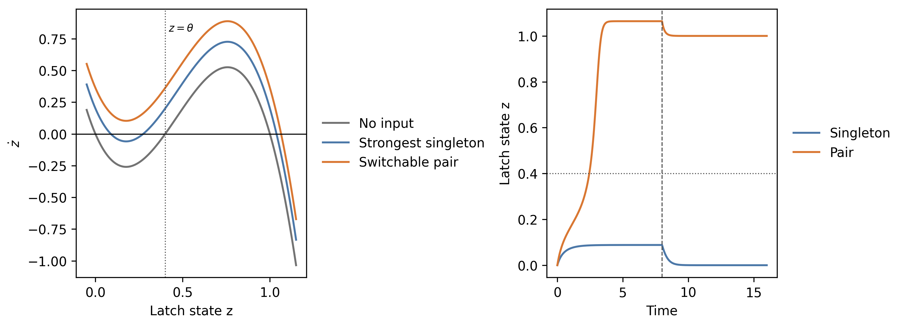

*图 1. 左：最强单点输入仍保留低态稳定零点，可切换节点对使低态零点消失。右：固定点火至 \(T=8\) 后释放；单点轨迹返回低态，联合轨迹保持在高态。*

## 2. 以最终 basin 标签定义组合协同

默认实例含 8 个候选源节点，共评估 28 个节点对。对每一对 \((i,j)\) 隔离干预，其余源节点固定为零；\(\Delta_i,\Delta_j\) 独立取 16 个均匀离散幅度状态。固定点火 \(T=8\) 后释放系统，最终高低 basin 标签记为 \(Y\in\{0,1\}\)。

组合分数定义为

$$
\operatorname{Syn}_{ij}
=I(\Delta_i,\Delta_j;Y)
-I(\Delta_i;Y)-I(\Delta_j;Y).
$$

独立最大熵干预消除了源变量之间的冗余，因此数值上验证了

$$
\operatorname{Syn}_{ij}
=I(\Delta_i;\Delta_j\mid Y)\ge 0.
$$

这使高 synergy 具有清楚的操作含义：只有同时知道两个点火幅度，才能充分预测最终进入哪个 basin。

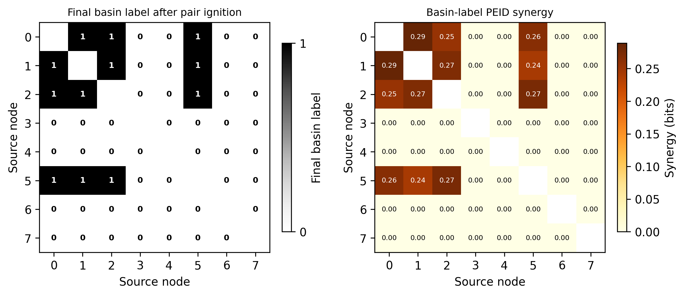

*图 2. 一个代表性随机实例中，左图逐格用 \(0/1\) 表示最大联合点火并释放后的最终 basin 标签，右图逐格给出对应节点对的 PEID Syn 值。两图使用完全相同的节点对排列，可以直接检查点火成功区域与高 Syn 区域是否对应；本实例中二者完全对应。*

以 \(\operatorname{Syn}_{ij}>10^{-12}\) 定义非零 Syn 支持集时，50 个随机实例、共 1400 个精确网格节点对均满足

$$
Y_{ij}^{\max}=1
\quad\Longleftrightarrow\quad
\operatorname{Syn}_{ij}>10^{-12}.
$$

因此，左图的点火成功区域与右图的非零 Syn 区域在当前受控动力学中逐格完全对应。这里的“完全对应”指是否成功的支持集一致，不表示所有成功组合具有相同 Syn 数值。

## 3. 组合发现结果与基线比较

实验在 50 个随机参数实例上比较 PEID Syn、joint EI、单节点 EI 之和、固定成本双点响应和随机排序。主评价为可切换组合识别的 AUPRC、top-\(k\) recall 和 top-1 命中率。

| 条件 | 方法 | AUPRC | top-\(k\) recall | top-1 |
|---|---|---:|---:|---:|
| 精确 \(16\times16\) 网格 | PEID Syn | 1.000 | 1.000 | 1.000 |
| 精确 \(16\times16\) 网格 | Joint EI / 单节点 EI 和 / 固定响应 | 1.000 | 1.000 | 1.000 |
| 512 样本，5% 标签噪声 | PEID Syn | 1.000 | 1.000 | 1.000 |
| 128 样本，10% 标签噪声 | PEID Syn | 0.739 | 0.640 | 0.900 |
| 128 样本，10% 标签噪声 | Joint EI / 单节点 EI 和 / 固定响应 | 1.000 | 1.000 | 1.000 |

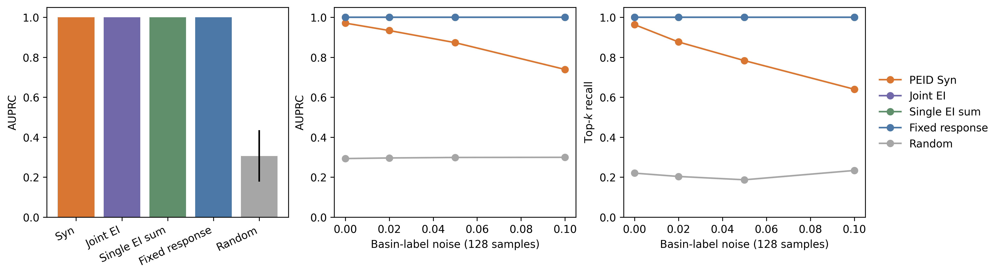

*图 3. 左：无噪声精确网格上的 AUPRC。中、右：128 样本条件下随 basin 标签噪声变化的 AUPRC 与 top-\(k\) recall。图中重合曲线表示多个基线表现相同。*

预设的主张门槛全部通过：无噪声集成中 PEID Syn 的平均 AUPRC 与 top-\(k\) recall 均为 \(1.000\)，512 样本、5% 标签噪声下平均 AUPRC 也为 \(1.000\)。因此，可以把 synergy 表述为这个系统中的良好组合发现测度。

不过，这一结论不能扩展成“synergy 优于其他测度”。在当前加性锁存构造中，可切换组合主要由源权重强弱决定，joint EI、单节点 EI 之和与固定成本响应同样能恢复该结构；低样本高噪声下，synergy 还更容易受标签误差影响。显式 AND 门正对照中，预设真实节点对获得 synergy 第一名，确认了 PEID 对严格协同超边的恢复能力，但这仍只是机制正对照。

## 4. Synergy 识别组合，但不精确刻画成本

次要分析比较了分数与最小联合点火成本。在精确网格条件下，synergy 与最小成本的平均 Spearman 相关仅为 \(-0.139\)，按 synergy 选择组合的平均成本 regret 为 \(0.144\)。固定成本响应与最小成本的相关更强，平均 Spearman 相关为 \(-0.810\)，且选择 regret 为 \(0\)。

因此，synergy 在这里回答的是“哪些节点必须共同参与才能解释 basin 切换”，而不是“哪个有效组合的最小控制成本最低”。组合可行性筛选与精确成本优化应当作为两个阶段处理。

## 5. 三个典型动力学正对照

为确认上述阈值构造不是专属于多项式锁存器，我们在三个领域中常见的双稳态模型上重复同一受控目标模块实验。候选源节点仍只作为进入同一目标模块的外部输入通道，因此源节点之间的网络结构不参与判定；这里检验的是：只要目标动力学自身带有低态 basin 的鞍结逃逸阈值，是否仍可构造“单点失败、双点成功”的组合点火问题。

需要强调的是，本节的 final basin label 不是一个多节点网络整体状态的 basin 标签，而是同一个一维目标模块 \(x(t)\) 在点火释放后落入低态 basin 还是高态 basin 的标签。候选源节点之间没有传播边、抑制边或社区结构；网络结构只体现在“哪些候选输入通道以多大权重 \(w_i\) 汇入目标模块”。因此这里的结论不能解释任意给定网络上的全局恢复 basin，只说明在受控 target-module 口径下，PEID synergy 能恢复由加性输入阈值诱导的联合必要组合。

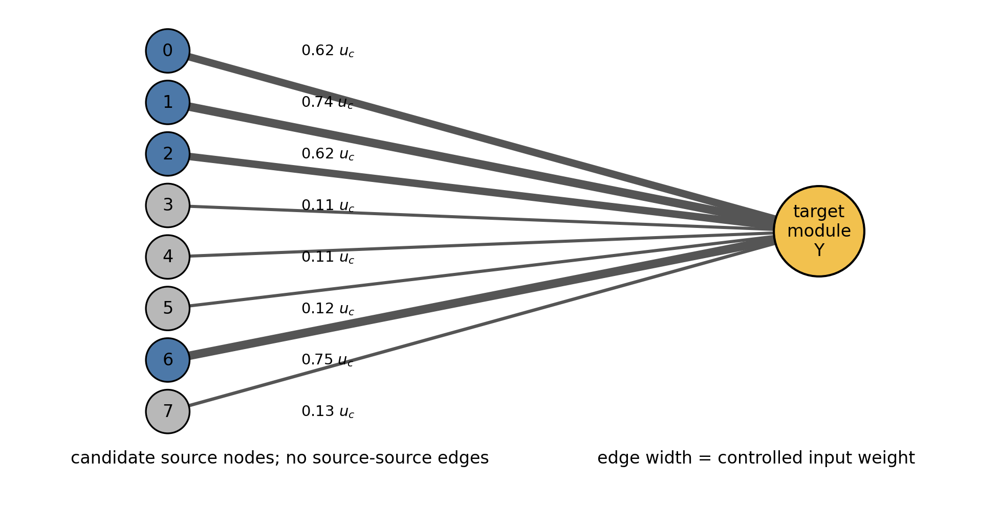

*图 4. 本节正对照使用的控制结构示意。8 个候选源节点没有源-源边，均作为外部输入通道汇入同一个双稳态目标模块；边宽表示归一化输入权重 \(w_i/u_c\)。final basin label \(Y\) 是目标模块释放后的高低 basin 标签，而不是整个源节点网络的 basin。*

三个模型分别为

$$
\dot x=-x+S(\beta x)+u
$$

的 Wilson-Cowan 神经群体模型、

$$
\dot x=r x(1-x/K)(x/A-1)+u
$$

的强 Allee effect 生态恢复模型，以及

$$
\dot x=k_0+k_1x^2-k_2x^3-k_3x+u
$$

的 Schlögl 化学自催化模型。每个模型的 \(u_c\) 都由原始物理动力学的 saddle-node 条件给出，即存在临界状态 \(x_\ast\) 使

$$
f(x_\ast)+u_c=0,\qquad f'(x_\ast)=0.
$$

因此 \(u_c\) 不是事后分类阈值，而分别表示擦除低放电吸引子所需的最小外部电流、克服强 Allee 阈值所需的最小补种/移入率，以及移除低浓度吸引子所需的最小进料通量。

| 模型 | \(u_c\) | 物理含义 | support match | AUPRC | top-\(k\) recall | \(\rho\)(成功率, Syn) |
|---|---:|---|---:|---:|---:|---:|
| Wilson-Cowan | 0.0419 | 最小外部电流 | 1.000 | 1.000 | 1.000 | 0.971 |
| Allee effect | 0.0730 | 最小补种/移入率 | 1.000 | 1.000 | 1.000 | 0.973 |
| Schlögl | 0.0866 | 最小进料通量 | 1.000 | 1.000 | 1.000 | 0.972 |

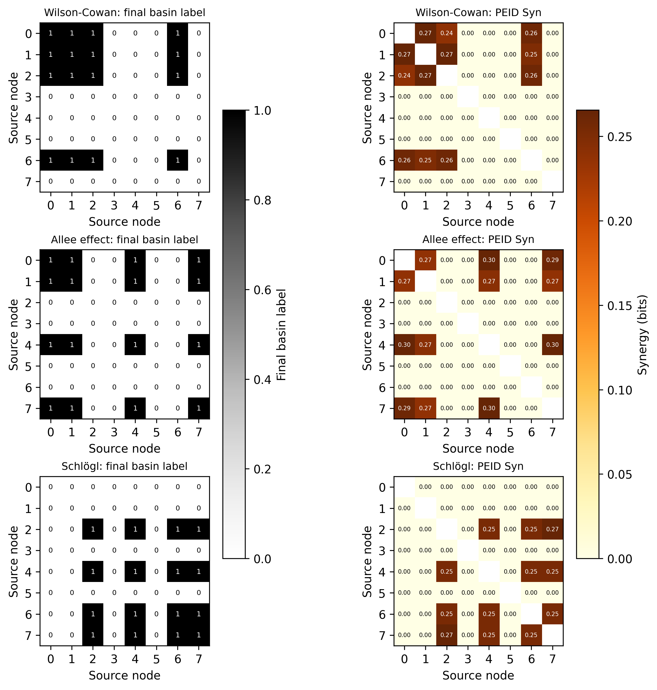

*图 5. 三个领域模型中，最大双点点火后的最终 basin 标签与对应 PEID Syn 矩阵保持同一支持集。每个模型使用同一候选源节点生成规则，但 \(u_c\) 来自各自的物理鞍结阈值。*

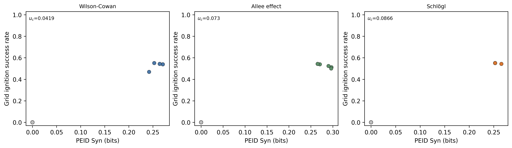

*图 6. 在代表性实例中，PEID Syn 与离散点火网格上的成功率呈强正相关。该图说明 synergy 不只恢复二值可行集合，也跟“该节点对在多少点火幅度组合下成功”保持一致趋势。*

这个正对照支持一个更一般的表述：在受控目标模块口径下，只要模型有物理上明确的低态逃逸阈值，就可以把单源权重限制在 \(u_c\) 以下、把部分双源权重和放在 \(u_c\) 以上，从而得到严格联合点火问题。相反，如果要求点火信号只沿任意给定网络传播，则该结论不能无条件成立；断连、强抑制或目标本身无双稳态都会破坏恢复。

## 6. 随机/小世界全网 basin 转移

为把上述 target-module 口径推进到真正的网络结构，我们进一步在 \(N=14\) 的 ER 随机网络和 Watts-Strogatz 小世界网络上运行全网点火筛选。动力学使用已有的 Wilson-Cowan 型 Neural 网络模型和 Allee/Lotka-Volterra 型 Eco 网络模型；邻接矩阵按平均入度归一化后乘以候选 coupling scale。每个模型-网络组合自动筛选 10 个合格实例：所有单节点在同等总强度 \(2\Delta_{\max}\) 下释放后仍落入低 basin，但至少 3 个双节点对在 \((\Delta_{\max},\Delta_{\max})\) 下能把全网释放到高 basin，且不是所有节点对都成功。

这里的 basin label 是全网状态的标签。具体地，先估计低初值和高初值自由演化后的最终全网均值，以二者中点作为高低 basin 阈值；点火阶段固定一个或两个源节点，随后释放所有节点自由演化，最终全网均值超过阈值时记为 \(Y=1\)。因此这一节不再是单一目标模块的 basin，而是网络整体在释放后的 basin 转移。

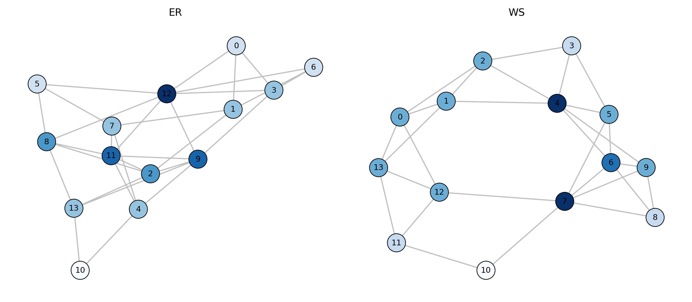

*图 7. 合成全网实验的代表网络结构。ER 网络呈随机连接，小世界网络保留环状局部连接并带有少量重连边；节点颜色表示加权度。*

| 动力学 | 网络 | 合格实例 | 单点失败率 | 成功节点对数 | \(\rho\)(成功率, Syn) | top-\(k\) recall |
|---|---|---:|---:|---:|---:|---:|
| Neural | ER | 10 | 1.000 | 400 | 0.999 | 1.000 |
| Neural | WS | 10 | 1.000 | 211 | 1.000 | 1.000 |
| Eco | ER | 10 | 1.000 | 245 | 0.993 | 0.996 |
| Eco | WS | 10 | 1.000 | 226 | 0.985 | 0.451 |

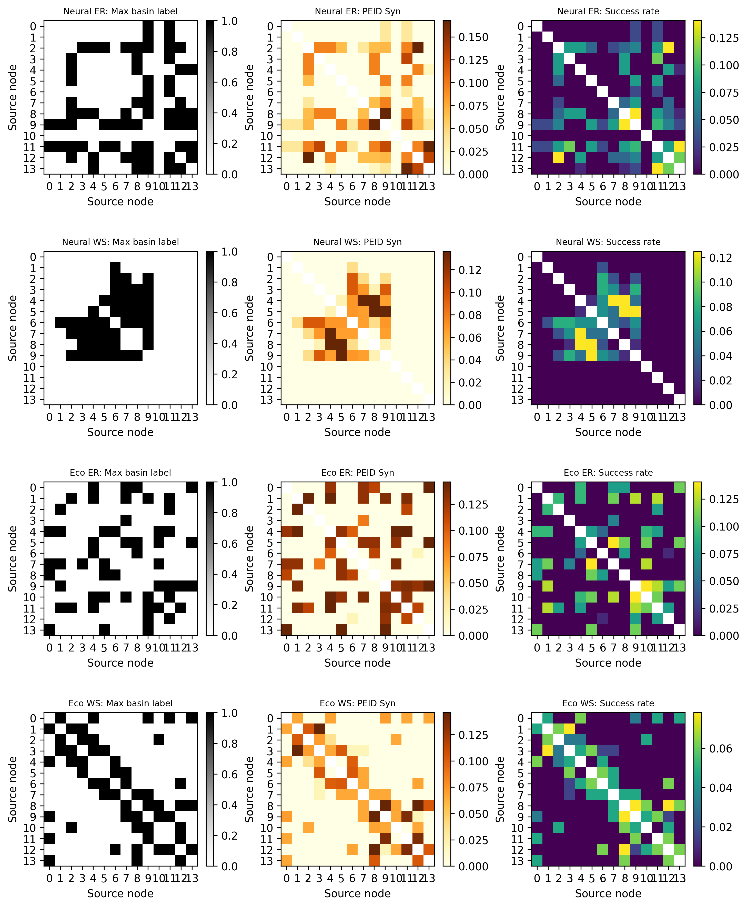

*图 8. 每个模型-网络组合的代表实例。左列给出最大双点点火后的全网 basin 标签，对角线表示单节点同等总强度点火是否成功；中列为 basin-label PEID Syn；右列为离散点火网格上的成功率。*

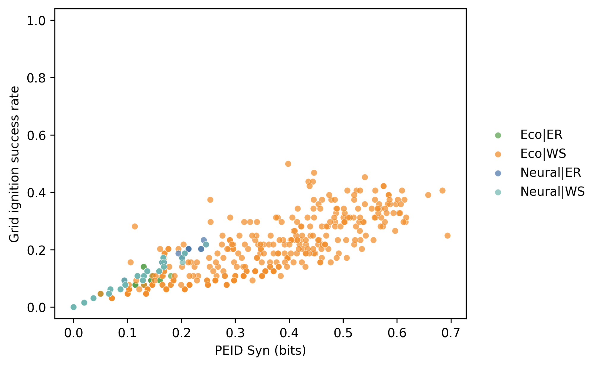

*图 9. 合格实例池中，节点对的 PEID Syn 与点火网格成功率整体正相关。该结果支持“Syn 越高，节点对成功概率越大”的弱排序主张，但 Eco 小世界网络的 top-\(k\) recall 较低，说明局部结构会让高成功率和最高 Syn 的排序不完全一致。*

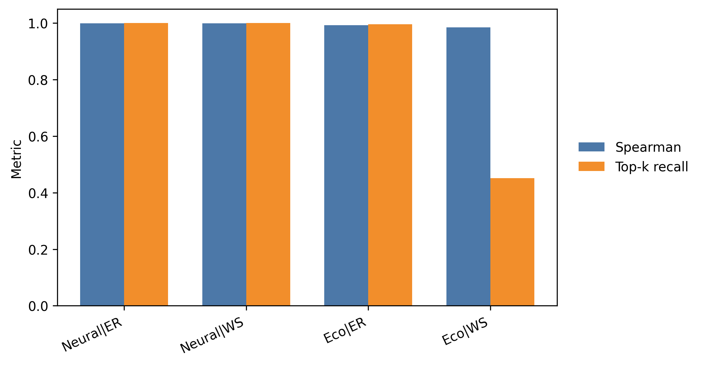

*图 10. 四个模型-网络组合的 pooled Spearman 相关和 top-\(k\) recall。Spearman 均保持较高，top-\(k\) recall 在 Eco 小世界网络上下降，提示网络传播几何会影响精确排序。*

这个全网正对照给出了比受控 target module 更强的证据：在随机和小世界传播结构中，也可以筛选出严格联合必要的全网 basin 转移实例，并且 basin-label PEID Syn 与节点对成功概率保持正相关。与此同时，它也限定了结论强度：Syn 更适合发现“可能联合有效”的组合，而不是在所有网络结构上保证给出最优排序。

## 7. 初态源变量的低成本 Syn 代理

为检验是否存在更廉价的 Syn 计算路径，我们保留 PEID Syn 的信息定义不变，但把源变量和目标变量换成短时自由演化中更容易获得的量。具体地，对每个代表网络独立采样初态 \(x(0)\)，把每个节点的初态等频分成 4 个离散 bin，令 \(S_i=\operatorname{bin}(x_i(0))\)、\(S_j=\operatorname{bin}(x_j(0))\)。目标变量不再使用最终 basin 标签，而是短时全网均值增长：
\[
Y = \mathbf{1}\{\bar{x}(t_{\mathrm{short}})-\bar{x}(0) > \operatorname{median}\}.
\]
随后仍计算
\[
\operatorname{Syn}_{ij}=I(S_i,S_j;Y)-I(S_i;Y)-I(S_j;Y).
\]

该实验只复用上一节的 4 个代表网络，不重新筛选全部实例；因此它是一个便宜代理的快速 sanity check，而不是主 basin-label 结果的替代。

| 动力学 | 网络 | 有效 pair | \(\rho\)(代理 Syn, 成功率) | \(\rho\)(代理 Syn, basin Syn) | top-\(k\) recall |
|---|---|---:|---:|---:|---:|
| Neural | ER | 91 | 0.063 | 0.063 | 0.471 |
| Neural | WS | 91 | 0.132 | 0.132 | 0.409 |
| Eco | ER | 91 | 0.055 | 0.024 | 0.222 |
| Eco | WS | 91 | 0.063 | 0.068 | 0.321 |

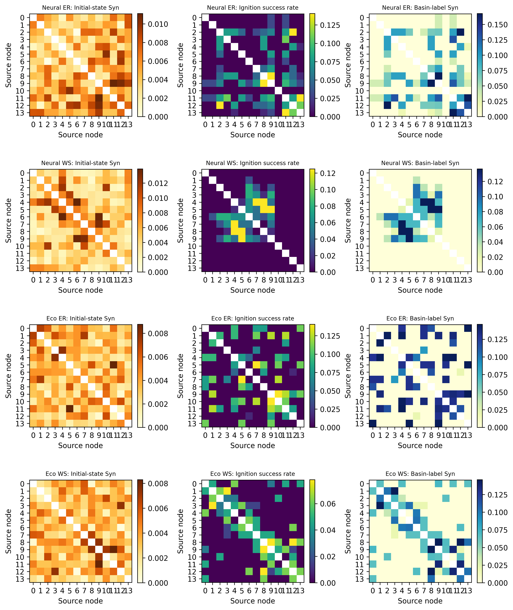

*图 11. 每个代表网络中，初态代理 Syn、原双点点火成功率和原 basin-label Syn 的矩阵对照。代理目标来自短时自由演化，不包含任何固定点火网格。*

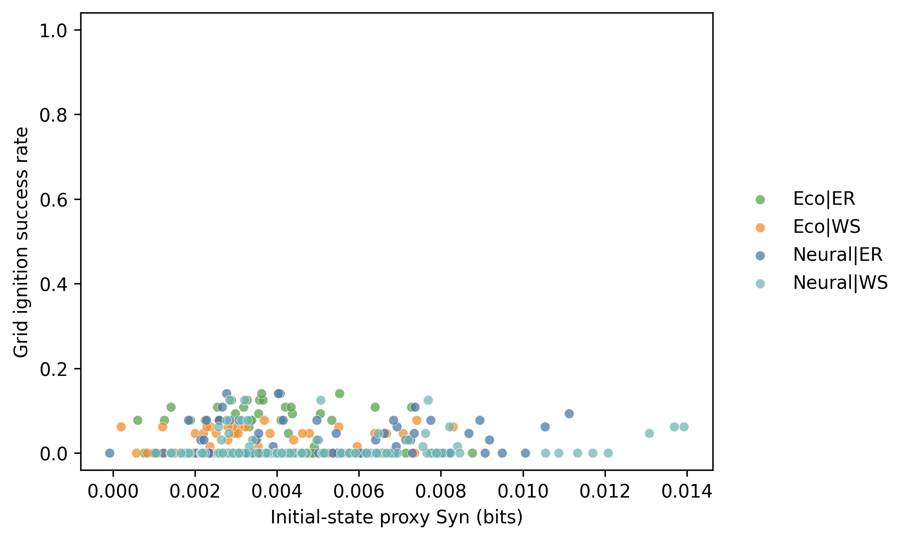

*图 12. 初态代理 Syn 与原点火成功率仅呈弱正相关。该结果说明初态-短时响应变量能提供少量排序信号，但丢失了最终 basin 转移所需的非线性阈值信息。*

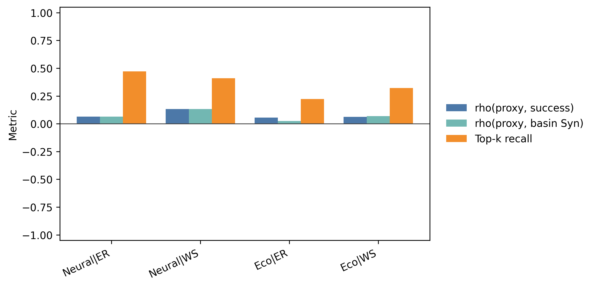

*图 13. 代理 Syn 相对原成功率和原 basin-label Syn 的 Spearman 相关均较弱，top-\(k\) recall 也明显低于 basin-label 主实验。*

因此，推荐的低成本版本可以作为预筛选或诊断工具：它不需要连续固定值干预，也不需要跑到最终吸引子，但只能给出弱排序线索。若目标是证明“单节点不行、双节点可使全网 basin 转移”，仍应使用上一节的释放后全网 basin label 作为主目标。

### transport-map 初态 Syn 探索

进一步把同一初态代理的 MI 估计器从离散分箱换成 transport map。这里源变量使用连续初态 \((x_i(0),x_j(0))\)，目标变量使用连续短时全网均值增长 \(\Delta\bar{x}=\bar{x}(t_{\mathrm{short}})-\bar{x}(0)\)，并估计
\[
\operatorname{Syn}^{\mathrm{TM}}_{ij}
= I(x_i(0),x_j(0);\Delta\bar{x})
- I(x_i(0);\Delta\bar{x})
- I(x_j(0);\Delta\bar{x}).
\]
为了保持轻量，每个模型-网络组合只按原点火成功率分层抽取 30 个节点对，使用 512 个初态样本。transport map 后端为 polynomial triangular transport map degree 3。

| 动力学 | 网络 | 抽样 pair | \(\rho\)(TM Syn, 成功率) | \(\rho\)(TM Syn, basin Syn) | top-\(k\) recall |
|---|---|---:|---:|---:|---:|
| Neural | ER | 30 | -0.222 | -0.222 | 0.273 |
| Neural | WS | 30 | 0.222 | 0.222 | 0.429 |
| Eco | ER | 30 | 0.030 | 0.045 | 0.222 |
| Eco | WS | 30 | 0.211 | 0.204 | 0.444 |

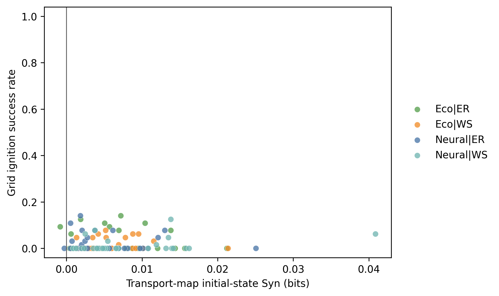

*图 14. transport-map 初态 Syn 与原点火成功率的关系。小世界网络中出现弱正相关，但 ER 网络尤其 Neural ER 不稳定。*

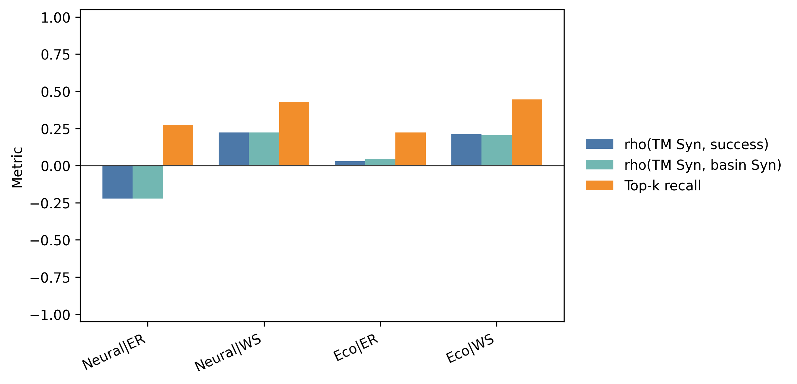

*图 15. transport-map 连续估计没有带来整体改善。pooled \(\rho\)(TM Syn, 成功率) 为 0.033，低于离散初态代理的 0.060；top-\(k\) recall 也基本持平。*

这个探索说明，问题不主要在离散分箱估计器，而在便宜目标变量本身：短时均值增长没有充分编码最终 basin 阈值和释放后吸引子选择。transport map 能减少分箱带来的信息损失，但也会放大连续估计方差；在当前轻量样本下，它没有稳定改善“找双节点 basin 转移 pair”的排序。

## 8. 旧单节点多吸引子实验作为反例对照

此前的三节点多吸引子实验允许持续单点干预直接切换到对应高态。三个节点的 synergy 分别为 \(0.262,0.370,0.371\)，最小成本分别为 \(0.150,0.100,0.125\)，Pearson 相关为 \(-0.864\)，但样本仅有三个节点，Spearman 相关也只有 \(-0.500\)。它说明当单点本身即可切换时，synergy 最多弱预测切换难度，不能证明联合点火必要性。

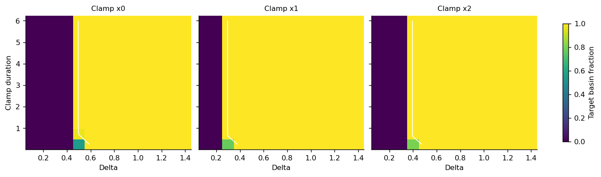

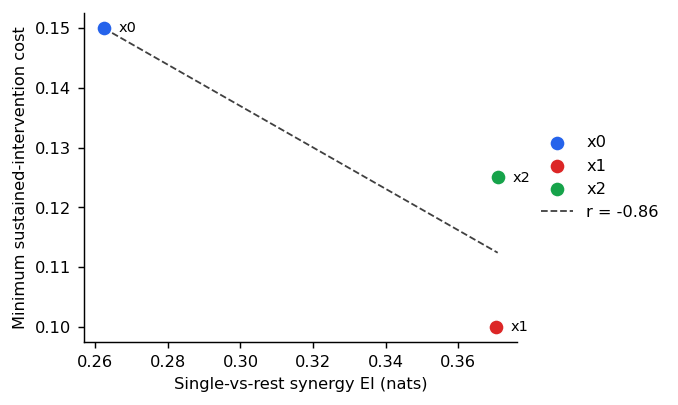

*图 16. 旧单节点实验的结果图保留为反例对照：它展示成本差异，但不包含严格的组合发现问题。*

## 9. 结论边界

严格联合必要系统给出的结论是：**当最终 basin 标签确实由两个独立干预源共同决定时，PEID synergy 可以可靠发现应当联合点火的节点组合。** 该结论目前覆盖二节点联合点火、Oracle ODE、受控参数族，以及小规模 ER/小世界全网 Neural/Eco 正对照。初态代理实验进一步说明，改变源变量和目标变量后仍可计算同一定义的 Syn，但便宜目标只保留弱排序信号；transport-map 连续估计也没有在轻量设置下解决这一问题。其他点火实验仍用于限定适用范围：全局可恢复性、传播结构、时间尺度和控制成本需单独建模，synergy 也不应被预设为优于 joint EI 或任务特定响应测度。
