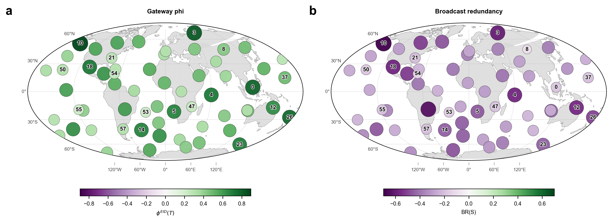

# Runge 1948-2026 gateway phi 与 broadcast redundancy

本文检查 `docs/ref/syn_red_gateway_braodcast.md` 中定义的两个节点级指标，作用对象是 1948-2026 daily SLP 数据训练出的缓存 MLP transition model。目标是看这两个指标能否在地球图上识别 causal gateway 和 broadcaster。

## 计算口径

使用已有 1948-2026 SLP run root：

- 周状态：60 个 Varimax component，过去 4 周预测下一周。
- 模型：缓存 MLP ensemble，没有重新训练。
- 干预样本：`4096` 个最大熵独立样本。
- 估计器：Gaussian log-det MI。这里没有复用 pairwise TM-EI 表，而是在同一批 MLP 干预预测上重算 pairwise、全源和联合目标 EI，使两个指标内部使用同一估计口径。
- 自环：默认排除 `X_i(t)\to X_i(t+1)` 的 pairwise 单源项，避免短期 persistence 主导跨节点读数。

对每个目标节点 $T_j$：

$$
\phi^{EID}(T_j)
=
EI(\mathbf{x}\to T_j)
-
\sum_{i\ne j}EI(X_i\to T_j).
$$

对每个源节点 $S_i$：

$$
BR(S_i)
=
\sum_{j\ne i}EI(S_i\to T_j)
-
EI(S_i\to \mathbf{T}).
$$

## 地理分布

图中 a 面板为 $\phi^{EID}(T)$，b 面板为 $BR(S)$。圆越大表示绝对值越大，绿色为正值，紫色为负值。

## 主要读数

`gateway_phi_eid` 全部为正，范围为 `0.220878` 到 `0.894129` bits。最高的节点是：

| rank | component | paper label | gateway phi |
|---:|---|---:|---:|
| 1 | component_11 | 10 | 0.894129 |
| 2 | component_04 | 3 | 0.820424 |
| 3 | component_01 | 0 | 0.784973 |
| 4 | component_09 | 26 | 0.762387 |
| 5 | component_05 | 4 | 0.709571 |
| 6 | component_08 | 18 | 0.707516 |
| 7 | component_24 | 23 | 0.687957 |
| 8 | component_15 | 14 | 0.682716 |
| 9 | component_06 | 5 | 0.670859 |
| 10 | component_13 | 12 | 0.647710 |

这个结果说明：在该 MLP 通道中，许多目标节点的联合全系统输入 EI 明显超过跨节点单源 EI 之和。作为 gateway 候选读数，$\phi^{EID}$ 可以给出清晰的空间排序；但它更准确地说是“需要联合输入解释的目标节点”，不是已经验证过的物理通道。

`broadcast_redundancy` 全部为负，范围为 `-0.697782` 到 `-0.0920041` bits。最接近正值的节点是：

| rank | component | paper label | broadcast redundancy |
|---:|---|---:|---:|
| 1 | component_27 | 8 | -0.0920041 |
| 2 | component_55 | 54 | -0.146302 |
| 3 | component_54 | 53 | -0.174561 |
| 4 | component_01 | 0 | -0.182023 |
| 5 | component_51 | 50 | -0.186257 |
| 6 | component_48 | 47 | -0.196292 |
| 7 | component_56 | 55 | -0.199671 |
| 8 | component_58 | 57 | -0.202231 |
| 9 | component_38 | 37 | -0.211729 |
| 10 | component_49 | 21 | -0.212664 |

这不支持“存在强 broadcaster”的结论。按当前定义和 Gaussian 估计，单个源到联合目标的 EI 大于它到各单目标 EI 的加和，表现为目标侧互补编码，而不是 broadcast redundancy。若要报告 broadcaster，只能说 component_27、55、54 等是“最不互补”的候选，而不是正冗余 broadcaster。

## 结论

`gateway_phi_eid` 在 1948-2026 SLP MLP 上给出了稳定、可排序的正读数，可以作为 causal gateway 候选筛选指标继续和 Runge ACE、Scheme A AMCE 对照。

`broadcast_redundancy` 在同一口径下全为负，因此当前 MLP 并没有显示一源多目标广播复制结构。这个负结果本身有信息量：该模型的单源输出更像分散到联合目标中的互补约束，而不是多个目标重复承载同一份源信息。

## 输出文件

- 结果表：`results/runge_slp_daily_1948_2026_20260628/mlp_tm_ei_lag04/results/runge/gateway_broadcast_metrics/gateway_broadcast_scores.csv`
- 地图节点表：`results/runge_slp_daily_1948_2026_20260628/mlp_tm_ei_lag04/results/runge/gateway_broadcast_metrics/gateway_broadcast_map_nodes.csv`
- 运行 manifest：`results/runge_slp_daily_1948_2026_20260628/mlp_tm_ei_lag04/results/runge/gateway_broadcast_metrics/manifest.json`
- 原始图：`results/runge_slp_daily_1948_2026_20260628/mlp_tm_ei_lag04/fig/runge/gateway_broadcast_metrics/gateway_phi_broadcast_redundancy_map.png`
