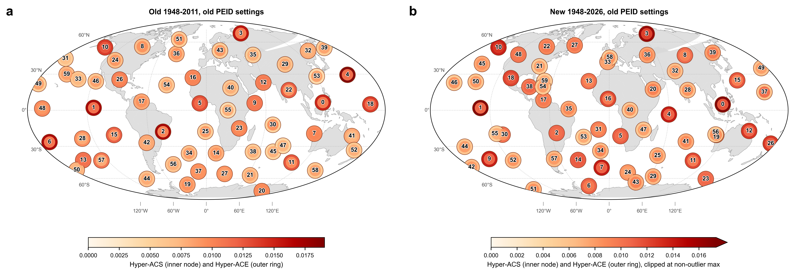
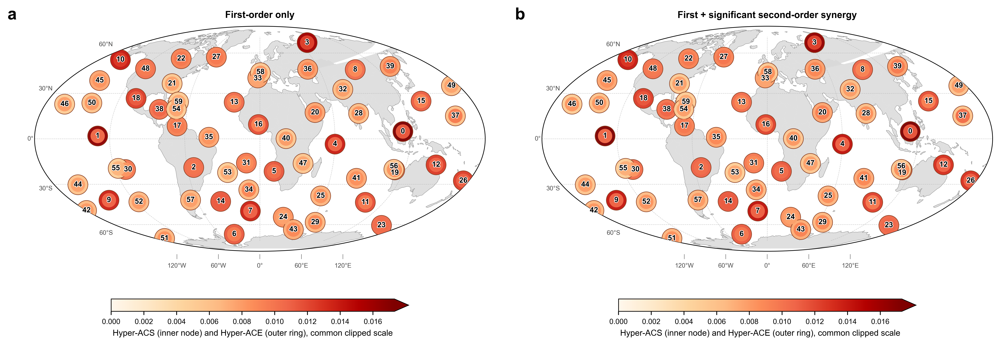
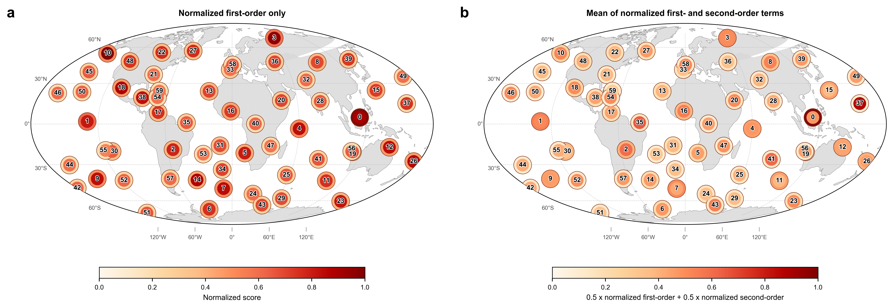
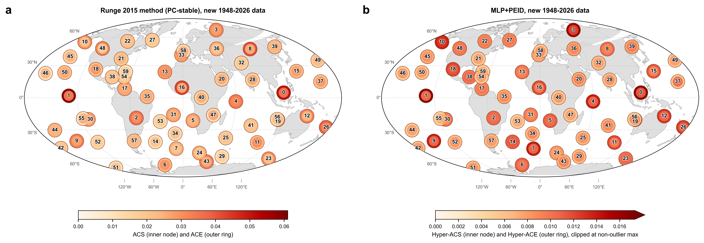

# Runge MLP+PEID ACE/ACS 旧口径对齐结果

## 结论

这次只看 ACE/ACS，不看 AMCE。先核对预处理：旧结果和 1948-2026 新结果的 manifest 都记录为 `drop_feb29_365_day`、`gridpoint_calendar_day_mean_std`、`gridpoint_linear_time_axis`。也就是说，去季节化口径已经是旧方式：删除 2 月 29 日，按 365-day calendar day 做逐格点多年均值和标准差标准化，再沿时间轴线性去趋势。因此本轮没有重新生成 component preprocessing，而是在新 1948-2026 component scores 上重训 MLP，并把 PEID 候选枚举改回旧口径。

本轮新跑结果放在：

`results/runge_slp_daily_1948_2026_oldstyle_ace_acs/mlp_tm_ei_lag04/`

对齐后的核心判断：

- 新数据已用旧 MLP/PEID 口径重训和重算：`candidate_top_sources=14`、`candidate_target_topk=10`、`order_max=2`、`null_reps=20`、`|z|\ge2`。
- 旧结果 order-2 candidates 为 `1625`，新数据旧口径为 `1638`，已经基本对齐；此前新门控版的 `2764` 候选项差异被消除。
- 通过 $|z|\ge2$ 的二阶项：旧结果 `307`，新数据旧口径 `287`。
- ACE 主导节点仍发生改变：旧结果 top-3 是 `component_05/03/02`，新数据旧口径 top-3 是 `component_01/02/04`。
- ACS 的 top-1 都是 `component_11`，这一点比 ACE 更对齐；但 top-2/top-3 仍变化。

因此：**在只看 ACE/ACS 且统一旧 PEID 候选口径后，差异已经更接近“数据和重拟合 component/MLP 导致”，不再主要来自候选搜索空间扩大。** 但 component 基底是用 1948-2026 重新拟合的，所以编号相同不保证空间模态完全同一。

## 对齐图

图中外圈是 Hyper-ACE，内圈是 Hyper-ACS。两面板分别设置 colorbar。a 面板使用真实最大值 `0.01907` 作为色标上限；b 面板的真实最大值是 0 号节点 ACE `0.02778`，为避免单个极值压平其他节点颜色，b 面板色标上限改为非 0 号极值后的最大值 `0.01732`，0 号节点以饱和色显示，colorbar 右端箭头表示仍有超上限值。

## 运行配置

### pairwise MLP-TM-EI

新数据上已重新训练 MLP，不是复用旧数据模型。关键设置：

| 项目 | 设置 |
|---|---:|
| component scores | `results/runge_slp_daily_1948_2026_20260628/results/runge/2015_gateways/component_weekly_scores.csv` |
| rows / lagged samples | `4078 / 4074` |
| lag / horizon | `4 / 1` |
| hidden_dim / num_layers / dropout | `128 / 1 / 0.5` |
| epochs | `120` |
| ridge ensemble | `10, 100, 1000, 3000` |
| linear blend grid | `101` |
| intervention samples | `4096` |
| source_mode | `latest` |
| model cache reused in pairwise step | `False` |
| val RMSE / corr | `0.70420 / 0.45116` |

pairwise manifest：

`results/runge_slp_daily_1948_2026_oldstyle_ace_acs/mlp_tm_ei_lag04/results/runge/pairwise_mlp_tm_ei_path_effects/manifest.json`

### PEID hypergraph

PEID 阶段复用刚训练出的新模型缓存，并使用旧候选口径：

| 项目 | 旧结果 | 新数据旧口径 |
|---|---:|---:|
| candidate_top_sources | `14` | `14` |
| candidate_target_topk | `10` | `10` |
| order_max | `2` | `2` |
| null_reps / block_size | `20 / 26` | `20 / 26` |
| order-2 candidates | `1625` | `1638` |
| selected $|z|\ge2$ terms | `307` | `287` |
| selected $|\Delta_2|$ sum | `0.548406` | `0.516257` |

PEID manifest：

`results/runge_slp_daily_1948_2026_oldstyle_ace_acs/mlp_tm_ei_lag04/results/runge/peid_hypergraph/manifest.json`

## ACE/ACS 排名对比

| 指标 | 旧 1948-2011 | 新 1948-2026，旧口径 |
|---|---:|---:|
| ACE top 1 | `component_05` = `0.019067` | `component_01` = `0.027780` |
| ACE top 2 | `component_03` = `0.017423` | `component_02` = `0.017320` |
| ACE top 3 | `component_02` = `0.017295` | `component_04` = `0.016409` |
| ACS top 1 | `component_11` = `0.012457` | `component_11` = `0.012674` |
| ACS top 2 | `component_06` = `0.011588` | `component_04` = `0.012209` |
| ACS top 3 | `component_08` = `0.011470` | `component_01` = `0.011314` |

ACE 的 top-3 只保留了 `component_02`。ACS 的 top-1 保持为 `component_11`，说明目标侧汇入强度比源侧外向强度更稳定。

## 新数据：只看一阶 vs 加入二阶协同

下面只用 1948-2026 新数据旧口径结果，component 位置、MLP、PEID 输出和标签规则不变。a 面板只画一阶项：ACE 使用 `hyper_ace_order1`，ACS 使用 `hyper_acs_order1`；b 面板画当前结果：ACE/ACS 使用一阶加通过 `|z|\ge2` 门控的二阶协同项。两面板共用同一个稳健截断色标，上限为 `0.01732`，0 号节点的 ACE 超过上限并以饱和色显示。

| 指标 | 只看一阶 | 一阶 + 二阶协同 |
|---|---:|---:|
| ACE top 1 | `component_01` = `0.026424` | `component_01` = `0.027780` |
| ACE top 2 | `component_02` = `0.016656` | `component_02` = `0.017320` |
| ACE top 3 | `component_04` = `0.015813` | `component_04` = `0.016409` |
| ACE top 4 | `component_11` = `0.014021` | `component_19` = `0.014361` |
| ACE top 5 | `component_05` = `0.013808` | `component_05` = `0.014352` |
| ACS top 1 | `component_11` = `0.012631` | `component_11` = `0.012674` |
| ACS top 2 | `component_04` = `0.012185` | `component_04` = `0.012209` |
| ACS top 3 | `component_01` = `0.011290` | `component_01` = `0.011314` |

这个对比说明：二阶协同在当前旧口径新数据里主要是给既有强节点加小幅增量。ACE top-3 和 ACS top-3 都不变；ACE 的中游排序会有轻微变化，例如 `component_19` 在加入二阶后进入 ACE top-4。

## 标准化后一阶/二阶等权平均

上一节仍保留原始量纲，所以二阶项只占一阶约 `1.61%`，视觉差异很小。为了专门观察二阶项的空间模式，可以先把一阶项和二阶项各自标准化到 `[0,1]`，再等权平均：

$$
S_{\mathrm{ACE}}(i)=\frac{1}{2}\frac{\mathrm{ACE}^{(1)}(i)}{\max_j \mathrm{ACE}^{(1)}(j)}
+\frac{1}{2}\frac{\mathrm{ACE}^{(2)}(i)}{\max_j \mathrm{ACE}^{(2)}(j)} ,
$$

ACS 同理。这个指标不再表示原始贡献量，而是表示“一阶相对强度”和“二阶相对强度”的等权组合。

标准化后，二阶空间模式会被明显放大。ACE 的 top 仍由 0 号主导，但中游排序发生变化；ACS 的变化更大，标准化平均后的 ACS top-3 变为 `component_38/36/42`，而一阶 ACS top-3 是 `component_11/04/01`。因此这张图适合用来说明“二阶项如果按相对模式等权纳入，会强调另一组节点”，但不能替代原始 ACE/ACS 主图。

## 原文 Runge 2015 ACE/ACS 方法对比

原文 `Identifying causal gateways and mediators in complex spatio-temporal systems` 的 ACE/ACS 是在线性 causal effect network 上定义的：对每一对变量先取跨 lag 的最大绝对 causal effect，ACE 是源节点对其他节点的平均输出效应，ACS 是目标节点从其他节点接收的平均输入敏感度。仓库复现实现在 `scripts/reproduce_runge2015_gateways.py` 的 `compute_sem_effects` 中，使用 `ce_max_abs` 对源/目标求平均。

这里的 Runge 面板使用修正后的 parent-selection 口径：先取 `run_pc_stable` 的 parents，再做稀疏线性回归和 link-density threshold。此前误用最终 MCI `p_matrix` 会让 No.3 过高；修正后新数据中 No.3 为 ACE 第 12、ACS 第 13。

下面在同一套 1948-2026 新数据 component 上，对比原文方法和当前 MLP+PEID Hyper-ACE/Hyper-ACS。两个面板使用各自 colorbar，因为原文线性 SEM 的 ACE/ACS 数值尺度明显大于 MLP+PEID；b 面板继续对 0 号 PEID 极值做 colorbar 截断以保留其他节点颜色层次。

注意：这个 Runge 原文方法面板使用的是修正后的 PC-stable parent 复现结果，但仍不应直接视为原文 Fig. 4 的完全复刻。剩余差异主要来自年份口径、PC-stable parent set 与补充表仍未完全一致，以及 component label 未完整校准。详见 [Runge_Original_Method_No3_Diagnostic.md](Runge_Original_Method_No3_Diagnostic.md)。

| 指标 | 原文 Runge 2015 方法 | MLP+PEID |
|---|---:|---:|
| ACE top 1 | `No.1` = `0.061025` | `component_01` = `0.027780` |
| ACE top 2 | `No.0` = `0.052187` | `component_02` = `0.017320` |
| ACE top 3 | `No.16` = `0.044155` | `component_04` = `0.016409` |
| ACS top 1 | `No.0` = `0.035757` | `component_11` = `0.012674` |
| ACS top 2 | `No.1` = `0.034611` | `component_04` = `0.012209` |
| ACS top 3 | `No.26` = `0.032326` | `component_01` = `0.011314` |

源侧 ACE 的强节点有一定重合，尤其低阶节点仍靠前；但目标侧 ACS 差别更明显。修正后的 Runge 方法更强调 `No.0/1/26` 这组节点的输入敏感度，而 MLP+PEID 的 ACS top-1 是 `component_11`。

## 与此前 1948-2026 门控版的差别

此前 1948-2026 门控版使用 `candidate_top_sources=18`，order-2 candidates 为 `2764`，通过门控项为 `455`。本轮把候选源池改回旧的 `14` 后：

- order-2 candidates 降到 `1638`；
- 通过门控项降到 `287`；
- selected $|\Delta_2|$ sum 从此前 `0.797970` 降到 `0.516257`；
- ACE top-1 仍是 `component_01`，说明 top 源侧变化不只是候选源池扩大造成的。

## 文件

| 内容 | 文件 |
|---|---|
| ACE/ACS 对齐图 PNG | `docs/reports/assets/runge_mlp_peid_ace_acs_old_vs_2026_oldstyle.png` |
| ACE/ACS 对齐图 SVG | `docs/reports/assets/runge_mlp_peid_ace_acs_old_vs_2026_oldstyle.svg` |
| ACE/ACS 对齐图 PDF | `docs/reports/assets/runge_mlp_peid_ace_acs_old_vs_2026_oldstyle.pdf` |
| 一阶 vs 二阶对比图 PNG | `docs/reports/assets/runge_mlp_peid_order1_vs_order2_ace_acs_1948_2026.png` |
| 一阶 vs 二阶对比图 SVG | `docs/reports/assets/runge_mlp_peid_order1_vs_order2_ace_acs_1948_2026.svg` |
| 一阶 vs 二阶对比图 PDF | `docs/reports/assets/runge_mlp_peid_order1_vs_order2_ace_acs_1948_2026.pdf` |
| 标准化一阶/二阶对比图 PNG | `docs/reports/assets/runge_mlp_peid_normalized_order1_order2_ace_acs_1948_2026.png` |
| 标准化一阶/二阶对比图 SVG | `docs/reports/assets/runge_mlp_peid_normalized_order1_order2_ace_acs_1948_2026.svg` |
| 标准化一阶/二阶对比图 PDF | `docs/reports/assets/runge_mlp_peid_normalized_order1_order2_ace_acs_1948_2026.pdf` |
| 原文方法 vs MLP+PEID 对比图 PNG | `docs/reports/assets/runge_original_method_vs_mlp_peid_ace_acs_1948_2026.png` |
| 原文方法 vs MLP+PEID 对比图 SVG | `docs/reports/assets/runge_original_method_vs_mlp_peid_ace_acs_1948_2026.svg` |
| 原文方法 vs MLP+PEID 对比图 PDF | `docs/reports/assets/runge_original_method_vs_mlp_peid_ace_acs_1948_2026.pdf` |
| 汇总 CSV | `results/runge_slp_daily_1948_2026_oldstyle_ace_acs/mlp_tm_ei_lag04/results/runge/ace_acs_alignment/ace_acs_alignment_summary.csv` |
| 一阶 vs 二阶摘要 CSV | `results/runge_slp_daily_1948_2026_oldstyle_ace_acs/mlp_tm_ei_lag04/results/runge/ace_acs_alignment/order1_vs_order2_summary.csv` |
| 标准化一阶/二阶摘要 CSV | `results/runge_slp_daily_1948_2026_oldstyle_ace_acs/mlp_tm_ei_lag04/results/runge/ace_acs_alignment/normalized_order1_order2_summary.csv` |
| 原文方法 vs MLP+PEID 摘要 CSV | `results/runge_slp_daily_1948_2026_oldstyle_ace_acs/mlp_tm_ei_lag04/results/runge/ace_acs_alignment/original_method_vs_peid_summary.csv` |
| 新数据旧口径 PEID CSV | `results/runge_slp_daily_1948_2026_oldstyle_ace_acs/mlp_tm_ei_lag04/results/runge/peid_hypergraph/hyper_gateway_scores.csv` |
| 新数据旧口径 hyperedges | `results/runge_slp_daily_1948_2026_oldstyle_ace_acs/mlp_tm_ei_lag04/results/runge/peid_hypergraph/peid_hyperedges.csv` |
| pairwise 重训日志 | `docs/log/logs/runge_oldstyle_ace_acs_pairwise.log` |
| PEID 重算日志 | `docs/log/logs/runge_oldstyle_ace_acs_peid.log` |
