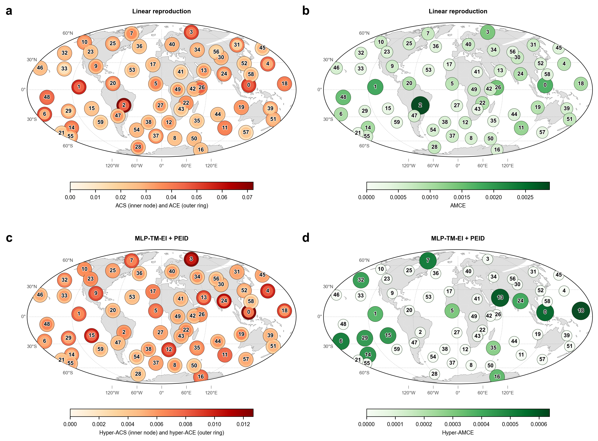

# Runge MLP+PEID 旧图与 1948-2026 新结果对齐审计

## 结论摘要

旧截图对应 `part2_runge_linear_mlp_peid_map.png` 的下排 c-d 面板，也就是 1948-2011 SLP 周尺度 component 上的 `MLP-TM-EI + PEID` 结果。新结果对应 1948-2026 SLP 数据上的 `original_hyper_metric_z2_null20` 结果。

两者不是只差数据。主要可对齐部分是：都使用 60 个 SLP component、lag=4、horizon=1、最近一周 source、4096 个最大熵干预样本、transport-map EI、二阶 $\Delta_2$、block-shift null、$|z|\ge2$ 门控、源成员贡献按 $|K|=2$ 平分、节点分数除以 $n-1=59$。主要不可直接归因于数据的差别有三处：

1. 旧 PEID 候选源池是 `candidate_top_sources=14`，新门控版是 `candidate_top_sources=18`，候选二阶项从 1625 增到 2764。
2. 旧图的 Hyper-AMCE 总分只画二阶源成员协同贡献；新 `original_hyper_metric` 图把 pairwise path AMCE 加回到 `AMCE + Syn`。这个加回项量级很小，但公式层面不完全相同。
3. 旧图 c-d 是一张“上排 linear、下排 MLP+PEID”的组合图；新图是“pairwise baseline、Original EI+Syn、Original Hyper-AMCE”的四面板重排。色标和标题不是同一绘图脚本生成。

因此，当前证据支持的判断是：**差异主要来自数据时段扩大后 component 基底、MLP 读出和二阶候选集合改变；但还不能说操作步骤完全一样。** 若要做严格“只变数据”的复算，应把新数据按旧脚本参数重跑一次，尤其把 `candidate_top_sources` 固定回 14，并使用旧图的 Hyper-AMCE 定义和绘图脚本。

## 对齐对象

### 旧结果：截图中的 MLP+PEID

截图是这张图的下排 c-d：

- 图文件：`docs/reports/assets/part2_runge_linear_mlp_peid_map.png`
- 绘图脚本：`scripts/plot_runge_linear_mlp_peid_map.py`
- 结果目录：`results/runge/peid_hypergraph/`
- 数据：`results/runge/2015_gateways/component_weekly_scores.csv`
- manifest：`results/runge/peid_hypergraph/manifest.json`

旧图 c 面板使用 `hyper_ace_total` 作外圈、临时聚合得到的 `hyper_acs_total` 作内圈。旧图 d 面板使用 `hyper_amce_total`。旧实现中 `hyper_amce_total` 等于二阶源成员协同贡献，不包含 `mediator_path_amce`。

### 新结果：1948-2026 原始 hyper 指标

新结果文件：

- 图文件：`results/runge_slp_daily_1948_2026_20260628/mlp_tm_ei_lag04/fig/runge/original_hyper_metric_z2_null20/original_hyper_metric_full_order2_map.png`
- 计算脚本：`scripts/run_runge_original_hyper_metric.py`
- 上游 PEID 结果目录：`results/runge_slp_daily_1948_2026_20260628/mlp_tm_ei_lag04/results/runge/peid_hypergraph_z2_null20/`
- 原始 hyper 指标目录：`results/runge_slp_daily_1948_2026_20260628/mlp_tm_ei_lag04/results/runge/original_hyper_metric_z2_null20/`

同一批新结果还保留了旧布局图，方便只看空间读数：

## 计算步骤逐项对齐

| 步骤 | 旧结果 | 新结果 | 是否一致 |
|---|---:|---:|---|
| SLP 原始数据时段 | 1948-2011 | 1948-2026 | 不一致，目标差别 |
| daily samples | 23360 | 28546 | 不一致 |
| weekly samples | 3337 | 4078 | 不一致 |
| component 数 | 60 | 60 | 一致 |
| component scores hash | `9d8ae085c9a87330` | `2cd78d429fc66b30` | 不一致 |
| lag / horizon | 4 / 1 | 4 / 1 | 一致 |
| source_mode | latest | latest | 一致 |
| intervention samples | 4096 | 4096 | 一致 |
| train / val split | 0.70 / 0.15 | 0.70 / 0.15 | 一致 |
| MLP hidden_dim / layers / dropout | 128 / 1 / 0.5 | 128 / 1 / 0.5 | 一致 |
| Ridge alpha ensemble | 10, 100, 1000, 3000 | 10, 100, 1000, 3000 | 一致 |
| linear blend grid | 101 | 101 | 一致 |
| null reps / block_size | 20 / 26 | 20 / 26 | 一致 |
| significance gate | $|z|\ge2$ | $|z|\ge2$ | 一致 |
| candidate_top_sources | 14 | 18 | 不一致 |
| candidate_target_topk | 10 | 10 | 一致 |
| order max | 2 | 2 | 一致 |
| order-2 candidates | 1625 | 2764 | 不一致 |
| selected $|z|\ge2$ order-2 terms | 307 | 455 | 不一致 |
| selected $|\Delta_2|$ sum | 0.5484 | 0.7980 | 不一致 |

这张表说明：训练/估计的核心参数大体相同，但候选二阶项枚举不完全相同。新结果不是纯粹把旧流程换成 1948-2026 数据后得到的最小对照。

## 指标公式对齐

两版都使用二阶 Möbius 增量：

$$
\Delta_2(\{a,b\}\to j)
= EI(X_{\{a,b\}}\to X_j)-EI(X_a\to X_j)-EI(X_b\to X_j).
$$

进入节点分数时使用绝对值：

$$
Syn^{EID}_{\{a,b\}\to j}=|\Delta_2(\{a,b\}\to j)|.
$$

源侧分数的共同结构是：

$$
\frac{1}{n-1}
\left[
\sum_j |EI_{i\to j}|
+\sum_{\substack{K,j:i\in K\\ |K|=2}}
\frac{|Syn^{EID}_{K\to j}|}{2}
\right].
$$

目标侧分数的共同结构是：

$$
\frac{1}{n-1}
\left[
\sum_s |EI_{s\to i}|
+\sum_{\substack{K,j:j=i\\ |K|=2}}
|Syn^{EID}_{K\to i}|
\right].
$$

差别在 Hyper-AMCE。旧 `run_runge_peid_hypergraph.py` 的 `aggregate_hyper_mediator` 明确把 `mediator_path_amce` 只作为诊断列，`hyper_amce_total` 只等于二阶源成员协同贡献：

$$
Hyper\text{-}AMCE_{\mathrm{old}}(m)
=
\frac{1}{n-1}
\sum_{\substack{K,j:m\in K\\ |K|=2}}
\frac{|Syn^{EID}_{K\to j}|}{2}.
$$

新 `run_runge_original_hyper_metric.py` 使用：

$$
Hyper\text{-}AMCE_{\mathrm{new}}(m)
=
AMCE_{\mathrm{pairwise}}(m)
+\frac{1}{n-1}
\sum_{\substack{K,j:m\in K\\ |K|=2}}
\frac{|Syn^{EID}_{K\to j}|}{2}.
$$

这个差别对数值排名影响很小，因为新门控版 top 节点的 pairwise AMCE 约为 $10^{-6}$，Syn 贡献约为 $10^{-3}$。但如果报告目标是“步骤完全一样”，这个差别必须消除。

## 结果差异读数

| 项目 | 旧结果 | 新结果 |
|---|---:|---:|
| Hyper-ACE top 1 | component_05, 0.01907 | component_01, 0.02117 |
| Hyper-ACE top 2 | component_03, 0.01742 | component_02, 0.01313 |
| Hyper-ACE top 3 | component_02, 0.01730 | component_04, 0.00922 |
| Hyper-AMCE top 1 | component_03, 0.000978 | component_01, 0.001724 |
| Hyper-AMCE top 2 | component_02, 0.000828 | component_02, 0.000917 |
| Hyper-AMCE top 3 | component_58, 0.000780 | component_19, 0.000882 |
| c 面板色标上限 | 0.012 固定下限色标策略 | 0.02117 数据自适应 |
| d 面板色标上限 | 0.0006 固定下限色标策略 | 0.001724 数据自适应 |

旧图 c/d 的视觉热点集中在旧 component 排序下的 3、5、13、18、24 等节点；新图中 component_01 和 component_02 变成更强的源成员贡献节点。这不能只从图上解释为“同一机制更强”，因为 component 空间基底本身已经随 1948-2026 重拟合而改变。

## 差别来源分解

### 1. 数据时段改变是最大实质差异

旧 component 基底和周序列来自 1948-2011，3337 个 weekly samples。新结果来自 1948-2026，4078 个 weekly samples。PCA/Varimax 空间基底重新拟合，因此 `component_01` 到 `component_60` 的空间含义并不是逐编号完全相同的旧模态延长版。

这会同时影响：

- component map 的中心位置；
- 训练/验证/测试切分中的时间段；
- MLP 的 learned transition；
- 最大熵干预区间；
- pairwise EI 矩阵；
- 二阶候选源池和 $\Delta_2$。

### 2. 二阶候选枚举改变了

旧 manifest 中 `candidate_top_sources=14`，order-2 candidates 为 1625，通过 $|z|\ge2$ 的二阶项为 307。新门控版 `candidate_top_sources=18`，order-2 candidates 为 2764，通过项为 455。

这不是数据自然变化，而是搜索空间本身扩大。它会直接增加某些节点作为二阶源成员被计入的机会，尤其影响 Hyper-ACE 和 Hyper-AMCE 的 Syn 项。

### 3. 新图的 Hyper-AMCE 定义更接近截图公式，但不等同于旧图实现

用户截图里的文字说明希望 D 的 Hyper-AMCE 在 pairwise 路径 AMCE 上加“节点作为显著二源组合成员”的直接超边贡献。新 `original_hyper_metric_z2_null20` 正是这个口径。旧截图图像对应的旧代码则只画源成员 Syn 贡献，并未把 pairwise path AMCE 加入 `hyper_amce_total`。

因此，如果以截图文字为准，新结果更贴近文字公式；如果以旧图像数值为准，新结果与旧图有一个很小但真实存在的公式差别。

### 4. 绘图布局和色标不一致

旧截图来自 `plot_runge_linear_mlp_peid_map.py`，上排是 linear reproduction，下排才是 MLP+PEID。新 `original_hyper_metric_z2_null20` 图上排是 pairwise baseline，下排是 Original EI+Syn 和 Original Hyper-AMCE。旧图 c/d 固定了较低的色标下限策略，新图完全按新结果自适应色标。

这只影响视觉比较，不影响 CSV 中的计算值。但做图文对比时应该把色标差异明确写出来。

## 是否能说“最好只是数据不一样”

现在还不能这么说。更准确的表述是：

> 两版结果的核心 MLP-TM-EI 和 PEID 框架一致，但旧图和新图之间除了数据时段以外，还改变了二阶候选源池大小，并且 Hyper-AMCE 的最终汇总公式和图面布局也不完全一致。当前差异主要受数据和重拟合 component/MLP 驱动，但不是严格的一变量对照。

若要验证“只差数据”，建议补一组严格复算：

1. 在 1948-2026 数据上重跑旧 `run_runge_peid_hypergraph.py` 口径，固定 `candidate_top_sources=14`、`candidate_target_topk=10`、`order_max=2`、`null_reps=20`、`|z|\ge2`。
2. 用旧 `plot_runge_linear_mlp_peid_map.py` 的下排逻辑或等价脚本画新 c/d，只画 `hyper_ace_total`、聚合 `hyper_acs_total` 和旧定义 `hyper_amce_total`。
3. 另存一张“公式修正版”，只在同一候选集合上把 `AMCE + Syn` 加回去，用来量化 pairwise AMCE 加回项是否影响排序。

这样可以把差异拆成三组：

- 旧数据 + 旧流程；
- 新数据 + 旧流程；
- 新数据 + 新公式修正。

只有第二组与第一组比较，才是“只变数据”的结论基础。

## 证据文件

| 类型 | 文件 |
|---|---|
| 旧图 | `docs/reports/assets/part2_runge_linear_mlp_peid_map.png` |
| 旧绘图脚本 | `scripts/plot_runge_linear_mlp_peid_map.py` |
| 旧 PEID manifest | `results/runge/peid_hypergraph/manifest.json` |
| 旧 Hyper-ACE CSV | `results/runge/peid_hypergraph/hyper_gateway_scores.csv` |
| 旧 Hyper-AMCE CSV | `results/runge/peid_hypergraph/hyper_mediator_scores.csv` |
| 新图 | `results/runge_slp_daily_1948_2026_20260628/mlp_tm_ei_lag04/fig/runge/original_hyper_metric_z2_null20/original_hyper_metric_full_order2_map.png` |
| 新旧布局图 | `results/runge_slp_daily_1948_2026_20260628/mlp_tm_ei_lag04/fig/runge/peid_hypergraph_z2_null20/pairwise_vs_peid_z2_null20_map.png` |
| 新原始 hyper 脚本 | `scripts/run_runge_original_hyper_metric.py` |
| 新 PEID manifest | `results/runge_slp_daily_1948_2026_20260628/mlp_tm_ei_lag04/results/runge/peid_hypergraph_z2_null20/manifest.json` |
| 新原始 hyper manifest | `results/runge_slp_daily_1948_2026_20260628/mlp_tm_ei_lag04/results/runge/original_hyper_metric_z2_null20/manifest.json` |
