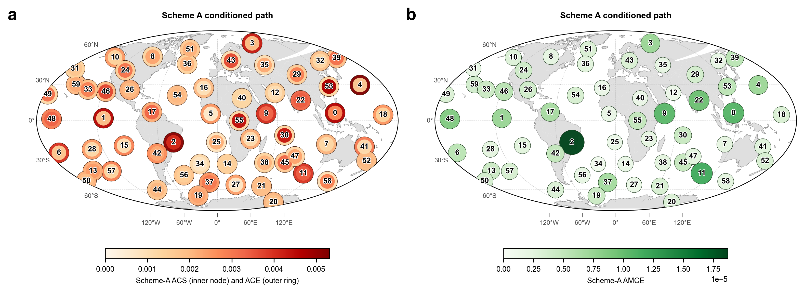
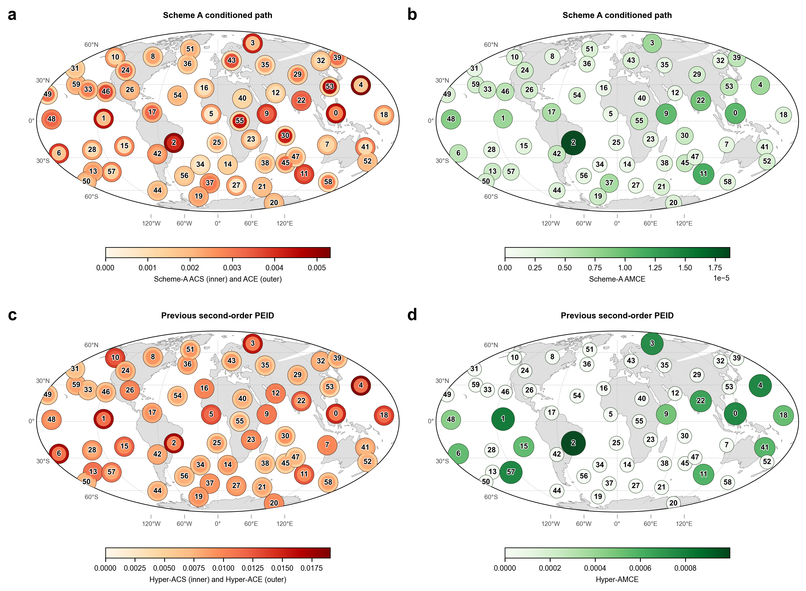
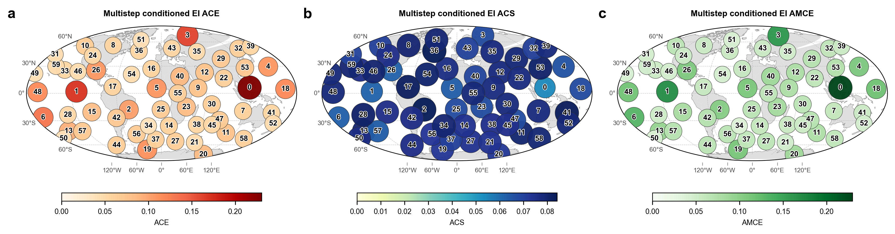

# Runge 二阶条件边权与多步 EI 路径方案

## 1. 目的

本文档记录两个候选改进。第一个方案只改变考虑二阶协同时的构图边权，把原来的单源 pairwise EI 换成平均条件 EI。第二个方案进一步避免把 EI 邻接矩阵做普通矩阵连乘，而是让训练好的 MLP 自迭代多个预测步，直接估计每个 horizon 的多步 EI，再汇总成路径矩阵。

这两个方案都不改变原始“不考虑二阶协同”的 path-effect 流程。差异只发生在考虑二阶协同时。

## 2. 方案 A：平均条件 EI 构图

令 $n=60$ 为 Runge Varimax 分量数。记单源 pairwise MLP-TM-EI 为

$$
E^{(0)}_{ij}=EI(X_i\to X_j),
\qquad i,j\in\{1,\ldots,n\}.
$$

不考虑二阶协同时，仍使用 $E^{(0)}_{ij}$ 构造稀疏非负直接边矩阵。

考虑二阶协同时，只替换构图用的边权。对任意源 $i$ 和目标 $j$，遍历另一个源变量 $r\ne i,j$，定义 $i$ 在 $r$ 作为背景源时对 $j$ 的条件 EI 增量：

$$
E_{i\to j\mid r}
=
EI(X_{\{i,r\}}\to X_j)-EI(X_r\to X_j).
$$

这里联合 EI 使用同一组最大熵干预样本估计。被减去的项是遍历到的另一个源 $r$ 对目标 $j$ 的单源 EI，因此 $E_{i\to j\mid r}$ 表示在 $r$ 已经作为解释源存在时，加入 $i$ 后带来的边际有效信息。

然后对所有背景源取平均，得到二阶条件化后的 pairwise 边权：

$$
\bar E^{(2)}_{ij}
=
\frac{1}{n-2}
\sum_{\substack{r=1\\r\ne i,\ r\ne j}}^n
\left[
EI(X_{\{i,r\}}\to X_j)-EI(X_r\to X_j)
\right],
\qquad i\ne j.
$$

自环仍删除：

$$
\bar E^{(2)}_{ii}=0.
$$

由 $\bar E^{(2)}$ 构造稀疏非负直接边矩阵 $\mathbf{D}^{(2)}$：

$$
D^{(2)}_{ij}
=
\begin{cases}
\max\{\bar E^{(2)}_{ij},0\},&
j\in\mathrm{TopK}_i(\bar E^{(2)}),\ i\ne j,\\
0,&\text{otherwise}.
\end{cases}
$$

其中 $\mathrm{TopK}_i(\bar E^{(2)})$ 表示第 $i$ 行中最大的 $k$ 条正向出边，当前可沿用 $k=5$。之后的谱缩放和 path-effect 指标保持原式：

$$
\mathbf{A}^{(2)}=c\mathbf{D}^{(2)},\qquad
c=
\begin{cases}
1,&\rho(\mathbf{D}^{(2)})=0,\\
\min\left(1,\dfrac{\alpha}{\rho(\mathbf{D}^{(2)})}\right),&\rho(\mathbf{D}^{(2)})>0,
\end{cases}
\qquad \alpha=0.8.
$$

$$
\mathbf{T}^{(2)}=\sum_{\ell=1}^{L}\left(\mathbf{A}^{(2)}\right)^\ell.
$$

于是

$$
\mathrm{ACE}^{(2)}(i)=\frac{1}{n-1}\sum_{j\ne i}T^{(2)}_{ij},
$$

$$
\mathrm{ACS}^{(2)}(i)=\frac{1}{n-1}\sum_{j\ne i}T^{(2)}_{ji},
$$

$$
\mathrm{AMCE}^{(2)}(m)=
\frac{1}{(n-1)(n-2)}
\sum_{\substack{s\ne m,\ t\ne m\\s\ne t}}
A^{(2)}_{sm}T^{(2)}_{mt}.
$$

这个方案的优点是改动很小：所有路径汇总、排序和绘图接口都可以复用。限制是 $\mathbf{T}^{(2)}$ 仍然来自图上 walk-sum，不能解释为严格的多步 EI。

## 3. 方案 B：MLP 自迭代的真实多步 EI

方案 B 的目标是让路径矩阵本身由真实 horizon 的 EI 构成，而不是由 EI 边权的矩阵幂构成。这样 $\mathbf{T}$ 的每个元素仍然是以 bits 为单位的有效信息汇总。

### 3.1 多步预测算子

当前 MLP 学到的是一步预测映射。令最近 $p$ 个状态组成输入历史：

$$
\mathbf{h}_t=
\left[
\mathbf{x}_{t-p+1}^{\mathsf T},
\ldots,
\mathbf{x}_{t}^{\mathsf T}
\right]^{\mathsf T}.
$$

一步 MLP 写作

$$
\widehat{\mathbf{x}}_{t+1}=f_\theta(\mathbf{h}_t).
$$

定义自迭代 rollout：

$$
\widehat{\mathbf{x}}_{t+h}
=
F_h(\mathbf{h}_t),
\qquad h=1,\ldots,L.
$$

其中 $F_1=f_\theta$；当 $h>1$ 时，把已经预测出的状态追加到历史窗口中，并丢弃最旧状态，再次调用同一个 $f_\theta$。这相当于在训练好的动力学代理模型上做闭环多步预测。

干预分布只在初始历史窗口 $\mathbf{h}_t$ 上采样。后续 horizon 的输入由模型预测递推得到，不能在每个 horizon 重新采样最大熵输入；否则估计到的是多个独立一步读数，而不是同一条模型轨迹上的多步 EI。

### 3.2 每个 horizon 的 pairwise EI 矩阵

对每个 horizon $h$，在同一组 bounded maximum-entropy 干预样本上估计

$$
E^{[h]}_{ij}
=
EI(X_{i,t}\to \widehat X_{j,t+h}),
\qquad h=1,\ldots,L.
$$

若使用 history source，也可把源写作 $X_{i,t-p+1:t}$：

$$
E^{[h]}_{ij}
=
EI(X_{i,t-p+1:t}\to \widehat X_{j,t+h}).
$$

这里的 $E^{[h]}_{ij}$ 是直接估计的多步 EI，不是由 $E^{[1]}$ 通过矩阵幂外推得到的。

### 3.3 多步 EI 路径矩阵

定义累计多步 EI 矩阵

$$
\mathbf{T}^{\mathrm{MEI}}
=
\sum_{h=1}^{L}\mathbf{E}^{[h]}.
$$

因此

$$
T^{\mathrm{MEI}}_{ij}
=
\sum_{h=1}^{L}EI(X_{i,t}\to \widehat X_{j,t+h}).
$$

每一项都是 bits，求和后可解释为跨 horizon 的累计 EI burden。若希望不同 $L$ 之间可比，也可以报告平均版本

$$
\bar{\mathbf{T}}^{\mathrm{MEI}}
=
\frac{1}{L}\sum_{h=1}^{L}\mathbf{E}^{[h]}.
$$

正文中应明确区分：$\mathbf{T}^{\mathrm{MEI}}$ 是累计 horizon score，$\bar{\mathbf{T}}^{\mathrm{MEI}}$ 是平均 horizon score。

### 3.4 ACE 和 ACS

多步 EI 版 ACE 和 ACS 可直接替换原来的 walk-sum 矩阵：

$$
\mathrm{ACE}^{\mathrm{MEI}}(i)
=
\frac{1}{n-1}
\sum_{j\ne i}T^{\mathrm{MEI}}_{ij},
$$

$$
\mathrm{ACS}^{\mathrm{MEI}}(i)
=
\frac{1}{n-1}
\sum_{j\ne i}T^{\mathrm{MEI}}_{ji}.
$$

这两个指标仍以 bits 为单位，含义分别是源节点 $i$ 对未来多个 horizon 的累计外向 EI，以及目标节点 $i$ 从所有源接收的累计多步 EI。

### 3.5 AMCE 的两个版本

如果直接沿用旧 AMCE 形式，

$$
\mathrm{AMCE}^{\mathrm{prod}}(m)
=
\frac{1}{(n-1)(n-2)}
\sum_{\substack{s\ne m,\ t\ne m\\s\ne t}}
D^{[1]}_{sm}T^{\mathrm{MEI}}_{mt},
$$

其中 $\mathbf{D}^{[1]}$ 是一步 EI 稀疏直接边矩阵。这个版本改动最小，但它仍然是“入口边权 $\times$ 下游多步 EI”的乘积型 mediator score，单位不再是纯 bits。

若希望 AMCE 也保持 bits 单位，可以把进入 $m$ 的一步边权先归一化成无量纲权重：

$$
P_{sm}
=
\frac{D^{[1]}_{sm}}
{\sum_{q\ne m}D^{[1]}_{qm}},
\qquad
\sum_{s\ne m}P_{sm}=1.
$$

若分母为 0，则令所有 $P_{sm}=0$。定义单位一致的多步 mediator score：

$$
\mathrm{AMCE}^{\mathrm{MEI}}(m)
=
\frac{1}{n-2}
\sum_{t\ne m}
\left[
\sum_{s\ne m,t}P_{sm}
\right]
T^{\mathrm{MEI}}_{mt}.
$$

这个版本的含义是：先用进入 $m$ 的一步 EI 边分布表示“谁能把影响送到 $m$”，再读取 $m$ 到下游 $t$ 的真实多步 EI。因为 $P_{sm}$ 无量纲，最终单位仍是 bits。它比旧 AMCE 改动更大，但比乘积型 AMCE 更容易向审稿人解释。它仍然只是 mediator screening score，不是严格的路径特异性中介因果分解；严格版本需要显式干预或阻断 $m$ 后比较 $s\to t$ 的多步 EI。

## 4. 二阶协同如何进入多步 EI 方案

方案 B 可以和方案 A 结合。考虑二阶协同时，不再把二阶信息写成额外的 Hyper-ACE/Hyper-AMCE 节点加分，而是在每个 horizon 上构造条件 EI 边权：

$$
E^{[h],(2)}_{i\to j\mid r}
=
EI(X_{\{i,r\},t}\to \widehat X_{j,t+h})
-EI(X_{r,t}\to \widehat X_{j,t+h}).
$$

然后

$$
\bar E^{[h],(2)}_{ij}
=
\frac{1}{n-2}
\sum_{\substack{r=1\\r\ne i,\ r\ne j}}^n
E^{[h],(2)}_{i\to j\mid r}.
$$

最后汇总为

$$
T^{\mathrm{MEI},(2)}_{ij}
=
\sum_{h=1}^{L}\bar E^{[h],(2)}_{ij}.
$$

这样，“不考虑二阶协同”和“考虑二阶协同”的区别仍然只在边权估计方式上：

- 不考虑二阶协同：使用 $E^{[h]}_{ij}=EI(X_{i,t}\to \widehat X_{j,t+h})$；
- 考虑二阶协同：使用 $\bar E^{[h],(2)}_{ij}$，即所有背景源条件 EI 增量的平均。

路径矩阵本身都来自 MLP 自迭代后的多步 EI，而不是来自 EI 矩阵幂。

### 4.1 当前实验执行设置

由于 full transport-map 估计中单个 horizon 已经很耗时，当前实现不再按 $H=5,10,\ldots,60$ 才检查一次，而是对每个 $h=1,2,\ldots,10$ 都立即形成累计矩阵

$$
\mathbf{T}^{\mathrm{MEI},(2)}(h)
=
\sum_{\tau=1}^{h}\max\left(\bar{\mathbf{E}}^{[\tau],(2)},0\right),
$$

并分别计算 ACE、ACS 和 AMCE 的 top-5 集合。只要三个指标的 top-5 集合都与当前 `Part2 earth` Runge 结果完全一致，就在该 $h$ 早停；否则最多计算到 $h=10$。这使长时间运行时可以在每个 horizon 后得到可检查的排序结果，而不必等待 5 个 horizon 后才判断。

## 5. 推荐实现顺序

第一步先实现方案 A，作为低风险对照。它可以复用现有二阶 joint EI 表和 path-effect 代码，主要新增 $\bar E^{(2)}$ 的构造、保存和绘图。

第二步实现方案 B 的 pairwise 多步 EI，不立刻加入二阶条件边权。先验证 MLP rollout、每个 horizon 的 $\mathbf{E}^{[h]}$、累计 $\mathbf{T}^{\mathrm{MEI}}$ 以及 ACE/ACS 是否稳定。

第三步再把方案 A 的条件 EI 平均推广到每个 horizon，形成 $\bar{\mathbf{E}}^{[h],(2)}$ 和 $\mathbf{T}^{\mathrm{MEI},(2)}$。

第四步比较三组结果：

1. 原始 one-step EI walk-sum path-effect；
2. 条件 EI 平均边权的 walk-sum path-effect；
3. MLP 自迭代真实多步 EI path-effect。

报告中应把第 1、2 组称为 graph-walk path score，把第 3 组称为 multi-horizon EI score。这样可以避免把 EI 边权矩阵幂误写成严格的信息论多步 EI。

## 6. 主要风险

MLP 自迭代会累积预测误差，因此较大 horizon 的 EI 可能同时反映动力学传播和模型闭环误差。需要报告每个 horizon 的 rollout RMSE 或相关系数，至少确认闭环预测没有迅速崩塌。

多步 EI 的计算量较大。若对所有 $h=1,\ldots,L$、所有 $i,j$ 以及所有背景源 $r$ 都估计 transport-map EI，复杂度约为 $O(Ln^3)$ 个二源估计。可先限制 $L$、使用候选源池，或先用 pairwise 多步 EI 做主结果，再对二阶条件边权做 top-source 子集扫描。

累计 $\sum_h\mathbf{E}^{[h]}$ 会重复计算不同 horizon 上相关的未来状态信息，因此它应解释为 horizon-summed information burden，而不是互斥信息原子的总和。正文中可以同时报告平均版本 $\bar{\mathbf{T}}^{\mathrm{MEI}}$ 作为尺度敏感性检查。

<!-- scheme-a-conditioned-path-results:start -->

### 实验结果：方案 A 平均条件 EI 构图

本次结果只改变直接构图边权：用 `horizon_001` 已估计的 signed 平均条件 EI 矩阵作为 \(\bar E^{(2)}\)，再按原 Runge path-effect 流程做正部截断、source-top-5 稀疏化、谱缩放和 walk-sum 路径汇总。该结果仍是 one-step conditioned EI graph-walk path score，不是方案 B 的 MLP 自迭代多步 EI。

Scheme A 与旧二阶 PEID Hyper 的直接对比如下：

Top 节点如下，括号内为对应指标值：

| Rank | ACE | ACS | AMCE |
|---:|---:|---:|---:|
| 1 | 4 (0.005315) | 53 (0.004725) | 2 (1.871e-05) |
| 2 | 2 (0.005134) | 55 (0.004399) | 11 (1.173e-05) |
| 3 | 0 (0.004603) | 30 (0.004298) | 0 (1.068e-05) |
| 4 | 1 (0.004579) | 2 (0.004052) | 9 (1.054e-05) |
| 5 | 3 (0.004289) | 46 (0.003672) | 22 (9.651e-06) |
| 6 | 9 (0.004027) | 43 (0.003629) | 48 (8.661e-06) |
| 7 | 6 (0.003966) | 22 (0.003409) | 1 (7.392e-06) |
| 8 | 11 (0.003932) | 11 (0.003409) | 4 (7.293e-06) |
| 9 | 22 (0.003341) | 48 (0.003315) | 3 (7.27e-06) |
| 10 | 41 (0.002978) | 9 (0.003288) | 37 (6.742e-06) |

与当前 `peid_hypergraph` 的二阶 PEID Hyper 排名相比：

| Metric | Spearman | Kendall | top-5 overlap | top-10 overlap |
|---|---:|---:|---:|---:|
| ACE | 0.869 | 0.681 | 4/5 | 7/10 |
| ACS | -0.091 | -0.058 | 0/5 | 1/10 |
| AMCE | 0.902 | 0.838 | 2/5 | 7/10 |

谱缩放因子为 `1`；正部稀疏直接边数量为 `300`。配色使用本图数据自适应上限：ACE/ACS 色标上限 `0.005315`，AMCE 色标上限 `1.871e-05`，避免沿用旧图固定上限后颜色分布被压平。另输出 Scheme A 与旧二阶 PEID Hyper 的 2x2 对比图：`runge_scheme_a_vs_peid_hyper_map.png`。

<!-- scheme-a-conditioned-path-results:end -->

<!-- multistep-conditioned-ei-results:start -->

### 实验结果：MLP 自迭代多步条件 EI

本次重跑使用训练好的 Runge one-step MLP，不重训模型。初始历史窗口从训练集分位数范围内做 bounded maximum-entropy intervention；之后每个 horizon 都由 MLP 闭环自迭代生成，不在中间步重新采样。对每个 horizon 先估计 pairwise EI 与联合源 EI，再用
\[
\bar E^{[h],(2)}_{ij}=\frac{1}{n-2}\sum_{r\ne i,j}\left[EI(X_{\{i,r\},t}\to \widehat X_{j,t+h})-EI(X_{r,t}\to \widehat X_{j,t+h})\right]
\]
构造 signed 条件边权；地图主指标使用正部 \(E^{[h],(2)+}_{ij}=\max(\bar E^{[h],(2)}_{ij},0)\)，并累计到 \(H=10\)。

Checkpoint 结果：未触发早停，最终绘图 horizon 为 \(H=10\)。

| H | ACE top-5 overlap | ACS top-5 overlap | AMCE top-5 overlap | all matched |
|---:|---:|---:|---:|:---:|
| 1 | 5/5 | 3/5 | 2/5 | no |
| 2 | 4/5 | 2/5 | 1/5 | no |
| 3 | 3/5 | 2/5 | 1/5 | no |
| 4 | 4/5 | 3/5 | 2/5 | no |
| 5 | 4/5 | 3/5 | 2/5 | no |
| 6 | 4/5 | 2/5 | 2/5 | no |
| 7 | 4/5 | 2/5 | 2/5 | no |
| 8 | 3/5 | 2/5 | 1/5 | no |
| 9 | 3/5 | 2/5 | 1/5 | no |
| 10 | 3/5 | 1/5 | 1/5 | no |

Top 节点如下，括号内为对应指标值：

| Rank | ACE | ACS | AMCE |
|---:|---:|---:|---:|
| 1 | 0 (0.2303) | 36 (0.08406) | 0 (0.2296) |
| 2 | 1 (0.1707) | 2 (0.08384) | 1 (0.17) |
| 3 | 3 (0.1605) | 41 (0.0832) | 3 (0.1605) |
| 4 | 6 (0.1318) | 17 (0.08251) | 6 (0.1315) |
| 5 | 18 (0.1175) | 28 (0.08109) | 18 (0.1173) |
| 6 | 48 (0.1154) | 53 (0.08094) | 48 (0.1156) |
| 7 | 19 (0.1119) | 54 (0.08023) | 19 (0.112) |
| 8 | 4 (0.1096) | 11 (0.07987) | 5 (0.1095) |
| 9 | 5 (0.1091) | 13 (0.07965) | 4 (0.1093) |
| 10 | 26 (0.1085) | 46 (0.07957) | 26 (0.1085) |

与当前 `Part2 earth` Runge MLP-TM-EI path-effect 排名相比：

| Metric | Spearman | Kendall | top-5 overlap | top-10 overlap |
|---|---:|---:|---:|---:|
| ACE | 0.523 | 0.360 | 3/5 | 5/10 |
| ACS | 0.353 | 0.235 | 1/5 | 5/10 |
| AMCE | 0.274 | 0.180 | 1/5 | 5/10 |

视觉上，新的三项指标仍集中在原 Runge 地图中若干高影响节点附近，但数值单位保持为直接估计得到的多步 EI 累计 bit，而不是 EI 邻接矩阵连乘后的路径权重。

<!-- multistep-conditioned-ei-results:end -->
