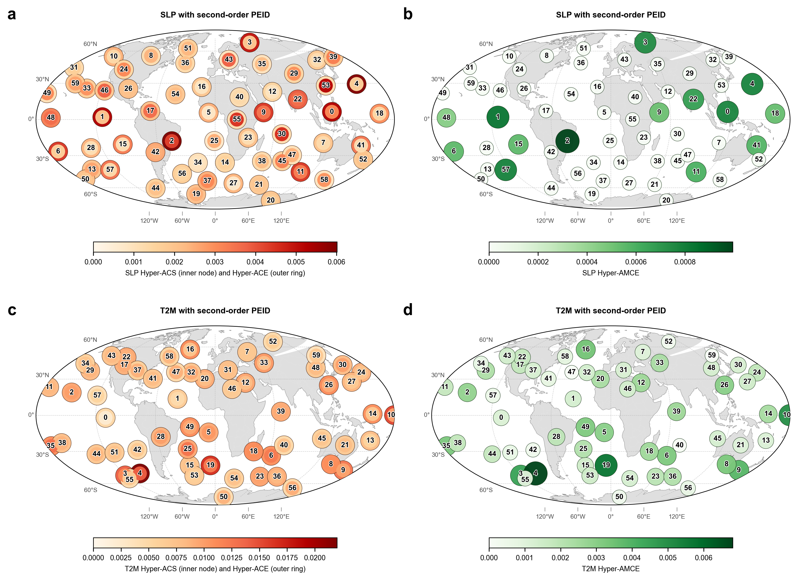

# Runge SLP 与 Daily T2M Future-Week Mean 对照报告

## 结论摘要

SLP 和 T2M 都把 60 个 Varimax component 作为状态变量，并用 MLP-TM-EI / path-effect / PEID 读出 gateway、mediator 和协同结构。但二者的预测对象不同：

- SLP：daily SLP 先聚合为 weekly component scores，用过去 4 周预测下一周状态。
- T2M：daily 2m temperature 先做 365-day 标准化异常，用过去 28 天预测未来 7 天平均异常。

因此，预测相关性和 EI 数值不能当成同一物理量的直接胜负比较。更可靠的比较是看：哪些 component 在各自变量中成为 gateway、mediator，以及协同边是否集中在相近的低阶 component 上。

## 实验设定对照

| 项目 | SLP | T2M |
|---|---:|---:|
| 输入变量 | sea level pressure | 2m air temperature |
| 时间范围 | 1948-2011 | 1948-2025 |
| 原始时间尺度 | daily | daily |
| 建模时间尺度 | weekly mean component state | daily history -> future 7-day mean |
| component 数 | 60 | 60 |
| 输入历史 | 4 weekly states | 28 daily states |
| 预测目标 | next weekly state | future 7-day mean anomaly |
| 监督样本数 | 3333 | 28436 |
| 测试整体 RMSE | 0.713185 | 0.543199 |
| 测试整体 MAE | 0.568283 | 0.429856 |
| 测试整体 corr | 0.461528 | 0.779606 |

解释：T2M 的测试相关明显更高，但这主要反映 T2M 标准化异常的短期持久性更强，且 daily-to-7-day-mean 目标比 SLP weekly component transition 更平滑。不能据此说 T2M 的因果结构“更强”。

## Gateway 对照

| 排名 | SLP top path gateway | SLP ACE | T2M top path gateway | T2M ACE |
|---:|---|---:|---|---:|
| 1 | component_05 | 0.005211 | component_05 | 0.015306 |
| 2 | component_03 | 0.005036 | component_20 | 0.011040 |
| 3 | component_01 | 0.004506 | component_11 | 0.010420 |
| 4 | component_02 | 0.004481 | component_04 | 0.009652 |
| 5 | component_04 | 0.004203 | component_08 | 0.008699 |

共同点：`component_05` 在 SLP 和 T2M 中都排在 gateway 第一，说明这个低阶空间模态在两种变量的预测映射里都承担强输出作用。

差异：T2M 的 gateway ACE 整体更高，且 top 5 中出现 `component_20`、`component_11`、`component_08`。这更像温度场自身的持久性和地表热惯性结构，而不是单纯复制 SLP 的环流 gateway。

## Mediator 对照

| 排名 | SLP top mediator | SLP AMCE | T2M top mediator | T2M AMCE |
|---:|---|---:|---|---:|
| 1 | component_03 | 0.000018 | component_05 | 0.000100 |
| 2 | component_12 | 0.000011 | component_20 | 0.000070 |
| 3 | component_01 | 0.000010 | component_11 | 0.000055 |
| 4 | component_10 | 0.000010 | component_36 | 0.000054 |
| 5 | component_23 | 0.000009 | component_04 | 0.000052 |

解释：SLP 的 mediator 更偏向 `component_03`、`component_12` 等环流传播桥接模态；T2M 的 mediator 与 gateway 更重合，尤其 `component_05` 同时是 top gateway 和 top mediator。这说明 T2M 的一周平均预测更依赖自身低阶模态的持续和转移，而不是完全由不同的中介模态桥接。

## 二阶 PEID 对照

| 排名 | SLP order-2 hyperedge | SLP delta_K | SLP z | T2M order-2 hyperedge | T2M delta_K |
|---:|---|---:|---:|---|---:|
| 1 | component_01 + component_05 -> component_31 | 0.005687 | 18.501352 | component_05 + component_07 -> component_04 | 0.077421 |
| 2 | component_05 + component_10 -> component_54 | 0.004880 | 6.652050 | component_03 + component_04 -> component_05 | 0.071910 |
| 3 | component_03 + component_10 -> component_47 | 0.004781 | 9.573192 | component_04 + component_10 -> component_08 | 0.062173 |
| 4 | component_01 + component_03 -> component_60 | 0.004454 | 12.748412 | component_03 + component_06 -> component_05 | 0.050709 |
| 5 | component_04 + component_07 -> component_03 | 0.004170 | 5.880020 | component_09 + component_17 -> component_06 | 0.046375 |

解释边界：

- SLP 的 PEID 文件包含 null test，所以有 `z`；T2M 当前输出是 candidate second-order TM-MI hyperedges，还没有 null permutation 的 `z`。
- T2M 的 `delta_K` 数值更大，但估计器和候选筛选策略与 SLP 不完全一致，不能直接解释为“温度协同强度比气压大一个数量级”。
- 更稳妥的结论是：T2M 的 top 协同主要围绕低阶 component_03、component_04、component_05、component_07、component_10 展开；SLP 的 top 二阶协同则更多指向较高编号 target component，例如 component_31、component_54、component_47、component_60。

## 图件入口

新增 SLP / T2M 同版式地理对照图：

SLP：

- `fig/runge/pairwise_mlp_tm_ei_path_effects/gateway_ranking.png`
- `fig/runge/peid_hypergraph/hyper_gateway_ranking.png`
- `docs/reports/assets/part2_runge_peid_synergy_map.png`
- `docs/reports/assets/part2_runge_component_regions.png`

T2M：

- `fig/runge_t2m_daily_weekmean/component_maps.png`
- `fig/runge_t2m_daily_weekmean/pairwise_tm_ei_gateway_ranking.png`
- `fig/runge_t2m_daily_weekmean/pairwise_tm_ei_heatmap.png`
- `fig/runge_t2m_daily_weekmean/path_effect_gateway_ranking.png`
- `fig/runge_t2m_daily_weekmean/path_effect_mediator_ranking.png`

## 最终读法

SLP 的结果更适合解释大尺度环流传播中的 gateway / mediator：它的周尺度处理压掉日际噪声，突出环流模态之间的低频路径效应。

T2M 的结果更适合解释近地面温度异常的一周平均可预测性：预测性能更高，top gateway 和 mediator 更集中，说明温度场的短期持久性和地表慢变量记忆在 future-week mean 目标中占主导。

把二者放在一起看，当前最值得跟进的交叉线索是 `component_05`：它在 SLP 和 T2M 中都是强 gateway。下一步应把 SLP `component_05` 与 T2M `component_05` 的空间图并排看，确认它们是否对应相近的物理区域或只是 Varimax 编号上的巧合。
