# Brain：序参量转折识别与整合有效信息组织

## 主要结论

**先量化个体序参量转折的识别，再分析整合有效信息的来源与组织。** 在 93 个体 SC 驱动的 Schaefer100 动态平均场（DMF）模型中，固定 G 步长 0.1、转折窗口宽 0.5 G 后，整合有效信息 Ξ 的命中率为 **69.9%（65/93）**，ΦR 与 WMS 均为 **30.1%（28/93）**；Ξ 的累计额外回摆也更少。窗口来自同队列事后搜索后固定，识别结论限于这一转折邻域容许范围。

**在固定结构连接的 Schaefer100 动态平均场（DMF）模型中，中等耦合的联合预测优势最强；这种优势主要来自跨脑区、跨网络组合，承担信息的具体成员随耦合重组。协同划分树（SPT）选出的候选核在留出 seed 中仍优于匹配随机组合，但局部成员稳定性依条件而变。**

$G$ 表示全局耦合强度，ROI 表示图谱脑区。联合预测优势 $\Xi$ 指联合状态提供的未来信息超出各单变量信息之和的部分。主要发现如下。

| 主要发现 | 关键证据 | 含义 |
|---|---|---|
| **个体转折邻域识别：Ξ 命中更多** | 93 人命中率为 69.9%，ΦR/WMS 各 30.1%；原新增 85 人的两项配对增幅均为 38.8 个百分点，40 项窗口比较 Holm p 均为 4.6566×10⁻⁹ | 以每人的独立发放率最大斜率区间为参照，左右各扩 0.2 G；属于事后窗口比较 |
| **Ξ 曲线的额外回摆更少** | 累计回摆/幅度的均值：Ξ 0.0000355%、ΦR 24.13%、WMS 16.21%；满足原弱单峰容差的人数为 89/93、0/93、0/93 | 回摆与陡峭程度分别解释；不据曲线外观判断指标公式失效 |
| **联合优势在中等耦合达峰** | 300-step 预测下，$G=1.3$ 的 $\Xi=26.131\pm0.163$ bits，8/8 个 seed 峰位一致；BOLD-like $\Phi^R$ 支持 $G=1.2$–1.3 峰带 | 此时 whole EI 已下降，增强的是联合读取相对单变量读取的优势 |
| **优势主要跨越 ROI 和网络** | 峰值邻近窗的平均 $\Xi=25.878$ bits；跨 ROI 占 88.00%，网络间占总量的 66.27% | 网络内部联合量与跨网络归因呈现不同排序 |
| **候选核随耦合分段保留、重组** | 55 个 $G$、八个 seed 的 440 条件扫描中，成员由后部视觉—后内侧组合转向前额叶联合区；大/小跨度平均变更为 18.625/2.750 个 ROI，配对 $p=0.0078125$ | 多数小步长比较稳定，部分位置突然换核；加倍样本后局部成员更不稳定 |
| **固定成员仍有信息优势** | 三个冻结核在七个留出 seed 中的跨 ROI $\Xi$ 为 2.001、1.658、1.494 bits，是半球/Yeo 构成匹配对照的 7.77、7.66、5.35 倍；六项 BH $q=0.015625$ | 优势超出集合大小和网络构成；$G=0$ 时回到约 0.04–0.06 bits 的背景 |
| **完整组合在个体转变邻域富集** | 全 93 人自然 SPT 搜索中，ROI 10、11、12 在 75/93 人的窗口内至少一格复现；平均窗口／窗口外格点出现率为 57.9%／12.1%，约 4.8 倍 | 两张主图见[第 3.11 节](#dmf-critical-coalitions-all93)；全队列探索性选择，支持邻域富集，窗口外也有出现 |
| **联合优势达峰不等于平均阶数最高** | Syn 加权平均阶数总体下降，中间局部回升；$G=1.3$ 为 $42.84\pm0.39$ 阶 | 信息强度、阶数分布与具体核大小应分别解释 |
| **最强单节点的阶数随耦合切换** | 440 条件中 367 个的最大局部 Syn 位于二阶以上；全扫描最大值为 $G=1.18$、seed 8 的六阶节点，0.308 nats | 同阶总质量、单节点最大值与不同搜索口径的树应分别比较 |
| **弱耦合区出现稳定的低阶峰值优势** | $G=0.5\to0.6$ 的 $D_{10}$ 在 8/8 seed 上升；0.6 时全部低阶占优。三个固定 ROI 对在七个其他 seed 均排名前三 | 后部视觉—默认网络组合增强；当前支持强峰越过背景，未证明新的动力学相变 |

识别与回摆比较先报告个体 SC 结果；随后以群体平均 SC 上的网络／协同核分析解释信息组织。93 人 EI 分解与群体平均 SC 扫描见[附录 Q](#appendix-q)。上述结果支持当前模型中的转折邻域对应、组合定位能力和模拟重复性。峰位依赖预测时距，动力学诊断尚未建立严格临界定位；冻结核优势也未证明其连接具有因果必要性。HCP Schaefer-1000 与 MMP360 结果作为观察性补充，见附录 E–H。

## 阅读导航

论文替换候选图：[主图整合版（a–k）](#dmf-main-composite)，将 93 人曲线／命中率、三个 G 的 SPT 与对应四视角脑图排在同一图版。

最新 93 人识别与回摆结果见正文首节：[序参量转折识别与三指标命中率](#dmf-subject-fixed-window)、[额外回摆比较](#dmf-subject-rebound)。之后进入网络／协同核组织分析；[93 人 EI 两项分解](#dmf-subject-ei-dense)与[群体平均 SC 扫描](#dmf-group-scan)见附录 Q。8 人开发结果和完整统计审计留在附录。

1. [序参量转折能否被指标准确识别？](#dmf-identification)——93 人与平均 SC 的曲线、三指标命中率及额外回摆。
2. [整合信息如何分布在不同空间层级？](#dmf-main)——网络分解、无先验树与 ROI 归因；EI 分量与系统扫描见[附录 Q](#appendix-q)。
3. [哪些具体组合保留信息、能否重复找到？](#dmf-spt-main)——成员重组、留出验证与阶数分布；[最强单节点在哪一阶？](#dmf-spt-max-syn)；[93 人完整组合搜索的两张主图](#dmf-critical-coalitions-all93)。
4. [这些结果支持什么机制解释？](#discussion)——解释、证据边界与后续验证。
5. [参考文献](#dmf-references)。

补充材料：[A：动力学诊断与结构 null](#appendix-a) · [B：数据、方程与信息分解](#appendix-b) · [C：83/100 ROI 比较](#appendix-c) · [D：DMF 复现文件](#appendix-d) · [E：HCP 57 人验证](#appendix-e) · [F：HCP 状态与空间结果](#appendix-f) · [G：MMP360 大样本探索](#appendix-g) · [H：HCP 结论与边界](#appendix-h)。

新增补充：[I：8 个体开发结果](#dmf-subject-pilot) · [J：指标曲线](#dmf-subject-curves) · [K：EI 分解](#dmf-ei-components) · [L：个体协议与预检](#dmf-subject-plan) · [M：已停止路线及失败原因](#dmf-retired) · [N：PED／O-information](#hcp-ped-oinfo) · [O：脑指纹](#hcp-fingerprinting) · [P：93 人完整统计与审计](#dmf-subject-dense) · [Q：EI 分量与群体平均 SC 扫描](#appendix-q)。

<a id="dmf-main-composite"></a>

## 主图整合版：个体转折定位、层级树与皮层归因

2026-10-06。复用现有结果组装论文主图候选，不运行新模拟或信息估计。图版为 **190 × 211 mm**，PNG 为 450 dpi，PDF 保留曲线、树、文字和色条的矢量内容，脑表面沿用原始渲染。后续正式替换论文图 2 时，应同时按下述口径更新图注与正文。


[PDF 图版](../../fig/dmf_schaefer100/dmf_brain_main_composite.pdf) · [高分辨率 PNG](../../fig/dmf_schaefer100/dmf_brain_main_composite.png) · [复现排版脚本](../../scripts/compose_dmf_brain_main_figure.py)

**排版。** 上半部 a–d 为 2×2 曲线，e 为共用两行高度的命中率；下半部按 G=0、1.3、10 分三列，同列的 f–h 层级树与 i–k 脑图上下对应。每个脑图将原来的四视角长行改为 2×2，上排外侧、下排内侧，左为左半球、右为右半球。只移除原脑表面图的空白边缘与旧文字；十二个视角采用相同像素画布及显示比例，不变更 RGB、相机、色域或区域值。树的全部节点和叶子保留，移除节点数值方框及重复的“SPT, seed 3｜Ξ”标题，腾出的高度用于树形，突出宏观结构；seed 信息保留在图注中。图例与两类色条均置于数据区域之外。

**候选图注｜结构连接约束的 DMF 模型中的转折定位与信息组织。** **a–d，** 93 个体 SC 模型的独立平均 E 发放率、整合有效信息 Ξ、BOLD-like pairwise ΦR 和保留符号的 source WMS；每条细线为同一人的 seed 3、4、5 均值，颜色编码原生 SC 谱半径。G=0–4、步长 0.1，保留全部格点，无平滑、幅度归一化或峰位对齐。黑色虚线及圆点为平均 SC 的独立模拟，不是个体曲线的算术平均。发放率单位为 Hz，信息量为 nats；WMS 使用自然态完整 E/I 状态，只有 ΦR 使用 BOLD-like 信号。**e，** 三指标极值命中每个人独立发放率最大正斜率区间扩展窗口的比例：Ξ 为 65/93（69.9%），ΦR 和 WMS 各为 28/93（30.1%）。0.5 G 窗口经同队列事后搜索后固定，只支持当前模型的转折邻域对应。

**f–h，** 平均 SC 下 G=0、1.3、10 的 seed 3 无先验 ROI 块 SPT，叶块保留该 ROI 的 E/I 坐标，树高按 ROI 数对数缩放。节点青绿色、大小与边框编码局部二分 Syn / 同条件根 Ξ，三棵树共用 0–3% 色域，不在节点上标注具体数值。Yeo-7 叶颜色为事后标签，不约束切分；缩写 VIS、SM、DA、SA/VA、LIM、FPN、DMN 依次对应视觉、躯体运动、背侧注意、显著性／腹侧注意、边缘、额顶控制、默认网络。树下报告深度、主干占比与 Colless 不平衡度。**i–k，** 同三个 G 的普通 ROI Shapley 归因份额；逐条件计算 100φᵢ/Ξ 后，在 seed 3、4、5 间等权平均。每个 G 的 100 ROI 份额合计为 100%，十二个视角共用 0.4617%–1.9785% 线性色域，内侧壁为灰色。标题整体 Ξ 为三 seed 的均值 ± seed SD，单位 nats；归因百分比不能直接比较绝对信息强度。

**协议边界。** a–e 为个体结果，f–k 为平均 SC 组织示例。f–h 复用现有条件协方差 Gaussian 近似树，i–k 复用共同 affine-TM Gaussian-moment 九条件缓存；它们按 G 对齐，但不是同一估计／聚合口径，不能把单棵树的根量与三 seed 脑图均值互作归一化分母。G=10 位于原稿 G=0–3 扫描之外，已有异常发放率诊断见[三状态 ROI 归因](#dmf-roi-three-g)；这里只作为极端模型条件。重绘检查通过：93 人既有极值与命中分类不变；曲线／ROI 的原生非负容差为 10⁻⁸ nats，树为 10⁻⁸ bits，所用缓存均无容差内负值或显著非负性违反，信息预算闭合；未裁剪或重新归一化信息值。

**稿件核对（本任务重新读取）。** Zotero 父条目 P6UJCVG8，题名 *Emergent hierarchical organization of causal interactions in complex systems*；正文 DXGC7JEA（19 页）与补充 MWIWKSVG（28 页）。读取 Brain／Fig. 2（正文第 6–7 页）、Methods 式（5）–（12）（第 15–17 页），补充 S1.2–S1.3（第 3–5 页）、S5／Algorithm S1（第 8–9 页）和 S12.2.1 式 S82–S87（第 23 页）。两附件无明确稿件日期或修订号，入库／修改时间不能建立版本先后。原稿图 2b 为 Yeo 首层约束树，图 2e 为峰附近 24 条件的 nats 归因；本图改用无先验树、三 G 百分比脑图，并新增个体识别结果，不能沿用旧图注。原稿的 BOLD-like WMS 表述与仓库完整 E/I WMS 的差别继续明确保留，不宣称完整稿件／代码一致性已验证。

<!-- report-section:dmf-identification:start -->
<a id="dmf-identification"></a>

## 1. 序参量转折识别：Ξ 的命中率更高、额外回摆更少

先检验指标极值是否落在每个人独立序参量的转折邻域，再用额外回摆刻画曲线形状。两者分别回答“位置是否对应”和“是否存在反向起伏”；随后再分解 Ξ 的信息来源及空间组织。

<!-- dense-fixed-view:start -->
<a id="dmf-subject-fixed-window"></a>

### 1.1 个体转折定位与三指标命中率

**在93个体SC驱动的DMF模型中，Ξ的极值命中个体序参量转折邻域的比例为69.9%，ΦR与WMS均为30.1%。** 每个人分别使用自己的原生SC，G=0–4、步长0.1，每个格点取seed 3/4/5均值；另模拟93人平均SC作为参照，共11,562个完整条件。

任务是比较指标极值是否对应每个人独立发放率曲线的变化。以独立100ROI平均E发放率对G的**最大正斜率小区间**[L,U]为中心，左右各扩两格，命中窗口为[max(0,L−0.2),min(4,U+0.2)]。它由序参量决定，不由三个指标决定；不是最大发放率所在的位置。当前93人的实际窗口均为0.5 G，无端点截断。

Ξ/ΦR取原全局峰，保留符号的WMS取原全局谷；内部极值落入窗口才算命中，平坦或边界极值算未命中。保持首并列点及含端点规则，不平滑、插值或移动极值。93人均有可定位的独立转折，三项分母统一为93；平均SC不进入统计。

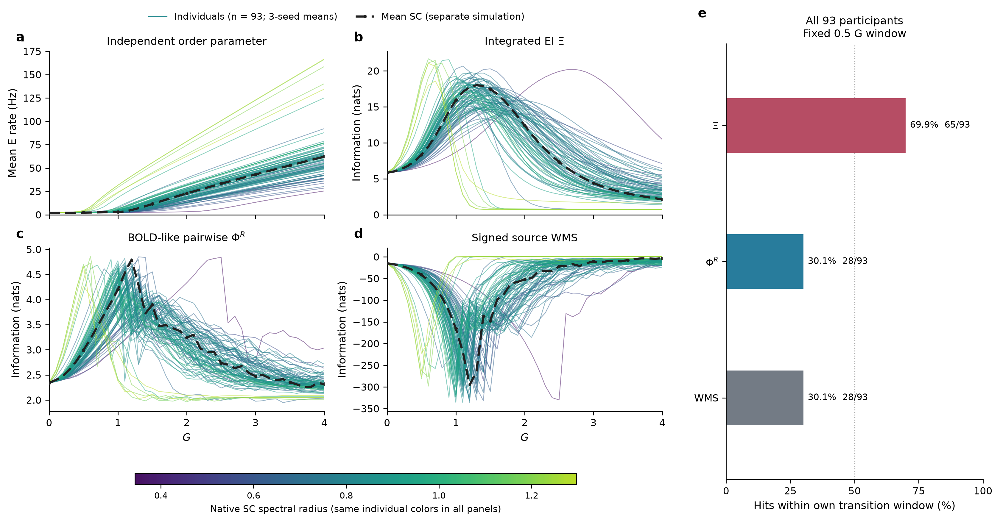

**识别总览图｜93人曲线与命中率。** a为独立序参量（Hz），b为整合有效信息Ξ，c为BOLD-like pairwise ΦR，d为保留符号的原生source WMS，e为全部93人的命中率。a–d均保留全部41格点的同人3seed均值，个体颜色按原生SC谱半径编码、跨图一致。黑色虚线及小圆点是平均SC的**独立模拟**，不是93条曲线的算术平均。各图使用原生纵轴范围，信息量单位为nats；没有幅度标准化或峰位对齐。图例在数据外。

e只展示93人结果：Ξ **65/93（69.9%）**，ΦR/WMS各 **28/93（30.1%）**。50%竖线对应用户的展示目标，柱高为样本比例。

原主要检验集为新增85人，另8人曾用于开发和查看方案。85人中Ξ为58/85（68.2%）、两基线各25/85（29.4%），两项配对增幅均为38.8个百分点；描述性95%bootstrap CI为[28.2,49.4]个百分点（未作多重/选窗校正），覆盖全部40项窗口比较的Holm p均4.6566×10⁻⁹。窗口0.5 G是同队列事后搜索后固定的容许范围，宽为原0.1区间的5倍；支持**转折邻域对应**，不能当作独立确认性结果或精确相变点定位。完整搜索、原精确区间与队列记录见[附录P](#dmf-subject-dense)。

<!-- dense-fixed-view:end -->

<!-- dense-rebound-view:start -->
<a id="dmf-subject-rebound"></a>

### 1.2 曲线形状：Ξ 的额外回摆更少

用原协议已冻结的**累计反向变化量 U**专门区分单峰趋势和额外起伏；不另选一个有利阈值。先取原41个G点的同人3seed平均曲线，Ξ、ΦR用原值，WMS只在这个形状诊断中取负值以把单谷对应到单峰。主图WMS符号和原谷位不变。

对非平坦曲线 $\mathbf{y}=(y_1,\ldots,y_{41})^\top$，令 $p$ 为首个全局最大值的位置，$\Delta_i=y_{i+1}-y_i$，$A=\max_i y_i-\min_i y_i>0$。定义

$$
U=U_{\mathrm{pre}}+U_{\mathrm{post}}
=\frac{\sum_{i<p}[-\Delta_i]_++\sum_{i\ge p}[\Delta_i]_+}{A},\qquad [z]_+=\max(z,0).
$$

第一项累计峰前下降，第二项累计峰后回升；除以整条曲线幅度消除nats量级差异。显示为100U%，表示回摆量相当于曲线幅度的多少，而非发生回摆的被试比例。**U越低，越接近先升后降；陡峭但单峰的曲线仍有U=0。**

**性质及边界。** 对非平坦有限曲线，U非负；U=0当且仅当全局峰前弱单调上升、峰后弱单调下降，因为分子各项非负，和为0要求所有反向增量为0。该数学比值对正幅度缩放及平移不变；实际浮点输入仍须通过原平坦判据：幅度不超过10⁻¹²×max(1,最大绝对值)则单列为不可辨识。它不测峰位是否对应独立转折，也不要求存在内部峰：边界单调曲线也可得0分。累计回摆可超过100%，例如[0,1,0,1,0,1,0]有U=2，因此U不是0到1概率。平坦曲线的U未定义，当前93人三项均无平坦曲线。原弱单峰容差是无量纲10⁻¹⁰，不是Ξ非负容差10⁻⁸ nats。

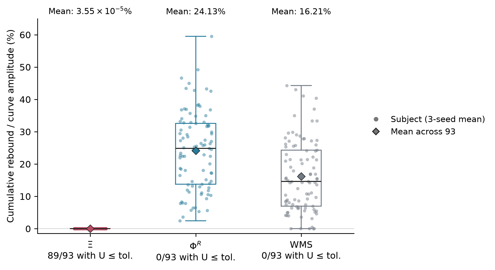

**回摆比较图｜93 人累计额外回摆。** 每个圆点是一人的3seed平均曲线，共93人；横向散开仅防重叠。箱线表示中位数与四分位分布、须为1.5 IQR范围内数据，全部个体点保留，菱形是93人算术均值；没有CI或显著性星号。三项共用线性纵轴，Ξ的微小回摆在这一尺度接近0，精确量级列在表中。图例位于数据外。

| 指标 | 平均累计回摆/幅度 | 中位数 | U≤10⁻¹⁰人数 | 最大累计回摆/幅度 |
|---|---:|---:|---:|---:|
| Ξ | 3.550877e-05% | 0% | 89/93 | 0.00178891% |
| ΦR | 24.127358% | 24.851% | 0/93 | 59.4849% |
| WMS | 16.207146% | 14.598% | 0/93 | 44.313% |

Ξ的89/93条曲线满足原弱单峰容差，另4条最大回摆也只为完整幅度的0.001789%；ΦR和WMS的93条曲线均有超容差回摆。**本次每个被试、每项指标的峰前反向量都为0，故整体U与峰后回摆逐项相等**，不再重复画一个数值相同的面板。

回摆与粗糙度Q分开：Q衡量相邻斜率的变化，可同时响应陡峭尖峰与频繁振荡；U更直接回答“有没有额外回摆”。当前结果支持固定SC＋DMF、原生估计协议下，Ξ的单峰趋势更稳定；不能将短自然轨迹、高维拟合或正则化导致的观测基线波动直接归为指标公式失效。这里只复用既有描述性形状结果，没有新增模拟、检验或改变G步长0.1/命中窗口0.5 G；3seed均值的平滑外观不代替逐seed稳健性。

这一形状结果与上一节的转折定位结果共同构成指标比较；正文随后分析整合信息的空间组织，EI 分量与系统扫描见[附录 Q](#appendix-q)。U 是原实验的形状诊断，不是新的 PEID 信息量或分解项。当前稿件核对、协议差异及复现记录见[附录 P](#dmf-subject-dense)。
<!-- dense-rebound-view:end -->

<!-- report-section:dmf-identification:end -->

<a id="dmf-main"></a>

## 2. 整合有效信息的跨 ROI 与网络组织

识别比较之后，用群体平均 SC 的网络分解、无先验树和 ROI 归因分析整合信息的空间组织。[93 人 EI 两项分解](#dmf-subject-ei-dense)与[群体平均 SC 的系统扫描](#dmf-group-scan)移至附录 Q，两套估计协议分别报告。下节设置对应群体平均 SC 的早期分析。

### 2.1 群体平均 SC 的实验设置与指标

实验以 93 名受试者的 100×100 结构连接（SC）矩阵的逐边均值驱动 DMF：

$$
\overline{\mathbf{C}}=\frac{1}{93}\sum_{m=1}^{93}\mathbf{C}^{(m)}. \tag{1}
$$

这里 $\mathbf{C}^{(m)}$ 是个体 SC，$\overline{\mathbf{C}}$ 是群体均值；两者均保持原始权重尺度，不作阈值化或归一化。93 人提供结构输入，统计重复来自模拟随机种子（seed）3–10。ROI 标签来自 Schaefer2018；原始数据包未附标签，行序虽得到置换检验支持，仍记为 **inferred（推断）**。数据审计和跨连接组尺度见[附录 B.3](#dmf-data)。

<a id="dmf-sc"></a>

<a id="dmf-intervention"></a>

除 SC 和 ROI 数外，实验沿用旧 83 ROI 分析的 DMF 方程、参数和估计口径。JFIC 在 $G=1.0$ 校准后固定；$G=0.0$–3.0，步长 0.1。每个条件独立采样 2,048 个 200 维干预初态：

$$
\mathbf{s}_E,\mathbf{s}_I\overset{\mathrm{ind}}{\sim}U(0.30,0.70)^{100},
$$

其中 $\mathbf{s}_E$、$\mathbf{s}_I$ 分别为兴奋性与抑制性状态。完整初态 $\mathbf{s}_t$ 为 source，300 个积分步后的完整 200 维 E/I 状态 $\mathbf{y}_{t+300}$ 为 target。系统指标为

$$
\Xi=EI_{\mathrm{do}}(\mathbf{s}_t;\mathbf{y}_{t+300})-
\sum_{i=1}^{200}EI_{\mathrm{do}}(s_{t,i};\mathbf{y}_{t+300}). \tag{2}
$$

式（2）比较联合状态与 200 个单变量对同一未来全系统状态的有效信息（EI）。状态不裁剪，正式运行裁剪率为 0%；JFIC 收敛后的最大绝对发放率误差为 0.0461 Hz，31/31 个 $G$ 条件均检测到稳定状态。完整方程见[附录 B.1–B.2](#appendix-b)。

EI 使用 ridge 为 $10^{-6}$ 的 Gaussian 条件协方差估计，以保持与旧分析一致。200 维 source/target、31×8 个条件、每条件 2,048 个样本使全量 TM 扫描代价过高，因而采用该近似。它只刻画二阶依赖，可能遗漏高阶非线性结构，且受协方差正则化影响；下文主要解释曲线形状、配对峰位和层级比例。BOLD-like $\Phi^R$ 的定义、采样口径与数值容差见[附录 B.4](#dmf-estimation-details)。

<a id="dmf-horizon"></a>

### 2.2 峰位依赖预测时距

保持 SC、JFIC、噪声、干预支持、样本量、seed 和估计器不变，只将 target horizon 改为 50、100、200、300、400、500 steps，并在同一 seed–$G$ 内复用 source 和噪声前缀。$\Xi(G)$ 的幅度和峰位均随时距改变，短时距峰位还有折返。因此，300-step 的峰位只适用于当前预测尺度；现有结果未建立单调迁移机制或时间尺度无关的临界指标。代表曲线、逐 seed 轨迹及加密动力学诊断见[附录 A.1](#appendix-a-1)。

<a id="dmf-hierarchy"></a>

### 2.3 峰附近 88.00% 的联合优势来自跨 ROI，66.27% 来自网络间

本节对八个 seed 与三个 $G$ 的 24 个条件等权平均。图 Q2c、d 的误差线先在每个 seed 内平均三个 $G$，再计算跨 seed SD，描述的是模拟随机性。图 Q2b 另取 $G=1.3$、seed 4 展示单条件拓扑。

同一信息预算可按 source 粒度逐级闭合：

$$
\Xi=\Xi_{\mathrm{within\ ROI}}+\Xi_{\mathrm{cross\ ROI}}. \tag{3}
$$

$$
\Xi_{\mathrm{cross\ ROI}}=
\Xi_{\mathrm{within\ network}}+
\Xi_{\mathrm{between\ networks}}. \tag{4}
$$

ROI 内量是每个 ROI 的 E/I 联合 EI 超出两个单变量 EI 的部分；网络内量是同一网络联合 EI 超出其 ROI 块 EI 之和的部分；网络间量是全脑联合 EI 超出七个网络 EI 之和的部分。各项始终使用同一干预样本和未来全系统 target。完整定义与抵消推导见[附录 B.5](#dmf-hierarchy-derivation)。

| 层级分量 | 均值 / bits | 占整体 $\Xi$ |
|---|---:|---:|
| ROI 内 E/I | 3.105 | 12.00% |
| 网络内跨 ROI | 5.622 | 21.73% |
| 网络间 | 17.151 | 66.27% |
| **整体** | **25.878** | **100%** |

后两项合计为跨 ROI 量 22.773 bits（88.00%）。24/24 个条件均为跨 ROI 大于 ROI 内、网络间大于网络内；ROI 内/跨 ROI 比例的跨 seed SD 均为 0.20 个百分点。式（3）最大闭合误差为 $1.6\times10^{-13}$ bits。

**网络内部联合量与跨网络归因呈现不同排序。** 图 Q2c 直接计算七个 Yeo 网络各自的整体 $\Xi$，包含 ROI 内 E/I 量。图 Q2d 对全部 $2^7=128$ 个网络联盟精确计算 Shapley，将网络间增量分给七个网络。两图目前均显示各项占全系统整体 $\Xi$ 的百分比，以下保留其原始 bits 值以便复核。对网络集合 $\mathcal{N}$ 的子集 $S$，$v(S)$ 是联合 EI 超出成员网络 EI 之和的部分，空集和单网络值均为 0；网络 $i$ 的份额为

$$
\psi_i=\sum_{S\subseteq\mathcal{N}\setminus\{i\}}\frac{|S|!(7-|S|-1)!}{7!}\left[v(S\cup\{i\})-v(S)\right]. \tag{5}
$$

$\sum_i\psi_i=\Xi_{\mathrm{between\ networks}}$，逐条件最大闭合误差为 $3.6\times10^{-15}$ bits。$\psi_i$ 是当前联盟价值下的对称归因，不能直接解释为成对网络边或唯一的生物学因果归属。

| 网络（ROI 数） | c 的原始网络整体 $\Xi$ / bits | 网络内跨 ROI 分量 / bits | d 的原始网络间 Shapley / bits |
|---|---:|---:|---:|
| Visual（17） | 2.712 | 2.288 | 1.539 |
| Somatomotor（14） | 1.960 | 1.677 | 2.587 |
| Dorsal attention（15） | 1.048 | 0.610 | 2.909 |
| Salience/ventral attention（12） | 0.577 | 0.299 | 3.416 |
| Limbic（5） | 0.313 | 0.018 | 0.371 |
| Frontoparietal control（13） | 0.568 | 0.153 | 2.788 |
| Default mode（24） | 1.550 | 0.577 | 3.541 |
| 总和 | **8.727** | **5.622** | **17.151** |

图 Q2c 与 d 的原始总和为 8.727 + 17.151 = 25.878 bits；表中网络内跨 ROI 列与 d 合计为 22.773 bits。<span style="color: red;">比例版先逐条件归一化再汇总，c 合计 33.7295%，d 合计 66.2705%，两者合计 100%；不会把 c 和 d 各自归一化成 100%。</span>Visual 和 Somatomotor 的网络内部量较高，Default mode、Salience/ventral attention、Dorsal attention 与 Frontoparietal control 的跨网络份额更突出。按每 ROI 或跨网络连接机会数归一化后，前三名均为 Salience/ventral attention、Frontoparietal control、Dorsal attention，主要排序并非仅由网络规模造成。

b 的自然树、c/d 的固定网络汇总和 e 的普通 ROI Shapley 各自独立计算：Yeo 标签不约束自然树或 ROI 加入顺序，同一网络内 ROI 的普通 Shapley 之和也不自动等于 c、d 中该网络两项之和。独立性复核见[附录 B.6](#dmf-attribution-checks)。

<a id="dmf-topology"></a>

### 2.4 无先验树呈现嵌套的核心—外围结构

图 Q2b 选取整体 $\Xi$ 最接近八个 seed 均值的 seed 4。树从 100 个 ROI 递归搜索二分，叶节点保留 E/I 配对，Yeo 颜色只作事后标识。<span style="color: red;">每个子树的整体 $\Xi$ 仍按其全部 E/I 标量源计算；图中节点标签显示局部 Syn 占全系统整体 $\Xi$ 的百分比，不是该子树累计信息的占比。</span>

树包含 99 个内部节点，最大深度为 81；主干覆盖 81 次划分（81.8%），归一化 Colless 不平衡度为 0.894。它呈现**主干占优、带局部分支的嵌套核心—外围结构**，不同 Yeo 网络成员在主干和侧枝交错。

根的整体 $\Xi$ 为 26.102 bits（18.093 nats）。首次切分为 99 ROI 与一个 ROI，局部二分 Syn 为 0.134 bits（0.093 nats），多数信息继续保留在大子树中。内部节点 Syn 合计 23.021 bits，加上叶块 E/I 增量 3.081 bits，闭合到根，误差为 $-1.07\times10^{-14}$ bits。该单条件根部二分量，与图 Q2d 的 24 条件网络间均值 17.151 bits 对应不同的划分和汇总口径。

<span style="color: red;">比例版使用同一棵缓存树，只改变显示单位。首次切分占整体 $\Xi$ 的 0.51%；最强局部节点含 85 个 ROI，其 0.452 nats 占整体 $\Xi$ 的 2.50%。全部 99 个内部节点的未舍入占比合计为 88.1957%，100 个叶块保留的 E/I 增量合计为 11.8043%，两者相加为 100%。因此，图上少量标注节点的百分比不能单独相加为系统总量，也不等同于图 Q2e 的 ROI Shapley 贡献。百分比保留两位小数。非负容差仍为 $10^{-8}$ bits，99 个所选内部节点与 100 个叶块均无容差内负值或显著非负性违反；本轮未重跑动力学、拟合 EI 或改变搜索范围。</span>

大联盟采用谱候选划分，至多八个 ROI 时精确搜索；共评估 25,982 个候选划分、37,597 个联盟。树反映这一预算下的搜索结果。预设非负容差为 $10^{-8}$ bits，pair 和候选切分的容差内归零数、显著违反数均为 0。旧独立树见[附录 A.5.4](#appendix-a-5-4)。

**新旧无先验树的形状差异来自候选搜索范围变化。** 旧版在谱排序、平均链接聚类排序与原始 ROI 排序的连续切分之外，还补齐每个 ROI 单独分出的 $1+(n-1)$ 候选；新版公共搜索器仅保留这些排序形成的切分，遗漏了单 ROI 候选补齐。两版均不使用 Yeo 先验，小联盟精确枚举上限也同为八个 ROI。新版虽将 ROI 内 E/I 分量加回整体 $\Xi$，但该逐 ROI 可加项在 $\operatorname{Syn}(A;L,R)=\Xi(A)-\Xi(L)-\Xi(R)$ 中抵消，因此信息预算变化本身不应改变同一候选划分的 Syn。

在同一 $G=1.3$、seed 4 的条件协方差上，保持新版整体 $\Xi$ 预算、仅补回旧版单 ROI 候选，即恢复旧图的最大深度 76、主干比例 76.8% 和 Colless 不平衡度 0.877，候选数也恢复为 29,124。同一划分用整体量或跨 ROI 量计算的 Syn 最大差异仅为 $4.51\times10^{-14}$ bits。具体地，当前 99-ROI 节点遗漏了“单独分出 `RH_Default_Temp_1`（零基索引 90）”的候选：其 Syn 为 0.133400 bits，低于当前所选切分的 0.135452 bits。这说明当前树与旧树使用了不同的近似搜索范围，形状差异应归于实现变化，不能解释为模型动力学或脑网络组织改变。第 3 节的 440 条件扫描另使用至多十个 ROI 精确搜索及随机候选补充，其搜索口径也应单独区分。

<a id="dmf-tree-examples"></a>

#### 2.4.1 <span style="color: red;">极端耦合 G 对照：0、1.3、10</span>

<span style="color: red;">将右列由 $G=3$ 替换为 $G=10$，仍取 seed 3、4、5，共九棵树。这个极端参数点位于原 $G=0$–3 扫描以外，用来观察更强耦合时的树形，不作生理范围或临界点判断。左两列直接复用原 $G=0$、1.3 的六棵树；只新增 $G=10$ 的三次模拟、条件协方差拟合与构树。同一 seed 的三个 G 共用 2,048 个 $U(0.30,0.70)^{200}$ 干预初态及逐步噪声；SC、在 $G=1$ 校准后固定的 JFIC、300-step 时距、积分步长 $10^{-3}$ s 和无状态裁剪规则均保持一致。新增三条件输出全部有限，未发生状态裁剪。中央列沿用配对样本，与原图 Q2b 的独立采样仍应区分。</span>


*<span style="color: red;">图 Q2b 补充 A｜行依次为 seed 3、4、5，列依次为 G=0、1.3、10。同一行比较配对的 G 变化，同一列比较随机种子变化。九图保留原图的高度规则与 0–3% 节点色标、大小及边框映射；节点数值为局部二分 Syn 占同条件整体 $\Xi$ 的百分比，顶部整体量为 nats。因此相近的节点颜色只表示相近份额，不能表示相近绝对信息量。每棵树独立排列叶子，颜色为事后 Yeo 标签。完整 ROI 名称与更多节点标注见下方单图。</span>*

| 单图：G / seed | 整体 $\Xi$ / nats | 最大深度 | 主干占比 | Colless | 最大局部 Syn / nats |
|---|---:|---:|---:|---:|---:|
| [0 / 3](../../fig/dmf_schaefer100/tree_examples/wide_G1000/tree_G000_seed03.png) | 5.774 | 99 | 100.0% | 1.000 | 0.082 |
| [1.3 / 3](../../fig/dmf_schaefer100/tree_examples/wide_G1000/tree_G130_seed03.png) | 18.080 | 79 | 79.8% | 0.867 | 0.444 |
| [<span style="color: red;">10 / 3</span>](../../fig/dmf_schaefer100/tree_examples/wide_G1000/tree_G1000_seed03.png) | <span style="color: red;">0.718</span> | <span style="color: red;">99</span> | <span style="color: red;">100.0%</span> | <span style="color: red;">1.000</span> | <span style="color: red;">0.013</span> |
| [0 / 4](../../fig/dmf_schaefer100/tree_examples/wide_G1000/tree_G000_seed04.png) | 5.911 | 99 | 100.0% | 1.000 | 0.082 |
| [1.3 / 4](../../fig/dmf_schaefer100/tree_examples/wide_G1000/tree_G130_seed04.png) | 17.990 | 79 | 79.8% | 0.873 | 0.429 |
| [<span style="color: red;">10 / 4</span>](../../fig/dmf_schaefer100/tree_examples/wide_G1000/tree_G1000_seed04.png) | <span style="color: red;">0.718</span> | <span style="color: red;">99</span> | <span style="color: red;">100.0%</span> | <span style="color: red;">1.000</span> | <span style="color: red;">0.013</span> |
| [0 / 5](../../fig/dmf_schaefer100/tree_examples/wide_G1000/tree_G000_seed05.png) | 5.821 | 99 | 100.0% | 1.000 | 0.083 |
| [1.3 / 5](../../fig/dmf_schaefer100/tree_examples/wide_G1000/tree_G130_seed05.png) | 18.000 | 83 | 83.8% | 0.876 | 0.412 |
| [<span style="color: red;">10 / 5</span>](../../fig/dmf_schaefer100/tree_examples/wide_G1000/tree_G1000_seed05.png) | <span style="color: red;">0.734</span> | <span style="color: red;">99</span> | <span style="color: red;">100.0%</span> | <span style="color: red;">1.000</span> | <span style="color: red;">0.013</span> |

<span style="color: red;">**$G=10$ 与 $G=1.3$ 的树形差距更清楚，但两个极端条件的形态相同。** $G=0$、10 的三棵树均为最大深度 99 的纯链；$G=1.3$ 保留局部侧枝，深度为 79、79、83。由中等耦合到 $G=10$，整体 $\Xi$ 从约 18 nats 降至 0.718–0.734 nats，三个 seed 均下降约 96%；最大局部 Syn 也从 0.412–0.444 nats 降至约 0.013 nats。以下对同 G 的三个 seed 对、或同 seed 的三个配对 G 对分别计算差异并报告均值；这些重叠比较只是描述性汇总，不是独立重复的显著性检验。</span>

| 比较（各 3 对） | 深度绝对差均值 | Colless 绝对差均值 | 整体 $\Xi$ 绝对差均值 / nats | ROI 对共同祖先大小的秩相关均值 |
|---|---:|---:|---:|---:|
| 固定 G=0，换 seed | 0.00 | 0.0000 | 0.091 | −0.062 |
| 固定 G=1.3，换 seed | 2.67 | 0.0059 | 0.060 | 0.614 |
| <span style="color: red;">固定 G=10，换 seed</span> | <span style="color: red;">0.00</span> | <span style="color: red;">0.0000</span> | <span style="color: red;">0.011</span> | <span style="color: red;">−0.034</span> |
| 固定 seed，G=0 对 1.3 | 18.67 | 0.1276 | 12.188 | 0.043 |
| <span style="color: red;">固定 seed，G=0 对 10</span> | <span style="color: red;">0.00</span> | <span style="color: red;">0.0000</span> | <span style="color: red;">5.112</span> | <span style="color: red;">0.117</span> |
| <span style="color: red;">固定 seed，G=1.3 对 10</span> | <span style="color: red;">18.67</span> | <span style="color: red;">0.1276</span> | <span style="color: red;">17.300</span> | <span style="color: red;">−0.029</span> |

<span style="color: red;">逐 seed 看，1.3 对 10 的深度差为 20、20、16，超过固定 G 跨 seed 的最大深度差 4；原 1.3 对 3 的差为 6–8。共同祖先比较固定相同的 4,950 个 ROI 对，取每对 ROI 最小共同子树的大小后计算 Spearman 秩相关，不受绘制顺序影响。$G=1.3$ 的 seed 间相关均值为 0.614；$G=10$ 为 −0.034，且三个 seed 对均不共享非根内部子树（0 / 98）。因此强耦合端的链形可以重复出现，具体 ROI 退出次序却不稳定。任意两种 G 的同 seed 树也均不共享非根内部子树；形态差异和成员稳定性应分别解释。</span>

<span style="color: red;">**同为纯链并不意味着 $G=0$ 与 $G=10$ 具有相同机制。** $G=0$ 关闭了长程耦合，仍保留 ROI 内 E/I 耦合；$G=10$ 保留强长程耦合，但此时估计的整体信息量很低。高维有限样本／拟合背景仍影响节点值和退出次序，当前三个条件没有新增独立动力学定位或估计器稳健性分析。这个视觉对照支持当前固定参数、Gaussian 近似与搜索预算下的树形变化。</span>

<span style="color: red;">九棵树仍使用图 Q2b 的谱候选、至多八个 ROI 精确枚举，不补齐全部单 ROI 候选或加入随机候选。为与左两列直接比较，新增条件沿用既有 200 维 Gaussian 条件协方差近似和 $10^{-6}$ ridge；该近似以独立 Gaussian 源矩代替有界均匀源分布，便于高维联盟查询，不是一般非线性 TM 对原有界干预 EI 的精确估计。预设非负容差为 $10^{-8}$ bits（约 $6.93\times10^{-9}$ nats）；891 个内部 Syn 和 900 个叶块 $\Xi$ 的容差内负值及显著违反数均为 0，pair 和候选切分的容差内归零数也均为 0；最大全树闭合误差为 $7.11\times10^{-15}$ bits，未裁剪 Syn。</span>

<span style="color: red;">本轮于 2026-10-06 重新核验 Zotero 父条目 `P6UJCVG8` 的题名 *Emergent hierarchical organization of causal interactions in complex systems*，读取正文附件 `DXGC7JEA`（19/19 页）和新增可用的补充附件 `MWIWKSVG`（28/28 页）。相关位置为正文 Brain／Fig. 2（第 6–7 页）、Methods 式（5）–（12）（第 15–17 页），补充 S1.2（第 3–4 页）、S5 的谱候选及 Algorithm S1（第 8–9 页）、S12.2.1 的 DMF 方程和干预协议（第 23 页，式 S82–S87）。两个附件均没有明确稿件日期或修订号；入库或元数据修改时间不能确定稿件版本先后。谱候选与固定参数协议得到全文支持，稿件 Yeo 首层约束树与此处无先验 ROI 块树及非零 E/I 叶增量仍需区分，不能据此宣称完整稿件／代码一致。</span>

<span style="color: red;">**等大切分的选择差异仍保留。** seed 3 的 $G=1.3$ 出现 11+11 的非末端等分；枚举两侧延续选择后，$H$ 为 0.432–0.544 bits、多点覆盖为 25–29 ROI。其余八棵树仅有末端 1+1 等分，尺寸分布不受选择影响。所有备选分布均满足逐 ROI 唯一覆盖及总数 100；任一等大选择下，三个配对 seed 的中等耦合熵与多点覆盖都高于 $G=10$。</span>

这个指标刻画沿主干剥离得到的团簇尺寸，不识别稳定成员或信息强度。来自同一棵树的团簇也不能当作独立重复，比较的重复单位仍为三个 seed。本节支持当前缓存及搜索口径下中等耦合的尺寸多样性增加，**不能单独确立临界相变**，也不消除 $G=0$ 的有限样本估计背景或候选搜索范围的影响。

<span style="color: red;">本节分布计算只读取上一节的九棵树，没有追加模拟或构树。全部 891 个内部 Syn 与 900 个叶块 $\Xi$ 按 $10^{-8}$ bits 非负容差重新核验，容差内负值和显著违反数均为零；九棵树的所有等大备选分布均满足逐 ROI 唯一覆盖和尺寸守恒。2026-10-06 的主稿及补充材料核对、估计器和 ROI 叶块口径见上一节；主干剥离分布继续作为形态统计使用。</span>

<span style="color: red;">分布图入口为 `scripts/plot_dmf_spt_smaller_child_distribution.py --input results/dmf_schaefer100/xi_hierarchy_tree/examples/wide_G1000/summary.json`。统计记录、完整 1–50 频次、各团簇 ROI 成员、等大选择的备选结果与输入指纹保存在同目录的 `smaller_child_size_summary.json`；本节图表与上一节的 $G=0$、1.3、10 条件一致。</span>

<a id="dmf-tree-examples-near"></a>

#### 2.4.3 近峰小间隔对照留存

为检查图 Q2b 是否只是单个条件的偶然形态，固定其搜索规则，补画 $G\in\{1.2,1.3,1.4\}$、seed $\in\{3,4,5\}$ 的九个例子。条件按这个小网格选定，没有按树形筛选；中间面板为原来的 $G=1.3$、seed 4。本轮直接读取既有条件协方差，复用原图树、只补建八棵树，没有重跑动力学或拟合 EI，也未遍历全部 G 或 seed。


*图 Q2b 补充 C｜行依次为 seed 3、4、5，列依次为 G=1.2、1.3、1.4。所有树均有 100 个 E/I 配对 ROI 叶块，高度采用相同的 ROI 数对数归一化；顶部为整体 $\Xi$（nats），节点百分比为局部二分 Syn 除以同条件整体 $\Xi$。九图共用 0–3% 色标，节点大小及边框也共用这一映射。Yeo 颜色仅为事后标签，不约束构树；每棵树独立排列叶子，因此横向位置不是固定 ROI 坐标。总览省略 ROI 名称，下面的单图保留完整名称及更多节点标注。*

| 单图：G / seed | 整体 $\Xi$ / nats | 最大深度 | 主干划分占比 | Colless 不平衡度 | 与原图一致的非根内部子树 |
|---|---:|---:|---:|---:|---:|
| [1.2 / 3](../../fig/dmf_schaefer100/tree_examples/tree_G120_seed03.png) | 17.807 | 75 | 75.8% | 0.868 | 13 / 98 |
| [1.3 / 3](../../fig/dmf_schaefer100/tree_examples/tree_G130_seed03.png) | 17.920 | 79 | 79.8% | 0.899 | 9 / 98 |
| [1.4 / 3](../../fig/dmf_schaefer100/tree_examples/tree_G140_seed03.png) | 17.880 | 72 | 72.7% | 0.842 | 10 / 98 |
| [1.2 / 4](../../fig/dmf_schaefer100/tree_examples/tree_G120_seed04.png) | 17.745 | 79 | 79.8% | 0.910 | 11 / 98 |
| [1.3 / 4（原图条件）](../../fig/dmf_schaefer100/tree_examples/tree_G130_seed04.png) | 18.093 | 81 | 81.8% | 0.894 | 98 / 98（自身参照） |
| [1.4 / 4](../../fig/dmf_schaefer100/tree_examples/tree_G140_seed04.png) | 17.914 | 86 | 86.9% | 0.893 | 9 / 98 |
| [1.2 / 5](../../fig/dmf_schaefer100/tree_examples/tree_G120_seed05.png) | 17.650 | 78 | 78.8% | 0.871 | 12 / 98 |
| [1.3 / 5](../../fig/dmf_schaefer100/tree_examples/tree_G130_seed05.png) | 18.210 | 80 | 80.8% | 0.904 | 7 / 98 |
| [1.4 / 5](../../fig/dmf_schaefer100/tree_examples/tree_G140_seed05.png) | 17.923 | 80 | 80.8% | 0.873 | 8 / 98 |

**原图可以代表这些近峰条件的主干占优形态，但不能代表固定的 ROI 划分。** 九棵树均保留长主干和少量侧枝：最大深度为 72–86，主干占比为 72.7%–86.9%，Colless 为 0.842–0.910。具体成员则明显变化。最后一列按 ROI 集合精确匹配子树，排除必然一致的根和单叶，不受左右翻转或叶子绘制顺序影响；原图之外八棵树只与原图共享 7–13 个这样的节点（7.1%–13.3%）。固定 G 比较 seed，共享节点为 7–18 / 98；固定 seed 比较 G，为 6–16 / 98。主干上少数 ROI 的退出次序变化就会改变许多嵌套子树，因此低重合率不能直接推断所有局部核均不稳定；但外形相似也不足以证明具体成员稳定。

这一结论仅限固定平均 SC、300-step 时距、2,048 个样本及当前估计／搜索口径的三个近峰 G 与三个 seed。旧缓存在不同 seed–G 条件独立抽取干预与噪声，跨 G 未配对复用，因此 G 对照同时含抽样波动。大于八个 ROI 使用与图 Q2b 相同的谱候选搜索，不补齐全部单 ROI 切分、不加入随机候选；不能与第 3 节的另一搜索口径混作同一组稳定性证据。

数值容差为 $10^{-8}$ bits；九树共 891 个内部 Syn 与 900 个叶块 $\Xi$ 均无容差内负值或显著违反，最大全树闭合误差为 $3.55\times10^{-15}$ bits。加速仅缓存重复的单变量行列式；在新建条件的小／大联盟上与原公式核对，差异为 0。输入指纹、逐条件树、审计及描述性 ROI 对共同祖先比较保存在 `results/dmf_schaefer100/xi_hierarchy_tree/examples/`，入口为 `scripts/plot_dmf_schaefer100_tree_examples.py`；再次运行会复用匹配缓存。

本轮重新经 Zotero 核验父条目 `P6UJCVG8` 的题名 *Emergent hierarchical organization of causal interactions in complex systems*，重新查询附件后仍仅有正文 `DXGC7JEA`（19 页，2026-10-02 入库）；读取 Brain／Fig. 2（第 6–7 页）及 Methods 式（5）–（12）（第 15–17 页）。正文没有明确修订号或稿件日期，入库时间不能确立版本先后，所引补充附录仍不可用。正文图 2b 使用 Yeo 首层约束树，本节延续仓库无先验 ROI 块树，闭合中保留叶块内 E/I 增量；节点 Syn 是依赖路径的层级残差。既有高维 Gaussian 近似沿用第 2.1 节所述 TM 计算代价例外，本轮未验证精确均匀干预 EI 或缺失附录。

<!-- report-section:dmf-spt-G-resolution:start -->
<a id="dmf-spt-G-resolution"></a>

#### 2.4.4 <span style="color: red;">0.01 细扫描：团簇的保留、换枝与强度变化</span>

<span style="color: red;">**0.01 的小步长下，信息量的变化与树结构的变化并不等同。** 170 次相邻比较中，忽略 ROI 身份的纯树形相同 23 次，保留 ROI 身份的完整树完全相同 0 次，2–20 ROI 团簇集合完全相同 3 次。每步新选中的非根内部联盟中位数为 81 / 98，范围 6–98。大主干退出次序改变会连带改变许多嵌套联盟；这个计数不表示同样数量的独立团簇诞生。</span>

<span style="color: red;">固定 93 人平均 Schaefer100 SC、G=1 校准并冻结的 JFIC、seed 4；G=0–1.70、步长 0.01，共 171 条件。每个条件复用同一批 2,048 个因子化 U(0.30,0.70) E/I 干预及同一逐步噪声；完整 200 维 source/target，300 ms 时距、dt=1 ms、sigma=0.01、ridge=10⁻⁶、无状态裁剪。ROI 叶块保留 E/I 内部 Ξ；≤8 ROI 精确枚举，大联盟沿用原图谱候选，没有增加随机候选、功能网络约束、相邻树惩罚或平滑。ROI 名称沿用既有结构连接数据的推定行序（inferred），Yeo 标签仅作事后标识。</span>


<span style="color: red;">图 Q2b 补充 D｜a–e 分别为信息预算、相邻格点联盟变更、持续小团簇、原图主干联盟与冻结二分 Syn。绿色表示该精确成员集合被当前树选中，灰色表示未选中；曲线在联盟未选中时仍显示真实 Syn。G 轴保留实际 0.01 网格，图例在数据区外。</span>

<span style="color: red;">**团簇的“出现”在这里表示它第一次被独立搜索的树选中。** 同一个联盟可以消失、重现，或一直具有信息而未被选中。树拓扑取离散值；若固定候选分数连续且最优切分有正间隔，切分在局部保持不变，分数交叉或候选集合变化时则可跳变。图中的 C05（6 ROI）、C07（8 ROI）、C10（7 ROI）、C04（4 ROI） 冻结成员与参考二分后，在全部 G 上都有独立计算的原生 Syn 曲线，未获选时没有填零。图高是 ROI 数的对数，不是出现时刻或 Syn 强度。</span>

<span style="color: red;">对 170 次拓扑变化，在第一处发生切分差异的共同父联盟上，对两侧获选切分作交叉评分：4 次的两侧排序与候选分数交叉一致，166 次至少一侧存在未被当时谱候选纳入、却比获选切分更好的另一侧切分。后一类变化体现候选集合的限制，不能直接解释为动力学组织转变；本轮未扩大搜索预算或重建替代树。</span>

<span style="color: red;">按精确 ROI 集合追踪原图 n=6/9/15/24/40/59/85 的主干联盟。其中 n=15/24/40/59/85 在这 171 棵配对树中没有被原样选中。原图条件独立抽样，本扫描使用共同输入／噪声；两组样本不同，因此这项不复现不能全部归因于 G。</span>

<span style="color: red;">整体 Ξ 在当前单 seed 细网格的峰为 G=1.32、18.0013 nats。它是当前近似估计下的细网格峰，不据此定义严格临界点。</span>

<span style="color: red;">[拖动 G 查看完整树与成员](../../fig/dmf_schaefer100/spt_G_resolution_seed04/spt_G_resolution_explorer.html) · [完整动画](../../fig/dmf_schaefer100/spt_G_resolution_seed04/spt_G_resolution.gif) · [代表树](../../fig/dmf_schaefer100/spt_G_resolution_seed04/spt_G_resolution_representative_trees.png) · [具名团簇表、协议和核对](brain_spt_G_resolution.md)</span>

<span style="color: red;">G=1.3 重跑模拟与旧配对条件协方差最大差异为 0，199 个节点成员相同、Syn 最大差异为 0。全部树最大闭合误差为 1.07e-14 bits。非负容差为 10⁻⁸ bits（换算为 nats 时乘 ln 2）；选中树、搜索候选及固定联盟／交叉评分的容差内负值计数分别为 0、0、0，显著违规为 0。保留原始信息值，没有静默非负投影。 本轮使用一个 seed，当前结果支持探索性组织追踪；未开展 0.001 加密或跨 seed 确认。实际条件 Gaussian 矩估计与手稿版本边界见详细报告。</span>

<!-- report-section:dmf-spt-G-resolution:end -->

### 2.5 ROI Shapley 给出可相加的整体贡献

图 Q2e 把每个 ROI 作为一个 Shapley 参与者，以随机加入顺序的平均边际增量分配整体 $\Xi$。每个排列的贡献之和直接还原总量；抽样影响分配，不依赖事后归一化。100 个 ROI 的平均贡献合计 25.878243 bits，逐条件最大闭合误差为 $1.95\times10^{-13}$ bits。

前三个 parcel 为 RH SomMot 2（0.5010 bits）、LH SalVentAttn Med 2（0.4665 bits）、RH SalVentAttn Med 1（0.4583 bits）。24 条件各使用 32,768 个排列；前后两半排名相关为 0.999856，前十名一致。完整 Monte Carlo 收敛诊断见[附录 B.6](#dmf-attribution-checks)。这些份额针对当前模型、target 与联盟价值；抽样收敛不能替代人群验证。

原 leverage/involvement 指标衡量留一 ROI 后的信息下降，影响彼此重叠。其结构相关和空间解释保留在[附录 B.7](#dmf-leverage-details)，对应脑图见[附录 A.5.3](#appendix-a-5-3)。

<a id="dmf-roi-three-g"></a>

#### 2.5.1 三种耦合状态：信息总量与空间份额同时改变

<span style="color: red;">**将强耦合端改为 $G=10$ 后，ROI 归因呈现“较平缓—明显分化—接近等份”的空间变化，同时整体 $\Xi$ 从峰值大幅下降。** 本节比较平均 SC 模型的 $G=0$、1.3、10，seed 为 3、4、5；采用与附录 P 一致的共同 affine-TM 方法。$G=0$ 和 1.3 的六条件复用原密度缓存，新增三个 $G=10$ 条件。前两排的原始排列贡献与原图逐值相同。细扫描的平均 SC 均值及三个 seed 均在 $G=1.3$ 达峰；该结论来自原 $G=0$–4 扫描，本轮补充一个极端工作点。</span>


<span style="color: red;">*图 Q2e 补充｜三排依次为 G=0、1.3、10；四列依次为左外侧、右外侧、左内侧、右内侧。每个 ROI 的 E/I 坐标作为一个 Shapley 参与者，联盟价值为其全部标量源的整体 $\Xi$，target 固定为完整未来 E/I 状态。逐条件归因除以同条件的整体 $\Xi$ 并乘 100，再等权平均三个 seed；每排 100 个 ROI 的份额合计为 100%。三排共用线性 viridis 色标，范围为当前全部均值图 ROI 的实际最小值至最大值（0.4617%–1.9785%），使最高归因区域呈现色带顶端的亮黄色，并增大区域间的颜色区分度。色条两端显式标出实际范围，低端紫色表示 0.4617%，不表示零；各排不单独缩放，未裁切或修改归因值。网格、相机和照明保持原设置，内侧壁为灰色。旁注为整体量均值 ± seed SD，单位 nats。四个视角展示同一组数值，颜色不编码皮层面积。[PDF 版](../../fig/dmf_schaefer100/roi_shapley_three_G_G1000/roi_share_three_G.pdf)。*</span>

| G | 整体 $\Xi$ / nats，均值 ± seed SD | ROI 内 E/I 量 / nats，均值 | 跨 ROI 估计量 / nats，均值 | 均值图 ROI 份额范围 / % |
|---|---:|---:|---:|---:|
| 0 | 5.8395 ± 0.0739 | 1.4134 | 4.4261 | 0.748–1.425 |
| 1.3 | 18.0127 ± 0.0439 | 2.1269 | 15.8858 | 0.462–1.978 |
| <span style="color: red;">10</span> | <span style="color: red;">0.7235 ± 0.0127</span> | <span style="color: red;">0.0031</span> | <span style="color: red;">0.7203</span> | <span style="color: red;">0.881–1.120</span> |

<span style="color: red;">$G=1.3$ 的空间差异最明显，前三个 parcel 为 RH SomMot 2（1.978%）、LH SalVentAttn Med 2（1.834%）和 RH SalVentAttn Med 1（1.791%）。$G=10$ 的均值图接近每 ROI 1% 的等份参照，原 $G=3$ 的前额叶／眶额集中热点消失。新图数值前三名为 RH Vis 3（1.120%）、LH Limbic OFC 1（1.100%）和 RH Cont PFCl 2（1.095%），但它们只比等份略高，不能据此提出稳定的极端耦合热点。普通 ROI 归因分配整体量，前十名不等同于 SPT 协同核。</span>

每个 seed 内配对比较 ROI 份额，用总变差距离衡量需重新分配的信息预算，再报告三个 seed 的均值和范围。百分数口径的距离范围为 0–100；ROI 数量不作为统计重复数。

| 配对 G 对照 | 预算重分配 / %，均值 [范围] | 逐 seed ROI 秩相关范围 | 三个 seed 同向变化的 ROI 数 | 逐 seed 前十名交集数 |
|---|---:|---:|---:|---:|
| 0 → 1.3 | 21.25 [21.01, 21.71] | −0.772 至 −0.738 | 92 / 100 | 0、0、0 |
| <span style="color: red;">1.3 → 10</span> | <span style="color: red;">15.87 [15.29, 16.18]</span> | <span style="color: red;">−0.075 至 0.021</span> | <span style="color: red;">87 / 100</span> | <span style="color: red;">0、0、1</span> |
| <span style="color: red;">0 → 10</span> | <span style="color: red;">7.95 [7.46, 8.88]</span> | <span style="color: red;">−0.076 至 0.169</span> | <span style="color: red;">56 / 100</span> | <span style="color: red;">0、2、1</span> |

<span style="color: red;">固定 G 换 seed 时，预算距离均值依次为 4.84%、2.43%、6.09%，ROI 秩相关均值依次为 0.760、0.982、−0.065。峰值状态的空间排序稳定；$G=10$ 的细小残余差异缺乏跨 seed 排名一致性。接近均匀也不是仅由平均抵消造成：三个 $G=10$ seed 与 1% 等份图的预算距离为 4.10%、4.14%、4.39%，低于 $G=1.3$ 的 15.69%、14.91%、15.57%；平均后 $G=10$ 进一步收缩至 2.31%。这支持“空间分化减弱”，不支持保留某个稳定强耦合热点。尚未检验人群空间显著性或空间自相关 null。</span>

<span style="color: red;">**接近均匀的百分比图对应一个很小的信息预算。** [绝对 nats 四视图](../../fig/dmf_schaefer100/roi_shapley_three_G_G1000/roi_nats_three_G.png)保留共同 0–0.3564 nats 色标；三状态最大 ROI 均值归因依次为 0.0833、0.3564、0.0081 nats。$G=10$ 的整体 $\Xi$ 比 1.3 低 95.98%，全部 100 个 ROI 的绝对归因在三个配对 seed 中均下降，且均低于 $G=0$。百分比约 1% 表示小预算的近似等分，不能解释为每个 ROI 保持了中间状态的信息量。[百分点差值四视图](../../fig/dmf_schaefer100/roi_shapley_three_G_G1000/roi_share_difference.png)比较 1.3−0 和 10−1.3，共用 ±1.1492 个百分点的对称色标；负差值表示份额下降。</span>

<span style="color: red;">$G=0$ 仍包含局部 E/I 贡献及约 4.426 nats 的跨 ROI 拟合背景；其局部颜色不能赋予真实长程协同含义。本轮保留原始估计，没有扣除背景、置零整排或重新分配份额。$G=10$ 的小量残余也未经有限样本 null 校正，不能由非零颜色确认真实跨 ROI 整合。主稿图 2e 是旧经验 Gaussian、24 条件峰附近窗口；本节是平均 SC 的九条件 affine-TM 比较，不是 93 个体脑图的平均。与[方案第 5 节](brain_roi_fourview_plan.md#5-预期结果与文献解释)的观察性 ΦID、PED 文献只作定义有区别的组织对照。</span>

<span style="color: red;">新增条件保持 SC 原权重、冻结 JFIC、2,048 个因子化 U(0.30,0.70) 初态、200 维 E/I source/target、300 ms 时距、dt=1 ms、噪声和 ridge=10⁻⁶；实际初态 SHA256 匹配，噪声种子及每步两组正态噪声的消费顺序保持相同。$G=10$ 不是原细扫描中的缓存条件；本轮按同协议重跑并拟合三份密度，未混入树图的经验 Gaussian 条件协方差。affine-TM 以对角 Gaussian 源先验匹配均匀干预的矩，转移和残差采用线性／Gaussian 近似；没有采用补充式（S13）–（S15）的低维特征提升或有限样本 MI 修正，不能称为精确均匀干预 EI 或非线性 TM。</span>

<span style="color: red;">**$G=10$ 已超过原放电率诊断范围，属于极端模型对照。** 三个 seed 的最高瞬时放电率为 528.34、528.39、528.39 Hz，约 0.4568% 的 E/I rate 条目超过原 500 Hz 上限。通过显式极端状态选项继续原方程并记录超限，未裁切 rate 或 state；非有限量仍立即失败，state 全部位于 [0,1]（实际范围约 0.0487–0.9736）。诊断策略扩展不改变积分结果：在未超限参照上，两条路径的末态逐值相同。该工作点不能直接沿用常规生理范围的解释。</span>

<span style="color: red;">每条件使用 512 对随机排列／反向排列，即 1,024 次排列；同一组排列用于全部九条件。预定三个精度门槛均在首个预算检查通过：均值图最大 MC SE 为 0.01869 个百分点（阈值 0.03），逐条件最大 MC SE 为 0.01892（阈值 0.05），前后半样本均值图最大差为 0.06050（阈值 0.10）。三个 G 的半样本秩相关为 0.999868、0.998884、0.999112，前十名交集为 10、9、9；排名仅作抽样诊断，不能替代跨 seed 稳定性。配对份额差的最大 MC SE 为 0.01847、0.01812、0.000884 个百分点；seed SD 与 MC SE 分别记录。</span>

<span style="color: red;">原生非负容差为 **10⁻⁸ nats**。整体 $\Xi$、局部量、最终 ROI 及跨 ROI 归因均无负值；抽样边际最小值为 $7.42\times10^{-11}$ nats。边际减去局部 E/I 量的跨 ROI 检查出现 3,744 个容差内负值，最小为 $-3.05\times10^{-16}$ nats，全部保留原值；显著违反数为 0。最大排列闭合误差为 $5.68\times10^{-14}$ nats，逐条件百分比和的最大误差为 $8.95\times10^{-13}$ 个百分点。10 项原有 ROI 科学检查通过；另核对原积分末态一致性、非有限量失败、前两排逐值复现，并目视检查脑轮廓、共享色标、标签和边缘。</span>

<span style="color: red;">2026-10-06 重新经 Zotero 核实主稿父条目 `P6UJCVG8`，读取正文附件 `DXGC7JEA`（19 页）的 Brain／Fig. 2（pp.6–7）、Methods 式（5）–（12）（pp.15–17），以及补充附件 `MWIWKSVG`（28 页）的 S1.2–S1.3（pp.3–5）、S12.2.1（p.23）。目前各有一份正文与补充附件，未见明确稿件日期／修订号；附件时间戳不确立稿件版本。已核对共同干预、固定 target、标量精细 $\Xi$ 及归因效率条件，并明确上述估计近似与放电率诊断扩展。</span>

<span style="color: red;">复现入口为 `scripts/plot_dmf_roi_shapley_three_g.py --strong-g 10 --allow-extreme-rates --scale-reference results/dmf_schaefer100/roi_shapley_three_G/summary.json`，匹配指纹的密度和归因缓存可直接复用；缺少极端条件缓存时才加 `--prepare-missing-conditions`。2026-10-06 的配色调整仅重绘已有结果；百分比图使用当前数据范围，`--scale-reference` 只保留绝对 nats 图的历史色标。逐 seed 表、nats 归因、配对 MC 误差、诊断及来源保存在 `results/dmf_schaefer100/roi_shapley_three_G_G1000/`；PNG/PDF 保存在 `fig/dmf_schaefer100/roi_shapley_three_G_G1000/`。原 G=3 图与缓存保留；本轮仅新增三个极端条件，未扩展 SPT 搜索或个体实验。</span>

<a id="dmf-spt-main"></a>

## 3. 候选核随耦合重组，冻结成员后仍有信息优势

**SPT 将系统联合量定位到具体 ROI 组合：部分耦合区间成员稳定，较大跨度的耦合改变伴随明显换核；固定这些成员后，信息优势仍能跨 seed 保留。** 本节固定 SC 与局部参数，只改变 $G$。Yeo 标签用于解读和构成匹配对照，不参与构树或选核。

<a id="dmf-spt-contract"></a>

### 3.1 用配对扫描追踪组合，用跨 ROI 量选核

扫描合并 $G=0.0$–3.0、步长 0.1 的全范围网格与 $G=1.10$–1.70、步长 0.02 的加密网格，去重后得到 55 个 $G$。seeds 3–10 共形成 440 个条件。每个条件仍使用 2,048 个独立均匀干预、200 维完整未来 target、300 个积分步、$\Delta t=0.001$ s、噪声幅度 0.01、在 $G=1.0$ 校准后固定的 JFIC，以及 ridge 为 $10^{-6}$ 的 Gaussian 条件协方差估计。**同一个 seed 的全部 $G$ 复用相同 source 和逐步 E/I 噪声**，因此跨 $G$ 的成员变化来自配对的参数比较；不同 seed 则提供模拟重复。

本节将每个 ROI 的 E/I 对作为 source 块，记 $\mathcal{B}_r=\{r,100+r\}$。对 ROI 集合 $A$ 定义

$$
\Xi_{\mathrm{ROI}}(A)
=\operatorname{EI}\!\left(\bigcup_{r\in A}\mathcal{B}_r\to\mathbf{y}\right)
-\sum_{r\in A}\operatorname{EI}(\mathcal{B}_r\to\mathbf{y}). \tag{6}
$$

式（6）衡量多个 ROI 联合提供的额外信息，已扣除 ROI 内 E/I 增量；$\mathbf{y}$ 始终是完整系统的未来 200 维状态。单 ROI 的值为 0，全体 100 个 ROI 的值等于式（3）的跨 ROI 分量。图 2–5 及图 6 的扫描结果使用这一预算，图 Q2b、c、e 则包含 ROI 内量；图 6c 另对照图 Q2b 的局部 Syn。下文 Gaussian 估计记为 $\widehat{\Xi}_{\mathrm{ROI}}$。

协同划分树（Synergy Partition Tree，SPT）在每个条件独立构建。对父集合 $A=L\mathbin{\dot\cup}R$，选取使下式最小的候选二分：

$$
\widehat{\operatorname{Syn}}(A;L,R)
=\widehat{\Xi}_{\mathrm{ROI}}(A)
-\widehat{\Xi}_{\mathrm{ROI}}(L)
-\widehat{\Xi}_{\mathrm{ROI}}(R). \tag{7}
$$

这使树优先从两个子组之间联合增量较弱的位置拆开。大于 10 个 ROI 的集合采用谱候选、全部单 ROI 切分和 256 个固定随机候选；不超过 10 个 ROI 时精确枚举二分。搜索最小化原始 bits 残差，没有网络先验、大小惩罚或相邻 $G$ 的成员相似性约束。

**候选协同核 $C_{10}$ 的规则是：从根开始，每次继续沿 $\widehat{\Xi}_{\mathrm{ROI}}$ 较大的子枝，首次到达 2–10 个 ROI 时停止。** 所有保留下来的成员都算入核。本次实际大小为 6–10 个 ROI；10 是观察尺度上限，不是每次固定选十个，也不是按单 ROI 得分选前十名。若追踪直接到达单 ROI，则记为没有候选核。入核本身没有“显著高于背景”的门槛，故可靠性需要后续对照检验。

数值容差固定为 $10^{-8}$ bits：仅 $[-10^{-8},0)$ 内的估计可按规则视为数值零并记录，低于 $-10^{-8}$ 则显式失败。440 棵树的最大闭合误差为 $1.42\times10^{-14}$ bits，候选二分 Syn 最小值为 0.00524 bits；候选 Syn、成对 Syn、联盟 $\Xi$ 和固定核最弱二分的容差内负值计数均为 0。闭合验证确认信息预算在树上守恒，成员是否值得保留由下面的实验判断。

<a id="dmf-spt-membership"></a>

### 3.2 成员从后部感觉—联合区转向前额叶联合区

**较低/中等 $G$ 主要保留后部感觉—后内侧组合，较高 $G$ 转向前部联合区，并伴随左右半球选择交替。** 图 2 每行是一个 ROI，每列是实际采样的 $G$，0–8 色标表示入核 seed 数。沿行看保留区间，沿列看常见组合；颜色反映重复性，强度由第 3.4 节的 bits 比较检验。


*图 2｜候选核 $C_{10}$ 的具名 ROI 入核频数。上、下分别为左、右半球，各含 50 个皮层分区；颜色表示 seeds 3–10 中选入该 ROI 的次数。全部 55 个 $G$ 使用原始坐标，$G=1.10$–1.70 加密到 0.02，没有平滑或跨条件对齐约束。白色表示该 ROI 未进入本次保留分支。图谱标签对应关系沿用数据审计中的 inferred 状态。每个条件的完整成员名单及独立 seed 展示见附录 A.7。*

三个用于冻结验证的参考核都由 seed 4 选出，实际成员如下。表内 LH/RH 分别为左/右半球；斜杠列出的编号属于同一标签前缀。

| 参考 $G$ | ROI 数 | 完整成员 | 组合特征 |
|---|---:|---|---|
| 0.8 | 10 | RH：`Vis_2/5/6/8`、`SomMot_8`、`SalVentAttn_Med_1`、`Cont_Cing_1`、`Cont_pCun_1`、`Default_pCunPCC_1/2` | 视觉与运动区联合后内侧、扣带相关区 |
| 1.3 | 9 | LH：`Vis_6/9`、`SomMot_6`、`DorsAttn_Post_5`、`SalVentAttn_Med_2`、`Cont_pCun_1`、`Cont_Cing_1`、`Default_pCunPCC_1/2` | 后部感觉区与注意、控制及默认网络相关区 |
| 2.0 | 10 | LH：`DorsAttn_PrCv_1`、`DorsAttn_FEF_1`、`SalVentAttn_PFCl_1/Med_1/Med_3`、`Cont_PFCl_1`、`Default_PFC_3/5/6/7` | 注意与前额叶联合区 |

这些组合跨越多个 Yeo 标签，说明无先验搜索能够保留经典网络边界之外的 ROI 联盟。三个参考核只是具体条件下的树节点；图 2 还揭示了一些跨 seed 共同保留的骨架：

| $G$ | 8/8 共同成员 | 空间组织 |
|---|---|---|
| 1.10 | LH：`Vis_3/6/9`、`SalVentAttn_Med_2`、`Cont_pCun_1`、`Cont_Cing_1`、`Default_pCunPCC_1/2` | 8 个共同成员，覆盖视觉—楔前叶/后扣带—扣带相关组合 |
| 2.40 | LH：`SalVentAttn_PFCl_1/Med_1`、`Limbic_OFC_1`、`Cont_PFCl_1`、`Default_PFC_1/2/3/5` | 8 个共同成员，以前额叶、眶额联合区为主 |
| 2.80 | RH：`SalVentAttn_FrOperIns_1`、`Limbic_OFC_1`、`Cont_PFCl_1/2/3`、`Default_PFCv_1/2`、`Default_PFCdPFCm_1/2` | 9 个共同成员，覆盖额盖/岛叶、眶额与前额叶联合区 |

上述空间解释以推定 ROI 行序成立为前提。成员重组是当前模拟的观察，人体功能侧化和具体脑区作用仍需空间对应与扰动验证。

**共同骨架与完整核一致性应分别阅读。** 55 个 $G$ 中有 32 个没有 8/8 共同成员，但每个条件仍有一个 6–10 ROI 的候选核。$G=2.3$ 时，七个 seed 的完整组合完全相同，另一个 seed 的组合不同，八者交集就为空；$G=2.8$ 时虽然有九个共同成员，剩余成员仍不同。取交集也可能得到一个并非任一原树完整节点的集合，因此它只用于显示共识成员，不另定义一个已验证的核。

<a id="dmf-spt-subject-preview"></a>

**跨被试试图：图形可以沿用，平均 SC 的跨 seed 稳定性却不能直接推广为个体共同核。** 先复用[个体 SC 开发预实验](brain.md#dmf-subject-pilot)中的 8 人缓存，按固定 seed 4 给每个人、每个 $G$ 提取一个实际 $C_{10}$，每人只投一票。该开发样本按 SC 谱半径的八个等距秩选取，覆盖结构尺度，尚不是全部 93 人或随机人群样本。


*图 2 补图｜跨被试入核频率的 8 人试图。a：原图 2 的平均 SC、八个 seed；b：开发预实验平均 SC 的三个 seed，采用与 c 相同的 affine-TM 估计器和搜索规则；c：8 个个体 SC，固定 seed 4，每人一个完整候选核。三列均只展示已有的 $G=1.0,1.3,2.2$，按离散条件等宽排列，不补齐中间位置。共同色标为入选比例，格内数字为实际入选数/重复单位数；白色为零。上、下分别为左、右半球，ROI 行序一致。a 与 b 的估计器近似不同，b 用于同后端参照；c 不把三次模拟当作 24 名被试。共享初态和噪声在 $G=0$ 产生的一致性伪象已有核对，故本图不展示该条件。标签身份仍为 inferred。*

| $G$ | 原平均 SC：跨八 seed 平均 Jaccard | 同后端平均 SC：跨三 seed 平均 Jaccard | 个体 SC：跨八人平均 Jaccard | 个体最常见 ROI 入选数 | 不同完整核数 |
|---|---:|---:|---:|---:|---:|
| 1.0 | 0.451 | 0.333 | 0.146 | 3/8 | 8/8 |
| 1.3 | 0.651 | 0.611 | 0.048 | 3/8 | 8/8 |
| 2.2 | 0.701 | 1.000 | 0.124 | 3/8 | 8/8 |

在 $G=1.3$，原平均 SC 有四个 ROI 在八个 seed 中全部入选；个体图最高仅为 3/8，对应 `LH_Cont_Cing_1`、`LH_Default_pCunPCC_2` 和 `RH_SalVentAttn_Med_1`。切换到 seed 3 或 5 后，该 $G$ 的个体最高频数仍为 3/8，八人的完整核仍各不相同。同后端平均 SC 参照仍较集中，说明当前跨人分散不能仅由更换估计器解释。三个 $G$ 均无八人共同成员；当前试图支持个体成员分化，尚不能确认全 93 人是否保留原图中的连续重组路径。表中核对共享被试，Jaccard 均值仅作描述，不把 28 个配对视为独立样本。

本轮重新查询 Zotero 父条目 `P6UJCVG8`，核对可用正文附件 `DXGC7JEA` 的 Brain（第 6–7 页）及 Methods 式（4）–（12）（第 15–17 页）。正文无明确版本日期，补充附录不可用；稿件的 Yeo 首层约束树与本节无先验 ROI 树保持区分。试图沿用预实验的矩匹配 Gaussian 源先验 affine-TM 近似和固定群体 JFIC，不能称为精确均匀干预 EI 或完全独立的个体模型泛化。所读 81 棵树的 8,019 个内部节点在 $10^{-8}$ nats 容差下无负值或显著非负性违反，最小所选 Syn 为 $4.663\times10^{-4}$ nats。可用缓存和完整定义见开发预实验报告；本图由 `scripts/plot_dmf_spt_subject_membership.py` 直接复用缓存生成，逐条件摘要保存在 `results/dmf_schaefer100/subject_consistency_pilot/subject_membership_preview.json`。

<a id="dmf-spt-stability"></a>

### 3.3 大跨度重组更强，局部稳定性仍受抽样影响

**大跨度耦合改变带来的成员变更显著多于小跨度；加倍样本保留这一差异，却增加了局部成员变化。** 成员差异用集合对称差计数：

$$
d(C,C')=|C\setminus C'|+|C'\setminus C|. \tag{8}
$$

一个成员退出、另一个进入计为两个 ROI 变化；$d=0$ 表示完整组合相同。跨 $G$ 的比较在同一个 seed 内配对，跨 seed 的比较则固定同一个 $G$，两者回答不同问题。

以 $G=1.3$ 为共同中心，小跨度比较 $1.28\to1.32$（$\Delta G=0.04$），大跨度比较 $0.8\to1.8$（$\Delta G=1.0$）。

| 每条件样本数 | 配对 seed 数 | 小跨度平均变更 / ROI | 大跨度平均变更 / ROI | 大跨度变化更多 | 双侧精确配对 $p$ |
|---|---:|---:|---:|---|---:|
| 2,048 | 8 | 2.750 | 18.625 | 8/8 seed | 0.0078125 |
| 4,096（选定 40 条件复核） | 8 | 9.500 | 19.625 | 7/8 seed，1 个相等 | 0.015625 |

2,048 样本下，大跨度两端的核几乎完全替换，而小跨度均值较低。检验对八个“大跨度变更数减小跨度变更数”做全部 $2^8$ 种符号翻转，统计单位是 seed。增加样本后，远近差异保持，但小跨度平均变化由 2.75 增至 9.50，说明局部成员身份对抽样仍敏感。

加密窗口中的 $\Delta G=0.02$ 共形成 240 次相邻配对：163 次完整组合不变（67.9%），180 次变更不超过两个 ROI（75.0%）；同时有 42 次变更至少十个 ROI（17.5%），最大为十九个。小步长下多数结果稳定，也存在突然换核。由于每个 $G$ 独立构树，离散节点选择可在候选优势接近时跳变，这种跳变需要与连续动力学的变化分别检验。

图 3 直接比较同一 $G$ 下八个 seed 的 28 对完整成员集合。


*图 3｜跨 seed 的候选核成员差异。灰线为 28 个 seed 对的原始对称差个数，蓝线为其均值；一次成员替换计为两个 ROI 差异。$G=0.9$ 和 1.68 的均值为 0，八个完整核一致。连线连接采样位置，没有平滑；28 对比较共享八个 seed，不能作为 28 个独立重复进行统计推断。*

跨 seed 一致性也随 $G$ 改变：$G=1.10$–1.20 的平均差异约为 1.2–1.6 个 ROI；$G=1.34$–1.66 则约为 7.4–15.0 个 ROI。$G=0.8,1.3,2.0$ 的均值分别为 5.07、4.07 和 9.14；$G=2.6$ 分成两个各含四个 seed 的组，组内一致、组间成员完全不同。这些结果把稳定区间、候选竞争和少数离群选择分别呈现出来，比只取八者交集更完整。

搜索候选扩展与停止尺度复核见[附录 A.6](#appendix-a-6)。八点扩展预算下成员未变，但大联盟搜索仍为近似搜索。三个锚点的 300 个单 ROI 检验均未通过 BH 校正（最小 $q=0.1512$）；当前显著证据落在整体组合的远近变化比较。

<a id="dmf-spt-controls"></a>

### 3.4 冻结核在留出 seed 中优于匹配随机组合

**三个冻结核在七个验证 seed 中均高于等大小及半球/Yeo 构成匹配对照。** 成员固定为 seed 4 在 $G=0.8,1.3,2.0$ 选出的名单，再在其余七个 seed 的对应 $G$ 下评估。每类对照包含 256 个固定集合，与核共用条件协方差、未来完整 target 和估计器；Yeo 标签只约束构成匹配对照。


*图 4｜冻结核的留出 seed 信息优势。三个面板分别为 $G=0.8,1.3,2.0$，核大小为 10、9、10 个 ROI。“Frozen”固定成员名单，模型仍正常演化。每幅图前两列在 $G=0$ 比较等大小随机集合与冻结核；后三列在目标 $G$ 比较等大小随机集合、半球/Yeo 构成匹配集合与冻结核。圆点是七个验证 seed，随机/匹配对照的每点是 256 个固定集合的均值；菱形为 seed 均值。灰线连接同一 seed 的配对结果，不表示随 $G$ 变化。六项核–对照比较均采用双侧精确符号翻转检验并一起作 BH 校正。*

| 参考 $G$ | ROI 数 | $G=0$ 随机 / bits | $G=0$ 冻结核 / bits | 目标 $G$ 等大小随机 / bits | 目标 $G$ 构成匹配 / bits | 目标 $G$ 冻结核 / bits | 核 / 构成匹配 |
|---|---:|---:|---:|---:|---:|---:|---:|
| 0.8 | 10 | 0.055 | 0.054 | 0.117 | 0.257 | **2.001** | 7.77 |
| 1.3 | 9 | 0.044 | 0.047 | 0.118 | 0.216 | **1.658** | 7.66 |
| 2.0 | 10 | 0.055 | 0.056 | 0.104 | 0.279 | **1.494** | 5.35 |

三个核在七个验证 seed 中都高于两类对照均值。六项比较的双侧 $p$ 均为 0.015625，BH $q$ 同为 0.015625；相同的 $q$ 来自有限重复下全部差值同号，并不表示优势幅度相同。随机集合的 256 次抽样用于稳定每个 seed 的对照均值，推断的重复数仍为七个 seed。

等大小对照排除了集合大小的解释；构成匹配对照进一步限定了具体成员的优势。在 $G=0$ 关闭长程耦合后，冻结核与随机集合均回到约 0.04–0.06 bits 的有限样本背景，表明目标 $G$ 下的较大联合量依赖跨 ROI 耦合。构成匹配对照高于普通随机对照，也说明半球与网络组成解释了部分差异。

还对冻结核的所有非平凡二分计算精确最弱切分：

$$
\widehat{\operatorname{Syn}}_{\min}(A)
=\min_{L\mathbin{\dot\cup}R=A,\ L,R\ne\varnothing}
\widehat{\operatorname{Syn}}(A;L,R). \tag{9}
$$

三个目标 $G$ 下，其跨验证 seed 均值分别为 0.177、0.229 和 0.259 bits；同成员在 $G=0$ 的均值仅为 0.0069、0.0066 和 0.0068 bits。这说明核的联合量即使从最容易拆开的二分看，也高于无长程耦合背景。最弱切分的数值比较为补充描述，尚未实施与图 4 同类的匹配集合统计检验。

这项留出验证在观察主扫描后加入，属于探索性验证；留出的单位是模拟 seed，参考 $G$ 与分析设定也来自此前探索。对照尚未匹配结构连接强度和空间距离。当前结果支持**所选组合在相同规模和网络构成下具有可重复的信息优势**，连接的因果必要性则需要连接削弱或移除实验。

<a id="dmf-spt-interpretation"></a>

### 3.5 文献提供机制背景，组合身份由本实验检验

**耦合与 E/I 工作状态为组合重组提供机制背景。** Deco et al.（2014）使用结构连接约束的 DMF，发现长程兴奋输入改变局部 E/I 平衡，反馈抑制调节则影响网络响应和信息传递。这与本实验的操纵直接对应：固定 SC 与 JFIC 后增大 $G$，各 ROI 按其结构嵌入接收不同输入，非线性响应允许组合之间的相对信息优势改变。该解释适用于“同一结构随工作点改变而保留不同成员”；具体的后部→前部选择仍是本实验观察，而非该文献对这些 Schaefer 编号的预测。[Deco et al.（2014）](https://doi.org/10.1523/JNEUROSCI.5068-13.2014)

**视觉—楔前叶/后扣带组合有具体连接依据。** $G=1.10$ 的共同骨架同时包含 `Vis_3/6/9`、`Cont_pCun_1` 和 `Default_pCunPCC_1/2`。Margulies et al.（2009）发现后部楔前叶连接视觉皮层，中央楔前叶连接前额叶与多模态联合区，后扣带则呈现另一组联合区和边缘连接。这些不同连接模式使上述视觉—后内侧联盟具有解剖上的合理性；它覆盖了感觉与联合系统相接的区域。将 `pCun_1` 或 `pCunPCC_1/2` 精确对应到文献亚区仍需空间验证。[Margulies et al.（2009）](https://doi.org/10.1073/pnas.0905314106)

**前额叶组合与跨系统整合的文献方向相容。** $G=2.40$ 的共同成员包含 `Cont_PFCl_1` 与四个 `Default_PFC` parcel，$G=2.80$ 进一步出现多个右侧控制/默认前额叶 parcel，以及额盖/岛叶与眶额区。Luppi et al.（2022）发现协同信息更关联高阶联合皮层及整合过程，可为控制—默认前额叶共同保留提供背景；其使用观察性 $\Phi$ID，而本实验使用干预样本上的 PEID 相关 Gaussian 估计，证据属于机制方向的对应。[Luppi et al.（2022）](https://doi.org/10.1038/s41593-022-01070-0)

文献分别支持工作点依赖、后部组合的连接合理性和前部组合的整合背景；本实验自己的配对扫描与匹配对照承担方法验证。当前左右半球交替保留为模拟观察。若要确定某组连接对联合信息更重要，下一步应削弱核心相关连接，并与连接数量、总权重及空间分布匹配的随机扰动比较信息损失。

<a id="dmf-spt-validation"></a>

### 3.6 SPT 已验证的性质与待检验问题

| 方法问题 | 直接证据 | 当前支持的结论 |
|---|---|---|
| 分解是否保持同一信息预算？ | 440 棵树最大闭合误差 $1.42\times10^{-14}$ bits，非负性审计通过 | 当前估计值沿树分解守恒 |
| 能否追踪参数改变后的组合身份？ | 同输入/噪声配对扫描；大跨度平均变更 18.625 ROI，复核为 19.625 ROI | 能显示随耦合改变的成员重组 |
| 同一条件能否重复找到相似成员？ | 部分 $G$ 完整核 8/8 一致，部分窗口分歧较大；4,096 样本改变局部成员 | 存在可重复区间，细粒度成员稳定性依条件而变 |
| 所选成员是否优于简单随机组合？ | 冻结成员在七个验证 seed 中均高于等大小与构成匹配对照，六项 BH $q=0.015625$ | 具体成员组合具有可重复的信息优势 |
| 每条连接是否不可替代，所选集合是否全局最优？ | 当前采用近似大集合搜索，尚无匹配连接扰动 | 需要进一步的搜索与因果扰动验证 |

独立确定性轨迹的有限时间增长指数均为负，未建立持续扰动增长或严格临界定位（[附录 A.1](#appendix-a-1)）。成员换核因此按耦合响应叙述。

SPT 的当前证据覆盖信息预算守恒、组合的参数响应和跨 seed 信息优势。成员稳定性依条件而变，搜索最优性与连接的因果必要性仍待检验。

<a id="dmf-spt-order-distribution"></a>

### 3.7 平均协同阶数总体下降，信息峰与阶数峰不同步

**协同质量加权平均阶数随耦合总体降低，中间存在局部回升。** 本分析复用第 3.1 节的 55 个 $G$、八个 seed 和全部 440 棵 SPT，用一张热图展示协同信息如何分配到 2–100 阶，并在同一坐标内标出平均阶数。颜色表示各阶所占的协同质量比例，白线表示该分布的期望阶数。阶数始终指 ROI 块数，每个 ROI 的 E/I 对为一个 source 块。

本节的“平均阶数”按 Syn 强度加权。记 $M_{k,s}(G)$ 为 seed $s$、耦合 $G$ 下全部 $k$ 阶内部节点的局部 Syn 之和，沿用式（7）与同一跨 ROI 信息预算。先在每棵树内归一化：

$$
p_{k,s}(G)=\frac{M_{k,s}(G)}{\sum_{j=2}^{100}M_{j,s}(G)}
=\frac{M_{k,s}(G)}{\widehat{\Xi}_{\mathrm{ROI},s}(G)},\qquad
\overline p_k(G)=\frac{1}{8}\sum_{s=3}^{10}p_{k,s}(G).
$$

热图颜色为 $100\overline p_k(G)$，每列合计 100%。缺少某阶节点时，该阶质量为 0。每个 seed 的平均阶数及图中白线定义为

$$
\langle k\rangle_s(G)=\sum_{k=2}^{100}k\,p_{k,s}(G),\qquad
\overline{\langle k\rangle}(G)
=\frac{1}{8}\sum_{s=3}^{10}\langle k\rangle_s(G)
=\sum_{k=2}^{100}k\,\overline p_k(G).
$$

归一化先在树内完成，再对 seed 等权平均，因此整体 $\Xi$ 较大的 seed 不会自动获得更大权重。平均阶数是协同质量在阶数轴上的重心；它描述整张分布，不等于某个具体协同核的大小。


*图 5｜协同阶数分布与平均阶数随 $G$ 的变化。横轴为实际耦合 $G$，纵轴为 2–100 阶 ROI 块数；颜色为逐树归一化后、跨八个 seed 等权平均的同阶局部 Syn 质量占比，每列合计 100%。白线为同一分布的 Syn 加权平均阶数，连接实际采样点。热图采用线性色标和非均匀 $G$ 网格，不做平滑或插值。图例位于数据区域外。预算为跨 ROI $\Xi$，不含 ROI 内 E/I 增量。*

| $G$ | Syn 加权平均阶数（均值 ± SD） |
|---|---:|
| 0.0 | 64.77 ± 0.17 |
| 0.8 | 44.16 ± 0.24 |
| 1.0 | 39.89 ± 0.37 |
| 1.3 | 42.84 ± 0.39 |
| 1.5 | 45.70 ± 0.55 |
| 2.0 | 43.40 ± 0.71 |
| 2.8 | 37.28 ± 0.58（扫描最低） |
| 3.0 | 37.79 ± 0.45 |

平均阶数先下降、在中等耦合局部回升，随后再下降。± 是八个 seed 的平均阶数之间的样本 SD，不是阶数分布宽度或置信区间。系统 $\Xi$ 在 $G=1.3$ 达峰时，平均协同阶数并未最大。


热图同时显示低阶质量的增强和中高阶主干的重新分配。即使二、三阶形成明显亮带，许多高阶上的小份额累计后仍能把平均阶数维持在约 40 阶；单看最亮阶数不能替代对整张分布的读取，也不能据此判断最强单节点位于二阶。各阶 Syn 强度和节点数的补充分析保留在[附录 A.8](#appendix-a-8)，单节点最大值见[第 3.8 节](#dmf-spt-max-syn)。

本图反映的是 SPT 选中节点的协同质量分布；联盟身份随 $G$ 改变，大于十阶的节点仍使用既有候选搜索。估计器、干预支持、target、样本量与配对噪声保持原实验口径。Syn 非负容差为 $10^{-8}$ bits，43,560 个选中节点的容差内负值和显著违反数均为 0；逐树质量闭合误差不超过 $3.55\times10^{-15}$ bits。$G=0$ 的全系统跨 ROI 量仍有高维有限样本背景，其 64.77 阶是该估计背景的质量重心，不能解释为真实长程耦合机制。

<a id="dmf-spt-max-syn"></a>

### 3.8 最强单节点随耦合在低阶与高阶间切换

**图 Q2b 的最强局部 Syn 确实在 85 阶；配对扫描中的最大值则随 $G$ 在不同阶数间切换。** 图 5 按同阶节点求和再归一化，回答“信息预算分配到哪一阶”；这里直接取同阶最大值，回答“最强单个节点有多大、位于哪一阶”。二阶节点较多可以形成质量亮带，不要求其每个节点都比高阶节点强。这是两个统计终点的区别，不能单凭亮带判定原加权公式错误。

沿用式（7）的局部 Syn 与附录 A.8 的节点集合 $\mathcal{T}_s(G)$，定义

$$
S^{\max}_{k,s}(G)=\max_{v\in\mathcal{T}_s(G),\,|v|=k}
\widehat{\operatorname{Syn}}_s(v;G),\qquad
S^{\max}_s(G)=\max_{k:\,n_{k,s}(G)>0}S^{\max}_{k,s}(G),\qquad
k^*_s(G)\in\operatorname*{arg\,max}_{k:\,n_{k,s}(G)>0}S^{\max}_{k,s}(G).
$$

图 6a 按用户指定，将未出现阶数的图示值定义为 0；每格取八个 seed 中已出现节点的最大值 $\max_s S^{\max}_{k,s}(G)$，八个 seed 均未出现时为 0。**不求和、不按节点数加权、不除以整体 $\Xi$**。逐树最大值阶数仍保留在下表和计算汇总中；图 6b 改用统一的低阶优势 $D_{10}$，定义见第 3.9 节。图 6b、d 均先计算每棵树的指标，再报告等权均值和样本 SD。最大值与平均的运算顺序不同，不能用跨 seed 平均曲线的最高阶替代逐树最大值阶数。


*图 6｜最强 SPT 节点的阶数、低阶优势与强度。a：同一 $G$、同一阶在八棵扫描树中观测到的最大局部 Syn，线性色标、nats；八个 seed 均未选中该阶时按 0 着色。b：统一的 $D_{10}=(L-H)/(L+H)$，正值表示 2–10 阶最强节点超过 11–100 阶最强节点；灰线为八个 seed，蓝线及阴影为均值 ± SD，灰色竖带标出所讨论的 $G=0.5$–0.6 区间，不是置信区间。c：$G=1.3$、seed 4 的图 Q2b 树与配对扫描树的每阶最大值对照，星号标记各树最大值；两组缓存同时改变样本和候选搜索，不能视为仅改变搜索的控制实验。d：每棵扫描树先取全部阶数的最大值或二阶最大值，再报告八个 seed 的均值 ± SD。连线仅连接实际采样位置，不平滑或插值；所有图例均位于数据区域外。*

| $G$ | 八个 seed 的最大值所在阶数范围 | 单棵树最大 Syn（均值 ± SD）/ nats |
|---|---:|---:|
| 0.0 | 92–99 | 0.0754 ± 0.0013 |
| 0.8 | 2–3 | 0.2173 ± 0.0086 |
| 1.0 | 4–6 | 0.2755 ± 0.0125 |
| 1.18 | 6–9 | 0.2808 ± 0.0193 |
| 1.3 | 2–12 | 0.2407 ± 0.0065 |
| 1.5 | 2–63 | 0.2456 ± 0.0088 |
| 1.9 | 22–47 | 0.2057 ± 0.0047 |
| 2.0 | 10–51 | 0.1909 ± 0.0057 |
| 2.8 | 2–3 | 0.1079 ± 0.0058 |
| 3.0 | 2–4 | 0.1082 ± 0.0054 |

表中的范围只给出最小和最大阶数，中间阶数未必出现。全扫描 440 个条件中，73 个最大值在二阶，367 个在二阶以上；最大值阶数有明显的参数依赖和 seed 差异，不能概括为“始终高阶”或“始终二阶”。扫描中最大的单节点为 **$G=1.18$、seed 8、六阶，0.3083 nats（0.4448 bits）**；八个 seed 的最大值均值也在 $G=1.18$ 达峰，约 0.2808 nats，与系统整体 $\Xi$ 的 $G=1.3$ 峰不同。$G=0$ 的高阶最大值仍受既有高维有限样本背景限制，不能解释为真实长程耦合产生的高阶协同。

**图 Q2b 与扫描树必须区分。** 图 Q2b 在 $G=1.3$、seed 4 的最大值为 **85 阶、0.4524 nats**，二阶最大值为 0.2485 nats；图 6 的配对扫描树在同一参数和 seed 编号下则为 **12 阶、0.2419 nats**。前者精确搜索上限为八个 ROI，且谱候选未补齐全部单 ROI 切分；后者精确搜索到十个 ROI，补齐单 ROI 切分并增加 256 个固定随机候选。二者的条件协方差样本也不同：原缓存跨 ROI $\Xi$ 为 23.0211 bits，配对扫描为 22.8226 bits。因此这组对照不能把差异全部归因于加权或搜索，亦不能用扫描曲线声称复现了图 Q2b 搜索器随 $G$ 的变化。同一划分中 ROI 内 E/I 可加项会在式（7）中抵消，见第 2.4 节。

本分析仅重读既有树缓存，不重跑动力学、EI 估计或划分搜索。扫描的 43,560 个选中节点和对照树的 99 个内部节点均采用 $10^{-8}$ bits（约 $6.93\times10^{-9}$ nats）的非负容差；容差内负值、显著违反数均为 0。未出现阶数按 0 绘制是本图的约定；最大值覆盖当前树上选中的节点。

方法定义于本次任务重新通过 Zotero 核对：父条目 `P6UJCVG8`，题名 *Emergent hierarchical organization of causal interactions in complex systems*；当前唯一 PDF 附件为 `DXGC7JEA`，共 19 页，PDF 生成日期为 2026-09-30，入库日期为 2026-10-02。附件无显式修订号，入库时间本身不建立新版本。本次读取正文 Methods 第 15–17 页、式（5）–（12）及脑应用第 6–7 页；所引用的补充证明与应用附录未随该附件提供。手稿明确将 SPT 阶数定义为父集合大小，并将节点 Syn 解释为依赖分解路径的层级协同，而非 Möbius 反演的纯阶 PID 原子。手稿图 2b 仍为 Yeo-7 约束树，本节是仓库现有无先验 ROI 树的扩展；Gaussian 近似与大集合候选搜索沿用既有实现，不据此宣称已核验全部手稿与代码一致性。

<a id="dmf-spt-low-order-onset"></a>

### 3.9 弱耦合区的低阶强峰越过高阶背景，并定位到后部视觉—默认组合

**$G=0.5$–0.6 附近存在跨 seed 稳定的低阶峰值优势交叉，但现有结果不证明不连续相变。** 原来图 6b 的最大值阶数是离散的 argmax：两个幅度接近的节点换位，就能让阶数从约 90–100 跳到 2。为分离实际强度变化与这一选择跳变，图 6b 现在逐 seed 使用同一指标：

$$
L_s(G)=\max_{2\le k\le10}S^{\max}_{k,s}(G),\qquad
H_s(G)=\max_{11\le k\le100}S^{\max}_{k,s}(G),\qquad
D_{10,s}(G)=\frac{L_s(G)-H_s(G)}{L_s(G)+H_s(G)}.
$$

只在相应阶数组有节点且分母大于两倍 Syn 数值容差时定义。10 阶沿用既有 $C_{10}$ 的观察尺度，未根据交叉曲线优化。该指标是两个峰值强度的无量纲比较，**不是 Syn，也不是信息预算占比**：负值仅表示高阶峰值较大。由于 $L,H\ge0$，直接有 $-1\le D_{10}\le1$，且 $D_{10}>0\iff L>H$；共同乘以正比例因子不改变比值，因此 bits/nats 换算不会改变它。在有效定义域内，$\partial D/\partial L=2H/(L+H)^2\ge0$、$\partial D/\partial H=-2L/(L+H)^2\le0$。它避免了仅因 argmax 换位造成的阶数大跳，但树本身换分支仍可影响峰值；不保证对 $G$ 单调或连续。


*图 7｜弱耦合区的低阶优势与组合定位。a：图 6b 的 $G=0$–1 局部展开；灰线为八个 seed，蓝线及阴影为均值 ± SD，零线表示低/高阶峰值相等。b：相同八个 seed 的低阶与高阶最大 Syn，先逐树取峰值，再报告均值 ± SD。c：固定 seed 4、$G=0.6$ 排名前三的 ROI 对，直接从相同缓存条件协方差计算其 Syn，不依赖 SPT 是否显式选中该二阶节点；曲线及阴影为八个 seed 的均值 ± SD。灰虚线是每个 seed 内全部 4,950 对 Syn 的第 95 百分位数，再对 seed 平均，只作分布参照，不是匹配零模型或显著性阈值。d：上述三个固定 ROI 对涉及的五个 parcel 的 fsaverage5 定位，紫色为 Visual、绿色为 Default；这是三个关系的成员并集，不另声称为不可约五阶核。横轴网格步长仍为 0.1，连线不平滑；灰色竖带标记 $G=0.5$–0.6 的观察窗口，不精确估计交叉点。图例均在数据区域外。*

#### 3.9.1 稳定的是低阶强度越过背景，精确交叉点仍受网格限制

| $G$ | $D_{10}$（均值 ± SD） | 低阶最大 Syn / nats | 高阶最大 Syn / nats | 低阶占优 seed 数 |
|---|---:|---:|---:|---:|
| 0.4 | −0.3274 ± 0.0766 | 0.0420 | 0.0823 | 0/8 |
| 0.5 | −0.0764 ± 0.0563 | 0.0732 | 0.0850 | 1/8 |
| 0.6 | 0.1397 ± 0.0362 | 0.1163 | 0.0877 | 8/8 |
| 0.7 | 0.2626 ± 0.0247 | 0.1697 | 0.0991 | 8/8 |

从 $G=0.5$ 到 0.6，八个配对 seed 的 $D_{10}$ 全部上升，增量为 $0.2161\pm0.0242$；低阶最大值均值增长约 59.0%，高阶最大值仅增长约 3.2%。七个 seed 的首次正值采样区间为 $(0.5,0.6]$，seed 9 为 $(0.4,0.5]$。将低阶截止改为 5 或 20，八个 seed 的首次交叉采样区间均与截止 10 相同，因此这一早期交叉没有依赖单个阶数截止。这里的区间是相邻采样点之间的定位范围，不是在未采样 $G$ 上验证过的轨迹或精确阈值。

**低阶成为最强节点，并不表示全部信息已集中到低阶。** $G=0.5$、0.6 时，2–10 阶的跨 ROI 信息预算占比分别为 11.28% 和 17.42%。原 A 图的高阶主干依然承载多数累计信息。更准确的现象是“弥散背景之上出现低阶强峰”，而非“整个系统突然缩成一个小核”。原动力学扫描的平均发放率在 $G=0.4,0.5,0.6$ 为 2.196、2.272、2.364 Hz，未出现同样的阶数跳变；该发放率读出和当前干预信息分析是不同终点，不能据此认定或排除动力学相变。

#### 3.9.2 固定成员定位到两侧视觉—后内侧默认网络关系

先在 seed 4、$G=0.6$ 从全部 4,950 对中选前三名，再固定其成员，检查其他七个 seed。每个 ROI 的 E/I 对仍作为一个 source 块，target 为相同的完整 200 维未来状态、horizon 为 300 steps。各对直接按现有 Gaussian 近似计算

$$
\widehat{\operatorname{Syn}}(i,j)
=\frac{\log\det\mathbf{C}_{i\mid\mathbf{y}}
+\log\det\mathbf{C}_{j\mid\mathbf{y}}
-\log\det\mathbf{C}_{ij\mid\mathbf{y}}}{2\log 2}\quad\text{bits}.
$$

其中 $\mathbf{C}_{i\mid\mathbf{y}}$、$\mathbf{C}_{j\mid\mathbf{y}}$ 是 E/I 块的条件协方差，$\mathbf{C}_{ij\mid\mathbf{y}}$ 为两个块联合的条件协方差；三者从同一个缓存提取，与式（7）的二阶节点量一致。这一计算排除了“只有树选到这两个 ROI 才有较高 Syn”的解释，仍受 Gaussian 估计近似约束。

| 固定 ROI 对（零基索引） | $G=0.6$ 的 Syn（均值 ± SD）/ nats | 其他七个 seed 均排名前三 | SC 权重在 4,950 对中的排名 |
|---|---:|---:|---:|
| LH `Vis_6`–`Default_pCunPCC_1`（5、48） | 0.1111 ± 0.0059 | 7/7 | 1 |
| RH `Vis_6`–`Default_pCunPCC_1`（55、98） | 0.1099 ± 0.0115 | 7/7 | 2 |
| LH `Vis_3`–`Vis_6`（2、5） | 0.0942 ± 0.0109 | 7/7 | 3 |

这三个固定对在八个 seed 的 $G=0.6$ 均占据前三，只是排序不同；SPT 的最强二阶节点则分别是左视觉—默认对 4/8、右视觉—默认对 3/8、左视觉内部对 1/8。因而跨 seed 稳定的是后部组合骨架，不是唯一的左右侧赢家。它们在 $G=0.4$ 已有约 0.0328–0.0391 nats 的平均 Syn，到 0.6 增至约 0.0942–0.1111 nats；并非在 0.5 以前不存在。

**组合定位也揭示了一个更简单的结构解释：这三对就是 SC 最强的三条边。** 当前证据与“增强耦合优先放大强结构边所连接的局部联合预测关系”相容，尚不能将这些候选核解释为超出结构强度的特殊功能整合机制。要检验它们的因果必要性，需要固定成员的连接削弱实验及结构强度匹配对照；本节没有执行新的连接干预。

#### 3.9.3 验证范围与剩余问题

本节重用 440 棵树和 $G\le1$ 的 88 份配对条件协方差，直接评估 435,600 个 ROI 对；不重跑动力学或候选搜索。缓存的模拟配置与树完全一致，同 seed 的干预输入 SHA-256 在全部 $G$ 相同，噪声复用沿用已记录的种子生成规则。直接计算与 458 个已选二阶树节点的最大差异为 $1.28\times10^{-15}$ bits。非负容差为 $10^{-8}$ bits，直接对量的最小原始值为 $1.18\times10^{-6}$ bits，容差内负值和显著违反数均为 0；$D_{10}<0$ 与 Syn 非负性无冲突。

本次重新检索 Zotero 父条目 `P6UJCVG8`，题名核验一致；当前仍仅有附件 `DXGC7JEA`（19 页，PDF 生成日期 2026-09-30，无显式修订号），并重新读取 Methods 第 15–17 页、式（5）–（12）。所引用补充附录仍未提供，不能声称已读其完整证明或脑应用细节。新计算沿用已拟合的 200 维 Gaussian 条件协方差及既有高维估计例外，不新拟合 EI；TM 尚未复核。本节支持同一估计口径下的组织交叉与组合重复性，不代表估计器或采样尺度无关的阈值。

分析窗口与指标是在观察扫描后提出，固定 seed 检查是探索性的模拟重复验证，没有新增独立样本。$G=0$ 的真实跨 ROI 耦合关闭后仍有高维有限样本背景；高阶峰值背景因而可能抬高交叉阈值。要将此交叉定位为物理临界点，还需加密 $G=0.4$–0.7、改变样本量/正则化、独立动力学诊断，并验证搜索及估计器敏感性。当前最稳妥的结论是：**稳定的后部低阶强峰在弱耦合区越过高阶估计背景，而全系统信息预算仍主要分散在其他节点中。**

<a id="dmf-spt-peak-core-evolution"></a>

### 3.10 只显示最大 Syn 位于十阶以内时的完整节点，并追踪其成员变化

**按最大节点的阶数筛选，低阶核会出现、扩展、更换成员，也会暂时退出显示。** 对每个 seed、每个 $G$，在该树全部 99 个内部节点中取局部 Syn 最大者；其父集合包含 2–10 个 ROI 时显示完整成员，超过 10 阶时留空。完全相同的最大 Syn 并列时先取较小阶数，再按排序后的成员索引确定节点。该规则与图 6 的逐树最大值完全一致，区别于第 3.1 节沿较大 $\Xi$ 子枝追踪得到的 $C_{10}$；不先截取 $C_{10}$，也不在最大节点超过十阶时改画另一低阶节点。


*图 8｜最大 Syn 节点满足 ≤10 阶门槛时的阶数与完整成员。a：八个 seed 分别显示实际最大节点的阶数；白色表示最大阶数超过 10。b：每个 ROI 被显示节点包含的 seed 数，分母始终是 8；未满足门槛的 seed 不贡献成员票。仅列出扫描中至少出现一次的 53 个 ROI，另 47 个 ROI 的频数始终为 0。色标为重复频数，行标签颜色对应 Yeo 网络。两面板以红色空心框标出 $G=1.18$ 的整列，横轴对应刻度也用红色加粗；这是逐树取全部阶数的最大 Syn 后，再对八个 seed 等权平均的峰位（0.2808 nats），筛选显示门槛之前确定。框线沿实际单列边界绘制，不改变颜色数值；其所标峰位与整体 $\Xi$ 的 $G=1.3$ 峰不同。两面板均保留 55 个实际采样 $G$ 的非均匀间距，无插值、无平滑。频数图是完整节点成员的逐 ROI 汇总，不将跨 seed 并集或交集另定义为一个核。*

脑表面变化可在[交互图中逐步查看并切换 seeds 3–10](../../fig/dmf_schaefer100/dmf_spt_peak_core_evolution.html)，也可播放[固定 seed 4 的动画](../../fig/dmf_schaefer100/dmf_spt_peak_core_evolution.gif)。交互图提供每个条件的最大 Syn（nats）、完整成员、该节点所选二分的两个子组，以及八个 seed 的阶数和成员频数。动画逐帧展示实际 $G$，播放时间不是动力学时间。相同完整节点只渲染一次，再复用于各条件；皮层四视图使用相同镜头和 Yeo 颜色，未满足门槛时不画脑表面核。

| $G$ | 满足门槛的 seed 数 | seed 4 的显示情况 |
|---|---:|---|
| 0.0–0.4 | 0/8 | 留空；最大节点为高阶集合 |
| 0.5 | 1/8 | 留空；seed 4 最大节点为 98 阶 |
| 0.6 | 8/8 | 2 ROI：`LH_Vis_6`、`LH_Default_pCunPCC_1` |
| 0.9 | 8/8 | 4 ROI：`RH_Vis_6`、`RH_Cont_pCun_1`、`RH_Default_pCunPCC_1/2` |
| 1.18 | 8/8 | 6 ROI：`RH_Vis_5/6/8`、`RH_Cont_pCun_1`、`RH_Default_pCunPCC_1/2`；该完整节点在 6/8 个 seed 中相同 |
| 1.3 | 7/8 | 留空；seed 4 最大节点为 12 阶 |
| 1.32 | 8/8 | 3 ROI：`RH_SomMot_1/2/3`；八个 seed 的完整最大节点分为四种组合，见下节 |
| 1.62 | 8/8 | 6 ROI：`LH_SomMot_1/2/3`、`LH_SalVentAttn_FrOperIns_1/2`、`LH_Default_PFC_1` |
| 1.9 | 0/8 | 留空；seed 4 最大节点为 47 阶 |
| 2.3 | 8/8 | 9 ROI，包含左侧额盖/岛叶、眶额、控制及默认前额叶组合 |
| 2.6 | 0/8 | 留空；seed 4 最大节点为 11 阶 |
| 2.8 | 8/8 | 2 ROI：`LH_Default_PFC_3/4` |
| 3.0 | 8/8 | 4 ROI：`RH_Limbic_OFC_1`、`RH_Cont_PFCl_1`、`RH_Default_PFCv_1`、`RH_Default_PFCdPFCm_1` |

**留空表示没有满足本次显示门槛的最大节点，不等于系统没有协同，也不自动证明协同均匀。** 本图按用户给定的十阶门槛筛选，没有额外加入均匀性、绝对强度或统计显著性阈值；尤其 11 阶与 10 阶之间的显示切换是门槛效果。弱耦合区“出现低阶最大节点”的规律在 $G=0.6$ 达到 8/8，但半球与完整成员并不始终一致；后续换核和退出显示应结合图 6 的低/高阶峰值强度读取。

本次重新查询 Zotero 父条目 `P6UJCVG8` 并核验题名，唯一可用正文附件仍为 `DXGC7JEA`（入库日期 2026-10-02，无明确修订号），重新取得 19 页全文并读取 Methods 第 15–17 页、式（5）–（12）。版本歧义和缺失补充附录保持第 2.8–2.9 节所述边界。此处只读取原有 440 棵树，不重拟合 EI 或改变搜索方法；阶数按手稿定义为父集合的 ROI 数，节点 Syn 是依赖路径的层级协同。非负容差仍为 $10^{-8}$ bits，43,560 个所选节点的容差内负值及显著违反计数均为 0；各条件的最大值及阶数已逐一核对图 6 的统计结果，图谱行序仍采用 inferred 对应。

<a id="dmf-core-g132"></a>

#### 3.10.1 将功能解释对象设为 $G=1.32$：整体联合优势峰附近的不同局部组合

**本节以 $G=1.32$ 为协同核的功能解释对象。此时八个 seed 都有十阶以内的最大 Syn 节点，但完整成员分为四种组合。** 加密动力学扫描中，全系统 $\Xi$ 在 8/8 个 seed 的峰位均为 1.32；最大单节点 Syn 的跨 seed 均值峰仍在 1.18，两种峰位对应不同问题。图 8 的红框保留其“最大单节点均值峰”的统计含义，功能讨论则读取 1.32 的实际结果，不把原来右侧视觉—楔前叶/后扣带六脑区核的成员或解释移植到这里。

| 最大节点的完整成员（省略 `7Networks_` 前缀） | ROI 阶数 | seed | 可讨论的组织层次 |
|---|---:|---|---|
| `RH_SalVentAttn_Med_2`、`RH_Cont_PFCmp_1` | 2 | 3、8、9（3/8） | 右侧内侧显著性/腹侧注意分区与内侧前额叶控制分区的联合 |
| `LH_SomMot_1/2/3`、`LH_SalVentAttn_FrOperIns_1/2`、`LH_Default_PFC_1` | 6 | 5、10（2/8） | 左侧感觉运动—额盖/岛叶—默认网络前额叶的跨网络组合 |
| `LH_SomMot_1/2/3` | 3 | 6、7（2/8） | 左侧感觉运动网络内部的联合 |
| `RH_SomMot_1/2/3` | 3 | 4（1/8） | 右侧感觉运动网络内部的联合；对应现有动画的示例 seed |

八个 seed 的最大节点 Syn 为 $0.2428\pm0.0064$ nats（均值 ± 样本 SD）。左侧感觉运动三成员在 4/8 个 seed 的最大节点中出现，右侧感觉运动三成员在 1/8 出现；另 3/8 的最大节点是右侧显著性/注意—控制二成员组合。成员频数不另定义一个共同核：两侧感觉运动组及右侧二成员组之间没有所有 seed 共有的 ROI，也不能称为统一的右脑核。种子使用同一群体平均 SC，差异反映模拟采样、噪声及所选树路径下的最大节点身份变化，尚未区分真实组织差异与估计/搜索敏感性。

**针对 seed 4，最直接的解释是感觉运动网络内部的联合预测增量。** 其所选二分为 `RH_SomMot_1/2` 与 `RH_SomMot_3`，节点 Syn 为 0.2400 nats：这两个子组联合提供的全系统未来状态信息超出分开读取的 EI 之和。它不包含原解释中的 Visual、Default 或 Control 成员，因此“视觉—内部情景表征—目标组织”的后内侧跨网络故事不适用于这个示例。当前标签只支持网络层次定位，不能仅凭编号把三个分区指定为某种肢体、具体动作或任务。

**左侧六成员组合则提出感觉运动信息与显著性选择、内部表征相结合的候选机制。** 在 seed 5、10 中，节点恰好分成感觉运动三成员与“额盖/岛叶两成员＋默认前额叶一成员”两个子组。Menon 与 Uddin 的网络模型将前岛叶与显著事件检测、跨网络切换和行为响应联系起来，可为感觉运动—显著性系统的联合提供功能背景；对右侧内侧显著性/注意—控制二成员组合，也可以提出显著性处理与控制协调的假说。该文不能直接证明本实验这些具体分区承担相同功能，也没有验证本次 PEID 节点。[Menon & Uddin, 2010；摘要及 PubMed 图注](https://pubmed.ncbi.nlm.nih.gov/20512370/)

Luppi 等的观察性 $\Phi$ID 结果也限制了类比：其感觉运动、显著性和多数视觉区域更偏冗余，关联皮层中的默认与控制网络更偏协同。当前 seed 4 的感觉运动最大节点并非该“关联皮层协同核”的直接复现；本实验在独立干预初态、全 E/I 未来 target、300-step 时距和所选 SPT 路径下计算局部残差，两项研究的指标与条件不同。[Luppi et al., 2022；全文，Zotero `TJTW8IU5` / `HTRHEWFL`，期刊第 772 页、图 2](https://doi.org/10.1038/s41593-022-01070-0)

因此，$G=1.32$ 的科学意义应表述为：**全系统联合预测优势达峰时，最强局部增量可落在感觉运动网络内部，也可落在显著性/注意、控制和默认相关的跨网络组合；总量峰与唯一稳定核的出现没有必然对应关系。** 当前 susceptibility、metastability 和 Jacobian 诊断未共同定位于 1.32（附录 A.1），故使用“联合优势峰附近”，不将其认定为已确认的物理临界点。数据仍来自 93 人群体平均结构矩阵与固定 JFIC 的背景动力学，缺少采集状态说明、任务输入和配套功能数据，不能据此识别被试处于运动准备、注意切换、走神或某种静息认知状态。

本次逐一核对 $G=1.32$ 的八棵原始树、792 个内部节点及其最大节点，与现有成员缓存一致；未重跑动力学、拟合 EI 或改变树搜索。非负容差为 $10^{-8}$ bits，原始节点 Syn 最小值为 0.07962274 bits，容差内负值及显著违反数均为 0。重新查询 Zotero 父条目 `P6UJCVG8`，题名一致，当前唯一正文附件为 `DXGC7JEA`（19 页，附件入库日期 2026-10-02，无显式修订号），并重新读取 Methods 第 15–17 页、式（5）–（12）；唯一可用附件不证明不存在更新稿，引用的补充附录仍缺失。按手稿口径，节点 Syn 是依赖二分路径的层级协同，不能解释为纯三阶或六阶 PID 原子；此处阶数沿用现有 ROI 块口径，每个 ROI 包含 E/I 状态。手稿脑应用正文使用“转变窗”的表述，而仓库补充动力学诊断尚未完成共同临界定位，故此处保持上述较窄解释。Gaussian 近似、图谱行序 inferred 状态及数据来源限制均沿用原报告。

<!-- all93-main-figures:start -->
<a id="dmf-critical-coalitions-all93"></a>

### 3.11 93 人完整组合搜索：共同节点在个人转变邻域富集

**对既有搜索选出的 C1、C2、C3，完整组合在个人转变附近更常形成可重复自然节点。** 全部 93 个体原生 SC、41 个 $G$、3 个 seed 的 **11,439 棵自然 SPT** 已完成，共登记 816,268 个三阶以上完整成员集合。每个 ROI 的 E/I 对保留为叶块，target 为完整 200 维未来状态，时距为 300 steps；共享固定 JFIC，使用既有 affine-TM 近似。以下两张图分别展示逐人的出现位置与跨人的共同趋势，直接复用完整扫描结果。

本节将“重复入树”定义为：**同一人、同一 $G$ 下，相同完整 ROI 集合在至少 2/3 seed 中作为自然树节点出现**，不再按局部 Syn 强度设置筛选阈值。以每人的独立平均 E 发放率最大正斜率区间中点 $G_i^{*}$ 对齐，横轴为 $\Delta G=G-G_i^{*}$；负值在转变前，正值在转变后。固定六格窗口的实际中心为 −0.25、−0.15、−0.05、0.05、0.15、0.25，两图标示的 ±0.30 是这些格点的显示单元外缘。


**图 9｜同一个完整组合在哪些人、哪些位置出现？** 每行是一个个体 SC，全部 93 行按各自 $G_i^{*}$ 从小到大排序；行标签仅间隔显示个体编号。蓝色表示 ROI 10、11、12 在至少 2/3 seed 中作为完整自然节点出现；浅灰为全部 seed 未入树，深灰为仅单 seed 入树。白色为对齐后未覆盖的扫描范围。颜色表示节点出现类别，未入树条件的原始 Syn 保持缺失。红虚线围住固定六格窗口，图例位于数据区外。

图 9 的蓝色出现带集中在转变邻域，但各人的位置、宽度和中断情况不同。C1 在 **75/93 人（80.6%）** 的窗口内至少一格形成重复节点；要求六格中至少四格命中时为 **55/93 人（59.1%）**。同时，**77/93 人在其余 35 个格点中至少一格也出现过 C1**，只有 1 人同时满足四格窗口命中与窗口外完全不出现。窗口外格点更多，因此“至少出现一次的人数”不能直接作为窗口内外富集的比较；下表分别按六格与 35 格归一化。


**图 10｜哪些候选在共同的转变位置更常复现？** 上图每个实际 $\Delta G$ 格点的纵轴为“该点形成重复节点的个体数／实际扫描覆盖该点的个体数”，三 seed 只用于判定重复，不作为三个额外个体。C1、C2 为三元组，C3 为四元组；连线连接实际格点，无平滑。浅红带标示固定六格窗口的显示范围，浅蓝带为 C1 选择后的逐点 Wilson 95% 描述性比例区间。下图给出同一格点的实际分母；转变附近为 93，扫描边缘明显减少。该区间未校正候选搜索，不能作为总体推断或显著性结论。

图 10 中，C1 在 $\Delta G=-0.25$ 的最高逐点复现率为 **67/93（72.0%）**；C2 在 −0.35 同样达到 67/93，峰位比固定窗口左侧首格早一个步长；C3 在 +0.15 达到 **50/93（53.8%）**。两个三元组在转变中点之前达到最高频率，四元组的峰稍后。这里描述的是**组合形成重复节点的跨人频率**，并不比较三组的 Syn 强度，也不能据峰位先后推断因果传递。C1 的逐点峰值 67/93 与窗口任一格的 75/93 使用不同口径：后者允许各人在六个格点中的不同位置命中。

| 候选完整 ROI 集合（1-based） | 窗口 ≥1/6 人数 | 窗口 ≥4/6 人数 | 平均窗口格点出现率 | 平均窗口外格点出现率 |
|---|---:|---:|---:|---:|
| C1：10、11、12 | 75/93 | 55/93 | 57.9% | 12.1% |
| C2：59、60、61 | 71/93 | 41/93 | 48.6% | 11.4% |
| C3：62、63、64、68 | 66/93 | 31/93 | 40.3% | 6.9% |

平均格点出现率先按每人的六格窗口或 35 格窗口外扫描分别计算，再对 93 人等权平均。C1 的两者之比约为 **4.8 倍**：图 9 说明这条出现带由许多个体共同形成，图 10 说明其跨人复现率在转变附近升高。当前应优先保留 C1、C2 的复现覆盖与 C3 的四阶组织线索。按继承标签，C1、C2 分别为左、右 SomMot_1/2/3，C3 涉及右侧 SomMot 与背侧注意分区；图谱行序仍待核实，功能定位限于这一对应。

**这两张主图支持“完整组合的自然入树复现频率在转变邻域增加”。** 全 93 人都参与候选选择，原来的 85 人不再是本次组合搜索的未接触验证集；发放率转变是操作性参照，尚未确认为物理临界点。相同父集合的局部二分可随条件变化，节点 Syn 是树路径下的层级残差，不能直接解释为纯三阶／四阶 PID 原子。覆盖较低但更集中于窗口的八阶候选 C4、原五面板总览与全阶排名见[完整 93 人报告](brain_critical_coalition_all93.md)，计算完成及数值核验见[附录 Q.4](#dmf-critical-coalitions-all93-audit)。

2026-10-08 按用户提出的简化方向，主图改用自然入树复现。C1–C3 沿用原全队列搜索选定的完整成员；原来的背景筛选和排序保留在执行报告中，没有重新选择候选。对这三个集合逐个核对全部 93×41 个格点，原背景以上判定与自然入树判定的差异均为 **0**，因此上述图中出现位置、复现人数和富集比例保持一致。目前仍是三个 seed 的结果；增加 seed 可以进一步检查入树重复性，但不能消除估计方法的系统偏差或证明 Syn 高于零耦合背景。

<a id="dmf-critical-coalitions-c2-c3-individuals"></a>

#### 3.11.1 C2、C3 的全部 93 人分布

以下两图沿用图 9 的**同一被试排序、横轴范围、六格窗口与三种出现类别**，每一行对应同一被试，可以逐行比较 C1、C2、C3。蓝色在三张热图中统一表示至少 2/3 seed 的完整自然节点复现；图 10 的不同线色则用于区分候选。每张图保留全部 93 人和全部 41 个实际 $G$，未筛去无命中个体或窗口外格点。


**图 9 补充 A｜C2：ROI 59、60、61 的逐人完整扫描。** 读图规则与图 9 相同。C2 的出现带偏向转变中点之前，与图 10 的 −0.35 峰位一致；部分人还在转变后出现独立或延长的蓝色带。窗口内至少一格重复节点命中为 **71/93 人**，至少四格为 **41/93 人**；平均窗口／窗口外格点出现率为 **48.6%／11.4%**。77/93 人有窗口外出现，因此它提供较高覆盖的邻域富集候选，尚不具备严格窗口专属性。


**图 9 补充 B｜C3：ROI 62、63、64、68 的逐人完整扫描。** 读图规则与图 9 相同。C3 的出现带相对偏向转变中点之后，与图 10 的 +0.15 峰位一致；一些个体仍有较长的窗口外延伸。窗口内至少一格重复节点命中为 **66/93 人**，至少四格为 **31/93 人**；平均窗口／窗口外格点出现率为 **40.3%／6.9%**，52/93 人有窗口外出现。相较于两个三元组，它的窗口覆盖较低，窗口外格点出现也更少，提供了另一种四阶候选的组织线索。三图的异同均描述模拟节点的出现位置，不由峰位先后推断因果传递。
<a id="dmf-critical-coalitions-original-seeds"></a>

#### 3.11.2 三个 seed 合并的完整分布图

下图将已有 seed 3、4、5 **汇总到每个人、每个 G 的同一格**，三列分别为固定 C1、C2、C3。三列沿用相同的 93 人排序、完整 G 范围和个人六格窗口；同一行对应同一人。颜色表示这个完整集合在三个 seed 中出现的次数，不使用 reference 或 Syn 强度筛选。


**图 9 补充 C｜三个 seed 合并的完整节点复现分布。** 从左至右为 C1：10、11、12，C2：59、60、61，C3：62、63、64、68。每列保留全部 93 行、41 个实际 G。浅灰为 **0/3** seed 出现，蓝色由浅到深分别为 **1/3、2/3、3/3**；白色为个人扫描范围之外，橙色虚线标出六格窗口的显示边缘。深色格表示同一完整集合在更多独立 seed 中入树，颜色不表示 Syn 大小。图 9–10 的至少 2/3 规则等价于合并图中两档较深的蓝色。

合并图同时展示转折附近出现带和窗口外延伸，并区分仅一次出现与两次、三次重复。跨 seed 汇总保持个体为基本单位，不将 93×3 个模拟重复当作 279 个被试。

2026-10-08 用户进一步授权新增 seed 6、7。新增 93×41×2=7,626 条件已全部完成，五 seed 复核见[第 3.11.5 节](#dmf-critical-coalitions-five-seeds)。本图保留原 seed 3、4、5 的三 seed 合并结果。

<a id="dmf-critical-coalitions-surface"></a>

#### 3.11.3 C1、C2、C3 的皮层四视图定位


**图 11｜三个完整候选的空间位置。** 左、右两列为左、右半球，上排为外侧、下排为内侧视图。蓝色为 C1（10、11、12），橙色为 C2（59、60、61），绿色为 C3（62、63、64、68），与图 10 的候选线色一致；灰色为其他 parcel 和内侧壁。三组成员主要显示于外侧皮层，内侧视图保留实际表面可见性。按继承标签，C1、C2 分别对应左、右 SomMot_1/2/3；C3 对应右侧 SomMot_4/5/6 和 DorsAttn_Post_2。颜色表示完整成员身份，亮暗来自统一的表面光照，不表示 Syn 大小或复现率。三个候选共涉及 10 个不同 parcel，各自身份分别保留，图中同时标色不表示同一条件下同时入树。

本图复用既有 Schaefer-100／fsaverage5 膨胀表面，以精确 parcel 名称映射；图谱模板展示候选位置，SC 行序到标签的对应仍沿用 inferred 状态。图例位于四个脑视图区外。[重绘入口](../../scripts/plot_dmf_critical_coalitions_surface.py)只读取候选成员和表面资产。
<!-- all93-main-figures:end -->

<a id="dmf-critical-coalitions-sc-topology"></a>

#### 3.11.4 个体 SC 拓扑对照：结构领先与转折节点复现的排名不同

**C1–C3 的结构连接本身很突出，但 SC 领先组合不一定是转折窗口高频入树的组合。** 本对照在 93 人的原生 SC 上分别穷举每人全部 161,700 个三元组和 3,921,225 个四元组，不平均 SC、不限制网络或空间、不加边或设连接阈值。三个固定指标为内部平均边权、完整子图边权几何平均（三角形／六边四节点子图强度）及标准加权模块度单组贡献。每人先在全部同阶组合中计算并列中间名次，再对 93 人的归一化名次取平均形成队列排名；不同阶数分别比较。

| 完整组合 | SPT 同阶名次 | SC 平均边权名次 | SC 闭合强度名次 | SC 模块度贡献名次 |
|---|---:|---:|---:|---:|
| C1：10、11、12 | 1 | 4 | 2 | 2 |
| C2：59、60、61 | 2 | 8 | 133 | 7 |
| C3：62、63、64、68 | 1 | 807 | 584 | 426 |

C1 在三项指标中均为全部 93 人个人前 1%；C2、C3 各指标为 91–92/93 人。C2 的闭合强度在一人缺边时为零，C3 在两人缺边时为零，拉低了跨人平均名次；C3 其余 91 人的闭合强度全部位于个人前 0.016%。因此，数百名的队列位置不能解读成结构普通，尤其四元组的同阶搜索空间约为 392 万。固定平均名次规则保留，缺边个体也保留，未根据结果改用中位数排行榜。


**图 12｜结构排名与转折节点复现的双向比较。** 上行为三元组，下行为四元组，三列分别对应三个结构指标。横轴为跨人平均个人名次的 top 百分比，对数刻度、越小越靠前；纵轴为六格窗口中至少四格形成背景以上重复节点的人数。灰点为全部曾入树的同阶组合，紫圈为冻结 SPT 前 20，橙菱形为本列 SC 前 20，彩色标记为 C1–C3；未入树的 SC 前列组合也显示，其复现人数为零、Syn 保持缺失。SPT 排名保留原背景以上严格规则，C1–C3 上该规则与自然入树计数一致；其他集合可能不同。标题相关系数以负的横轴名次作为结构质量，仅在曾入树的 561 个三元组和 779 个四元组中计算。图例位于数据区外。

三项 SC 指标均排第一的三元组 **29、37、50**，背景以上窗口 ≥4/6 仅 **2/93 人**，而 C1 为 **55/93**；三项指标均排第一的四元组 **77、87、89、100** 为 **1/93**，而 C3 为 **31/93**。两类前 20 排行榜的完整成员交集，三元组为 5–6/20，四元组为 2–6/20；四元组截断处有 13 组在全部排序条件上并列，交集受冻结展示规则影响。这些是描述性排名，未实施随机网络显著性检验。

本对照支持突出结构为联合节点提供连接背景，同时静态排名不足以解释转折邻域的复现频率。全部边统一乘以正 $G$ 时，这三项 SC 指标的排名保持不变，因此不能单独产生图 9–10 的窗口出现带。C1 可由传统结构方法找到，不能据此声称只有协同方法才能发现其身份；自然 SPT 的补充在于定位联合节点出现的工作区间，以及区分结构最强与转折高频组合。该比较仍不证明纯三阶／四阶 PID 原子或某条连接的因果必要性。指标公式、个体名次分布、缺边影响及核验见[完整比较报告](brain_sc_topology_comparison.md)，两类完整前 20 名见[双向排名表](brain_sc_topology_rankings.md)。

<!-- seed5-main-figures:start -->
<a id="dmf-critical-coalitions-five-seeds"></a>

#### 3.11.5 新增两 seed 后的五 seed 复现

**新增 seed 6、7 保留了 C1–C3 在转折邻域高频入树的分布。** 三个候选的新增窗口平均入树频率为 61.8%、52.9%、49.6%，原三 seed 为 57.8%、48.1%、41.2%。全五 seed 中，C1 保持最高的窗口出现频率与多数 seed 覆盖；C3 的窗口外平均出现率较低。

原 seed 3、4、5 的 11,439 条件复用，新增 7,626 条件全部完成，总计 **93×41×5=19,065**。候选完整成员、个人六格窗口与模拟／估计／构树内核保持固定。主读出为每个人、每个 G 的入树 seed 数／5；下表先对每人的窗口格点与 seed 平均，再对 93 人等权平均。这里的原三 seed 百分比是 seed 平均频率，前文表中的 57.9%、48.6%、40.3% 则是每格先按至少 2/3 判定后的比例，两个统计口径分别保留。

| 完整候选 | 原3seed窗口频率 | 新2seed窗口频率 | 全5seed窗口频率 | 全5seed窗口外频率 | 多数seed窗口≥4/6 |
|---|---:|---:|---:|---:|---:|
| C1：10、11、12 | 57.8% | 61.8% | 59.4% | 13.4% | 59/93 |
| C2：59、60、61 | 48.1% | 52.9% | 50.0% | 12.0% | 41/93 |
| C3：62、63、64、68 | 41.2% | 49.6% | 44.6% | 7.9% | 39/93 |


**图 13｜五 seed 合并的完整节点分布。** 三列分别为 C1、C2、C3，同一行对应同一人。每列保留全部 93 行、41 格，蓝色由浅到深表示 1/5 至 5/5 seed 出现；浅灰为已扫描但 0/5 出现，白色为对齐后个人扫描范围以外。虚线标出个人六格窗口的显示边缘，窗口中心格仍为 −0.25 至 +0.25。颜色编码完整集合入树次数，不编码 Syn 大小。


**图 14｜五 seed 的对齐平均入树频率。** 每个横轴位置先计算实际覆盖被试的单 seed 出现比例，再对五个 seed 等权平均。C1、C2、C3 的峰位为 −0.25、−0.35、+0.15，峰值为 73.5%、67.3%、53.8%；这些是 seed 平均比例，不是至少 3/5 判定后的被试人数。C1 浅蓝带为五个 seed 的最小–最大范围，不是置信区间。淡橙区域为六格窗口的显示范围；下方给出实际覆盖人数，边缘不补齐或平滑。峰位先后不据此解释为因果传递。

C1 仍是优先跟进的高覆盖候选：75/93 人在窗口内至少一格达到 3/5，多数 seed 在至少四格出现为 59/93；规则收紧到至少 4/5 后，至少四格出现为 49/93。C3 的窗口／窗外平均频率之比约为 5.63，高于 C1 的 4.42 和 C2 的 4.15，但绝对窗口覆盖较低，适合保留为四阶组织候选。三个集合在窗口外达到多数 seed 出现的被试仍有 79、78、55 人，结果支持邻域富集，尚不支持严格窗口专属性。

本扩展检验固定候选的模拟重复性，所有 93 人此前均参与探索选择；新 seed 不构成新被试或未接触队列。完整旧三 seed 缓存逐值一致；所有条件的成员、非负性和树预算检查通过，未裁剪 Syn。新旧 seed 分组、较严格规则、单候选大图与全部核验见[五 seed 完整报告](brain_critical_coalition_seed5.md)。
<!-- seed5-main-figures:end -->

<a id="discussion"></a>

<a id="dmf-insights"></a>

## 4. 结果解释与证据边界

### 4.1 耦合改变信息的读取方式，也改变承担信息的组合

**联合优势峰反映联合读取相对单变量读取的优势增强。** 从 $G=0$ 到 1.3，单变量 EI 之和比 whole EI 下降得更快；高耦合端则二者共同衰减。该结果与 causal emergence 的 determinism/degeneracy 权衡及信息转换框架相容（Hoel et al., 2013；Varley & Hoel, 2022），在当前结构约束 DMF 中表现为可重复的非单调峰。预测时距敏感性和不一致的动力学诊断限制了临界性解释：临界定位仍需多个独立诊断及尺度检验共同支持（Deco et al., 2011；Breakspear, 2017；Cocchi et al., 2017）。

**跨网络组合承担主要联合增量，但网络内部量与网络间份额不同。** Visual 的内部量较高，Default、Salience、注意和控制相关网络的跨网络归因更突出。这与高阶协同跨越经典网络边界的研究方向一致（Luppi et al., 2022；Varley et al., 2023），也与显著性网络切换、connector hub、rich-club 和动态整合框架相容（Menon & Uddin, 2010；van den Heuvel & Sporns, 2011；Shine et al., 2016；Bertolero et al., 2018）。既有研究主要使用观察性 fMRI；本实验使用最大熵干预下的未来状态可区分性，两类证据应按各自定义理解。

**SPT 补充了总量和归因无法展示的成员组织。** 候选核从后部感觉—后内侧组合转向前额叶联合区；组合身份可在系统总量变化较小时改变。冻结成员后仍优于规模和构成匹配对照，支持具体成员组合具有信息优势。局部换核对抽样敏感，且三个不同 $G$ 选出的核均有优势，因此成员重组、信息强度和平均阶数分别描述组织的不同方面。

结构对照进一步限定了机制解释。leverage 与结构强度的强相关描述当前 SC 骨架上的空间映射；三类结构 null 的峰值 $\Xi$ 均高于经验 SC，不能据此认为经验拓扑最大化整体协同。较窄的正结果是：精确保留 Yeo 块对权重后，经验边位置的网络间份额比 Yeo-block null 高 1.81 个百分点（[附录 A.4](#dmf-structural-nulls)）。此外，DMF 与 Kuramoto 都可形成先升后降的 $\Xi$，但峰后的 determinism/degeneracy 方向不同（[附录 A.2](#appendix-a-2)）；峰形本身不能唯一识别机制。

### 4.2 结论适用范围

报告包含两类证据：第 1 节的转折识别、回摆与[附录 Q.1 的 EI 分解](#dmf-subject-ei-dense)使用 **93 个体 SC、G=0–4、步长 0.1、同人三 seed 均值**；第 3.11 节也使用这些 93 个体 SC：原三 seed 以至少 2/3 的完整节点复现判定出现，新增五 seed 复核则以 seed 平均入树频率为主读出，至少 3/5 作为多数规则。第 2 节及第 3.1–3.10 节的网络／协同核组织、[附录 Q.2 的系统扫描](#dmf-group-scan)主要使用 **群体平均 SC、八个模拟 seed**。不同估计与搜索协议的结果分别解释。关键限制如下。

| 证据层次 | 解释边界 |
|---|---|
| 数据与结构 | 原数据包缺少上游标签、队列、SC 单位和预处理说明；ROI 行序维持高度一致的推断状态。83/100 比较同时改变节点数、密度、方向性、权重分布与谱尺度，只支持跨连接组复现（附录 C）。受体数据未进入当前 DMF（附录 B.3）。 |
| 重复单位 | 93 人识别比较以个体 SC 为配对单位，每人的曲线取三 seed 均值；原主要检验集为新增 85 人，8 人曾用于开发。网络／协同核分析的 24 条件来自平均 SC 上八个 seed 和三个固定 $G$，其 seed SD 不是人群不确定性。全部模拟状态均非受试者实测脑活动；每类结构 null 仅一张图，配对 seed 不能替代跨图零分布。 |
| 信息估计与归因 | Gaussian 近似只刻画二阶依赖，绝对 bits 不能直接等同于 TM 等非线性估计。Shapley 依赖联盟价值定义，绝对网络份额仍受规模影响。$G=0$ 的高维有限样本背景不能解释为真实长程协同。 |
| 峰位与动力学 | 50–500 steps 的时距检查未建立连续时间或渐近极限。$\Phi^{WMS}$、$\Phi^R$ 与 $\Xi$ 共享模型和 SC；$\Phi^R$ 使用 1 ms BOLD-like 样本的一步滞后，尚未检验下采样和 hemodynamic 参数敏感性。确定性轨迹的负增长指数只约束已测轨迹。 |
| 候选核 | $C_{10}$ 是人为固定的停止尺度，大集合搜索为近似搜索；八点候选预算复核、40 条件样本量复核不覆盖全扫描。单 ROI 的 300 项检验未通过 BH。冻结验证为探索后追加，未匹配结构强度或空间距离，连接必要性和人体功能侧化尚待验证。 |

93 人细扫描与分析已全部完成，识别和回摆结果见第 1 节，原精确区间及窗口搜索见附录 P。固定 0.5 G 窗口的比较属于同队列事后分析；尚无确认无转变对照，不能证明精确相变定位或假阳性率。第 3.11 节的完整组合搜索已覆盖 93 人，提供选择后的描述性富集证据；既有网络分工与其他组织指标的个体验证仍限于附录 I–K 的 8 人开发结果。方向性连接、其他图谱分辨率与独立功能用途尚未获得确认结果。

### 4.3 后续验证优先级

1. **检验连接必要性：** 削弱候选核相关连接，与连接数量、总权重及空间分布匹配的随机扰动比较信息损失。
2. **区分真实换核与估计误差：** 在换核邻域增加独立样本和搜索预算，在可计算子系统中使用 TM 复核。
3. **检验结构推广：** 承接第 1 节的 93 人识别比较及附录 I–K 的 8 人组织开发结果，使用独立队列固定窗口验证，并补充无转变对照与多张独立结构 null；区分固定群体 JFIC 下的组织比较与完全独立的个体模型泛化。

受体谱调制局部增益、时间常数或 E/I 参数可作为后续机制延伸，但应只改变受体调制项并使用空间自相关保持 null（Hansen et al., 2022）。HCP 的观察性结果与统计边界保留在附录 E–H。

<a id="dmf-references"></a>

## 5. 参考文献

1. Hoel EP, Albantakis L, Tononi G. Quantifying causal emergence shows that macro can beat micro. *PNAS*. 2013;110:19790–19795. [doi:10.1073/pnas.1314922110](https://doi.org/10.1073/pnas.1314922110)
2. Varley TF, Hoel EP. Emergence as the conversion of information: a unifying theory. *Philosophical Transactions of the Royal Society A*. 2022;380:20210150. [doi:10.1098/rsta.2021.0150](https://doi.org/10.1098/rsta.2021.0150)
3. Yang M, et al. Partial Effective Information Decomposition for Synergistic Causality. *arXiv*. 2026. [doi:10.48550/arXiv.2605.03267](https://doi.org/10.48550/arXiv.2605.03267)
4. Deco G, Jirsa VK, McIntosh AR. Emerging concepts for the dynamical organization of resting-state activity in the brain. *Nature Reviews Neuroscience*. 2011;12:43–56. [doi:10.1038/nrn2961](https://doi.org/10.1038/nrn2961)
5. Breakspear M. Dynamic models of large-scale brain activity. *Nature Neuroscience*. 2017;20:340–352. [doi:10.1038/nn.4497](https://doi.org/10.1038/nn.4497)
6. Cocchi L, Gollo LL, Zalesky A, Breakspear M. Criticality in the brain: a synthesis of neurobiology, models and cognition. *Progress in Neurobiology*. 2017;158:132–152. [doi:10.1016/j.pneurobio.2017.07.002](https://doi.org/10.1016/j.pneurobio.2017.07.002)
7. Luppi AI, Mediano PAM, Rosas FE, et al. A synergistic core for human brain evolution and cognition. *Nature Neuroscience*. 2022;25:771–782. [doi:10.1038/s41593-022-01070-0](https://doi.org/10.1038/s41593-022-01070-0)
8. Varley TF, Pope M, Faskowitz J, Sporns O. Multivariate information theory uncovers synergistic subsystems of the human cerebral cortex. *Communications Biology*. 2023;6:451. [doi:10.1038/s42003-023-04843-w](https://doi.org/10.1038/s42003-023-04843-w)
9. Luppi AI, Rosas FE, Mediano PAM, Menon DK, Stamatakis EA. Information decomposition and the informational architecture of the brain. *Trends in Cognitive Sciences*. 2024;28:352–368. [doi:10.1016/j.tics.2023.11.005](https://doi.org/10.1016/j.tics.2023.11.005)
10. Menon V, Uddin LQ. Saliency, switching, attention and control: a network model of insula function. *Brain Structure and Function*. 2010;214:655–667. [doi:10.1007/s00429-010-0262-0](https://doi.org/10.1007/s00429-010-0262-0)
11. van den Heuvel MP, Sporns O. Rich-club organization of the human connectome. *Journal of Neuroscience*. 2011;31:15775–15786. [doi:10.1523/JNEUROSCI.3539-11.2011](https://doi.org/10.1523/JNEUROSCI.3539-11.2011)
12. Shine JM, Bissett PG, Bell PT, et al. The dynamics of functional brain networks: integrated network states during cognitive task performance. *Neuron*. 2016;92:544–554. [doi:10.1016/j.neuron.2016.09.018](https://doi.org/10.1016/j.neuron.2016.09.018)
13. Bertolero MA, Yeo BTT, Bassett DS, D'Esposito M. A mechanistic model of connector hubs, modularity and cognition. *Nature Human Behaviour*. 2018;2:765–777. [doi:10.1038/s41562-018-0420-6](https://doi.org/10.1038/s41562-018-0420-6)
14. Hansen JY, Shafiei G, Markello RD, et al. Mapping neurotransmitter systems to the structural and functional organization of the human neocortex. *Nature Neuroscience*. 2022;25:1569–1581. [doi:10.1038/s41593-022-01186-3](https://doi.org/10.1038/s41593-022-01186-3)
15. Hagmann P, Cammoun L, Gigandet X, et al. Mapping the structural core of human cerebral cortex. *PLoS Biology*. 2008;6:e159. [doi:10.1371/journal.pbio.0060159](https://doi.org/10.1371/journal.pbio.0060159)
16. Margulies DS, Ghosh SS, Goulas A, et al. Situating the default-mode network along a principal gradient of macroscale cortical organization. *PNAS*. 2016;113:12574–12579. [doi:10.1073/pnas.1608282113](https://doi.org/10.1073/pnas.1608282113)
17. Mediano PAM, Rosas FE, Luppi AI, et al. Toward a unified taxonomy of information dynamics via Integrated Information Decomposition. *PNAS*. 2025;122:e2423297122. [doi:10.1073/pnas.2423297122](https://doi.org/10.1073/pnas.2423297122)
18. Barch DM, Burgess GC, Harms MP, et al. Function in the human connectome: task-fMRI and individual differences in behavior. *NeuroImage*. 2013;80:169–189. [doi:10.1016/j.neuroimage.2013.05.033](https://doi.org/10.1016/j.neuroimage.2013.05.033)
19. Yeo BTT, Krienen FM, Sepulcre J, et al. The organization of the human cerebral cortex estimated by intrinsic functional connectivity. *Journal of Neurophysiology*. 2011;106:1125–1165. [doi:10.1152/jn.00338.2011](https://doi.org/10.1152/jn.00338.2011)
20. Castelli F, Happé F, Frith U, Frith C. Movement and mind: a functional imaging study of perception and interpretation of complex intentional movement patterns. *NeuroImage*. 2000;12:314–325. [doi:10.1006/nimg.2000.0612](https://doi.org/10.1006/nimg.2000.0612)
21. Tavares P, Lawrence AD, Barnard PJ. Paying attention to social meaning: an fMRI study. *Cerebral Cortex*. 2008;18:1876–1885. [doi:10.1093/cercor/bhm212](https://doi.org/10.1093/cercor/bhm212)
22. Lee SM, Gao T, McCarthy G. Attributing intentions to random motion engages the posterior superior temporal sulcus. *Social Cognitive and Affective Neuroscience*. 2014;9:81–87. [doi:10.1093/scan/nss110](https://doi.org/10.1093/scan/nss110)
23. Ciaramidaro A, Bölte S, Schlitt S, et al. Schizophrenia and autism as contrasting minds: neural evidence for the hypo-hyper-intentionality hypothesis. *Schizophrenia Bulletin*. 2015;41:171–179. [doi:10.1093/schbul/sbu124](https://doi.org/10.1093/schbul/sbu124)
24. Arioli M, Perani D, Cappa SF, et al. Affective and cooperative social interactions modulate effective connectivity within and between the mirror and mentalizing systems. *Human Brain Mapping*. 2018;39:1412–1427. [doi:10.1002/hbm.23930](https://doi.org/10.1002/hbm.23930)
25. Cole MW, Reynolds JR, Power JD, et al. Multi-task connectivity reveals flexible hubs for adaptive task control. *Nature Neuroscience*. 2013;16:1348–1355. [doi:10.1038/nn.3470](https://doi.org/10.1038/nn.3470)
26. Wang R, Liu M, Cheng X, et al. Segregation, integration, and balance of large-scale resting brain networks configure different cognitive abilities. *PNAS*. 2021;118:e2022288118. [doi:10.1073/pnas.2022288118](https://doi.org/10.1073/pnas.2022288118)
27. Santoro A, Battiston F, Lucas M, Petri G, Amico E. Higher-order connectomics of human brain function reveals local topological signatures of task decoding, individual identification, and behavior. *Nature Communications*. 2024;15:10244. [doi:10.1038/s41467-024-54472-y](https://doi.org/10.1038/s41467-024-54472-y)
28. Luppi AI, Mediano PAM, Rosas FE, et al. A synergistic workspace for human consciousness revealed by Integrated Information Decomposition. *eLife*. 2024;13:RP88173. [doi:10.7554/eLife.88173](https://doi.org/10.7554/eLife.88173)
29. Mohr H, Wolfensteller U, Betzel RF, et al. Integration and segregation of large-scale brain networks during short-term task automatization. *Nature Communications*. 2016;7:13217. [doi:10.1038/ncomms13217](https://doi.org/10.1038/ncomms13217)
30. Markett S, Jawinski P, Kirsch P, Gerchen MF. Specific and segregated changes to the functional connectome evoked by the processing of emotional faces: a task-based connectome study. *Scientific Reports*. 2020;10:4822. [doi:10.1038/s41598-020-61522-0](https://doi.org/10.1038/s41598-020-61522-0)
31. Di Plinio S, Ferri F, Marzetti L, Romani GL, Northoff G, Pizzella V. Functional connections between activated and deactivated brain regions mediate emotional interference during externally directed cognition. *Human Brain Mapping*. 2018;39:3597–3610. [doi:10.1002/hbm.24197](https://doi.org/10.1002/hbm.24197)
32. Amos TJ, Guragai B, Rao Q, et al. Task functional networks predict individual differences in the speed of emotional facial discrimination. *NeuroImage*. 2024;297:120715. [doi:10.1016/j.neuroimage.2024.120715](https://doi.org/10.1016/j.neuroimage.2024.120715)
33. Deco G, Ponce-Alvarez A, Hagmann P, Romani GL, Mantini D, Corbetta M. How local excitation–inhibition ratio impacts the whole brain dynamics. *Journal of Neuroscience*. 2014;34:7886–7898. [doi:10.1523/JNEUROSCI.5068-13.2014](https://doi.org/10.1523/JNEUROSCI.5068-13.2014)
34. Margulies DS, Vincent JL, Kelly C, et al. Precuneus shares intrinsic functional architecture in humans and monkeys. *PNAS*. 2009;106:20069–20074. [doi:10.1073/pnas.0905314106](https://doi.org/10.1073/pnas.0905314106)

<a id="appendix-a"></a>

## 附录 A：DMF 补充诊断、EI 分量、结构 null 与 Kuramoto 对照

附录图 Q2 将 observational $\Phi^{WMS}$、pairwise BOLD-like $\Phi^R$ 与发放率、$\Xi$ 合并为一个动力学面板。为保留系统量的代数来源，原 whole EI 与 singleton EI 之和单独列于此处。


*图 A0｜Schaefer100 DMF 的 whole EI 与 200 个 singleton EI 之和。曲线为 8 个 seed 的均值，阴影为跨 seed SD；二者之差为正文的全系统 $\Xi$。*

<a id="appendix-a-1"></a>

### A.1 Schaefer100 DMF 补充动力学结果

原来的留一 ROI 敏感性脑图已在[附录 A.5.3，图 A5c](#appendix-a-5-3)直接展示。它显示每个 ROI 最后被移除时的跨 ROI $\Xi$ 下降量，而非可相加的贡献份额；100 个 ROI 的平均 leverage 合计 55.816 bits，高于跨 ROI 总量 22.773 bits，反映了不同移除影响之间的重叠。附录图 Q2e 改用总量守恒的 ROI Shapley 归因。

以下结果保留用于审计 $\Xi$ 峰与其他动力学量的关系，但目前不承担正文主结论。加密扫描只将 $G=1.10$–1.70 的步长改为 0.02；rate susceptibility 定义为 $100\,\mathrm{Var}_t(\overline{r_E})$，metastability 是带通后的区域兴奋性发放率相位所构造 Kuramoto order parameter 的时间标准差，Jacobian 最大实部则在延续得到的确定性固定点上计算。


*图 A1｜$\Xi$ 峰与补充动力学诊断的加密对照。A：全系统 $\Xi$；B：rate susceptibility；C：神经发放率相位 metastability；D：固定点 Jacobian 最大实部。A–C 的曲线与阴影为 8 个 seed 的均值与 SD，D 为确定性固定点诊断；紫色竖线标出 $\Xi$ 峰位中位数 $G=1.32$。*

$\Xi$ 的峰在 8/8 个 seed 中位于 $G=1.32$，但 susceptibility 与 metastability 在扫描右边界仍在上升，Jacobian 最大实部最接近零的位置也没有与其重合。这些指标没有形成共同峰位，且两个随机动力学指标的最大值触及扫描边界，因此当前结果不足以支持明确的临界定位机制。

多预测时距扫描的逐 seed 峰位轨迹和四条代表性曲线见下图。


*图 A2｜预测时距的补充诊断。A：8 个 seed 的峰位轨迹及均值 ± SD；B：50、100、300 和 500 steps 下的 $\Xi(G)$ 曲线。*

峰位轨迹在短时距内存在折返，并未表现为稳定的单调迁移；不同 horizon 下的绝对 $\Xi$ 幅度还受到未来信息衰减影响。因此这两个面板只说明结果具有时间尺度敏感性，不据此提出更具体的峰位迁移机制。

独立动力学检查提供另一条必要参照：保持模型参数与固定 JFIC，把噪声设为零，使用 5 s burn-in 和 10 s 的切向量增长测量，seed 4 覆盖全部 55 个 $G$，其余七个 seed 核验五个锚点，共 90 条轨迹。有限时间增长指数为 −6.473 至 −1.005 s$^{-1}$，后半段也全部为负。因此本扫描按耦合值叙述结果；当前轨迹没有建立持续扰动增长或严格临界定位，成员换核也不承担动力学相变的判定。

为避免把方程差异误读成振子数效应，这里重新使用同一个经典全局耦合 Kuramoto 方程，只改变振子数：

$$
\dot{\theta}_i
=\omega_i+\frac{K}{N}\sum_{j=1}^{N}\sin(\theta_j-\theta_i).
$$

除振子数外，两组实验使用同一协议：频率 $\omega_i$ 从零均值 Gaussian 抽样，随后对每个 seed 去均值并重缩放到 `sigma=1`；`N=2` 时这个协议退化为一对符号相反、标准差为 1 的频率。source 是全部振子的当前相位特征，target 是全部振子的未来相位状态，而不是整体速度；两组都直接计算与 Part2 大脑动力学 $\Xi$ 相同的源侧 whole-minus-sum 结构：

$$
\Xi
=
EI_{\mathrm{do}}(\{\mathbf{s}_t^i\}_{i=1}^{N};\mathbf{y}_{t+\tau})
-\sum_{i=1}^{N} EI_{\mathrm{do}}(\mathbf{s}_t^i;\mathbf{y}_{t+\tau})
.
$$

其中 $\mathbf{s}_t^i=(\cos\theta_i(t),\sin\theta_i(t))$ 是第 $i$ 个振子的相位特征，$\mathbf{y}_{t+\tau}=\{(\cos\theta_i(t+\tau),\sin\theta_i(t+\tau))\}_{i=1}^{N}$ 是系统整体未来相位状态。$\Xi$ 由该定义保证非负，因此无需引入人工非负截断。

下文首先以 `N=64` Oracle 结果解释临界峰的机制；振子数对照作为系统规模边界证据，统一放在附录末尾。

<a id="appendix-a-2"></a>

### A.2 临界峰的 EI 与 effectiveness 机制

为了检查这个峰值来自哪一项，进一步把 `N=64` Oracle whole-state 结果分解为联合 EI 与单独 EI 之和：


分解结果显示，$EI_{\mathrm{do}}(\{\mathbf{s}_t^i\}_{i=1}^{N};\mathbf{y}_{t+\tau})$ 和 $\sum_i EI_{\mathrm{do}}(\mathbf{s}_t^i;\mathbf{y}_{t+\tau})$ 都随 $K$ 增大而整体下降。这不是反常现象，因为这里的 EI 衡量的是最大熵相位干预下，当前相位状态有多少可区分信息保留到未来 whole-state target 中。`K=0` 时，每个振子近似独立转动，当前相位到未来相位接近一一映射，所以联合 EI 和单独 EI 之和都很高，并且二者几乎相等，$\Xi\approx0$。

随着 $K$ 增大，同步吸引会压缩相位差自由度，许多不同初始相位会被映射到更相似的未来状态，因此总的可区分信息下降。临界前沿附近，单个振子对未来全系统状态的解释力下降得更快，而联合状态仍保留对集体相位关系的解释力，所以两项差值扩大，$\Xi$ 在 `K≈1.7` 达峰。到强同步区后，系统接近低维同步流形，联合 EI 本身也明显降低，差值随之回落。换言之，临界峰不是因为总 EI 最大，而是因为整体相对于部分之和的不可分解优势最大。

同一组 `N=64` Oracle 结果还可以按 effectiveness 的 determinism/degeneracy 口径拆开。这里固定参考熵 $H_0$ 为本 sweep 中最大的 Gaussian target entropy，并定义

$$
Det(\mathcal{S};\mathbf{y})=H_0-H(\mathbf{y}\mid \mathcal{S}),\qquad
Deg(\mathcal{S};\mathbf{y})=H_0-H(\mathbf{y}).
$$

其中 $\mathcal{S}$ 可以是全部振子的联合 source，也可以是某个单振子 source；$\mathbf{y}$ 是 whole-state future target。为避免将四个高度相关的曲线拆散，左图把 whole-source determinism 与 degeneracy 合并到同一**线性** 轴，从而突出 determinism 的低谷；右图在单一对数轴上并列 singleton-sum 的两项，保留其跨数量级的共同膨胀与接近。两图的同一条竖虚线标出 whole-source determinism 的最小点，便于把这两个尺度上的变化对齐。


这个分解补足了临界峰的解释。whole-state determinism 从 `K=0` 的约 `1110.05` bits 下降，在 `K=2.0` 附近降到约 `475.95` bits，随后强同步区又回升到 `K=4.0` 的约 `1078.10` bits；whole-state degeneracy 则从近零单调升高到 `K=4.0` 的约 `1044.37` bits。也就是说，强耦合同步并不是简单地让整体映射“更确定”；它同时把许多微观相位状态折叠到相似的未来同步状态，导致 degeneracy 急剧增加。EI 是二者的差，因此强同步区即便 determinism 回升，也会被更大的 degeneracy 抵消。

右图显示了为什么 $\Xi$ 在临界附近最大。单振子口径的 degeneracy 被对每个 source 重复计算，随 $K$ 增大从 `K=1.0` 的约 `696.91` bits 快速升到 `K=4.0` 的约 `66839.89` bits；singleton-sum determinism 也在强同步区急剧放大，到 `K=4.0` 约 `66860.03` bits。两者都变大且彼此接近，说明单个振子在高同步区会获得大量共享的、重复的 whole-state 预测信息，但这些信息主要是同一个同步流形的冗余读出。临界附近则不同：联合状态仍能保留相位关系和集体模式，而单振子解释已经开始失效，所以 whole-minus-sum 差值在 `K≈1.7` 达到约 `279.63` bits。

#### A.2.1 Schaefer100 DMF 的 determinism/degeneracy 附录验证

为检验 Schaefer100 DMF 的 $\Xi$ 峰是否来自与 Kuramoto 相似的 effectiveness 机制，这里复用正文全扫描的 8 个 seed、$G=0$–3、独立 $U(0.30,0.70)^{200}$ 全 E/I source、300 步 whole-state target 和 Gaussian log-determinant EI，不重新运行动力学。令 $N_s=200$ 为 scalar source 数，并固定 $H_0$ 为整个 DMF sweep 中最大的 target entropy，本实验得到 $H_0=370.346$ bits。为使 $EI=Det-Deg$ 在数值上严格闭合，实际计算采用

$$
\begin{aligned}
Deg_{\mathrm{whole}}(G)&=H_0-H(\mathbf{y}_G),\\
Det_{\mathrm{whole}}(G)&=EI_{\mathrm{whole}}(G)+Deg_{\mathrm{whole}}(G),\\
Deg_{\Sigma}(G)&=N_s\,Deg_{\mathrm{whole}}(G),\\
Det_{\Sigma}(G)&=\sum_{i=1}^{N_s}EI_i(G)+Deg_{\Sigma}(G).
\end{aligned}
$$

这些式子与 $Det(\mathcal{S};\mathbf{y})=H_0-H(\mathbf{y}\mid\mathcal{S})$ 及 $Deg(\mathcal{S};\mathbf{y})=H_0-H(\mathbf{y})$ 的定义代数等价。$Deg_{\Sigma}$ 对同一个 whole-state target entropy 重复计算 $N_s$ 次，因此其数万 bits 量级是 singleton 求和口径的结果，不能理解为系统额外产生了同等规模的独立简并性。


*图 A3｜Schaefer100 DMF 的固定参考熵分解。A–D 分别为 whole-source determinism、whole-source degeneracy、singleton-sum determinism 和 singleton-sum degeneracy。曲线及阴影为 8 个 seed 的均值与 SEM；紫色虚线标出 $\Xi$ 峰值 $G=1.3$，黑色点线标出平均发放率最大变化点 $G=1.5$。四个面板使用各自的原始 bits 纵轴。*

四个分量都没有复现 Kuramoto 强耦合端的增长。DMF whole determinism 在 $G=1.2$ 达到 368.363 bits，whole degeneracy 在 $G=1.3$ 达到 182.055 bits；singleton-sum determinism 和 degeneracy 也都在 $G=1.3$ 达到最大值，分别为 36561.840 和 36411.045 bits。此后四项共同下降，到 $G=3.0$ 分别只剩 49.013、0.266、95.743 和 53.298 bits。从发放率转折点 $G=1.5$ 到 $G=3.0$，四项均在 8/8 个 seed 中下降。因此当前 DMF 的 $\Xi$ 回落发生在整体和 singleton 可预测结构同时塌缩的背景下，而不是 Kuramoto 中 degeneracy 与 singleton-sum 分量在强同步区继续膨胀的机制。

为了只比较形状，下一图先在每个模型、每个 seed、每个分量内部做 $[0,1]$ 范围归一化，再将横轴分别写成 $G/1.5$ 与 $K/K_c$。竖线 1 表示各自转变参照；比较范围固定为共同覆盖的相对耦合 0–2。这个归一化移除了绝对 bits、source 数和耦合单位差异，但没有消除模型方程、状态空间、预测时间窗及估计器差异。


*图 A4｜Schaefer100 DMF 与 $N=64$ Kuramoto determinism/degeneracy 曲线形状对照。DMF 使用 8 个 seed 的 Gaussian EI；Kuramoto 使用 2 个 seed 的 Oracle transport-map EI。每条曲线先在各自 seed 和分量内做范围归一化，再显示均值与 SEM。该图是探索性的跨模型形状比较，不是单因素受控因果对照。*

形状对照同样不支持“二者变化规律相似”。在相对耦合 0–2 上，DMF 与 Kuramoto 的描述性 Pearson 形状相关分别为 whole determinism $r=-0.008$、whole degeneracy $r=-0.785$、singleton-sum determinism $r=-0.793$、singleton-sum degeneracy $r=-0.785$。更直接地，从相对耦合 1 增至 2，DMF 四项在 8/8 个 seed 中全部下降，而 Kuramoto 四项在 2/2 个 seed 中全部上升。相关系数受插值网格与归一化方式影响，不作为显著性检验；稳定结论仅是高耦合分支方向相反。

因此，两套实验的共同点限于 whole-minus-sum $\Xi$ 都可在动力学转变附近形成峰；分解后的机制并不相同。Kuramoto 的峰伴随强同步端 degeneracy 和 singleton 重复读出的持续增长，当前 Schaefer100 DMF 则表现为四个分量在转折后共同衰减。这个阴性结果说明不能仅凭 $\Xi$ 峰形就把 DMF 的高耦合状态解释成 Kuramoto 式同步压缩。

<a id="appendix-a-3"></a>

### A.3 时间窗、相变前检测与系统规模边界

#### A.3.1 时间窗鲁棒性：避免强同步后，短窗不复现临界内部峰

基准 whole-state 曲线的 `tau=4` 结果保留为主对照。为检验其峰值是否只是高 $K$ 同步饱和造成的，新增一个严格配对的 multi-horizon Oracle sweep：对每个 seed，频率向量、均匀相位 intervention states 和 natural readout states 都固定并复用于全部 $(K,\tau)$ 条件；只改变统一的预测时间窗 $\tau\in\{0.5,0.75,1,1.5,2,4\}$，而不允许 $\tau$ 随 $K$ 自适应变化。所有条件仍使用 `N=64`、3 个 seeds、whole-state future phase target 与同一 N-source transport-map estimator。


图 A 以未来 target 的 raw global order 的 $99\%$ 分位数 $R_{0.99}$ 审计强同步。预先设定 guard 为：对所有 $K$ 都要求 $R_{0.99}<0.8$。`tau=0.5` 在最强耦合 `K=4` 仍只有 $R_{0.99}=0.583$，完全通过；`tau=0.75` 为 $0.746$，也通过（仅约 $0.37\%$ target samples 的 $R\ge0.8$）。从 `tau=1` 起该 guard 开始失效：`tau=1` 仅 `K=4` 失败，`tau=1.5` 在 `K=3.2,4` 失败，`tau=2` 在 `K\ge2.6` 失败，而 `tau=4` 在 `K\ge2.2` 失败。

关键结果在图 B：**通过 guard 的两个短窗并没有给出与原图相同的临界内部峰。** `tau=0.5` 的 $\Xi$ 从 `K=0` 的约 $0$ bits 持续升至 `K=4` 的 $229.69$ bits；`tau=0.75` 同样在 `K=4` 最大，为 $262.20$ bits。因此，在目标尚未进入强同步区的有限短时间内，耦合增强主要表现为 whole-state 联合可预测性的持续增强，而非在 $K_c\approx1.596$ 附近形成回落前的峰。随着时间窗变长，最大值才逐步向低 $K$ 移动：`tau=1` 的峰在 `K=4`（$279.54$ bits），`tau=1.5` 在 `K=3.2`（$281.00$ bits），`tau=2` 在 `K=2.6`（$280.27$ bits），配对的 `tau=4` 在 `K=1.8`（$278.92$ bits），与原 `tau=4` 图中 `K\approx1.7` 的峰一致到扫描分辨率。

因此，原始临界前沿峰的正确表述应收紧为：它是**中等有限观测时间（此处约 $\tau=4$）下**，在高 $K$ 同步吸引已压缩 whole-state 信息后出现的 whole-minus-sum 优势峰；它不是对所有预测时间窗都成立的、时间尺度无关的临界指标。短窗结果同时排除了一个较弱的替代解释：该峰并非仅由高 $K$ target 已完全同步所产生，因为在明确未强同步的 `tau=0.5,0.75` 条件下，曲线反而没有内部峰。

#### A.3.2 更长时间窗：峰位穿过而非收敛于理论 $K_c$

为直接检验“继续增大 $\tau$ 后，峰是否会停在临界相变点”的假设，保持同一配对 protocol、`N=64`、3 个 seeds 和 full-sample TM estimator，将时间窗扩展为 $\tau\in\{4,6,8,10,12\}$。扫描在转变区加密到 $K=0.8,0.9,\ldots,2.6$，并保留 $K=0,0.4,3.2,4.0$ 锚点，以区分内部峰和扫描端点峰。


结果不支持单调收敛后固定在理论 $K_c=1.596$ 的解释。随着 $\tau$ 从 4 增至 12，$\Xi$ 的内部峰位依次为 $K_{\rm peak}=1.8,1.6,1.5,1.4,1.3$（峰值分别为 $278.92,274.52,272.83,271.65,269.61$ bits）。因此，`tau=6` 的 $K_{\rm peak}=1.6$ 只是在当前 $0.1$ 网格上恰好贴近 $K_c$；继续增加时间窗后，峰越过 $K_c$ 并持续移向更低的 $K$，而非在 $K_c$ 停留。所有这些峰都是加密区内部点，且其 $R_{0.99}$ 仅为 $0.644,0.561,0.523,0.492,0.492$，strong fraction 均为零；故该左移不是由峰落在高 $K$ 强同步 guard 失效区造成的。

更稳妥的结论是：$K_{\rm peak}(\tau)$ 是有限时间有效信息的时间尺度依赖 crossover，可能在某一中等时间窗掠过临界区，但不能把 $\tau\to\infty$ 的峰位等同于静态 Kuramoto 临界点。长窗极限还可能受相位混合和吸引子压缩控制；若要定义渐近临界指标，需要另行研究固定有限尺寸下的长时间衰减、再做 $N\to\infty$ 的有限尺寸标度，而不能从当前峰位外推。

#### A.3.3 相变前检测：共同早期弛豫窗中的 $\Xi(\tau)$ 谱

前述长窗峰位不能直接用作预警器。为检验能否在 future target 尚未同步时识别系统的**最终动力学区间**，对全部 $K\in[0,4]$ 保留同一短时间窗，而不是为高 $K$ 自适应延长或截短 horizon。已有的 `tau=0.5,0.75` 结果与新增的 $\tau\in\{0.1,0.2,0.3,0.4,0.6\}$ 配对合并，得到共同谱 $\tau\in\{0.1,0.2,0.3,0.4,0.5,0.6,0.75\}$。所有 $(K,\tau)$ 条件都满足 $R_{0.99}<0.8$；即使在 $K=4$、$\tau=0.75$，$R_{0.99}\approx0.75$，因此该谱只观测初始相位分布向同步吸引子弛豫的早期，而没有把已同步 target 当作特征。


图 B 显示：超临界 $K>K_c$ 条件在整个共同早期窗内已有更陡、更高的 whole-state $\Xi(\tau)$ 谱，而此时图 A 证明其 target 尚未发生强同步。以已知的 $K_c=1.596$ 作为模拟中的超临界参考标签，只输入 7 个早期 $\Xi(\tau)$ 值，使用 leave-one-$K$-out（完整留出该 $K$ 的 3 个 seed）逻辑回归，得到超临界识别 AUROC 为 $0.983$。将每一条谱除以自身最大值、仅保留形状后，AUROC 仍为 $0.972$；因此区分力不只是 $\Xi$ 的整体幅度，时间尺度上的增长形状也携带信息。图 C 展示了留出 $K$ 后的预测概率。

##### A.3.3.1 识别算法与 AUROC 的计算

这个实验不是在单条真实轨迹上拟合未来标签，而是一个受控的 Oracle 可辨识性检验。数据单位是一个固定耦合和随机 seed 的组合 $(K,s)$。共有 17 个 $K$ 值、3 个 seed，因此有 $17\times3=51$ 个样本。对每个样本，先从同一 seed 的均匀初始相位 intervention support 出发，分别积分到 7 个早期 horizon，并计算 whole-state N-source 指标。输入特征向量为

$$
\mathbf{x}_{K,s}=
\left[
\Xi_{K,s}(0.1),
\Xi_{K,s}(0.2),
\Xi_{K,s}(0.3),
\Xi_{K,s}(0.4),
\Xi_{K,s}(0.5),
\Xi_{K,s}(0.6),
\Xi_{K,s}(0.75)
\right].
$$

这里的每个 $\Xi_{K,s}(\tau)$ 都是同一 whole-state 目标和同一 N-source transport-map estimator 下的

$$
\Xi=EI_{\mathrm{do}}(\mathbf{s};\mathbf{y}_{\tau})
-\sum_{i=1}^{64}EI_{\mathrm{do}}(\mathbf{s}_i;\mathbf{y}_{\tau}),
$$

其中 $\mathbf{s}$ 是 64 个振子的联合当前相位特征，$\mathbf{s}_i$ 是第 $i$ 个振子的二维相位特征，$\mathbf{y}_{\tau}$ 是 $\tau$ 后的 128 维 whole-state phase target。保留一个特征前，先审计自然 readout target 的 $R_{0.99}$；只有本实验中全部 $51$ 个样本都满足 $R_{0.99}<0.8$ 的共同 horizon 才进入上式。故模型没有看到已经强同步的 future target。

二分类标签不由 $\Xi$、早期 $R$ 或长时间 $R$ 阈值产生，而是由生成模型中已知的理论边界独立给出：

$$
y_K=\mathbb{I}(K>K_c),\qquad K_c=1.595769\ldots .
$$

这样标签表示“若继续演化，该参数属于超临界动力学区间”，而不是声称有限 $N$ 系统在一个任意 order 阈值处发生严格相变。每个样本另计算到 $\tau=20$ 的 raw order，作为连续审计量，但它不参与标签和分类器训练。

评估采用真正的 leave-one-$K$-out（LOKO）流程。对每个待测耦合 $K_*$：

1. 从训练集删除 $K_*$ 的全部 3 个 seed，只用其余 $16\times3=48$ 个样本。
2. 仅在这 48 个训练样本上，对每个特征维度计算均值 $\mu_j^{\mathrm{train}}$ 和标准差 $\sigma_j^{\mathrm{train}}$，并做标准化：

   $$
   \widetilde{x}_{ij}=\frac{x_{ij}-\mu_j^{\mathrm{train}}}{\sigma_j^{\mathrm{train}}}.
   $$

3. 在标准化后的训练集拟合固定正则强度 $C=1$ 的 logistic regression：

   $$
   \widehat p_{K,s}=\sigma\left(b+\mathbf{w}^{\mathsf T}\widetilde{\mathbf{x}}_{K,s}\right),
   \qquad
   \sigma(z)=\frac{1}{1+e^{-z}}.
   $$

4. 用该模型预测被完整留出的 3 个 $(K_*,s)$ 样本；遍历 17 个 $K_*$ 后，得到 51 个没有使用自身 $K$ 训练过的预测概率 $\widehat p_{K,s}$。

AUROC 不取某一个分类阈值，而检验这些概率是否把超临界样本整体排在次临界样本之前。令 $\mathcal{P}$ 是 24 个正类样本（8 个超临界 $K$、每个 3 个 seed），$\mathcal{N}$ 是 27 个负类样本（9 个次临界 $K$、每个 3 个 seed），则

$$
\operatorname{AUROC}
=
\frac{1}{|\mathcal{P}|\,|\mathcal{N}|}
\sum_{p\in\mathcal{P}}\sum_{n\in\mathcal{N}}
\left[
\mathbb{I}(\widehat p_p>\widehat p_n)
+\frac{1}{2}\mathbb{I}(\widehat p_p=\widehat p_n)
\right].
$$

本结果的 raw-spectrum AUROC 为 $0.9830247$，即 648 个正负样本对中有 637 对被正确排序（无并列时为 $637/648$）。shape-only 版本先将每个样本的谱除以该谱的最大值，再重复完全相同的 LOKO 流程；其 AUROC 为 $0.9722222$，即 630/648 对正确排序。后者是“谱形仍可分”的证据，而不是额外使用了 $K$、order parameter 或未来同步状态。

这里应把次临界状态称为**去相干／次临界动力学**，而不是默认称为“混沌相”：经典全局耦合 Kuramoto 的 $K<K_c$ 解一般可以是非同步的准周期运动，但不由本实验自动证明为严格混沌。有限 $N$ 下同步是 crossover，长时间 raw order 因而保留为连续审计量而未被任意阈值二分。当前结果的含义是：在这个已知方程、已知 $K_c$ 的 Oracle setting 中，早期 $\Xi(\tau)$ 谱可以预报未来进入超临界区；要转化为真实观测数据的预警器，仍需在未知参数、噪声、部分观测和独立时变轨迹上重新校准。

#### A.3.4 系统规模边界：只有大系统提供临界峰参照


该对照只展示 Oracle $\Xi$ 与 corrected order，不再混入学习模型读出。**小 $N=2$ classic Kuramoto。** 在相同 whole-state 口径下，Oracle $\Xi$ 没有形成清楚的内部临界峰；它在当前扫描范围内主要随强耦合增强，到 `K=4.0` 约为 `0.96` bits。`N=2` 的 corrected order 也不是热力学意义下的相变曲线，而是有限二振子锁相读数。

**大 $N=64$ classic Kuramoto。** 在完全相同的方程、source partition、whole-state target 和 $\Xi$ 公式下，corrected global order 从低 $K$ 的近零状态进入高 $K$ 同步饱和区。理论临界耦合为 $K_c\approx1.596$；有限时间读出下最大斜率出现在 `K=2.2`。对应 Oracle N-source $\Xi$ 从 `K=0` 的 `0` bits 升高，在 `K=1.7` 达峰，约 `279.63` bits；随后进入强同步区后明显回落，`K=4.0` 约 `13.58` bits。

这个边界对照说明，在方程形式、source/target 和 EI 分解公式都固定后，是否出现临界内部峰主要取决于系统规模。`N=2` 没有经典 Kuramoto 的热力学同步相变，所以不能期待它给出与大系统相同的 $\Xi$ 峰；`N=64` 才提供清晰的 order-parameter 转变参照。

因此，Kuramoto 临界相变实验的核心证据链是三步：order parameter 给出同步转变区，whole-state $\Xi$ 在转变前沿形成峰值，determinism/degeneracy 分解说明该峰来自“联合相位构型仍可区分、单振子读出快速冗余化”的差异，而不是来自总 EI、determinism 或 degeneracy 任一单项的简单最大化。

<a id="dmf-structural-nulls"></a>

### A.4 结构保持 null：经验 SC 的增量

结构强度与 leverage 的相关不能回答经验连接布局是否具有超出低阶结构约束的作用。为此，本实验对经验 SC 和三类单一 null 实现分别重新校准 JFIC，并在完全相同的 $G=0.0$--$3.0$ 网格、8 个配对 seed、干预分布、300-step horizon 和 Gaussian 估计器下完成全扫描。权重置乱 null 保留全局权重多重集；degree/strength null 精确保留每个节点的二值 degree 和加权 strength，同时改变 79.9% 的缺失边位置；Yeo-block null 则在每个无序网络块对内独立置乱，精确保留全部块对的权重多重集与总权重。所有构造均保持对称、非负、零对角线及总体密度。正式扫描没有状态越界或低于 $-10^{-8}$ bits 的 Syn 非负性违反，层级分解闭合误差不超过 $2.1\times10^{-13}$ bits。


*图 S1｜经验 SC 与三类结构 null。a：全耦合扫描的 $\Xi$ 均值曲线，阴影为跨 8 个配对 seed 的 SD；b：逐 seed 峰值 $\Xi$ 与峰位 $G$ 的均值和 SD；c：以各矩阵自身平均峰位为中心的三点窗口中，跨 ROI 与网络间分量占总 $\Xi$ 的比例；d：各 null 精确保留的结构约束。误差条只描述模拟 seed 波动；每类 null 仅生成一张图，因此不构成跨图实现的 null 分布或显著性检验。*

结果首先否定了较强的结构最优性假设。经验 SC 的峰值 $\Xi$ 为 26.131 bits，而权重置乱、degree/strength 和 Yeo-block null 分别为 32.688、32.278 和 31.826 bits。经验减 null 的配对差依次为 $-6.558\pm0.170$、$-6.147\pm0.098$ 和 $-5.695\pm0.072$ bits，三组均为 0/8 个 seed 中经验值更高。跨 ROI 份额也从经验 SC 的 88.00% 上升至 92.00%、90.77% 和 90.87%。因此，经验解剖结构并不最大化整体联合干预优势或跨 ROI 协同；更随机的边布局反而产生更高且更广泛的 $\Xi$。

网络间份额给出一个更窄的正归因。经验 SC 为 66.27%，低于权重置乱的 79.55% 和 degree/strength null 的 75.76%，却高于 Yeo-block null 的 64.46%。在精确保留每个 Yeo 块对的权重分布和总量后，经验具体边布局仍提高 1.81 个百分点，并在 8/8 个配对 seed 中同向。这表明经验网络块之间“有多少连接权重”并不能完全解释网络间归因，块内具体边位置还贡献了稳定但较小的增量。不过该结论只比较了一张经验图与每类一张 null 图，8 个 seed 不是 8 张独立结构图，因此目前只能称为探索性结构归因，不能报告拓扑 null 的显著性。

原始峰位变化较小：经验 SC 的逐 seed 平均峰位为 $G=1.300$，三类 null 分别为 1.350、1.263 和 1.313。由于谱半径同时从经验值 0.701 降至 0.517--0.560，有效峰耦合 $G\rho(\mathbf{C})$ 的经验值 0.911 反而高于三类 null 的 0.698、0.678 和 0.735。谱半径是置乱后的下游拓扑性质，因此原始 $G$ 与有效耦合必须并列解释：峰在原始扫描轴上近似保留，不等于网络的有效耦合尺度不变。

<a id="appendix-a-5"></a>

### A.5 被替换主图与无约束树留存

附录图 Q2 统一使用“无 Yeo 先验的整体 $\Xi$ 树 + ROI Shapley 脑图”。下列旧图作为版本对照保留，图内字母沿用各自原编号；它们不是新的独立实验，也不替代附录图 Q2。图 A5a–A5d 引用独立归档副本，图 A5e 保留此前的先验树与 Shapley 组合文件，图 Q2 使用不同文件名。

| 图 | 树的处理 | 脑表面指标 | 保留目的 |
|---|---|---|---|
| A5a | 无显式树 | ROI leverage | 保留原七面板主图及后来移出的热图、散点与比例图 |
| A5b | 无 Yeo 先验的 ROI 二叉树 | ROI leverage | 保留加入树后的无约束组合图 |
| A5c | Yeo-7 顶层约束，网络内部二叉树 | ROI leverage | 保留更换 Shapley 脑图前的先验约束版本 |
| A5d | 无 Yeo 先验的 ROI 二叉树 | 不适用 | 保留原独立树大图与结构诊断 |
| A5e | Yeo-7 顶层约束，网络内部二叉树 | 整体 $\Xi$ 的 ROI Shapley | 与图 Q2 仅更换树结构的版本对照 |

#### A.5.1 原七面板主图

该版保留了后来未纳入正文主图的多预测时距热图、ROI 结构强度散点和 ROI 内/跨 ROI 比例图，便于追溯分析内容。


*图 A5a｜原七面板主图。a：系统动力学；b：耦合与预测时距的 $\Xi$ 热图；c：结构强度与 ROI 内耦合、跨 ROI leverage；d：ROI 内/跨 ROI 比例；e：网络内跨 ROI 分量；f：网络间 Shapley 归因；g：ROI leverage 脑表面图。此版没有显式 ROI 树。原 SVG 完整保留，不以当前同名 PNG 代替，因为二者已属于不同排版版本。*

#### A.5.2 无先验约束树组合图

该版展示未经 Yeo 标签约束的分支，叶颜色只作事后功能网络标识。因此同一网络的 ROI 可以出现在不同分支，不能把颜色相同的节点简单加总成网络贡献。


*图 A5b｜旧无约束 ROI 树组合图。a：系统扫描；b：$G=1.3$、seed 4 的跨 ROI 二叉树；c、d：网络内跨 ROI 分量与网络间 Shapley；e：24 个条件平均的跨 ROI leverage。b 与当前正文自然树使用相同代表性条件，但此版剔除了 ROI 内 E/I 分量；e 也不是当前正文的 ROI Shapley 份额。*

<a id="appendix-a-5-3"></a>

#### A.5.3 先验约束树与旧 leverage 脑图

这一版对应更换 e 图之前的先验约束主图。七个功能网络的 ROI 已连续排列，树与网络内/网络间分解的对应关系更直接；脑图仍回答“最后移除这个 ROI，跨区总量下降多少”。


*图 A5c｜先验约束树 + leverage 版本。a 为系统扫描；b–d 使用该归档版本的跨 ROI 量，当前图 Q2b、c 则使用包含 ROI 内 E/I 增量的整体量；e 使用 ROI 留一影响，不是可相加的贡献份额。100 个 ROI 的平均 leverage 合计 55.816 bits，而跨 ROI 总量为 22.773 bits，说明不同 ROI 的移除影响存在重叠。附录图 Q2e 为总和等于 25.878 bits 的整体 $\Xi$ 普通 ROI Shapley 贡献图。*

<a id="appendix-a-5-4"></a>

#### A.5.4 无先验约束树独立大图

这张独立树是旧无先验组合图 b 的详细对照。它与当前图 Q2b 的信息预算和候选搜索范围均有差别，因此不是图 Q2 的放大图。整体量与跨 ROI 量的差别在局部 Syn 中抵消；形状变化来自新版遗漏单 ROI 候选补齐，见第 2.4 节的同缓存复核。下面保留原结构统计与解释。


*图 A5d｜无 Yeo 先验约束的对照 SPT，并非图 Q2b 的放大图。Schaefer100 DMF 在 $G=1.3$、seed 4 的跨 ROI $\Xi$ 分解树。完整 $\Xi$ 为 `26.102` bits，其中跨 ROI 树为 `23.021` bits、ROI 内 E/I 分量为 `3.081` bits。99 个内部节点的最大深度为 76，主干覆盖 76 次划分（`76.8%`），归一化 Colless 不平衡度为 `0.877`。叶颜色仅表示 Yeo-7 归属，不代表算法以网络标签约束划分。*

这棵 Brain 树与 Earth SLP 的近纯链明显不同：除主干外，它还产生 7 个多节点侧枝，规模为 `2、6、3、5、10、2、2` 个 ROI，说明存在局部成组分离，而不只是逐个剥离外围节点。不过它仍是主干占优、明显不平衡的树，并没有自然切成几个规模相近、彼此独立的脑网络模块。更准确的描述是**带局部分支的嵌套核心—外围结构**。Yeo 颜色在主干和侧枝中交错，也说明当前 $\Xi$ 拓扑不等同于把既有 Yeo 网络重新恢复一遍。

100-ROI 树采用可扩展的谱候选划分，并对小联盟精确搜索；共评估 29,124 个候选划分和 40,301 个联盟。它适合比较整体形状，但不能证明所选二分在所有可能划分中全局唯一。$10^{-8}$ bits 非负容差下，候选 pair、最终划分和树节点均无负值或容差内归零，原子闭合误差为 $-3.55\times10^{-15}$ bits。

<a id="appendix-a-5-5"></a>

#### A.5.5 先验约束树与 ROI Shapley 版本

本版是更换当前图 Q2b 之前的组合图：Yeo-7 固定七分叉为上层，各网络内部搜索 ROI 二叉树。它与图 Q2 使用相同数据、代表性条件及整体 $\Xi$ 预算，c、d、e 的计算定义也相同。固定网络先验改变的是 b 的允许切分。


*图 A5e｜先验约束树与 ROI Shapley 对照版本。b 在 $G=1.3$、seed 4 固定分成七个 Yeo 网络，各网络整体 $\Xi$ 合计 8.697 bits，网络间联合增量为 17.406 bits，闭合到 26.102 bits。图内信息量为 nats。该七分叉网络间量与自然树根部二分 Syn 是不同划分下的量；c、d 仍按固定网络计算，e 为不受树约束的普通 ROI Shapley。*


<a id="appendix-a-6"></a>

### A.6 全范围 SPT 综合图与复核计数


*图 A6｜同一 440 条件扫描的完整综合展示。a、b：具名 ROI 入核次数；c：seed 4 的三个冻结参考核；d：相邻 $G$ 的进入与退出个数；e：冻结成员在其余七个 seed 上的跨 ROI $\Xi$；f：共同中心下的小/大跨度成员变更。计数与信息量分别采用原始 ROI 数和 bits，没有平滑。该图与正文图 2–4 复用同一数据；两类随机集合的验证单列于正文图 4。*

主对比按 seeds 3–10 的原始成员变更依次为：

| 样本数 / 观察尺度 | $G=1.28\to1.32$ | $G=0.8\to1.8$ |
|---|---|---|
| 2,048 / $C_{10}$ | 8、8、1、0、0、3、1、1 | 20、19、18、18、18、19、17、20 |
| 4,096 / $C_{10}$ | 1、19、0、8、18、8、19、3 | 20、20、20、19、20、20、19、19 |
| 2,048 / $C_5$ | 10、9、0、0、1、0、0、2 | 7、7、10、8、10、7、9、10 |
| 2,048 / $C_{20}$ | 0、0、0、1、0、0、1、0 | 40、40、38、40、40、36、40、38 |

4,096 样本复核保留原 2,048 个 source 与逐步噪声前缀；旧前缀的条件协方差最大差为 0。复核范围为每个 seed 的 $G=0,0.8,1.28,1.32,1.8$，共 40 条件。该检查保证新增样本与原计算一致，局部成员变化仍须按不同样本量的结果分别报告。

搜索复核保留原候选，把额外随机候选从 256 增至 1,024，在 seed 4 的三个参考点及 $G=1.34,1.36,1.38,1.40,1.42$ 共八个条件中，$C_{10}$ 成员均未改变。早期预检中，仅用谱候选与加入单 ROI/随机候选的搜索曾在 20/24 个条件选出完全不重合的核，因此正式实验采用补全后的候选集合；八点复核支持这一区域在既定预算附近的稳定性，搜索仍是大集合上的近似搜索。

尺度复核进一步说明“核”依赖停止尺度：$C_5$ 的小/大跨度平均变更分别为 2.75/8.50 个 ROI，$C_{20}$ 为 0.25/39.00 个 ROI。这里保留各尺度的原始计数，不跨尺度归一化为一个综合稳定分数。三个锚点的 300 个单 ROI 配对检验经 BH 校正后，最小 $q=0.1512$，没有 $q<0.05$ 的 ROI。因此，当前显著证据落在整体组合的远近变化比较，单个成员的校正显著变化尚未建立。

<a id="appendix-a-7"></a>

### A.7 各 seed 完整成员与八者交集


*图 A7a｜八个 seed 的完整 $C_{10}(G)$。每列是一个 seed，上、下为左右半球；蓝色表示实际入核，白色表示未入核。所有面板使用相同 $G$ 与固定图谱行序。440 个成员集合均已与逐条件树缓存核对。*


*图 A7b｜8/8 一致入核的成员交集。只显示至少在一个 $G$ 下达到全体一致的 50 个 ROI；蓝色表示该 $G$ 的八个 seed 均选中该成员。55 个 $G$ 中有 32 个交集为空。交集用于显示共同骨架，可能不是原树中的完整节点；空白列不表示没有候选核。*

<a id="appendix-a-8"></a>

### A.8 各阶 Syn 强度与数值分布的补充分析

**信息峰附近二、三阶的整阶质量最突出，但单节点强度与整阶总量呈现不同的耦合响应。** 本分析仿照 [Earth 实验的 SPT order mass](earth.md#b3-spt-order-mass-的树内比例)，复用第 3.1 节全部 440 棵配对树，不重跑 DMF、不重拟合估计器，也不重新搜索划分。每棵树含 99 个内部节点，共计 43,560 个选中节点。阶数指节点包含的 ROI 块数，范围为 2–100；一个 ROI 的 E/I 二元组始终作为一个块，ROI 内 E/I 增量不进入本节预算。

**整阶质量和单节点均值分开计算。** 记 $\mathcal{T}_s(G)$ 为 seed $s$、耦合 $G$ 下的 SPT 内部节点集合，$|v|$ 为节点 $v$ 包含的 ROI 数，$\widehat{\operatorname{Syn}}_s(v;G)$ 为该节点按式（7）得到的局部协同。定义

$$
M_{k,s}(G)=\sum_{v\in\mathcal{T}_s(G),\,|v|=k}
\widehat{\operatorname{Syn}}_s(v;G),\qquad
n_{k,s}(G)=\bigl|\{v\in\mathcal{T}_s(G):|v|=k\}\bigr|.
$$

树内同阶节点的 Syn 先求和，随后对八个 seed 等权平均，得到图 A8a(a) 的 mean order mass。某棵树缺少某阶节点时，该阶质量记为 0；每棵树均满足 $\sum_{k=2}^{100}M_{k,s}(G)=\widehat{\Xi}_{\mathrm{ROI},s}(G)$。图 A8a(b) 则先在每棵树内计算 $M_{k,s}(G)/\widehat{\Xi}_{\mathrm{ROI},s}(G)$，再跨 seed 平均，因此每个 $G$ 的全部阶数占比严格合计 100%。

单节点均值为 $\mu_{k,s}(G)=M_{k,s}(G)/n_{k,s}(G)$，仅在 $n_{k,s}(G)>0$ 时定义。图 A8a(c) 先计算树内均值，再对出现该阶的 seed 等权平均；没有节点的条件保留为缺失，不补成 Syn=0。图 A8a(d) 同时给出出现次数，避免把少数 seed 的条件均值与八个 seed 均出现的结果混用。


*图 A8a｜2–100 阶 SPT 协同随耦合的变化。a：同阶节点在单棵树内的 Syn 总和，再对八个 seed 等权平均；b：逐树归一化后的各阶质量占比；c：同阶节点的树内均值，再对出现该阶的 seed 等权平均；d：八个 seed 中出现该阶节点的次数。全部面板采用线性色标、实际非均匀 $G$ 坐标和固定 ROI 阶数，不平滑、不插值。c 中灰色表示没有选中节点，a、b 中相应质量为 0。a、b 的守恒预算为跨 ROI $\Xi$，不含 ROI 内 E/I 量。*

| $G$ | 跨 ROI $\Xi$ / bits | 二阶质量 / bits | 三阶质量 / bits | 2–10 阶占比 | 51–100 阶占比 |
|---|---:|---:|---:|---:|---:|
| 0.0 | 6.346 ± 0.057 | 0.008 ± 0.003 | 0.007 ± 0.003 | 1.69% | 71.54% |
| 0.8 | 14.588 ± 0.085 | 1.450 ± 0.152 | 0.652 ± 0.129 | 29.53% | 45.57% |
| 1.3 | 22.915 ± 0.094 | 2.110 ± 0.110 | 1.824 ± 0.164 | 30.29% | 46.39% |
| 2.0 | 16.564 ± 0.157 | 1.483 ± 0.221 | 1.061 ± 0.152 | 25.40% | 45.56% |
| 3.0 | 5.824 ± 0.083 | 0.515 ± 0.039 | 0.329 ± 0.086 | 32.25% | 34.47% |

表中 ± 为跨八个模拟 seed 的样本 SD，占比先逐树归一化。$G=1.3$ 时，二、三阶合计为 3.934 bits，占跨 ROI 预算的 17.17%；2–10 阶合计 6.941 bits，而 51–100 阶合计仍为 10.631 bits。因而低阶亮带说明少数阶数承载了较大的单阶质量，高阶主干累计仍保留较多信息。$G=3.0$ 的 2–10 阶占比虽升至 32.25%，其绝对质量已降至 1.878 bits，比例上升不等于协同强度增强。

在 $G=1.3$，单节点均值与整阶质量的区别如下。节点数为八棵树内的合计；均值和四分位数均按出现该阶的 seed 等权定义，再在每个 seed 内给予同阶节点相同权重。

| 阶数 | 单节点平均 Syn / bits | 中位数 [Q1, Q3] / bits | 整阶平均质量 / bits | 出现 seed 数 | 选中节点数 |
|---|---:|---:|---:|---:|---:|
| 2 | 0.225 | 0.236 [0.181, 0.264] | 2.110 | 8/8 | 75 |
| 3 | 0.239 | 0.234 [0.203, 0.285] | 1.824 | 8/8 | 61 |
| 5 | 0.193 | 0.171 [0.121, 0.296] | 0.432 | 8/8 | 19 |
| 10 | 0.311 | 0.317 [0.310, 0.323] | 0.305 | 7/8 | 8 |
| 50 | 0.285 | 0.304 [0.244, 0.310] | 0.214 | 6/8 | 6 |
| 100 | 0.132 | 0.132 [0.124, 0.136] | 0.132 | 8/8 | 8 |

二阶总量最高部分来自同阶节点较多，而十阶节点出现时的平均 Syn 更高。阶数升高也没有带来单节点均值的严格递增：三阶到五阶下降，十阶到五十阶、再到一百阶同样下降。二、三阶整阶质量的扫描峰位均为 $G=1.26$，一百阶局部 Syn 的峰位却为 $G=1.8$，各阶并非按同一个峰位等比例变化。

**Syn 数值分布随 $G$ 的变化直接用经验频数绘制。** 全部 99 个阶数都计算了分布；图 A8b 展示事先按尺度覆盖选定的 2、3、5、10、50、100 阶。每阶以其全部 $G$ 的最大 Syn 确定固定的 24 个等宽 bins，从 0 覆盖全部观测值。每个 seed 内先将同阶节点的 bin 频数归一化，再对出现该阶的 seed 等权平均，因此节点较多的 seed 不会获得额外权重。每个有效列的概率和为 1；未出现该阶时整列保留缺失，不加入人工零点。各面板 Syn 纵轴范围不同，颜色统一表示每个 bin 的概率。


*图 A8b｜选中 SPT 节点的经验 Syn 分布。横轴为实际耦合 $G$，纵轴为节点局部 Syn，颜色为固定 bin 中的概率；无核密度平滑或条件间插值。每个 seed 先在出现的同阶节点内归一化，再跨出现 seed 平均。下方蓝条显示出现 seed 数，白色为 0、深蓝为 8；热图灰列表示该阶未出现。2、3 阶包含多个树内节点，100 阶每棵树仅有一个根节点，因此不同面板的分布分别包含不同程度的树内异质性和跨 seed 波动。完整 2–100 阶的均值、SD、四分位数、分箱概率和出现次数保存在本分析统计文件中。*

低阶节点分布在弱耦合时接近零，中等耦合时向较大 Syn 扩展，高耦合端再向较小值回落；部分中阶节点同时呈现多个 Syn 带，并有节点缺失区间。100 阶根部切分的 Syn 则在中等耦合后仍可维持较高值，随后明显回落。这里的分布是**SPT 选中节点的描述性分布**，包含随 $G$ 变化的联盟身份和搜索路径，不能解释为所有固定 ROI 联盟的总体分布；大于十阶的切分仍属于既有候选搜索下的结果。

数值审计沿用预设非负容差 $10^{-8}$ bits。43,560 个选中节点的最小原始 Syn 为 0.005243 bits，容差内负值与显著违反数均为 0，没有截零。逐树各阶质量之和与根部跨 ROI $\Xi$ 的最大误差为 $3.55\times10^{-15}$ bits。估计器继承既有高维 Gaussian 条件协方差方案：全量高维 TM 的代价是原实验采用该近似的原因，本次汇总不改变估计器；绝对 bits 仍受二阶依赖近似和有限样本影响。尤其 $G=0$ 已关闭跨 ROI 结构耦合，却仍有 6.346 bits 的全系统背景，不能把该背景的高阶占比解释为真实长程耦合。

<a id="appendix-b"></a>

## 附录 B：Schaefer100 DMF 数据、方程与信息分解

本附录给出第 2、3 节实际积分的 Schaefer100 dynamic mean-field（DMF）方程。令 $N=100$，兴奋性和抑制性 NMDA 门控状态分别为 $\mathbf{s}_E(t),\mathbf{s}_I(t)\in\mathbb{R}^{N}$；$\overline{\mathbf{C}}\in\mathbb{R}^{N\times N}$ 为式（1）的群体平均对称结构连接矩阵，$\mathbf{j}^{\mathrm{FIC}}\in\mathbb{R}^{N}$ 为在 $G=1.0$ 校准后固定复用的 JFIC 向量。除矩阵乘法外，下式中的向量乘积、除法和函数均逐元素执行，$\mathbf{1}$ 为全 1 向量。

### B.1 局部电流与输入输出函数

兴奋性、抑制性群体的输入电流为

$$
\begin{aligned}
\mathbf{i}_E
&=w_E I_0\mathbf{1}
+w_+J_{\mathrm{NMDA}}\mathbf{s}_E
+GJ_{\mathrm{NMDA}}\overline{\mathbf{C}}\mathbf{s}_E
-\mathbf{j}^{\mathrm{FIC}}\odot\mathbf{s}_I,\\
\mathbf{i}_I
&=w_I I_0\mathbf{1}
+J_{\mathrm{NMDA}}\mathbf{s}_E
-\mathbf{s}_I.
\end{aligned}
$$

因此，主实验使用的是**直接** 长程兴奋输入 $\overline{\mathbf{C}}\mathbf{s}_E$，而不是扩散型 $\overline{\mathbf{C}}\mathbf{s}_E-\operatorname{diag}(\overline{\mathbf{C}}\mathbf{1})\mathbf{s}_E$；连接矩阵也没有做行归一化。兴奋性与抑制性放电率写为

$$
\mathbf{r}_E=f_{a_E,b_E,d_E}(\mathbf{i}_E),\qquad
\mathbf{r}_I=f_{a_I,b_I,d_I}(\mathbf{i}_I),
$$

其中

$$
f_{a,b,d}(x)=
\frac{a(x-b)}{1-\exp\!\left[-d\,a(x-b)\right]},
\qquad
f_{a,b,d}(b)=\frac{1}{d},
$$

后一个值是分母数值接近零时采用的连续极限。参数为

| 参数 | 数值 |
|---|---:|
| $w_E,w_I,I_0,w_+,J_{\mathrm{NMDA}}$ | $1.0,\ 0.7,\ 0.382,\ 1.4,\ 0.15$ |
| $a_E,b_E,d_E$ | $310,\ 0.403,\ 0.16$ |
| $a_I,b_I,d_I$ | $615,\ 0.288,\ 0.087$ |
| $\tau_E,\tau_I,\gamma_E,\sigma$ | $0.100,\ 0.010,\ 0.641,\ 0.01$ |

### B.2 随机 Euler--Maruyama 更新

第 $k$ 个积分步以 $\Delta t=0.001$ 更新为

$$
\begin{aligned}
\mathbf{s}_E^{k+1}
&=\mathbf{s}_E^k
+\Delta t\left[-\frac{\mathbf{s}_E^k}{\tau_E}
+(\mathbf{1}-\mathbf{s}_E^k)\odot\gamma_E\mathbf{r}_E^k\right]
+\sigma\sqrt{\Delta t}\,\boldsymbol{\xi}_E^k,\\
\mathbf{s}_I^{k+1}
&=\mathbf{s}_I^k
+\Delta t\left[-\frac{\mathbf{s}_I^k}{\tau_I}+\mathbf{r}_I^k\right]
+\sigma\sqrt{\Delta t}\,\boldsymbol{\xi}_I^k,
\end{aligned}
$$

其中 $\boldsymbol{\xi}_E^k,\boldsymbol{\xi}_I^k\overset{\mathrm{iid}}{\sim}\mathcal{N}(\mathbf{0},\mathbf{I})$，并在群体、ROI 与时间步之间独立。第 2 节的 EI 干预从

$$
\mathbf{s}_E^0,\mathbf{s}_I^0\overset{\mathrm{ind}}{\sim}U(0.30,0.70)^{100}
$$

开始，随后按上式积分 300 步；完整的 $[\mathbf{s}_E^{300},\mathbf{s}_I^{300}]\in\mathbb{R}^{200}$ 是 target。主确认设置 `state_boundary=none`，因此更新后**不** 将任何状态裁剪回 $[0,1]$。初始干预支持规定最大熵外生初态，`state_boundary` 则规定后续随机动力学不施加硬边界，两者不是同一设定。

<a id="dmf-data"></a>

### B.3 数据完整性、ROI 顺序与连接尺度

原始 `average.zip` 已原样解压至 `data/neuromodulator_receptor_sc_100/`。本实验用 `CON_SC_1mio/sub-*.csv` 中的 93 个无表头 100×100 SC 矩阵构造群体均值；`average.csv` 是 100 ROI × 19 个受体/转运体指标，仅用于核对数据包组成，没有进入 DMF。ROI 名称、Yeo-7 分组、RAS 质心和 fsaverage5 表面注释采用 [CBIG Schaefer2018 官方发布](https://github.com/ThomasYeoLab/CBIG/tree/master/stable_projects/brain_parcellation/Schaefer2018_LocalGlobal)，图谱方法见 [Schaefer et al.（2018）](https://doi.org/10.1093/cercor/bhx179)。

93 个 SC 文件均为有限、非负、严格对称且主对角线为 0 的 100×100 矩阵。个体矩阵零元素比例为 30.26%–80.66%（中位数 56.64%）；相对群体均值的上三角边相关为 0.589–0.971（中位数 0.944）；谱半径为 0.344–1.297（中位数 0.799）。每个文件的 SHA-256 记录在 `results/dmf_schaefer100/preparation_summary.json`。

压缩包没有提供 ROI 标签、图谱名称、SC 单位、扩散 MRI/纤维追踪预处理说明或来源文献。为审计 ROI 顺序，本实验将群体均值与仓库内顺序已知的 Schaefer100 HCP 共识 SC 比较：原顺序上三角边相关为 0.44956；2,000 次标签置换的零分布均值为 0.000059、标准差为 0.01407，单侧 $p=0.000500$。这强烈支持两者顺序一致，但不能替代上游标签，因此标签状态仍记为 **inferred（推断）**。

式（1）没有阈值化、二值化、行归一化或谱半径归一化。新 SC 的谱半径为 0.70113、ROI 平均加权强度为 0.38498、非对角密度为 96.18%、最大权重为 0.31974；旧 83 ROI 矩阵的对应值为 0.34327、0.19614、51.09% 和 0.10629。新 SC 的谱半径约为旧矩阵的 2.04 倍，因此跨连接组比较同时报告原始 $G$ 和有效耦合 $G\rho(\mathbf{C})$，不把两组的原始 $G$ 当作相同物理尺度。

83/100 的对齐结果见[附录 C](#appendix-c)。两套连接组同时改变了节点数、密度、方向性、权重分布与谱尺度；在有效耦合和每 scalar source 的 $\Xi$ 对齐后，新矩阵的峰位在 8/8 个 seed 中仍更高，跨 ROI 份额由 68.67% 增至 88.00%。该结果支持跨连接组的定性复现，差异不能归因于单一拓扑因素。

`average.csv` 中的 19 个受体/转运体指标未进入当前 DMF。受体谱与结构、功能连接及动力学的关系为后续区域异质性实验提供背景（Hansen et al., 2022），但当前网络差异没有受体梯度的因果证据。

<a id="dmf-estimation-details"></a>

### B.4 BOLD-like 对照与补充实验的估计口径

为与 Mediano、Rosas、Luppi 等人在 DMF 上使用的 integrated information decomposition 指标对照，另从每个自然稳态模拟的区域兴奋性发放率生成 Balloon–Windkessel BOLD-like 序列，并对全部 $\binom{100}{2}=4{,}950$ 个无序 ROI 对计算 Gaussian minimum-mutual-information（MMI）$\Phi^R$。对任一 ROI 对 $(X,Y)$ 和一个 BOLD 积分样本的滞后，定义

$$
\Phi^R_{XY}
=I(X_t,Y_t;X_{t+1},Y_{t+1})
-I(X_t;X_{t+1})-I(Y_t;Y_{t+1})
+\min_{i,j\in\{X,Y\}}I(i_t;j_{t+1}).
$$

每个 seed–$G$ 条件先对 ROI 对取平均，再跨 8 个 seed 汇总。该扫描使用与主实验相同的经验 SC、固定 JFIC、$G=0.0$–3.0 网格、seed 3–10、$\Delta t=0.001$ s 和噪声幅度 0.01；自然轨迹总长 1.5 s，最短 burn-in 为 0.3 s。$\Phi^R$ 的非负容差预先设为 $10^{-10}$ bits：仅容差内负值可记为数值零，低于阈值则中止。正式扫描的最小逐对原始值为 0.00104 bits，没有负值或归零。这里的 $\Phi^R$ 是 pairwise、observational、BOLD-like、one-step 指标，而式（2）的 $\Xi$ 是 full-state、interventional、300-step 指标；二者只比较随 $G$ 的峰形与峰位，不比较绝对 bits。

两个补充实验保持结构连接、JFIC、噪声、干预支持、样本量、seed 和估计器不变。动力学诊断实验只将 $G=1.10$–1.70 加密到 0.02，并增加 rate susceptibility、神经发放率相位 metastability 和确定性固定点 Jacobian 最大实部。预测时距实验只改变 target horizon 为 50、100、200、300、400、500 steps，并在同一 seed 和 $G$ 内复用配对 source 与噪声前缀。两项实验均预先声明 $\Xi$ 非负容差为 $10^{-8}$ bits；容差内负值可视为数值零，低于该阈值则中止。正式结果中最小值分别为 22.728 和 1.531 bits，没有负值、容差内归零或状态边界越界。

<a id="dmf-hierarchy-derivation"></a>

### B.5 层级分解的完整定义

式（3）–（4）逐级合并 source 块，所有量都以同一未来全系统状态为 target。记 $\mathbf{x}=\mathbf{s}_t\in\mathbb{R}^{200}$、$\mathbf{y}=\mathbf{y}_{t+300}\in\mathbb{R}^{200}$；$\mathcal{A}$ 为标量索引集，$\mathcal{B}_r$ 为 ROI $r$ 的 E/I 对，$\mathcal{R}_k$ 为网络 $k$ 的 ROI 集，$\mathcal{C}_k$ 为对应 E/I 标量集。统一 EI 与系统量定义为

$$
\operatorname{EI}(\mathcal{A}\to\mathbf{y})
\equiv I(\mathbf{x}_{\mathcal{A}};\mathbf{y}),
$$

$$
\Xi
=\operatorname{EI}(\{1,\ldots,200\}\to\mathbf{y})
-\sum_{j=1}^{200}\operatorname{EI}(\{j\}\to\mathbf{y})
=I(\mathbf{x};\mathbf{y})-\sum_{j=1}^{200}I(x_j;\mathbf{y}).
$$

ROI 块包含同一脑区的 E/I 状态：

$$
\mathcal{B}_r=\{r,100+r\},
$$

ROI 内量比较二元联合 source 与两个单变量：

$$
\Xi_{\mathrm{within\ ROI}}
=\sum_{r=1}^{100}
\left[
\operatorname{EI}(\mathcal{B}_r\to\mathbf{y})
-\operatorname{EI}(\{r\}\to\mathbf{y})
-\operatorname{EI}(\{100+r\}\to\mathbf{y})
\right],
$$

$$
\Xi_{\mathrm{within\ ROI}}
=\sum_{r=1}^{100}
\left[
I(\mathbf{x}_{\mathcal{B}_r};\mathbf{y})
-I(x_r;\mathbf{y})
-I(x_{100+r};\mathbf{y})
\right].
$$

跨 ROI 量比较全脑联合 source 与 100 个 ROI 块：

$$
\Xi_{\mathrm{cross\ ROI}}
=\operatorname{EI}(\{1,\ldots,200\}\to\mathbf{y})
-\sum_{r=1}^{100}\operatorname{EI}(\mathcal{B}_r\to\mathbf{y}),
$$

$$
\Xi_{\mathrm{cross\ ROI}}
=I(\mathbf{x};\mathbf{y})
-\sum_{r=1}^{100}I(\mathbf{x}_{\mathcal{B}_r};\mathbf{y}).
$$

Yeo 网络对应的标量索引集：

$$
\mathcal{C}_k=\bigcup_{r\in\mathcal{R}_k}\mathcal{B}_r
$$

网络内跨 ROI 量比较网络联合 source 与其成员 ROI：

$$
\Xi_{\mathrm{within\ network}}
=\sum_{k=1}^{7}
\left[
\operatorname{EI}(\mathcal{C}_k\to\mathbf{y})
-\sum_{r\in\mathcal{R}_k}\operatorname{EI}(\mathcal{B}_r\to\mathbf{y})
\right],
$$

$$
\Xi_{\mathrm{within\ network}}
=\sum_{k=1}^{7}
\left[
I(\mathbf{x}_{\mathcal{C}_k};\mathbf{y})
-\sum_{r\in\mathcal{R}_k}I(\mathbf{x}_{\mathcal{B}_r};\mathbf{y})
\right].
$$

网络间量比较全脑联合 source 与七个网络块：

$$
\Xi_{\mathrm{between\ networks}}
=\operatorname{EI}(\{1,\ldots,200\}\to\mathbf{y})
-\sum_{k=1}^{7}\operatorname{EI}(\mathcal{C}_k\to\mathbf{y}),
$$

$$
\Xi_{\mathrm{between\ networks}}
=I(\mathbf{x};\mathbf{y})
-\sum_{k=1}^{7}I(\mathbf{x}_{\mathcal{C}_k};\mathbf{y}).
$$

逐级合并的信息预算可写为：

$$
\sum_{j=1}^{200} I(x_j;\mathbf{y})
\xrightarrow{\ +\Xi_{\mathrm{within\ ROI}}\ }
\sum_{r=1}^{100} I(\mathbf{x}_{\mathcal{B}_r};\mathbf{y})
\xrightarrow{\ +\Xi_{\mathrm{within\ network}}\ }
\sum_{k=1}^{7} I(\mathbf{x}_{\mathcal{C}_k};\mathbf{y})
\xrightarrow{\ +\Xi_{\mathrm{between\ networks}}\ }
I(\mathbf{x};\mathbf{y}),
$$

每次合并新增的 EI 归入对应层级。将 ROI 内与跨 ROI 式相加，ROI 块 EI 正负抵消，恢复式（3）；将网络内与网络间式相加，网络 EI 抵消，恢复式（4）。这一闭合来自相同量的代数抵消，Shapley 只分配最后的网络间增量。

各标量 source 来自相互独立的均匀干预。产品干预下逐级合并的理论 EI 增量非负；当前实现以 Gaussian 条件协方差近似真实均匀干预下的非线性 EI。各项共用 2,048 对 source–target 样本、同一拟合模型和 $10^{-6}$ ridge；ROI 内与跨 ROI 的 target 始终不变。

<a id="dmf-attribution-checks"></a>

### B.6 固定网络归因的独立性与 ROI Shapley 收敛

**c、d 和 e 的计算独立于自然树。** c 直接读取每个固定 Yeo 网络的条件协方差子块，计算其整体 $\Xi$；d 穷举七个固定网络的 128 个联盟，对网络间联合增量作精确 Shapley 归因。两者均不读取 SPT 的切分、深度或叶序。更换 b 的允许切分只影响树展示，c、d 的统计对象保持固定。

为核对这一点，复用原条件协方差，对 seed 3–10 和 $G=1.2,1.3,1.4$ 的全部 24 个条件重新计算 c、d。重算后的网络排序、均值和跨 seed SD 与原图一致，d 相对缓存的最大绝对差为 0；逐条件 $\sum c+\sum d-\Xi$ 的最大绝对闭合误差为 $2.56\times10^{-13}$ bits。非负容差仍为 $10^{-8}$ bits（$6.93\times10^{-9}$ nats），c、d 容差内负值数与显著违反数均为 0。

c 的原始量合计 8.727 bits（6.049 nats），d 合计 17.151 bits（11.888 nats）；其总量为 17.937 nats。b 的单条件根为 26.102 bits（18.093 nats）。<span style="color: red;">图内绝对信息量用 nats，b 的节点与色标、c/d 的柱长用占整体 $\Xi$ 的百分比。c/d 先按每个 seed/G 的整体量归一化，再按原来的顺序平均 G 和 seed，误差条重算为八个 seed 比例的 SD；逐条件占比闭合到 100% 的最大误差为 $9.67\times10^{-13}$ 个百分点。原生非负容差仍为 $10^{-8}$ bits，c/d 原值最小为 0.256485 bits，容差内负值与显著违反数均为 0，无裁剪。</span>正文及缓存使用 bits，换算为 $1\ \mathrm{bit}=\ln 2\ \mathrm{nats}$。若改用自然分支定义归因，参与集合和 Shapley 游戏都会改变，应另作分支级分析。

本轮比例图重新检索 Zotero 父条目 `P6UJCVG8` 并核验题名，当前仍只有 PDF 附件 `DXGC7JEA`（19 页，2026-10-02 入库，无明确修订号）；重新读取脑应用及图 2c/d 说明（第 6–7 页）和 Methods 的层级可加性、式（9）（第 16 页）。比例换算使用现有 Gaussian 近似结果，固定 source、全系统未来 target、时距和联盟价值；不重跑动力学或改变估计器。手稿图 2b 的 Yeo 约束树与仓库无先验 ROI 树仍是不同图版；本轮不声称已核验缺失的补充附录。

24 个条件各使用 32,768 个排列，即 16,384 对随机排列及其反向排列；24 个条件共享排列，以便配对比较。平均脑图的最大 Monte Carlo 标准误为 0.000848 bits，单条件最大标准误为 0.001012 bits。前后两半抽样的 ROI 排名 Spearman 相关为 0.999856，前十名完全一致，最大贡献差为 0.003734 bits，达到预先设定的精度与稳定性门槛。这些是抽样收敛诊断，不是人群置信区间，也不表示相近 ROI 的精细名次已被确定。

100 个 ROI 的平均贡献合计 25.878243 bits；逐条件闭合误差最大为 $1.95\times10^{-13}$ bits。贡献较高的前三个 parcel 为 RH SomMot 2（0.5010 bits）、LH SalVentAttn Med 2（0.4665 bits）和 RH SalVentAttn Med 1（0.4583 bits）。归因仍针对当前模型、固定未来全系统 target 和整体 $\Xi$ 游戏，不应解释为脑区的唯一生物学因果贡献。

非负容差固定为 $10^{-8}$ bits，无显著非负性违反。全部抽样边际值均为正，最小值为 $7.59\times10^{-6}$ bits；没有裁剪或事后重归一化。

<a id="dmf-leverage-details"></a>

### B.7 留一敏感性与结构嵌入

leverage 和 involvement 保留为敏感性补充；以下相关系数只适用于这些指标，不能移用到附录图 Q2e 的 ROI Shapley。

跨 ROI leverage 与加权结构强度呈正 Spearman 相关（$\rho=0.971$，$p=2.02\times10^{-62}$），ROI 内耦合与结构强度呈负相关（$\rho=-0.984$，$p=3.09\times10^{-75}$），ROI involvement 与结构强度呈正相关（$\rho=0.969$，$p=5.14\times10^{-61}$）。24 个条件的 ROI involvement 排名两两 Spearman 相关中位数为 0.984，最小值为 0.936，说明空间排序不由单一 seed 或单一 $G$ 驱动。

involvement 和 leverage 是留一块条件总相关下降量。它们是非负敏感性分数，但彼此重叠，不是互斥且可相加的信息原子。

补充的 leverage 脑图进一步显示，跨 ROI leverage 不是集中在单一功能系统，而是在双侧形成多个空间锚点。最高值包括 SomMot parcel、枕叶视觉 parcel、Salience/ventral attention 的内侧及额岛 parcel，以及楔前叶/后扣带和部分扣带–控制 parcel。楔前叶/后扣带高值与结构连接研究中的 posterior medial structural core 相互印证：Hagmann et al.（2008）将后内侧和顶叶皮层识别为高 degree、strength 和 betweenness 的结构核心，van den Heuvel 与 Sporns（2011）也把双侧楔前叶列入富集俱乐部枢纽。额岛、扣带和控制区高值则与 connector-hub 文献中“跨模块连接支持整合，同时维持模块化”的机制相容（Bertolero et al., 2018）。不过，本实验中 leverage 与结构强度的相关达到 $\rho=0.971$，因此补充的 leverage 脑图首先是当前 SC 骨架在干预动力学中的空间投影，不能把这种对应视为独立于结构强度的新验证。

补充的 leverage 脑图同时突出视觉和躯体运动等单模态区域，以及楔前叶/后扣带、显著性和控制相关区域，并不沿“单模态到跨模态”的主梯度单调升高（Margulies et al., 2016）。这对“高协同只位于高阶联合皮层”的简单解释构成修正，却与 Varley et al.（2023）的结果相容：高阶协同子系统遍布皮层，其较稳定的参与热点包括枕极、楔前叶和扣带区域，而且高协同组合往往跨越经典功能网络。结合图 Q2c–d，可得到一个新的层级区分：视觉和 SomMot parcel 可以因结构嵌入而具有较高的跨 ROI leverage，但这不等于其所属网络承担最多的跨网络归因；后者仍以 Default、Salience/ventral attention、Dorsal attention 和 Frontoparietal control 更突出。因此，补充的 leverage 脑图定位的是“移除某个 ROI 会使跨区条件总相关下降多少”，而不是认知层级、网络间 Shapley 份额或局部协同的直接脑图。

结构保持 null 的实验设置、完整结果与图见附录 A.4；第 4 节综合其对结构归因结论的影响。

<a id="appendix-c"></a>

## 附录 C：83 ROI 与 100 ROI 的跨连接组比较

本比较使用有效耦合 $G\rho(\mathbf{C})$ 和每个 scalar source 的 $\Xi$，以降低连接尺度与系统维度差异的直接影响。结果汇总如下：

| 指标 | 83 ROI | 100 ROI |
|---|---:|---:|
| seed 峰位的平均有效耦合 | 约 0.614 | 0.911 |
| 每 source 的峰值 $\Xi$ | 约 0.074 bits | 0.131 bits |
| 峰值邻近窗跨 ROI 占比 | 68.67% | 88.00% |

这一比较只支持跨连接组的定性复现。新矩阵是对称、稠密的群体平均 SC；旧矩阵是稀疏、有向的 F-TRACT `count` 代理。两个系统分别有 200 和 166 个 scalar source，且谱半径、强度分布和模块结构不同。新数据的上游预处理及单位也未知。因此，本比较中的峰位、单位 source 强度和层级比例差异不能单独归因于脑区数量、方向性、密度或某一种拓扑性质。

<a id="appendix-d"></a>

## 附录 D：Schaefer100 可复现文件

| 类型 | 路径 |
|---|---|
| 数据审计 | `results/dmf_schaefer100/preparation_summary.json` |
| 群体均值与标签 | `results/dmf_schaefer100/group_mean_native.npz`、`results/dmf_schaefer100/schaefer100_labels.txt` |
| 主扫描 | `results/dmf_schaefer100/full/main_confirmation.npz` |
| WMS | `results/dmf_schaefer100/full/observational_wms.npz` |
| Pairwise BOLD-like $\Phi^R$ | `results/dmf_schaefer100/full/observational_phi_r.npz`、`results/dmf_schaefer100/full/observational_phi_r_summary.json` |
| 拓扑/层级分解 | `results/dmf_schaefer100/full/critical_topology.npz`、`results/dmf_schaefer100/full/topology_summary.json` |
| Yeo-7 分解 | `results/dmf_schaefer100/full/critical_yeo7.npz`、`results/dmf_schaefer100/full/yeo7_summary.json` |
| 汇总图 | `fig/dmf_schaefer100/dmf_schaefer100_summary_unconstrained_shapley_network_share.png`；b 节点与色标、c/d 柱长均为占整体 $\Xi$ 的百分比；树图单独预览为 `docs/reports/assets/dmf_tree_root_share.png`，c/d 单独预览为 `docs/reports/assets/dmf_network_xi_share_preview.png` |
| c/d 绝对量对照版 | `fig/dmf_schaefer100/dmf_schaefer100_summary_unconstrained_shapley_root_share.png`；b 使用比例，c/d 保留 nats |
| 先验树与相同 ROI Shapley 的对照图 | `fig/dmf_schaefer100/dmf_schaefer100_summary_yeo_prior_shapley.png`；对应图 A5e |
| 历史主图与无约束树归档 | `fig/dmf_schaefer100/archive/`；对应附录 A.5 的图 A5a–A5d |
| 整体 $\Xi$ 的 ROI Shapley 缓存及抽样诊断 | `results/dmf_schaefer100/roi_shapley/full_xi_results.npz` |
| 代表性 seed/G 与无约束树缓存 | `results/dmf_schaefer100/xi_hierarchy_tree/summary.json` |
| 加密耦合动力学诊断 | `results/dmf_schaefer100/critical_diagnostics/full/results.npz`、`results/dmf_schaefer100/critical_diagnostics/full/summary.json`、`fig/dmf_schaefer100/dmf_schaefer100_critical_diagnostics.{png,svg,pdf}` |
| 多预测时距扫描 | `results/dmf_schaefer100/multihorizon/full/results.npz`、`results/dmf_schaefer100/multihorizon/full/summary.json`、`fig/dmf_schaefer100/dmf_schaefer100_multihorizon_appendix.{png,svg,pdf}` |
| EI 分量附录图 | `fig/dmf_schaefer100/dmf_schaefer100_ei_components_appendix.{png,svg,pdf}` |
| Determinism/degeneracy 附录验证 | `results/dmf_schaefer100/full/detdeg_appendix_summary.json`、`fig/dmf_schaefer100/dmf_schaefer100_detdeg_appendix_raw.{png,svg,pdf}`、`fig/dmf_schaefer100/dmf_schaefer100_detdeg_kuramoto_shape.{png,svg,pdf}` |
| 结构保持 null 归因 | `results/dmf_schaefer100/structural_nulls/full/summary.json`、`results/dmf_schaefer100/structural_nulls/full/null_connectomes.npz`、`results/dmf_schaefer100/structural_nulls/full/{weight_shuffle,degree_strength,yeo_block}/main_confirmation.npz`、`fig/dmf_schaefer100/dmf_schaefer100_structural_nulls.{png,svg,pdf}` |
| 83/100 对照图 | `fig/dmf_schaefer100/dmf_83_vs_100_comparison.{png,svg,pdf}` |
| 无先验配对 SPT 的 440 条件树与协方差 | `results/dmf_schaefer100/unconstrained_spt_wide/shards/seeds*/{trees,covariance}/`；正式完成状态以四个 shard summary 为准 |
| 无先验 SPT 成员矩阵与汇总 | `results/dmf_schaefer100/unconstrained_spt_wide/{membership.npz,membership_summary.json}` |
| 2–100 阶 SPT 均值与完整分布统计 | `scripts/analyze_dmf_spt_order_distribution.py`；`results/dmf_schaefer100/spt_order_distribution/{order_statistics.npz,summary.json}` |
| 协同阶数分布与平均阶数 | `scripts/plot_dmf_spt_mean_order.py`；`fig/dmf_schaefer100/dmf_spt_order_distribution_mean_order.png`；`results/dmf_schaefer100/spt_order_distribution/mean_order_summary.json`；对应图 5 |
| 各阶最大局部 Syn 与最大值阶数 | `scripts/plot_dmf_spt_max_syn.py`；`fig/dmf_schaefer100/dmf_spt_max_syn_by_order.png`；`results/dmf_schaefer100/spt_order_distribution/max_syn_summary.json`；复用 440 棵扫描树及 `xi_hierarchy_tree/summary.json`，对应图 6；A 图单独导出为 `fig/dmf_schaefer100/dmf_spt_max_syn_heatmap.png` |
| 弱耦合低阶优势与固定 ROI 对定位 | `scripts/analyze_dmf_spt_low_order_onset.py`；`fig/dmf_schaefer100/dmf_spt_low_order_onset.png`；`results/dmf_schaefer100/spt_order_distribution/low_order_onset_summary.json`；复用相同树与 `shards/seeds*/covariance/`，对应图 7 |
| 按最大 Syn 阶数筛选的核演化 | `scripts/plot_dmf_spt_peak_core_evolution.py`；`fig/dmf_schaefer100/dmf_spt_peak_core_evolution.{png,gif,html}`；`results/dmf_schaefer100/spt_order_distribution/peak_core_evolution_summary.json`；复用 440 棵树，完整最大节点 ≤10 阶时才显示，对应图 8 |
| 各阶质量、节点均值与 Syn 数值分布补充图 | `fig/dmf_schaefer100/dmf_spt_order_summary.png`、`fig/dmf_schaefer100/dmf_spt_syn_distribution_by_G.png`；对应图 A8a–A8b |
| 无先验 SPT 搜索、样本量与动力学复核 | `results/dmf_schaefer100/unconstrained_spt_wide/{search_validation,sample_validation,dynamics}/` |
| 具名成员、跨 seed 差异与冻结核对照 | `fig/brain_dmf_spt_{roi_membership_vertical,between_seed_differences,core_size_control}.png` |
| 冻结核随机/构成匹配对照入口 | `scripts/check_dmf_spt_size_control.py`；使用既有条件协方差即时重算，不重跑 DMF |
| 实验契约与进度 | `docs/log/dmf_schaefer100_experiment_contract.md`、`docs/log/dmf_schaefer100_progress.json`、`docs/log/dmf_schaefer100_phi_r_contract.md`、`docs/log/dmf_schaefer100_phi_r_progress.json`、`docs/log/dmf_schaefer100_structural_null_contract.md`、`docs/log/dmf_schaefer100_structural_nulls_progress.json` |

以下流程复用已有模拟缓存。绘图脚本的 `--tree-summary` 指定代表性 seed/G 与无约束整体量树缓存，`--roi-shapley` 指定已通过收敛检查的 ROI 贡献缓存。<span style="color: red;">`--tree-node-values root_share` 以全系统整体 $\Xi$ 归一化节点与色标；`--network-values root_share` 将 c/d 每个条件的网络内量和网络间 Shapley 除以同条件的整体 $\Xi$ 后汇总，两图使用共同百分比横轴。两开关默认 `absolute`，可复现相应的绝对量显示。</span>图 Q2 不传 `--yeo-prior`；该开关仅在复现图 A5e 时用于重建七个网络子树，并应指定另一个输出文件名。若仅需原七面板布局，可传入 `--legacy-layout`。新版组合图仅导出 PNG，历史 SVG/PDF 不代表当前排版。

在已有冻结树缓存的基础上，完整流程可复现为：

```bash
OPENBLAS_NUM_THREADS=1 OMP_NUM_THREADS=1 \
python scripts/run_dmf_schaefer100_pipeline.py --mode full

python scripts/plot_dmf_schaefer100_detdeg_appendix.py

python scripts/run_dmf_schaefer100_critical_horizon.py --experiment critical --mode full

python scripts/run_dmf_schaefer100_critical_horizon.py --experiment horizon --mode full

python scripts/plot_dmf_schaefer100_critical_horizon.py

OPENBLAS_NUM_THREADS=1 OMP_NUM_THREADS=1 \
python -u scripts/run_dmf_schaefer100_structural_nulls.py --mode full

python scripts/plot_dmf_schaefer100_structural_nulls.py

# ROI Shapley cache is reused when its data fingerprint and convergence checks match.
OPENBLAS_NUM_THREADS=1 OMP_NUM_THREADS=1 \
python scripts/compute_dmf_roi_shapley.py

OPENBLAS_NUM_THREADS=1 OMP_NUM_THREADS=1 \
python scripts/plot_dmf_schaefer100_summary.py \
  --source results/dmf_schaefer100/source/group_mean_native_mean_rate.npz \
  --main results/dmf_schaefer100/full/main_confirmation.npz \
  --wms results/dmf_schaefer100/full/observational_wms.npz \
  --phi-r results/dmf_schaefer100/full/observational_phi_r.npz \
  --topology results/dmf_schaefer100/full/critical_topology.npz \
  --yeo7 results/dmf_schaefer100/full/critical_yeo7.npz \
  --prep results/dmf_schaefer100/group_mean_native.npz \
  --tree-summary results/dmf_schaefer100/xi_hierarchy_tree/summary.json \
  --roi-shapley results/dmf_schaefer100/roi_shapley/full_xi_results.npz \
  --tree-node-values root_share \
  --network-values root_share \
  --tree-preview-output docs/reports/assets/dmf_tree_root_share.png \
  --network-preview-output docs/reports/assets/dmf_network_xi_share_preview.png \
  --output fig/dmf_schaefer100/dmf_schaefer100_summary_unconstrained_shapley_network_share
```

单线程 BLAS 用于避免小型线性代数在多线程调度下显著变慢，不改变统计定义或随机种子。

第 3 节的成员分析与匹配对照可直接复用缓存：

```bash
python scripts/analyze_dmf_spt_membership.py --require-replication
python scripts/plot_dmf_spt_membership_vertical.py
python scripts/plot_dmf_spt_seed_memberships.py
python scripts/check_dmf_spt_size_control.py
python scripts/analyze_dmf_spt_order_distribution.py
python scripts/plot_dmf_spt_mean_order.py
python scripts/plot_dmf_spt_max_syn.py
python scripts/analyze_dmf_spt_low_order_onset.py
python scripts/plot_dmf_spt_peak_core_evolution.py
```

正式全扫描的完成证据是四个 shard 的 110 条件 summary 加上 `membership_summary.json` 的 440 条件 complete 状态；根目录 `summary.json` 只含三条件冒烟结果，不能用它代替正式扫描。


<a id="appendix-e"></a>

## 附录 E：HCP Schaefer-1000 的 57 人验证

本附录检验 57 人结果的组成、行为关联和方法敏感性。阅读行为结果时应区分点对点显著、组合家族校正和包含全部端点的联合校正；各分析口径及负结果均保留。当前统一 pooled-57 的证据排序见 E.2.9。

### E.1 层级原子与网络归因

附录图 F1b、c 给出完整的 SPT 节点协同与网络归因。相较原 29 人，完整 SPT 节点协同矩阵相关为 0.878，原 top-12 与新 top-12 重合 11 项；七网络份额矩阵相关为 0.989，平均绝对变化仅 0.331 个百分点。任务态仍主要由缺 Limbic 的广泛六网络组合及相邻高阶组合承担，LANGUAGE 的 Control 份额为 19.2%，RELATIONAL 和 SOCIAL 的 DorsAttn 份额分别为 19.5% 与 20.5%。只比较七任务时，7/7 个网络均保留经 BH 校正的状态效应。因此，57 人样本保留了“任务压低整体 $\Xi$，同时重分配剩余协同”的内部组成证据。

### E.2 LANGUAGE difficulty 关联的统计边界

行为表中 Story 与 Math average difficulty 的原始字段名互换，本分析按任务内容校正端点名称后再作关联。补充分析使用同一个预先固定的 Somatomotor–Limbic 组合：Story difficulty 的 $\rho=0.429$，端点内 120 组合 max-T $p=0.043$，同时控制 Story 与 Math 两个端点的全局 max-T $p=0.094$；Math difficulty 的 $\rho=0.307$，点对点 $p=0.019$，但端点 max-T $p=0.490$。因此 Story 结果支持组合家族内的校正后关联，而 Math 结果是同方向的探索性个体差异证据，不作全家族确认性声明。两端点相关系数之差也不显著（Williams 检验经所选候选 Holm 校正 $p=0.455$）。协同非负容差设为 $10^{-9}$ bits；该组合 57 个估计的最小值为 0.00692 bits，没有容差内负值或显著非负性违反。

### E.2.1 SOCIAL 综合辨别能力与 Visual–Limbic–Control 协同

SOCIAL 行为被重新写成信号检测问题。令 $H$ 为 TOM 动画被判断为心理互动的命中率，$CR$ 为 Random 动画被正确判断为随机运动的正确拒绝率，则

$$
BA=\frac{H+CR}{2},
\qquad
d'=\Phi^{-1}(\widetilde H)-\Phi^{-1}(\widetilde{FA}),
$$

其中 $FA=1-CR$。为避免 0% 或 100% 产生无穷值，按每名被试行为百分比反推出的有效试次数 $n$ 使用 log-linear 校正 $\widetilde H=(h+0.5)/(n+1)$、$\widetilde{FA}=(fa+0.5)/(n+1)$。57 人中 48 人的 $n=5$、8 人为 10、1 人为 15；Balanced accuracy 有 11 个取值、范围 40--100%，校正 $d'$ 有 17 个取值、范围 $-0.518$--$2.766$。两端点高度相关（Spearman $\rho=0.954$），因此同时报告各端点的 120 组合校正和两端点共 240 项的联合校正。


*图 E1｜SOCIAL 综合行为终点与协同组合筛查。a：Balanced accuracy 与有限试次校正的 $d'$；b：120 个固定 Yeo7 网络组合分别与两个端点的年龄、性别和批次校正相关；c、d：两个端点共同选出的 Visual+Limbic+Control 组合。原 29 人与新增 28 人用不同颜色显示；虚线仅为线性视觉引导。置换采用 Freedman--Lane 残差方案，并限制在原始/新增批次内部。*

两个端点均选出 Visual+Limbic+Control。Balanced accuracy 的调整后相关为 $\rho=-0.421$，按批次分层 bootstrap 95% CI $[-0.624,-0.170]$；点对点 $p=0.00163$，但 120 组合 max-$T$ $p=0.0666$、240 项全局 max-$T$ $p=0.0920$，所以只作为方向一致的支持。$d'$ 的调整后相关为 $\rho=-0.453$，95% CI $[-0.646,-0.215]$，120 组合 max-$T$ $p=0.0319$，240 项全局 max-$T$ $p=0.0433$。原 29 人与新增 28 人的 $d'$ 相关分别为 $-0.422$ 和 $-0.451$，方向和幅度一致。依赖检验相关结构的 permutation max-$T$ 达到家族错误率阈值，但常规全 240 项 BH 仍为 $q=0.108$；因此该结果表述为**通过预定 permutation max-$T$ 的探索性关联**，而不是已完成独立样本确认。

在与附录 F 一致的 pooled-57 口径下，分量诊断显示 Syn 与 Random 正确拒绝率的年龄、性别校正相关为 $\rho=-0.330$，与 TOM 命中率为 $-0.203$；它与 response criterion 只有 $-0.092$。控制 criterion 后，Syn–$d'$ 仍为 $-0.460$；再控制有效试次数后为 $-0.457$。因此较高辨别能力并非主要来自更强的“报告心理互动”倾向，而更接近减少把随机运动误判为社会互动：表现较好者在完整 SOCIAL run 中呈现较低的 Visual–Limbic–Control 不可分解联合预测信息。结合相同随机运动也会因意图搜索指令而增强 pSTS 活动的结果（Lee et al., 2014），一个与数据相容、但尚未由 block 特异时序证明的解释是，高效随机拒绝依赖视觉运动、情感/价值赋义和规则控制之间更选择性的门控，而不是持续的高阶绑定。既有 DCM 和临床连接研究支持感觉—心理赋义通路会随社会解释要求及过度意图化倾向改变（Ciaramidaro et al., 2015; Arioli et al., 2018），但尚无研究直接检验当前 Yeo 三网络 Syn；当前脑指标又混合 TOM、Random 与 fixation，故真正的条件机制检验仍需用 `mental.txt` 与 `rnd.txt` 分别重建两套协同。

### E.2.2 Visual–Limbic–Control 的两网络拆解

为判断三网络结果是否由某一条两网络骨架主导，固定拆解为 Visual+Limbic、Visual+Control 和 Limbic+Control，并继续使用同一 57 人、同一 SOCIAL 表征、年龄/性别/批次校正及 cohort-blocked Freedman--Lane 置换。该分析发生在三网络组合被发现之后，因此同时给出针对三个 pair 与两个端点的局部 6 项 max-$T$，以及继承自完整 120 组合 $\times$ 两端点搜索的 240 项全局 max-$T$；后者才包含上游选择过程。


*图 E2｜三网络候选的两两协同拆解。a--c：三个 pair 与 Balanced accuracy；d--f：同一三个 pair 与有限试次校正 $d'$。图内同时标出局部 6 项和完整 240 项 max-$T$；颜色表示原 29 人与新增 28 人，虚线只作视觉引导。*

Visual+Limbic 是唯一保留清楚负相关的 pair。其 Balanced accuracy 相关为 $\rho=-0.402$，分层 bootstrap 95% CI $[-0.596,-0.182]$，局部 6 项 max-$T$ $p=0.0118$，但完整 240 项 $p=0.139$；$d'$ 相关为 $\rho=-0.441$，95% CI $[-0.632,-0.218]$，局部 $p=0.00384$，完整 240 项 $p=0.0575$。后者在端点内 120 组合校正为 $p=0.0426$，但没有越过同时包含两个行为端点的全局 0.05 阈值。Visual+Control 对两个端点分别只有 $-0.232$ 和 $-0.241$，区间跨 0，且新增 28 人中的相关接近 0；Limbic+Control 更弱（$-0.112$、$-0.139$），原 29 人与新增 28 人还发生方向反转。

因此，三网络发现的主要二元骨架是 **Visual–Limbic**，而不是任意包含 Control 的 pair。Visual–Limbic–Control 的 $d'$ 相关为 $-0.453$，只比 Visual–Limbic 的 $-0.441$ 略强；这提示 Control 可能只在三网络联合结构中提供附加约束，不能解释为某条 Control pair 单独驱动结果。不过，三网络协同与 pair 协同并非可加分量；若要正式量化 Control 的增量作用，应另外检验 $\Xi_{\mathrm{Vis,Lim,Cont}}-\Xi_{\mathrm{Vis,Lim}}$，而不能只比较两个相关系数。

### E.2.3 REST 固定网络组合与一般认知

一般认知使用完整 1,206 人单组 SEM 中冻结的 `g_score`，再按 57 名影像被试顺序匹配。脑指标沿用附录 F 主配置 $(k,p,\alpha)=(1,3,1)$，但这里检验的是每个网络子集自身的固定组合 Syn，而不是只有进入个体 SPT 路径才取正值的节点协同。七个 Yeo 网络的 2--7 网络组合共 120 项；每项都保持同一个七网络未来 target，只改变 source 组合。

主统计为控制年龄、性别和样本批次的秩相关。置换采用 Freedman--Lane 残差方案，并限制在原 29 人和新增 28 人批次内部；点对点、120 项 BH 和 120 组合 max-$T$ 均基于 100,000 次置换。前十项区间由 20,000 次批次分层 bootstrap 给出。Syn 非负容差预先设为 $10^{-9}$ bits；共检查 6,840 个值，最小值为 0.000979 bits，没有容差内负值或显著违反。


*图 E3｜57 人 REST 固定网络组合 Syn 与一般认知。a：120 个组合按网络数展示年龄、性别和批次校正后的秩相关；橙色点为绝对相关最高候选。b：绝对相关前十项及批次分层 bootstrap 95% CI。c：最高候选 Salience/ventral attention–Limbic 的残差秩散点；颜色区分原 29 人与新增 28 人，黑线只作视觉引导。*

没有任何组合达到点对点置换 $p<0.05$。最高候选 Salience/ventral attention–Limbic 的调整后 $\rho=0.245$，未调整 Spearman $\rho=0.241$；点对点置换 $p=0.0737$、BH $q=0.975$、max-$T$ $p=0.806$，bootstrap 95% CI $[-0.063,0.519]$。其留一被试相关范围为 0.181--0.302，但原 29 人和新增 28 人分别为 $\rho=0.020$ 与 0.435，方向虽同为非负，幅度并不一致。因而稳定的结论是：在当前冻结配置和 REST1_LR 下，57 人数据没有支持某个固定皮层网络组合与一般认知相关。最高候选只适合用于后续独立、家系感知且包含运动控制的预注册复核。

### E.2.4 EMOTION 面孔匹配表现与固定网络组合

EMOTION 总正确率存在明显天花板：57 人均值为 97.03%，14 人达到 100%；Face 正确率均值为 98.30%，36 人达到 100%，且只有四个取值。因此主行为端点不用正确率，而以负对数 Face 中位反应时表示“越快越好”，并在秩空间控制 Shape 中位反应时、年龄、性别和原始/新增批次。脑指标沿用 Schaefer-1000、每网络 PC1、三阶历史和 Ridge $\alpha=1$，对完整 EMOTION run 计算全部 120 个固定 Yeo7 网络组合的 TM Syn。由于本地数据没有 Face/Shape 条件 EV，当前分析不能把两个条件分别重建为独立动力学模型。


*图 E4｜EMOTION 面孔匹配表现与固定组合 Syn。a：Face 与 Shape 中位反应时及两个招募批次。b：完整 EMOTION run 中绝对调整相关最高的十个组合，误差线为按批次分层 bootstrap 95% CI。c：同一 120 个组合在完整 EMOTION Syn 与 EMOTION−REST Syn 下的调整相关；颜色表示组合规模。d：主分析最高候选 Limbic–Control–Default 的协变量残差关系。置换采用 Freedman--Lane 残差方案并限制在原始 29 人和新增 28 人内部。*

主分析最高候选为 Limbic–Control–Default，较高 Syn 对应较慢的 Shape 校正后 Face 表现（调整后 $\rho=-0.323$，分层 bootstrap 95% CI $[-0.572,-0.018]$），但原始 $p=0.0193$ 在 120 组合 max-$T$ 校正后为 $p=0.457$，五项分析共 600 个检验的全局 max-$T$ 为 $p=0.920$。六个事先指定的视觉、边缘、显著性、注意和控制组合也均未通过局部六项或完整 120 项校正。正确率、总体速度和 Face efficiency 三个次级端点同样没有组合通过 120 项校正。

EMOTION−REST 差值中，Limbic–Control 的调整后相关为 $\rho=-0.441$，两个批次内分别为 $-0.413$ 和 $-0.471$；它通过该端点内 120 组合 max-$T$（$p=0.0484$），但没有通过 600 项全局校正（$p=0.188$）。更重要的是，在留出预测更优的 $(p,\alpha)=(5,10)$ 下，最高组合改为 Visual–Salience/ventral attention–Control（$\rho=0.338$，120 组合 max-$T$ $p=0.304$），原 Limbic–Control 下降为 $\rho=-0.285$、$p=0.589$。因此，当前证据支持的结论是：**没有找到对合理模型参数稳定、且在完整分析族中显著的 EMOTION 表现相关组合**；Limbic–Control 只保留为主配置下方向跨批次一致、但参数不稳定的探索候选。

两个配置各审计 13,680 个 state-level Syn。$(p,\alpha)=(3,1)$ 和 $(5,10)$ 的最小值分别为 0.000979 和 0.000996 bits，均无容差内负值或显著非负性违反，非负容差为 $10^{-9}$ bits。剩余限制包括缺少家系编号、完整任务头动摘要、Face/Shape block EV，以及 Schaefer 皮层图谱不包含杏仁核；因此当前负结果只约束皮层 Yeo7 组合，不能排除杏仁核参与的皮层下—皮层协同。

### E.2.5 MOTOR 广义运动评分与固定网络组合

HCP MOTOR 行为表没有可用于 57 人的 run 内正确率或反应时。为避免把任务完成状态误作表现，本分析预先选用三个扫描外、方向一致且没有缺失的年龄校正运动表型：2 分钟步行耐力 $E_i$、9 孔插板灵巧度 $D_i$ 和握力 $S_i$。每个分量只在冻结的 57 人影像样本内标准化，主评分定义为

$$
M_i=\frac{1}{3}\left(\frac{E_i-\overline E}{s_E}+\frac{D_i-\overline D}{s_D}+\frac{S_i-\overline S}{s_S}\right).
$$

三项等权使评分不依赖分析后的脑关联来学习权重；$M_i$ 越高表示跨耐力、精细动作和力量的广义运动水平越高。57 人的 $M_i$ 范围为 $-1.424$ 至 $1.345$。它与耐力、灵巧度和握力的 Spearman 相关分别为 0.764、0.456 和 0.609，但三分量 Cronbach $\alpha=0.214$。因此 $M_i$ 是透明的构成性指数，不是由高内部一致性支持的反映性量表；三个分量仍应在候选解释中分别报告。

脑指标沿用附录 F 主配置：Schaefer-1000/Yeo7、每网络 PC1、三阶历史、Ridge $\alpha=1$ 和 affine Gaussian TM。对完整 `MOTOR_LR` run 的 2--7 网络共 120 个固定组合分别计算 Syn，只改变 source 联盟成员，未来七网络 target、估计器和样本均保持不变。统计在秩空间控制年龄、性别及原始/新增批次；100,000 次 Freedman--Lane 残差置换限制在批次内部，并同时给出点对点、120 项 BH 和 120 组合 max-$T$。Syn 非负容差为 $10^{-9}$ bits；6,840 个估计的最小值为 0.00258 bits，没有容差内负值或显著违反。57 个模型中 53 个的留出预测优于持久性基线，held-out RMSE 比均值为 0.900。


*图 E5｜MOTOR 广义运动指数与固定组合 Syn。a：三个评分分量及综合指数的 Spearman 相关；b：120 个固定 Yeo7 组合与综合指数的年龄、性别和批次校正相关；c：绝对相关最高十项中保留点对点置换 $p<0.05$ 的九个负相关组合及按批次分层 bootstrap 95% CI，右侧逐项标出调整后 $\rho$ 和未作全局校正的点对点 $p$；d：最高候选 Visual–Somatomotor–Limbic–Control–Default 的原始散点，颜色区分原 29 人与新增 28 人。虚线只作视觉引导；统计推断以协变量校正的秩相关为准。图例位于坐标轴外，不遮挡数据。*

绝对关联最大的组合是 **Visual–Somatomotor–Limbic–Control–Default**。其调整后 $\rho=-0.419$，点对点置换 $p=0.00192$，分层 bootstrap 95% CI 为 $[-0.597,-0.172]$；留一被试相关范围为 $-0.463$ 至 $-0.387$。原 29 人和新增 28 人的未调整 Spearman 相关分别为 $-0.443$ 和 $-0.496$，方向与幅度相近。然而，120 项 BH $q=0.173$、120 组合 max-$T$ $p=0.0848$，因此它是当前样本中**绝对相关最大的探索候选**，不是经全家族校正确认的显著脑区协同。

分量诊断显示，该候选与耐力、灵巧度和握力的调整后相关分别为 $-0.080$、$-0.360$ 和 $-0.295$。负相关因而主要对应精细动作与力量，而不是耐力。一个与数据相容但尚未验证的解释是，运动能力较高者在完整 MOTOR run 中以较低的五网络不可分解联合预测信息完成状态转移；这不能被写成“协同越低导致运动更好”。当前结果还不能定位到单个 parcel，也不覆盖小脑、基底节和丘脑；而这些结构对运动控制至关重要。独立样本复核应冻结五网络候选，并把指、趾和舌 block 分开建模，同时纳入 run 内头动、家系和皮层下—小脑信号。

### E.2.5.1 MOTOR 五网络子系统的 system-level $\Xi$

前述 Visual–Somatomotor–Limbic–Control–Default 结果检验的是五网络作为 source coalition、以未来七网络为 target 的固定组合 Syn。为回答“这五个网络自身构成一个动力系统时，其整体整合有效信息是否与运动表现相关”，进一步把 Visual、Somatomotor、Limbic、Control 和 Default 限定为一个五网络子系统，并重新拟合其 MOTOR 动力学。网络内 PC1、任务诱发 PCA、前 75% 开发段、三阶历史、Ridge $\alpha=1$ 和 affine Gaussian TM 均与附录 F 主配置相同；唯一改变的是系统范围。令 $\mathbf{h}^{(5)}_{i,t}$ 为被试 $i$ 的 15 维五网络历史向量，$\mathbf{x}^{(5)}_{i,t+1}$ 为五维未来状态，则

$$
\Xi_i^{(5)}
=
EI\!\left(\mathbf{h}^{(5)}_{i,t};\mathbf{x}^{(5)}_{i,t+1}\right)
-
\sum_{j=1}^{15}
EI\!\left(h^{(5)}_{i,t,j};\mathbf{x}^{(5)}_{i,t+1}\right).
$$

这一定义同时把 source 和 target 限定在五网络内，因而是五网络 system-level $\Xi$，不是从原 coalition Syn 换算得到的数值。57 人的 $\Xi^{(5)}$ 均值为 3.272 bits，范围为 1.275--5.653 bits；在 $10^{-10}$ bits 容差下没有负值或显著非负性违反。55/57 个五网络模型的留出预测优于持久性基线，held-out RMSE 比均值为 0.888。

在 pooled-57 口径下控制年龄秩和性别，$\Xi^{(5)}$ 与同一广义运动指数呈负相关：偏 Spearman $\rho=-0.304$，被试 bootstrap 95% CI 为 $[-0.525,-0.035]$，100,000 次 Freedman--Lane 双侧置换 $p=0.0234$；事后负向单侧 $p=0.0118$。Pearson 敏感性相关为 $-0.296$，57 次留一被试估计均为负，范围为 $-0.350$ 至 $-0.267$。作为配对参照，完整七网络 system-level $\Xi$ 与该运动指数只有 $\rho=-0.179$，95% CI $[-0.421,0.102]$，双侧置换 $p=0.1884$。五网络与七网络 $\Xi$ 在被试间高度相关（Spearman $\rho=0.941$），但五网络相关减去七网络相关的配对 bootstrap 95% CI 为 $[-0.218,-0.044]$，说明限制到候选五网络后，当前样本中的负向脑—行为关系更集中。由于两个系统的 source 和 target 维数不同，不能把二者的绝对 bits 直接作大小比较。

从功能解释看，该方向与“运动表现依赖选择性分离而非最大化广泛整合”的网络神经科学结果相容。Wang et al.（2021）指出，不同任务对整合和分离的需求不同，简单运动执行及较快加工更常与较高网络分离或模块化对应。Luppi et al.（2022）的信息分解进一步显示，感觉运动系统以模块化、结构耦合和冗余信息通道为主，而较强协同更多跨越 DMN、额顶控制和 Limbic 等联合网络并服务复杂、跨模态认知。当前负相关因而可以提出一个**选择性整合或神经效率假设**：运动能力较高者可能主要依靠稳定、较专门化的感觉—运动通道完成状态转换，而较低表现者在完整 MOTOR run 中表现出更广泛的视觉、感觉运动、情感/价值、控制和默认模式网络联合预测。这里的较高 $\Xi^{(5)}$ 可能反映与简单运动要求不完全匹配的弥散整合、补偿性募集，或较弱的任务相关网络分离，而不是“计算能力更强”。Santoro et al.（2024）在同样包含 HCP 七任务的高阶连接组研究中发现，局部高阶结构比全脑汇总量更能区分任务并解释行为；这也为五网络子系统关系强于完整七网络关系提供了方法层面的旁证，但其高阶拓扑指标与当前干预式 $\Xi$ 并不相同。

DMN 的出现不能被解释成“DMN 越活跃，运动越差”。Luppi et al.（2024）将 DMN 描述为把多个专门模块的信息送入协同工作空间的 gateway，将额顶控制网络描述为向外协调信息的 broadcaster；Cole et al.（2013）也表明控制网络会按任务要求灵活改变与感觉及运动网络的连接。由此看，当前结果更可能涉及五网络整体的任务匹配程度：对于相对直接的运动执行，持续调用跨模态 gateway 和控制枢纽未必带来行为优势。然而，$\Xi^{(5)}$ 是五网络整体不可分解量，不能归因到 DMN、Control 或任一单独网络；此前七种网络锚定平均又全部呈负向，DMN 也不是最强锚点。因此当前证据支持“广泛多网络整合与较低运动表现相关”的探索性解释，不支持 DMN 特异机制。

最后，这个五网络定义来自已经观察到的 coalition Syn 排名，双侧 $p=0.0234$ 没有校正这一事后选择，也不能沿用原 120 个 source coalition 的 max-$T$ 作为五网络 system-level $\Xi$ 的选择校正。运动终点来自扫描外耐力、灵巧度和握力，三分量内部一致性较低；分析也没有覆盖小脑、基底节和丘脑，尚未控制 run 内头动或家系结构。因而最窄的结论是：**当前 57 人样本提供了五网络 MOTOR system-level $\Xi$ 与广义运动表现负相关的探索性证据，该结果符合简单运动偏向网络分离和选择性整合的文献，但尚不能证明降低五网络 $\Xi$ 会改善运动表现。** 最直接的确认应在独立样本中预先冻结这五个网络、同一估计器和负向假设，并用 run 内运动表现及皮层下—小脑信号复核。

### E.2.6 GAMBLING 跨期奖励价值评分与固定网络组合

HCP GAMBLING 是奖赏加工任务，不是可以按正确率排序的能力测验。被试判断未知卡片数字大于或小于 5，但奖赏、惩罚和中性反馈由程序按 block 类型预定；larger/smaller 的选择比例因而主要描述反应偏好，不能解释为认知准确率（Barch et al., 2013）。为避免把任意按键偏好包装成表现，本分析使用两个扫描外延迟折扣表型：$A_{200,i}$ 和 $A_{40K,i}$ 分别是 200 美元和 40,000 美元条件下的曲线下面积。主评分冻结为

$$
G_i=\frac{1}{2}\left(
\frac{A_{200,i}-\overline A_{200}}{s_{200}}
+
\frac{A_{40K,i}-\overline A_{40K}}{s_{40K}}
\right).
$$

$G_i$ 越高表示时间折扣越弱、延迟奖励的主观价值越高。两个分量在 57 人中无缺失，Spearman 相关为 0.706，Cronbach $\alpha=0.804$；综合指数范围为 $-1.405$ 至 $2.163$。这是与 GAMBLING 奖赏加工相邻的跨期决策表型，不是同一次扫描中的行为正确率。

脑指标沿用附录 F 主配置：Schaefer-1000/Yeo7、每网络 PC1、三阶历史、Ridge $\alpha=1$ 和 affine Gaussian TM。对完整 `GAMBLING_LR` run 的 120 个固定组合计算 Syn，统计在秩空间控制年龄、性别和原始/新增批次；100,000 次 Freedman--Lane 置换限制在批次内部，并同时报告点对点、120 项 BH 和 120 组合 max-$T$。Syn 非负容差为 $10^{-9}$ bits；6,840 个估计的最小值为 0.00130 bits，没有容差内负值或显著非负性违反。57 个模型中 46 个的留出预测优于持久性基线，held-out RMSE 比均值为 0.927。


*图 E6｜GAMBLING 状态固定组合 Syn 与跨期奖励价值。a：两个延迟折扣 AUC 与综合指数的 Spearman 相关；b：120 个固定 Yeo7 组合与 $G_i$ 的年龄、性别和批次校正相关；c：绝对调整相关最高十项及按批次分层 bootstrap 95% CI；d：最高候选 Limbic–Default 的协变量校正秩残差关系。原 29 人与新增 28 人用不同颜色显示，虚线仅作视觉引导；图例位于坐标轴外，不遮挡数据。*

没有组合达到点对点置换 $p<0.05$。最高候选 Limbic–Default 的调整后 $\rho=-0.239$，点对点 $p=0.0749$、BH $q=0.996$、120 组合 max-$T$ $p=0.883$，分层 bootstrap 95% CI 为 $[-0.479,0.026]$。它与 200 美元和 40,000 美元 AUC 的调整后相关分别为 $-0.267$ 和 $-0.177$，但原 29 人与新增 28 人的未调整相关分别为 $-0.386$ 和 $-0.042$，主要由原样本驱动。留一被试相关虽保持负向（$-0.291$ 至 $-0.196$），仍不能弥补批次不一致和全家族不显著。

因此，当前结果最适合讲成一个**状态—特质分离的解释边界**：GAMBLING 的群体平均 $\Xi$ 为 4.785 bits，显著低于 REST 的 7.122 bits，但这一稳定状态差异没有转化为可重复的跨期奖励价值个体差异组合。Limbic–Default 只能作为弱候选，不能写成显著的“奖赏—默认网络协同”。更直接的后续检验应冻结这一候选，同时重建 reward 与 punishment block 特异 Syn，并加入腹侧纹状体、伏隔核、尾状核、杏仁核和眶额皮层；在当前仅皮层 Yeo7、完整 run 混合条件的口径下，不能据此排除皮层下—皮层奖赏协同。

### E.2.7 RELATIONAL 总体表现与条件特异性诊断

RELATIONAL 的冻结主端点为 57 人均有值的总体正确率 `Relational_Task_Acc`。脑指标与其他任务一致：完整 `RELATIONAL_LR` run、Schaefer-1000/Yeo7、每网络 PC1、三阶历史、Ridge $\alpha=1$ 和 affine Gaussian TM；七网络中 2--7 网络的 120 个固定组合只改变 source 联盟，未来七网络 target 不变。全部 57 人作为一个 pooled 样本，在秩空间只控制年龄与性别；100,000 次 Freedman--Lane 残差置换不按招募批次分层，20,000 次 bootstrap 也直接从 57 人重采样。6,840 个 Syn 的最小值为 0.00249 bits，在 $10^{-9}$ bits 非负容差下没有违反。


*图 E7｜RELATIONAL pooled-57 固定组合筛查。a：Match 与 Relational 条件正确率结构；b：120 个组合与总体正确率的年龄、性别校正相关；c：绝对相关前十项；d：最高候选 Somatomotor–Salience/ventral attention 与总体正确率的协变量校正秩残差关系。57 人不按招募批次区分；点线仅为单调趋势的视觉引导。*

最高候选为 **Somatomotor–Salience/ventral attention**，调整后 $\rho=-0.383$，pooled bootstrap 95% CI 为 $[-0.615,-0.122]$；点对点 $p=0.00413$，但 120 项 BH $q=0.496$、max-$T$ $p=0.174$。更关键的条件诊断显示，该组合与 Relational 条件和 Match 条件正确率的相关分别为 $-0.315$ 和 $-0.363$，控制 Match 后与 Relational 条件的特异相关只有 $-0.139$。因此，最高候选可以描述为总体任务表现相关的探索信号，不能讲成关系推理专属的 Somatomotor–Salience 协同。它更可能混合视觉比较、按键执行、规则维持和一般正确作答等共享成分。

### E.2.8 WM 总体表现与负荷特异性诊断

WM 的冻结主端点为总体正确率 `WM_Task_Acc`，57 人均有值。模型、120 个组合、协变量、100,000 次 pooled Freedman--Lane 置换和 20,000 次 pooled bootstrap 与 E.2.7 相同，只将状态替换为完整 `WM_LR` run。6,840 个 Syn 的最小值为 0.000507 bits，在 $10^{-9}$ bits 非负容差下没有违反。2-back 次级端点有一人缺失，因此涉及 2-back 的条件诊断使用 56 人；这不改变 57 人总体正确率主分析。


*图 E8｜WM pooled-57 固定组合筛查。a：0-back 与 2-back 正确率结构；b：120 个组合与总体 WM 正确率的年龄、性别校正相关；c：绝对相关前十项；d：最高候选 Visual–Salience/ventral attention–Control–Default 与总体正确率的协变量校正秩残差关系。主分析使用完整 57 人，不区分招募批次。*

最高候选为 **Visual–Salience/ventral attention–Control–Default**，调整后 $\rho=-0.259$，pooled bootstrap 95% CI 为 $[-0.498,0.002]$；点对点 $p=0.0559$、BH $q=0.945$、max-$T$ $p=0.761$，区间跨 0。该组合与 0-back 和 2-back 的相关分别为 $-0.269$ 和 $-0.196$；控制 0-back 后，2-back 特异相关降至 $-0.049$。因此，没有证据支持“更高工作记忆负荷由这一四网络组合编码”。当前最高候选主要跟随一般任务/0-back 表现，而且自身也未通过点对点或组合选择校正。

### E.2.9 七任务 pooled-57 统一排序与有限篇幅选图

跨任务比较只使用一套统计合同：57 人完整样本、年龄秩与性别协变量、每任务一个冻结主端点、每任务 120 个组合、100,000 次不分层 Freedman--Lane 置换及 20,000 次 pooled bootstrap。A 层定义为任务内 max-$T<0.05$；B 层为 max-$T<0.10$ 且 95% CI 排除 0；C 层为点对点 $p<0.05$ 且 CI 排除 0；D 层为其余结果。该层级用于规范稿件取舍，不等同于跨七任务 840 项的全局确认性校正；七任务排序仍应称为选择感知的探索性比较。


*图 E9｜七任务 pooled-57 主端点证据排序。a：每任务最高组合的调整相关与 pooled bootstrap 95% CI；b：每任务 120 组合 max-$T$ $p$；c：五项稿件优先级检查。图中不显示批次颜色或子组估计，因为统计对象就是完整 57 人样本。*

| 排名 | 任务 | 主端点 | 最高组合 | 调整后 $\rho$ | 95% CI | raw $p$ | BH $q$ | max-$T$ $p$ | 层级 |
|---:|---|---|---|---:|---:|---:|---:|---:|:---:|
| 1 | SOCIAL | 校正 $d'$ | Visual–Limbic–Control | $-0.464$ | $[-0.645,-0.220]$ | 0.00044 | 0.0516 | 0.0208 | A |
| 2 | LANGUAGE | 校正 Story difficulty | Somatomotor–Limbic | $+0.433$ | $[+0.192,+0.631]$ | 0.00126 | 0.0788 | 0.0508 | B |
| 3 | MOTOR | 广义运动指数 | Visual–Somatomotor–Limbic–Control–Default | $-0.421$ | $[-0.598,-0.167]$ | 0.00134 | 0.1188 | 0.0731 | B |
| 4 | RELATIONAL | 总体正确率 | Somatomotor–Salience/ventral attention | $-0.383$ | $[-0.615,-0.122]$ | 0.00413 | 0.4956 | 0.1740 | C |
| 5 | EMOTION | Shape 校正 Face 速度 | Limbic–Control–Default | $-0.309$ | $[-0.547,-0.030]$ | 0.02287 | 0.4632 | 0.5198 | C |
| 6 | WM | 总体正确率 | Visual–Salience/ventral attention–Control–Default | $-0.259$ | $[-0.498,+0.002]$ | 0.05591 | 0.9451 | 0.7605 | D |
| 7 | GAMBLING | 延迟奖励价值 | Limbic–Default | $-0.241$ | $[-0.482,+0.032]$ | 0.07575 | 0.9913 | 0.8709 | D |

有限篇幅下，推荐把“完整证据版图”和“少量可解释关联”组合，而不是只挑若干最低 raw $p$ 的散点。七任务、选择校正和阴性结果统一保留在附录图 E9，用于回应选择性报告风险；附录图 F1f 呈现证据最强的 SOCIAL 结果。其余相关图按以下顺序取舍：

1. **第一优先：SOCIAL Visual–Limbic–Control × 校正 $d'$。** 它是唯一通过任务内 120 组合 max-$T<0.05$ 的结果，评分来自扫描内并具有条件含义；主叙事聚焦“减少把随机运动误判为社会互动”，而不是泛称社会认知更好。
2. **第二优先：LANGUAGE Somatomotor–Limbic × 校正 Story difficulty。** 它与 SOCIAL 构成正负方向和认知域上的互补，且主端点来自扫描内；但 $p=0.0508$ 应写成边界候选，不作阈值显著声明。
3. **第三优先：MOTOR 五网络 × 广义运动指数。** 效应幅度和区间都较强，能把故事扩展到运动域；代价是评分来自扫描外、三分量内部一致性低，且 max-$T=0.0731$。若 HCP 概览只容纳两个相关面板，应舍弃 MOTOR 而保留前两项。
4. **补充材料：RELATIONAL 条件拆解、EMOTION 参数/分析族敏感性、WM 负荷拆解和 GAMBLING 阴性筛查。** 这些结果的价值在于证明候选缺少条件特异性、参数稳定性或选择校正证据，不适合各自配一张“最佳散点”与前三项并列。

因此，当前 HCP 补充展示采用“**附录图 F1 概览状态与少量行为关联，附录图 E9 保留完整七任务排序**”。故事主线应写为：任务使全局 $\Xi$ 稳定下降并重分配剩余协同，但个体行为映射具有明显选择性——SOCIAL 最突出，LANGUAGE/MOTOR 是待复核候选，RELATIONAL/WM 的条件拆解表明总体表现关联不等于目标认知过程特异关联，EMOTION/GAMBLING 则给出当前皮层完整-run 分析的可检出性边界。

### E.3 主结果相对原 29 人的变化

| 状态 | 29 人均值（bits） | 57 人均值（bits） | 57 人 REST−任务均值差 | BH $q$ |
|---|---:|---:|---:|---:|
| REST | 6.985 | 7.122 | — | — |
| EMOTION | 4.288 | 4.633 | 2.489 | $1.59\times10^{-7}$ |
| GAMBLING | 4.538 | 4.785 | 2.337 | $2.57\times10^{-7}$ |
| LANGUAGE | 4.702 | 5.150 | 1.972 | $4.97\times10^{-6}$ |
| MOTOR | 5.580 | 5.568 | 1.554 | $3.47\times10^{-5}$ |
| RELATIONAL | 5.160 | 5.357 | 1.765 | $4.97\times10^{-6}$ |
| SOCIAL | 5.686 | 6.243 | 0.879 | 0.0304 |
| WM | 5.028 | 5.323 | 1.799 | $4.97\times10^{-6}$ |

八状态均值排序完全不变。SOCIAL 的差距缩小且仍是最弱对比，但方向与校正后显著性保留。网络份额的最大绝对变化为 0.955 个百分点，说明主要网络重分配结论不依赖原 29 人样本。

### E.4 REST circular-shift null


*图 E10｜57 人 Schaefer-1000 验证总览。a：REST observed $\Xi$ 减 20 次独立 PC1 circular-shift null 均值。b：SPT top-3 模块核的 observed 频率与 matched-null 频率。c：25 点 $(p,\alpha)$ 网格中，每点七项 REST–任务均值差的最小值。d：同一网格的留出 delta-NRMSE。e：七任务平均 TEVF。f：TEVF 七任务图及 REST+七任务共同方差图的 LOSO 分类准确率；黑横线为 chance。*

null 在每名被试的七条 PC1 上分别施加独立、非零 circular shift，保留各网络自身的边际分布和自相关，同时破坏网络间同步；每个 null 都重新拟合 PCA 后的动力学模型。固定 $(p,\alpha)=(5,1)$，每人 20 次 null。

| 指标 | 57 人结果 |
|---|---:|
| observed $\Xi$ 均值 / 中位数 | 7.986 / 7.731 bits |
| observed−null-mean 均值 / 中位数 | 3.112 / 2.769 bits |
| observed 高于 null mean | 56/57 |
| 未校正经验 $p<0.05$ | 56/57 |

<a id="hcp-module-null"></a>

### E.5 模块核 matched-null

对 observed 和每个 null 都完整重跑 SPT，并提取 top-3 节点协同，随后在相同 replicate index 上跨 57 人汇总频率。这样检验的是“该模块核进入 top-3 的群体频率”，而不是对 observed 选出的节点值事后套用固定集合 null。

| 模块核 | observed 频率 | null 均值 | null 最大值 | 经验 $p$ |
|---|---:|---:|---:|---:|
| 全七网络 | 42 | 39.20 | 44 | 0.2381 |
| 缺 Limbic | 22 | 14.75 | 19 | 0.0476 |
| 缺 Limbic、Control | 19 | 4.55 | 9 | 0.0476 |
| 缺 SalVentAttn、Limbic | 15 | 6.20 | 11 | 0.0476 |

全七网络核的高频主要由组合规模本身解释；缺 Limbic 及更具体的广泛组合才显示超过 matched-null 的频率。由于只有 20 个 null 且候选不止一项，本表不作确认性多重比较声明。

### E.6 参数鲁棒性与预测误差

| $p$ | 最低留出误差对应 $\alpha$ | delta-NRMSE |
|---:|---:|---:|
| 1 | 10 | 0.8943 |
| 2 | 10 | 0.8608 |
| 3 | 10 | 0.8445 |
| 5 | 10 | **0.8350** |
| 8 | 100 | 0.8402 |

40 个“状态 $\times$ 阶数”单元中，$\alpha=10$ 在 28 个单元达到最低留出误差。网格层面，整体留出 NRMSE 与七项对比最小 Phi 边际的 Spearman 相关为 $-0.813$（$p=7.83\times10^{-7}$）：预测更差的网格通常也更不支持稳定的 REST 优势。该关系是模型诊断，不是预测误差对 Phi 偏差的因果证明。

### E.7 TEVF 与共同方差的分类结果

TEVF 从成对 `taskRetained` 与 `taskRegressed` 时序恢复 task GLM 成分，并在 parcel 内计算任务解释方差占比；REST 没有 task GLM，因此只在共同方差口径中作为空间参照。


*图 E11｜57 人 Schaefer-1000 任务诱发空间图。a、b：parcel 与 Yeo7 网络的 TEVF；c、d：每项任务相对其余六任务的空间富集差。空间富集先将每张 parcel 图除以自身 parcel 均值，因此反映形状而非整体幅度。*


*图 E12｜任务空间图的群体质心相关与 LOSO 混淆矩阵。a：七任务群体质心的空间相关。b：1000-parcel 图的行归一化混淆矩阵。c：Yeo7 网络均值图的混淆矩阵。*


*图 E13｜REST 与七任务的共同时间方差空间参照。a、b：parcel 与 Yeo7 网络的状态内方差富集；c、d：每个状态相对其余七状态的富集差。该指标混合自发活动、任务活动和残余混杂，只用于空间参照，不替代 TEVF 或 $\Xi$。*

| 空间图 | 特征 | LOSO 准确率 | chance | 置换 $p$ |
|---|---|---:|---:|---:|
| 七任务 TEVF | 1000 parcels | 90.2% | 14.3% | 0.00050 |
| 七任务 TEVF | Yeo7 means | 65.4% | 14.3% | 0.00050 |
| REST+七任务方差富集 | 1000 parcels | 64.9% | 12.5% | 0.00050 |
| REST+七任务方差富集 | Yeo7 means | 34.6% | 12.5% | 0.00050 |

置换在每名被试内部独立打乱状态标签，并对每次置换完整重跑 LOSO；因此保持每名被试的整组空间图与跨被试结构。parcel 特征明显优于七网络均值，说明任务可辨识信息很大一部分位于 Yeo7 网络内部的细粒度空间模式。

<a id="appendix-f"></a>

<a id="hcp-wm"></a>

<a id="hcp-main"></a>

## 附录 F：HCP Schaefer-1000 的 57 人任务态 $\Xi$ 与脑区分布

**主配置下，REST 的整体 $\Xi$ 高于七任务；任务改变了剩余信息的网络组成，但全系统量与行为的关联均未通过七任务校正。** 以下依次报告统一表征、状态差异、组合结构和任务空间模式。

### F.1 数据、表征与分析契约

本节统一使用 57 名同时具有 `REST1_LR` 和七项 LR 任务的 HCP S1200 被试。每条时序均采用 Schaefer-1000 皮层分区，并按 Yeo7 标签归入 Visual、Somatomotor、Dorsal attention、Salience/ventral attention、Limbic、Control 与 Default 七个网络。不再混入 Schaefer-500 结果，也不保留原 29/30 人的探索性认知关联。

对任务态，网络内 PCA 只在前 75% 时间点的任务成分

$$
\mathbf{U}_{sc}
=\mathbf{X}^{\mathrm{retained}}_{sc}
-\mathbf{X}^{\mathrm{regressed}}_{sc}
$$

上拟合，再以同一载荷投影完整 `taskRetained` 时序。REST 没有 task GLM 配对，因此在自身前 75% 时序上拟合并投影。每个网络保留第一主成分，形成七维状态向量 $\mathbf{x}_t$。主分析固定 $(k,p,\alpha)=(1,3,1)$，以三阶历史

$$
\mathbf{h}_t=
\left[\mathbf{x}_t^\top,\mathbf{x}_{t-1}^\top,\mathbf{x}_{t-2}^\top\right]^\top
\in\mathbb{R}^{21}
$$

预测下一时刻七网络状态。每个“被试 $\times$ 状态”分别拟合线性 $\Delta$-Ridge；前 75% 用于估计，后 25% 只作预测诊断。连续 EI 使用线性高斯 affine-TM 的协方差 log-det 闭式，单位为 bits。

将 21 个网络–滞后标量作为 singleton sources，system-level synergy 定义为

$$
\Xi_{sc}
=EI(\mathbf{h}_t;\mathbf{x}_{t+1})
-\sum_{j=1}^{21}EI(h_{t,j};\mathbf{x}_{t+1}).
$$

网络归因将同一网络的三个滞后绑定为模块 $M_g$。网络内协同为

$$
\Xi_g^{\mathrm{within}}
=EI(M_g;\mathbf{x}_{t+1})
-\sum_{j\in M_g}EI(h_{t,j};\mathbf{x}_{t+1}),
$$

跨网络部分则通过七模块联盟价值的精确 Shapley 分配。最终守恒归因 $C_g$ 满足 $\sum_g C_g=\Xi$；图中网络份额先在每名被试内计算 $C_g/\Xi$，再作群体平均，所以每个状态列严格合计 100%。数值闭合误差不超过 $6.7\times10^{-16}$。

### F.2 57 人主结果：状态差异与个体行为


*图 F1｜57 人 Schaefer-1000 主结果。a：REST 与七任务的 system-level $\Xi$；白色菱形为均值，显著性为相对 REST 的双侧配对 Wilcoxon，并在七项任务内作 BH 校正。b：2--7 阶 Yeo-7 SPT 节点的绝对 order mass；每名被试先在自己的树内按节点阶数汇总局部 Syn，缺失阶数记为 0，再对 57 棵树等权平均。c：守恒网络归因占 system-level $\Xi$ 的平均份额，每列合计 100%。d：LANGUAGE 状态下 Visual–Somatomotor–Limbic–Control 协同与 Story 正确率的关系。e：Visual–Dorsal attention–Control 协同与 Math 正确率的关系。f：完整 SOCIAL 状态下 Visual–Limbic–Control 协同与有限试次校正 $d'$ 的关系；57 人作为 pooled 样本，横纵轴控制年龄和性别，图内 $p$ 为包含 120 组合选择过程的 max-$T$ 校正值。g：完整 EMOTION 状态下 Limbic–Control–Default 协同与 Shape 速度校正后的 Face 匹配速度；较高横轴值表示更快，图内为点对点置换 $p$。为便于横向比较，d--g 的纵轴统一为 coalition Syn 的秩残差，并固定相同范围；d、e 只去除秩均值，f、g 则按各自主分析去除相应协变量。d、e 为暖橙色，f 为绿色，g 为冷蓝色。h：MOTOR 广义运动指数的绝对相关前十项中，保留点对点置换 $p<0.05$ 的九个负相关组合；点和误差线分别为调整后 $\rho$ 和 bootstrap 95% CI，右侧标出未作全局校正的点对点 $p$。每个散点代表一名被试，实线只辅助显示单调关系。d、e、g、h 均为任务内探索性面板；f 是图中唯一直接报告 120 组合选择校正的行为关联。*

REST 的 system-level $\Xi$ 均值为 7.122 bits；EMOTION、GAMBLING、LANGUAGE、MOTOR、RELATIONAL、SOCIAL 与 WM 依次为 4.633、4.785、5.150、5.568、5.357、6.243 与 5.323 bits。七项 REST–任务均值差均为正，范围为 0.879--2.489 bits；全部七项配对检验经 BH 校正后显著，其中最弱的 SOCIAL 对比仍有 $q=0.0304$。排除噪声协方差条件数最大的 `sub-800941` 后，七项方向和显著性均不变。因此，**REST 整体 $\Xi$ 高于全部任务态** 在完整 57 人中成立，但它是群体结论，不是逐人定律：REST 高于对应任务的被试比例为 61.4%--86.0%。

图 F1b 与 Earth 实验采用相同的 tree-wise order mass：先在每棵 SPT 内把同阶节点的局部 Syn 相加，再跨 57 名被试平均。八个状态都不再呈现 2--7 阶严格递增；REST、EMOTION、LANGUAGE、MOTOR、RELATIONAL、SOCIAL 和 WM 在 6 阶达到峰值，GAMBLING 在 5 阶达到峰值。所有状态从 6 阶到 7 阶均下降，降幅为 0.129--0.564 bits；MOTOR 与 RELATIONAL 还在 2 阶到 3 阶下降，GAMBLING 在 5 阶到 6 阶轻微下降。因此，树上被选中的协同质量主要集中在 5--6 阶，而不是随阶数持续升高。该汇总保留 SPT 的可加闭合含义，但受树选择路径影响，不能替代下文对全部固定联盟的群体比较。

阶数汇总有意舍弃了具体联盟身份。为保留 SPT 结构信息，下面的独立补充图将某个联盟在 57 棵 SPT 中出现的频率与其出现时局部 Syn 强度分开编码：圆面积表示出现比例，圆颜色和圆内数字表示“出现时平均 Syn”，零填充群体均值不进入图面。图中保留按八状态平均 atom share 排名前 40 的节点，以同时覆盖稳定主干和较低频的强节点。


*SPT 结构补充图｜57 人 SPT 节点的出现频率与条件强度。列为 REST 和七个任务态，每一行为一个 Yeo-7 网络联盟。圆面积是该联盟在当前状态 57 棵 SPT 中的出现比例；圆颜色与圆内数字均为联盟出现时的平均局部 Syn（bits），仅当支持度至少为 5/57 时标注数字。空白表示该联盟在该状态的 57 棵树中从未出现。行按跨状态平均 atom share 选择前 40，不表示统计显著性排序。*

全七网络根节点在所有状态均为 57/57，因此它是构造上最稳定的共同外层节点；其出现时平均 Syn 在 REST 为 1.096 bits，在七任务中为 0.583--0.894 bits。缺 Limbic 的六网络联盟则更能区分“频率”和“强度”：它在 REST 为 25/57，在七任务为 34/57--55/57，出现时平均 Syn 为 0.860--1.202 bits，并在 SOCIAL 达到最高频率和最高条件均值。图中还存在圆较小但颜色较深的节点，说明出现频率与条件强度是两个独立维度：低频节点也可能具有较强的局部 Syn。反过来，一个组合重复出现也不意味着 57 人共享同一棵完整树，因为同一节点仍可嵌入不同的上下层剥离顺序。该图是结构描述，不提供显著性检验；matched-null 频率验证见[附录 E.5](#hcp-module-null)。

进一步直接检验每个任务态的 system-level $\Xi$ 是否随该任务的行为表现变化。七项检验沿用后文冻结的单一主端点，全部控制年龄秩和性别；EMOTION 还控制 Shape 速度。主统计量为偏 Spearman 相关，双侧 $p$ 来自 100,000 次 pooled Freedman--Lane 置换，并同时在七项任务间作 BH 与 max-$T$ 校正；区间来自 20,000 次被试 bootstrap。

| 任务 | 行为端点 | 偏 Spearman $\rho$ | 95% CI | 双侧 $p$ | BH $q$ | max-$T$ $p$ |
|---|---|---:|---:|---:|---:|---:|
| EMOTION | 控制 Shape 速度后的 Face 速度 | -0.164 | [-0.434, 0.136] | 0.2324 | 0.4067 | 0.8332 |
| GAMBLING | 延迟奖励价值指数 | 0.018 | [-0.255, 0.283] | 0.8952 | 0.8952 | 1.0000 |
| LANGUAGE | 校正 Story difficulty | 0.319 | [0.093, 0.521] | 0.0181 | 0.1270 | 0.1170 |
| MOTOR | 广义运动指数 | -0.179 | [-0.422, 0.105] | 0.1884 | 0.4067 | 0.7639 |
| RELATIONAL | 总体正确率 | 0.062 | [-0.198, 0.320] | 0.6548 | 0.7640 | 0.9993 |
| SOCIAL | 有限试次校正 $d'$ | -0.116 | [-0.378, 0.156] | 0.3974 | 0.5564 | 0.9694 |
| WM | 总体正确率 | -0.185 | [-0.442, 0.092] | 0.1743 | 0.4067 | 0.7333 |


*图 F2｜七任务 system-level $\Xi$ 与对应行为表现。a：偏 Spearman 相关及被试 bootstrap 95% CI；b--h：协变量校正后的行为秩残差与 $\Xi$ 秩残差。LANGUAGE 的正相关是唯一未校正 $p<0.05$ 的候选，但没有通过七任务 BH 或 max-$T$ 校正。MOTOR 的效应方向符合负相关猜想，但双侧检验、BH、max-$T$ 以及用户预先指定方向的单侧检验（$p=0.0955$）均未达到 0.05。Pearson 敏感性分析的方向除 GAMBLING 外与 Spearman 一致，不改变结论。*

因此，当前数据不支持“任务表现普遍随全系统整合有效信息单调升高或降低”。MOTOR 只能描述为弱负向趋势，不能写成显著负相关。LANGUAGE 的正相关值得在独立样本复核，但其 bootstrap 区间未包含 0 只反映单项估计不确定性，不能替代七任务多重比较校正。

为避免不同任务因行为端点数、协变量和搜索空间不同而不能比较，七任务另执行统一的 **pooled-57 主端点筛查**。全部 57 人作为一个样本，只控制年龄秩和性别；每个任务只保留一个预先冻结的主评分、恰好检验 120 个 Yeo7 网络组合，并使用 100,000 次不分层 Freedman--Lane 置换和 20,000 次 pooled bootstrap。LANGUAGE 使用字段别名校正后的 Story difficulty，SOCIAL 使用有限试次校正 $d'$，EMOTION 使用控制 Shape 速度后的 Face 速度，MOTOR 与 GAMBLING 分别使用扫描外广义运动指数和延迟奖励价值指数，RELATIONAL 与 WM 使用任务总体正确率。该统一比较不加入原 29 人/新增 28 人批次变量，也不作批次内置换、分层 bootstrap 或分组展示。

排序结果为：**SOCIAL > LANGUAGE > MOTOR > RELATIONAL > EMOTION > WM > GAMBLING**。SOCIAL 的 Visual–Limbic–Control 与 $d'$ 呈负相关（调整后 $\rho=-0.464$，95% CI $[-0.645,-0.220]$，max-$T$ $p=0.0208$），是唯一进入 A 层的任务。LANGUAGE 的 Somatomotor–Limbic 与校正 Story difficulty 呈正相关（$\rho=0.433$，95% CI $[0.192,0.631]$，max-$T$ $p=0.0508$）；MOTOR 的 Visual–Somatomotor–Limbic–Control–Default 与广义运动指数呈负相关（$\rho=-0.421$，95% CI $[-0.598,-0.167]$，max-$T$ $p=0.0731$），二者进入 B 层，但都不能写成 $p<0.05$ 的选择校正结果。RELATIONAL 和 EMOTION 分别为 C 层；WM 与 GAMBLING 的区间跨 0，为 D 层。所有七任务各检查 6,840 个 Syn，最小值为 0.000507--0.002935 bits；在 $10^{-9}$ bits 容差下没有负值或显著非负性违反。

**SOCIAL 负相关的“过度社会化解释”。** 图 F1f 的三个标签是 Yeo-7 大尺度网络，不是三个孤立脑区；coalition Syn 也不是三网络 BOLD 激活的总和或普通功能连接，而是三网络历史联合预测未来七网络状态时，相对三个网络分别预测所增加的不可分解信息。负相关因而表示：在完整 SOCIAL run 中，Visual–Limbic–Control 联合动力学越强，被试区分心理互动与随机运动的能力越低。行为分量进一步显示，该 Syn 与 Random 正确拒绝率的年龄、性别校正相关为 $\rho=-0.330$，与 TOM 命中率为 $-0.203$；与 response criterion 只有 $-0.092$，控制 criterion 后 Syn–$d'$ 仍为 $-0.460$，再控制有效试次数后为 $-0.457$。因此关联更强地落在“把随机运动正确排除”的一侧，且不能由一般性地偏爱回答“有心理互动”解释。

这一方向有明确的认知神经科学前提。几何图形动画本身就能募集枕外视觉区、STS/TPJ、内侧前额叶、梭状回和颞极等意图加工区域（Castelli et al., 2000）。更直接地，Tavares et al.（2008）让被试对相同类型的几何运动选择性关注社会意义或空间属性，发现社会脑活动受到任务视角显著调节。Lee et al.（2014）进一步保持两种搜索条件下随机运动的统计特征相同，仅把目标从镜像相关改为追逐意图；即使画面中没有可靠的追逐线索，“寻找意图”的指令仍增强 pSTS 活动。这说明视觉输入不变时，自上而下的任务目标也能使随机运动进入社会意图加工通路。

本结果与上述文献相容的机制是**选择性门控不足**。Visual 提供运动轨迹和时空关系；皮层 Limbic 网络覆盖颞极和眶额等情感、价值与社会语义区域；Control 网络作为灵活枢纽，可把当前任务规则路由到感觉与高阶表征系统（Cole et al., 2013）。当三者的不可分解联合预测长期维持较高水平时，关于“这些图形可能在互动”的先验、视觉运动证据以及二选一判断规则可能被绑定得过于紧密，使弱证据或随机运动也更容易越过社会意图判断阈值。较高表现者则可能只在证据充分时形成这类跨网络绑定，并在 Random block 保持更清楚的视觉证据—社会赋义分工。这里的“较低 Syn”指更有条件选择性的联合动力学，不是更少激活、更弱连接或普遍更少脑网络合作。附录的两网络拆解还提示主要二元骨架是 Visual–Limbic，两个包含 Control 的 pair 都较弱；因此当前数据不能声称“Control 耦合增强直接造成过度意图归因”。Control 更可能只在三网络高阶结构中提供附加任务约束，这一点仍需检验三网络相对 Visual–Limbic 的增量 Syn。

过往耦合研究为这条机制提供了**间接而非一一对应的证据**。Arioli et al.（2018）的动态因果模型显示，社会互动的情感维度会增强 vmPFC 对 pSTS 的后向调节，而合作动作线索以不同方向调节 pSTS、顶叶和腹侧前运动区之间的连接，支持自上而下的心理/情感赋义可以伴随感觉—社会推理通路的有效连接改变。Ciaramidaro et al.（2015）还发现，具有“过度意图化”临床倾向的精神分裂症组表现出比孤独症组更强的右 pSTS–vmPFC 连接；这一结果把意图归因方向与社会知觉—内侧前额叶耦合联系起来，但来自临床组比较，不能直接外推到健康被试的连续个体差异。

因此，当前文献尚未证明“Yeo Visual–Limbic–Control 三网络 Syn 越高，健康被试越容易过度社会化解释”。既有研究测量的是局部激活、PPI 或 DCM 连接，涉及 pSTS、TPJ、vmPFC、杏仁核和镜像系统；它们既不等同于当前三网络的高阶 Syn，区域也不能与 Yeo-7 标签逐一对应。尤其当前 Schaefer 皮层图谱不包含杏仁核，而且完整 SOCIAL run 混合 TOM、Random 与 fixation。故图 F1f 最合适的定位是：**本数据提出了一个由既有自上而下意图归因和有效连接研究支持、但仍需条件特异分析验证的选择性门控假设**。最直接的检验是分别从 `mental.txt` 与 `rnd.txt` 重建 Syn；若“过度社会化”解释成立，负相关应主要出现在 Random block，或由 Random 相对 Mental 的异常高协同驱动。若只在高难度或错误试次普遍升高，则补偿性募集会是更合理的解释。

剩余两项任务进一步说明了为何不能只按相关绝对值讲故事。RELATIONAL 的最高候选 Somatomotor–Salience/ventral attention 与总体正确率相关为 $\rho=-0.383$（max-$T$ $p=0.174$）；它与 Relational 和 Match 条件正确率的相关分别为 $-0.315$ 和 $-0.363$，控制 Match 后的关系降至 $-0.139$，因此更像共享视觉比较或一般任务表现，而不是关系推理特异协同。WM 的最高候选 Visual–Salience/ventral attention–Control–Default 为 $\rho=-0.259$（max-$T$ $p=0.761$）；它与 0-back、2-back 的相关分别为 $-0.269$ 和 $-0.196$，控制 0-back 后的 2-back 特异相关仅为 $-0.049$，没有证据支持工作记忆负荷特异机制。

完整七任务排序、搜索空间和阴性结果审计移至附录图 E9。附录图 F1 只保留状态差异、网络归因及少量代表性行为面板，其中 f 直接呈现证据最强的 **SOCIAL Visual–Limbic–Control × $d'$**；RELATIONAL、WM、GAMBLING 等完整筛查均在附录报告，避免为每个任务各展示一张“最佳相关”散点而制造七个平行阳性故事。

**Control 的跨任务归因与 LANGUAGE 内的内容特异协同。** 图 F1c 首先给出群体层面的组成证据：Control 对 system-level $\Xi$ 的守恒归因份额从 REST 的 12.2% 上升到七个任务态的 14.1%--19.2%，并在 LANGUAGE 达到 19.2%，不仅是该网络自身的任务态最高值，也是 LANGUAGE 七网络中的最高份额。这个结果不是 Control 的激活量或普通功能连接，而是把多网络 system-level $\Xi$ 按效率性质守恒分配到各网络后的相对份额；它因此更窄地说明，LANGUAGE 状态下的剩余整合有效信息在组成上更突出地归因于 Control。

这一模式与 Cole et al.（2013）的 **flexible hub** 结果形成机制上的呼应。该研究发现，额顶控制网络（frontoparietal network, FPN）的全脑功能连接模式比其他网络更随任务状态改变，而且这些连接模式能够区分当前任务并从熟练任务迁移到新任务；作者据此提出，控制网络通过按任务规则灵活重构与多个专门网络的信息通路来协调任务执行。图 F1c 把这一一般机制投射到当前指标上：Control 在全部任务态的 $\Xi$ 归因均高于 REST，并在 LANGUAGE 最突出。图 F1d、e 又把群体层面的组成差异推进到 LANGUAGE 内的个体差异：Visual–Somatomotor–Limbic–Control 协同与 Story 正确率呈正相关（Spearman $\rho=0.258$，点对点 $p=0.044$），Visual–Dorsal attention–Control 协同与 Math 正确率呈正相关（$\rho=0.281$，点对点 $p=0.035$）。两个端点对应的组合并不相同，因而更符合“Control 嵌入内容匹配的多网络组合进行灵活路由”，而不是“Control 单独越强，语言表现越好”：叙事理解对应包含感觉运动与 Limbic 的联合整合，算术表现则对应 Visual–Dorsal attention–Control 的协同募集。

但这三部分证据不能合并成已经确认的 Control 特异行为效应。Cole et al. 的 FPN 分区不与当前 Yeo-7 Control 标签完全等同，其测量的是任务态功能连接，而这里测量的是 $\Xi$ 守恒归因和 coalition Syn；图 F1c 还是群体均值的组成描述，图 F1d、e 才是跨被试脑--行为相关。并且 d、e 的 $p$ 值均为未校正组合选择的点对点探索性结果；统一 pooled-57 LANGUAGE 搜索的优胜组合是未包含 Control 的 Somatomotor–Limbic（$\rho=0.433$，max-$T$ $p=0.0508$）。因此，当前最稳妥的结论是：**Control 在 LANGUAGE 的 system-level $\Xi$ 组成中占据突出位置，两个内容不同的语言端点又分别出现了包含 Control 的正向协同组合；这与控制网络作为跨任务灵活枢纽、按任务内容协调专门网络的理论一致，但尚不是对 Control 特异脑--行为机制的选择校正确证。**

MOTOR 行为表没有任务内正确率或反应时，因此不构造虚假的 task accuracy。主行为终点改为年龄校正耐力、灵巧度和握力各自在 57 人内标准化后的等权平均，作为跨运动领域的描述性综合指数。在 pooled-57 分析中控制年龄与性别后，Visual–Somatomotor–Limbic–Control–Default 的固定组合 Syn 与该指数具有最大的绝对相关（$\rho=-0.421$，点对点置换 $p=0.00134$，pooled bootstrap 95% CI $[-0.598,-0.167]$），但 120 组合 BH $q=0.119$、max-$T$ $p=0.0731$，均未达到 0.05 校正阈值。三个行为分量的 Cronbach $\alpha=0.214$，所以它只能称为广义运动指数，不能解释为已验证的单一运动能力量表。完整定义和原任务筛查见附录 E.2.5，统一 pooled-57 比较见附录 E.2.9。

**MOTOR 中包含 DMN 组合的事后聚合检验。** MOTOR 绝对相关最强的十个组合中有九个包含 DMN。为检验这种富集能否汇总为稳定的个体差异信号，对每名被试先计算全部 63 个含 DMN 组合 Syn 的算术平均：

$$
\overline{\operatorname{Syn}}^{\mathrm{DMN}}_s
=\frac{1}{63}\sum_{C:\,\mathrm{DMN}\in C}\operatorname{Syn}_s(C).
$$

随后把 $\overline{\operatorname{Syn}}^{\mathrm{DMN}}_s$ 与同一广义运动指数作控制年龄秩和性别的偏 Spearman 相关。由于该聚合定义来自已经观察到的组合榜单，负向单侧检验属于事后分析。平均量的相关为 $\rho=-0.205$（bootstrap 95% CI $[-0.440,0.070]$），双侧置换 $p=0.1294$、负向单侧 $p=0.0658$，均未达到 0.05；把七个网络分别作为锚点构造相同的 63 组合平均后，DMN 的 BH $q=0.2110$、max-$T$ $p=0.2178$。


*图 F3｜MOTOR 的 DMN 组合聚合检验。a：63 个含 DMN 组合的逐被试平均 Syn 与广义运动指数，横纵轴均为年龄和性别校正后的秩残差。b：对七个 Yeo 网络分别采用相同的“包含该网络的 63 个组合”平均；点和误差线为偏 Spearman $\rho$ 与 bootstrap 95% CI。七个锚点全部为负，范围为 $-0.218$ 至 $-0.118$，DMN 不是最强锚点。c：原始 DMN 平均、按组合大小等权的 DMN 平均、同大小支持的 no-DMN 平均，以及对 57 个基础组合逐一加入 DMN 后的 Syn 增量平均；右侧 $p$ 为事后负向单侧置换值，均未达到 0.05。*

组合大小等权后，DMN 平均仍为 $\rho=-0.215$、负向单侧 $p=0.0567$。在相同的 2--6 网络大小支持上，不含 DMN 的平均只有 $\rho=-0.115$。对每个不含 DMN 的基础组合 $C$ 计算 $\operatorname{Syn}(C\cup\{\mathrm{DMN}\})-\operatorname{Syn}(C)$，再平均 57 个配对增量，得到 $\rho=-0.220$、负向单侧 $p=0.0529$。这些方向一致的敏感性结果说明 DMN 可能增强负向趋势，但都处于 0.05 阈值之外，并且没有对多种事后聚合定义作选择校正。更关键的是，七个网络锚定平均全部为负，Limbic（$\rho=-0.218$）和 Somatomotor（$\rho=-0.210$）与 DMN（$\rho=-0.205$）同量级。因此，当前证据支持“广泛多网络 Syn 与运动表现存在弱负向趋势”，不支持“这一趋势由 DMN 特异驱动”。

GAMBLING 同样不能构造任务正确率。该任务要求被试猜测卡片数字大于或小于 5，但奖赏、惩罚和中性结果由程序预定，larger/smaller 选择比例不具有“答对越多表现越好”的含义（Barch et al., 2013）。因此主行为终点改为两个扫描外延迟折扣 AUC 的标准化等权平均；指数越高表示时间折扣越弱、对延迟奖励的主观价值越高。该评分的 Cronbach $\alpha=0.804$，但 pooled-57 分析中完整 GAMBLING run 的 120 个固定组合没有一项达到点对点 $p<0.05$。绝对相关最高的 Limbic–Default 仅为调整后 $\rho=-0.241$、点对点 $p=0.0757$、BH $q=0.991$、max-$T$ $p=0.871$，pooled bootstrap 95% CI 为 $[-0.482,0.032]$。当前结果不支持用某个稳定的皮层 Yeo7 协同组合解释跨期奖励价值个体差异，完整定义和原任务筛查见附录 E.2.6，统一 pooled-57 比较见附录 E.2.9。

REST 下的一般认知重新检验没有得到对应的正结果。对 120 个固定 Yeo7 网络组合逐一计算 Syn，并控制年龄、性别和原 29 人/新增 28 人批次后，没有组合达到点对点置换 $p<0.05$。绝对相关最高的 Salience/ventral attention–Limbic 组合为 $\rho=0.245$，点对点 $p=0.0737$、BH $q=0.975$、120 组合 max-$T$ $p=0.806$；其分层 bootstrap 95% CI 为 $[-0.063,0.519]$。原 29 人和新增 28 人的年龄、性别校正相关分别为 0.020 和 0.435，说明最高候选也缺少跨批次一致性。该结果不支持用当前 REST 固定组合 Syn 解释一般认知个体差异，完整筛查见附录 E.2.3。

456 个“被试 $\times$ 状态”模型中，396 个留出预测优于持久性基线；held-out RMSE/持久性基线比的均值为 0.919。该诊断说明主结果并非普遍依赖失效的一步预测器，但不把预测误差最低等同于 $\Xi$ 估计最无偏。

主验证套件的 $\Xi$/Phi 非负容差预先设为 $10^{-10}$ bits：仅 $[-10^{-10},0)$ 可视为数值零，低于该阈值必须中止。主 system-level $\Xi$、跨网络 $\Xi$、REST observed/null、模块 atom 与鲁棒性网格共检查 17,271 个值，没有容差内负值或显著非负性违反；完整计数见 `nonnegativity_audit.json`。REST 一般认知筛查按其固定组合计算契约另设 $10^{-9}$ bits 容差，6,840 个 Syn 值的最小值为 0.000979 bits，同样没有负值。

<a id="hcp-min-bipartition"></a>

### F.2.1 全组合最小二分协同图谱

图 F1b 只汇总每名被试的 SPT 实际访问到的节点，因此一个固定网络联盟可能因没有进入该被试的树而缺席。为使每名被试、每个状态和每个联盟都对应同一个可直接平均的量，进一步对七个 Yeo 网络的全部 2--7 网络联盟作穷举分析，不构造或递归搜索 SPT。七网络共有

$$
\sum_{k=2}^{7}\binom{7}{k}=120
$$

个非单网络联盟。对被试 $s$、状态 $c$ 和联盟 $S$，令 $\Xi_{sc}(S)$ 为该固定联盟相对其 singleton sources 的联合 EI 增量。对 $S$ 的每个无序非平凡二分 $A\mid S\setminus A$，定义局部二分协同为

$$
\operatorname{Syn}_{sc}(A,S\setminus A)
=\Xi_{sc}(S)-\Xi_{sc}(A)-\Xi_{sc}(S\setminus A),
$$

其中单网络集合的 $\Xi$ 定义为 0。该联盟的代表值取所有二分中的最小值：

$$
m_{sc}(S)
=\min_{A\mid S\setminus A}
\operatorname{Syn}_{sc}(A,S\setminus A),
$$

再在 57 人上取算术平均 $\overline m_c(S)=57^{-1}\sum_s m_{sc}(S)$。这个最小值回答“联盟在其最弱二分处仍保留多少不可分解联合增量”，而不是联盟总协同或 SPT 节点贡献。全部 120 个联盟合计需要检查 966 个无序二分；同一被试--状态的 127 个子集 EI 在所有二分间复用。


*图 F1b 全组合扩展｜57 人在 REST 与七任务下的固定联盟最小二分协同。每一行是一个 2--7 网络联盟，每一列是一个状态；单元格颜色和数字均为 $\overline m_c(S)$，单位 bits。联盟先按网络数分组，再在同一阶数内按八状态平均值降序排列；全部单元格使用同一绝对色标，REST 与任务之间以白线分隔。该图穷举所有固定联盟，不使用 SPT 的递归分裂或节点选择，也不表示显著性排序。*

共得到 $8\times57\times120=54{,}720$ 个被试级联盟值。按固定的 $10^{-9}$ bits 非负容差审计，最小值为 0.000507 bits，没有容差内负值或显著非负性违反；群体平均单元格范围为 0.043--1.206 bits。把同一状态的 120 个联盟等权平均后，REST 为 0.480 bits，七任务为 0.299--0.394 bits；这与 system-level $\Xi$ 的 REST 优势方向一致，但这里只是使用相同联盟支持的描述性汇总，没有为 120 个联盟分别执行状态差异检验。

跨八状态平均最高的联盟是 Visual--Somatomotor--Dorsal attention--Salience/ventral attention--Control--Default，即缺 Limbic 的六网络联盟，平均最小二分协同为 0.990 bits；它在 SOCIAL 达到 1.206 bits。完整七网络联盟在 REST 为 1.096 bits，在七任务为 0.583--0.894 bits。由于不同阶数的联盟包含不同数量的 source，并分别从 1、3、7、15、31 或 63 个候选二分中取最小值，绝对值随联盟大小变化，不能据此直接断言“阶数越高，单位网络协同越强”。跨阶比较需要按联盟大小归一化或使用大小匹配的 null。

该图与 SPT 图承担不同角色。全组合热图为每个联盟保留同一统计对象，避免把“没有被树选中”当成数值 0，因而更适合群体平均和状态比较；SPT 则把少数被选中的局部二分组织成一条可闭合的个体层级。热图中的 120 行彼此重叠，不能相加还原 system-level $\Xi$，也不提供剥离顺序。下一节的个体树只用于展示这些局部二分如何在具体被试内嵌套。

<a id="hcp-paired-spt"></a>

### F.2.2 同一被试跨状态的 Yeo-7 SPT

群体气泡图回答哪些节点在 57 人中反复出现，但不能展示这些节点在单棵树内怎样嵌套。为控制被试差异，图 B2 固定 `sub-101915`，比较其 REST、LANGUAGE、MOTOR 与 SOCIAL 四个状态。这样每个面板只改变状态及其对应时序，图谱、网络定义、被试和冻结模型配置保持一致；它比四个状态分别选择不同代表被试更适合观察个体内结构重组。


*层级树补充图 B2｜`sub-101915` 在四个状态下的 Yeo-7 Synergy Partition Tree（SPT）。a：REST；b：LANGUAGE；c：MOTOR；d：SOCIAL。浅灰线表示层级分支；叶标签的边框颜色只标识网络身份。内部圆角节点框沿用地球科学层级树的青绿色连续色标，填色和框内数值均表示局部 Syn（bits）。节点高度表示剩余联盟大小，不表示信息量；每棵树的 6 个节点之和严格等于面板给出的跨网络 $\Xi$。*

同一被试下，四个状态仍都呈逐层剥离的链形，但剥离顺序和末端二元核心明显改变。REST 依次剥离 Limbic、Control、Visual、Salience/ventral attention 和 Somatomotor，最终保留 Dorsal attention–Default；LANGUAGE 依次剥离 Limbic、Visual、Dorsal attention、Salience/ventral attention 和 Somatomotor，最终保留 Control–Default；MOTOR 先剥离 Dorsal attention，再依次剥离 Limbic、Visual、Control 和 Default，最终保留 Somatomotor–Salience/ventral attention；SOCIAL 依次剥离 Limbic、Salience/ventral attention、Somatomotor、Control 和 Default，最终保留 Visual–Dorsal attention。该被试的 system-level $\Xi$ 也从 REST 的 8.265 bits 降至 LANGUAGE 的 3.770 bits，在 MOTOR 和 SOCIAL 分别为 6.803 和 6.559 bits。对这个实例而言，状态变化不仅缩放总协同强度，也重排了深层核心的成员。

这一控制被试的比较比跨被试代表树更直接，但仍只是一个人的描述性轨迹，不能把 `sub-101915` 的剥离顺序解释为群体状态效应。群体结论仍来自 57 人的配对统计；若要检验具体分支是否稳定改变，需要对每个内部联盟建立逐被试的配对出现指标，而不是只比较四张图。四棵树均来自冻结主配置 $(k,p,\alpha)=(1,3,1)$，每个节点穷举全部无序二分。非负容差为 $10^{-10}$ bits，24 个节点的最小 Syn 为 `0.281` bits，没有负值或容差内归零，最大闭合误差为 $8.9\times10^{-16}$ bits。

<a id="hcp-top-performer-spt"></a>

### F.2.3 各任务最高表现者的状态匹配 SPT

为探索高任务表现是否对应共同的 SPT 数值模式，进一步沿用七任务 pooled-57 分析冻结的主端点，在每个任务中选择端点原始值最高者，并只绘制该被试在对应任务态下的树。选择不读取 SPT 数值。LANGUAGE 的最高难度等级有 24 人并列，SOCIAL 的有限试次校正 $d'$ 有 9 人并列；这两项固定取被试编号最小者作为可复现代表，其余五项最高者唯一。MOTOR 的广义运动分数和 GAMBLING 的跨期奖励价值来自扫描外，因此其面板不能解释为 run 内任务表现。


*层级树补充图 B3｜每个任务冻结主端点的最高表现者及其状态匹配 Yeo-7 SPT。a--g：LANGUAGE、SOCIAL、EMOTION、MOTOR、GAMBLING、RELATIONAL 和 WM。框内数值与统一色标均表示局部 Syn（bits）；每个面板的六个节点严格闭合到面板给出的 cross-network $\Xi$。LANGUAGE 和 SOCIAL 标明最高分并列人数，并列时按被试编号选择，不按树结构或 $\Xi$ 二次筛选。*

这些个案没有显示“表现最高者同时具有最高整体协同”的规律。七人的 system-level $\Xi$ 在各自任务的 57 人分布中位于第 2.6--90.4 百分位，cross-network $\Xi$ 位于第 0.9--90.4 百分位，覆盖近乎完整的个体范围。GAMBLING 最高端点者的 system-level $\Xi$ 仅位于第 2.6 百分位，LANGUAGE 的并列代表位于第 11.4 百分位；相反，EMOTION 最高者位于第 90.4 百分位。因此最高表现并不对应统一的 $\Xi$ 方向，这与七任务 system-level $\Xi$--行为相关均未通过任务间校正的主结果一致。

局部结构存在一个较弱但非特异的重复：EMOTION、RELATIONAL 和 WM 的最大节点都是缺 Limbic 的六网络联盟；该联盟分别也是当前任务 57 人中 24、18 和 23 人的最大节点，因而更像常见任务态主干，而不是顶尖表现者特异标志。七棵树的最大节点都位于五或六网络联盟，但链形 SPT 本来包含更多高阶节点，不能仅凭这一观察推断高阶协同富集。总体上，这组图适合展示“高表现可由不同的层级路径实现”，尚不能提供跨任务共享的顶尖表现机制；更严格的检验应比较预先定义的 top-$k$ 与其余被试，并对联盟大小、并列端点和候选选择进行控制。

### F.3 57 人验证总览

验证总览见附录图 E10；本节概述影响 HCP 补充结论的检验结果。

REST null 使用 $(p,\alpha)=(5,1)$，每名被试生成 20 次独立、非零 circular shift，并完整重拟合模型。57 人中 56 人的 observed 高于自身 null 均值，56 人达到当前分辨率下的经验 $p<0.05$；observed-minus-null-mean 的群体均值为 3.112 bits。该结果支持估计量读取到跨网络时间对齐结构，而非仅由每条 PC1 的单变量自相关产生。

模块 matched-null 将同一 Yeo7 网络的五个滞后绑定为一个不可拆原子。全七网络核进入 42/57 人的 top-3，但 matched-null 均值已达 39.2/57，频率检验不显著（经验 $p=0.238$）。缺 Limbic 的六网络核进入 22/57 人，高于 matched-null 的 14.75/57（经验 $p=0.0476）；同时缺 Limbic 与 Control 的五网络核为 19/57，对应 null 均值 4.55/57（$p=0.0476$）。因此可重复的结论是若干特定广泛组合超过 matched null，而不是“原子越大越特殊”。20 次 null 的分辨率有限，这些 $p$ 值均为未校正的验证性描述。

超参数验证在 $p\in\{1,2,3,5,8\}$ 与 $\alpha\in\{0.1,1,10,100,1000\}$ 的 25 点网格上，对 REST 和七任务使用同一组参数。REST 只在 12/25 点保持群体均值最高，7/25 点的七项 REST–任务对比全部经任务内 Holm 校正显著。弱正则、高阶历史可发生方向反转，最弱点 $(8,0.1)$ 的最小边际为 $-3.395$ bits。以八状态和 57 人等权的留出 delta-NRMSE 选择共享参数，最优点为 $(5,10)$（NRMSE 0.835）；该点最小 REST–任务边际仍为 1.179 bits，七项对比全部显著。固定 $p=8$ 时，Phi 边际与 task-minus-REST 留出误差差呈负相关（$\rho=-0.522,\ p=0.00130$），与弱正则下的过拟合解释一致。故附录 F 主配置的方向得到支持，但不能外推为任意模型自由度下的普遍定律。

### F.4 Schaefer-1000 任务诱发脑区分布

TEVF、任务空间可辨识性和共同方差图均移至附录图 E11--E13。

网络 $\Xi$ 回答联合历史如何预测未来；它不等同于经典任务定位。为保留 1000 个 parcel 的空间异质性，另从成对 `taskRetained` 与 `taskRegressed` 时序恢复 task GLM 成分。对被试 $s$、任务 $c$、parcel $i$，分别去除时间均值后令 $u_{sci}(t)=r_{sci}(t)-e_{sci}(t)$，并定义 task-evoked variance fraction：

$$
f_{sci}
=\frac{\sum_t u_{sci}(t)^2}{\sum_t r_{sci}(t)^2}.
$$

在 OLS task regression 下，$e$ 与 $u$ 正交，因此 $f$ 是 parcel 级任务解释比例。七任务跨被试与 parcel 的平均 TEVF 依次为 12.96%、13.78%、15.02%、28.45%、17.21%、19.60% 和 26.79%，以 MOTOR 和 WM 最高。

留一被试最近质心分类对 399 张个体任务图逐张预测任务标签。Schaefer-1000 parcel 图准确率为 90.2%，Yeo7 网络均值图为 65.4%；两者在 2,000 次被试内标签置换下均为 $p=0.00050$。这说明任务特异模式能推广到未参与质心估计的被试，并且 parcel 内细粒度结构提供了显著的额外辨识信息。

REST 没有 task GLM，不能定义 TEVF。为作共同口径比较，对 REST 和七任务分别计算每个 parcel 的时间方差，再除以该 run 的 1000-parcel 平均方差。八状态 parcel 图的 LOSO 准确率为 64.9%，Yeo7 网络均值为 34.6%，两项置换检验均为 $p=0.00050$。该指标混合自发活动、任务活动和残余混杂，只用于空间参照，不替代 TEVF 或 $\Xi$。


<a id="appendix-g"></a>

<a id="hcp-mmp360-1002"></a>

## 附录 G：HCP MMP360 的 1002 人探索性脑--行为关联

### G.1 七任务同任务评分联合筛查

扩大筛查后仍只允许“任务评分—同任务 LR 时序”配对。每个任务从 MMP360 parcel 时序提取 Yeo7 网络第一主成分，固定三阶历史、Ridge $\alpha=1$ 和 Gaussian linear TM/log-det 估计器，并穷举全部 120 个二至七网络联盟。行为端点共 48 个：LANGUAGE、SOCIAL、EMOTION、GAMBLING 和 RELATIONAL 各 6 个，MOTOR 4 个，WM 14 个。每个任务以该任务全部“端点 $\times$ 120 组合”为一个 max-$T$ 家族，共检验 5,760 个关联；七个任务优胜结果再作 Holm 校正。主检验使用 100,000 次 Freedman--Lane 残差置换，任务优胜效应的区间来自 5,000 次被试 bootstrap。

MOTOR 没有有效的扫描内正确率或反应时，因此其耐力、灵巧度、握力和综合指数均明确标为扫描外运动能力。GAMBLING 的结果由程序预定，较大数字选择比例和反应速度只表示选择倾向，不称为任务正确率。为使同一任务内的端点共享一个置换家族，各任务使用全部候选端点均完整的共同被试：LANGUAGE、EMOTION、MOTOR 和 RELATIONAL 为 1,002 人，SOCIAL 和 WM 为 994 人，GAMBLING 为 973 人。


*图 G1｜MMP360 七任务同任务评分联合筛查。a：每个任务在其完整“端点 $\times$ 120 组合”家族中的最强关联；点和误差线为调整后 Spearman $\rho$ 与 bootstrap 95% CI。b：每个达到任务家族 max-$T<0.05$ 的行为端点只展示最强联盟，避免把高度重叠联盟的重复命中画成独立发现；右侧 $p$ 已同时控制该任务的所有候选评分和 120 个网络组合。图中没有把不同任务的评分与其他任务时序交叉配对。*

| 任务 | 家族优胜评分 | 优胜联盟 | 阶数 | 调整后 $\rho$ | 95% CI | 任务家族 max-$T$ $p$ | 七任务 Holm $p$ |
|---|---|---|---:|---:|---:|---:|---:|
| RELATIONAL | 总体速度 | Vis+DAN+Limbic+DMN | 4 | -0.175 | [-0.236, -0.113] | 0.000030 | 0.000210 |
| LANGUAGE | 总体正确率 | DAN+SVAN+Limbic+DMN | 4 | 0.156 | [0.095, 0.218] | 0.000250 | 0.001500 |
| EMOTION | 总体速度 | SM+SVAN+Limbic | 3 | -0.156 | [-0.217, -0.095] | 0.000330 | 0.001650 |
| WM | 总体正确率 | Limbic+Control | 2 | -0.158 | [-0.216, -0.096] | 0.000660 | 0.002640 |
| SOCIAL | TOM 命中率 | DAN+Limbic+Control+DMN | 4 | -0.115 | [-0.181, -0.050] | 0.063629 | 0.190888 |
| MOTOR | 耐力（扫描外） | Vis+SM | 2 | 0.109 | [0.047, 0.168] | 0.096469 | 0.192938 |
| GAMBLING | 奖励条件选择速度 | Vis+SVAN+DMN | 3 | -0.104 | [-0.165, -0.043] | 0.166138 | 0.192938 |

LANGUAGE、EMOTION、RELATIONAL 和 WM 的任务家族优胜结果均在七任务 Holm 校正后保留；SOCIAL、MOTOR 和 GAMBLING 不保留。显著单项共有 115 个，但并不代表 115 个独立机制：RELATIONAL 的 48 项主要是总体/Match 速度与共享 Visual、DAN、Limbic、DMN 骨架的嵌套联盟；EMOTION 的 42 项主要是总体/Shape 速度与含 Somatomotor、SVAN、Limbic 的重叠联盟；LANGUAGE 的 16 项集中于总体/Math 正确率；WM 的 9 项集中于总体或 0-back 正确率和少量 Body 速度对比。图 G1b 因此按端点压缩为 12 个代表结果，而不逐项陈列重复联盟。

### G.2 结果边界：显著性增强，但任务特异性有限

更大范围搜索确实找到了比原两项更显著的相关，但最强模式多数落在**总体表现或控制条件**，而非任务特异成分。RELATIONAL 的总体速度结果最强，但 Match 速度也有 12 个显著联盟；控制 Match 速度后的 Relational 特异速度仅剩 Vis+DAN+Control（$\rho=-0.121$，任务家族 max-$T$ $p=0.0366$）。因此主信号更像视觉比较和一般反应效率，而不是关系推理特异协同。EMOTION 同样由总体速度和 Shape 速度主导；Face 正确率控制 Shape 后的最强结果为 $\rho=-0.122$、$p=0.0296$，Face 速度控制 Shape 后的原 Vis+DAN+SVAN+DMN 结果为 $\rho=-0.119$、$p=0.0419$。这保留了 Face 特异证据，但明显弱于一般视觉匹配速度信号。

WM 的 Limbic–Control 负相关同时出现在总体正确率和 0-back 正确率，说明家族优胜结果不能解释为工作记忆负荷特异机制。只有 Body 刺激的 2-back 速度在控制 0-back 后还出现四个显著联盟，最强为 Vis+SVAN+Limbic+DMN（$\rho=-0.132$，$p=0.0209$）；由于四种刺激中只有 Body 命中，它仍属于事后内容特异候选。LANGUAGE 的正相关集中在总体和 Math 正确率，而 Story 正确率没有任务家族显著联盟；其 DAN+SVAN+Limbic+DMN 骨架更适合解释为多网络视觉注意、控制和语义/内部表征的共同募集，尚不能归为故事理解机制。

扩展校正还推翻了先前对 SOCIAL 的临界判断。Limbic–Control 与 $d'$ 在只校正单一端点的 120 组合时为 $p=0.044$，但把 SOCIAL 的六个预定端点与 120 组合联合成 720 项家族后不再显著；该任务新的家族优胜 TOM 命中率也只有 $p=0.0636$。因此不再把 SOCIAL 写成阳性旁证。更可信的总体结论是：**1002 人中可稳定检出若干小幅脑--行为关联，但广泛搜索后的强信号主要追踪一般正确率或反应速度，真正的条件特异关联较少且更弱。**

这些结果仍与“整合和分离需要按任务平衡”的文献框架相容（Bertolero et al., 2018；Wang et al., 2021；Mohr et al., 2016），但不能把负相关统一解释为“协同越低、处理越高效”。Syn 衡量多个网络历史对未来状态的不可分解额外预测信息，不等同于功能连接、模块度或激活。下一步最有信息量的验证不是增加更多评分，而是冻结四个七任务 Holm 显著的优胜组合，对 LR/RL run、HCP 家系和头动进行验证，并将 RELATIONAL 的 Rel/Match、EMOTION 的 Face/Shape、WM 的 2-back/0-back 直接落实到条件分段时序；只有评分和时序两侧都呈条件特异性，才能把当前相关推进为任务机制。


<a id="appendix-h"></a>

## 附录 H：HCP 结果概要、解释边界与可复现文件

### H.1 HCP 补充实验的结果概要

**HCP 的主要证据是状态差异和少数小幅脑—行为关联；现有结果尚不足以建立普遍的任务特异协同机制。**

| 分析 | 主要结果 | 证据边界 |
|---|---|---|
| 57 人 Schaefer-1000 状态比较 | REST 的整体 $\Xi$ 为 7.122 bits，高于七任务的 4.633–6.243 bits；七项配对 Wilcoxon 均通过 BH | 全系统 $\Xi$ 与行为的七项关联均未通过 BH 或 max-$T$；状态差异依赖配置 |
| 57 人固定组合筛查 | pooled-57 中，SOCIAL 的 Visual–Limbic–Control 是唯一通过任务内 120 组合 max-$T<0.05$ 的结果 | LANGUAGE/MOTOR 为次一级候选，其他任务进一步限定特异性与可检出性 |
| MMP360 1002 人联合筛查 | RELATIONAL、LANGUAGE、EMOTION、WM 的家族优胜项通过七任务 Holm | 效应小，显著项主要追踪总体或控制条件表现；SOCIAL 在扩展校正后不显著 |

**57 人行为结果。** 主配置为任务诱发 PCA、三阶历史和 Ridge $\alpha=1$。逐任务关联全系统 $\Xi$ 与冻结行为端点时，MOTOR 虽为负向（$\rho=-0.179$），但双侧 $p=0.188$、BH $q=0.407$，预先指定方向的单侧 $p=0.0955$。组合筛查统一使用全部 57 人，仅控制年龄和性别，每任务冻结一个主端点、检验相同的 120 组合；该口径不加入批次协变量、不分层置换、不报告 29/28 人子组。

七任务证据依次为 SOCIAL、LANGUAGE、MOTOR、RELATIONAL、EMOTION、WM、GAMBLING。SOCIAL 的 Visual–Limbic–Control 与校正 $d'$ 的调整后 $\rho=-0.464$、max-$T$ $p=0.0208$。其与 Random 正确拒绝率的关联强于 TOM 命中率，控制反应偏置后基本保持，更接近减少把随机运动误判为社会互动。LANGUAGE 的 Somatomotor–Limbic 正相关和 MOTOR 的五网络负相关接近但未达到家族阈值；RELATIONAL、EMOTION 仅有未校正候选，WM、GAMBLING 的区间跨 0。

MOTOR 最强十项中九项包含 DMN，但全部 63 个含 DMN 组合的逐人平均只有 $\rho=-0.205$、负向单侧 $p=0.0658$。七种网络锚定平均均为负，DMN 也不是最强锚点，因此没有 DMN 特异的校正证据。

**57 人方法验证。** REST circular-shift null 中 56/57 人高于 null 均值；缺 Limbic 的六网络核高于 matched-null 频率。25 点参数网格只有 12 点保持 REST 群体均值最高、七点保留全部七项显著对比。按留出误差选择的最优共享配置 $(p,\alpha)=(5,10)$ 仍保留七项 REST 优势，但结论不适用于任意超参数。Schaefer-1000 TEVF 七任务 parcel 图的留一被试分类准确率为 90.2%，支持任务空间模式的个体外可辨识性。

**1002 人联合筛查。** 48 个评分端点只与同任务 LR 时序的 120 个联盟配对。RELATIONAL 总体速度（$\rho=-0.175$）、LANGUAGE 总体正确率（$\rho=0.156$）、EMOTION 总体速度（$\rho=-0.156$）和 WM 总体正确率（$\rho=-0.158$）通过七任务 Holm（$p=0.00021$–$0.00264$）。显著项主要集中于总体正确率、总体速度及 Match、Shape、0-back 控制条件；条件差值结果更少、更弱。SOCIAL Limbic–Control 与 $d'$ 的原临界结果在六评分联合校正后不再显著。大样本可以检出 $|\rho|\approx0.15$ 的小效应，但广泛搜索后的显著性仍不能替代任务机制验证。

### H.2 解释边界

57 人结果确认了主配置下的三层证据链：REST 的 system-level $\Xi$ 整体更高；任务态对剩余 $\Xi$ 的网络份额和高阶组合进行重分配；任务 GLM 成分在 Schaefer-1000 parcel 空间形成可推广到留出被试的任务特异模式。三者分别描述整体联合可预测性、网络级守恒归因和经典任务空间分布，不能互相替代。REST 整体 $\Xi$ 较高也不自动意味着其特定网络组合编码一般认知；逐任务 system-level $\Xi$ 与对应行为没有一项通过七任务校正，REST 的 120 组合筛查也没有提供一般认知关联证据。

| 限制来源 | 影响范围 |
|---|---|
| 数据覆盖 | 主 $\Xi$ 结果仅覆盖 REST1_LR 与七项 LR 任务，未检验 RL run、家系结构、GSR、运动与生理混杂或皮层下结构。 |
| 参数敏感性 | 25 点网格显示方向对模型自由度与正则化敏感；弱正则的高阶模型会反转，因而不声称参数无关。 |
| null 与树选择 | 20 次 null 的经验 $p$ 最小为 $1/21$，模块频率检验未作跨候选多重比较；SPT 节点协同只用于描述候选结构，不是唯一高阶分解。 |
| 一般认知 | 一般认知分析只检验冻结的 $(p,\alpha)=(3,1)$、REST1_LR 和 120 个固定组合；没有建模家系、头动或生理协变量，且新增 28 人按行为多样性选择。 |
| EMOTION | EMOTION 表现分析没有 Face/Shape 条件 EV、家系编号或完整头动摘要，且主配置下的差值候选不能跨参数保持。 |
| MOTOR | MOTOR 广义指数来自扫描外的耐力、灵巧度和握力，不是 run 内表现，三个分量的内部一致性也较弱；当前候选还没有通过 120 组合校正。 |
| GAMBLING | GAMBLING 奖惩结果由程序预定，主评分来自扫描外延迟折扣而不是 run 内正确率；当前皮层图谱又不含纹状体等奖赏相关皮层下结构，因此负结果只约束当前皮层组合。 |
| RELATIONAL | RELATIONAL 最高候选在控制 Match 表现后明显减弱，不能解释为关系推理特异机制。 |
| WM | WM 最高候选在控制 0-back 后几乎消失，不能解释为工作记忆负荷特异机制。 |
| 空间指标 | TEVF 依赖 `taskRetained`/`taskRegressed` 的 GLM 配对，而共同方差图不是任务解释比例。 |
| 1002 人筛查 | 1002 人 MMP360 筛查虽把每项评分严格限制在同任务时序，并在每个任务内联合校正全部评分和 120 个联盟，但仍属于同一样本探索；尚未控制 HCP 家系和头动，也未在 RL run 或条件分段时序上复现。四个 Holm 显著的任务优胜项主要由总体或控制条件表现驱动，不能直接解释为任务特异机制。 |

### H.3 可复现文件

57 人 HCP 结果由冻结契约 `results/hcp_schaefer1000_57_validation_suite/experiment_contract.json` 管理；MMP360 1002 人验证另保留逐被试联盟缓存和统计摘要。长计算保留 PCA 缓存、逐被试或逐网格 checkpoint 与 `live_progress.json`。主要产物如下：

| 内容 | 产物 |
|---|---|
| 附录 F 概览图 A–H | `results/hcp_schaefer1000_task_evoked_xi_57/final/hcp_schaefer1000_behavior_main_57.{png,svg,pdf}` |
| 层级原子与网络归因补充图 | `results/hcp_schaefer1000_task_evoked_xi_57/final/hcp_schaefer1000_attribution_supplement_57.{png,svg,pdf}` |
| 57 人 SPT tree-wise order mass 验证 | `results/hcp_treewise_order_mass_57/{summary.json,treewise_order_mass_heatmap_57.png}` |
| 120 个固定联盟的最小二分协同 | `results/hcp_min_bipartition_synergy_57/{minimum_bipartition_synergy_57.npz,minimum_bipartition_synergy_heatmap_57.png}` |
| 七任务最高表现者的状态匹配 SPT | `fig/brain_hcp_schaefer1000_task_top_performer_spt.png`；`scripts/plot_hcp_task_top_performer_spt.py` |
| REST 固定组合与一般认知 | `results/hcp_rest_general_cognition_57/{summary.json,rest_general_cognition_coalition_correlations_57.png}` |
| EMOTION 表现与 120 个固定组合 | `results/hcp_emotion_performance_coalitions_57/{summary.json,report.md,emotion_performance_coalition_screen_57.png}` |
| MOTOR 广义运动指数与 120 个固定组合 | `results/hcp_motor_composite_scores_57/{summary.json,report.md,motor_composite_coalition_screen_57.png}` |
| GAMBLING 跨期奖励价值与 120 个固定组合 | `results/hcp_gambling_reward_valuation_57/{summary.json,report.md,gambling_reward_valuation_coalition_screen_57.png}` |
| RELATIONAL 表现与 120 个固定组合（pooled 57） | `results/hcp_relational_performance_coalitions_57/{summary.json,report.md,relational_performance_coalition_screen_57.{png,svg,pdf}}` |
| WM 表现与 120 个固定组合（pooled 57） | `results/hcp_wm_performance_coalitions_57/{summary.json,report.md,wm_performance_coalition_screen_57.{png,svg,pdf}}` |
| 七任务主端点证据排序（pooled 57） | `results/hcp_all_task_behavior_coalitions_57/{summary.json,report.md,hcp_all_task_behavior_evidence_ranking_57.{png,svg,pdf}}` |
| 七任务 system-level $\Xi$ 与对应行为 | `results/hcp_system_xi_task_behavior_57/{summary.json,report.md,hcp_system_xi_task_behavior_57.{png,svg,pdf}}` |
| MOTOR 含 DMN 组合的聚合与网络锚定对照 | `results/hcp_motor_dmn_coalition_composite_57/{summary.json,report.md,hcp_motor_dmn_coalition_composite_57.{png,svg,pdf}}` |
| REST null | `results/hcp_schaefer1000_57_validation_suite/null/{summary.json,observed_minus_null.png}` |
| 模块 matched-null | `results/hcp_schaefer1000_57_validation_suite/module/{summary.json,top_core_consistency.png}` |
| 参数鲁棒性 | `results/hcp_schaefer1000_57_validation_suite/robustness/{summary.json,hyperparameter_robustness_overview.png,hyperparameter_task_margins.png}` |
| 留出预测误差 | `results/hcp_schaefer1000_57_validation_suite/prediction/{prediction_error_summary.json,prediction_error_overview.png,prediction_error_by_condition.png}` |
| TEVF 与共同方差 | `results/hcp_schaefer1000_57_validation_suite/tevf/{summary.json,task_evoked_region_maps.npz,task_evoked_region_profiles.png,task_map_discriminability.png,rest_all_tasks_variance_profiles.png}` |
| 验证总览 | `results/hcp_schaefer1000_57_validation_suite/final/hcp_schaefer1000_validation_overview_57.{png,svg,pdf}` |
| 非负性审计 | `results/hcp_schaefer1000_57_validation_suite/nonnegativity_audit.json` |
| MMP360 1002 人单端点初筛 | `results/hcp_mmp360_behavior_main_validation_1002/{summary.json,coalition_synergy_1002.npz,hcp_mmp360_exploratory_winners_scatter_1002.png}` |
| MMP360 1002 人七任务同任务评分联合筛查 | `results/hcp_mmp360_same_task_score_screen_1002/{summary.json,coalition_synergy_all7_1002.npz,same_task_score_coalition_screen_1002.png,run.log}`；`scripts/screen_hcp_mmp360_same_task_scores_1002.py` |


整理核对（2026-10-03）：经 Zotero 本地 API 重新核对父条目 `P6UJCVG8` 的标题 *Emergent hierarchical organization of causal interactions in complex systems*，重新查询附件后仅取得 `DXGC7JEA` 的 19/19 页正文；读取 Brain／Fig. 2（第 6–7 页）、Earth／Fig. 4（第 9–11 页）及 Methods 式（5）–（12）（第 15–17 页）。正文没有明确版本或稿件日期，2026-10-02 的入库时间不能建立版本先后；所引补充附录未附带。本次只整理已有报告，不新增估计或推导。手稿将脑应用两项观测基线均写为 BOLD-like，而仓库 WMS 使用自然 E/I 状态；Yeo 首层约束树与无先验 ROI 树、Gaussian／affine-TM 近似及历史单位保持分开。这些差异继续保留，不声称完整稿件／代码一致性已核验。

<a id="dmf-subject-pilot"></a>

## 附录 I：8 个体 SC＋DMF 协同组织开发结果

2026-10-02。按用户批准的推荐规模，完成 **8 个体×7 G×3 seed**，另加 93 人平均 SC 的同布局参照。全部 189 个信息估计条件、9 组独立动力学诊断、108 个组织条件完成；本报告对应[实验方案](brain.md#dmf-subject-plan)的开发预实验，尚未扩展到全部 93 个体。

**网络分工在个体模型中复现，多源方法的优势集中在中等耦合下的同一个体核重复性及小幅空间排名迁移增量。实验没有支持统一的跨个体协同核，也没有支持多源方法全面优于成对代理、whole EI 或结构强度。** 在固定 G=1.3，多源 C₁₀ 的同人跨 seed Jaccard 为 0.703，成对代理为 0.433；多源跨人独立 seed 重叠为 0.052，与匹配机会参照 0.051 接近。

### I.1 实际执行的协议

| 项目 | 本轮设置 |
|---|---|
| 个体选择 | 按原尺度 SC 谱半径排序取 8 个等距秩；覆盖开发样本，非随机群体抽样 |
| SC | 100×100，保留原权重尺度；全部 93 个输入审计为有限、非负、对称 |
| 模型 | 每 ROI 的 E/I 两坐标，共 200 维；93 人平均 SC 在 G=1 校准的 JFIC 全程冻结 |
| G / 估计 seed | 0、0.5、1、1.3、1.6、2.2、3 / 3、4、5 |
| 干预与未来 | 2,048 个独立均匀初态，U(0.30,0.70)²⁰⁰；固定完整 200 维未来目标，300 ms |
| 积分与噪声 | dt=1 ms，噪声幅度 0.01；未施加状态截断；跨 G、跨个体复用同 seed 的实际初态和逐步噪声 |
| 估计器 | 单一全系统 affine-TM 联合密度；ridge=10⁻⁶，所有子集取同一密度的边缘 |
| 独立状态诊断 | seed 103、104、105；每 G 模拟 5 s，烧入 3 s，以平均 E 发放率最大正割线斜率定位粗转折区间 |
| 组织比较 | 冻结 G=0、1、1.3、2.2；100 ROI 归因、同预算多源/成对 SPT；C₁₀ 与固定 top-8 成员原型 |
| 不确定性 | 先在个体内汇总 seed，再报告 8 个体均值及 SD；SD 不是群体置信区间 |

**实际模拟先验与密度近似必须区分。** 样本来自均匀盒；affine-TM 使用均匀先验解析方差构造矩匹配的对角 Gaussian 源密度，并将转移与残差作线性/Gaussian 近似。因此这是当前仓库的 affine-TM 估计，不能称为精确均匀干预 EI 或非线性 TM。与同样本旧经验 Gaussian 后端的 Ξ 最大差为 0.0334 nats。这个桥接差很小，不消除高维有限样本偏差。

本轮重新核对 Zotero 父条目 `P6UJCVG8`，题名为 *Emergent hierarchical organization of causal interactions in complex systems*；重新查询后正文附件为 `DXGC7JEA`，全文 19/19 页。方法依据为 Brain/Fig. 2、Methods 式（4）–（12）。可用正文没有明确稿件版本号或日期，2026-10-02 的条目元数据不能证明新版本；补充附录不可用。下述定义与可见正文核对，DMF 参数和估计器近似依据仓库实现，不能声称已验证缺失附录。

#### 信息对象与公平比较

记完整未来为 B，ROI 集合 S 的 E/I 坐标并集为 A(S)，E(A)=EI(A→B)，单个 ROI 的坐标块为 Aᵢ。统一使用 nats：

- 全脑 Ξ：E(V) − ΣⱼE({j})，微观求和对象是 200 个标量坐标。
- 跨 ROI 博弈 u(S)：E(A(S)) − Σᵢ∈S E(Aᵢ)。全脑 Ξ 等于 u(全部 ROI) 加各 ROI 内部 E/I 的 Ξ。
- 七网络内部量 wₕ：网络坐标整体的 Ξ。跨网络博弈 z(T)：所选网络并集的 EI 减各网络整体 EI；七网络 Shapley 精确枚举，Σₕwₕ+z(全部网络)=全脑 Ξ。
- 成对代理 u₂(S)：Σᵢ<ⱼ∈S u({i,j})，其节点 Shapley 为 ½Σⱼ≠ᵢu({i,j})。u−u₂ 可有符号，不解释为纯高阶 Syn。

ROI 多源归因使用 256 对正向/反向随机排列估计整体 Ξ-Shapley，再减 ROI 内 E/I 量得到跨 ROI Shapley；whole EI Shapley 使用同一排列的 EI 边际量。SPT 二分最小化父块减两子块的残差。两种目标都使用同一成对亲和矩阵的谱候选、全部单 ROI 切分、256 个随机候选，块规模≤10 时精确枚举；各树路径分叉后候选集合会随当前块改变。C₁₀ 沿保留量较大的子枝首次到达 2–10 ROI 停止。SPT 层级依赖搜索与路径，不是唯一纯 n 阶 PID 原子。

whole EI 与 Ξ 的子块和切分目标只差父块内固定的单变量项，不能当作两个独立 SPT 对手；whole EI 本轮作为归因排名基线。top-8 是固定大小的排名成员原型，未必是树节点。

### I.2 零耦合对照暴露了共享噪声的一致性伪象

G=0 关闭长程 SC 耦合，因子化输入下的真实跨 ROI 量应为零。本轮估计跨 ROI 残差却平均为 **4.426 nats**。这反映高维有限样本拟合背景；不能解释为真实长程协同，也没有据此减去背景或重定义 Syn。

相同 seed 的初态、噪声完全相同，而 G=0 时 SC 不再影响转移，所以所有个体的估计结果和树输出完全相同。同 seed 的跨个体排名相关和核重叠等于 1，是实验配对方式造成的伪象。

观察到该问题后，保留原共享 seed 汇总供诊断，**追加缓存上的独立 seed 分析，作为最终主比较**，不追加模拟、不改计算参数：每次留出 1 人的 1 个 seed，训练共识只使用其余 7 人的另 2 个 seed；轮换 3 次后先在留出个体内平均。C₁₀ 跨人比较固定主 seed=4 的核对其余 7 人 seed=3/5 的核。该分析调整发生在采集后，已记录到 provenance，属于探索性修正。

独立 seed 下，G=0 的多源/成对留一人排名相关分别为 −0.111/−0.145，跨人 C₁₀ Jaccard 均为 0.053；同人跨 seed 核重叠分别为 0.035/0.053。零耦合没有可重复跨 ROI 组织。图中的 G=0 方法差不作为优势证据。whole EI 在此仍可重复，因为局部 ROI 响应仍存在。

### I.3 整合峰复现，但相同 G 对应不同个体状态

7/8 个体在扫描内部出现 Ξ 峰，其中 5/8 的均值峰位于 G=1.3。最大尺度个体在 G=0.5 达峰，最小尺度个体在 G=3 的边界仍上升；后者转折未定位，保留在原 G/结构尺度图中，不强制状态对齐。

| 模型 | SC 谱半径 | Ξ 均值峰 G | 峰 Ξ / nats | 独立发放率最大变化区间 |
|---|---:|---:|---:|---|
| sub-10377 | 0.344 | 3（边界） | 19.358 | 2.2–3（边界，未定位） |
| sub-10249 | 0.666 | 1 | 15.676 | 1–1.3 |
| sub-10321 | 0.729 | 1.3 | 18.350 | 1.6–2.2 |
| sub-10274 | 0.784 | 1.3 | 18.791 | 1.3–1.6 |
| sub-10631 | 0.826 | 1.3 | 17.716 | 1.3–1.6 |
| sub-10565 | 0.875 | 1.3 | 16.270 | 1.6–2.2 |
| sub-10325 | 0.933 | 1.3 | 17.243 | 1.3–1.6 |
| sub-10228 | 1.297 | 0.5 | 18.554 | 0.5–1 |
| group_mean_93 | 0.701 | 1.3 | 18.013 | 1.3–1.6 |

7 个可定位个体的 Ξ 峰均早于粗发放率转折区间的中点。发放率斜率提供独立的状态参照，但粗网格区间不证明严格临界点；未实施临界慢化或系统扰动验证。sub-10325 的 seed 峰为 1.3、1.3、1.0，提示相邻格点近似竞争，不能把单个峰位置看成精确参数。

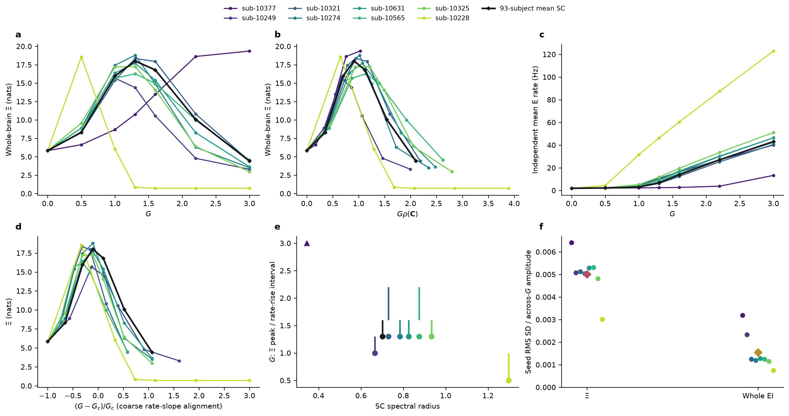

**图 1。** a：原 G 的全脑 Ξ；b：G×SC 谱半径；c：独立诊断的平均 E 发放率；d：按粗转折中点对齐，边界未定位个体不进入该面板；e：Ξ 峰格点与独立转折区间，三角形表示边界峰；f：个体内 seed RMS SD 除跨 G 均值响应幅度。曲线为 3 seed 均值，连线只连接观测格点，不是额外采样。Ξ 的误差/幅度比为 0.0030–0.0064，whole EI 约为 0.0007–0.0032，后者更稳定。黑线为平均 SC 参照，未计入 8 个体统计。

SC 谱半径不能完全消除曲线差异，相同 G 也不能保证状态等价。高 G 的排名迁移与核重复性没有单调提升，整合量也下降；本轮不支持“耦合越强，协同核越一致”的单调结论。

### I.4 网络分工复现，DMN 第一受网络规模影响

固定 G=1.3 时，7/8 个体的最大网络内部 Ξ 来自 Visual 或 SomMot。例外 sub-10228 已越过自己的早期整合峰；其全脑 Ξ 仅约 0.845 nats。为区分状态差异，缓存上另做描述性对齐：取独立发放率转折区间中点最近的已采样 G，数值等距时选较低 G，不按 Ξ 极值选择；未定位者不进入此敏感性分析。

| 个体 | 对齐采样 G | 内部 Ξ 第一 | 内部 Ξ/ROI 第一 | 原始跨网络 Shapley 第一 | /连接机会数后第一 |
|---|---:|---|---|---|---|
| sub-10249 | 1 | SomMot | SomMot | DMN | SVAN |
| sub-10321 | 1.6 | SomMot | SomMot | DMN | SVAN |
| sub-10274 | 1.3 | Visual | Visual | DMN | SVAN |
| sub-10631 | 1.3 | SomMot | SomMot | DMN | SVAN |
| sub-10565 | 1.6 | SomMot | SomMot | SVAN | SVAN |
| sub-10325 | 1.3 | Visual | SomMot | SVAN | SVAN |
| sub-10228 | 0.5 | Visual | Visual | DMN | Limbic |

7/7 可定位个体的内部量由 Visual/SomMot 领先；原始跨网络量由 DMN/SVAN 领先（DMN 5、SVAN 2）。调整网络连接机会数 nₕ(100−nₕ) 后，6/7 由 SVAN 领先，极端尺度个体由 Limbic 领先。因此“感知网络内部整合突出、联合网络跨网络贡献突出”可在此模型中逐人复现；“DMN 必须第一”不稳健。

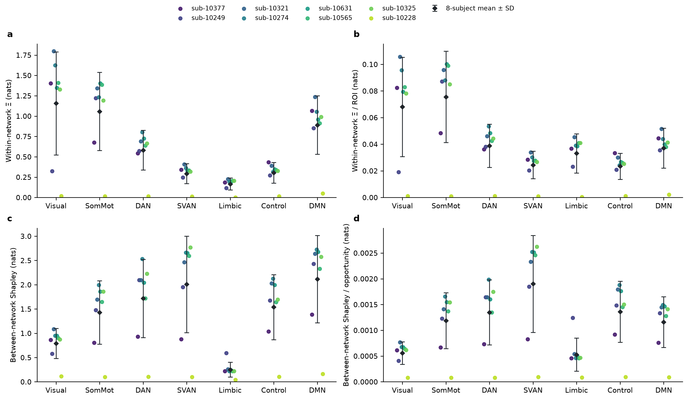

**图 2。** 固定 G=1.3，a/b 为网络整体 Ξ 及按 ROI 数调整值；c/d 为精确七网络 Shapley 及按连接机会数调整值。彩点先平均各个体 3 seed，黑色菱形和误差棒为 8 个体均值±SD。

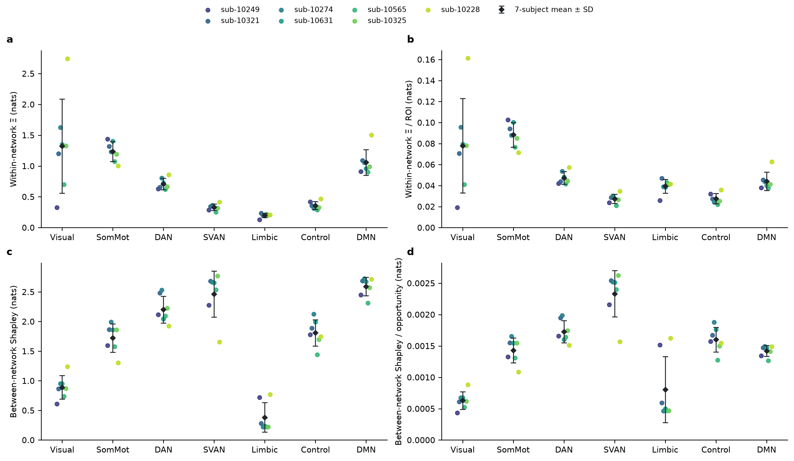

**图 3。** 与图 2 相同的量，使用表中各个体的对齐 G；7 个体均值±SD。Yeo-7 网络 ROI 数依次为 Visual 17、SomMot 14、DAN 15、SVAN 12、Limbic 5、Control 13、DMN 24。调整只是规模敏感性分析，不是消除结构混杂。

固定 G=1.3 的跨网络 Shapley 与相应网络间 SC 权重排名平均相关为 0.875，机会数调整后为 0.893。结构约束提供了强解释，本轮没有结构保持 null 模拟，尚不能证明网络分工超出共同解剖与共享局部模型。ROI 标签沿用准备流程推断的 Schaefer 顺序，未取得原始数据逐 ROI 身份保证。

### I.5 多源增量取决于端点：核重复性优于成对代理，统一成员并未出现

#### 连续归因与留一人比较

以下为独立 seed 留一人共识的 Spearman 排名相关，先在个体内平均轮换，再给出 8 个体均值±SD。共享 JFIC 和群体参考仍包含这些个体，因此这里只验证固定参考模型下的组织迁移，不是完全独立的模型训练泛化。

| 归因/基线 | G=1 | G=1.3 | G=2.2 |
|---|---:|---:|---:|
| 多源跨 ROI Shapley | 0.691 ± 0.291 | 0.673 ± 0.295 | 0.346 ± 0.401 |
| 成对可加代理 Shapley | 0.655 ± 0.274 | 0.612 ± 0.279 | 0.354 ± 0.429 |
| whole EI Shapley | 0.795 ± 0.333 | 0.760 ± 0.351 | 0.662 ± 0.309 |
| SC 节点强度 | 0.796 ± 0.260 | 0.796 ± 0.260 | 0.796 ± 0.260 |

多源相对成对代理的个体配对平均增量为 G=1 的 +0.036（7/8 同向）、G=1.3 的 +0.061（8/8 同向）、G=2.2 的 −0.009（2/8 同向）。两种方法自身空间排名仍很相似：G=1、1.3、2.2 的相关分别约 0.980、0.950、0.973，增量不是完全不同的空间组织。

固定 top-8 成员原型的独立 seed 留一人 Jaccard，多源/成对代理分别为 G=1 的 0.327/0.239、G=1.3 的 0.373/0.391、G=2.2 的 0.164/0.133。G=1.3 的全排名改善没有转化为 top-8 成员改善。whole EI 和 SC 强度的排名迁移均高于多源；SC 强度跨 G 完全不变，说明稳定性本身不能衡量状态敏感性或功能价值。

#### 同一个体重复与跨个体协同核

同人重复：每人计算 3 对 seed 核 Jaccard 后平均。跨人：每人 seed4 主核与其他 7 人 seed3/5 核的 14 次重叠先平均，再汇总 8 人。匹配机会参照每次抽 512 个随机集合，保留主核大小、半球/Yeo 构成、个体 SC 强度三分位的联合格计数；小格的强制入选保留，不放宽规则。它是成员重叠参照，不是重连 SC 后重新运行 DMF 的结构 null。

| G | 方法 | 同人跨 seed C₁₀ Jaccard | 跨人独立 seed C₁₀ Jaccard | 匹配机会均值 |
|---|---|---:|---:|---:|
| 1 | 多源 | 0.640 ± 0.346 | 0.179 ± 0.121 | 0.149 |
| 1 | 成对代理 | 0.526 ± 0.340 | 0.161 ± 0.113 | 0.112 |
| 1.3 | 多源 | 0.703 ± 0.261 | 0.052 ± 0.027 | 0.051 |
| 1.3 | 成对代理 | 0.433 ± 0.225 | 0.096 ± 0.067 | 0.067 |
| 2.2 | 多源 | 0.509 ± 0.399 | 0.150 ± 0.153 | 0.078 |
| 2.2 | 成对代理 | 0.499 ± 0.324 | 0.091 ± 0.064 | 0.060 |

G=1.3 的同人核重复性配对差为 +0.269（个体差 SD=0.281，7 人提高、1 人持平）；这是本轮最明确的描述性多源增量。G=1 的差为 +0.115，但个体差 SD=0.541；G=2.2 的差仅 +0.010，不能视为广泛稳定优势。固定预算 Shapley 排列误差与模拟 seed 差异分开记录，SPT 搜索重复敏感性没有另行测试。

G=1.3 的多源跨人重叠为 0.052，机会参照为 0.051；成对代理为 0.096，机会参照为 0.067。固定主 seed4 时，两方法在每个正 G 都产生 8 个不同的完整核，任何完整核最多只出现于 1/8 个体。G=1.3 的核规模为 8–10 ROI。这些结果支持“同一个体内可重复、不同个体成员分化”，不支持“所有个体共享一个完整协同核”。其他 G 的机会以上重叠仅作描述，未计算人口推断的显著性。

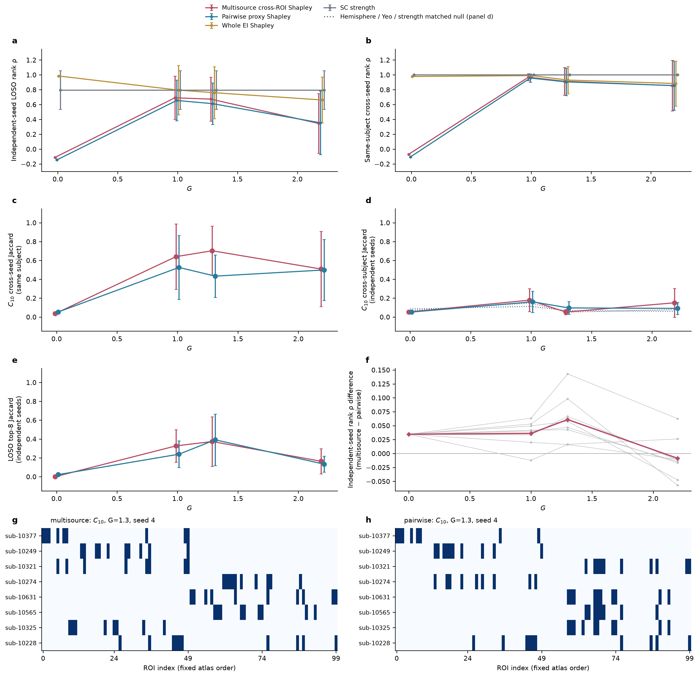

**图 4。** a：独立 seed 留一人排名相关；b：同人跨 seed 排名相关；c：同人 C₁₀ 核重复；d：跨人独立 seed 核重叠，虚线为匹配机会均值；e：留一人 top-8 成员原型重叠；f：多源减成对代理的排名相关差，灰线为每名个体，红线为均值；g/h：G=1.3、seed4 的核成员，ROI 索引为 0–99。a–e 误差棒为个体汇总的 SD，未截断到指标合法区间，因此误差棒可超出 0–1。G=0 的共享样本伪象已用独立 seed 比较隔离，不解释为真实组织或方法优势。

#### 平均 SC 参照

平均 SC 在 G=1.3 的 Ξ 为 18.013 nats，跨 ROI Shapley 与个体排名的平均相关为 0.675；其 9 ROI 核为索引 {5,8,14,19,28,35,36,48,49}，与个体 seed4 核的平均 Jaccard 为 0.211。这里使用同 seed 和包含开发个体的 93 人均值，只是描述性参照。平均结构的核不能直接称为群体共享核。

### I.6 数值有效性与结论范围

本轮 Syn 非负容差为 **10⁻⁸ nats**。未使用静默截零；容差内负数计数、低于阈值的显著违反均为 0，状态越界计数为 0，完成缓存未发现 NaN/Inf。模拟基本审计最小值为 6.25×10⁻¹² nats，树候选最小 Syn 为 3.78×10⁻⁴ nats。全脑预算、网络预算、树闭合最大误差分别为 5.68×10⁻¹⁴、4.26×10⁻¹⁴、7.11×10⁻¹⁵ nats。

256 对排列的最大 ROI Shapley MC SE 为 0.00571 nats；整体 Ξ-Shapley 两半排列的最小排名相关为 0.9972，top-10 最少重合 8/10。这是固定预实验预算的误差诊断，不能替代全部跨 ROI 排名和离散树选择的收敛证明。6 项独立单元核对通过，覆盖解析总体 G=0 跨 ROI 为零、精确小博弈对照、负值显式失败、边界不强制对齐及共享噪声隔离；代码编译检查通过。现有 pytest 全套未运行，当前环境没有 pytest。

本轮已完成批准的开发预实验。方案中的全 93 人扫描、按个体状态对齐的完整组织比较、冻结共同联盟候选池的 k=2/4/8 优化、SPT 搜索重复、训练折均值 SC/JFIC、SURD、非线性 TM、完整结构 null 及独立功能/预测验证均未执行。当前证据可用于呈现网络分工和个体组织重复性；它尚不能建立纯高阶因果原子、人口共同核心或独立功能优势。扩大个体数之前，优先解决 G=0 的估计背景并验证相近状态下的组织比较，比直接宣称共同协同核更符合结果。

### I.7 复用与记录

[冻结协议](../../results/dmf_schaefer100/subject_consistency_pilot/contract.json)、[统计汇总](../../results/dmf_schaefer100/subject_consistency_pilot/summary.json)、[完成记录](../../results/dmf_schaefer100/subject_consistency_pilot/completed.json)、[代码版本与分析调整](../../results/dmf_schaefer100/subject_consistency_pilot/implementation_provenance.json)保留可追溯记录。昂贵计算缓存为 `conditions/*.npz`（189）、`dynamics/*.npz`（9）、`organization/*.npz`（108），无需重算；没有另建 CSV。

实现：[计算与断点复用](../../scripts/run_dmf_subject_consistency.py)、[共同密度组织方法](../../scripts/dmf_subject_consistency.py)、[统计与绘图](../../scripts/analyze_dmf_subject_consistency.py)、[单元核对](../../tests/test_dmf_subject_consistency.py)。重用当前完整缓存并生成分析：

```bash
.venv/bin/python scripts/analyze_dmf_subject_consistency.py
```

从同一冻结布局执行或续算时使用：

```bash
.venv/bin/python scripts/run_dmf_subject_consistency.py --phase run
```

主计算与分片日志保留于 docs/log/dmf_subject_consistency_*.log。先前因计算调度调整产生的 KeyboardInterrupt 和共享配置临时文件冲突已修复；未改科学参数，有效缓存保留并逐个核对协议。所有计算、分析和图表均已完成，临时检查在交付时删除。


### 后续：跨个体曲线比较

同一8人×7 G×3 seed布局已补齐原生ΦR与自然态source-WMS，并包含平均SC参照，新增189个有效条件。见[曲线比较报告](brain.md#dmf-subject-curves)及[完整完成记录](../../results/dmf_schaefer100/subject_consistency_pilot/curve_native_completed.json)。Ξ、ΦR、WMS的原G8人形状留一人Pearson分别为0.638、0.687、0.616，独立状态对齐7人后分别为0.926、0.917、0.936。曲线一致性没有显示Ξ明显占优。whole EI现已从跨指标比较中移出，单独与部分EI之和作[峰值分解](brain.md#dmf-ei-components)。

ΦR峰与WMS谷的8人均值位置一致，中间6人均在G=1；Ξ多数在G=1.3。相对于独立转折区间，Ξ有5/7命中，ΦR与WMS各2/7。共同G极值集中与动力学转折标记是不同维度。原生协议的观测变量、时距、源分布和数值稳定处理不同；ΦR短BOLD-like轨迹的协方差下限触发，以及WMS部分自然轨迹只有150个不同采样时间点，均限制跨指标的解释。完整图表、极值和审计保存在新报告中。原预实验的协同核/网络结论未因这次曲线补算改变。

<!-- report-section:dmf-subject-curves:start -->
<a id="dmf-subject-curves"></a>

## 附录 J：个体指标曲线、动力学转折与形状比较

2026-10-03更新；原模拟完成于2026-10-02。原生 ΦR＋WMS 已完成同一8人×7 G×3 seed，并补算平均SC参照，共189条件。平均SC只作虚线参照，不进入被试一致性训练或统计。 主比较改为：指标极值是否对应各人的独立序参量转折，以及曲线是否有额外回摆。峰的存在或跨人峰位接近不直接代表正确；跨被试一致性作为补充维度保留。8个体依据原生SC谱半径等距秩选取，属于开发样本；均值±SD是描述性结果，不作人口推断。whole EI单独见[整体EI与部分EI之和的峰值分解](brain.md#dmf-ei-components)。本轮只复用原缓存，无新增模拟、参数调整或平滑。

### J.1 三项指标与每人的序参量

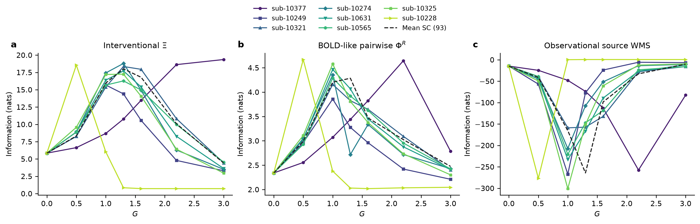

**图1。** 主图仅保留A、B、C三个原始nats面板，依次为Ξ、ΦR、WMS，每人曲线为3seed均值。颜色/标记固定对应个体；虚线是93人平均SC的独立模拟参照，不是8人的曲线均值。WMS有符号，谷值方向保留。

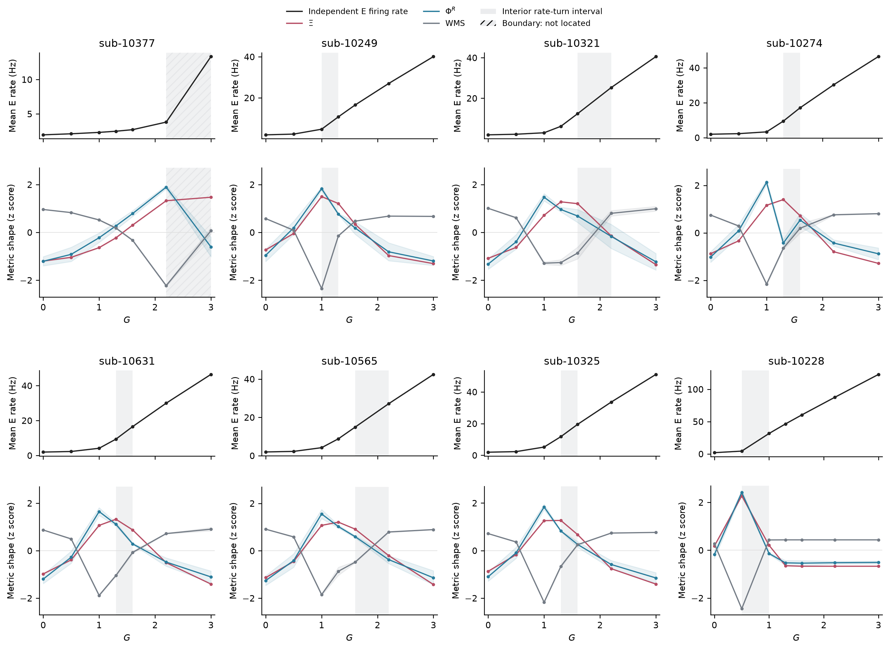

**图2。** 每人一格，上部是独立5s模拟最后2s、100ROI平均兴奋性发放率（Hz），下部是三项指标的同人形状。灰带由独立发放率最大正斜率区间确定；斜线灰带为边界、尚无法定位。为了同轴查看各指标形状，下部仅按各自3seed均值曲线的跨G均值/SD作z标准化，未按峰位对齐、翻转WMS或对G插值。细带为3seed SD，上部用Hz，下部用同一个固定标准化尺度换算；不是置信区间。下部统一显示范围，先检查所有均值±SD均被保留。

### J.2 峰/谷是否对应各人的序参量转折

个体顺序固定为sub-10377、sub-10249、sub-10321、sub-10274、sub-10631、sub-10565、sub-10325、sub-10228，SC谱半径递增。沿用原生DMF比较的极值方向：Ξ、ΦR主报最大值，WMS主报最小值；同时给出所有指标的最大值和最小值。位置在原观测格点上查找，未用插值找峰。格点极值不能认定为连续G的真实峰/谷；边界极值可能是单调趋势或扫描不足。独立发放率在内部出现最大正斜率，只标为转折候选，不能在有限尺寸模型的7点扫描中证明相变；“无法定位”也不等于“没有相变”。

本次8人中7人有内部转折候选，sub-10377最大正斜率位于G=2.2→3边界。它的Ξ仍向扫描末端上升，ΦR在G=2.2达峰、WMS在同处达谷；这些是边界附近的候选关系，不能直接计作虚假峰。当前没有独立确认无转变的对照，所以不能估计“无相变却报峰”的假阳性率。不同被试的转折区间本来就不同，共同G下峰位不一致本身不构成错误。

| 指标 | 主参照 | 8人均值曲线极值G，依上述顺序 | 极值G的SD | 扫描内部 | 落在独立转折区间 |
|---|---|---|---:|---:|---:|
| 干预 Ξ | 最大值 | 3、1、1.3、1.3、1.3、1.3、1.3、0.5 | 0.715 | 7/8 | 5/7 |
| BOLD-like ΦR | 最大值 | 2.2、1、1、1、1、1、1、0.5 | 0.482 | 8/8 | 2/7 |
| 自然态 source-WMS | 最小值 | 2.2、1、1、1、1、1、1、0.5 | 0.482 | 8/8 | 2/7 |

**表1。** 极值G的SD使用全部8人；转折区间命中只计7个可定位人，含区间端点。共同G的极值集中与相对于自身动力学转折的位置一致是不同问题，JSON保留每人到独立转折中点的偏移和3个seed的峰/谷位置。

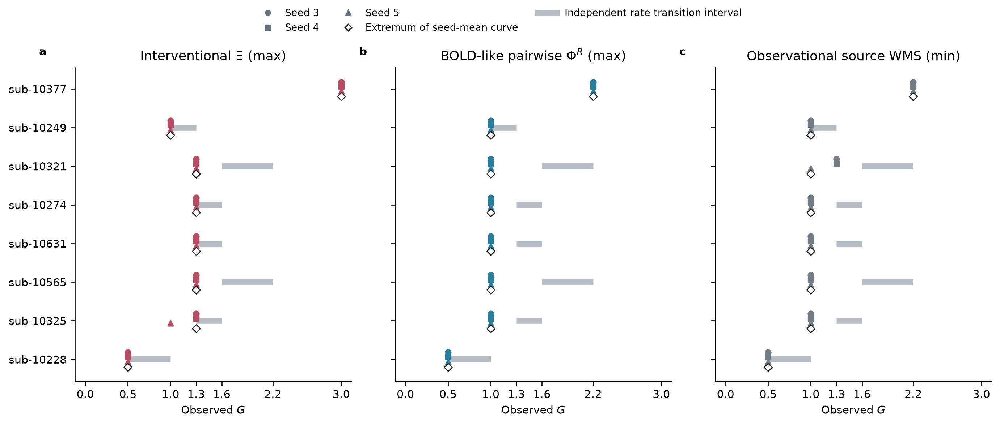

**图3。** 小标记显示各seed的极值G，空心菱形是3seed均值曲线的极值；灰条为独立发放率最大变化区间。无法定位的sub-10377不画灰条，仍保留其观测极值。WMS列采用谷的位置。

| 指标 | 8人最大值G | 8人最小值G |
|---|---|---|
| 干预 Ξ | 3、1、1.3、1.3、1.3、1.3、1.3、0.5 | 0、3、3、3、3、3、3、3 |
| BOLD-like ΦR | 2.2、1、1、1、1、1、1、0.5 | 0、3、0、0、0、0、3、1.6 |
| 自然态 source-WMS | 0、2.2、0、3、3、0、3、1.6 | 2.2、1、1、1、1、1、1、0.5 |

**表2。** 保留两种方向的极值，WMS评价对应的是谷的位置。

ΦR的峰与WMS的谷在8人均值曲线上位于相同格点，中间6人均为G=1，原G位置SD均为0.482，小于Ξ的0.715。相对于独立转折区间，Ξ有5/7命中，ΦR与WMS各2/7。因此，极值更集中与更靠近各人的动力学转折给出了不同排序。这里只比较粗格点，不据此证明真实相变点或机制优势。

Ξ的两个SC尺度极端在共同G下峰位错开，因此还需对照同一7人的独立状态对齐结果。对原生ΦR/WMS，一致性分数只说明各自观测和估计协议下的曲线表现，不能把它们与Ξ的差别完全归因于指标公式，也不能据8人的均值排名宣布全面优势。

### J.3 单峰偏离与折线粗糙程度

令 $y_j$ 为某人的3seed均值曲线，$m=7$为格点数，$\Delta y_j=y_{j+1}-y_j$。Ξ、ΦR取原值；WMS仅在本节形状计算中取 $y_j=-WMS_j$，把单谷转为单峰，图中保留WMS原始符号。令 $k$ 是全局最大值的首个格点，$A=\max y-\min y$。对非平坦曲线，定义

$$
U=\frac{\sum_{j<k}[-\Delta y_j]_++\sum_{j\ge k}[\Delta y_j]_+}{A}
=\frac{\sum_j|\Delta y_j|-(y_k-y_0)-(y_k-y_{m-1})}{2A},\qquad [a]_+=\max(a,0).
$$

**U是单峰偏离量。** 分子累加主峰前的下降与主峰后的回升；除以该曲线的完整幅度，避免不同nats量级直接比较。弱单峰（先不降、后不升）、单调曲线和峰顶平台均为0；偏离越大，反向运动越大。这里的正部运算是描述量的定义，不是对Ξ/Syn做裁剪。相对形状零阈值为10⁻¹⁰；平坦曲线（幅度≤10⁻¹²×max(1,最大绝对值)）没有可识别极值，U/Q不定义，不算作理想单峰。

为单独描述折线的粗糙程度，把 $x_j=(G_j-G_0)/(G_{m-1}-G_0)$、$z_j=(y_j-\min y)/A$，定义

$$
Q=\sum_{j=0}^{m-3}\left|\frac{z_{j+2}-z_{j+1}}{x_{j+2}-x_{j+1}}-\frac{z_{j+1}-z_j}{x_{j+1}-x_j}\right|.
$$

**Q是归一化区间斜率的总变差。** 它使用真实不等距G格点，对幅度和平移不敏感。Q较大既可能来自锯齿，也可能来自真实的陡峭单峰，因此不给Q设置“正确/错误”阈值，更不将较小Q直接当作指标优势。7点只能描述观测折线，无法证明连续曲线平滑。

| 指标 | 弱单峰或单调 U≈0 | 主极值在内部 | 恰有1个显著内部峰/谷 | U个体均值±SD | Q个体均值±SD |
|---|---:|---:|---:|---:|---:|
| Ξ | 8/8 | 7/8 | 7/8 | 0.000 ± 0.000% | 9.007 ± 2.716 |
| ΦR | 6/8 | 8/8 | 7/8 | 3.967 ± 10.809% | 13.145 ± 7.548 |
| WMS（单谷） | 6/8 | 8/8 | 8/8 | 0.047 ± 0.130% | 17.382 ± 4.307 |

**表3。** 8人为统计单位，先平均3seed再计算形状。显著内部峰由格点prominence≥整条曲线幅度的5%定义，并保留0%、1%、5%敏感性结果；这是看过曲线后设定的探索性描述规则。局部prominence依赖扫描支持，边界不算内部峰，故恰有1个显著峰与U=0不能互相替代。Ξ的7个内部峰加1条边界单调上升曲线均有U=0。

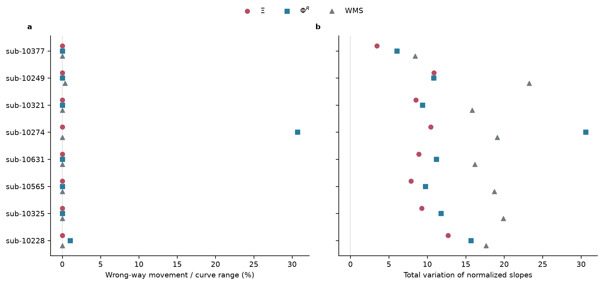

**图4。** 每个点是一人的3seed均值曲线。左为U×100%，右为Q；零值保留。WMS按单谷评价。量纲归一化只用于描述形状，没有重拟合、平滑或改动任何指标原值。

| 指标 | 被试 | 反向运动总量（nats） | U | 内部峰/谷数：0% / 1% / 5% |
|---|---|---:|---:|---:|
| ΦR | sub-10274 | 0.617760 | 30.7025% | 2 / 2 / 2 |
| ΦR | sub-10228 | 0.027379 | 1.0331% | 1 / 1 / 1 |
| WMS（单谷） | sub-10249 | 0.967767 | 0.3703% | 1 / 1 / 1 |
| WMS（单谷） | sub-10228 | 0.026138 | 0.0094% | 2 / 1 / 1 |

**表4。** 所有非单峰均值曲线，不按结果选择案例。ΦR在sub-10274的峰后回升约0.618 nats，U约30.7%，且在5%prominence规则下仍有2峰；这是明确的观测回弹。ΦR在sub-10228以及WMS的两个尾部回摆较小，不能把所有回摆都写成“强波动”。小幅回摆是否可重复还需对照seed；短自然轨迹、估计正则化和动力学差异也可能造成形状差异，本轮不能据此证明指标公式本身失效。

至少一个seed有回摆的全部被试如下（seed 3 / 4 / 5）；其余被试的各seed U均为0。完整逐seed U/Q、峰数、极值方向和边界分类保留在分析汇总curve_shape字段。Ξ的sub-10228在seed 4仍有0.0154%的小回摆，不能把8条均值曲线无回摆写成所有随机重复都严格单峰。

| 指标 | 被试 | 各seed U |
|---|---|---|
| Ξ | sub-10228 | 0.0000% / 0.0154% / 0.0000% |
| ΦR | sub-10321 | 0.0000% / 0.0000% / 1.9893% |
| ΦR | sub-10274 | 41.4819% / 20.9189% / 27.1681% |
| ΦR | sub-10228 | 1.4744% / 5.0846% / 1.1204% |
| WMS（单谷） | sub-10249 | 0.5069% / 0.5596% / 0.0476% |
| WMS（单谷） | sub-10321 | 0.0000% / 0.0000% / 1.0281% |
| WMS（单谷） | sub-10228 | 0.0667% / 0.0040% / 0.0423% |

**表5。** 每人每seed独立描述，不把24个seed当作24个被试。


### J.4 跨被试一致性：补充比较

原 G、8人：BOLD-like ΦR（0.687） > 干预 Ξ（0.638） > 自然态 source-WMS（0.616）。

状态对齐、7人：自然态 source-WMS（0.936） > 干预 Ξ（0.926） > BOLD-like ΦR（0.917）。

Ξ、ΦR、WMS在独立状态对齐后均达到较高的曲线相似度（Pearson 0.917–0.936）。这一维度没有显示Ξ明显占优；三者的均值次序也随是否对齐改变。8人开发样本及原生协议差别限定了这项描述性排名。

每次留出1人的1个seed，训练共识使用其他人的另2个seed，3次轮换先在个体内平均。训练曲线各自按跨G均值/SD标准化后等权平均；不取绝对值、不翻转、不按自身峰对齐。Pearson评价形状，Spearman评价排序。不同指标原始量级不直接比较。

| 指标 | 原始G，全部8人 | 原始G，可定位7人 | 独立状态对齐，可定位7人 |
|---|---:|---:|---:|
| 干预 Ξ | 0.638 ± 0.595 | 0.799 ± 0.403 | 0.926 ± 0.071 |
| BOLD-like ΦR | 0.687 ± 0.422 | 0.775 ± 0.358 | 0.917 ± 0.047 |
| 自然态 source-WMS | 0.616 ± 0.560 | 0.764 ± 0.426 | 0.936 ± 0.062 |

**表6。** 独立seed留一人形状Pearson的个体均值±SD。状态参照来自独立发放率诊断：最大变化区间的中点Gc。sub-10377处于扫描边界，不能定位；7人是同一组，故原G的7人结果提供对齐前参照。共同状态支持为−1至0.579，取7个等距点，对原7个G观测线性插值，不外推。截短区间与插值会改变比较问题，相关提高不能全部归因于状态差异消除。

| 指标 | 原G8人 Spearman | 原G7人 Spearman | 对齐7人 Spearman | 同人不同seed Pearson，8人均值±SD |
|---|---:|---:|---:|---:|
| 干预 Ξ | 0.696 | 0.855 | 0.898 | 0.999888 ± 0.000053 |
| BOLD-like ΦR | 0.728 | 0.777 | 0.881 | 0.970357 ± 0.022223 |
| 自然态 source-WMS | 0.635 | 0.779 | 0.930 | 0.997002 ± 0.004293 |

**表7。** Spearman沿用表6的留一人计算。同人重复性则先平均每人的3对seed相关，再汇总8人；这与跨个体一致性是不同端点。原始幅度共识的敏感性结果及每人分数保留在JSON中，未将seed、28个被试对或4950个ROI对当作独立被试。

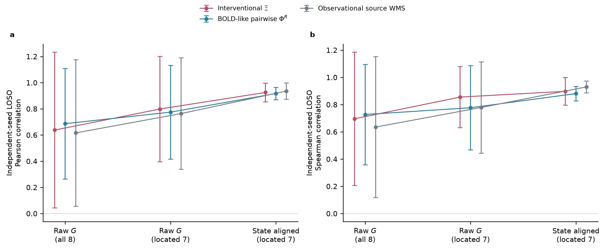

**图5。** Pearson与Spearman使用相同评估和人群。点为个体均值，误差棒为个体SD，不是置信区间；均值±SD可能超出相关的合法范围，误差棒不截断。原G7人与对齐7人使用相同个体，横轴支持和采样点不同。

### J.5 原生协议与数值审计

沿用冻结的个体SC、平均SC参照及93人平均图在G=1校准的固定JFIC，不归一化个体SC，也不为各指标重新调参。G为0、0.5、1、1.3、1.6、2.2、3；名义seed为3、4、5。新观测基线每个名义seed使用62000+seed的自然轨迹、63000+seed的时间采样和64000+seed的未来噪声，跨人/跨G成对，三条流互异且与Ξ及独立诊断分离。G=0同seed输出在个体间相同；表6采用不同seed评价，不作G=0背景扣除。

- **ΦR：** 自然DMF记录1.5s，burn-in至少0.3s；稳定判据窗口0.05s、发放率漂移阈值0.15Hz、连续2窗口。将尾部E发放率转换为Balloon–Windkessel BOLD-like信号，Gaussian-MMI ΦR对全部4950个ROI对取均值，延迟1步即1ms。原生Gaussian估计保留10⁻¹⁰协方差特征值/相关分母下限及MI非负投影；逐对ΦR在[−10⁻¹⁰,0) bits视作数值零并记录，低于−10⁻¹⁰ bits显式失败。短BOLD-like记录、1ms延迟和数值下限限制其生理解释。
- **WMS：** 从自然轨迹尾部有放回抽2048个完整200维E/I源状态，以无状态裁剪的同模型预测300ms后的完整200维未来。保留相关的经验源先验，用仓库原生Gaussian线性拟合估计整体MI减200个标量源对完整未来的MI之和；继承10⁻⁶ ridge及10⁻¹²特征值下限。WMS有符号，负值不属于PEID Syn非负违反，未取绝对值或作非负投影。
- **Ξ及whole EI：** 复用原预实验的独立均匀干预[0.3,0.7]、2048样本、300ms未来、统一affine-TM密度、矩匹配对角Gaussian源先验及10⁻⁸ nats Syn容差。其源分布、观测变量、目标维数、时距及正则化与ΦR/WMS并不全部相同。本轮是原生协议下的曲线比较，不是只改变指标公式的受控消融。若在Ξ的同一因子化共同密度上直接求source whole-minus-sum，按定义等于Ξ，不构成独立WMS基线。

观测自然轨迹继承[0,1]硬裁剪，所有记录步骤及最终状态均审计；未来预测不裁剪，状态越界或异常发放率显式失败。原生输出bits统一乘ln2后作nats曲线，保留原始逐对值、极值、数值零计数和估计器下限审计。

189个条件均给出有限的 ΦR/WMS；ΦR 原始逐对最小值为 0.00139428 bits，落入非负数值零容差的对数为 0。自然轨迹边界命中共 0 次，未裁剪未来的越界次数为 0；稳定判据在 189/189 条件检测到，未检测到时沿用0.3s burn-in，而非宣称达到稳态。

ΦR 协方差特征值下限被触发 54837/7484400 次，涉及 170/189 条件；单变量相关分母下限被触发 0 次；WMS 协方差特征值下限被触发 0 次。计数是所有条件、所有估计子查询中低于下限的特征值/分母总数，不是异常被试数。ΦR 的高自相关和短 BOLD-like 记录使这一数值稳定处理影响解释，本轮保留原生估计器，未据结果调下限。

WMS 的最大源/残差条件数分别为 1.1e+08、6.79e+03；2048次有放回采样中，最少只有 150 个不同时间点。这不是2048段独立自然轨迹；高维 Gaussian 拟合和短记录均是本次原生比较的限制。

本轮重新核对Zotero P6UJCVG8（*Emergent hierarchical organization of causal interactions in complex systems*），正文附件DXGC7JEA，19页，读取Brain/Fig.2、Methods式（4）–（8）。附件没有明确稿件版本/日期，元数据编辑不能确定新版本；补充附录不可用。正文把两项观测对照并列描述为BOLD-like，而仓库原生WMS实际使用自然态完整E/I状态，只有ΦR使用BOLD-like。本轮保留已获批准的仓库原生实现，记录这一正文/代码差别，未声称完全核验最新稿件一致性。

### J.6 复用

[分析汇总](../../results/dmf_schaefer100/subject_consistency_pilot/curve_comparison_summary.json)、[原生冻结协议](../../results/dmf_schaefer100/subject_consistency_pilot/curve_native_contract.json)、[原生数值审计](../../results/dmf_schaefer100/subject_consistency_pilot/curve_native_audit.json)、[原开发预实验](brain.md#dmf-subject-pilot)。

[原生计算与断点复用](../../scripts/run_dmf_subject_curve_baselines.py)、[分析与绘图](../../scripts/analyze_dmf_subject_curves.py)。昂贵模拟保存为189个轻量NPZ条件与完整curve_baselines.npz，分析只读匹配协议的完整缓存，无需重算，不创建CSV。

```bash
.venv/bin/python scripts/analyze_dmf_subject_curves.py
```
<!-- report-section:dmf-subject-curves:end -->

<!-- report-section:dmf-ei-components:start -->
<a id="dmf-ei-components"></a>

## 附录 K：整体 EI、部分 EI 之和与整合峰

2026-10-03。整体EI从跨指标一致性比较中移出，在同一冻结8人×7 G×3 seed及平均SC参照中单独分析。只读取原有affine-TM缓存，无新增模拟。

### 定义和口径

令 $E(G)=EI_{300}(V\to V)$ 为整体EI，$S(G)=\sum_{i\in V}EI_{300}(\{i\}\to V)$ 为各标量源的部分EI之和。这里 $V$ 包含100脑区的200个E/I标量变量，所有部分EI都使用相同完整200维未来、同一干预密度和300ms时距。当前整合有效信息满足

$$
\Xi(G)=E(G)-S(G),\qquad E(G)=S(G)+\Xi(G).
$$

本图分解的是相减得到的差值。若按100个ROI的E/I二元块求和，得到的是另一个“跨ROI残差”，不能替代当前Ξ的200标量源分解。$S$直接从缓存密度的200个单变量MI求和，并独立核对 $E-S=\Xi$；未仅以 $E-\Xi$反推后宣称核验。

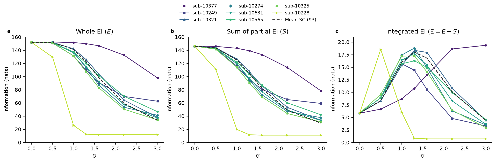

**图1。** 三列依次为整体EI、部分EI之和及差值Ξ，均为原始nats，未分别标准化后相减。每人曲线为3seed均值，颜色/标记对应同一人；虚线为93人平均SC独立模拟参照。前两列共用0–160 nats范围，差值列使用0–21 nats范围。平均SC参照不等于8条个体曲线的平均。

### 两项是否单调下降

平均SC参照的整体EI和部分EI之和都在全部7个观测G点下降。8个体中，整体EI有 6/8 在观测格点不增，部分EI之和有 7/8 不增；中间6人两项均下降。端点例外为：sub-10377 的整体EI在G=0→0.5回升0.474570 nats；sub-10228 的整体EI在G=2.2→3回升0.003383 nats；sub-10228 的部分EI之和在G=2.2→3回升0.003575 nats。这些回升保留原值，不能把“总体下降”写成所有被试严格单调，也不能以Syn数值零容差抹去它们。各区间发生回升的seed数量与跨seed SD保留在分析汇总。

### 为什么两个下降量的差会有峰

定义每个观测区间的平均下降速度 $R_E=-\Delta E/\Delta G$、$R_S=-\Delta S/\Delta G$，则

$$
\frac{\Delta\Xi}{\Delta G}=R_S-R_E.
$$

当部分EI之和降得更快，差值Ξ增大；当整体EI降得更快，差值Ξ减小。峰对应两项相对下降速度交换的附近，并不要求整体EI增加。这是对曲线的数学分解，尚不单独解释动力学机制或证明纯高阶相互作用增强。

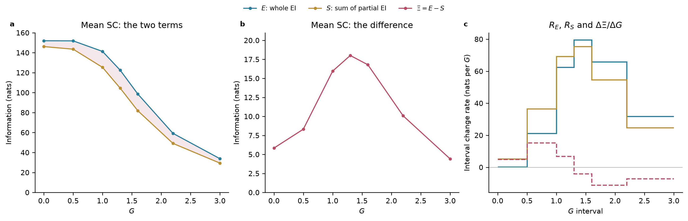

**图2。** 平均SC参照，3seed均值。左图蓝/金曲线分别为 $E$/$S$，浅红色两线之间的间隙为Ξ；蓝/金细带为跨seed SD。中图单独显示Ξ及跨seed SD。右图保持同一颜色：蓝/金阶梯为 $R_E$/$R_S$，红色虚线为 $\Delta\Xi/\Delta G=R_S-R_E$。阶梯是各真实G区间的平均变化率，不是连续导数，也未插值定位斜率交点。

| G区间 | 整体EI下降速度 $R_E$ | 部分EI之和下降速度 $R_S$ | Ξ变化速度 $R_S-R_E$ |
|---|---:|---:|---:|
| 0–0.5 | 0.222 | 5.188 | +4.965 |
| 0.5–1 | 21.162 | 36.440 | +15.278 |
| 1–1.3 | 62.443 | 69.281 | +6.838 |
| 1.3–1.6 | 79.492 | 75.425 | -4.067 |
| 1.6–2.2 | 65.825 | 54.641 | -11.184 |
| 2.2–3 | 31.750 | 24.673 | -7.077 |

**表1。** 单位nats/G。平均SC在G=1→1.3时，部分EI之和下降更快，Ξ从15.961升到18.013 nats；在G=1.3→1.6时，整体EI下降更快，Ξ降到16.793 nats，形成观测格点上的G=1.3峰。8人中7人的Ξ有扫描内部极值；最低SC尺度个体仍在扫描末端G=3达到最大值，当前范围未观察到其下降支，不能强行认定所有人都发生速度交换。

### 估计与核验边界

保持原干预支持[0.3,0.7]、2048样本、300步未来、无状态裁剪、固定JFIC与共同affine-TM近似：线性转移、Gaussian残差、矩匹配对角源先验及原ridge。所有分量来自同一拟合密度，未重拟合或对分量另作正则化。Ξ/Syn非负容差为10⁻⁸ nats；本次189条件的分解最大闭合误差为 0 nats，Ξ容差负值计数 0，显著负值计数 0。原G=0拟合背景保留，未扣除。

本次重新定位Zotero主稿 *Emergent hierarchical organization of causal interactions in complex systems*，父条目P6UJCVG8、当前唯一正文附件DXGC7JEA（19页），读取Methods式（5）、（7）、（8）（第15–16页）及Brain/Fig.2。正文没有明确稿件版本/日期；Zotero版本号/编辑时间不是稿件版本证据，补充附录不可用。上述分解依照正文式（7），代码使用既有affine-TM Gaussian近似，未把它称为已验证的非线性高阶PID原子。

[跨指标曲线报告](brain.md#dmf-subject-curves)现仅比较Ξ、ΦR、WMS。[完整分析汇总](../../results/dmf_schaefer100/subject_consistency_pilot/curve_comparison_summary.json)的ei_decomposition字段保留逐人曲线、seed SD、单调性例外及区间速度。
<!-- report-section:dmf-ei-components:end -->

<a id="dmf-subject-plan"></a>

## 附录 L：个体验证协议与实施范围

**主问题：群体平均 SC 上观察到的整合峰、协同核与网络分工，是否能在个体 SC 驱动的同一 DMF 中复现？多源组织是否在估计重复、跨被试迁移和动力学状态区分之间取得更好的表现？**

协议制定于 2026-10-02；8 人开发预实验及原生曲线比较已完成，执行结果见附录 I–K，93 人细扫描与分析也已完成，识别结果见正文第 1 节，完整协议、统计与审计见附录 P。下文保留设计时的检验范围，尚未实施的正式训练折泛化、结构 null 与独立功能用途仍是计划。主路线继续使用现有 SC＋DMF，人工混合阶系统保留为方法阳性对照。[联合符号读取负结果](brain.md#dmf-joint-pilot)保留，不再承担主比较。

### L.1 已有证据与待检验问题

| 已有实验 | 支持的结论 | 个体实验新增检验 |
|---|---|---|
| 93 人平均 SC 的 G 扫描 | Ξ 在中等耦合达峰，邻近宏观动力学转折；多指标响应形状不同 | 峰带与转折的关系能否推广到个体，是否受 SC 尺度影响 |
| 随 G 构建 SPT、追踪候选核 | 存在稳定区间与成员重组；冻结核在留出 seed 中保留信息优势 | 共同成员、完整组合与层级是否跨个体保留 |
| 网络整体 Ξ 与跨网络 Shapley | Visual/Somatomotor 内部整合较突出，DMN 等网络的跨网络贡献较突出 | 这种分工是否逐人复现，是否超出网络规模和结构强度的解释 |

群体平均主扫描的重复单位是模拟 seed；个体开发结果已另见附录 I，不能将其覆盖样本扩大为 93 个体的完成结果。协同核一致性也不随 G 单调增加：已有扫描存在稳定区间、突然换核与多组竞争。将“高 G 更一致”作为待检验趋势，并报告信息强度，不能预设为必须得到的结果。高耦合下 Ξ 已下降，组织一致不等于联合信息更多。

这批数据只包含个体 SC；新结果首先支持结构约束模型的跨个体推广，不等同于个体实测脑活动、认知表现或人体因果验证。

### L.2 固定模型与信息对象

用 $\mathbf C^{(m)}\in\mathbb R^{100\times100}$ 表示被试 $m=1,\ldots,93$ 的 SC。每个 ROI 保留 E/I 两个微观坐标，总状态为 $\mathbf x_t\in\mathbb R^{200}$，微观索引集 $V=\{1,\ldots,200\}$；ROI 玩家集为 $\mathcal R=\{1,\ldots,100\}$，ROI $i$ 的坐标块为 $A_i$，$A(S)=\bigcup_{i\in S}A_i$。

沿用主稿的共同因子化干预、固定未来目标 $B=V$ 和时距 $\ell$。与已有主扫描连接时，初态支持仍为 $U(0.30,0.70)^{200}$，积分步 1 ms、未来 300 ms、噪声幅度 0.01；不改成失败读取试验的局部小盒。每个个体和 G 有自己的转移核，记共同联合分布为 $q_\ell^{(m,G)}$：

$$
\begin{aligned}
EI_\ell^{(m,G)}(A\to B)
&=I_{q_\ell^{(m,G)}}(\mathbf x_t^A;\mathbf x_{t+\ell}^B),\\
\Xi_\ell^{(m,G)}(A\to B)
&=EI_\ell^{(m,G)}(A\to B)
-\sum_{j\in A}EI_\ell^{(m,G)}(\{j\}\to B),\\
u_{m,G}(S)
&=EI_\ell^{(m,G)}(A(S)\to B)
-\sum_{i\in S}EI_\ell^{(m,G)}(A_i\to B).
\end{aligned}\tag{L.1}
$$

式（L.1）的全脑 Ξ 含 ROI 内 E/I 量，$u$ 专门衡量跨 ROI 整合；源之外的坐标始终在同一干预下边缘化。信息量统一为 nats，历史 bits 乘 $\ln2$；不将 ROI 块数与微观标量阶数混用。

探索性个体扫描优先固定已有群体 JFIC，使 SC 与 G 承担变化；先核对发放率、状态有效性和共同支持。逐人校准 JFIC 是另一项模型协议，只可在单独声明的稳健性分析中使用，并在各自参考 G 校准后固定。若共同 JFIC 导致大量无效工作点，应重新冻结协议，不能静默逐人调参或删除失败个体。

### L.3 同时比较相同 G 与相近动力学状态

原始 SC 保持原权重尺度。现有审计显示个体谱半径为 0.344–1.297，因此相同 G 不保证相同有效耦合或相近状态。报告三个横轴，前两个是结构尺度描述，第三个才是按个体转折对齐：

$$
G,\qquad
\eta_m=G\rho(\mathbf C^{(m)}),\qquad
\zeta_m=\frac{G-G_c^{(m)}}{G_c^{(m)}}.
\tag{L.2}
$$

$\rho$ 为谱半径；$\eta_m$ 不被假定为完整的 DMF 状态等价关系。$G_c^{(m)}>0$ 由独立动力学诊断确定，不能用 Ξ、$\Phi_R$ 或其他待比较指标的极值定义。首选固定扫描与有限差分规则下的平均发放率最大变化点，并以慢化/扰动易感性等独立诊断核对；诊断不一致时称动力学转折，保留其区间，不直接宣布严格临界点。扫描边界或无明确转折的个体记为未定位，不强行对齐。

主比较同时给出原始 G 和状态对齐结果，回答两个不同问题：同一外部耦合条件下个体是否相似，以及处于相近动力学状态时是否存在共同组织。不能根据哪一种图更一致而事后选择横轴。独立动力学诊断与指标估计使用分开的模拟重复；若共享模拟作探索分析，另作标记。

### L.4 实验一：整合曲线的跨被试推广

不以“93 人分数方差最小”为成功标准。一个常数指标也可以极稳定；个体间的真实结构差异不应被当作误差。

每个指标分别报告：

- **同一个体的估计重复性：** 独立初态/噪声、密度拟合重复和搜索随机性分别计量；跨 seed 波动与跨 G 响应幅度同时呈现。近零均值或带符号指标不以 CV 作主比较。
- **跨个体曲线形状：** 状态对齐后与训练被试共识曲线的相关、预先定义的弱/转折邻近/强耦合对比是否逐人同向；保留原始幅度，标准化曲线只用于形状比较。
- **转折相关性：** 指标的预声明极值/折点与独立 $G_c^{(m)}$ 的偏移及不确定性。已有 Ξ 峰早于发放率最大变化点，不强迫所有指标在 $G_c$ 精确取峰。
- **状态辨识：** 如加入分类，训练被试上学习指标到动力学状态的映射，整名被试留出；所有方法同模型容量与调参预算，禁止把 G 直接作为预测特征。

主张应是“保留状态敏感性的同时降低估计噪声、改善个体外推广”。可比较曲线稳定性，但不能据此宣称个体识别能力；ICC 类分析仅回答个体差异能否在模拟重复中保留，不能替代共同模式检验或真实重测可靠性。

### L.5 实验二：协同核与归因的跨被试一致性

优先同时评估连续空间归因和离散组合。连续归因用于判断整体空间模式，离散核用于判断具体成员及阶数；一个树节点改变不应自动被解释为整体组织崩溃。

#### L.5.1 连续归因

每个个体、状态计算整体 ROI Ξ-Shapley，并区分 ROI 内 E/I 与跨 ROI 份额；与成对协同的节点汇总、whole EI 归因和 SC 节点强度等共同输出 100 ROI 排名。比较留出个体对训练共识的秩相关、前 k 名保留率及模拟重复误差。需要比例时，同时报告绝对量，预算低于预声明的可检测阈值时不解释归一化份额。

#### L.5.2 离散协同核

保留已有 $C_{10}$：沿跨 ROI $u$ 较大的 SPT 子枝下降，首次到达 2–10 ROI 停止；无候选核时保留缺失状态。另设固定 k 的共同候选比较，例如 $k=2,4,8$，使成对方法和多源方法选择相同大小的集合。候选池由训练个体、各方法等额提名与固定随机候选共同生成，在查看留出个体输出前冻结。

集合相似度为

$$
J(C,C')=\frac{|C\cap C'|}{|C\cup C'|}.
\tag{L.3}
$$

空核不赋予 $J=1$；另报无核频率。原始 Jaccard、成员入选频率、完整核相同率与网络组成分别报告。用集合大小、半球/Yeo 构成及结构强度分层匹配的随机集合校准机会重叠；对变长 $C_{10}$ 尤其如此。节点归属与多成员共同出现分别检验，不能把各自高频的 ROI 自动称为一个稳定联合核。

SPT 比较固定候选搜索、单 ROI 切分补齐、精确枚举上限、停止粒度和预算；不加跨被试一致性正则后再把一致性当作胜利。完整树拓扑作为次要端点，允许近似最优的等价分支；同步记录最佳/次佳切分间隔和搜索重复，区分动力学重组与离散选择跳变。

#### L.5.3 群体组织能否迁移到未见个体

按被试做外层划分，从训练被试提取共识成员或核，在留出被试上核对匹配大小的重叠与归因模式。共识 top-k 若不是某棵原树的节点，称成员原型，不直接命名为 SPT 协同核。训练均值 SC 的核与训练个体的共识核分别评估。

正式迁移中，训练均值 SC、JFIC 校准、状态边界、候选池和超参数都只由训练折确定。若使用已有全 93 人均值的 JFIC，则结果只能表述为固定参考模型下的留出组织比较，不能称完全独立的个体模型泛化。用留出个体自己的 Ξ 核对同一 Ξ 排名只验证信息重复性，不构成独立功能价值。

### L.6 实验三：网络内专门化与跨网络整合是否逐人复现

沿用固定 Yeo-7 分区，网络 $h$ 的 ROI 集合为 $R_h$。分别计算网络整体 Ξ 和七网络之间的残差博弈；为简洁省略被试/G 上标：

$$
\begin{aligned}
w_h&=\Xi_\ell(A(R_h)\to B),\\
z(T)&=EI_\ell\left(A\!\left(\bigcup_{h\in T}R_h\right)\to B\right)
-\sum_{h\in T}EI_\ell(A(R_h)\to B),\\
\sum_h w_h+z(\{1,\ldots,7\})&=\Xi_\ell(V\to B).
\end{aligned}\tag{L.4}
$$

对 $z$ 做精确七网络 Shapley，记跨网络份额 $\psi_h^{\mathrm{between}}$，其和为式（L.4）的网络间残差。普通 ROI Shapley 按网络相加，不替代这个七网络博弈。

预声明检验 Visual/Somatomotor 的网络内部排名，以及 DMN、SVAN、DAN、Control 的跨网络份额模式；报告 93 人的同向比例、排名分布、配对对比和区间，不把 DMN 必须第一当作成功条件。绝对量、预算份额、按 ROI 数和连接机会数调整的结果并列，避免网络大小制造差异。

加入 SC 强度、网络间结构权重等强基线；结构保持 null 分别检验节点强度与 Yeo 块结构的解释，不假定一种 null 同时精确保留所有约束。个体 SC 原本高度相似、所有模型又共享局部参数，必须检验结果是否超出共同解剖和模型协议本身造成的一致性。

### L.7 补充检验：群体平均是否制造了共同组织

对于任一非线性指标或树输出 $F$，一般有

$$
F(\overline{\mathbf C},G)
\ne\frac1{93}\sum_{m=1}^{93}F(\mathbf C^{(m)},G).
\tag{L.5}
$$

比较平均 SC 的曲线/核与个体结果的分布，而非假定平均后结果代表典型个人。原均值 SC 的非对角密度为 96.18%，明显高于许多个体；聚合会改变弱边支持和拓扑。若群体平均核只在平均图中出现，应限定其为平均结构模型的组织；若它在留出个体中持续出现，才支持共同骨架。这项检验直接连接已有平均 SC 实验与新的个体实验。

### L.8 多源优势与基线的公平比较

分开共同输入/目标的指标比较与原生协议的整套方法比较。前者固定式（L.1）的源、未来、时间和共同密度；后者允许 $\Phi_R$ 的 BOLD-like 观测、对应未来等原生设置，但显式列出差别，不能把差别都归因于指标公式。SURD 作为多源强基线，只在已核验同目标实现与预算可行的粒度上比较，例如七网络或冻结小联盟；不要求它先输出 100 ROI 的完整分解才能参与。

以同一共同密度的两 ROI 协同构造强成对代理博弈：

$$
u_2(S)=\sum_{\{i,j\}\subseteq S}u(\{i,j\}),\qquad
\psi_i^{(2)}=\frac12\sum_{j\ne i}u(\{i,j\}).
\tag{L.6}
$$

式（L.6）是成对可加代理，其 Shapley 恰为第二式；用同一 SPT 搜索和停止规则构树，检验多源目标是否增加稳定组织与迁移信息。$u$ 与 $u_2$ 的差可有符号，不是纯高阶 Syn，不裁剪。原生最强一对只参加 $k=2$ 比较；较大核须用成对汇总或成对代理树提供同大小候选。

先核对指标的代数等价：同一源/目标下，以子节点 EI 之和或子节点 Ξ 之和选 SPT 二分，只差父节点固定的单变量 EI 总和，因而得到相同最优切分；不能把二者当成独立树对手。whole EI 保留为直接联盟排名/归因强基线。其他同值指标也不计作额外独立支持。

**任意多源优势的检验是：相比成对代理，在 k≥3 的成员、层级或个体外迁移上提供可重复增量，并且该增量不是搜索规则、规模、SC 强度或估计噪声造成。** 全脑 Ξ、完整阶数质量与归因共同呈现；SPT 阶数是树路径上的 ROI 块规模，不能称唯一纯 n 阶 PID 原子。若成对方法同样稳定而且同样有用，应保留结论，不以更大组合或更平滑曲线自动判胜。

### L.9 分析、估计与实施顺序

- 被试是跨个体推断单位，seed/轨迹/排列嵌套其中。93 人形成的 4,278 对相似度不是 4,278 个独立样本；按整名被试重采样并重建共识，方法差配对评估。若后续获得家系/采集批次信息，调整划分与重采样单位。
- 预先限定曲线、核与网络分工的主端点；逐 ROI、逐 G 或逐联盟搜索作次要分析并校正，不能事后挑最一致的 G。群体平均探索与个体确认分开标记。
- 连续 EI 优先 TM，所有子集查询同一全系统拟合密度。先在平均 SC 上衔接旧 Gaussian 扫描与新 TM 后端；affine Gaussian 的先验矩匹配、残差近似及高阶矩局限明确记录。不能用后端变化解释个体组织变化；非线性 TM 尚有历史一致性/非负审计问题，需通过验证再进入比较。
- 新 Syn/Ξ 查询容差为 $10^{-8}$ nats，保留原值与容差内负值数；低于负容差显式失败并报告最小值、阈值和数量。旧 bit 审计不改写。低信息预算的份额、核或归因另报可检测性，不把有限样本背景当稳定高阶结构。在独立初态、各 ROI 独立噪声且 $G=0$ 关闭长程耦合时，跨 ROI/跨网络残差应为零，ROI 内 E/I 整合不要求为零；不能仅因算法仍输出相同核而称组织稳定。
- 先做平均 SC 与少量个体的协议/成本核对；例如按 SC 尺度选定 8 个代表个体、7 个粗 G、3 个独立 seed，共 168 个个体条件，仅作开发。全 93 人同布局为 1,953 个条件；若转折不在扫描域内，报告未定位，再单独决定扩域，不按 Ξ 结果加密。
- 个体主扫描先计算标量曲线与固定七网络分布；SPT、ROI Shapley 和状态对齐加密只在预冻结代表状态执行，避免直接复制 93×55×8 的平均 SC 搜索。测得模拟、密度、归因和树成本后再确定正式预算；本稿不授权启动长实验。

成功标准分层报告：估计重复性、群体共同组织、状态重组敏感性、多源相对二阶增量。跨被试一致性支持共同模型组织；若后续要主张功能关键性，再冻结各方法的核，用独立模拟重复上的刺激/连接操作或独立预测任务比较。干预同时匹配集合大小、输入位置和局部连接损伤预算；响应终点不能直接使用 Ξ 自身。高一致性本身不证明这种独立用途。

### L.10 依据与核对范围

本轮经 Zotero 按标题重新定位 *Emergent hierarchical organization of causal interactions in complex systems*，父条目 `P6UJCVG8`，唯一可用正文附件 `DXGC7JEA`，19/19 页索引；读取 Brain 与 Methods 式（5）—（12）。正文无明确版本号/稿件日期，2026-10-02 入库与元数据修改不建立新稿版本；所引补充附录仍不可用。本方案据可用正文对齐记号与定义，不声称完整附录/后端已核验。

当前主稿 Fig. 2 使用 Yeo 约束的首层分解，仓库另有无网络先验的自然树与不同候选搜索。个体自然核比较和固定 Yeo 预算检验分开冻结，不把树实现差异当成生物学差异。

仓库依据：[Brain 主结果与附录 B.3](brain.md#dmf-data)、`results/dmf_schaefer100/preparation_summary.json` 与 `data/neuromodulator_receptor_sc_100/CON_SC_1mio/sub-*.csv`。本轮轻量读取确认恰有 93 个 100×100、有限非负且对称的矩阵；谱尺度、密度与 ROI 顺序限制取自已有审计。ROI 身份仍为 inferred，SC 来源、单位、采集及家系信息未完整提供。


### 2026-10-02 执行状态

用户已批准推荐的 8 个体×7 G×3 seed 开发预实验。189 个信息估计条件（含平均 SC 参照）、9 组动力学诊断、108 个组织条件及分析图表均已完成；完整结果见[开发预实验报告](brain.md#dmf-subject-pilot)。网络分工复现，多源增量集中在中等耦合下的同人核重复性及小幅排名迁移；没有证据支持统一跨个体核。零耦合共享随机样本伪象已用独立 seed 的缓存分析隔离，仍保留 4.426 nats 的估计背景。本段保留 2026-10-02 的 8 人开发状态。后续 93 人细扫描已于 2026-10-03 完成，识别结果现置于正文第 1 节，完整统计见附录 P；正式训练折泛化及独立功能用途仍未执行。

<a id="dmf-subject-preflight"></a>

### L.11 执行前估计器桥接与零耦合背景


仅做群体平均 SC 的两个成本/协议条件；下表是个体扫描前的历史计时。每条件 2,048 样本，seed 3，跨 G 复用实际初态和逐步 E/I 噪声；单线程 BLAS。本轮使用仓库已有 `fit_affine_joint` 和 `CommonTargetGame`：先拟合全系统线性转移和残差，以均匀干预的解析方差构造对角源先验，再建立共同 affine-TM 联合密度。子集查询只取这一密度的边缘。

实际样本仍来自均匀盒，但 affine-TM 的源密度为矩匹配 Gaussian，转移和残差也作 Gaussian 近似；这不是精确均匀先验 EI 或非线性高阶分解。ridge=10⁻⁶ 只在构建密度时加入。旧扫描采用经验 Gaussian 条件协方差，与本后端并不完全相同，桥接结果不得直接视为个体效应。

| G | 模拟＋拟合＋基本审计 / s | 全脑 Ξ / nats | 跨 ROI 残差 / nats | ROI 内 E/I 总量 / nats | 同样本旧后端 Ξ / nats |
|---|---:|---:|---:|---:|---:|
| 0 | 4.851 | 5.764580 | 4.402858 | 1.361721 | 5.774076 |
| 1.3 | 5.087 | 18.054415 | 15.978419 | 2.075996 | 18.079601 |

两个条件的闭合误差不超过 3.02×10⁻¹⁴ nats。每条件审计 302 项，Ξ/Syn 容差 10⁻⁸ nats，容差内负数与显著违反均为零；不截零。逐步状态越界计数和异常发放率计数均为零。

**G=0 关闭长程耦合，真实跨 ROI 残差应为零；估计值却有 4.40 nats。** 这揭示高维有限样本/模型拟合背景，不能将其解释为真实长程协同。个体实验必须保留这个条件、绝对量和背景敏感性；不能用零耦合仍稳定输出核作为指标优势。减去 G=0 的曲线差是背景参照，不是重新定义或裁剪 Syn。

<a id="dmf-retired"></a>

## 附录 M：未通过用途门槛的路线与保留诊断

刺激响应 A–C、全脑联合符号读取已经完成，但均未支持预期的方法用途优势；旧正式 D 和扩展读取方案不再作为当前主实验。下文保留实际协议、重要负结果、估计失败与复现入口，删除重复的旧计划和未经执行的规模建议。内部—外部读取设计尚未执行，不能归类为已证伪。

<!-- report-section:dmf-response-pilot:start -->
<a id="dmf-response-pilot"></a>

### M.1 刺激响应 A–C 预实验负结果

状态：**A–C 已执行，正式 D 未启动。当前没有发现 Ξ 的选择效果优势。**

G=1.3；刺激 ROI 40（左半球低 SC 强度层）、77（右半球高强度层）；每池 8 个 k=8 候选，均匀/SC 抽样各半；评分 seeds 901–902，每条件 2 个独立响应初态/噪声重复。ROI 编号在本报告中为 1-based，缓存为 0-based。这不是正式跨 G、跨种子的确认结论，也不能支持非劣性声明。

#### M.1.1 响应检查


10 ms 脉冲电流为 i0 的 1%（0.00382）；10 ms 后启动返回输入削弱；每候选移除相同 SC 权重，并补偿初态对应的 tonic input。JFIC 固定，不重新校准；全程无裁剪。晚期为 50–300 ms，读出是全脑发放率 RMS 面积。误差棒是 2 次响应重复的 SEM，点为原始重复；时程阴影为完整模型重复范围或候选均值的范围，均非置信区间。

| 刺激 ROI | 候选损失范围（10⁻⁶ Hz·s） | 最大标签 SEM（10⁻⁶ Hz·s） | sham 背景变化 RMS（Hz） |
|---|---:|---:|---:|
| 40 | 5.780 | 0.159 | 0.001968 |
| 77 | 54.146 | 0.465 | 0.002975 |

两个池均通过探索性“范围 > 2 × 最大标签 SEM”门槛。该门槛不是正式统计检验；仅两次重复，尚未量化 noisy oracle 的选择偏差。所有完整/削弱、pulse/sham 条件均保存，无候选剔除。sham 漂移仍非零，tonic 补偿不能保持所有随机背景轨迹不变。

预设的 2 秒确定性基准未通过稳定门槛（0.1254 Hz 漂移），在任何排名/响应标签生成前延长至 10 秒，末端漂移为 6.23e-10 Hz。评分支持从 0.005/0.01/0.02 中选择无初始及积分状态越界的最大半宽 0.02。这项调整只依据状态有效性；没有按排名调窗口、幅度或候选。

#### M.1.2 功能对比


| 选择方法 | 平均 NReg（越小越好） | 选中组合晚期损失（10⁻⁶ Hz·s） |
|---|---:|---:|
| ROI-block Xi | 1.000 | 14.897 |
| Pairwise Phi-R | 1.000 | 14.897 |
| Weakest split Phi-R | 0.976 | 15.326 |
| Phi-R-LU scalar | 0.994 | 15.222 |
| Dynamic WMS | 0.994 | 15.222 |
| Target-augmented O | 1.000 | 14.897 |
| Whole MI | 0.000 | 44.860 |
| Return SC | 0.281 | 36.288 |
| Internal SC | 1.000 | 14.897 |
| Rest FC | 0.687 | 31.843 |
| Initial response (tie) | 0.176 | 42.961 |
| Random expectation | 0.558 | 28.535 |

Ξ 与二阶 Phi-R 在两池、两评分种子均选中损失最小的组合，NReg=1；whole MI 均选中池内最大损失组合，NReg=0。结构/普通信息基线比多个协同指标更好，预实验不支持“协同指标更准确识别该返回输入响应依赖”的假设。此处效果针对指定等预算、tonic 补偿操作，不是 Syn 真值或认知水平。

归一化遗憾先在每个位置/评分种子内计算，再等权汇总。两个评分种子共享同一独立响应标签集，不把 4 个点当作 4 个独立受试者。随机基线为池内均匀选择的精确期望；初始响应基线在固定刺激位置内完全并列，固定选择候选 1，其偶然好结果不具有排序信息。前 10% 向上取整为 1 个候选，因此该预实验里与 top-1 重复。

#### M.1.3 计算成本


核心图从已拟合共同后端开始，Gaussian/affine-TM 的 Xi conditional-TC 简式与直接 MI 差值已核对，最大误差 6.34e-15 bit。主效率曲线使用该同值简式；直接 MI 路径也计时。Phi-R 主高阶对手采用精确 LU 标量算法；完整 ΦID 仅作为 k≤4 的分解参考。共享 MI 与 logdet 缓存对所有方法开放，每次任务重建 MI 缓存，结构热启动可复用。冷结构建立成本另存在 timing.json 中。

| 算法 | k | 核心 wall time 中位数 [Q1,Q3]（ms） | 唯一 MI 查询 |
|---|---:|---:|---:|
| xi | 8 | 0.3086 [0.3063, 0.3168] | 9 |
| pair_phi_r | 8 | 1.8945 [1.8706, 2.0497] | 92 |
| weak_phi_r | 8 | 15.3625 [15.0162, 15.6328] | 509 |
| phi_r_lu | 8 | 2.5089 [2.4638, 2.5403] | 65 |
| wms | 8 | 0.3342 [0.3306, 0.3413] | 9 |
| o_increment | 8 | 0.3930 [0.3912, 0.3941] | 9 |
| whole_mi | 8 | 0.0892 [0.0888, 0.0902] | 1 |
| xi_fast | 8 | 0.1492 [0.1480, 0.1500] | 0 |
| phi_full | 4 | 154.3040 [153.7246, 154.6760] | 225 |

每个任务独立进程，统一预热、单线程、随机计时顺序、5 次重复；记录 CPU 时间和 peak RSS。RSS 包含共同运行时、样本与后端，因此不能把几 MiB 波动解释为算法内存优势。超时限制为进程 60 秒，2 GiB 作为实测峰值判据；本轮并非硬内存限额压力测试。原始样本流程计时不包含模拟生成；数据获取成本另列。

选择质量—时间图使用真实逐候选计时及同一访问次序；每池 5 个预设随机顺序，取末个已访问候选后的当前最好分数。允许共享查询缓存，仅计评分/选择时间，不含模拟。访问未开始的时段不画，截止后保留最终选择。时间曲线显示计算更快并不能弥补该预实验里的错误排序。

#### M.1.4 数值和估计器门槛

主后端为全脑 affine triangular TM：用完整独立盒状源拟合线性转移，使用解析独立先验的 Gaussian 矩与残差协方差，再取候选源/目标边际；不把背景 ROI 固定为零。正则化在全局先验及残差各加一次 1e-6（标准化单位），后续查询不增加 ridge，不 floor 特征值，不截 MI。它近似 Gaussian 依赖，不能声称识别一般非线性高阶机制；线性转移与残差在同一评分样本中拟合，有限样本与模型近似偏差尚未完成确认。

主 Ξ 最小值 0.0095849 bit；容差 1e-8 bit；容差内负值计数 0。所有原始值保存，无静默非负投影。各阶段均无状态越界、非有限值或异常发放率（异常门槛 500 Hz）。响应损失、观察性差值和 ΦID 原子不套用 Syn 非负规则。

低维检查使用包含刺激位置的冻结 2-ROI 子集，同一评分数据，1536 样本训练 / 512 留出评估，比较 affine 与二次 triangular TM。该独立拟合密度的估计路径未通过非负性审计，可能受密度不一致和有限样本误差影响。非负审计结果为 **False**，最小值 -0.0198442 bit，阈值 -1e-8 bit，违规 14 个。该路径显式报告失败，未作为 PEID Syn 进入选择比较。它不能作为真实 Syn 为负或存在真实排名翻转的证据；需要共同、稳定的非线性联合密度估计后才能判断 Gaussian 结论是否可迁移。

#### M.1.5 正式阶段预算与下一步

复用完整 pulse/sham 后，原建议 D 配置的实际响应轨迹为 99,840 条（未复用上界 196,608）。按本机 G=1.3 预实验线性外推：响应生成约 19.3 分钟；评分样本与 affine 拟合约 1.8 分钟；全部指标候选评分约 2.3 分钟；合计约 23.4 分钟。其他 G、正式重复数、数值修复、非线性后端和稳健性不在此估计内，不能当作可靠完成时间。

**不建议直接启动 D：先修复低维非线性 TM 的共同密度一致性，确认 estimator 不决定排序；再增加响应重复验证标签稳定性与工作点漂移，最后冻结正式预算。** 按用户本轮批准范围，A–C 到此完成，D 仍需确认。

#### 复现与证据

- 执行：`/opt/anaconda3/envs/py311/bin/python scripts/run_dmf_response_benchmark.py`；仅 A–C。
- 重绘已有缓存：`/opt/anaconda3/envs/py311/bin/python scripts/plot_dmf_response_benchmark.py`。
- 正确性验证：`python -m pytest tests/test_dmf_response_benchmark.py -q`，16 项通过。
- 配置、输入哈希、候选、原始分数、响应轨迹、种子、数值诊断和计时：`results/dmf_schaefer100/response_benchmark_pilot/`，NPZ/JSON。
- 本地 Zotero 已搜索 PEID 并阅读 MYATYWAJ（26 页全文）、P7L7F9FT（12 页全文）、26Q48H8Y（正文 12 页、SI 10 页）。定义与引用沿用[实验计划](brain.md#dmf-retired-contract)；LU 扩展及 tonic 控制仍为本实验操作性选择。
<!-- report-section:dmf-response-pilot:end -->

<!-- report-section:dmf-joint-pilot:start -->
<a id="dmf-joint-pilot"></a>

### M.2 联合符号读取预实验负结果

**新计划的小规模预实验已执行。预算和数值检查通过；当前解码配置没有显示联合读取优势，因此尚不进入正式比较。**

追加诊断已确认训练泛化失败，有限正则化修复尚未产生联合收益。当前主比较优先转向有独立真值的多源组织恢复，再检验脑任务用途；完整符号读取的继续条件见文末追加诊断。

后续设计更新：结合现有 93 人 SC，主实验进一步调整为[个体相变响应与协同组织的跨被试验证](brain.md#dmf-subject-plan)；文末人工机制恢复建议保留为方法阳性对照。

执行日期：2026-10-02。对应[旧实验合同](brain.md#dmf-retired-contract)中的一次小规模检验：固定 G、k＝2/4 读取烟测。

#### 已执行的合同

Schaefer100、200 个 E/I 标量；G＝1.3，固定在 G＝1 校准的 JFIC，1 ms 积分，300 ms 全脑未来目标。围绕确定性参考状态的全系统独立均匀盒，半宽 0.02，噪声 sigma＝0.01。标签是候选 ROI 兴奋性初态偏移的真实正/负符号。此次只运行 sham，未增加电流脉冲或连接削弱。

每个 k 冻结 1024 条训练、512 条验证及 1024 条测试轨迹；每个 k 的八个候选包括四个均匀候选和四个 SC 候选，候选在查看分数前生成。三个数据划分用独立初态和噪声种子，同一划分供所有候选和方法使用。候选重叠不构成独立重复。

评分复用原 G＝1.3 的 seed901 缓存：已核对 SC/JFIC 文件、模拟与估计实现的哈希，重建完全相同的源样本，并重新拟合共同 affine TM 核对协方差。所有本方法查询均边缘化同一全系统密度，目标固定为全脑未来。原生 Phi-R/WMS 保留候选对应未来，因此与共同目标比较存在支持差别。

#### 全脑预算与多源核对

| 量 | nats |
|---|---:|
| 全脑 EI | 24.002943 |
| 标量最细分区全脑 Ξ | 2.735948 |
| ROI 内 E/I 整合之和 | 0.223494 |
| 跨 ROI 残差 | 2.512453 |

预算闭合误差 3.11e-15 nats。非负容差为 1e−8 nats，查询审计容差内负值 0 个、显著负值 0 个；各候选精确 SPT 节点和 Shapley 非负审计另存原值与数量。没有裁剪 Ξ、Syn 或任务差值。全部新轨迹状态越界和异常发放率计数为零。

全脑值来自该独立盒＋共同 affine TM 预实验，不能与新稿 Fig. 2 的 18.093 nats 直接等同：当前缺少新稿补充附录，尚无法完整核对其后端、支持和参考状态。该数值差别是剩余协议核对项，不是对稿件结果的复现。

n＝2、3、4、6、8 的离散 XOR 和 10% bit-flip 对照均由完整分布精确计算。n≥3 时成对 Syn 总和为零，全体 Ξ 仍为正；Shapley 和 SPT 闭合。whole EI 同样能识别 XOR，不能据此声称胜过所有信息指标。SPT 阶数是所选树的层级规模。


每个 DMF 候选已计算精确 SPT 与跨 ROI Shapley（目标仍为全脑）；它们只归因该候选的残差，没有运行 100 ROI 全脑 SPT 或全脑 Shapley。

#### 留出任务结果

解码器使用训练集标准化的 200 个未来状态和偏置。逐源、条件二阶最大熵、完整联合模型分别使用至 1、2、k 阶的正交 Walsh 标签项，各项系数是未来状态的线性函数。三者共享优化器、收敛规则及正则化候选；只依据验证集负对数似然选正则化。k＝2 时二阶与联合模型完全相同。k＝4 时参数量分别为 804、2010、3015，容量是显式方法差异，当前样本量可能使联合模型受损。二阶基线包含全部二阶标签项，但仍受限于线性未来特征，不能代表所有二阶预测模型。


左列为最终测试的全模式准确率，虚线为机会水平；右列为联合模型减逐源／条件二阶模型的准确率差，误差条是同一测试集内配对轨迹的 1 SEM。一个训练/验证/测试划分不提供跨种子稳定性或确认性置信区间。

| k | 候选 | ROI（1-based） | 联合准确率 | 逐源准确率 | 二阶准确率 | Q（百分点） | 联合−二阶（百分点） |
|---:|---:|---|---:|---:|---:|---:|---:|
| 2 | 1 | 79, 82 | 38.67% | 40.62% | 38.67% | -1.95 | +0.00 |
| 2 | 2 | 21, 83 | 37.30% | 38.77% | 37.30% | -1.46 | +0.00 |
| 2 | 3 | 63, 78 | 36.13% | 38.09% | 36.13% | -1.95 | +0.00 |
| 2 | 4 | 24, 96 | 35.74% | 37.50% | 35.74% | -1.76 | +0.00 |
| 2 | 5 | 9, 36 | 26.17% | 25.78% | 26.17% | +0.39 | +0.00 |
| 2 | 6 | 27, 45 | 40.14% | 42.19% | 40.14% | -2.05 | +0.00 |
| 2 | 7 | 26, 43 | 36.72% | 39.45% | 36.72% | -2.73 | +0.00 |
| 2 | 8 | 1, 32 | 35.94% | 35.45% | 35.94% | +0.49 | +0.00 |
| 4 | 1 | 56, 81, 85, 97 | 9.67% | 13.38% | 12.21% | -3.71 | -2.54 |
| 4 | 2 | 19, 32, 41, 73 | 11.52% | 14.45% | 12.70% | -2.93 | -1.17 |
| 4 | 3 | 9, 16, 53, 70 | 8.69% | 10.06% | 9.18% | -1.37 | -0.49 |
| 4 | 4 | 10, 32, 72, 87 | 9.86% | 10.84% | 9.77% | -0.98 | +0.10 |
| 4 | 5 | 12, 13, 17, 26 | 12.01% | 13.48% | 10.64% | -1.46 | +1.37 |
| 4 | 6 | 56, 70, 89, 100 | 6.74% | 7.32% | 7.13% | -0.59 | -0.39 |
| 4 | 7 | 28, 30, 50, 78 | 10.06% | 12.89% | 11.52% | -2.83 | -1.46 |
| 4 | 8 | 13, 19, 34, 71 | 11.33% | 12.79% | 10.45% | -1.46 | +0.88 |

k＝4 的全部候选 Q 均为负；只有个别候选联合模型略优于二阶，且差值与轨迹 SEM 同量级。本次没有证明 Ξ 选组或联合读取的实用优势，也不能将这种有限样本、受限解码器的结果解释为理论整合量不存在。

分数选组和验证集 Q 选组均在最终测试预测前冻结。随机基线为八个候选的精确均值。

此候选池中，跨 ROI u 与成对 Syn 总和在 k＝2 和 k＝4 均给出相同排序；k＝2 两者及共同目标 O 增量完全同值。k＝4 的 u 与成对和仍有数值差别（最大约 0.000503 nats），但未产生不同选组，不能宣称本次发现了二阶汇总遗漏的 DMF 组合。

| k | 选择方法 | 候选 | 测试 Q（百分点） |
|---:|---|---:|---:|
| 2 | cross_roi_u | 7 | -2.73 |
| 2 | fine_xi_v | 7 | -2.73 |
| 2 | pair_syn_sum | 7 | -2.73 |
| 2 | whole_ei | 6 | -2.05 |
| 2 | o_increment | 7 | -2.73 |
| 2 | native_pair_phi_r | 5 | +0.39 |
| 2 | native_weak_phi_r | 5 | +0.39 |
| 2 | native_phi_r_lu | 5 | +0.39 |
| 2 | native_wms | 5 | +0.39 |
| 2 | internal_sc | 5 | +0.39 |
| 2 | validation_Q | 8 | +0.49 |
| 2 | random | 均匀期望 | -1.38 |
| 4 | cross_roi_u | 8 | -1.46 |
| 4 | fine_xi_v | 8 | -1.46 |
| 4 | pair_syn_sum | 8 | -1.46 |
| 4 | whole_ei | 2 | -2.93 |
| 4 | o_increment | 5 | -1.46 |
| 4 | native_pair_phi_r | 5 | -1.46 |
| 4 | native_weak_phi_r | 5 | -1.46 |
| 4 | native_phi_r_lu | 5 | -1.46 |
| 4 | native_wms | 6 | -0.59 |
| 4 | internal_sc | 6 | -0.59 |
| 4 | validation_Q | 7 | -2.83 |
| 4 | random | 均匀期望 | -1.92 |

#### 实测成本与继续门槛

本次总耗时 13.68 s；新轨迹生成合计 5.02 s，共同密度拟合后的评分及候选组织核对 0.02 s，解码拟合合计 5.10 s。单线程、同进程预实验计时；不是隔离、重复的效率基准，不据此外推正式效率优势。

读取具有部分可检测信号，k＝4 个别候选接近机会水平。预实验后的训练诊断与路线决策见下文；旧路线须先通过匹配正对照、标签信息与独立选组差异三项继续门槛。不得依据本次最终测试改候选、支持、时距或排名后再称为确认性结果。正式阶段需新冻结合同、独立最终测试和重复种子。

全脑归因、候选搜索、G/k 扫描、逐行预算方向干预和真实脑数据迁移仍是计划后续阶段，本次未执行。当前 formal_go=False。

#### 方法依据与复现

本轮已重新经 Zotero 查询并核对父条目 `P6UJCVG8` 的标题 *Emergent hierarchical organization of causal interactions in complex systems*，唯一附件 `DXGC7JEA`，19/19 页正文，2026-10-02 入库，无明确稿件版本号／日期且不含 S1–S4/S12 附录。已读取 Methods 式（5）—（12）、Brain 与 Discussion；正文支持共同干预、标量 Ξ、层级分解与闭合，尚不能声称完整后端一致性已验证。旧稿不替代该主稿。

连续评分使用共同 affine TM 的 Gaussian 近似：先验替换为独立盒的 Gaussian 矩，残差为 Gaussian；真实任务继续使用均匀盒。这一近似保证共同密度查询一致，却不证明一般非线性高阶能力。精确离散对照无需 TM。

- 执行：`/opt/anaconda3/envs/py311/bin/python scripts/run_dmf_joint_readout.py`。匹配完整合同的结果可直接复用。
- 重绘：`/opt/anaconda3/envs/py311/bin/python scripts/plot_dmf_joint_readout.py`。
- 验证：`/opt/anaconda3/envs/py311/bin/python -m pytest tests/test_dmf_joint_readout.py tests/test_dmf_response_benchmark.py -q`。
- 原生输出：`results/dmf_schaefer100/joint_readout_pilot/` 中 JSON 合同、评分、审计与 NPZ 轨迹／后验；不生成 CSV。
<!-- report-section:dmf-joint-pilot:end -->

<a id="dmf-joint-diagnostics"></a>

### M.3 过拟合、标签压缩与继续门槛


**当前联合读取方案暂不升级为主比较。** 已确认解码器过拟合；加强正则化能缓解，但当前标签的联合信号很小，多源与成对评分又没有产生不同选组。它不是对任意多源整合能力的有效否定，也不足以支持继续扩大这条实验。原测试结果与 `formal_go=False` 保留。

##### M.3.1 训练泛化失败有直接证据

k＝4 的全部候选、全部解码家族都选中原正则化网格的最强端点 0.1。最终测试联合模型的负对数似然为 4.150–4.764 nats，全部差于均匀猜测的 $\ln16=2.773$ nats；逐源、二阶和联合模型的候选平均值分别为 2.861、3.628、4.368 nats。因此，换成概率损失作为终点也不能挽救原结果。

仅用原训练/验证缓存重拟合第一个预冻结四 ROI 候选，正则化仍为 0.1：

| 解码器 | 参数量 | 训练准确率 | 验证准确率 | 训练损失（nats） | 验证损失（nats） |
|---|---:|---:|---:|---:|---:|
| 逐源 | 804 | 32.71% | 16.80% | 2.032 | 2.717 |
| 二阶 | 2010 | 60.64% | 12.11% | 1.334 | 3.512 |
| 联合 | 3015 | 85.06% | 10.74% | 0.781 | 4.230 |

优化器收敛不能代替泛化核对。这张训练/验证表仅核对了一个候选；最终测试损失范围和正则化端点来自原八候选记录。

##### M.3.2 一次有限修复尚未产生联合收益

同一候选、同一训练/验证缓存，固定追加三个更强正则化值，没有增加 DMF 轨迹或读取新的测试结果：

| 正则化 | 逐源验证损失 | 二阶验证损失 | 联合验证损失 | 逐源验证准确率 | 联合验证准确率 |
|---:|---:|---:|---:|---:|---:|
| 0.3 | 2.605 | 2.972 | 3.281 | 17.19% | 10.74% |
| 1 | 2.575 | 2.708 | 2.825 | 16.02% | 11.91% |
| 3 | 2.624 | 2.662 | 2.700 | 15.04% | 11.52% |

损失单位均为 nats。联合模型的验证损失从 4.230 降到 2.700，但每个追加值下仍差于逐源模型。这证明原训练配置可修复一部分，尚不证明修复后有联合优势。此处共 12 次小模型拟合；验证集已用于事后诊断，不能将它重新称为确认性证据。未开展学习曲线、参数搜索或新最终测试。

##### M.3.3 评分源与标签之间丢失了信息

评分使用每个 ROI 的完整 E/I 连续初态，标签只保留 E 初态偏移的一位正负符号；I 初态与连续幅度均未进入标签。全脑整合量较大，不保证任意四 ROI 的符号具有可观的联合读取收益。

在本次拟合的共同 Gaussian 联合密度 $q_\ell^{\mathrm G}$ 内，这个关系可以具体核对。令 $A_E(S)$ 为候选 ROI 的 E 标量索引，$\mathbf b_S$ 为其符号标签，$B$ 为全脑未来目标；定义诊断量 $J^{\mathrm G}(S)$ 为标签给定未来后的条件总相关：

$$
\begin{aligned}
J^{\mathrm G}(S)
&=\operatorname{TC}_{q_\ell^{\mathrm G}}
  (\mathbf b_S\mid\mathbf x_{t+\ell}^{B})\\
&\leq \Xi_\ell^{\mathrm G}(A_E(S)\to B)
\leq u^{\mathrm G}(S).
\end{aligned}
\tag{M.3.1}
$$

独立初态干预使跨 ROI 残差等于完整 ROI 初态给定未来后的条件总相关。对每个 ROI 分别做 E 投影和符号映射，条件总相关的 KL 数据处理不等式给出式（M.3.1）。$J^{\mathrm G}$ 也是理想联合后验相对精确逐源后验乘积的期望对数损失收益；它是机制诊断量，不新增排名指标。

八个四 ROI 候选的跨 ROI $u$ 仅为 0.001548–0.011582 nats；同一密度下 E 标量的 $\Xi_\ell^{\mathrm G}(A_E(S)\to B)$ 为 0.000748–0.008806 nats。后者只重用协方差做查询：最小值 0.000748011 nats，非负容差 $10^{-8}$ nats，8 个值中容差内负值和显著负值均为 0，无裁剪。因此，Gaussian 解释内理想符号联合收益的上界也很小。

**式（M.3.1）不是实际均匀盒 DMF 的严格上界，也不是准确率的上界。** 拟合密度与真实任务分布仍不同；当前证据提示弱信号，不能宣称真实动力学的高阶效应已经被排除。

##### M.3.4 当前设计没有充分检验任意多源的独特性

- k＝2 时二阶与联合解码器相同，本来就不能检验超二阶收益。
- k＝4 时跨 ROI $u$ 与成对 Syn 汇总在八候选中排序及胜者完全相同。二者最大数值差约 0.000503 nats，但该差不是纯四阶 synergy；一个评分种子也没有给出估计稳定性。
- affine Gaussian 后端能计算多源条件相关，但只由均值和协方差决定，无法区分二阶矩相同的分布中的高阶差异。精确离散 XOR 对照证明了公式能力，没有验证当前连续后端能恢复这类差异。
- 完整 Walsh 标签项不等于完整的未来特征表达能力；三种解码器的系数都只使用线性未来特征。无噪声低维 XOR 单元核对不能代替 200 特征、弱信号、有限样本的校准。
- 本次是 sham 下的初态符号读取，没有检验外部反馈回路依赖、真实刺激响应或行为价值。

因此，“小盒工作点可能接近线性”可以作为待检验解释，不能作为已确认的 DMF 性质。也不能据此断言不存在其他有信息的组合。

##### M.3.5 旧路线的继续门槛

只保留一次有限开发诊断，不先扩大 G/k、候选数或轨迹数：

1. 在匹配维度、噪声和有限样本的已知多源正对照上，证明解码器能泛化；容量、正则化预算与二阶基线公平，并核对概率损失。
2. 在评分与任务一致的分布下，确认标签确实保留可检测的联合后验信息；先区分后端近似、标签压缩和解码误差。
3. 在独立冻结的候选池中，确认多源评分会选出成对分析遗漏的组合，并且差异对估计重复稳定。

三项不能满足，完整符号读取不再作为主优势实验。满足后才冻结新合同、重复种子和独立最终测试；不能继续使用已经查看过的最终测试挑设计。

##### M.3.6 主比较转向“组织恢复—独立用途”

| 优先级 | 客观终点 | 方法优势如何受检验 |
|---|---|---|
| 首先：有真值的混合阶机制 | 恢复植入的不可约源组合、模块与可识别层级；误检和定位误差 | 任意多源评分、SPT/Shapley 与强二阶、whole EI、其他可行多源方法共享分布与预算 |
| 随后：脑组织的独立用途 | 在留出主体/条件中预测神经响应、未来活动或脑状态 | 用训练数据得到的归因或组织约束预测；同一预测器和调参预算，与 EI-Shapley、SC/FC、成对方法、均匀及打乱组织比较 |
| 并行记录：计算代价 | 达到预定恢复质量或预测非劣界的时间、内存、近似误差 | 分开计量密度、整体量、归因和树搜索；比较优化后的标量算法，不强迫对手输出整套 PID 格 |

第一层的真值由生成机制决定，不能把 Ξ 的大小或本方法生成的树当作答案。采用混合阶、冗余、噪声及弱耦合的有限样本机制，不仅做纯 XOR；允许强多源对手成功。SPT 的阶数分布依赖所选树，纯 parity 中可能存在等价树，只评可识别组合或等价层级，不能凭任意二分细节制造恢复优势。给 DMF 人为加入高阶项只能作为阳性对照，不能写成自然脑动力学发现。

第二层让指标对象与动力学用途相连：组织来自共同未来目标的有效信息，随后由独立响应/状态预测或匹配干预验证用途。若继续强调外部反馈，固定靶区并分别操作传入与返回通路，在相同输入、连接预算和观测目标下检验预测的易损组织。个体模型与虚拟通路切断可以参考 [Momi 等的脑刺激模型研究](https://www.nature.com/articles/s41467-025-58187-6)，但该研究不保证 Ξ 排名有效。真实数据还须单列干预先验、观测映射和时距之间的差异，不能把观察预测直接称为 EI 的因果验证。

whole EI 是必须保留的强基线：高整合量不保证高预测价值。仓库 Earth 的现有迁移结果也没有证明 Ξ 对 EI-Shapley 的显著预测优势或整条流水线更快。全脑 Ξ 的 n＋1 个 EI 项是查询结构上的优势；精确全脑 Shapley 和二分搜索仍可能指数增长，不能外推为端到端效率结论。

可成立的主故事是：**任意多源整合量提供闭合预算与组织定位；有真值的恢复和独立脑任务验证其增量价值，二阶分析共同承担机制解释。** 单独在本指标上取得高分不是理解或预测价值的充分证据。所有负结果保留；未通过的用途不纳入成功主张。

##### M.3.7 本轮证据边界

本轮再次经 Zotero 核对主稿父条目 `P6UJCVG8` 与唯一可用全文附件 `DXGC7JEA`，读取 Methods 的共同干预、Ξ、Syn/SPT 定义及 Brain/Discussion。正文未给出明确版本号或稿件日期，附件入库日期不确立稿件版本；所引补充附录仍不可用，完整后端一致性尚未核验。式（M.3.1）是本轮在声明的 Gaussian 近似下推导的诊断关系。

本轮只读原结果、重用训练/验证缓存做小模型诊断和协方差查询；未修改原结果数组、未新增 DMF 轨迹、未运行全脑搜索或真实脑任务。组织恢复与独立用途是建议的新设计，不是已取得的优势。

<a id="dmf-retired-contract"></a>

### M.4 旧计划中仍需保留的方法合同

全脑总量、跨 ROI 残差和局部二块协同必须固定源粒度、共同干预密度、未来目标及预测时距后再比较。全脑 Ξ 含 200 个 E/I 标量的单源扣除；100 个 ROI 二元块的扣除得到跨 ROI 残差，两者不混用。共同目标的二源 WMS 与 target-augmented O 增量在相同密度下同值，不应重复计为独立竞争指标；whole EI 是必须保留的强基线。

原刺激响应的池内归一化遗憾保留为

$$
\operatorname{NReg}_m=\frac{\max_A L(A)-L(A_m)}{\max_A L(A)-\min_A L(A)}.
\tag{M.4.1}
$$

式（M.4.1）越小越好，分母是独立响应标签的池内损失范围；范围无法与噪声区分时报告不可判别。响应损失是完整与削弱连接模型的 sham 校正发放率 RMS 面积之差，单位 Hz·s，可以为负；它不是 Syn 真值或认知能力。高阶 Phi-R-LU 是本实验按局部存储原子并集定义的操作性扩展；计时须使用精确 LU 标量算法，完整 ΦID 只作小规模代数参照，不能以完整分解成本替代对手的标量成本。相应代数与实现保留于 `scripts/dmf_response_benchmark.py` 和 `tests/test_dmf_response_benchmark.py`。

尚未执行的内外机制设计只保留以下问题：固定接收 ROI 集合 A、外部候选 E 与目标 A 的未来，分别计算外部单独 EI、内部—外部块 Syn，以及已知内部状态时的外部条件信息。内部状态辅助解码与只用未来的解码使用同一独立测试目标、架构及调参预算；收益允许有符号。通路操作固定每个接收 ROI 的实际移除权重、tonic 补偿和 JFIC，pulse／sham 配对；分别检验 A→E、E→A 及双方向，单向敏感不足以证明闭环。旧集合级总预算相同不保证刺激位置损伤相同，这是必须控制的混杂。

任意多源用途须先在匹配维度、噪声和有限样本的已知正对照上验证解码泛化，确认标签保留联合信息，再在独立冻结候选中检验相对成对评分的选组增量。先验信息、密度拟合、归因、树搜索、解码及预测生成分别计时；轨迹 SEM 不替代跨 seed 或跨被试的不确定性。Gaussian 近似不能识别所有非线性高阶差异；共同非线性 TM 密度未通过一致性及非负审计之前，不进入正式 Syn 比较。新 nats 审计采用 10⁻⁸ nats，历史 10⁻⁸ bit 的失败阈值不改写。

当前实施路线转向个体 SC 上的曲线、核及网络分工，协议见附录 L。上述用途检验、虚拟断连、真实脑任务与正式训练折泛化继续列为未执行；旧方案里的预算外推及样本量建议不沿用。

<a id="hcp-ped-oinfo"></a>

## 附录 N：HCP 57 人 PED／O-information 补充比较

### 摘要

本报告在同一批 57 名 HCP S1200 被试上，比较 REST 与七个任务态的全部 35 个 Yeo7 三网络组合。PED 与 O-information 均按目标论文公开代码的估计口径实现。

核心结果如下。

1. **PED 不估计连续空间互信息。** 作者先对每个时间序列作 z-score，再以 0 为阈值二值化；随后用离散 shared-exclusion（Hsx/SxPID）对三元联合熵进行 Partial Entropy Decomposition。它不是 Transport Map、KNN 或 KDE。O-information 则使用 HOI 默认的 Gaussian-copula 熵估计与有限样本偏差校正。
2. **REST 的 PED 冗余最高，但任务态的 PED 协同普遍略高。** 35 个组合等权平均后，REST 的 Red 为 0.443 bits、Syn 为 0.361 bits；任务态 Red 为 0.297--0.405 bits，Syn 为 0.382--0.405 bits。
3. **PED 的冗余/协同平衡随状态明显重组。** REST 的 35/35 个群体均值组合为 Red > Syn；EMOTION 为 35/35 个 Syn > Red。其余状态中，协同占优组合数为 GAMBLING 29、LANGUAGE 30、MOTOR 33、RELATIONAL 18、SOCIAL 15、WM 32。
4. **组合定位有清晰分工。** PED 冗余高值主要沿 DAN--VAN--FPN/Visual 骨架分布；PED 协同高值更多涉及 Limbic，并随状态换接 Visual、Somatomotor、DAN、FPN 或 DMN。
5. **O-information 在群体层面仍全部为正。** 八状态的 35 个组合均没有负的跨被试均值，因此 O-information 支持“冗余占优程度变化”，不支持稳定的群体 O-Syn 三元组。


**图 1｜状态层面的三元高阶信息。** 每名被试先对 35 个三元组取平均。a，PED Red；b，PED Syn；c，有符号 O-information。箱线图统计单位为被试，圆点为 57 人均值。O-information 的 0 线区分 redundancy-dominated 与 synergy-dominated。

### N.1 目标论文的估计方法

#### N.1.1 PED：离散 shared-exclusion，而非连续互信息估计

目标论文公开代码的 PED 流程为：

```python
z_data = zscore(data_sub, axis=1)
res = compute_PED(discretize(z_data), norm=False)
```

其中 `discretize` 将正值映射为 1、负值映射为 0。对于每个三元组 $(X_1,X_2,X_3)$，程序由八种二元联合状态的经验频率构造离散概率质量函数，不加伪计数；再把联合状态本身作为确定性目标，调用 SxPID 的 informative shared-exclusion redundancy function。对每个冗余格节点 $\alpha$、随机向量 $\boldsymbol{x}$ 与其实现 $\boldsymbol{a}$，其局部 informative redundancy 为

$$
i_{\cap}^{+}(\boldsymbol{a};\alpha)
=-\log_2 P\!\left(\bigcup_{A\in\alpha}\{\boldsymbol{x}_A=\boldsymbol{a}_A\}\right).
$$

先按经验状态概率求期望，再在 18 节点三变量冗余格上作 Möbius 反演，得到非负的 informative PED 原子。论文代码定义：

$$
\mathrm{PED\ Red}=H_{\partial}(\{1\}\{2\}\{3\}),
$$

而 PED Syn 是以下七个高阶原子的和：

$$
\begin{aligned}
\mathrm{PED\ Syn}={}&H_{\partial}(\{3\}\{12\})
+H_{\partial}(\{2\}\{13\})
+H_{\partial}(\{1\}\{23\})\\
&+H_{\partial}(\{12\}\{13\}\{23\})
+H_{\partial}(\{13\}\{23\})
+H_{\partial}(\{12\}\{23\})
+H_{\partial}(\{12\}\{13\}).
\end{aligned}
$$

公开代码设置 `norm=False`，所以结果保留原生 bits，不除以联合熵。本复现嵌入作者发布的三变量 18 节点反演矩阵；在随机二元分布上与原 SxPID 输出逐原子核对，最大绝对误差为 $2.78\times10^{-16}$ bits。

这一方法的稳健性来自秩序较低的离散频率估计和幅度无关的符号编码，但代价也很明确：二值化会丢弃幅度信息，阈值附近样本可能翻转；有限样本偏差与时间窗长度仍然存在。它不是“连续空间互信息的稳健估计器”。

#### N.1.2 O-information：Gaussian-copula entropy

目标论文调用 HOI `Oinfo.fit(minsize=3, maxsize=3)`，未覆写默认估计器；对应 `method="gc"`。每个连续变量先经经验秩映射到标准高斯边缘，再通过协方差 Cholesky/log-determinant 估计多元高斯熵，并应用有限样本偏差校正。三变量 O-information 为

$$
\Omega(X_1,X_2,X_3)
=\sum_{i=1}^{3}H(X_i)
-\sum_{1\le i<j\le3}H(X_i,X_j)
+H(X_1,X_2,X_3).
$$

$\Omega>0$ 表示冗余占优，$\Omega<0$ 表示协同占优。O-information 只给出净平衡，不把冗余与协同分别分解为非负原子。

### N.2 数据与受控实验口径

- 被试：57 人，REST 与七任务完整配对。
- 状态：REST、EMOTION、GAMBLING、LANGUAGE、MOTOR、RELATIONAL、SOCIAL、WM。
- 变量：Schaefer-1000 分区先在 Yeo7 网络内提取 PC1，得到 Visual（V）、Somatomotor（SM）、Dorsal attention（DAN）、Salience/ventral attention（VAN）、Limbic（Lim）、Control（FPN）和 Default（DMN）。
- 组合：固定全部 $\binom{7}{3}=35$ 个无序三元组。
- 主分析：每个状态使用完整序列；长度依次为 1200、176、253、316、284、232、274、405。
- 长度敏感性：所有状态统一使用前 176 点，并在该窗口内独立中心化、二值化或 copula 变换。
- 时间稳定性：每个完整序列的前半与后半独立重估。
- 群体统计：5,000 次被试 bootstrap 置信区间；任务--REST 使用双侧配对 Wilcoxon，并在七任务内作 BH 校正。
- 组合稳定性：留一被试重算最高组合。
- PED 数值审计：非负容差为 $10^{-10}$ bits。四种窗口共检查 1,149,120 个 partial atoms；599 个负值全部在容差内，最小值为 $-7.77\times10^{-16}$ bits，显著违规为 0。未使用静默截断。

这属于“同算法、同队列上的网络级复现”，不是目标论文数据表的逐项复制。目标论文使用 100 名 HCP unrelated subjects 和 116 个皮层/皮层下区域；本报告使用现有 57 人数据与 Yeo7 PC1，因此结论粒度是七网络组合。

### N.3 状态层面结果

| 状态 | PED Red，均值 [95% CI] | PED Syn，均值 [95% CI] | 有符号 O-information，均值 [95% CI] |
| --- | ---: | ---: | ---: |
| REST | 0.443 [0.403, 0.489] | 0.361 [0.344, 0.376] | 0.311 [0.238, 0.388] |
| EMOTION | 0.297 [0.283, 0.311] | 0.405 [0.400, 0.409] | 0.096 [0.065, 0.131] |
| GAMBLING | 0.350 [0.333, 0.368] | 0.392 [0.384, 0.398] | 0.187 [0.140, 0.252] |
| LANGUAGE | 0.342 [0.330, 0.353] | 0.399 [0.396, 0.402] | 0.137 [0.110, 0.169] |
| MOTOR | 0.302 [0.287, 0.319] | 0.387 [0.381, 0.393] | 0.133 [0.102, 0.167] |
| RELATIONAL | 0.398 [0.379, 0.418] | 0.382 [0.376, 0.387] | 0.217 [0.178, 0.258] |
| SOCIAL | 0.405 [0.382, 0.428] | 0.381 [0.375, 0.387] | 0.252 [0.207, 0.297] |
| WM | 0.326 [0.309, 0.347] | 0.399 [0.392, 0.405] | 0.156 [0.118, 0.200] |

相对 REST，EMOTION、GAMBLING、LANGUAGE、MOTOR 和 WM 的 PED Red 显著降低，BH $q\le5.12\times10^{-4}$；RELATIONAL 与 SOCIAL 未通过校正。PED Syn 则在 EMOTION、GAMBLING、LANGUAGE、MOTOR 和 WM 显著升高，BH $q\le0.0133$；RELATIONAL 与 SOCIAL 未通过校正。O-information 的显著变化方向与 PED Red 一致：上述五个任务均低于 REST，RELATIONAL 与 SOCIAL 不显著。

统一到 176 点后，REST 的 PED Red 从 0.443 降到 0.333 bits，PED Syn 从 0.361 升到 0.397 bits，说明 REST 的绝对 Red/Syn 平衡对窗口长度尤其敏感。其他任务因本身更接近 176 点，变化较小。

### N.4 协同和冗余主要分布在哪些组合


**图 2｜跨状态高值三元组。** a，PED Red；b，PED Syn；c，有符号 O-information。PED 面板按跨状态平均值选择前 12 个组合；O-information 面板按绝对群体均值选择前 12 个组合。三个面板使用各自的绝对 bits 色标。

| 状态 | PED Red 第一组合 | PED Syn 第一组合 | O-information 第一冗余组合 | PED 群体平衡（Red / Syn 占优组合数） |
| --- | --- | --- | --- | ---: |
| REST | Lim+FPN+DMN，0.506 | V+VAN+Lim，0.376 | SM+DAN+VAN，0.513 | 35 / 0 |
| EMOTION | V+DAN+FPN，0.368 | V+VAN+Lim，0.412 | SM+DAN+VAN，0.234 | 0 / 35 |
| GAMBLING | V+DAN+FPN，0.486 | V+Lim+FPN，0.404 | DAN+VAN+FPN，0.510 | 6 / 29 |
| LANGUAGE | DAN+VAN+FPN，0.543 | V+DAN+Lim，0.415 | DAN+VAN+FPN，0.702 | 5 / 30 |
| MOTOR | DAN+VAN+FPN，0.419 | DAN+VAN+DMN，0.403 | DAN+VAN+FPN，0.433 | 2 / 33 |
| RELATIONAL | V+DAN+FPN，0.603 | SM+Lim+FPN，0.401 | V+DAN+FPN，0.721 | 17 / 18 |
| SOCIAL | V+DAN+VAN，0.542 | SM+DAN+Lim，0.403 | V+DAN+VAN，0.513 | 20 / 15 |
| WM | V+DAN+FPN，0.461 | SM+Lim+FPN，0.408 | DAN+VAN+FPN，0.460 | 3 / 32 |

#### N.4.1 PED 冗余骨架

任务态冗余的核心是 DAN 与 FPN/VAN/Visual 的组合：`V+DAN+FPN` 在 EMOTION、GAMBLING、RELATIONAL、WM 排名第一；`DAN+VAN+FPN` 在 LANGUAGE、MOTOR 第一；SOCIAL 为 `V+DAN+VAN`。REST 不同，顶部转为 `Lim+FPN+DMN`，但其留一被试第一名稳定度只有 38/57，第二候选 `VAN+FPN+DMN` 为 19/57，表明 REST 顶部两个组合接近。

除 REST 外，PED Red 的状态第一组合基本稳定：六个状态为 57/57 次留一仍第一，WM 为 56/57。

#### N.4.2 PED 协同组合

协同最高组合更频繁包含 Limbic：八个状态的第一组合中有七个包含 Lim，唯一例外是 MOTOR 的 `DAN+VAN+DMN`。其状态性表现为：

- REST 与 EMOTION：`V+VAN+Lim`；
- GAMBLING：`V+Lim+FPN`；
- LANGUAGE：`V+DAN+Lim`；
- RELATIONAL 与 WM：`SM+Lim+FPN`；
- SOCIAL：`SM+DAN+Lim`。

绝对 Syn 值的组合间跨度比 Red 小，顶部排序应谨慎解释。留一被试下，REST、GAMBLING、LANGUAGE、RELATIONAL、SOCIAL 的第一组合至少稳定 56/57 次；MOTOR 为 53/57，WM 为 54/57；EMOTION 最不确定，第一组合 40/57，`V+Lim+FPN` 为 15/57。

#### N.4.3 PED 与 O-information 的关系

PED Red 与有符号 O-information 的群体组合排序高度一致，各状态 Spearman $\rho=0.722$--0.960。用 PED Red − Syn 构成的净平衡与 O-information 比较，$\rho=0.722$--0.954。这说明两者在“哪些组合更冗余”上收敛，但不应把 O-information 数值当作 PED Red − Syn：两者使用不同分解定义和不同数据表示。

所有状态的 35 个 O-information 群体均值均为正。最接近 0 的是 LANGUAGE 的 `V+Lim+FPN`，均值仍为 0.0063 bits；因此个别被试的负值不能升级为稳定群体 O-Syn 结论。

### N.5 稳定性与鲁棒性


**图 3｜窗口长度与时间分半稳定性。** 每个点表示一个状态中的一个三元组群体均值。上排比较完整序列与统一前 176 点；下排比较前半与后半。虚线为恒等线，状态图例置于数据区外。

| 指标 | 全长 vs 176 点：全部被试值 $\rho$ | 前半 vs 后半：全部被试值 $\rho$ | 群体组合排序：全长 vs 176 点 | 群体组合排序：前半 vs 后半 |
| --- | ---: | ---: | ---: | ---: |
| PED Red | 0.825 | 0.637 | 0.749--1.000 | 0.869--0.980 |
| PED Syn | 0.768 | 0.419 | 0.458--1.000 | 0.688--0.939 |
| O-information | 0.889 | 0.668 | 0.917--1.000 | 0.834--0.984 |

稳定性结论分两层：

- **群体组合排序较稳。** 除 REST 的 PED Syn 外，多数状态在统一长度和分半后仍保持较高的组合秩相关。
- **个体 PED Syn 较敏感。** 前后半的全部被试值相关只有 0.419；二值阈值、较短窗口和小幅 Syn 差异都会放大个体排序变化。
- **REST 的长度效应最明显。** 1200 点 REST 与 176 点任务直接比较，会同时改变离散频率偏差和采样稳定度；因此主报告保留全长复现，但状态差异必须结合统一长度结果解释。

稳健性措施包括：固定相同的 57 人与 35 个组合；每个敏感性窗口独立预处理；显式记录所有 partial atom 的数值非负审计；报告 bootstrap CI、配对检验与 BH 校正；并用留一被试与时间分半检查组合排序。没有用裁剪、伪计数或调参来美化 PED 结果。

### N.6 结论与边界

在当前 57 人 Yeo7 表征下，最稳健的结构结论是：**REST 更偏 PED 冗余；多数任务态更偏 PED 协同。任务冗余主要组织在 DAN--VAN--FPN/Visual 骨架上，而任务协同的顶部组合高度集中于 Limbic 与其他感觉、注意、控制或默认网络的跨系统耦合。**

同时保留三项边界：

1. PED 的二值化提高了对单调缩放与幅度异常值的耐受性，但损失幅度信息，且阈值附近不稳定。
2. PED Red 与 Syn 都是非负结构量；“协同占优”在本报告中仅指 Syn > Red，不等于 O-information 为负。
3. 35 个三元组高度重叠，本报告的组合排名是描述性定位。若要宣称某个组合具有任务特异机制，还需要逐组合配对置换、多重比较，以及独立 run 或独立队列复现。

### N.7 可复现产物

- 数值缓存：`results/hcp_57_ped_oinfo_replication/metrics.npz`
- 统计摘要：`results/hcp_57_ped_oinfo_replication/summary.json`
- 状态图：`results/hcp_57_ped_oinfo_replication/state_overview.png`
- 组合热图：`results/hcp_57_ped_oinfo_replication/top_triplet_heatmaps.png`
- 稳健性图：`results/hcp_57_ped_oinfo_replication/robustness.png`
- 计算入口：`scripts/analyze_hcp_ped_oinfo_57.py`
- 方法测试：`tests/test_hcp_ped_oinfo_57.py`

### 参考文献与实现依据

1. Santoro A, Neri M, Poetto S, et al. Charting higher-order models of brain function beyond pairwise interactions. *Nature Communications*. 2026;17:9207. [doi:10.1038/s41467-026-75959-w](https://doi.org/10.1038/s41467-026-75959-w)
2. Varley TF, Pope M, Puxeddu MG, Faskowitz J, Sporns O. Partial entropy decomposition reveals higher-order information structures in human brain activity. *PNAS*. 2023;120(30):e2300888120. [doi:10.1073/pnas.2300888120](https://doi.org/10.1073/pnas.2300888120)
3. Santoro et al. analysis code: [nplresearch/HOI_lenses_analysis](https://github.com/nplresearch/HOI_lenses_analysis)

<a id="hcp-fingerprinting"></a>

## 附录 O：HCP 脑指纹探索与不确定性

### 摘要

我们检验七个 Yeo 网络的成对功能连接（FC）与 PEID 联盟协同（Syn）能否识别个体。两项实验回答不同问题：1002 人实验把一个任务的特征用于匹配另一任务；57 人实验把同一次静息态扫描分成两半，并在两半内独立重拟合网络表示和动力学。

- **跨任务识别很弱。** 在 1002 人候选库中，21 维 Syn 的平均 Top-1 识别率为 0.309%，21 维绝对值 FC 为 0.297%，随机水平为 0.100%。Syn 高出 0.012 个百分点，21 个任务对中胜 11 对、负 9 对、平 1 对，不足以支持稳定优势。
- **静息态分半出现更明显的个体信号。** 在 57 人候选库中，独立重拟合的 21 维 Syn 双向平均识别率为 22.81%，绝对值 FC 为 12.28%，随机水平为 1.75%。配对差值为 10.53 个百分点，但以固定候选库、按被试重采样得到的 95% 区间为 −0.88 至 22.81 个百分点，仍包含 0。
- **四种等维度特征直接比较。** 同一静息态分半、同一 21 条网络边上，PEID Syn 为 22.81%，保留符号的 FC 与 PhiID Red 均为 14.04%，PhiID Syn 为 10.53%。三项信息指标相对 FC 的配对差值区间均包含 0。
- **解释边界。** 静息态结果检验的是同次扫描内两个不重叠时间窗的稳定性，并非跨日期或跨扫描的重测脑指纹。两项实验的人数、候选库、图谱和状态不同，不能直接比较其识别率大小。

### O.1 比较口径

每名被试产生两个特征向量。给定第一组中某人的向量，在第二组全部候选人中选取特征坐标间 Pearson 相似度最高者；再交换查询与候选方向。Top-1 识别率是两个方向的正确数除以两倍被试人数。随机水平为候选库人数的倒数。

初始实验的主比较固定为 **21 个两网络联盟的 PEID Syn** 对 **21 条网络间绝对值 FC**。绝对值 FC 是必要参照：每名被试、每段数据的网络 PC1 分别拟合，PC1 符号本身没有固定方向。新增的四指标图按本次比较要求展示保留符号的 FC 21、PEID Syn 21、PhiID Red 21、PhiID Syn 21；绝对值 FC 继续作为符号敏感性参照。差分可识别度（Idiff）定义为同一被试相似度均值减去不同被试相似度均值，再乘以 100；它衡量相似度分离，不等同于 Top-1 正确率。

### O.2 1002 人跨任务识别

#### 数据和方法

1002 人均有七项任务的 LR 扫描，形成 21 个无序任务对。每人每任务使用 MMP360 分区降至七个 Yeo 网络 PC1。Syn 直接读取已完成的 120 联盟缓存；其动力学模型使用三阶历史与 Ridge $\alpha=1$。FC 从相应七网络时间序列计算。每个任务对以全部 1002 人为候选库，两个方向分别匹配，再等权平均。未用身份标签训练模型或选择联盟。

#### 结果

| 特征 | 维度 | 21 个任务对的平均 Top-1 | 平均 Idiff |
| --- | ---: | ---: | ---: |
| 保留符号 FC | 21 | 0.178% | 1.05 |
| 绝对值 FC | 21 | 0.297% | 4.02 |
| Syn，两网络联盟 | 21 | 0.309% | 4.40 |
| Syn，全部联盟 | 120 | 0.316% | 0.84 |

随机水平为 0.100%。相对绝对值 FC，21 维 Syn 的任务对平均差值为 **+0.012 个百分点**，21 个任务对中胜 11、负 9、平 1；120 维 Syn 的平均差值为 **+0.019 个百分点**，胜 11、负 8、平 2。各方法都仅略高于随机水平，任务对之间也有明显波动。


**图 1｜1002 人跨任务脑指纹。** 左侧每个点为一个任务对的双向平均 Top-1 识别率，空心菱形为 21 对均值，虚线为随机水平；右侧为各任务对 Syn 相对绝对值 FC 的识别率差。正负差值同时存在，群体均值附近的微小优势不能解读为普遍优越。

预先记录的敏感性分析对每项任务的各特征坐标减去该任务的跨被试均值，然后使用相同匹配规则。此时绝对值 FC 为 0.247%，21 维 Syn 为 0.404%，120 维 Syn 为 0.449%。这说明共同的任务特征模式会影响匹配，但群体中心化利用了整组被试的无标签信息，属于探索性、转导式处理。

本实验的主要限制是跨任务状态变化、仅七个网络的低维表示，以及 1002 人的大候选库。还有一项时间支持差异：缓存 Syn 的动力学拟合使用各任务前 75% 的时间点，而本轮 FC 使用完整任务时间序列；两者不能视为严格等时长的估计器比较。Syn 缓存共 841,680 个值，最小值为 0.000145 bits；按 $10^{-9}$ bits 容差检查，容差内负值和显著非负性违规均为 0。

### O.3 57 人静息态同次扫描分半

#### 独立重拟合和识别设计

57 人均有一条 REST1_LR 静息态时间序列，每条含 1200 个 Schaefer-1000 分区时间点。前半为第 0–599 点，后半为第 600–1199 点，互不重叠。每半独立用自身前 450 点拟合七网络 PC1、三阶历史的 delta Ridge 动力学（$\alpha=1$）以及联盟 EI/Syn；其余 150 点只用于预测质量诊断。FC 也从同一半的前 450 个网络 PC1 时间点计算，因此主比较使用相同的时间支持。匹配时，每个方向均有 57 名候选人。

PhiID 使用同两段 450 点 PC1 序列；每半先逐网络标准化，再以滞后 $\tau=1$ 的 Gaussian-MMI 双变量分解计算 21 条边的 redundancy→redundancy（PhiID Red）和 synergy→synergy（PhiID Syn）原子。两种 PhiID 原子均使用相同的 Gaussian 互信息估计、不作偏差校正或截断。计算公式按 [HOI 的 PhiID 实现](https://github.com/brainets/hoi/blob/4db2fbd701d40d33fe2375f3df5a4a4dc94c6b83/hoi/metrics/phiid_atoms.py)；在一名被试的 21 条边上与该实现逐边核对，Red、Syn 最大绝对差分别为 $8.8\times10^{-7}$、$8.8\times10^{-6}$ bits。

新增 O-information 与 PED 直接复用上述两段 450 点 PC1 序列，分别对七网络的全部 $\binom{7}{3}=35$ 个三元组计算特征。O-information 保留正负号，使用 Gaussian-copula 熵及有限样本偏差校正。PED 分为 Red 和 Syn 两个 35 维向量：每个网络在该半段内标准化并以 0 二值化，再用 shared-exclusion 部分熵分解计算三元原子；定义和估计器与[现有 PED/O-information 复现](brain.md#hcp-ped-oinfo)一致。三网络指标与 21 维成对指标的坐标数及数学含义不同，识别率比较只描述各表征在当前任务上的效果。

主分析直接比较原始特征向量。敏感性分析分别减去前、后半在 57 人中的各坐标均值；此处理对所有特征相同，但使用了整个候选队列的无标签分布信息。准确率差的不确定性由固定 57 人候选库、对被试的双向正确率配对重采样 5000 次得到；区间只反映**给定此候选库时的被试抽样变化**。

#### 识别结果

| 21 维特征 | 前半→后半 | 后半→前半 | 双向平均 Top-1 | 平均 Idiff | 群体中心化后 Top-1 |
| --- | ---: | ---: | ---: | ---: | ---: |
| FC 21，保留符号 | 10/57 | 6/57 | 14.04% | 15.71 | 15.79% |
| PEID Syn 21 | 14/57 | 12/57 | **22.81%** | 19.55 | 26.32% |
| PhiID Red 21 | 9/57 | 7/57 | 14.04% | 19.69 | 12.28% |
| PhiID Syn 21 | 6/57 | 6/57 | 10.53% | 21.08 | 13.16% |

随机水平为 **1/57 = 1.75%**。相对表中的 FC 21，PEID Syn 21 的原始识别率高 **8.77 个百分点**，固定候选库的配对重采样 95% 区间为 **[−3.51, 21.05]**；PhiID Red 21 的差值为 **0.00**，区间 **[−7.89, 8.77]**；PhiID Syn 21 的差值为 **−3.51**，区间 **[−12.28, 5.26]**。三个区间都跨过 0。PhiID Red 和 FC 的总正确数同为 16/114，但命中的具体方向及被试并不完全相同。

保留的符号敏感性参照中，绝对值 FC 21 为 12.28%；PEID Syn 21 相对它多识别正确 12 个方向性查询（26/114 对 14/114），差值 **+10.53 个百分点**，区间 **[−0.88, 22.81]**。此前的 120 维 PEID Syn 为 16.67%；它不是本次四种等维度特征图的组成部分。

#### 群体中心化后的七指标比较

下图只展示每半分别减去 57 人各坐标均值后的识别率。所有指标仍用各自前后半向量的 Pearson 相似度、57 人候选库与双向 Top-1 决策。前四项为 21 维成对特征，后三项为 35 维三网络特征。

| 特征 | 前半→后半 | 后半→前半 | 双向平均 Top-1 |
| --- | ---: | ---: | ---: |
| FC 21，保留符号 | 9/57 | 9/57 | 15.79% |
| PEID Syn 21 | 15/57 | 15/57 | **26.32%** |
| PhiID Red 21 | 6/57 | 8/57 | 12.28% |
| PhiID Syn 21 | 7/57 | 8/57 | 13.16% |
| O-information 35，保留符号 | 5/57 | 7/57 | 10.53% |
| PED Red 35 | 4/57 | 10/57 | 12.28% |
| PED Syn 35 | 5/57 | 4/57 | 7.89% |


**图 2｜同一次静息态扫描分半的七种特征。** 点为群体中心化后的双向平均 Top-1 识别率，数字直接标出准确率；虚线为 $1/57=1.75\%$ 的随机水平。图内未标注预处理步骤，也不再附加差值面板。

相对带符号 FC 21，PEID Syn 21 高 10.53 个百分点，O-information 35、PED Red 35、PED Syn 35 分别低 5.26、3.51、7.89 个百分点。固定候选库、按被试配对重采样的 PEID Syn 差值 95% 区间为 [−1.75, 22.81] 个百分点；新增三网络方法的区间依次为 [−14.04, 2.63]、[−14.04, 6.14]、[−18.42, 2.63]，均包含 0。由于特征维度和估计器同时改变，这些差值不能单独归因于高阶阶数或协同/冗余性质。

PhiID Syn 的原始 Idiff 为四者中最高（21.08），Top-1 却最低（10.53%）；21 维 PEID Syn 与绝对值 FC 的原始 Idiff 也几乎相同（19.55 对 19.53），而 Top-1 不同。这再次说明平均相似度分离不能代替逐人最近邻决策。群体中心化后 PEID Syn 的识别率升至 26.32%，但 PhiID Red 降至 12.28%；该处理的效果不是所有高阶指标共有的。

#### 数值质量与边界

两半共完成 114 次独立拟合，留出预测误差相对持续性模型的平均比值为 0.872，其中 104/114 次低于 1。共检查 13,680 个 Syn 值，最小值为 0.000961 bits；在 $10^{-9}$ bits 容差下，容差内负值和显著非负性违规均为 0，未作静默截断。

新增 PhiID Red/Syn 各有 2394 个值（两半 × 57 人 × 21 边），均有限；最小值分别为 $2.76\times10^{-8}$ 与 0.0232 bits，本次均无负值。PhiID MMI 原子在一般情形下可以有符号，因此程序没有对它们施加 PEID 的非负容差或裁剪。

新增 O-information、PED Red 和 PED Syn 各有 3990 个有限特征值（两半 × 57 人 × 35 三元组）。PED 部分原子的最小值为 $-2.22\times10^{-16}$ bits；以 $10^{-10}$ bits 为非负容差，20 个负值全部处于容差内，显著违规为 0，未作裁剪。

两半虽无重叠时间点，却仍来自同一次扫描，可能共享当次扫描的生理状态、仪器条件和预处理特征。57 人候选库较小，且本实验改用 Schaefer-1000，而跨任务实验使用 MMP360；因此 22.81% 与 0.309% 的差距不能解释为“静息态比任务态更适合脑指纹”。要检验跨扫描的个体稳定性，仍需同一批被试的独立静息态 run 或另一采集日，并保持图谱与匹配规则一致。

四指标比较固定了被试、时间窗、网络对数量和匹配规则，但指标定义仍不同：PEID Syn 来源于三阶历史线性动力学下的 EI 联盟残差；PhiID Red/Syn 则是观测时间序列上滞后 1 点的双变量时序信息原子。因此识别率排序是**表征性能比较**，不能仅凭此归因于冗余与协同的机制差别，也不是原论文 116 区域静息态跨扫描结果的直接复现。

### O.4 可复现文件

- 跨任务：`scripts/run_hcp_1002_cross_task_fingerprint.py`；逐任务对结果为 `results/hcp_1002_cross_task_fingerprint/summary.json`。
- 静息态分半：`scripts/run_hcp_57_rest_split_fingerprint.py`；基础特征缓存和统计摘要为 `results/hcp_57_rest_split_fingerprint/features.npz`、`summary.json`。脚本默认复用已核验缓存，传入 `--recompute` 可重新拟合。
- 原四指标计算：`scripts/run_hcp_57_rest_split_phiid_comparison.py` 调用 `scripts/phiid_gaussian_mmi.py`；PhiID 缓存与原始匹配摘要为 `results/hcp_57_rest_split_fingerprint/phiid_features.npz` 和 `phiid_comparison_summary.json`。
- 七指标群体中心化比较：`scripts/run_hcp_57_rest_split_group_centered_comparison.py` 调用已有三元 O-information/PED 估计器；新增特征缓存、摘要和图分别为 `results/hcp_57_rest_split_fingerprint/oinfo_ped_features.npz`、`group_centered_comparison_summary.json` 和 `rest_split_group_centered_comparison.png`。
- 跨任务、静息态分半和四指标扩展的固定比较口径记录在相应结果目录的 `experiment_contract.json` 或 `phiid_comparison_contract.json`。

<!-- report-section:dmf-subject-dense:start -->
<a id="dmf-subject-dense"></a>

## 附录 P：93 人 DMF 细扫描


识别总览与命中率、额外回摆比较见[正文第 1 节](#dmf-identification)；[93 人 EI 分解](#dmf-subject-ei-dense)见附录 Q.1。本附录保留原精确区间结果、计算成本、粗网格敏感性、完整窗口搜索及完成审计；历史数值和原冻结协议不变。

**当前方法核对（2026-10-05）。** 本次经 Zotero 按标题核实 *Emergent hierarchical organization of causal interactions in complex systems*（父条目 P6UJCVG8），重新查询后读取正文 DXGC7JEA（19 页，Brain/Fig. 2 第 6–7 页、Methods 式（5）、（7）、（8））及新增补充材料 MWIWKSVG（28 页，S1.2 第 3–4 页、S12.2.1 第 23 页式 S82–S87）。两份附件均无明确稿件修订号或日期；补充材料于 2026-10-04 入库，元数据时间不作为稿件版本。此前“补充材料不可用”的记录仅表示当时可用范围，本次已读取上述相关全文。

补充材料要求各 EI 分量保持相同干预、target、时距、样本与估计协议；有界均匀干预与矩约束 Gaussian 干预不可互换，affine-TM 仍是近似。S12.2.1 描述群体平均 SC、G=0–3、八 seed 的早期 DMF 协议；本次 93 个体 SC、G=0–4、三 seed 的推广及事后窗口比较分别报告。原生 WMS 采用完整 E/I 自然状态，与正文 BOLD-like 基线措辞的差异保留。本次只调整文档结构及展示文本，不改变冻结指标、估计器或结果。复现配置与审核见[固定展示记录](../../results/dmf_schaefer100/subject_curves_93_dense/fixed_window_view.json)和[回摆审核](../../results/dmf_schaefer100/subject_curves_93_dense/rebound_view_review.json)。


<!-- dense-fixed-archive:start -->
<details>
<summary>历史结果：原精确区间、粗网格分析与完整窗口搜索</summary>

<!-- dense-window-lead:start -->
### 最新结果：保持0.1网格，对称放宽转折窗口

**最小合格窗口为左右各扩2格，即各放宽0.2 G，总宽度0.5 G。** 保留全部0.1格点和原峰位，主要85人Ξ为58/85（68.2%），ΦR/WMS各25/85（29.4%）。两项配对优势各38.8个百分点，40检验Holm p均为4.657e-09。

当前优先解释以这一细网格窗口分析为准，原0.1精确区间检验与此前粗化敏感性均保留为独立记录；新窗口是看过结果后选择的容许误差超参，不能包装为预注册确认性终点。详细方案、全部档位与区间尺度见本附录末尾。
<!-- dense-window-lead:end -->

<!-- dense-final-interpretation:start -->
### 完成后的比较结论

11,562/11,562 条件及自动分析全部完成。主要新增85人中，0.1细网格的Ξ命中15/85（17.6%），ΦR/WMS各4/85（4.7%）；两项优势均为12.9个百分点，Holm p=0.0009766。**细分辨率下相对优势成立，但绝对定位命中率仍低。** 全部93人分别为18/93、4/93、5/93。Ξ的75/93个峰早于独立转折区间，平均中点偏移−0.258 G；ΦR/WMS分别为89/93、88/93个极值偏早，平均偏移约−0.436、−0.434 G。Ξ更接近转折，并不等于与转折精确重合。

按用户随后提出的粗化方案复用全部数据：0.8粗网格重新定位后，主要85人Ξ达到70/85（82.4%），ΦR为46/85（54.1%）、WMS为55/85（64.7%）；跨本次20项新比较的Holm p分别为1.97×10⁻⁵、0.001221。该结果支持**当前模型与原生协议下，较粗尺度上的转折对应更好**；它是事后分辨率敏感性结果，不能替代原0.1主要检验，也不证明精确相变定位。所有分辨率均在下文报告。

形状优势比精确定位更明显：93条均值Ξ曲线中89条严格满足固定弱单峰容差，余下4条最大回摆仅为全曲线幅度的0.00179%；没有任何Ξ曲线出现两个5% prominence明显峰。ΦR/WMS的平均额外回摆为24.13%/16.21%，78/93及58/93人有多个明显峰，Q均值约91.19/92.50，Ξ为15.68。当前协议下Ξ更接近单峰、回摆更少；短轨迹及正则化使我们不能把基线波动直接归为公式本身失效。

估计阶段每条件平均Ξ/ΦR/WMS耗时91.6/26.2/144.4 ms；Ξ比WMS少约36.5%，ΦR最快。计入必需样本生成后分别为5.77/0.133/5.67 s，Ξ没有完整流程成本优势。Ξ与WMS估计同为O(Nd²+d³)，当前100ROI实测没有识别渐近指数。
<!-- dense-final-interpretation:end -->


在主要检验集上，Ξ对两项基线的命中率差均为正，且Holm校正后均显著。

全部93个原生SC及一个93人平均SC参照，G从0到4、步长0.1，每点seed [3, 4, 5]，共11562条件。平均SC不进入统计。已看过的8人单列；新增85人为主要检验集。结果解释条件于固定JFIC、SC队列与同一3seed协议，不是独立生物相变真值或公式单因素比较。

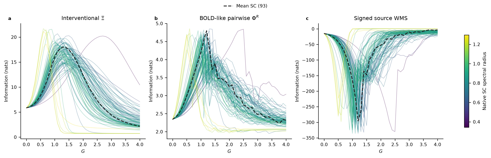

每条细线为一人的3seed均值，颜色对应原生SC谱半径；黑色虚线为平均SC独立模拟。未归一化SC、平滑或按指标峰位对齐。WMS保留原始符号。

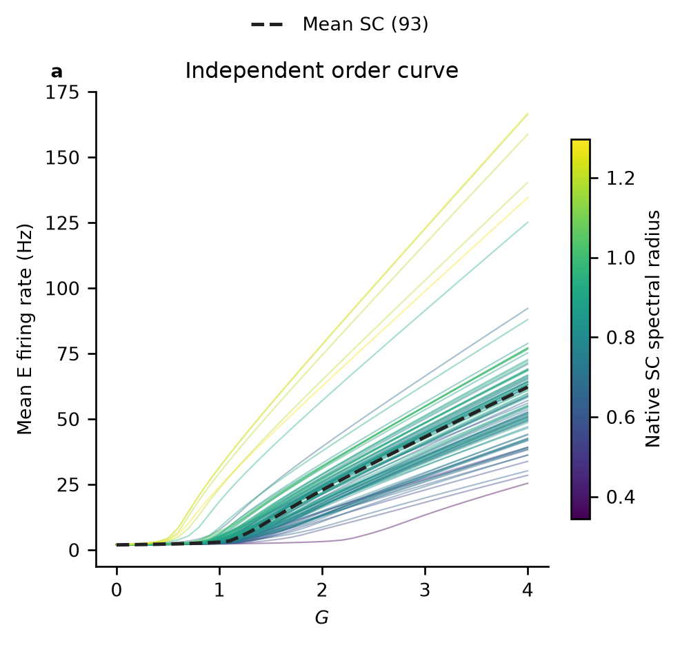

独立5s模拟最后2s的100ROI平均E发放率。每人的最大正斜率区间按原规则定位，边界最大斜率列为无法定位，而非“无相变”。

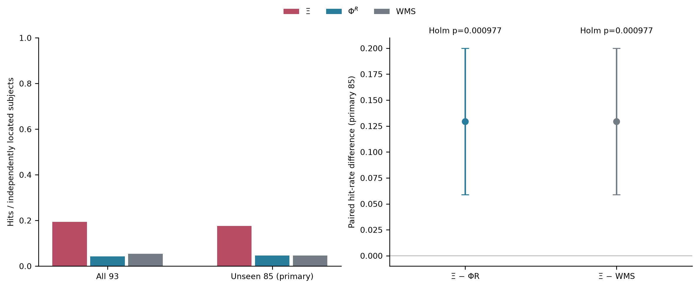

| 队列 | 指标 | 命中/可定位 | 命中率 | 到转折区间的平均距离G |
|---|---|---:|---:|---:|
| 新增85人（主要检验） | xi | 15/85 | 0.176 | 0.21882352941176472 |
| 新增85人（主要检验） | phi_r | 4/85 | 0.047 | 0.3988235294117648 |
| 新增85人（主要检验） | wms | 4/85 | 0.047 | 0.39764705882352946 |
| 全部93人（补充） | xi | 18/93 | 0.194 | 0.20967741935483872 |
| 全部93人（补充） | phi_r | 4/93 | 0.043 | 0.3860215053763442 |
| 全部93人（补充） | wms | 5/93 | 0.054 | 0.3838709677419356 |
| 已看过8人（开发） | xi | 3/8 | 0.375 | 0.11249999999999996 |
| 已看过8人（开发） | phi_r | 0/8 | 0.000 | 0.24999999999999994 |
| 已看过8人（开发） | wms | 1/8 | 0.125 | 0.23749999999999996 |

只按独立序参量决定可定位集合，三项指标共享同一分母。Ξ/ΦR取全局最大值、WMS取全局最小值；内部极值落在区间才算命中，指标边界极值和平坦曲线算未命中。区间含端点；相同极值取首格点，未按离转折最近的位置选峰。

| 队列 | 比较 | Ξ单独命中 / 基线单独命中 | 配对命中率差 | 95%配对bootstrap CI | Holm p |
|---|---|---:|---:|---:|---:|
| 新增85人（主要检验） | Ξ vs phi_r | 11 / 0 | 0.129 | [0.059, 0.200] | 0.000976562 |
| 新增85人（主要检验） | Ξ vs wms | 11 / 0 | 0.129 | [0.059, 0.200] | 0.000976562 |
| 全部93人（补充） | Ξ vs phi_r | 14 / 0 | 0.151 | [0.086, 0.226] | 0.00012207 |
| 全部93人（补充） | Ξ vs wms | 13 / 0 | 0.140 | [0.075, 0.215] | 0.00012207 |
| 已看过8人（开发） | Ξ vs phi_r | 3 / 0 | 0.375 | [0.000, 0.750] | 0.25 |
| 已看过8人（开发） | Ξ vs wms | 2 / 0 | 0.250 | [0.000, 0.625] | 0.25 |

单侧精确McNemar在不一致被试上用[二项检验](https://docs.scipy.org/doc/scipy/reference/generated/scipy.stats.binomtest.html)实现，备择是Ξ命中率更高；两项比较作[Holm校正](https://www.statsmodels.org/stable/generated/statsmodels.stats.multitest.multipletests.html)，阈值0.05。CI为按被试共同重采样10000次的双侧95%百分位区间，未作多重校正；主要成功判据以校正p值和正效应为准，不以CI筛选。seed/G/4950 ROI对不是额外独立被试。全部93人与开发8人的检验是补充结果，不替代主要85人检验。

### 逐人对照与形状

- [逐人对照第1页](assets/dmf_subject_dense/subject_order_curves_01.png)
- [逐人对照第2页](assets/dmf_subject_dense/subject_order_curves_02.png)
- [逐人对照第3页](assets/dmf_subject_dense/subject_order_curves_03.png)
- [逐人对照第4页](assets/dmf_subject_dense/subject_order_curves_04.png)
- [逐人对照第5页](assets/dmf_subject_dense/subject_order_curves_05.png)
- [逐人对照第6页](assets/dmf_subject_dense/subject_order_curves_06.png)
- [逐人对照第7页](assets/dmf_subject_dense/subject_order_curves_07.png)
- [逐人对照第8页](assets/dmf_subject_dense/subject_order_curves_08.png)
- [逐人对照第9页](assets/dmf_subject_dense/subject_order_curves_09.png)
- [逐人对照第10页](assets/dmf_subject_dense/subject_order_curves_10.png)
- [逐人对照第11页](assets/dmf_subject_dense/subject_order_curves_11.png)
- [逐人对照第12页](assets/dmf_subject_dense/subject_order_curves_12.png)

每页上部为原始Hz序参量、下部为同人各指标按跨G均值/SD转换的形状；带为3seed SD，不是CI。灰带为独立转折候选，斜线为扫描边界。没有翻转WMS或插值。完整逐人极值、距离、U/Q、prominence敏感性和逐seed端点保存在[分析汇总](../../results/dmf_schaefer100/subject_curves_93_dense/summary.json)。形状描述继续采用[开发阶段固定定义](brain.md#dmf-subject-curves)：U测额外反向变化、Q测归一化相邻斜率总变差；陡峭单峰也可有较高Q。

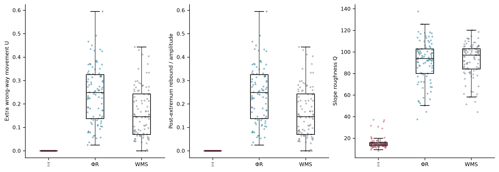

散点是93个人的3seed平均曲线，箱线表示四分位分布；平坦曲线的形状分数未定义并单列。WMS只在形状诊断中取负，以比较单谷对应的峰前/峰后方向。

| 队列 | 指标 | U≈0 / 非平坦人数 | 平均U | 平均峰后回摆 | 平均Q | >1个明显内部峰人数 |
|---|---|---:|---:|---:|---:|---:|
| 新增85人（主要检验） | xi | 82/85 | 1.78e-07 | 1.78e-07 | 15.51 | 0 |
| 新增85人（主要检验） | phi_r | 0/85 | 0.2453 | 0.2453 | 91.63 | 72 |
| 新增85人（主要检验） | wms | 0/85 | 0.168 | 0.168 | 93.24 | 55 |
| 全部93人（补充） | xi | 89/93 | 3.551e-07 | 3.551e-07 | 15.68 | 0 |
| 全部93人（补充） | phi_r | 0/93 | 0.2413 | 0.2413 | 91.19 | 78 |
| 全部93人（补充） | wms | 0/93 | 0.1621 | 0.1621 | 92.5 | 58 |
| 已看过8人（开发） | xi | 7/8 | 2.236e-06 | 2.236e-06 | 17.54 | 0 |
| 已看过8人（开发） | phi_r | 0/8 | 0.199 | 0.199 | 86.44 | 6 |
| 已看过8人（开发） | wms | 0/8 | 0.09889 | 0.09889 | 84.6 | 3 |

U为全局峰前下降量加峰后回升量，除以全曲线幅度；峰后回摆单独保留。U≈0的相对容差为10⁻¹⁰，并不要求出现内部峰，边界单调曲线也可U=0。明显峰采用幅度5%的prominence，同时保存0%、1%、5%敏感性；该阈值不改变主要命中判断。Q为G和纵轴幅度归一化后相邻斜率的总变差，没有事后正确/错误阈值。均值和逐seed形状均保留，平均可能掩盖seed波动。

### 计算成本与复杂度

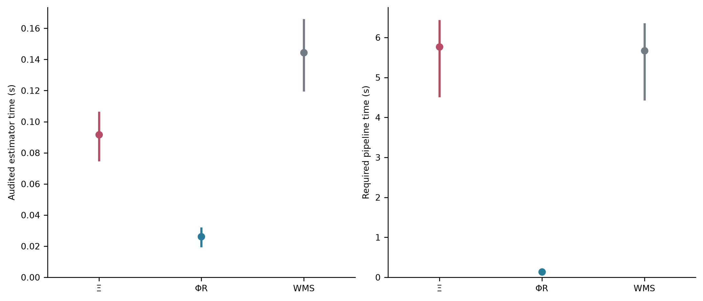

点为新计算条件的平均墙钟时间，竖线为条件耗时的10–90百分位，不是置信区间。每个条件是一人、一个G、一个seed；4进程并行、每进程BLAS单线程。共11271个个体条件、93人进入计时，排除168个复用条件和平均SC。缓存读取不当作估计器耗时。下表单位秒，同时记录每进程CPU时间以区分并行竞争。

| 指标 | 估计均值：墙钟 | 估计均值：CPU | 必需流程均值：墙钟 | 必需流程均值：CPU |
|---|---:|---:|---:|---:|
| xi | 0.091631 | 0.079504 | 5.7693 | 4.9932 |
| phi_r | 0.026203 | 0.022646 | 0.13307 | 0.11536 |
| wms | 0.1444 | 0.12584 | 5.6737 | 4.9129 |

估计耗时包含各自原生数值审计，Ξ还包括affine-TM拟合与密度查询；ΦR含pairwise MMI与特征值审计；WMS含标准化、原Gaussian拟合和审计。完整流程为估计加必需样本准备：Ξ的干预未来批次、ΦR的自然轨迹/BOLD转换、WMS的自然轨迹/未来批次。两基线共享的自然轨迹平均0.075231秒，分别列入依赖成本，因此不能将两项完整流程均值相加来估计总运行时间；独立序参量诊断平均0.44634秒单列，不归入某项指标。初始化、共享均匀源生成、输入/缓存读写和最终绘图不进入这些计时。开发8人的原粗格点复用，故计时覆盖不同；汇总同时给出等被试权重均值、条件中位数、SD及10–90百分位。此处均值为条件权重，固定100ROI维度的实测不用于拟合渐近指数。

复杂度按当前实现分析。令R为ROI数，d=2R为源/未来状态维数，N为未来样本数，T为自然轨迹长度，H为未来积分步数。在相同源/未来维数、稠密SC下，Ξ的affine-TM拟合与查询为O(Nd²+d³)；原生WMS为O(Nd²+d³)，其标量循环复用一个逆矩阵，采用秩一行列式更新，并非每标量重做完整逆。ΦR为O(TR²+R²)，来自滞后协方差及全部ROI对的固定小矩阵运算。Ξ/WMS各自的未来批次为O(HNR²)，共享自然轨迹为O(TR²)、BOLD转换为O(TR)，独立诊断为O(LR²)、L=5000。未来批次与密度的主要工作内存为O(Nd+d²)，自然轨迹另占O(TR)。这些是当前代码的主要阶数，常数、稀疏实现和不同估计协议会影响实际成本。

### 单独的EI分解

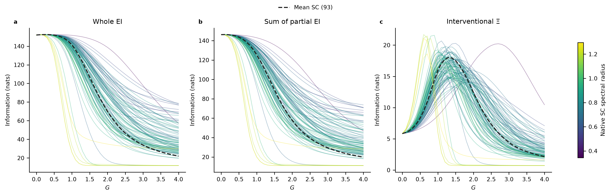

这三项按同一200标量源、同一完整200维未来、同一affine-TM密度计算，Ξ=整体EI−部分EI之和。whole EI不进入基线比较。

### 估计与边界

沿用2048个[0.3,0.7]因子化干预、300ms未来、固定JFIC及共同affine-TM Gaussian近似。Ξ非负容差10⁻⁸ nats，未投影；数值负值计数0，全量分解最大闭合误差0 nats。ΦR保留1.5s自然轨迹的BOLD-like转换、1ms延迟及原生特征值下限；WMS保留自然完整E/I状态、有放回抽2048次的相关源先验及原ridge。ΦR/WMS轨迹短与正则化限制解释，增加被试和G点不能自动解决估计器偏差。原生ΦR下限触发总数1751549；WMS下限触发0；最少不同自然采样时间点100。没有独立确认无转变对照，虚假峰率未定义。失败、边界和不利结果均保留，细扫描不保证Ξ获胜。

本任务重新读取Zotero父条目P6UJCVG8、唯一正文附件DXGC7JEA，*Emergent hierarchical organization of causal interactions in complex systems*，19页，Brain/Fig.2及Methods式（5）、（7）、（8）。稿件没有明确版本日期，补充附录不可用。正文把两观测基线写为BOLD-like，仓库原生WMS实际是完整E/I状态；这里保留原生协议并记录差别。

[固定执行与分析协议](../log/dmf_subject_dense_protocol.md)。计算支持断点复用，原8人结果保留在独立目录。

<!-- dense-resolution-review:start -->
### 分辨率敏感性：粗定位、区间合并与边界起点

本节是看过0.1结果后、由用户明确要求的事后分析。没有新增模拟、改估计器、改干预或选择被试；原始summary/completed/contract保持不变。计算前将全部方案记入[分辨率分析计划](../../results/dmf_schaefer100/subject_curves_93_dense/resolution_plan.json)。宽度为0.1、0.2、0.4、0.5、0.8、1.0：这些是原生0.1网格中能整除0–4扫描范围且保留至少5个节点的全部整数步长。每项均先平均同人的3seed，再找极值。

**重算粗网格：** 从G=0开始保留已有观测格点，重新以独立序参量最大正斜率定位区间，并在相同粗格点寻找Ξ/ΦR全局峰和WMS全局谷。没有插值、平滑或移动待比较指标峰去迎合转折。**仅合并区间：** 保留细网格的独立转折和精确极值，把包含该独立转折的相邻0.1区间按共同G=0起点合并；三项使用完全相同的新区间。因此第二项只改变容许分辨率，第一项还包含粗采样对峰位和最大斜率的量化。

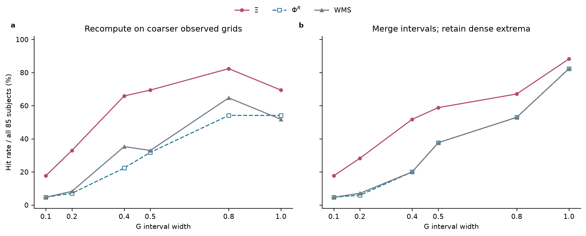

图中为主要85人的命中率；两种分析的全部宽度均能定位全部85人，所以主要检验的固定队列分母与条件于可定位者的分母一致。全部93人的补充中，仅重算1.0粗网格有1人转折落在边界、92人可定位；表中其补充命中人数仍以固定93人为队列，另存条件于92人的命中率。其他档位全部93人可定位。无法定位不写成无相变。0.1行保留原两项Holm校正；其余行对5宽度×2处理×2基线共20项主要85人比较一起作Holm校正。全部93人是补充描述，不再用其p值宣称独立验证。

| 处理 | 宽度G | Ξ：主要85人 | ΦR：主要85人 | WMS：主要85人 | 对ΦR的Holm p | 对WMS的Holm p | 全部93人命中数：Ξ / ΦR / WMS |
|---|---:|---:|---:|---:|---:|---:|---:|
| 重算粗网格 | 0.1 | 15/85（17.6%） | 4/85（4.7%） | 4/85（4.7%） | 0.0009766 | 0.0009766 | 18 / 4 / 5 |
| 重算粗网格 | 0.2 | 28/85（32.9%） | 6/85（7.1%） | 7/85（8.2%） | 3.576e-06 | 3.147e-05 | 31 / 7 / 8 |
| 重算粗网格 | 0.4 | 56/85（65.9%） | 19/85（22.4%） | 30/85（35.3%） | 3.021e-08 | 1.789e-05 | 63 / 22 / 33 |
| 重算粗网格 | 0.5 | 59/85（69.4%） | 27/85（31.8%） | 28/85（32.9%） | 3.871e-08 | 7.125e-08 | 65 / 31 / 33 |
| 重算粗网格 | 0.8 | 70/85（82.4%） | 46/85（54.1%） | 55/85（64.7%） | 1.971e-05 | 0.001221 | 76 / 49 / 59 |
| 重算粗网格 | 1 | 59/85（69.4%） | 46/85（54.1%） | 44/85（51.8%） | 0.0007324 | 0.0002136 | 64 / 51 / 48 |
| 仅合并区间 | 0.1 | 15/85（17.6%） | 4/85（4.7%） | 4/85（4.7%） | 0.0009766 | 0.0009766 | 18 / 4 / 5 |
| 仅合并区间 | 0.2 | 24/85（28.2%） | 5/85（5.9%） | 6/85（7.1%） | 2.289e-05 | 3.815e-05 | 28 / 6 / 8 |
| 仅合并区间 | 0.4 | 44/85（51.8%） | 17/85（20.0%） | 17/85（20.0%） | 1.267e-07 | 1.267e-07 | 49 / 20 / 21 |
| 仅合并区间 | 0.5 | 50/85（58.8%） | 32/85（37.6%） | 32/85（37.6%） | 3.815e-05 | 3.815e-05 | 56 / 38 / 38 |
| 仅合并区间 | 0.8 | 57/85（67.1%） | 45/85（52.9%） | 45/85（52.9%） | 0.001221 | 0.001221 | 64 / 52 / 52 |
| 仅合并区间 | 1 | 75/85（88.2%） | 70/85（82.4%） | 70/85（82.4%） | 0.0625 | 0.0625 | 83 / 78 / 78 |

命中率**并非越粗越高**。例如重算粗网格从0.8到1.0，Ξ由82.4%降至69.4%，WMS由64.7%降至51.8%；最大斜率区间及极值格点都可能变化。仅合并区间到1.0时，Ξ为88.2%，两基线均为82.4%，配对优势仅5/85，20项校正p=0.0625，**高绝对命中率没有保留显著差异**。到0.5，重算粗网格Ξ为69.4%、两基线31.8%/32.9%，跨20项校正仍显著；到0.8则为82.4%、54.1%/64.7%。所有宽度一起显示，不按最高命中率挑选唯一“正确”尺度。

共同区间起点会影响仅合并结果。下表遍历每个宽度的所有0.1格点起点偏移，保留完整原扫描支持，并给出命中人数范围；范围内每个点均来自同一93人缓存。这里只报告起点敏感性，不根据起点的显著性选值，也不对这些界限给出新的确认性p值。

| 宽度G | Ξ主要85人：各起点范围 | ΦR主要85人 | WMS主要85人 |
|---|---:|---:|---:|
| 0.2 | 24–28 / 85 | 5–11 / 85 | 6–11 / 85 |
| 0.4 | 41–48 / 85 | 17–21 / 85 | 17–21 / 85 |
| 0.5 | 47–53 / 85 | 22–32 / 85 | 22–32 / 85 |
| 0.8 | 55–71 / 85 | 29–58 / 85 | 30–58 / 85 |
| 1 | 57–77 / 85 | 32–70 / 85 | 33–70 / 85 |

原8人粗网格G=[0,0.5,1,1.3,1.6,2.2,3]也已在同一完整缓存上复现：7人可定位，Ξ5/7（71.4%）、两基线各2/7（28.6%）；将边界无法定位者保留在全部8人分母则为5/8、2/8、2/8。该小样本当时的两项Holm p=0.25，不能把高点估计当作已确立的显著优势。细扫描既缩窄区间，也将支持扩到4；两批命中率差不能只归因于分辨率或只归因于新增被试。

### 全量EI分解的补充解释

视觉上的总体下降并非严格全域单调。以每相邻G步增加超过10⁻⁸ nats计，whole EI有93/93人出现增加，最大单步0.472 nats；部分EI之和有91/93人出现增加，最大单步0.093 nats。主要是低G的轻微上升，另有4人在高G低信息尾部出现小幅回升；从G≥0.5开始，两分量各89/93人均不再上升。没有为了呈现单调而平滑或投影。

在实际有限格点上逐步验证ΔΞ=Δwhole EI−Δ部分EI之和，最大误差6.8e-14 nats。在两分量同时下降的区段，部分EI之和下降更快时差值Ξ上升；whole EI下降更快时Ξ下降。因此峰来自两项变化速度的交替，而不是whole EI本身必须有峰。此差值恒等式解释当前共同affine-TM估计中的峰，不单独证明相变机制。

### 完成证据与方法边界

11562个缓存全部通过有限性、状态支持、Ξ非负容差10⁻⁸ nats及EI闭合审计，原18张PNG与完成记录的哈希一致，已逐页检查图例位于数据外。原主分析脚本在运行期间随文档归并发生4处展示变化（报告路径、章节写入函数、导入和链接）；将这4处恢复后的源文本SHA256与冻结脚本完全相同，科学分析逻辑未改。完成时的brain.md哈希也与completed.json匹配；本节后续编辑另存[最终审核](../../results/dmf_schaefer100/subject_curves_93_dense/final_review.json)，不覆盖原完成证据。每小时临时检查已删除。

稿件核对沿用本任务新读取的P6UJCVG8/DXGC7JEA正文、Methods式（5）（7）（8）及Brain/Fig.2；版本日期和补充附录仍无法确定。当前“命中”是对应固定DMF发放率最大变化区间，既非独立生物相变真值，也非“无相变不报峰”的检验。尚无确认无转变对照；高命中与低回摆不足以证明普遍相变识别能力。

完整逐人、逐宽度、起点和配对结果：[事后分析汇总](../../results/dmf_schaefer100/subject_curves_93_dense/resolution_summary.json)。重现本节：`.venv/bin/python -m scripts.analyze_dmf_subject_dense_resolution`。高成本模拟无需重跑。
<!-- dense-resolution-review:end -->

<!-- dense-window-review:start -->
<a id="dmf-subject-window"></a>

### 固定细网格上的对称窗口敏感性（2026-10-04）

**最小合格窗口为左右各扩2格，即各放宽0.2 G，总宽度0.5 G。** 保留全部0.1格点和原峰位，主要85人Ξ为58/85（68.2%），ΦR/WMS各25/85（29.4%）。两项配对优势各38.8个百分点，40检验Holm p均为4.657e-09。

该窗口两项比较的Ξ单独命中/基线单独命中均为33/0，共命中25人、共未命中27人；单侧精确McNemar p=1.164e-10。配对增幅的描述性95%bootstrap区间均为[28.2, 49.4]个百分点，**未作多重或窗口选择校正**。全部93人Ξ为65/93（69.9%），两基线各28/93（30.1%）；开发8人分别7/8、3/8、3/8。后两队列仅补充描述，不能作为另一次独立验证。最小窗口无边界截断，总宽是原0.1区间的5倍、扫描域的12.5%；主要85人的窗口/转折中点比值中位数为32.3%（范围16.9%–76.9%）。因此‘附近命中’没有恢复成0.1精确定位。

用户在观察前次分辨率结果后提出本分析，并要求2026-10-04 06:00北京时间一次性实施。计算前记录[完整计划](../../results/dmf_schaefer100/subject_curves_93_dense/window_plan.json)：k=0–20的全部整数，三项共用同一独立转折窗口。对原最大正斜率区间[L,U]，窗口为[max(0,L−0.1k),min(4,U+0.1k)]；名义宽度0.1(1+2k)，真实宽度和截断人数单独保存。峰位、三seed平均、平坦/边界分类、原区间和0.1采样均冻结，含端点时采用原10⁻¹² G浮点容差。ΦR取全局峰，WMS取保留符号的全局谷。未重算模拟或估计器；没有平滑、插值、粗采样或按指标决定窗口。

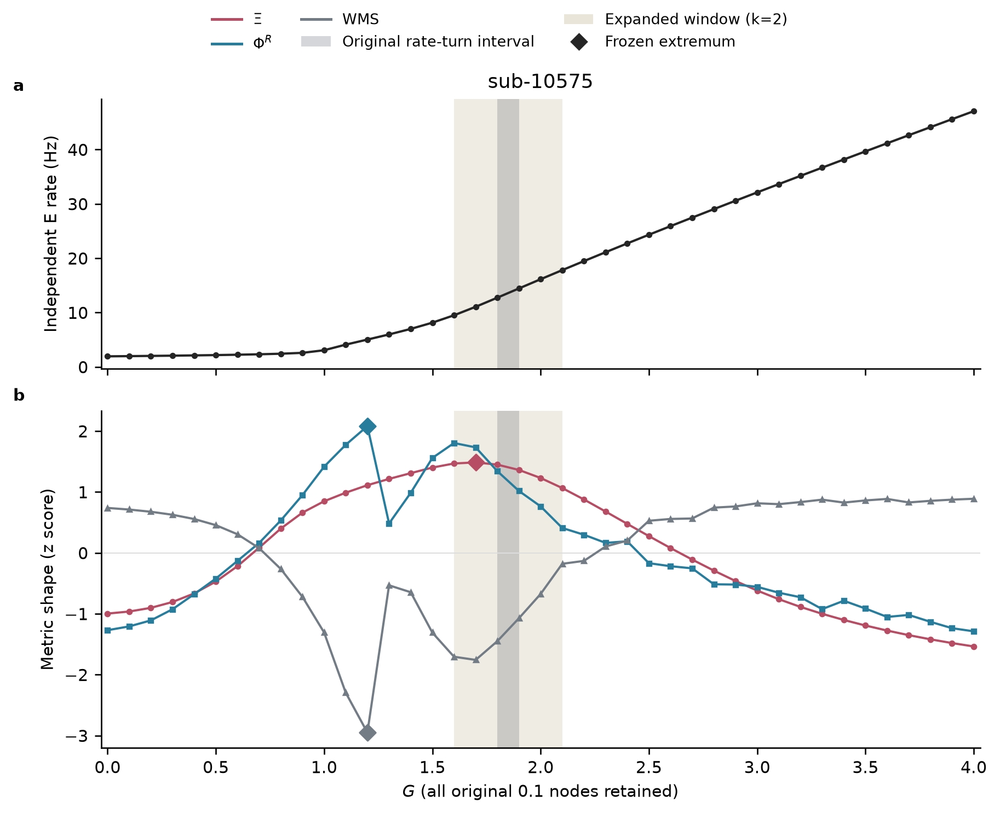

**窗口示意。** 个体按冻结93人顺序的中间索引选定（sub-10575），没有按命中选择案例。上为独立发放率，下为三指标跨G的z score，仅作形状显示，保留WMS符号。全部41个0.1节点保留；菱形为原极值，灰带为原最大斜率区间，浅色带为k=2的扩充窗口。背景宽度为容许范围，不是估计不确定性。缓存重建的原转折与极值逐项吻合冻结结果。

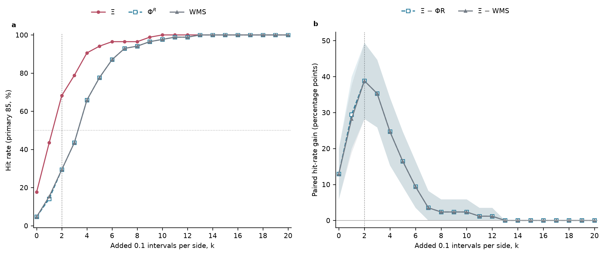

**全部预定窗口。** 左为主要85人命中率，50%横线及最小合格k的竖线只标示选择规则；右为Ξ减去各基线的配对百分点差及未校正95%被试共同bootstrap区间。覆盖21个k，未删除大窗口饱和结果。三指标命中集合逐人嵌套，命中率全部单调不降；配对优势和显著性不具有这一单调性。两基线在k≥2的命中数和配对差相等，蓝色空方块与灰色三角用于显示重合，而非删去一条曲线。

#### 全部窗口命中与宽度代价

主要分母始终85；全部93人及开发8人的成员也固定。原始0.1独立转折在93人均可定位，本次没有重新定位，所有k无新增排除。表中的Holm两值依次对ΦR、WMS；k=0沿用原两项校正，k≥1的40项检验一起校正。

| 每侧扩k格 | 名义宽度G | Ξ主要85人 | ΦR主要85人 | WMS主要85人 | Holm p：ΦR / WMS | 全93人命中：Ξ / ΦR / WMS | 截断人数：85 / 93 |
|---|---:|---:|---:|---:|---:|---:|---:|
| 0 | 0.1 | 15/85（17.6%） | 4/85（4.7%） | 4/85（4.7%） | 0.0009766 / 0.0009766 | 18 / 4 / 5 | 0 / 0 |
| 1 | 0.3 | 37/85（43.5%） | 12/85（14.1%） | 13/85（15.3%） | 1.073e-06 / 2.086e-06 | 43 / 15 / 16 | 0 / 0 |
| 2 | 0.5 | 58/85（68.2%） | 25/85（29.4%） | 25/85（29.4%） | 4.657e-09 / 4.657e-09 | 65 / 28 / 28 | 0 / 0 |
| 3 | 0.7 | 67/85（78.8%） | 37/85（43.5%） | 37/85（43.5%） | 3.539e-08 / 3.539e-08 | 74 / 44 / 44 | 0 / 0 |
| 4 | 0.9 | 77/85（90.6%） | 56/85（65.9%） | 56/85（65.9%） | 1.621e-05 / 1.621e-05 | 85 / 63 / 63 | 0 / 0 |
| 5 | 1.1 | 80/85（94.1%） | 66/85（77.6%） | 66/85（77.6%） | 0.001953 / 0.001953 | 88 / 74 / 74 | 0 / 0 |
| 6 | 1.3 | 82/85（96.5%） | 74/85（87.1%） | 74/85（87.1%） | 0.1172 / 0.1172 | 90 / 82 / 82 | 0 / 0 |
| 7 | 1.5 | 82/85（96.5%） | 79/85（92.9%） | 79/85（92.9%） | 1 / 1 | 90 / 87 / 87 | 2 / 3 |
| 8 | 1.7 | 82/85（96.5%） | 80/85（94.1%） | 80/85（94.1%） | 1 / 1 | 90 / 88 / 88 | 3 / 4 |
| 9 | 1.9 | 84/85（98.8%） | 82/85（96.5%） | 82/85（96.5%） | 1 / 1 | 92 / 90 / 90 | 5 / 6 |
| 10 | 2.1 | 85/85（100.0%） | 83/85（97.6%） | 83/85（97.6%） | 1 / 1 | 93 / 91 / 91 | 5 / 6 |
| 11 | 2.3 | 85/85（100.0%） | 84/85（98.8%） | 84/85（98.8%） | 1 / 1 | 93 / 92 / 92 | 9 / 10 |
| 12 | 2.5 | 85/85（100.0%） | 84/85（98.8%） | 84/85（98.8%） | 1 / 1 | 93 / 92 / 92 | 11 / 14 |
| 13 | 2.7 | 85/85（100.0%） | 85/85（100.0%） | 85/85（100.0%） | 1 / 1 | 93 / 93 / 93 | 16 / 20 |
| 14 | 2.9 | 85/85（100.0%） | 85/85（100.0%） | 85/85（100.0%） | 1 / 1 | 93 / 93 / 93 | 23 / 28 |
| 15 | 3.1 | 85/85（100.0%） | 85/85（100.0%） | 85/85（100.0%） | 1 / 1 | 93 / 93 / 93 | 36 / 42 |
| 16 | 3.3 | 85/85（100.0%） | 85/85（100.0%） | 85/85（100.0%） | 1 / 1 | 93 / 93 / 93 | 49 / 56 |
| 17 | 3.5 | 85/85（100.0%） | 85/85（100.0%） | 85/85（100.0%） | 1 / 1 | 93 / 93 / 93 | 57 / 65 |
| 18 | 3.7 | 85/85（100.0%） | 85/85（100.0%） | 85/85（100.0%） | 1 / 1 | 93 / 93 / 93 | 67 / 75 |
| 19 | 3.9 | 85/85（100.0%） | 85/85（100.0%） | 85/85（100.0%） | 1 / 1 | 93 / 93 / 93 | 77 / 85 |
| 20 | 4.1 | 85/85（100.0%） | 85/85（100.0%） | 85/85（100.0%） | 1 / 1 | 93 / 93 / 93 | 85 / 93 |

满足两项条件的k为[2, 3, 4, 5]，最小为2。k=1的Ξ为37/85（43.5%），还未超过50%；k=2为68.2%。k=3、4、5时Ξ分别78.8%、90.6%、94.1%，但名义宽度也分别增加到0.7、0.9、1.1，配对增幅从35.3个百分点降至24.7、16.5个百分点。k=6时Ξ96.5%、两基线87.1%，校正p=0.1172，不再显著。k=13起三项在85人及93人均100%命中、差值为0：过宽窗口会机械地覆盖所有极值，不能将这种饱和当作定位能力。

端点截断从全93人k=7开始出现；主要85人同档2人被截断。所有人的真实上下界、真实宽度、单侧截断以及窗口相对独立转折中点的比例保存在汇总中。名义宽度到4.1并不表示每人的真实窗口覆盖整个扫描域；不能以名义宽度代替裁切后的个人宽度。

#### 全部配对效应与不确定性

同一被试为独立比较单位；G点、seed和ROI对不增加被试数。沿用单侧精确McNemar（不一致对子上的二项检验），备择是Ξ命中概率高于基线。新家族共20个k×2基线=40项，统一Holm控制，阈值0.05。95%CI为每档同人共同重采样10000次、seed20261003的双侧百分位区间，仅作描述；未做同时覆盖或最小合格窗口选择校正。CI不能代替40项校正p值判断显著性。“高很多”没有另造效果量阈值，实际配对百分点差及CI全部给出。

| k | 比较 | 配对增幅（百分点） | 描述性95%CI（未校正） | Ξ单独 / 基线单独命中 | 单侧精确p | Holm p |
|---|---|---:|---:|---:|---:|---:|
| 0 | Ξ−ΦR | 12.9 | [5.9, 20.0] | 11 / 0 | 0.0004883 | 0.0009766 |
| 0 | Ξ−WMS | 12.9 | [5.9, 20.0] | 11 / 0 | 0.0004883 | 0.0009766 |
| 1 | Ξ−ΦR | 29.4 | [20.0, 40.0] | 25 / 0 | 2.98e-08 | 1.073e-06 |
| 1 | Ξ−WMS | 28.2 | [18.8, 37.6] | 24 / 0 | 5.96e-08 | 2.086e-06 |
| 2 | Ξ−ΦR | 38.8 | [28.2, 49.4] | 33 / 0 | 1.164e-10 | 4.657e-09 |
| 2 | Ξ−WMS | 38.8 | [28.2, 49.4] | 33 / 0 | 1.164e-10 | 4.657e-09 |
| 3 | Ξ−ΦR | 35.3 | [25.9, 44.7] | 30 / 0 | 9.313e-10 | 3.539e-08 |
| 3 | Ξ−WMS | 35.3 | [25.9, 44.7] | 30 / 0 | 9.313e-10 | 3.539e-08 |
| 4 | Ξ−ΦR | 24.7 | [15.3, 34.1] | 21 / 0 | 4.768e-07 | 1.621e-05 |
| 4 | Ξ−WMS | 24.7 | [15.3, 34.1] | 21 / 0 | 4.768e-07 | 1.621e-05 |
| 5 | Ξ−ΦR | 16.5 | [9.4, 24.7] | 14 / 0 | 6.104e-05 | 0.001953 |
| 5 | Ξ−WMS | 16.5 | [9.4, 24.7] | 14 / 0 | 6.104e-05 | 0.001953 |
| 6 | Ξ−ΦR | 9.4 | [3.5, 16.5] | 8 / 0 | 0.003906 | 0.1172 |
| 6 | Ξ−WMS | 9.4 | [3.5, 16.5] | 8 / 0 | 0.003906 | 0.1172 |
| 7 | Ξ−ΦR | 3.5 | [0.0, 8.2] | 3 / 0 | 0.125 | 1 |
| 7 | Ξ−WMS | 3.5 | [0.0, 8.2] | 3 / 0 | 0.125 | 1 |
| 8 | Ξ−ΦR | 2.4 | [0.0, 5.9] | 2 / 0 | 0.25 | 1 |
| 8 | Ξ−WMS | 2.4 | [0.0, 5.9] | 2 / 0 | 0.25 | 1 |
| 9 | Ξ−ΦR | 2.4 | [0.0, 5.9] | 2 / 0 | 0.25 | 1 |
| 9 | Ξ−WMS | 2.4 | [0.0, 5.9] | 2 / 0 | 0.25 | 1 |
| 10 | Ξ−ΦR | 2.4 | [0.0, 5.9] | 2 / 0 | 0.25 | 1 |
| 10 | Ξ−WMS | 2.4 | [0.0, 5.9] | 2 / 0 | 0.25 | 1 |
| 11 | Ξ−ΦR | 1.2 | [0.0, 3.5] | 1 / 0 | 0.5 | 1 |
| 11 | Ξ−WMS | 1.2 | [0.0, 3.5] | 1 / 0 | 0.5 | 1 |
| 12 | Ξ−ΦR | 1.2 | [0.0, 3.5] | 1 / 0 | 0.5 | 1 |
| 12 | Ξ−WMS | 1.2 | [0.0, 3.5] | 1 / 0 | 0.5 | 1 |
| 13 | Ξ−ΦR | 0.0 | [0.0, 0.0] | 0 / 0 | 1 | 1 |
| 13 | Ξ−WMS | 0.0 | [0.0, 0.0] | 0 / 0 | 1 | 1 |
| 14 | Ξ−ΦR | 0.0 | [0.0, 0.0] | 0 / 0 | 1 | 1 |
| 14 | Ξ−WMS | 0.0 | [0.0, 0.0] | 0 / 0 | 1 | 1 |
| 15 | Ξ−ΦR | 0.0 | [0.0, 0.0] | 0 / 0 | 1 | 1 |
| 15 | Ξ−WMS | 0.0 | [0.0, 0.0] | 0 / 0 | 1 | 1 |
| 16 | Ξ−ΦR | 0.0 | [0.0, 0.0] | 0 / 0 | 1 | 1 |
| 16 | Ξ−WMS | 0.0 | [0.0, 0.0] | 0 / 0 | 1 | 1 |
| 17 | Ξ−ΦR | 0.0 | [0.0, 0.0] | 0 / 0 | 1 | 1 |
| 17 | Ξ−WMS | 0.0 | [0.0, 0.0] | 0 / 0 | 1 | 1 |
| 18 | Ξ−ΦR | 0.0 | [0.0, 0.0] | 0 / 0 | 1 | 1 |
| 18 | Ξ−WMS | 0.0 | [0.0, 0.0] | 0 / 0 | 1 | 1 |
| 19 | Ξ−ΦR | 0.0 | [0.0, 0.0] | 0 / 0 | 1 | 1 |
| 19 | Ξ−WMS | 0.0 | [0.0, 0.0] | 0 / 0 | 1 | 1 |
| 20 | Ξ−ΦR | 0.0 | [0.0, 0.0] | 0 / 0 | 1 | 1 |
| 20 | Ξ−WMS | 0.0 | [0.0, 0.0] | 0 / 0 | 1 | 1 |

原k=0不仅复现主要85人15/85、4/85、4/85，还逐项复现全部93人与开发8人的命中、配对列联数、原bootstrap CI及原精确p。检查了每人的窗口包含关系、命中集合单调性、峰位/内部极值/平坦标签不变及固定分母。原summary.json、completed.json、contract.json与前次分辨率计划/汇总哈希均未变化；没有读取11,562个条件文件或追加模拟。仅用于示意的已提取曲线缓存约0.6MB。

#### 解释边界与来源

窗口宽度是在已经看过结果的同一队列上选择，40项校正控制本次声明家族的错误率，但不把该选择变成独立验证；选中窗口处的描述性CI也不是选择校正区间。此结果支持当前固定SC＋DMF和原生估计协议下，Ξ极值更接近各人的独立发放率转折，并以每侧0.2 G容许范围满足样本命中率超过50%。尚无独立确认无转变对照，不能据此证明真实相变点、无相变不报峰、一般生物学相变识别能力或未见队列性能。对不同人的相对转折尺度，固定0.5窗口并非同样严格。

本次重新通过Zotero核实父条目P6UJCVG8的标题和附件；唯一索引正文为DXGC7JEA、19页，读了Brain/Fig.2及Methods式（5）、（7）、（8）。无明确稿件日期/版本，条目元数据版本5375不当作稿件版本；补充附录仍不可用。沿用同一因子化干预、全200维未来、300ms和共同affine-TM密度定义，Ξ非负容差仍10⁻⁸ nats，无数值投影。保留已记录差异：正文把两观测基线称为BOLD-like，原生WMS实际用完整E/I自然状态；本任务不变更估计器。

[全量窗口与逐人结果](../../results/dmf_schaefer100/subject_curves_93_dense/window_summary.json) · [完成审核](../../results/dmf_schaefer100/subject_curves_93_dense/window_review.json)。重现：`.venv/bin/python -m scripts.analyze_dmf_subject_dense_windows`。
<!-- dense-window-review:end -->

</details>
<!-- dense-fixed-archive:end -->
<!-- report-section:dmf-subject-dense:end -->

<a id="appendix-q"></a>

## 附录 Q：整合峰的 EI 分量与群体平均 SC 扫描

<a id="dmf-phi"></a>

<!-- dense-ei-view:start -->
<a id="dmf-subject-ei-dense"></a>

### Q.1 93人细扫描：两个EI分量的下降速度形成整合峰

识别比较之后，进一步考察Ξ的代数来源。在同一93人、G步长0.1和三seed协议下，分别展示whole EI、部分EI之和与Ξ；whole EI和部分EI之和不进入前面的三指标命中比较。

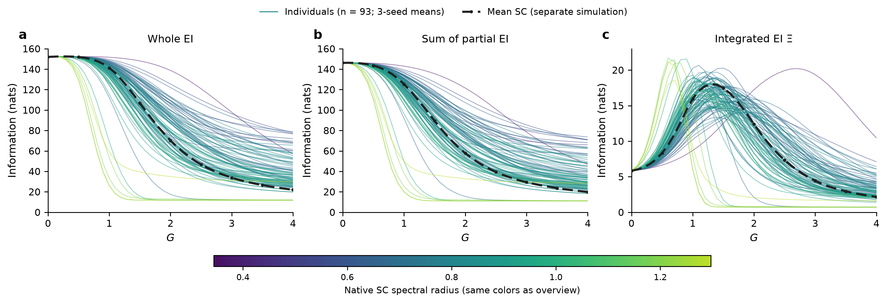

**图 Q1｜联合读取与单变量读取。** 每条细线为一个体三seed均值，颜色与识别总览图一致，黑色虚线为平均SC独立模拟。两分量满足 **Ξ=whole EI−部分EI之和**。前两幅共用0–160 nats范围，Ξ单列0–23 nats；保留低G及个别回摆，不将两分量概括为全域严格单调。

部分EI之和下降更快时，差值Ξ增大；整体EI下降更快时，Ξ回落。峰值因而来自联合信息相对单变量信息的变化，不需要whole EI本身上升。当前共同affine-TM近似使用完整200维未来、同一干预和300ms时距，EI分解闭合检查通过。与下文八seed的早期经验Gaussian结果分开报告，不合并不同估计协议或bits/nats单位。
<!-- dense-ei-view:end -->

<a id="dmf-group-scan"></a>

### Q.2 群体平均 SC 的八 seed 早期结果

**$\Xi$ 先升后降，而平均发放率持续上升。** $\Xi$ 从 $G=0$ 的 $8.452\pm0.102$ bits 增至 $G=1.3$ 的 $26.131\pm0.163$ bits，再降至 $G=3.0$ 的 $6.302\pm0.038$ bits；误差均为跨八个 seed 的 SD。峰前增幅为 17.679 bits（209.17%），8/8 个 seed 的峰位一致。平均发放率则从 1.952 Hz 升至 43.123 Hz，最大离散导数位于 $G=1.5$。

| $G$ | whole EI / bits | 单变量 EI 之和 / bits | 整体 $\Xi$ / bits |
|---|---:|---:|---:|
| 0.0 | 219.636 | 211.184 | 8.452 |
| 1.3 | 176.926 | 150.795 | 26.131 |
| 3.0 | 48.746 | 42.444 | 6.302 |

从 $G=0$ 到 1.3，whole EI 下降 42.709 bits，单变量 EI 之和下降得更多（60.388 bits），两者差值增加 17.679 bits。峰值因此表示未来信息更依赖联合读取。高耦合端两项均大幅下降，联合优势随之回落。

在 $G=1.3$，$\Xi$ 的 SD 为 0.163 bits，仅占均值的 0.62%；whole EI 和单变量 EI 之和的 SD 分别为 0.252、0.287 bits，变异系数为 0.14%、0.19%。seed 波动相对曲线幅度较小。以该峰为中心选取 $G\in\{1.2,1.3,1.4\}$ 作后续归因，三点均值依次为 25.617、26.131、25.887 bits。该窗口由完整扫描结果选定，属于峰值邻近窗，不是独立预注册的临界性检验；$G=1.5$ 仅作为发放率转折参照。

同模型的两项观察性指标提供形状对照。$\Phi^{WMS}$ 从 −21.433 bits 降至 $G=1.3$ 的 −502.591 bits，在 $G=1.4$ 跳回 −189.520 bits，呈现发放率转折附近的折点；其绝对值受 Gaussian 条件协方差和 ridge 影响。pairwise BOLD-like $\Phi^R$ 从 $3.631\pm0.159$ bits 升至 $G=1.2$ 的 $6.906\pm0.095$ bits，随后回落；四个 seed 在 1.2 达峰，另四个在 1.3 达峰。在 1.3，其均值为 6.324 bits、SD 为 1.249 bits，较大波动来自两个 seed 的提前回落。

$\Phi^R$ 与 $\Xi$ 因而支持 **$G=1.2$–1.3 的共同峰带**。二者都早于发放率最大变化点，却具有不同的 observable、维度、干预口径和预测时距；这里的对齐只构成同模型内的交叉指标一致性。


历史图版及其指标差异见[附录 A.5](#appendix-a-5)。

*图 Q2｜系统扫描、无先验 SPT、固定网络归因与 ROI Shapley。<span style="color: red;">绝对信息量以 nats 显示；b 的节点数值及色标、c/d 的柱长均为占全系统整体 $\Xi$ 的百分比。c 和 d 分别标为 Within-network 与 Between-network，使用相同的 0–15% 横轴；两图全部柱子的均值合计为 100%。</span>*

- **a，系统扫描：** 上部为平均发放率与 full-state interventional $\Xi$；下部左轴为 full-state observational $\Phi^{WMS}$，右轴为全部 4,950 个 ROI 对平均的 BOLD-like Gaussian-MMI $\Phi^R$。曲线为八个 seed 的均值，阴影为 SD。三种指标的 observable、维度和时距不同，双轴用于比较峰形与峰位。
- **b，无先验树：** $G=1.3$、seed 4 的二叉 SPT，每个叶块保留 ROI 的 E/I 对。<span style="color: red;">节点方块第一行的 $n$ 为子树 ROI 数，第二行的百分比为该节点局部二分协同量除以全系统整体 $\Xi$ 再乘 100%；内部节点大小、青绿色深浅和边框粗细均映射这一份额，共用百分比色标。分母包含 ROI 内 E/I 增量，内部节点合计占 88.20%，叶块内增量占其余 11.80%。</span>上方 $\Xi$ 为全系统整体量，高度按 ROI 数对数归一化。Yeo 叶颜色只作事后标识。
- **c、d，固定网络汇总：** c 为各 Yeo 网络的整体 $\Xi$，包含 ROI 内 E/I 增量；d 为网络间增量的精确七网络 Shapley。<span style="color: red;">每个 seed、每个 $G$ 下，两图各项均除以同条件的全系统整体 $\Xi$ 并乘 100%，再在 seed 内平均 $G\in\{1.2,1.3,1.4\}$，最后报告跨八个 seed 的均值和 SD；误差条单位为百分点。c 合计 33.73%，d 合计 66.27%，共同组成 100%。</span>两者独立于 b 的分支，归一化分母对应各自条件，不能统一除以 b 的单条件根。标签斜杠后的数字为 ROI 数，配色与 b 一致。[c/d 比例版局部预览](assets/dmf_network_xi_share_preview.png)。
- **e，ROI 贡献：** 100 个 ROI 对整体 $\Xi$ 的普通 Shapley 在 24 条件上的均值，使用连续色标。随机排列与反向排列配对抽样，target 和条件协方差固定；MC 抽样误差单独记录。加入顺序不受 Yeo 标签约束，贡献也不按 SPT 节点分摊。

<a id="dmf-critical-coalitions"></a>

### Q.3 个体自然 SPT：未发现高频共享的临界专属高阶组合

2026-10-07，按[搜索计划](brain_critical_coalition_plan.md)完成 8 名开发个体的 41 个 G、3 seed 扫描，共 984 棵无先验自然 SPT，并用 100 个独立 G=0 seed 标定同阶节点估计背景。每个人使用自己的原生 SC、共同冻结 JFIC、完整 200 维未来 target 和 300-step 时距。按当前稿件补充 S5 重建标准谱候选树，不使用成员交集、脑网络约束或旧树的额外随机候选。

登记的 74,795 个三阶以上完整集合中，最高转折复现率为 **4/8（50%）**，低于预设 **7/8** 门槛；只要求原始入树时，最高值仍为 4/8。排名首位的 ROI **10、11、12** 三元组在两端均为 0/8 泄漏，但在 **7/8 人的其他非窗口 G** 也形成可重复强节点，因此不能称为临界专属组合。继承标签将其映射为左侧 SomMot_1/2/3，图谱行序尚为 inferred。六元组 **10、11、12、25、26、42** 同样只在 4/8 人转折复现，6/8 人有窗口外出现。


*图 Q3｜完整组合的发现阶段结果。a：各阶所有候选中最高个体复现数；b：前三候选的转折复现与两端任一格点泄漏，误差条为 Wilson 95% 区间；c：首位三元组的逐人完整 G 扫描，节点缺失保持灰色；d：按个人转折中点对齐的强节点发生率，阴影仅为 C1 的区间，边缘格点分母按实际覆盖人数；e：入树条件的原始 Syn，未入树不补零。节点强度以 100 棵 G=0 自然树的逐阶最大值 95% 分位数为筛选参考，不是正式节点 p 值。含端点的扩展转折窗口实际为六格，执行前按多数规则固定为至少四格命中。图例均在数据区域外。*

本次没有合格候选，按计划停止向其余 85 人的新组合验证扩展。发现阶段没有使用 Holm 检验宣称显著性，也没有改用模糊成员、窗口或搜索器获得成功模式；没有追加两两代理构树。全部新旧 $\Xi$ 逐条件差异为 0，预算闭合误差不超过 1.07×10⁻¹⁴ nats，背景及发现阶段均无容差内负 Syn 或显著非负性违反。该结果限于当前模型协议的 8 人开发队列，不是对全部 93 人不存在共同组合的证明；发放率转折也不等同于已确认的物理临界点。完整候选表、方法与重新读取的 Zotero 正文/补充位置见[执行报告](brain_critical_coalition_results.md)。

<!-- dmf-critical-coalitions-all93 -->
<!-- all93-main-figures-curated -->
<a id="dmf-critical-coalitions-all93-audit"></a>

### Q.4 全 93 人自然 SPT 组合搜索：完成与核验

按后续授权取消 8 人通过才扩展的门槛，已完成全部 **93×41×3=11,439** 条件。11,439 棵自然树与对应密度逐一核对，共登记 816,268 个三阶以上完整集合，其中 13,142 个为 3–10 ROI。复现覆盖最高的 C1 及前三候选的两张主图已移入[正文第 3.11 节](#dmf-critical-coalitions-all93)。历史 8 人阶段的停止结论只针对当时协议，不是本轮全 93 人搜索的状态。

原密集扫描 $\Xi$ 的最大逐条件差异为 0 nats，最大记录闭合误差为 1.6×10⁻¹⁴ nats。原始 Syn 未裁剪，非负容差为 10⁻⁸ nats；最小候选 Syn 为 0.00037248113 nats，容差内负值、显著违反与状态越界计数均为 0。相关科学检查 23 项通过。两张主图及 C2、C3 逐人分布补图直接读取已核验缓存，并目视检查全部行、实际格点、覆盖分母和外置图例。

[完整五面板总览](../../fig/dmf_schaefer100/critical_coalition_all93.png)及全部排序、背景规则、冻结协议和稿件核对位置见[93 人报告](brain_critical_coalition_all93.md)。当前自然入树复现图可用[现有绘图入口](../../scripts/plot_dmf_critical_coalitions_all93.py)的 `--main-figures --presence-only` 参数从原缓存重绘；原背景筛选图保留，可用 `--main-figures` 重绘。
<!-- end-dmf-critical-coalitions-all93 -->
