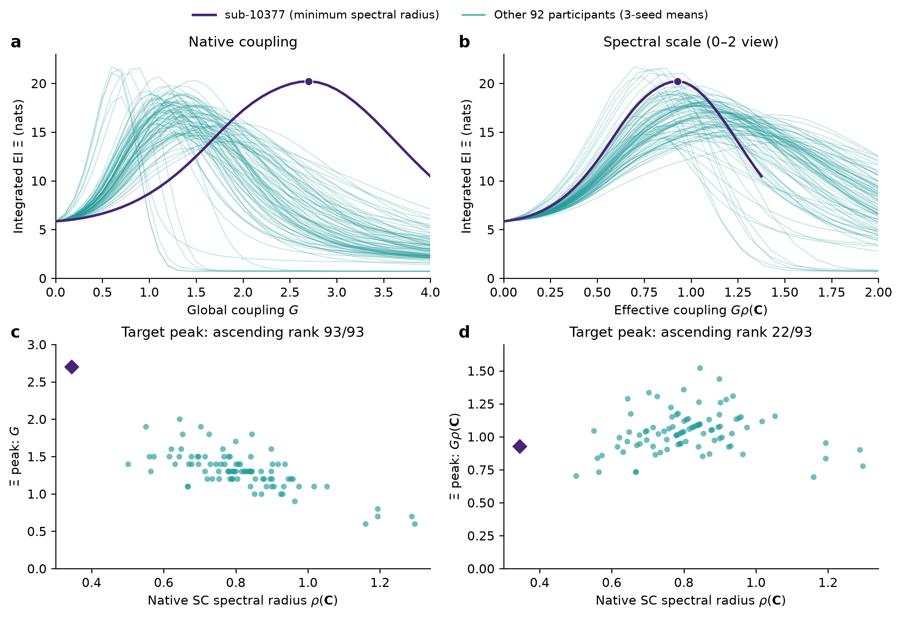

# 最小谱半径被试：连接尺度与残余个体差异

2026-10-08。针对 [brain.md 的 93 人总览](brain.md#dmf-subject-fixed-window)，复用既有原生 SC、41 个 G 和 seed 3/4/5 缓存；没有新模拟、EI 拟合或显著性检验。

**sub-10377 的原始 G 峰位偏右，主要与其较小的连接权重尺度一致。按谱尺度换算后，Ξ 峰位及发放率转折位置均回到队列常见范围；峰高和曲线形状仍有残余差异。** 目前支持的是固定局部参数下的模型响应差异，尚不能将其归为特殊生理状态。

| 量 | sub-10377 | 全 93 人中位数 | 个体解释 |
|---|---:|---:|---|
| 原生 SC 谱半径 | 0.34397 | 0.79945 | 全队列最低，约为中位数的 43.0% |
| ROI 平均加权强度（SC 任意单位） | 0.20199 | 0.36698 | 按升序第 2/93 位 |
| 非对角非零连接密度 | 53.47% | 43.80% | 并非因大量连接缺失而整体稀疏 |
| 与平均 SC 的上三角边 Pearson 相关 | 0.94115 | 0.94351 | 连接模式相似度接近队列中位数 |
| 去掉 Frobenius 范数尺度后的矩阵距离 | 0.33549 | 0.33306 | 按升序第 50/93 位，结构距离不极端 |
| Ξ 峰位 G | 2.7 | 1.3 | 按升序第 93/93 位 |
| Ξ 峰位有效耦合 | 0.92873 | 1.03742 | 按升序第 22/93 位 |
| 发放率最大斜率区间中点 G | 2.85 | 1.55 | 按升序第 92/93 位 |
| 上述中点的有效耦合 | 0.98032 | 1.24073 | 按升序第 19/93 位 |
| Ξ 峰高（nats） | 20.21511 | 17.30543 | 按升序第 86/93 位，偏高但并非最高 |

这里的排名统一为 1 加上严格小于该值的人数。矩阵距离是每个个体 SC 与平均 SC 分别除以自己的 Frobenius 范数后，两者差的 Frobenius 范数。群体参考包含该被试；这些量是描述性诊断，没有离群显著性检验。

图中紫色为 sub-10377，青色为其他 92 人；上排为 Ξ 三 seed 均值，下排为全部个体峰位。a/c 使用原生 G；b/d 使用有效耦合。b 局部展示有效耦合 0–2，不删除原缓存；每人的曲线终止于自己的实际扫描支持，sub-10377 的终点为 1.37589，没有外推。只换算横轴，不归一化幅度、不对齐峰位、不平滑。图例在数据区域之外，导出图已目视检查。

当前 DMF 的长程兴奋性输入为 $GJ_{\mathrm{NMDA}}\mathbf{C}^{(m)}\mathbf{s}_E$。定义 $\kappa_m=G\rho(\mathbf{C}^{(m)})$，则同一输入项可写为

$$
G\mathbf{C}^{(m)}\mathbf{s}_E
=\kappa_m\left[\frac{\mathbf{C}^{(m)}}{\rho(\mathbf{C}^{(m)})}\right]\mathbf{s}_E.
$$

因此，相同 G 对各人施加的网络反馈尺度并不相同。连接矩阵较弱时，需要更大的 G 才达到相近的有效耦合。该被试的三个 seed 都在 G=2.7 达到 Ξ 峰，换算后为 0.92873；三个 seed 的发放率最大斜率区间也均为 [2.8, 2.9]，换算中点为 0.98032。这与尺度解释一致，且同时涉及独立动力学序参量和信息量。

全队列谱半径与原始 Ξ 峰位的 Spearman 相关为 −0.667。峰位的描述性变异系数从原生 G 的 0.222 降为有效耦合的 0.150，约下降 32.7%；这一变化不是因果解释比例或回归解释方差。有效耦合也不是完整 DMF Jacobian 的稳定性判据，不能直接当作真实临界阈值。

连接矩阵与群体均值的最佳纯标量拟合系数为 0.49370，拟合残差占个体矩阵 Frobenius 范数的 33.07%。所以它并非平均 SC 的严格等比例缩小；边相关和去尺度矩阵距离支持“模式相似、尺度偏小”，并不证明拓扑完全相同。其 Ξ 峰高 20.215 ± 0.008 nats（均值 ± 三 seed 样本 SD）及曲线残差仍需单独解释。

当前 93 人使用同一套在平均 SC、G=1 校准后冻结的 $\mathbf{j}^{\mathrm{FIC}}$。观察到的个体差异包含连接尺度、网络拓扑及它们与共同抑制配置的交互；不能等同于为每个人分别拟合生理 E/I 平衡后的差异。共享 FIC 是残余差异的候选解释，本次没有改变或重新校准它。

后续解释应围绕三个具体问题推进：

1. **尺度换算后还剩什么？** 已完成横轴换算。随后可用每人的归一化 SC 强度异质性、谱隙、主特征向量集中度和网络间连接比例解释有效峰位、峰高及曲线残差；宜使用低维模型和留出预测，避免只针对这一人挑选解释指标。
2. **共同抑制配置是否放大差异？** 以该被试和少量典型被试作配对对照，比较当前共享 FIC 与个体 SC 下校准后冻结的 FIC；保持干预、时距、噪声和估计器相同。此项需要新模拟，本次未执行。纯粹把 SC 谱半径统一、同时保持局部参数固定，与这里的横轴换算具有同一 $G\mathbf{C}$ 重参数化关系，无需为确认这一点重复整套扫描。
3. **原始权重为何偏小？** 需要对应被试的扩散成像质控、头动、流线/权重归一化记录及可匹配的个体资料，再判断测量差异和生物差异。源压缩包没有这些资料；当前矩阵可做格式检查，不能确认上游测量质量。后续公开来源追溯已找到人口学、吸烟及旧版 T1 质控线索，见本文最后一节；尚未取得直接对应本批 SC 的扩散质控和重建记录。仓库的 average.csv 是 100 区域 × 19 指标的表，并非这 93 人各自的受体测量，不能直接拿它解释被试间差异。

不应仅凭原生 G 下曲线偏右删除该被试。用有效耦合展示结构响应差异时，应保留原生 G 结果和每人的实际扫描支持。此次诊断也不改变原固定 0.5 G 命中分类；如比较固定有效耦合窗口，则是新的分析协议。

**数值核验。** 核对冻结契约、缓存身份、原始 sub-10377 文件哈希及矩阵一致性，并重算 93 人谱半径和 Ξ 峰位。sub-10377 的 123 个条件中，干预/原生未来/独立诊断的状态越界计数、干预异常发放率计数、原生自然态边界触发计数均为 0；全部原生条件均检测到稳定态。当前分析 Ξ 非负容差为 $10^{-8}$ nats，全部 11,439 个个体 Ξ 值的最小值为 0.70488 nats，容差内负值及显著违反计数均为 0，没有裁剪；缓存整体 EI 分解最大闭合误差为 0 nats。该被试原有 123 个条件的局部 Syn 审计同样无容差内负值及显著违反。三个 seed 的峰位一致只能说明既有模拟协议的重复性，不能排除共有估计偏差。

**当前稿件核对。** 本次通过运行中的 Zotero 本地 API 重新核实父条目 P6UJCVG8，题名 *Emergent hierarchical organization of causal interactions in complex systems*。当前正文附件 DXGC7JEA（19 页）与补充 MWIWKSVG（28 页）均返回实质全文；读取 Brain/Fig.2（正文第 6–7 页）、Methods 式（5）、（7）、（8）（第 15–16 页）、补充 S1.2（第 3–4 页）及 S12.2.1／S82–S87（第 23 页）。附件均无明确稿件日期或修订号，元数据修改时间不能确定稿件版本先后，此歧义保留。

该稿件脑应用以平均 SC、八 seed、G=0–3 为主体；这里继承仓库个体扩展的 93 个原生 SC、三 seed、G=0–4、共用群体 FIC，并沿用完整 200 维未来、300 ms、$U(0.30,0.70)^{200}$ 因子化干预及共同 affine-TM Gaussian-moment 近似。本次没有将它们改成稿件主体协议，也没有声称完整稿件/代码一致性。既有 WMS 实际使用自然完整 E/I 状态，与正文将两观察基线统称为 BOLD-like 的差异保留。补充明确将 SC 权重作为任意单位，并标注 LA5c 来源；源压缩包本身未附可独立核对的采集、预处理和个体质控记录，因此不能把低权重直接解释为生物学连接减弱。

来源：[冻结输入](../../results/dmf_schaefer100/subject_curves_93_dense/inputs.npz)、[冻结曲线](../../results/dmf_schaefer100/subject_curves_93_dense/analysis_curves.npz)、[冻结契约](../../results/dmf_schaefer100/subject_curves_93_dense/contract.json)。[诊断及重绘脚本](../../scripts/analyze_dmf_subject_outlier.py)输出数值、检查结果和输入 SHA-256；可用 `.venv/bin/python -m scripts.analyze_dmf_subject_outlier` 复现。未修改 brain.md 主体与原命中统计。

## 拉普拉斯谱半径是否更能解释动力学？

2026-10-08 后续核查。这里明确采用未归一化加权图拉普拉斯 $\mathbf{L}=\mathbf{D}-\mathbf{C}$，其中 $\mathbf{D}=\operatorname{diag}(\mathbf{C}\mathbf{1})$。对当前对称非负 SC，$\mathbf{L}$ 为半正定矩阵，$\rho(\mathbf{L})=\lambda_{\max}(\mathbf{L})$。它仍由 SC 单独决定，不包含状态、局部输入输出增益、抑制反馈和时间常数。

拉普拉斯的自然动力学解释来自扩散耦合：第 i 个区域接收邻居与自身状态差的加权和，长程项为 $-G\mathbf{L}\mathbf{s}_E=G\mathbf{C}\mathbf{s}_E-G\mathbf{D}\mathbf{s}_E$。当前稿件 S83 和原生个体实际调用的直接耦合实现使用 $G\mathbf{C}\mathbf{s}_E$，没有后一项。只换图的颜色或横轴不会改变已有模拟；若真的替换耦合算子，则新增度相关的自抑制，改变了模型。

一个可直接证明的区别是：在 $a>0$、$G\geq0$、对称非负 $\mathbf{C}$ 的线性例子中，直接反馈系统

$$
\dot{\mathbf{x}}=(-a\mathbf{I}+G\mathbf{C})\mathbf{x}
$$

的最大特征值实部为 $-a+G\rho(\mathbf{C})$，故原点渐近稳定当且仅当 $G\rho(\mathbf{C})<a$。改成

$$
\dot{\mathbf{x}}=(-a\mathbf{I}-G\mathbf{L})\mathbf{x}
$$

后，因 $\lambda_{\min}(\mathbf{L})=0$，最大实部恒为 $-a$；增大 G 不使该例子失稳。因此，两种谱量的动力学含义取决于它们实际进入方程的方式，不能仅凭“拉普拉斯”名称判定更合理。

对于连通无向图上的纯扩散 $\dot{\mathbf{x}}=-G\mathbf{L}\mathbf{x}$，均匀模态特征值为 0，最慢非均匀模态的衰减率由 $G\lambda_2(\mathbf{L})$ 给出，最大特征值对应最快的模态衰减；即使采用扩散模型，最大谱半径也不单独概括所有动力学。同步系统的经典 [master stability function 工作](https://journals.aps.org/prl/abstract/10.1103/PhysRevLett.80.2109)将同步稳定性与具体振子、耦合安排联系起来；本次仅核实其出版方摘要，不把该工作当作当前异质 DMF 可以直接套用的证明。

复用相同 93 人缓存比较两种结构尺度，得到：

| 描述性量 | SC 谱半径尺度 | 未归一化拉普拉斯谱半径尺度 |
|---|---:|---:|
| sub-10377 的谱半径 | 0.34397 | 0.75495 |
| 队列谱半径中位数 | 0.79945 | 1.82294 |
| 换算后 Ξ 峰位的变异系数 | 0.14973 | 0.16194 |
| 换算后发放率转折中点的变异系数 | 0.20788 | 0.23177 |
| sub-10377 的换算 Ξ 峰位升序排名 | 22/93 | 19/93 |

两种谱半径的 Spearman 相关为 0.94065，$\rho(\mathbf{L})/\rho(\mathbf{C})$ 的中位数为 2.24541。拉普拉斯尺度也能吸收较弱的连接权重，但当前样本的峰位和发放率转折离散度均略高；这不是显著性或独立预测能力检验，也不能以曲线是否更集中作为选择理论尺度的唯一依据。对称归一化拉普拉斯 $\mathbf{D}^{-1/2}\mathbf{L}\mathbf{D}^{-1/2}$（孤立节点的逆平方根按 0 定义）则对 SC 的正纯标量缩放不变，会丢失此前需要解释的整体权重差异。

若目标是纳入当前 DMF 的实际动力学，更直接的量是完整 200 维漂移在状态 $\mathbf{s}^*_m(G)$ 处的 Jacobian，以及它的最大特征值实部：

$$
\mathbf{J}_m(G)=\left.\frac{\partial\mathbf{f}_m(\mathbf{s};G)}{\partial\mathbf{s}}\right|_{\mathbf{s}=\mathbf{s}^*_m(G)},
\qquad
\alpha_m(G)=\max_k\operatorname{Re}\lambda_k\bigl(\mathbf{J}_m(G)\bigr).
$$

在确定性固定点及局部线性化解释下，$\alpha_m(G)<0$ 表示局部渐近稳定，接近 0 表示弱恢复方向；$\alpha=0$ 单独不足以确认分岔。这里应使用最大实部，而不是 Jacobian 谱半径：后者会受到快速、强负的抑制模态影响。Jacobian 包含结构连接、E/I 反馈、传递函数斜率、状态和时间常数，因此比单独的 $\rho(\mathbf{L})$ 更直接对应用户所问的动力学差异。

仓库已有 [drift_jacobian](../../scripts/run_dmf_schaefer100_critical_horizon.py) 实现和平均 SC 的固定点诊断，但尚无本次核实的全 93 人同口径结果。固定点需确认漂移残差和延续分支；不能直接把平均 SC 的 Jacobian 结果移给个体。已有平均 SC 诊断也未使 Ξ 峰和 Jacobian 指标共同定位。若进一步解释 300 ms 干预 EI，还需考虑有限时距传播、噪声和干预轨迹；自然固定点的局部稳定性不能单独决定 Ξ 峰。本次未运行新的固定点求解或动力学扫描。

后续任务再次查询 Zotero 父条目 P6UJCVG8、当前附件元数据和两份实质全文，重读 Brain 部分及补充 S12.2.1/S83–S87；附件日期/修订号歧义与前文一致。核对原生直接耦合路径 `dmf_step_batch_with_operator(mode='direct')` 与 `drift_jacobian`，保持原干预、时距、估计器和非负容差。拉普拉斯仅作结构诊断，没有改变稿件模型、EI 估计或原有命中分类。

## 公开数据来源中的 sub-10377

2026-10-08 来源追溯。**已找到年龄、吸烟史以及明显偏离队列的旧版 T1 质控指标；其中影像质量和几何信息值得优先核查。它们尚不能证明低 SC 权重的原因。** 本次仅读取公开元数据并与冻结 SC 匹配，没有重新处理 MRI、重建 SC 或运行模型。

本次重新核实 Zotero 父条目 P6UJCVG8、正文 DXGC7JEA 和补充 MWIWKSVG，读取补充 S12.2.1 的 LA5c 来源说明及其参考文献 25：[Poldrack et al., *A phenome-wide examination of neural and cognitive function*](https://doi.org/10.1038/sdata.2016.110)。附件缺乏明确版本日期的歧义仍保留。按该来源找到公开 [OpenNeuro ds000030](https://github.com/OpenNeuroDatasets/ds000030)；当前分析的 93 个被试 ID 均在其参与者表中精确匹配，且全部标记为 CONTROL。这支持队列身份关联，但没有核实从原始 MRI 到 `CON_SC_1mio` 数值矩阵的完整处理链。

**人口学与问卷。** [参与者表](https://raw.githubusercontent.com/OpenNeuroDatasets/ds000030/4070b6eea231517bfeff42527a46d9d166ac4e13/participants.tsv)中 sub-10377 为 49 岁男性、CONTROL，扫描仪编号 35343，T1 的已知 ghost 标记为 No_ghost。93 人年龄范围 21–50 岁，中位数 28 岁，四分位数 24／38 岁；48 男、45 女，扫描仪编号均相同。No_ghost 仅表示未被标记为该数据集已知的 T1 混叠伪影，不能等同于整体质控合格。

[人口学问卷](https://raw.githubusercontent.com/OpenNeuroDatasets/ds000030/4070b6eea231517bfeff42527a46d9d166ac4e13/phenotype/demographics.tsv)及其[字段定义](https://raw.githubusercontent.com/OpenNeuroDatasets/ds000030/4070b6eea231517bfeff42527a46d9d166ac4e13/phenotype/demographics.json)记录 `cigs=1.0`（当时仍每日吸烟）、`cigs_cigs=5`（估计每日支数）、`cigs_yrs=15`（吸烟年数）；[健康问卷](https://raw.githubusercontent.com/OpenNeuroDatasets/ds000030/4070b6eea231517bfeff42527a46d9d166ac4e13/phenotype/health.tsv)及其[定义](https://raw.githubusercontent.com/OpenNeuroDatasets/ds000030/4070b6eea231517bfeff42527a46d9d166ac4e13/phenotype/health.json)中“近两年吸烟”和“目前仍吸烟”均为 1。93 人中当前每日吸烟 9 人、过去吸烟 18 人、未曾每日吸烟 66 人。这是可用于后续调整的协变量，不能由此断言该被试的连接权重受吸烟影响。该人的药物、头部损伤问卷为 n/a，利手表无匹配行；缺失不能解释为没有用药、没有头部损伤或某种利手。

年龄与冻结 SC 谱半径的全队列 Spearman 相关为 0.04302，去掉目标被试后为 0.07552。年龄较大本身不足以解释该点：

| 被试 | 年龄 | 原生 SC 谱半径 |
|---|---:|---:|
| sub-10377 | 49 | 0.34397 |
| sub-10189 | 49 | 0.50148 |
| sub-10292 | 49 | 0.92409 |
| sub-10388 | 50 | 1.05240 |

这些是描述性结果，没有显著性检验或年龄、性别、吸烟之间的因果分析。

**T1 质控与图像几何。** 数据集 [README](https://raw.githubusercontent.com/OpenNeuroDatasets/ds000030/4070b6eea231517bfeff42527a46d9d166ac4e13/README)指向旧版 `ds000030_R1.0.5` 公开衍生数据。[anatMRIQC.csv](https://s3.amazonaws.com/openneuro/ds000030/ds000030_R1.0.5/uncompressed/derivatives/mriqc/anatMRIQC.csv)共 190 人，其中仅 72 人能匹配当前 93 人队列；下表比较人数均为 72，缺失的 21 人不参与排名。排名按每项指标较差端起算，1 表示最差，没有设定排除阈值。

| T1 质控指标 | sub-10377 | 可匹配 72 人中位数 | 较差端排名 |
|---|---:|---:|---:|
| 白质信噪比 `snr_wm`（高值较好） | 11.33280 | 16.86347 | 2/72 |
| 总信噪比 `snr_total`（高值较好） | 7.39525 | 9.35970 | 2/72 |
| 灰白质对比噪声比 `cnr`（高值较好） | 0.83690 | 1.10644 | 2/72 |
| 联合变异系数 `cjv`（低值较好） | 0.64956 | 0.51286 | 2/72 |
| 熵聚焦指标 `efc`（低值较好） | 0.67310 | 0.49755 | 2/72 |
| 前景／背景能量比 `fber`（高值较好） | 129.84543 | 465.84795 | 2/72 |

指标解释方向见 [MRIQC 官方定义](https://mriqc.readthedocs.io/en/22.0.6/iqms/t1w.html)。CJV 和 EFC 可提示强度不均匀、模糊或运动相关问题，但不能单独确定具体伪影；这些指标也相互关联，不是六项独立证据。这里使用原发布表的数值，没有以新版 MRIQC 重算，也没有将旧版数值套入新版排除阈值。

同一旧表还记录目标 T1 体素间距为 **1 × 0.7109375 × 0.7109375 mm**；72 人中 69 人接近 1 mm 各向同性，另外两人为 sub-10269（1 × 0.6875 × 0.6875 mm）和 sub-10280（1 × 0.98046875 × 0.98046875 mm）。目标的 [T1 sidecar](https://raw.githubusercontent.com/OpenNeuroDatasets/ds000030/4070b6eea231517bfeff42527a46d9d166ac4e13/sub-10377/anat/sub-10377_T1w.json)也记录不同的 TE：3.50 ms，多数可匹配记录为 3.31 ms。体素间距来自旧质控表，尚未读取原始 NIfTI／DICOM 验证它是真实采集差异、转换问题还是后续处理结果；不能单凭较小体素认定图像较差。

**扩散协议与头动。** [合并扫描参数表](https://s3.amazonaws.com/openneuro/ds000030/ds000030_R1.0.5/uncompressed/derivatives/parameter_plots/MR_Scan_Parameters.tsv)中 93 人均有一条 DWI 记录：同一 3 T TrioTim、DTI 64dir、TE 92.6 ms、矩阵 96/0/0/96、相位编码 j−。目标 TR 为 8.4 s，与 73/93 人相同；另 20 人为 7.0 s。两组 SC 谱半径中位数分别为 0.79512 和 0.83765，尚无证据表明目标使用了独有的 DWI 协议。

[funcMRIQC.csv](https://s3.amazonaws.com/openneuro/ds000030/ds000030_R1.0.5/uncompressed/derivatives/mriqc/funcMRIQC.csv)中的目标静息 fMRI 平均帧间位移为 0.25197 mm；能匹配的 68 人中位数为 0.15802 mm，目标升序第 57/68 位。这只反映静息 fMRI 记录，**不能当作 DWI 头动**。本次公开目录和表格核查没有找到直接对应这批 SC 的 DWI 运动、异常切片或纤维追踪质控记录。

因此，现有证据优先支持核查 **T1 图像几何、分割／配准结果，以及上游 SC 重建与权重归一化**。若本批 SC 用 T1 划分和配准脑区，相关问题可能影响流线归属与权重；这是待验证的处理链解释，不是已证实的原因。年龄和吸烟史可作为后续群体分析的协变量。现阶段继续保留该被试，不能据此认定生物学异常或直接剔除。

**来源核验记录。** 查询日期 2026-10-08；GitHub `master` 解析为 `4070b6eea231517bfeff42527a46d9d166ac4e13`（提交日期 2020-04-21），上述 GitHub 表及定义均验证 Git blob 哈希。旧版 S3 三份表的完整字节数及 MD5 均与公开响应 Content-Length／ETag 相符：扫描参数 806,167 字节、`3f59833b5a6bac43292adef45df1411b`；T1 质控 145,327 字节、`958c4ec8f8e6c0058db250ca978aa964`；fMRI 质控 554,271 字节、`bdcd2625c33bdcfeb3822924abc23e98`。统计以冻结 `inputs.npz` 的前 93 个个体 ID 精确连接，谱半径仍使用原冻结值；未将平均 SC 行纳入人口学分析。公开原始队列的可匹配元数据已核实，`average.zip` 的发布来源、完整重建流程及矩阵数值与公开衍生文件的对应关系仍未核实。
