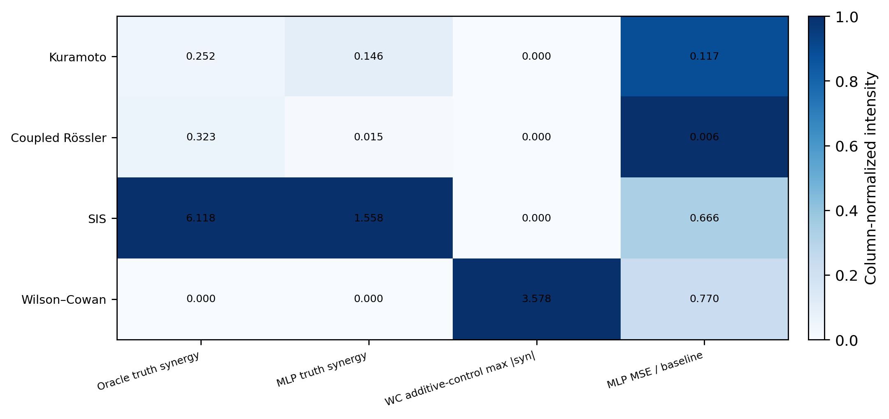
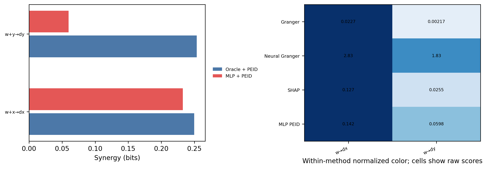
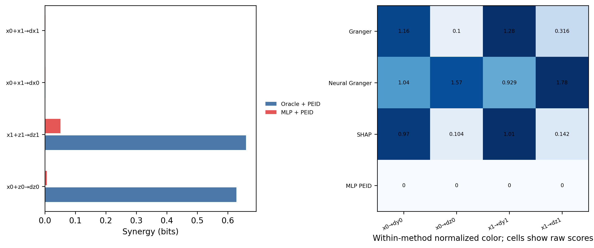
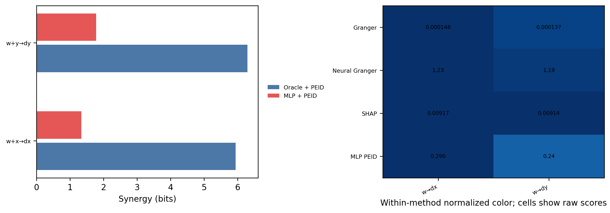
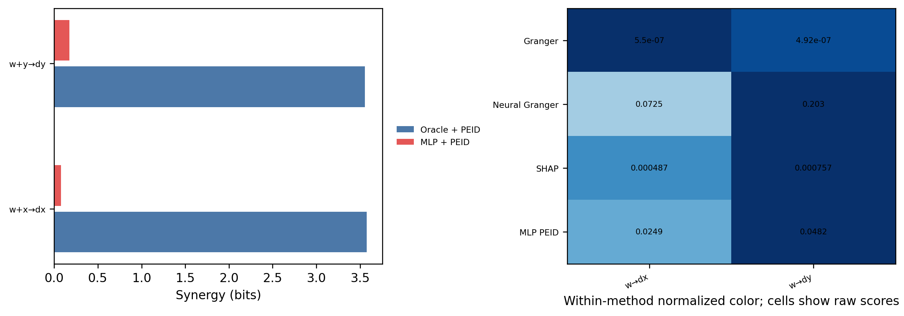

# 经典网络动力学中的共同驱动与状态依赖协同

## 1. 研究问题

已有的共同驱动 sine 系统提供了一个干净的二源 collider：共同原因 (w) 同时驱动 (x,y)，而 ({x,y}) 通过不可分的非线性项共同决定目标 (z)。它适合校准方法语义，但动力学是为实验人工构造的。

本实验进一步询问：当已知动力学替换为经典网络系统后，pairwise 预测方法、响应面交互方法和最大熵干预下的 PEID 是否仍能区分以下三类结构？

1. 共同驱动形成的 pairwise 机制；
2. 当前目标状态与外部源共同形成的状态依赖门控；
3. 结构方程可加，但联合状态仍比任一单源更能确定目标的情形。

这里的协同源集合允许包含目标变量的当前状态。例如，SIS 中 ({w_t,x_t}	o dot{x}_t) 表示感染源 (w_t) 的作用受到当前易感比例 (1-x_t) 调制。它不是两个外部源共同指向第三变量的 collider，因此不能与原 sine 系统作完全相同的结构解释。

## 2. 经典模型与网络 motif

实验严格保留 *Discovering network dynamics with neural symbolic regression* 中的动力学形式，只把大网络缩减为可解释的小型 motif。

### 2.1 Kuramoto：相位差门控

三节点有向 fork 中，中心振子 (w) 同时驱动 (x,y)：

$$
\dot{x}_i=\omega_i+0.2\sum_j A_{ij}\sin(x_j-x_i).
\tag{1}
$$

自然频率设为 ((\omega_x,\omega_y,\omega_w)=(1.0,1.1,0.9))。结构真值包括 `w->dx`、`w->dy`，以及由相位差产生的 ({w,x}	odot{x})、({w,y}	odot{y})。

### 2.2 Coupled Rössler：混沌乘积与相位耦合

两个振子双向耦合，并使用同质频率版本：

$$
\begin{aligned}
\dot{x}_i&=-y_i-z_i+0.5\sum_j A_{ij}\sin(x_j-x_i),\\
\dot{y}_i&=x_i+0.165y_i,\\
\dot{z}_i&=2+z_i(x_i-5.5).
\end{aligned}
\tag{2}
$$

主要真值是乘积门控 ({x_i,z_i}	odot{z}_i)；同时记录相位差项 ({x_0,x_1}	odot{x}_i)。变量 (x_i) 同时进入 (dot{y}_i,dot{z}_i)，因此还构成节点内部的共同原因。

### 2.3 SIS：感染源与易感状态门控

三节点 fork 中，源节点 (w) 具有自环并驱动 (x,y)：

$$
\dot{x}_i=-\delta_i x_i+\sum_j A_{ij}x_j(1-x_i),
\qquad
(\delta_w,\delta_x,\delta_y)=(0.8,1.0,1.2).
\tag{3}
$$

结构真值包括 `w->dx`、`w->dy`，以及 ({w,x}	odot{x})、({w,y}	odot{y})。后两项来自感染压力与目标易感状态的乘积。

### 2.4 Wilson–Cowan：结构可加对照

Wilson–Cowan 使用与 SIS 相同的 fork 拓扑：

$$
\dot{x}_i=-x_i+\sum_j A_{ij}
\frac{1}{1+\exp[-5.1(x_j-1)]}.
\tag{4}
$$

邻居贡献在结构方程中逐项相加，不含显式二源乘积或相位差交互。因此它是**结构交互负对照**。但它不是 PEID 数值零对照：独立干预下，联合给定“目标当前状态 + 外部驱动”仍可能显著增加对导数的确定性。

## 3. 实验设计

### 3.1 为什么预测向量场

若以很小积分步长直接预测下一状态，

$$
\mathbf{x}_{t+1}=\mathbf{x}_t+\Delta t\,\mathbf{f}(\mathbf{x}_t),
$$

恒等项 (mathbf{x}_t) 会压过耦合项，使各方法主要读到 self-memory。主实验因此学习当前状态到状态增量率的映射：

$$
\mathbf{x}_t\longmapsto \dot{\mathbf{x}}_t=\mathbf{f}(\mathbf{x}_t).
\tag{5}
$$

Oracle 直接使用精确向量场 (mathbf{f})；学习模型使用数值积分轨迹上的带噪导数监督。PCMCI 的原生对象仍是滞后时间序列，因此只保留在原系统附录，不进入本实验主表。

#### 下一状态 PEID 对齐实验

为直接检验 PEID 的标准未来状态通道，另设一个聚焦的 SIS 实验，使已知动力学与概率 MLP 都表示

$$
\mathbf{x}(t)\longmapsto\mathbf{x}(t+\tau),\qquad \tau=1.0.
$$

该实验把随机性放在 SIS 原动力学中，每个积分步加入过程噪声；PEID 算法本身不额外加噪声。MLP 使用等量自然轨迹状态和最大熵干预域状态训练，并通过条件高斯似然学习未来状态分布。两条目标超边的 MLP+PEID 与已知动力学 PEID 相对误差分别为 1.77% 和 0.05%，均低于预设的 20% 阈值。

完整协议、图和结果表见 [SIS 下一状态 PEID 对齐实验](sis_next_state_peid_alignment.md)。这一结果说明训练分布覆盖干预域且模型保留转移不确定性时，学习模型可以复现已知动力学 PEID；它不改变下文向量场基准用于比较多种读出方法的目的。

### 3.2 数值协议

| 项目 | 设置 |
| --- | --- |
| 随机种子 | 0、1、2 |
| 每个 seed 的轨迹样本 | 1600 |
| 导数观测噪声标准差 | 0.01 |
| Kuramoto 步长 / warm-up | 0.02 / 400 steps |
| Rössler 步长 / warm-up | 0.01 / 2000 steps |
| SIS、Wilson–Cowan 步长 / warm-up | 0.02 / 300 steps |
| MLP | 两层 48-unit SiLU，AdamW，180 epochs |
| 最大熵干预样本 | 每个 seed 1800 |
| 连续 EI 与协同估计 | transport map |
| 报告数值 | 3 seeds 的算术均值 |

源变量在各自预设物理范围内独立均匀采样。该分布刻意打破自然吸引子上的相关性，用于检查 learned MLP 是否真正学到可干预的机制，而不只是轨迹内预测关系。

### 3.3 方法读出

- **Granger ablation**：在固定 MLP 上将一个当前状态替换为样本均值，计算目标导数 MSE 增量。
- **Neural Granger**：逐目标训练 cMLP，以第一层 source-group norm 表示 pairwise 预测依赖。
- **SHAP 与 SHAP interaction**：使用独立背景替换，分别读出单源贡献与二源 inclusion–exclusion 非加性交互。
- **Observational WMS/SURD**：直接使用自然轨迹上的状态与导数经验联合分布。
- **MLP+PEID**：对 learned MLP 施加源侧独立最大熵干预。
- **Oracle+PEID**：对精确向量场施加同一干预，作为机制真值参照。

不同方法的数值单位并不统一，因此只在方法内部比较排序、真假关系恢复和跨模型变化，不把原始分数直接横向解释为同一效应量。

## 4. 结果

汇总图的前三列在列内归一化，格内保留原始数值。最后一列为 MLP 测试 MSE 与常数基线 MSE 的比值，越低表示轨迹内拟合越好。

| 模型 | Oracle 真值协同均值 | MLP 真值协同均值 | MLP MSE / baseline | 主要观察 |
| --- | ---: | ---: | ---: | --- |
| Kuramoto | 0.2517 | 0.1462 | 0.1166 | MLP 基本保留相位差协同，但两条 fork 分支恢复不对称 |
| Coupled Rössler | 0.3227 | 0.0148 | 0.0065 | 轨迹内预测极好，但最大熵干预下几乎丢失乘积机制 |
| SIS | 6.1177 | 1.5584 | 0.6658 | Oracle 与 MLP 均给出强状态依赖联合约束 |
| Wilson–Cowan | 无显式结构交互 | 结构对照 | 0.7697 | SHAP interaction 接近零，但 Oracle PEID 联合残差显著 |

### 4.1 Kuramoto：相位差协同可以部分恢复

Oracle PEID 对 ({w,x}	odot{x}) 和 ({w,y}	odot{y}) 分别给出 0.2498 和 0.2537 bits。MLP+PEID 对应为 0.2325 和 0.0599 bits。第一条分支接近 Oracle，第二条明显低估，说明同一个模型在不同自然频率与轨迹覆盖下可能学到不对称的干预响应。

pairwise 方法均能读到中心振子 (w) 的作用，但分数尺度差异很大。这里支持的结论是各方法都识别到共同驱动，而不是它们给出了可直接比较的作用强度。

### 4.2 Coupled Rössler：低预测误差不保证机制外推

Oracle 对两条乘积真值 ({x_0,z_0}	odot{z}_0) 和 ({x_1,z_1}	odot{z}_1) 分别给出 0.6286 和 0.6600 bits；MLP+PEID 只有 0.0061 和 0.0507 bits。与此同时，MLP MSE 仅为常数基线的 0.65%。

这构成实验中最重要的负结果：MLP 可以在 Rössler 吸引子上实现很低的预测误差，却没有在独立最大熵干预区域恢复 (z_i(x_i-5.5)) 的机制。自然轨迹中的强相关性允许预测器形成捷径，因此轨迹内拟合质量不能替代干预外推验证。

### 4.3 SIS：PEID 强调联合确定性，SHAP interaction 强调函数非加性

Oracle 对两条门控真值给出约 5.94 和 6.30 bits；MLP+PEID 仍保留 1.34 和 1.78 bits。相比之下，SHAP interaction 约为 (10^{-3})。这并不意味着 SIS 没有乘积结构，而是两种量的尺度与问题不同：PEID 衡量独立干预下联合源对目标分布的额外约束，当前 SHAP interaction 则是围绕背景替换的局部响应面差分。

SIS 的 MLP MSE / baseline 为 0.6658，预测改善弱于 Kuramoto 和 Rössler，但其 PEID 联合结构反而更清晰。这进一步说明预测精度与机制协同恢复不是同一目标。

### 4.4 Wilson–Cowan：可加结构仍可产生正 PEID 联合残差

Wilson–Cowan 方程对目标自身衰减项与外部 sigmoid 驱动做加法组合。SHAP interaction 仅为 (2\times10^{-4}) 到 (4\times10^{-4})，符合“无显式函数交互”的结构判断。然而 Oracle PEID 对 ({w,x}	odot{x}) 和 ({w,y}	odot{y}) 分别给出约 3.58 和 3.55 bits。

因此，

$$
EI(\{w,x\}\to\dot{x})-EI(w\to\dot{x})-EI(x\to\dot{x})>0
$$

不能被简单等同为结构方程中存在乘积项。对于连续确定性映射，两个可加输入的联合状态也可能比任一单源显著更能确定目标。Wilson–Cowan 应被称为结构交互负对照，而不是 PEID 数值零对照。

## 5. 结论与边界

本实验支持三个结论。

1. 经典系统中的共同驱动能够被 pairwise 预测方法稳定投影为边，但这些边不能单独表达状态依赖门控。
2. Oracle PEID 能清楚读出 Kuramoto、Rössler 和 SIS 中的联合状态约束；learned MLP 是否保留这些约束取决于其干预区域外推能力，而不只取决于轨迹内预测误差。
3. PEID 联合残差与结构函数的显式非加性不是同义概念。Wilson–Cowan 的结果要求在论文中区分“结构交互”“联合确定性”和“局部响应面交互”。

当前实验的主要限制是网络规模较小、只覆盖三个随机种子，并且 learned MLP 没有使用专门的物理归纳偏置或干预式训练。下一步若要评价方法恢复网络方程的能力，应优先加入覆盖干预区域的训练样本，或使用能显式保持乘积与相位差结构的模型，而不是单纯增加轨迹长度。
