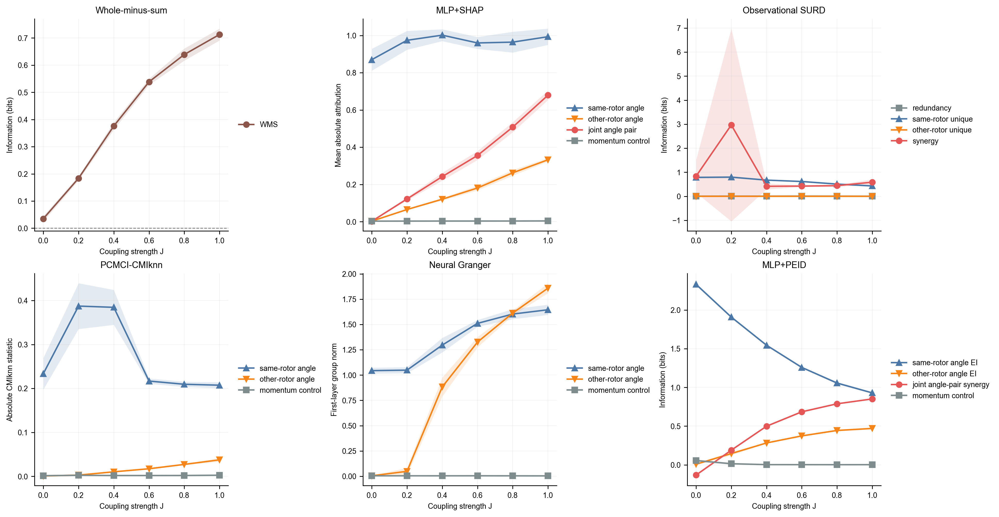

# Coupled Standard Map Six-Method Comparison

## Protocol

- coupling values: `[0.0, 0.2, 0.4, 0.6, 0.8, 1.0]`
- seeds: `[0, 1, 2, 3]`
- trajectories per full run: `16`
- steps per trajectory: `2500`
- targets: impulses `I1` and `I2`; symmetric target readouts are averaged only in the main figure
- analytic other-rotor and interaction strength: `J^2 / 2`
- PEID state distribution: natural test trajectories
- PEID target distribution: MLP-predicted impulses

## Ground-Truth 方程

双转子 coupled standard map 的冲量方程为

$$
I_{1,t}=K\sin q_{1,t}+J\sin(q_{2,t}-q_{1,t})+\epsilon_{1,t},
$$

$$
I_{2,t}=K\sin q_{2,t}-J\sin(q_{2,t}-q_{1,t})+\epsilon_{2,t}.
$$

状态更新为

$$
p_{i,t+1}=\operatorname{wrap}(p_{i,t}+I_{i,t}),\qquad
q_{i,t+1}=\operatorname{wrap}(q_{i,t}+p_{i,t+1}),\qquad i\in\{1,2\}.
$$

因此动量 `p1,p2` 不直接进入 `I1,I2` 的结构方程。真实二阶来源是 `q1+q2`。对耦合项求混合二阶导数可得

$$
\frac{\partial^2 I_1}{\partial q_1\partial q_2}=J\sin(q_2-q_1),\qquad
\frac{\partial^2 I_2}{\partial q_1\partial q_2}=-J\sin(q_2-q_1).
$$

在均匀角度基准下，`sin^2(q2-q1)` 的平均值为 `1/2`，所以解析 interaction ground truth 为

$$
\mathbb E\left[\left(\frac{\partial^2 I_i}{\partial q_1\partial q_2}\right)^2\right]=\frac{J^2}{2},\qquad i\in\{1,2\}.
$$

上方 ground-truth 曲线图同时画出三个解析基准：Same-rotor angle strength 为 `(K^2+J^2)/2`，Other-rotor angle strength 为 `J^2/2`，joint angle-pair interaction 也是 `J^2/2`；momentum control 的结构真值为 `0`。

直观地说，Same-rotor angle EI 指 `q1->I1` 和 `q2->I2` 这类“本转子角度对本转子冲量”的单源读数；Other-rotor angle EI 指 `q2->I1` 和 `q1->I2` 这类“另一个转子角度对当前冲量”的单源读数。原先的 own/cross 标签分别对应这里的 same-rotor / other-rotor。

## 中文实验说明

这个版本把所有对比方法统一到同一类数据上：都使用 coupled standard map 的自然轨迹样本。WMS、SURD、PCMCI 直接读自然轨迹 test split；SHAP 使用自然轨迹样本作为 MLP 解释的 foreground/background；Neural Granger 在自然轨迹训练样本上拟合稀疏预测模型；MLP+PEID 也先在自然轨迹 train/validation split 上拟合 impulse MLP，然后在自然 test states 上用 MLP 输出的 predicted impulses 计算 PEID。

这里的 PEID 不再是独立均匀干预分布上的 Oracle/MLP matched-intervention 评估，而是自然轨迹分布上的 learned-mechanism readout。这样做满足“所有方法使用同样自然轨迹数据”的公平对比要求，但解释语义也随之改变：它回答的是模型在实际轨迹访问区域中的信息分解读数，而不是最大熵独立干预下的机制强度。

结构真值仍然来自已知方程。动量变量 `p1` 和 `p2` 不直接进入冲量方程；真正的二阶协同来源是角度对 `q1+q2`。解析趋势用 `J^2 / 2` 表示，因此理想读数应随耦合强度单调上升，并在正耦合时把 `q1+q2` 排为最强 pair。

## Surrogate Quality

| J | min R2 | max NRMSE | max circular MAE | gate pass rate |
| ---: | ---: | ---: | ---: | ---: |
| 0.0 | 0.9973 | 0.0518 | 0.0409 | 0.75 |
| 0.2 | 0.9976 | 0.0487 | 0.0408 | 1.00 |
| 0.4 | 0.9978 | 0.0472 | 0.0412 | 1.00 |
| 0.6 | 0.9979 | 0.0456 | 0.0410 | 1.00 |
| 0.8 | 0.9982 | 0.0429 | 0.0410 | 1.00 |
| 1.0 | 0.9983 | 0.0410 | 0.0411 | 1.00 |

## Spearman Trend Against J^2/2

| readout | rho |
| --- | ---: |
| wms | 1.0000 |
| shap_interaction | 1.0000 |
| surd_synergy | -0.3714 |
| pcmci_cross | 1.0000 |
| neural_granger_cross | 1.0000 |
| mlp_peid_synergy | 1.0000 |

## 中文读图说明

Spearman 相关系数衡量每个方法的读数是否跟随解析真值 `J^2 / 2` 的排序变化。WMS、SHAP interaction、PCMCI other-rotor angle、Neural Granger other-rotor angle 和 MLP+PEID synergy 都得到 `rho=1.000`，说明它们在这个耦合扫描上保持正确单调趋势。SURD synergy 为负相关，没有跟随耦合强度。

但趋势正确不等于量纲或因果语义相同。WMS 和 SURD 是观测分布上的信息读数；SHAP 和 Neural Granger 反映拟合预测模型中的变量使用；PCMCI 是滞后条件依赖；MLP+PEID 是在自然轨迹 states 上对拟合 MLP 的 predicted impulses 做信息分解。它们使用同一自然轨迹数据来源，但数值大小仍不能直接互换。

## Ground-Truth Diagnostics

### J=0 absolute readout

| readout | mean absolute value |
| --- | ---: |
| wms | 0.035009 |
| shap_interaction | 0.002328 |
| surd_synergy | 0.834626 |
| pcmci_cross | 0.000992 |
| neural_granger_cross | 0.004653 |
| mlp_peid_synergy | 0.131653 |

### Other-rotor angle versus momentum control

| method | other-rotor > momentum rate | mean margin |
| --- | ---: | ---: |
| shap | 1.000 | 0.188747 |
| pcmci | 0.950 | 0.016868 |
| neural_granger | 1.000 | 1.141374 |
| mlp_peid | 1.000 | 0.338582 |

- MLP+PEID true pair top rate: `1.000`

## 自然轨迹 MLP+PEID 结果

| J | truth J^2/2 | MLP+PEID q1+q2 Syn | Same-rotor angle EI | Other-rotor angle EI | Momentum control EI |
| ---: | ---: | ---: | ---: | ---: | ---: |
| 0.0 | 0.000 | -0.131653 ± 0.012112 | 2.330929 | 0.008244 | 0.055525 |
| 0.2 | 0.020 | 0.189732 ± 0.008517 | 1.908125 | 0.145926 | 0.014745 |
| 0.4 | 0.080 | 0.498878 ± 0.008572 | 1.544863 | 0.282834 | 0.002845 |
| 0.6 | 0.180 | 0.685311 ± 0.012393 | 1.258472 | 0.374112 | 0.002590 |
| 0.8 | 0.320 | 0.788373 ± 0.005404 | 1.056756 | 0.444283 | 0.002135 |
| 1.0 | 0.500 | 0.851369 ± 0.003066 | 0.929337 | 0.470436 | 0.002367 |

这个结果说明，自然轨迹 MLP+PEID 在正耦合下仍然稳定识别真实 pair：`q1+q2` 在所有正耦合 runs 中都是最强 pair，true-pair top rate 为 `1.000`。同时，它也暴露了自然轨迹估计的代价：`J=0` 时 `q1+q2` synergy 不是零，而是出现明显负残差；这来自自然轨迹经验分布、有限分箱、变量相关性和模型预测面的共同影响。因此，这个版本适合做“同数据分布公平比较”，不适合替代最大熵独立干预语义下的 PEID 机制强度。

误差显示方式也相应改变：主图对所有曲线统一使用跨 seed 的 `mean ± std` 浅色阴影带，而不是单独给 PEID 画 T 形 error bar。PEID 的标准差在表中列出；它表示 seed 间变动，不是 PEID 理论量的 bootstrap 置信区间。

## Observed Result

Natural-trajectory MLP+PEID has Spearman `rho=1.000` against `J^2/2` and identifies `q1+q2` as the strongest pair in `100.0%` of positive-coupling runs.

Observational SURD does not track the analytic coupling trend in this periodic system (`rho=-0.371`) and has a large `J=0` synergy readout. This is retained as a method failure rather than removed by post-hoc tuning.

中文解释：在“所有方法都用自然轨迹”的设定下，MLP+PEID 的优势是正耦合排序和真源识别稳定；限制是零耦合处出现明显自然分布残差。这个结果比独立干预 PEID 更适合作为同数据对比，但不能再解释为最大熵干预下的 Oracle-aligned 机制量。

## Interpretation Boundary

The panels retain each method's native scale. All methods use the natural trajectory data distribution in this comparison. WMS and SURD are observational distribution readouts; SHAP and Neural Granger describe fitted predictive use; PCMCI reports lagged conditional dependence; MLP+PEID evaluates the fitted impulse MLP on natural test states. Their absolute magnitudes are therefore not interchangeable.

PEID rows are considered surrogate-valid only where the preregistered MLP quality gate passes. In this natural-trajectory variant, PEID targets are MLP-predicted impulses rather than observed noisy impulses.

中文边界说明：本报告现在支持的结论是，在统一自然轨迹数据分布下，MLP+PEID 可以在正耦合条件中恢复真实角度 pair 的排序，并保持与 `J^2/2` 一致的单调趋势；但它的绝对数值包含自然轨迹分布效应。若要讨论 PEID 论文定义中的干预机制强度，应另行使用独立最大熵 intervention states，而不是把本图的自然轨迹 PEID 直接当作干预 PEID。
