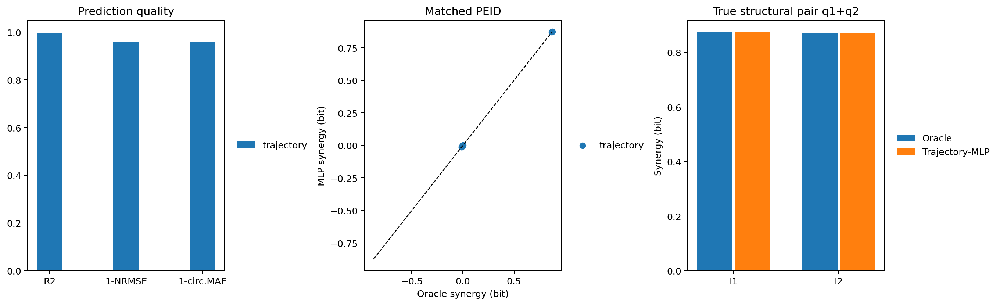

# Coupled Standard Map MLP+PEID

## Protocol

- K: `1.5`
- coupling J: `0.8`
- impulse noise: `0.05`
- analytic structural interaction J^2/2: `0.320000`
- finite-resolution PEID bins: `12`

## Trajectory-MLP

- test R2: `0.998157`
- test NRMSE: `0.042932`
- next-state circular MAE: `0.040726` rad
- PEID Spearman: `0.993007`
- true-pair maximum relative error: `0.002019`
- maximum momentum-source EI: `0.000549` bit
- preregistered gate passed: `True`
- failed checks: `none`

## Causal Strengths

### Analytic squared-Jacobian ground truth

| relation | strength |
| --- | ---: |
| q1->I1 | 1.445000 |
| q1->I2 | 0.320000 |
| q2->I1 | 0.320000 |
| q2->I2 | 1.445000 |
| p1->I1 | 0.000000 |
| p1->I2 | 0.000000 |
| p2->I1 | 0.000000 |
| p2->I2 | 0.000000 |

### Single-source EI

| source | target | Oracle EI | Trajectory-MLP EI |
| --- | --- | ---: | ---: |
| p1 | I1 | 0.000000 | 0.000035 |
| p1 | I2 | 0.000000 | 0.000000 |
| p2 | I1 | 0.000637 | 0.000549 |
| p2 | I2 | 0.000094 | 0.000197 |
| q1 | I1 | 1.054924 | 1.052320 |
| q1 | I2 | 0.427999 | 0.426345 |
| q2 | I1 | 0.427937 | 0.429107 |
| q2 | I2 | 1.057739 | 1.052373 |

### Two-source PEID residual

| sources | target | structural truth | Oracle Syn | Trajectory-MLP Syn |
| --- | --- | --- | ---: | ---: |
| p1+p2 | I1 | null | -0.000255 | 0.000072 |
| p1+p2 | I2 | null | 0.001097 | 0.001069 |
| p1+q1 | I1 | null | -0.010516 | -0.009938 |
| p1+q1 | I2 | null | -0.001819 | -0.001327 |
| p1+q2 | I1 | null | -0.003801 | -0.003748 |
| p1+q2 | I2 | null | -0.011922 | -0.011958 |
| p2+q1 | I1 | null | -0.011519 | -0.011261 |
| p2+q1 | I2 | null | -0.003436 | -0.002960 |
| p2+q2 | I1 | null | -0.003629 | -0.003407 |
| p2+q2 | I2 | null | -0.009977 | -0.010122 |
| q1+q2 | I1 | true | 0.874348 | 0.874549 |
| q1+q2 | I2 | true | 0.869373 | 0.871128 |

## Conditional Mixed-MLP

Mixed-MLP executed: `False`.

## Interpretation Boundary

The analytic mixed derivative is the structural ground truth. Oracle PEID is the numerical information-theoretic ground truth under the stated uniform intervention, noise level, discretization, and permutation-bias correction. A positive PEID residual is not itself proof of an explicit product term.
