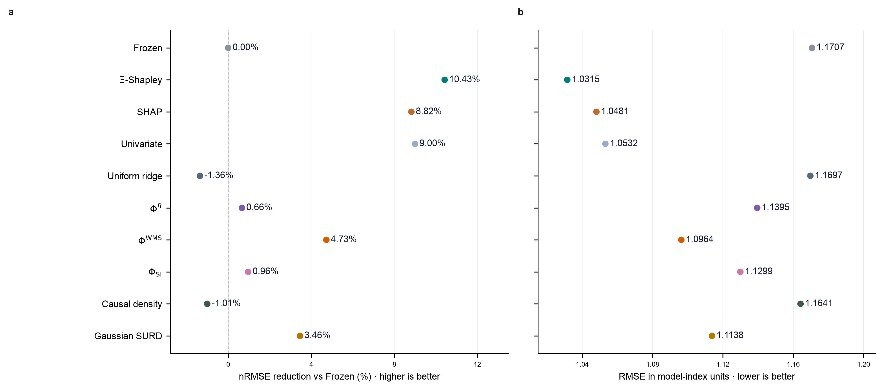

# 冻结 UniCM 的联合信息结构与预测校准：主图解读及计算口径核查


*图 1. 冻结 UniCM 的联合信息结构及其预测用途。a—c，预测时距 $\ell=1,8,24$ 个月的前十条二源协同超边，强度为三个 checkpoint 的等权均值。d—f，相同时距下 checkpoint 2 的十一模态 Synergy Partition Tree（SPT）。g，逐树汇总、再跨 checkpoint 平均的绝对 order mass，单位为 nats。h，十一源模态对联合未来状态的平均 $\Xi$-Shapley 份额，白点表示均值首位。i，原独立选参流程中，真实 $\Xi$-Shapley 先验及其 200 个标签打乱对照相对 Frozen 的测试 nRMSE 降幅。j，Frozen、既有 Univariate 参考，以及固定 $\alpha=30000,\gamma=3$ 的 Uniform ridge、六种信息先验与直接分组 SHAP 相对 Frozen 的测试 nRMSE 降幅；正值表示改善，负值表示变差，Frozen 为零。$\Xi$-Shapley 紧列 Frozen 下方，SHAP 紧随其后，EI-Shapley 留在附录 B.5。参数来自原 $\Xi$ 的验证最优，各先验使用自己的归因；SHAP 为小预算置换近似，详见附录 B.7。i 与 j 的选参口径不同。a—h 及 j 中 $\Xi$ 使用独立均匀干预历史及冻结预测；j 中五项观测信息先验只用 253 条自然历史—真实未来配对，全阶 SURD 采用 Gaussian 密度近似；SHAP 仅用拟合历史及冻结输出。*

本文以图 1 为主要研究对象，依次解释模型中的联合读出、信息指标的实际计算方式，以及这些读数作为预测校准先验的证据。SLP 观测场实验、UniCM 的单项诊断和其余可视化均放入附录。全文以 $\ell$ 表示预测时距；正文 UniCM 的单位为月，附录 SLP 的单位为周，两个实验的相同数值不代表相同物理时长。

## 目录

- [1. 主图揭示的联合信息结构](#1-主图揭示的联合信息结构)
- [2. EI 与其他信息指标实际怎样计算](#2-ei-与其他信息指标实际怎样计算)
- [3. 初始条件是否统一，哪些影响仍未排除](#3-初始条件是否统一哪些影响仍未排除)
- [4. 预测校准结果应怎样解释](#4-预测校准结果应怎样解释)
- [附录 A. UniCM 补充机制分析](#附录-a-unicm-补充机制分析)
- [附录 B. 输出校准的完整方法](#附录-b-输出校准的完整方法)
- [附录 C. 已有起始月份扫描及其适用边界](#附录-c-已有起始月份扫描及其适用边界)
- [附录 D. SLP 观测场的尺度依赖协同](#附录-d-slp-观测场的尺度依赖协同)
- [附录 E. 跨实验讨论与历史对照](#附录-e-跨实验讨论与历史对照)
- [附录 F. 图表、数据与核查依据](#附录-f-图表数据与核查依据)
- [附录 G：自然观测先验与 SURD 完整比较](#unicm-observational-priors)
- [附录 H：历史干预先验比较](#unicm-historical-priors)
- [附录 I：先验定义与排除理由](#unicm-prior-definitions)
- [附录 J：O-information／WMS／PED 候选核对](#unicm-prior-candidates)
- [参考文献](#参考文献)

## 1. 主图揭示的联合信息结构

### 1.1 分析对象与面板之间的关系

实验分析 UniCM 的冻结模态预测分支 Modeformer：输入是 11 个气候模态各自 12 个月的历史，输出是未来 24 个月的模态预测。ENSO、nino12、nino3 和 nino4 表示赤道太平洋强度及东西向空间型态；NPMM、SPMM 和 TNA 表示太平洋经向与热带北大西洋背景；IOD、SIOD 和 IOB 表示印度洋盆地及偶极结构；WWV 表示赤道太平洋暖水体积。分析中的“已知动力学”具体指这一冻结输入—预测映射，不等于已知真实气候系统的完整动力方程。

图 1a—c 每个时距从 495 个“两个不同源、一个不同目标”的组合中显示平均 Syn 最大的十条。两个源连接紫色汇合点，再由箭头指向目标；汇合点不是额外气候变量。节点编号依次为 0 ENSO、1 NPMM、2 SPMM、3 IOB、4 IOD、5 SIOD、6 TNA、7 nino12、8 nino3、9 nino4、10 WWV。节点位置只是模态定义区域的代表位置，双极模态取区域中心的中点；nino4 和 WWV 作少量显示偏移。线宽和透明度在三个时距间共享强度尺度，排名不表示统计显著性。

各面板的 target 和统计用途需要分开：

| 面板 | 信息读出或评价对象 | 适合回答的问题 |
|---|---|---|
| a—c | 一个未来标量模态 | 哪个源对共同读出哪个目标 |
| d—g | 同一时距的 11 维联合未来状态 | 联合增量如何沿 SPT 分配到层级与阶数 |
| h | 同一联合 target 上的精确 Shapley 归因 | 各源模态获得多少系统联合增量 |
| j | 各先验生成的校准预测与 ORAS5 留出目标 | 在共同参数下替换先验相对 Frozen 的误差降幅 |
| i | 真实先验与标签打乱先验的校准收益 | 正确的模态对应关系是否有预测信息 |

因此，超边、联合 target 的 SPT 和干预校准先验即使共享预测，其绝对信息量也不能不加区分地比较；单目标 $\Xi_j$ 也不能跨目标相加后视为联合 $\Xi$。

### 1.2 中期增强及 ENSO—IOD 嵌套核心

系统联合增量定义为整体 EI 减去各单模态完整历史的 EI 之和：

$$
\Xi_\ell
=EI(\mathbf{h}\rightarrow\mathbf{y}_\ell)
-\sum_{m=1}^{11}EI(\mathbf{h}_m\rightarrow\mathbf{y}_\ell).
\tag{1.1}
$$

其中，$\mathbf{h}_m$ 是模态 $m$ 的 12 个月历史向量，$\mathbf{h}$ 是全部 132 个历史坐标组成的向量，$\mathbf{y}_\ell$ 是未来第 $\ell$ 个月的 11 维联合输出。式（1.1）衡量当前干预分布和读出近似下，不能由各单模态信息相加解释的联合增量。

在当前独立干预、固定月份条件下，整体 EI 与单模态 EI 之和总体随时距下降，但系统联合增量 $\Xi$ 呈中期增强。跨 checkpoint 均值在 $\ell=1$—5 为 `0.099—0.127` bits，在 $\ell=7$—10 为 `0.197—0.235` bits，$\ell=8$ 达到 `0.2355 ± 0.0334` bits，随后回落；这里的 ± 表示三个 checkpoint 之间的标准差，不是置信区间。

图 1d—f 使用 checkpoint 2，其系统 $\Xi$ 在 $\ell=1,8,24$ 分别为 `0.130/0.254/0.117` bits，均位于三个 checkpoint 的中间。$\ell=8$ 的 `{ENSO, IOD, nino12, nino3, nino4}` 子树累计 `0.176` bits，占全树 `69.3%`；短期同集合仅占 `41.3%`，长期在自由 SPT 路径中解体。该累计量包含二至五模态各层的局部 Syn，不能解释为一个孤立的五阶原子。其余 checkpoint 的显式树见附录 A.4。

图 1g 在每棵树内按节点阶数汇总局部 Syn，再对三个 checkpoint 等权平均；未出现的阶数记为零，每棵树的全部 order mass 严格闭合到其根节点 $\Xi$。$\ell=8$ 的二至五阶合计为 `0.1649` bits，逐树归一化后平均占比为 `69.5%`；在 $\ell=7$—10，低—中阶质量约为六至十一阶的 1.93 倍。图中以 nats 显示，正文以 bits 报告，两者按 $I_{\mathrm{nats}}=(\ln 2)I_{\mathrm{bits}}$ 换算。

图 1h 采用全部 $2^{11}=2048$ 个联盟的精确 Shapley 分解，避免把 SPT 的一条选择路径当作唯一归因。五模态核心的合计份额由 $\ell=1$ 的 `49.0 ± 12.9%` 升至 $\ell=8$ 的 `79.8 ± 5.1%`，再于 $\ell=24$ 回落为 `56.9 ± 10.9%`。相邻月份的单模态首位并不总在 checkpoint 间一致，现有结果更支持固定条件下的块级集中，而非精细排序。

这与 ENSO 空间型态不能由单一指数概括的认识相容 [1–5]。nino3、nino4 和 nino12 是 ENSO 内部空间结构的不同读数；IOD 则提示冻结模型同时利用印度洋背景。附录 A.2 的标量 target 诊断进一步把未来 IOD 定位为当前条件下的中期主要联合接收端。这里识别的是模型的信息依赖，其季节普适性和真实海盆间因果方向仍需分别检验。

## 2. EI 与其他信息指标实际怎样计算

### 2.1 EI 与观测指标分别使用什么样本

**图 1j 已修正先验来源：$\Xi$ 保留最大熵干预定义；$\Phi^R$、$\Phi^{\mathrm{WMS}}$、$\Phi_{\mathrm{SI}}$、causal density 和 SURD 只从拟合期的真实历史与真实未来估计。** 后五项不读取冻结模型预测，也不重新采样历史；模态间相关和历史自相关均保留。

EI 的采样与推理过程如下。令 $\mathbf{h}_m\in\mathbb{R}^{12}$ 为模态 $m$ 的历史向量，$\mathbf{h}\in\mathbb{R}^{132}$ 为全部历史按时间与模态展平的向量，$\mathbf{y}_\ell\in\mathbb{R}^{11}$ 为未来第 $\ell$ 个月的联合输出。冻结 checkpoint 参数为 $\theta$，历史首月的月份相位为 $s$：

$$
\mathbf{h}^{(r)}\sim q_{\mathrm{do}}
=\bigotimes_{a=1}^{132}\mathcal{U}[-4,4],
\qquad
\mathbf{y}^{(r)}_\ell=f_{\theta,s,\ell}(\mathbf{h}^{(r)}),
\quad r=1,\ldots,16384.
\tag{2.1}
$$

“最大熵”指给定这一有界盒支撑后的均匀分布；支撑范围本身是实验选择。

1. 采样器以 `sampling_seed=20260901` 生成 `16384 × 12 × 11` 的历史数组，132 个坐标独立。
2. 对三个 checkpoint 分别载入冻结权重并启用评估模式。编码器保留整段历史，解码器从历史末值开始，把自己的上一输出依次接回，生成 24 步预测。未来位置的占位零不作为真实目标读取。
3. 月份标签从 `start_month=0` 开始，每 12 个月循环；没有在预测后重建滑动历史窗口并再次起报。
4. 每个 checkpoint 缓存 `16384 × 24 × 11` 的预测。每个 lead 只取对应输出与同一批历史配对，不把样本序号或 24 个输出月份拼成平稳时间序列。
5. 仿射 degree-1 TM 等价读出用于计算 EI 和全联盟 $\Xi$；三个 checkpoint 的先验等权平均。

观测指标使用 ORAS5 数据中的 253 个拟合期起报窗口：每条记录含 11 模态的 12 月真实历史及 24 月真实未来。拟合起报截至 2001 年 12 月，信息估计的未来目标最晚到 2003 年 12 月。标准化与经验联合协方差只使用这 253 条记录，协方差加固定 $10^{-6}$ ridge；不将源协方差替换成单位阵。验证和测试资料均不进入先验估计。

这里拟合的是相关 Gaussian 联合密度及其条件分布，用于估计观测信息量；没有拟合或调用气候动力学模型。自然数据来自多个实际起报窗口，因而不需要人为选择一个初值来生成长期模型轨迹。相邻窗口重叠，253 条记录不能视为 253 次独立实验。

### 2.2 冻结权重不等于信息量已被唯一确定

EI 需要冻结映射和指定的干预分布共同确定。在当前实验中，信息量还经过仿射读出近似：将冻结模型输出投影到输入历史的线性组合，把未被线性部分解释的变化汇总为残差协方差，再以 Gaussian log-det 计算信息量。残差不是新注入的物理噪声，也不是重新学习气候动力学；它包含这一近似未表达的非线性结构。残差协方差另加 ridge 保证数值可用。

图 1a—h 在原生干预坐标中显式使用已知源协方差 $(16/3)\mathbf{I}_{132}$，不把有限样本中偶然出现的源相关当作结构。图 1j 中 $\Xi$（以及附录 B.5 的 EI）的归因实现先标准化源与 target，再以单位源协方差构造同类仿射读出；两处都使用 $10^{-6}$ 的残差正则，但其坐标尺度不同。**共享的是干预样本、冻结预测和近似类型，不能据此断言不同 target、标准化和正则化口径下的绝对量逐项相同。** 仿射 log-det 不是独立均匀输入经过非线性模型后的精确连续 MI。

连续确定性响应可能使精确信息量的计算退化；当前报告的有限值依赖上述近似及正则。因而“权重冻结”明确了分析对象，却不能免除支撑范围、表示、估计器和正则化敏感性检查。Syn 的当前非负容差为 $10^{-8}$ bits，超过容差的负值必须显式失败；主图同步分析无显著非负性违例，没有静默截断 Syn。

### 2.3 观测 $\Phi^R$ 与其他先验怎样接入

以下 $I_p$ 表示拟合期真实历史—真实未来分布上的 Gaussian 信息估计。对两个模态 $a,b$，保留过去两个完整历史块及对应的两个未来标量，其他模态边缘化：

$$
q^{W}_{ab,\ell}
=I_p(\mathbf{h}_a,\mathbf{h}_b;Y_{a,\ell},Y_{b,\ell})
-I_p(\mathbf{h}_a;Y_{a,\ell})
-I_p(\mathbf{h}_b;Y_{b,\ell}),
\tag{2.2}
$$

$$
q^{R}_{ab,\ell}
=q^{W}_{ab,\ell}
+\min_{r,u\in\{a,b\}}I_p(\mathbf{h}_r;Y_{u,\ell}).
\tag{2.3}
$$

式（2.3）沿用 MMI 双重冗余修正。每个 lead 计算全部 55 对，两端各分一半，再广播到该 lead 的全部 target。因此，它仍是完整历史到实际未来的 **$\Phi^R$ pair prior**，没有执行十一模态全系统的最小信息划分搜索。[Mediano 等（2025）](https://doi.org/10.1073/pnas.2423297122)

| 图 1j 先验 | 先验分布与归因 | 是否区分预测目标 |
|---|---|---|
| $\Xi$-Shapley | 独立干预历史—冻结输出；全部 2048 个联盟的精确 Shapley | 是 |
| 直接分组 SHAP（探索性） | 16 个拟合前景、4 个拟合背景及冻结输出；两组正反置换归因 | 是 |
| $\Phi^R$、$\Phi^{\mathrm{WMS}}$ pair prior | 自然历史—实际未来；55 对双输出信息，两端等分 | 否 |
| 正向 $\Phi_{\mathrm{SI}}$ pair prior | 自然分布上两项“未来给定自身历史”条件熵减联合条件熵；55 对等分 | 否 |
| Causal density（outgoing） | 自然分布上 $I_p(\mathbf{h}_m;Y_{j,\ell}\mid\mathbf{h}_{-m})$；排除自连接，按发送源汇总 | 否 |
| SURD synergy（全阶 Gaussian） | 自然分布上全部 2047 个非空联盟；synergy 原子按参与源等分 | 是 |

$\mathbf{h}_{-m}$ 包含除源 $m$ 外的全部历史，也包含目标自身历史。正向 $\Phi_{\mathrm{SI}}$ 会计入输出间依赖，不能等同于 PEID Syn。自然相关下的 $\Phi^{\mathrm{WMS}}$ 可以为负；其原始边和源归因完整保留。接入 ridge 时对同一 target—lead 的全部源共同加上 $-\min(0,\min_m c_m)$，保持源间排序和差值，偏移及负值数量见附录 B.5。这是明确的校准接口，不能把它解释为 WMS 原定义或非负 Syn。

MIM 使用同一最大熵干预分布，读数就是 singleton EI，已从当前比较移除。它仍是互信息，但不能代表普通观测 MI 的独立对照；全联盟 EI-Shapley 与 singleton EI 加权不同。历史 Conditional MI + self MI 拼接项也已移除。

### 2.4 全阶 SURD 的估计范围

SURD 按目标状态的 specific information 区分 unique、redundant 与 synergistic 信息；它并非整体 MI 减单源 MI 之和。本次对每个实际未来标量使用十一模态完整历史块，遍历全部 2047 个非空源联盟，按作者算法分配原子，再将 synergy 原子在参与源之间等分为校准先验。这一等分属于本实验的接口约定。[SURD 原文](https://www.nature.com/articles/s41467-024-53373-4)，[作者实现](https://github.com/ALD-Lab/SURD/blob/a04f9ad569045ce93842821c104dbad5d74b3e06/utils/surd.py)

本次采用相关 Gaussian 密度估计。对标准化标量目标状态 $z$，联盟 $S$ 的 specific information 为

$$
I_p(\mathbf{h}_S;Y=z)
=\frac{-\ln(1-\rho_S^2)+\rho_S^2(z^2-1)}{2\ln2},
\tag{2.4}
$$

其中 $\rho_S^2$ 是该 Gaussian 密度中目标与联盟的平方多重相关系数。式（2.4）对 $\rho_S^2$ 在每个状态上均单调不减，故联盟排序和 SURD 分配规则不随 $z$ 改变；用 $\mathbb E[z^2]=1$ 可精确完成这一 Gaussian 模型内的状态积分。实现已用逐状态 Gaussian 求积及 XOR、冗余拷贝、独有信息、三源例子核查。这里的“全阶”指联盟覆盖至十一源，不代表已估计全部非线性依赖。

### 2.5 自然初始条件与样本窗口的影响

当前观测指标使用实际发生的历史—未来窗口，反映拟合期访问到的自然状态及季节混合，不要求额外给模型设定初值。初值敏感性在“从某一历史持续运行模型，再估计轨迹分布”的设计中仍然重要：不同吸引子、慢混合、暂态长度和季节非平稳都可能改变所得分布。已知线性 Gaussian 系统也可由平稳协方差解析计算，不必显式生成轨迹。[Mediano、Seth 与 Barrett（2019）](https://pmc.ncbi.nlm.nih.gov/articles/PMC7514120/)

本轮修正避免把干预样本误称为自然分布，但只估计一个拟合期资料窗口；尚未检查按季节、气候事件或替代时期估计先验的稳定性。图 1j 比较的是各方法按其适用分布生成先验后的预测用途，分布差异本身也是方法的一部分。

## 3. 初始条件是否统一，哪些影响仍未排除

### 3.1 本轮控制了什么

图 1a—h、图 1j 的 $\Xi$ 及附录 B.5 的 EI 共享 16,384 段完整干预历史、三个 checkpoint、bound 4 和 `start_month=0`。图 1j 的五项观测先验共享同一批 253 条真实拟合配对、12 月历史、24 月实际未来和相关 Gaussian 密度；没有另选初值、另调用冻结模型生成这些观测指标的未来变量。SHAP 另从该拟合窗口抽取 16 个前景和 4 个背景，直接读取冻结输出，其估计预算见附录 B.7。所有预测评价仍共享 `253/36/96` 的时间划分、44 个校准特征、正则参数和 bootstrap 配对。

### 3.2 仍需分别检验的敏感性

| 因素 | 当前条件 | 结论范围 |
|---|---|---|
| EI／$\Xi$ 的初始历史 | 132 坐标独立均匀，范围 $[-4,4]$ | 描述冻结模型在指定输入盒中的响应 |
| EI／$\Xi$ 的月份与抽样 | 固定一月、seed `20260901` | 尚未量化当前估计下的跨月份和抽样误差 |
| 观测指标的访问分布 | 同一拟合期真实窗口，保留相关性 | 尚未量化替代时期、季节或气候事件的先验稳定性 |
| 观测密度 | 253 个重叠样本、132 维历史、ridge $10^{-6}$ | Gaussian 近似和有限样本共线性仍影响信息读数 |
| 信息接口 | pair、outgoing 和全阶 target-specific 并存 | 比较包含归因阶数与 target 分辨率差异 |
| 校准参数 | 共同参数来自原 $\Xi$ 验证最优 | 只支持固定参数的实用方法比较 |

三个冻结 checkpoint 的差异不等同于自然数据的抽样重复。观测先验只估计一次，不能复制成三份后当作三个独立模型结果。

### 3.3 已有月份扫描改变了哪些判断

仓库已完成 `8192` 样本、`3 checkpoint × 12 起始月份 × 24 lead` 的配对月份扫描。其历史数组固定，只改变月份标签；36 个 checkpoint—月份条件中，只有 `6/36` 的系统 $\Xi$ 峰值位于 $\ell=7$—10，只有 `4/36` 的峰值目标月份落在七月至十月。描述性方差分解中，lead、目标月份和 checkpoint 分别占 `14.7%/21.2%/42.4%`，其余为残差与交互。

这组结果提示，月份相位与 checkpoint 都能明显改变曲线，固定一月下的中期增强不能直接外推。不过，扫描使用旧的经验协方差 affine TM、另一抽样 seed 和 $0.002$ bit 非负容差，既没有采用当前主图的已知独立源协方差重建，也没有重算 $\Phi^R$ 等先验。它不能直接反驳或确认当前主图的全部跨月份趋势。图表、原始行结果及口径差异见附录 C。

当前机制结论限定为：**在一月相位、bound 4 独立干预和当前冻结 checkpoint 下，ENSO 空间型态—IOD 背景表现出中期联合读出集中。** 自然分布上的比较先验已重新估计；它不构成对上述干预机制图的跨月份或自然事件复核。

## 4. 预测校准结果应怎样解释

图 1j 使用同一 44 维线性校准器：11 个模态的冻结集成预测，加上各模态历史末值、均值与趋势。信息先验只决定各组系数的 ridge 惩罚，真正输出预测的是拟合后的截距和系数。ORAS5 月气候态与尺度只用 `1980-01—2003-12` 拟合资料估计并冻结；测试起报为 `2009—2016` 的 96 个月份，测试目标及测试期均不参与选参或归一化。完整方法见附录 B。

**图 1j 已完成当前划分下全部测试样本的评价。** 每种方法均覆盖 `2009-01—2016-12` 的全部 96 个起报月份、11 个模态和 1—24 月全部预测时距，共 `96×11×24=25,344` 个预测—观测配对；最长时距的实际目标延伸至 `2018-12`。这些配对存在窗口重叠，不代表 25,344 个独立样本。表中保留原始 nRMSE，并列出图 1j 显示的降幅 $100(1-\mathrm{nRMSE}_{m}/\mathrm{nRMSE}_{\mathrm{Frozen}})$；正值表示改善，数值越大越好。这是总体平均 nRMSE 的比率，不是先逐单元计算降幅再平均。nRMSE 的计算为：先按模态用拟合期目标标准差归一化误差，在每个模态—时距单元上对全部 96 个起报计算 RMSE，再对 264 个单元等权平均。这是当前固定参数方案的完整测试结果；后文计时中的批次外推不涉及预测误差，253 条自然配对和 16,384 条干预历史也分别属于先验估计，而非测试子集。

| 图 1j 方法 | 测试 nRMSE ↓ | 相对 Frozen 降幅 ↑ |
|---|---:|---:|
| Frozen | 1.100731 | 0.00% |
| 全阶 $\Xi$-Shapley | 0.985959 | 10.43% |
| 直接分组 SHAP（探索性） | 1.003601 | 8.82% |
| Univariate（既有参考） | 1.001663 | 9.00% |
| Uniform ridge，$\alpha=30000$ | 1.115712 | -1.36% |
| 观测 $\Phi^R$ pair prior | 1.093445 | 0.66% |
| 观测 $\Phi^{\mathrm{WMS}}$ pair prior | 1.048667 | 4.73% |
| 观测正向 $\Phi_{\mathrm{SI}}$ pair prior | 1.090129 | 0.96% |
| 观测 causal density（outgoing） | 1.111842 | -1.01% |
| 观测全阶 Gaussian SURD synergy | 1.062660 | 3.46% |

在共同参数 $\alpha=30000,\gamma=3$ 下，$\Xi$ 相对 Uniform 的 nRMSE 改善为 `0.129753`，共享 4000 次、12 月时间块 bootstrap 的逐项 95% 区间为 `[0.065675, 0.188591]`。相对全阶 Gaussian SURD 的改善为 `0.076701`，区间为 `[0.040684, 0.113574]`；相对三种观测 $\Phi$ pair prior 及 causal density 的区间也排除零。EI-Shapley 的结果与差异区间暂存附录 B.5。共同参数由 $\Xi$ 选出，因此结果只检验固定参数下替换先验的效果。

**在这一固定参数比较中，$\Xi$-Shapley 的完整测试集平均 nRMSE 最低，为 `0.985959`。** 相对冻结模型、同参数 Uniform ridge 和全阶 Gaussian SURD，平均 nRMSE 分别降低 `10.43%`、`11.63%` 和 `7.22%`。这些百分比以各比较方法的 nRMSE 为分母；结果支持总体平均误差上的优势，不表示所有模态、时距或气候事件都改善，也不能据此认定其显著优于附录 B.5 保留的 EI-Shapley。

分布修正并未使所有竞争方法同向变化。$\Phi^{\mathrm{WMS}}$ 的 nRMSE 从 `1.086161` 降至 `1.048667`，$\Phi^R$、$\Phi_{\mathrm{SI}}$ 与 causal density 则分别从 `1.086247/1.087799/1.089645` 变为 `1.093445/1.090129/1.111842`。WMS 的变化同时包含自然分布下有符号归因的显式 ridge 映射，不能仅归因于数据分布。SURD 相对同参数 Uniform 的改善为 `0.053053`，区间 `[0.011453, 0.086111]`。详细结果与逐 lead 曲线见附录 B.5。

历史独立选参时，Uniform 取 $\alpha=1000$，测试 nRMSE 为 `1.012754`；$\Xi$ 的额外改善只有 `0.026794`，即 `2.65%`，时间块 bootstrap 区间略跨零。图 1i 沿用这一历史流程：200 个对照保留归因数值、打乱源模态标签，各自用相同预算重新选参，没有一个达到真实先验，有限随机检验 $P=(0+1)/(200+1)=0.00498$。图中横轴使用相对 Frozen 的降幅，真实先验约为 `10.43%`；它不是相对 Uniform 的增益。

两个检验分别反映收益幅度的不确定性和源模态标签结构的信息，不能相互替代。$\Xi$ 的平均 ACC 为 `0.390`，高于同参数 Uniform 的 `0.347`，却低于历史独立选参 Uniform 的 `0.414`；历史流程中 $\ell=7$—10 相对 Uniform 的平均增益点估计仍为负。因此，目前证据支持平均幅值误差上的校准用途，尚未证明中期联合信息峰值转化为稳定的中期预测收益。

三种 $\Phi$ prior 使用双输出逐对归因，causal density 使用 outgoing 汇总，四者均广播到全部 target；$\Xi$、EI 和 SURD 使用全联盟及 target-specific 归因。观测先验已统一自然数据窗口，EI／$\Xi$ 保留干预定义。主图比较包含评价分布、估计器及归因接口差异，不是只替换信息公式的实验。

补充的直接分组 SHAP 对照使用同一冻结 Transformer 和校准器，测试 nRMSE 为 `1.003601`，相对同参数 Uniform 改善 `10.05%`；与 $\Xi$ 的差异区间跨零。这说明普通输出归因也能生成有用的权重，当前结果尚不能把校准收益解释为整合有效信息的独有优势。该小预算探索性对照、归因定义及精度边界见附录 B.7。

## 附录 A. UniCM 补充机制分析

本附录保留主图之外的机制诊断。A.1—A.2 与 A.5 是历史 8192 样本口径，A.3—A.4 与 A.6—A.7 对应当前同步的独立源分析；不同口径的绝对值不作直接比较。

### A.1 路径无关固定模块验证

自由 SPT 只能给出当前 EI 表和拆分准则下的一条分解路径。为检查 ENSO—IOD 结构是否只是路径选择的产物，进一步固定四个嵌套源集合，并直接计算

$$
\Xi_S
=EI(\mathbf{h}_S\rightarrow\mathbf{y})
-\sum_{m\in S}EI(\mathbf{h}_m\rightarrow\mathbf{y}),
$$

其中 $\mathbf{y}$ 始终为同一 lead 的全部 11 个未来模态；checkpoint、8,192 个最大熵干预样本、bound 4、预测缓存和 affine degree-1 TM 均保持配对一致，唯一变化是固定源集合。集合依次为 `nino12 + nino3`、`ENSO + nino12 + nino3`、再加入 `nino4`，最后加入 `IOD`。该量是集合自身相对于单模态之和的总联合增量，不是自由 SPT 路径中的局部节点协同。

四个固定集合的跨 checkpoint 均值曲线都在 lead 8 达峰，各 checkpoint 的峰位均落在 lead 7—10。lead 8 时，四个集合的 $\Xi_S$ 依次为 `0.0308 ± 0.0073`、`0.0627 ± 0.0191`、`0.0853 ± 0.0382` 和 `0.1490 ± 0.0383` bits；最后的五模态集合相对于同一 seed 的全系统 $\Xi$ 平均达到 `80.6%`。这些嵌套集合不是互斥原子，因此该比例只表示固定集合相对于全系统联合增量的定位程度，不能跨集合相加。

相邻集合提供了更直接的配对比较。在 lead 7—10 窗口，加入综合 ENSO 指数、nino4 和 IOD 后，$\Xi_S$ 分别增加 `0.0282 ± 0.0179`、`0.0228 ± 0.0187` 和 `0.0525 ± 0.0282` bits；三个新增步骤在全部 `3 checkpoint × 24 lead` 配对单元中均保持正值。IOD 的增量最大且集中在中期，说明冻结模型并非只读取多个 ENSO 指数之间的内部空间差异，还把印度洋背景作为印太联合状态的一部分。更谨慎的地球科学解释是：该结果提出了“IOD 背景对 ENSO 空间型态形成状态门控”的可检验假设；它与延迟的跨海盆耦合相容，但不能单独识别印度洋到太平洋的真实动力方向。


*图 A1. 路径无关固定集合确认 UniCM 的中期联合读出主要集中在 ENSO 空间型态与 IOD 背景。a，四个固定集合的 $\Xi_S$；粗线为 checkpoint 均值，阴影为标准差，细线为三个 checkpoint。b，固定集合 $\Xi_S$ 相对于同一 seed 全系统 $\Xi$ 的比值后再跨 seed 平均；不同集合相互嵌套，比例不可相加。c，沿嵌套序列依次加入 ENSO、nino4 和 IOD 的配对 $\Delta\Xi_S$；IOD 的最大增量集中在 lead 8—11。d，lead 7—10 的逐 checkpoint 均值和跨 checkpoint 均值横线。全部条件使用相同干预样本、预测缓存、联合 target 和 affine degree-1 TM，且保留有符号结果。*

### A.2 目标模态分解：当前条件下的 IOD 接收端

联合全模态 target 可以定位输入侧的协同模块，却不能判断联合信息最终主要影响哪个预测量。为此，在 checkpoint、8,192 个最大熵干预样本、12 个月输入历史、bound 4 和 affine degree-1 TM 全部配对固定的条件下，只把 target 从 11 维联合输出依次改为单个未来模态 $Y_j$：

$$
\Xi_j
=EI(\mathbf{h}\rightarrow Y_j)
-\sum_{m=1}^{11}EI(\mathbf{h}_m\rightarrow Y_j).
$$

全部 `3 checkpoint × 11 target × 24 lead` 的 $\Xi_j$ 均为正，但强度和时间型态高度不均匀（图 A2）。IOD 是唯一在系统中期峰值窗口明显突出的 target：lead 8 达到 `0.1873 ± 0.0673` bits，lead 7—10 平均为 `0.1635 ± 0.0637` bits。同期第二至第四位依次为 SIOD（`0.0488 ± 0.0316` bits）、nino3（`0.0461 ± 0.0227` bits）和 nino12（`0.0377 ± 0.0069` bits）；综合 ENSO 为 `0.0346 ± 0.0040` bits，WWV 仅为 `0.0134 ± 0.0118` bits。与此相对，nino4 和综合 ENSO 的各自峰值出现在 lead 1，nino3 和 nino12 的峰值出现在 lead 3，说明太平洋 ENSO 空间型态的强联合读出偏早，而 lead 7—10 的系统增强主要落到未来 IOD。

IOD 的特殊性不是“它最容易预测”，而是“它的中期预测最需要联合状态”。lead 8 时，未来 IOD 的整体 EI 为 `0.7168` bits，11 个单模态 EI 之和为 `0.5295` bits，剩余联合增量为 `0.1873` bits；按 checkpoint 分别计算比例后，$\Xi_{\mathrm{IOD}}/EI(\mathbf{h}\rightarrow Y_{\mathrm{IOD}})$ 平均为 `25.7%`。历史 IOD 仍是最大的单源读出，平均贡献 `0.3174` bits，说明模型并没有丢掉 IOD 自身记忆；但仅靠包括 IOD 在内的各单源信息相加，仍不能恢复整体预测。对照最清楚的是 WWV：lead 8 的整体 EI 更高，达到 `1.0212` bits，但其中 `0.9938` bits 已可由 WWV 历史单独读取，$\Xi_{\mathrm{WWV}}$ 只有 `0.0122` bits，约占整体 EI 的 `1.2%`。因此，热图显示的不是一般预测能力，而是每个未来模态对跨模态组合的额外依赖。

这一结构与 IOD 的物理定义和季节性相容。IOD 本身是西、东印度洋海温异常之差，其演变同时涉及印度洋盆地背景、东西向梯度以及与 ENSO—Walker 环流相关的跨海盆状态 [R4, R6, R7]；这些量只有联合读取时才可能形成稳定的未来偶极信号。更重要的是，当前干预缓存固定 `start_month=0`，其月序列与数据加载器一致，从一月开始循环；因而 lead 7—10 对应七月至十月，恰好覆盖 IOD 通常发展并接近成熟的季节。模型的月份嵌入可能在这个窗口把 ENSO 空间型态和印度洋背景组合成更强的 IOD 读出。由此，更准确的假设不是“IOD 单向门控 ENSO”，而是“在 IOD 季节性发展窗口，UniCM 把印太联合状态集中投影到未来 IOD”。

这里仍有两个边界。第一，固定月份使 lead 与目标季节混合。已有十二月份扫描提示两者共同影响曲线，但采用旧估计口径，且没有逐 target 重算本节结果，不能据此确认当前 IOD 峰值的跨月份稳定性（附录 C）。第二，当前 target-resolved 分解使用全部 11 个历史模态作为源，尚不能证明 IOD 峰值完全由图 A1 的五模态核心产生；仍需固定 `ENSO + IOD + nino12 + nino3 + nino4` 并计算 $\Xi_{S\rightarrow j}$。因此，当前结果把 IOD 定位为冻结模型中的主要联合接收端，但不把它等同于已识别的真实双向因果枢纽。


*图 A2. 历史 8192 样本口径下的标量 target 联合增量。各 target 的 $\Xi_j$ 分别估计，不能相加为联合未来状态的系统 $\Xi$；固定一月相位使 lead 与目标季节混合。*

### A.3 十一模态的精确 Shapley 协同归因

自由 SPT 给出哪些模态集合形成主要节点协同，但不能为全部 11 个模态提供路径无关、严格加和为 `100%` 的系统归因。为此，这里把每个模态的完整 12 个月历史作为一个玩家，把同一 lead 的全部 11 个未来模态固定为共同 target。对模态集合 $S$ 定义

$$
F_\ell(S)
=EI_{\mathrm{aff}}\!\left(\mathbf{h}_S\rightarrow\mathbf{y}_\ell\right),
\qquad
v_\ell(S)
=F_\ell(S)-\sum_{m\in S}F_\ell(\{m\}).
$$

11 个玩家共有 $2^{11}=2048$ 个联盟，因此可以逐 checkpoint、逐 lead 穷举全部联盟并精确计算 Shapley 值 $\phi_m(\ell)$，不需要排列采样近似。百分比先在每个 checkpoint 内按 $100\phi_m(\ell)/v_\ell(N)$ 归一化，再跨三个 checkpoint 取均值；因而每个 lead 的均值构成仍严格加和为 `100%`。

计算复用同一批 `16,384` 个 bound 4 独立最大熵干预、冻结预测缓存和 `start_month=0`。每个玩家包含该模态的 12 个历史坐标，target 始终是 11 维联合未来状态。affine degree-1 TM 在原生干预坐标中显式使用已知独立源协方差 $(16/3)\mathbf{I}$，避免把 132 维有限样本中偶然出现的微小源相关累计成协同。该估计器、样本与图 1a—h 完全一致。

图 A3a—b 显示，短期构成较分散，中期明显凝聚到 ENSO 空间型态与 IOD 背景。lead 1 的最大平均单模态份额为 IOD 的 `14.8%`，而且三个 checkpoint 的首位模态并不一致。到 lead 7，nino3 的平均份额增至 `21.8%`，但三个 checkpoint 中有一个以 nino12 居首；lead 8 时 IOD 和 nino3 分别占 `19.8%` 和 `19.7%`。把 `ENSO + IOD + nino12 + nino3 + nino4` 作为图 A1 已定位的五模态核心，其合计份额由 lead 1 的 `49.0 ± 12.9%` 升至 lead 7 的 `75.8 ± 6.0%`，并在 lead 8 达到 `79.8 ± 5.1%`。这说明中期系统增量不只是总量增强，而且其模态归因同时向印太核心收缩。

中期内部仍发生角色交接。跨 checkpoint 均值中，lead 9—12 均由 IOD 居首，份额依次为 `20.9%`、`21.4%`、`20.7%` 和 `20.0%`；但单个 checkpoint 的首位排序并不全部一致，因此更稳妥的结论是 nino3 与 IOD 在这一窗口共同突出，而不是 IOD 在每个模型中都确定领先。到 lead 24，五模态核心合计份额回落为 `56.9 ± 10.9%`，IOD 与 nino3 的平均份额分别为 `12.0%` 和 `11.8%`。长期变化因而是协同重新分散，而不是由某个单模态永久接管。

绝对贡献给出相同的尺度背景（图 A3c—d）。独立先验口径下，grand-coalition interaction 从 lead 1 的 `0.1274 ± 0.0509` bits 升至 lead 8 的 `0.2355 ± 0.0334` bits，随后降至 lead 24 的 `0.1107 ± 0.0232` bits。全部 `3 checkpoint × 24 lead × 2036` 个二阶及以上联盟中，多模态 interaction 的最小值为 `0.000108` bits；在 $10^{-8}$ bits 非负容差下没有容差内负值或显著违例。最大 Shapley 闭合误差为 `1.39 × 10^{-16}` bits。协方差 ridge 从 $10^{-8}$ 扫到 $10^{-4}$ 时，任一模态、任一 lead 的跨 checkpoint 平均份额最大只变化 `0.0087` 个百分点，说明百分比趋势不由 ridge 选择驱动。


*图 A3. UniCM 十一模态对全模态未来状态整合增量的精确 Shapley 分解。a，三 checkpoint 平均的百分比构成。b，同一百分比的模态—lead 热图；白点标出每个 lead 的均值首位，首位不代表跨 checkpoint 排名一致。c，各模态的平均绝对 Shapley 贡献。d，grand-coalition interaction；灰线为三个 checkpoint，黑线为均值，阴影为标准差。全部条件共享 `16,384` 个独立最大熵干预、冻结预测缓存、11 维联合 target 和独立源 affine degree-1 TM，唯一变化是 forecast lead。百分比在 checkpoint 内归一化后再平均。*

### A.4 当前独立源估计下的显式 SPT

图 A4 把 lead 8 的三个冻结 checkpoint 分别画成树，而不是先平均拓扑。11 个模态足以穷举每个节点的全部无序二分，因此这里没有 SLP 60-PC 大树的候选搜索近似。节点标出该联盟的局部 Syn，三个面板共享颜色尺度。所有末端二模态原子均继续展开为两个单模态叶节点；二模态 Syn 保留在其父节点，展开不改变原子数值或总量。淡绿色包围区、加粗分支和底部括号共同标出跨 checkpoint 一致的五模态 ENSO–IOD 核心，图中 ENSO 对应 `nino`。


*图 A4｜三个 checkpoint 均使用 lead 8 的精确十一模态 Synergy Partition Tree（SPT）。三个 checkpoint 的系统 $\Xi$ 分别为 `0.255`、`0.254` 和 `0.197` bits。每棵树均完整展开为 11 个单模态叶节点和 10 个内部划分，主干比例 `100%`、归一化 Colless 不平衡度 `1.00`；三棵树均在五模态层收敛到 `{nino, IOD, nino12, nino3, nino4}`，但最深二模态核心分别为 `IOD + nino3`、`nino + nino3` 和 `nino12 + nino3`。包围区下方标出的核心总量为其子树内局部 Syn 之和，三个 checkpoint 分别为 `0.194`、`0.176` 和 `0.125` bits，占各自全树 $\Xi$ 的 `76.0%`、`69.3%` 和 `63.3%`；包围区表示集合归属，节点填色表示局部 Syn 强度。*

UniCM 与 SLP 的共同点不是“没有模块”，而是都缺少平衡、互不重叠的大分支，并由逐层剥离形成单一主干。不同点在于，UniCM 的五模态印太核心跨三个 checkpoint 完全一致，说明中层核心比最深二元核心更稳定；最深配对仍随 checkpoint 改变。由于这里逐节点穷举全部二分，链形不能归因于候选划分不足。它支持的是**一个稳定中层核心外加不稳定内部排序**，而不是 11 个模态毫无组织或存在若干彼此独立的固定模块。五模态核心内部累积了约 `63%—76%` 的全树协同量，因此链形中的主要信息是协同集中在这一嵌套子树。这里的核心总量包含二至五模态各层的局部原子，不能解释为单一五阶原子，也不能仅凭强调区推断真实海洋动力耦合强度或方向。三个 checkpoint 的原子闭合误差均为 0，$10^{-8}$ bits 的数值容差下没有负原子或容差内归零值。

### A.5 历史估计下的全阶组合数归一化对照

本节保留历史 8192 样本、经验协方差估计的对照。同口径原始树的系统 $\Xi$ 为 `0.210/0.207/0.135` bits，区别于图 A4 的当前值。这里采用与附录 D.8 相同的微调：候选切分按原始残差除以 $(2^{|A|}-1)(2^{|B|}-1)$ 排序，但图中继续显示未归一化的原始 Syn。11 个模态在每个节点都穷举全部无序二分，因此该对照只改变优化目标，不改变候选覆盖率。


*图 A5｜全阶组合数归一化选择下的 UniCM lead 8 SPT。节点标签和共享颜色尺度均为原始局部 Syn，采用单模态叶节点和 ENSO–IOD 核心强调方式，数值使用本节历史估计口径。checkpoint 1 和 3 的完整拓扑与同口径历史原始目标一致；checkpoint 2 在九模态层分出 `NPMM + SIOD` 二模态侧枝，Colless 不平衡度由 `1.00` 降至 `0.82`；完整展开后该树有 10 个内部划分，其中主干占 `90%`，侧枝 `NPMM + SIOD` 同样展开到单模态叶节点。相对于同口径历史原始树，三组系统 $\Xi$、五模态印太中层核心和末端主核心均保持不变。*

这个结果没有显示普遍的大模块重组。三个 checkpoint 中只有一个出现新增二模态侧枝，而且稳定的 `{nino, IOD, nino12, nino3, nino4}` 中层核心以及 `nino + IOD`、`nino + nino3`、`nino12 + nino3` 三个末端核心全部保持。因而，在这套历史估计中，主干式结构不能主要归因于原始残差的组合数量偏差；当前独立源估计尚需配对重算归一化目标，才能作同样判断。同时，`NPMM + SIOD` 只在一个 checkpoint 和一个目标函数下出现，现阶段只能作为模块候选，不能称为稳定模块。三个 checkpoint 的原子闭合误差仍为 0，没有负原子或容差内归零值。

### A.6 SPT order mass 的树内比例


*图 A6. SPT 选择路径上的阶数质量比例。每个 checkpoint—lead 条件先把同阶内部节点的局部 Syn 在单棵树内求和，再除以该树根节点 $\Xi$；图中显示三个 checkpoint 的等权平均。每棵树的比例严格加和为 `100%`。该图用于区分系统总量变化与构成变化，不进入正文主图。*

$\ell=8$ 时二、三、四、五阶的平均绝对质量分别为 `0.0385/0.0427/0.0442/0.0396` bits；六至十一阶合计为 `0.0705` bits，逐树归一化后平均占 `30.5%`。$\ell=7$—10 的二至五阶与六至十一阶平均质量分别为 `0.1417/0.0733` bits。

比例口径与正文绝对量给出一致结论。lead 1 时 2—5 阶合计占 `36.8%`，lead 8 升至 `69.5%`，lead 24 回落到 `43.4%`；lead 7—10 的平均占比为 `65.1%`。因此，中期亮带不是系统 $\Xi$ 整体抬升在各阶上的等比例反映，而包含明确的阶数构成收缩。

### A.7 全联盟同阶均值对照


*图 A7. 不经过 SPT 路径选择的 all-coalition mean Syn。每个 checkpoint—lead 条件先对同阶全部源集合取均值，再对三个 checkpoint 等权平均。该统计回答“随机取一个给定阶数联盟时其平均最小二分 Syn 多大”，不构成对根节点 $\Xi$ 的加和分解。*

该对照保留了原热图中“阶数越高、均值越大”的现象，但它与树图回答的问题不同。以 lead 8 为例，五模态 ENSO—IOD 核心的局部五阶 Syn 在三个 checkpoint 中均为 462 个五阶联盟的第 1 名，跨 checkpoint 平均为 `0.0396` bits；然而它只是 462 个联盟中的一个，在 all-coalition mean 中仅贡献约 `1.67%` 的五阶总和。因此，一个很强但组合上稀疏的核心会被大量普通五阶联盟稀释。正文采用 SPT order mass 后，路径选择保留了这个核心，并把其子树内二至五阶的累计质量显示为中期集中；all-coalition mean 只作为算法阶数偏好与背景分布的补充诊断。

### A.8 历史低阶辅助证据

ENSO 自身历史在短 lead 占主导，排除自身后，nino3、nino12、IOD 和 NPMM 在中长期提供较小补充。二源 Syn 的平均量级约为 `10^{-3}—10^{-2}` bits，显著低于单模态 self EI，因此它更适合作为“联合读出相对于单源信息的额外增量”，而不应与模态自身记忆直接比较。

ENSO 目标中，`ENSO + nino3` 的平均 Syn 为 `0.005216` bits，`ENSO + nino4` 为 `0.005194` bits，`ENSO + IOD` 为 `0.004278` bits。IOD 目标中，`IOD + SIOD` 的平均 Syn 为 `0.012107` bits，`ENSO + IOD` 为 `0.007147` bits，`IOD + nino4` 为 `0.005648` bits。多数曲线在 lead 15 后趋近于零，且部分组合的 seed 标准差接近均值，因此这些结果只用于支持空间型态和背景态的解释，不用于建立稳定的二源排名。

## 附录 B. 输出校准的完整方法

图 1i—j 回答的是一个比“哪些模态具有高联合信息贡献”更实际的问题：**冻结 Modeformer 已经给出预测后，target-specific $\Xi$ 的精确 Shapley 分解能否帮助一个小型输出校准器更可靠地修正预测值？** 校准发生在 Transformer 之后，不改变 Modeformer 的参数，也不重新训练其动力过程。它只使用 ORAS5 的一段历史资料，学习如何把冻结预测映射到更合适的均值和振幅。

### B.1 特征、标准化与校准输出

三个发布 checkpoint 的预测先做等权平均。随后针对每个 target $j$ 和预测 lead $\ell$ 单独拟合一个线性校准器，共有 $11\times24=264$ 个校准单元。每个单元读取 44 个标准化特征：

- 当前 lead 下 11 个模态的冻结预测；
- 11 个模态在 12 个月输入历史中的最后一个值；
- 11 个历史均值；
- 11 个历史线性趋势。

下标的含义如下：

| 符号 | 含义 |
|---|---|
| $t$ | 一个起报时间样本 |
| $j$ | 要校准的目标模态，$j=1,\ldots,11$ |
| $\ell$ | 预测 lead，$\ell=1,\ldots,24$ |
| $m$ | 作为校准输入的源模态，$m=1,\ldots,11$ |
| $\widehat y^{\,F}_{t,m,\ell}$ | 冻结 Modeformer 对模态 $m$、lead $\ell$ 的等权集成预测 |
| $h^{\mathrm{last}}_{t,m}$、$h^{\mathrm{mean}}_{t,m}$、$h^{\mathrm{trend}}_{t,m}$ | 模态 $m$ 的 12 个月历史末值、均值和线性趋势 |

所有输入特征先用拟合段的均值和标准差进行标准化。波浪号表示标准化后的量，例如

$$
\widetilde{x}
=\frac{x-\mu^{\mathrm{fit}}_x}{s^{\mathrm{fit}}_x}.
$$

因此，一个起报样本 $t$ 在 lead $\ell$ 下的 44 维输入向量为

$$
\mathbf{z}_{t,\ell}
=
\left[
\widetilde{\widehat{\mathbf{y}}}^{\,F}_{t,\ell},
\widetilde{\mathbf{h}}^{\mathrm{last}}_t,
\widetilde{\mathbf{h}}^{\mathrm{mean}}_t,
\widetilde{\mathbf{h}}^{\mathrm{trend}}_t
\right]
\in\mathbb{R}^{44}.
$$

这里四个粗体向量都各含 11 个模态。校准输出写为

$$
\widehat{y}^{\,\mathrm{cal}}_{t,j,\ell}
=\beta_{0,j,\ell}
+\mathbf{z}_{t,\ell}^{\mathsf T}\boldsymbol{\beta}_{j,\ell}.
$$

其中，$\beta_{0,j,\ell}$ 是 target $j$、lead $\ell$ 的截距；$\boldsymbol{\beta}_{j,\ell}\in\mathbb{R}^{44}$ 是该校准单元拟合出的 44 个权重。把属于源模态 $m$ 的四个权重记为

$$
\boldsymbol{\beta}_{j,\ell,m}
=
\left[
\beta^{F}_{j,\ell,m},
\beta^{\mathrm{last}}_{j,\ell,m},
\beta^{\mathrm{mean}}_{j,\ell,m},
\beta^{\mathrm{trend}}_{j,\ell,m}
\right]^{\mathsf T},
$$

则上面的点积可以直接展开为

$$
\widehat{y}^{\,\mathrm{cal}}_{t,j,\ell}
=\beta_{0,j,\ell}
+\sum_{m=1}^{11}
\left(
\beta^{F}_{j,\ell,m}\widetilde{\widehat y}^{\,F}_{t,m,\ell}
+\beta^{\mathrm{last}}_{j,\ell,m}\widetilde h^{\mathrm{last}}_{t,m}
+\beta^{\mathrm{mean}}_{j,\ell,m}\widetilde h^{\mathrm{mean}}_{t,m}
+\beta^{\mathrm{trend}}_{j,\ell,m}\widetilde h^{\mathrm{trend}}_{t,m}
\right).
$$

这就是拟合出的 $\boldsymbol{\beta}$ 最终做的事情：在验证或测试样本到来时，把每个固定权重乘到对应的**标准化特征**上，再把 44 项与截距相加，得到 target $j$ 在 lead $\ell$ 的校准预测。

$\boldsymbol{\beta}$ 不是“11 个模态各有一个统一缩放系数”。每个 target—lead 都有自己的一组 44 个权重：

- $\beta^{F}_{j,\ell,j}$ 乘在目标模态自己的冻结预测上，最接近通常所说的缩放系数；
- $\beta^{F}_{j,\ell,m}$（$m\neq j$）把其他模态的冻结预测作为跨模态线性修正；
- 其余三个 $\beta$ 分别决定各模态的历史末值、均值和趋势应怎样修正最终输出；
- 因为输入已经标准化，$\beta$ 表示“特征变化一个拟合段标准差时，校准输出改变多少”，不是直接作用于原始物理量的裸乘数。

只有 univariate 基线近似于简单的

$$
\widehat y^{\,\mathrm{cal}}
=\beta_0+\beta^F\widetilde{\widehat y}^{\,F},
$$

即只对目标自身的冻结预测做截距与斜率修正。$\Xi$-Shapley prior 使用的是完整的 44 项加权和。这里没有改变 Modeformer 的预测路径；校准器只是根据冻结预测和最近一年的背景状态，对最终数值做一次轻量修正。

### B.2 精确归因与广义 ridge 惩罚

对每个标量 target $j$ 和 lead $\ell$，先在 11 个源模态的全部 $2^{11}=2048$ 个联盟上定义

$$
v_{j,\ell}(S)
=EI(\mathbf{h}_S\rightarrow Y_{j,\ell})
-\sum_{r\in S}EI(\mathbf{h}_r\rightarrow Y_{j,\ell}).
$$

其中，$\mathbf{h}_S$ 表示联盟 $S$ 中所有模态的完整 12 个月输入历史。$v_{j,\ell}(S)$ 是该联盟相对其单模态 EI 之和的整合有效信息增量。随后对这个 11 玩家博弈做精确 Shapley 分解，把全阶 $\Xi$ 分配给源模态 $m$：

$$
c_{j,\ell,m}
=\sum_{S\subseteq N\setminus\{m\}}
\frac{|S|!\,(11-|S|-1)!}{11!}
\left[v_{j,\ell}(S\cup\{m\})-v_{j,\ell}(S)\right].
$$

这里使用 `16,384` 个独立 bounded-uniform 最大熵干预历史，比先前试验的 `8,192` 个样本增加一倍，并对三个 checkpoint 的 Shapley 值等权平均。所有子联盟 $\Xi$ 和 Shapley 贡献都必须满足 $10^{-8}$ bit 非负容差，Shapley 之和必须在 $10^{-10}$ bit 内闭合到全联盟 $\Xi$；超出容差时实验直接停止。$c_{j,\ell,m}$ 越大，表示在预测 target $j$ 的 lead $\ell$ 时，全阶整合信息中分配给源模态 $m$ 的份额越大。校准器通过下面的广义 ridge 目标拟合截距和 44 个 $\beta$：

$$
\left(\widehat{\beta}_{0,j,\ell},
\widehat{\boldsymbol{\beta}}_{j,\ell}\right)
=\arg\min_{\beta_{0,j,\ell},\boldsymbol{\beta}_{j,\ell}}
\left[
\sum_{t\in\mathcal{D}_{\mathrm{fit}}}
\left(
y_{t,j,\ell}
-\beta_{0,j,\ell}
-\mathbf{z}_{t,\ell}^{\mathsf T}\boldsymbol{\beta}_{j,\ell}
\right)^2
+\alpha\sum_{m=1}^{11}
w_{j,\ell,m}
\left\lVert\boldsymbol{\beta}_{j,\ell,m}\right\rVert_2^2
\right],
$$

其中

$$
w_{j,\ell,m}
\propto
\left(c_{j,\ell,m}+\epsilon\right)^{-\gamma},
\qquad
\frac{1}{11}\sum_{m=1}^{11}w_{j,\ell,m}=1.
$$

公式中各量的作用是：

| 符号 | 含义及作用 |
|---|---|
| $y_{t,j,\ell}$ | ORAS5 中真实的 target $j$、lead $\ell$ 目标值 |
| $\mathcal{D}_{\mathrm{fit}}$ | 用于拟合 $\beta$ 的起报样本集合 |
| $\widehat{\beta}_{0,j,\ell}$ | 拟合后的截距，主要承担目标均值修正 |
| $\widehat{\boldsymbol{\beta}}_{j,\ell}$ | 拟合后的 44 个预测权重，最终直接用于计算校准输出 |
| $c_{j,\ell,m}$ | 源模态 $m$ 的精确 $\Xi$-Shapley 贡献 |
| $w_{j,\ell,m}$ | 模态 $m$ 的 ridge 惩罚权重；它不直接乘到预测值上 |
| $\alpha$ | 所有系数的总体收缩强度 |
| $\gamma$ | $\Xi$-Shapley 对不同模态惩罚强弱的区分程度 |
| $\epsilon$ | 防止 $c_{j,\ell,m}=0$ 时权重发散的小量 |

其中 $\bar c_{j,\ell}$ 是 11 个源模态 $\Xi$-Shapley 贡献的均值。实现中取 $\epsilon=0.05\bar c_{j,\ell}$，避免零贡献产生无限惩罚，并把 11 个权重归一化到均值为 1。因此，$\Xi$-Shapley 较高的源模态具有较小的 $w_{j,\ell,m}$，其四个 $\beta$ 受到较少收缩；贡献较低的模态受到更多收缩。$\alpha$ 控制整体正则化强度，$\gamma$ 控制不同模态之间的区分程度。若 $\gamma=0$，所有 $w_{j,\ell,m}$ 都相同，模型就退化为 uniform ridge。实验只在验证段选择 $\alpha$ 和 $\gamma$；测试段从未参与选参。

需要特别区分 $w$ 和 $\beta$：**$\Xi$-Shapley 生成的 $w$ 只在拟合阶段决定各组 $\beta$ 应该被压缩多少；真正生成校准预测的是拟合完成后的 $\widehat{\beta}_{0,j,\ell}$ 和 $\widehat{\boldsymbol{\beta}}_{j,\ell}$。** 到验证和测试阶段，$w$ 不再直接乘到预测值上。

### B.3 时间划分与评价指标

校准使用 ORAS5 1980—2018 月资料。按起报时间顺序划分为 253 个拟合样本、36 个验证样本和 96 个测试样本：拟合起报截至 2001 年 12 月，其 24 个月目标最晚到 2003 年 12 月；验证段为 2004—2006 年，测试段为 2009—2016 年，最后一批 24 个月目标延伸到 2018 年 12 月。相邻数据段之间保留与 24 个月预测窗匹配的空档，避免不同数据段共享未来目标月份。

逐月气候态和全场异常尺度只用 `1980-01`—`2003-12` 的拟合期资料估计，随后固定应用于验证和测试月份。因而测试期既不参与 Modeformer 输入与目标的上游归一化，也不参与下游 44 维特征标准化、nRMSE 分母、校准系数或超参数的估计。$\Xi$-Shapley 权重来自冻结模型在独立最大熵干预历史上的响应，不读取任何 ORAS5 验证或测试观测；其 16,384 个干预样本只提高机制权重的估计精度，不能替代真实时间留出样本。

主指标是 nRMSE。先在每个 target—lead 单元内计算测试 RMSE，再除以该模态在拟合段的标准差，最后对全部 264 个单元等权平均。每个模态和每个 lead 对总指标具有相同权重。图 1j 将这一总指标换算为相对 Frozen 的降幅百分比，越高越好；原始 nRMSE 仍以越低越好解释。

### B.4 随机化对照与历史选参

$\Xi$-Shapley prior 与 uniform ridge 的比较只能说明非均匀正则化的点估计更低，不能判断正确的模态对应关系是否优于任意一种非均匀分配。图 1i 因而在每个 target—lead 单元内保留 11 个 $\Xi$-Shapley 数值，只随机打乱它们对应的源模态标签。这样既保留了权重分布，又破坏了“哪个模态应当少收缩”的结构。随机对照数量在完整运行前固定为 200；每个对照都使用与真实先验相同的特征、参数量、数据划分和超参数搜索预算，并在验证段重新选择 $\alpha$ 与 $\gamma$。

原独立选参流程中，真实 $\Xi$-Shapley 相对其选参后的 uniform ridge 的 nRMSE 改善为 `0.02679`；200 个独立打乱并重新调参的随机先验中，没有一个达到真实先验。有限随机检验因此为

$$
P=\frac{0+1}{200+1}=0.00498.
$$

这一原独立选参流程的随机化结果说明正确的源模态映射优于保持同一权重分布但打乱标签的先验。不过，它与同一历史流程中略跨 0 的时间块 bootstrap 回答不同问题：前者检验模态标签结构，后者反映有限测试年份下增益幅度的不确定性。因此，固定参数图 1j与原随机化图 1i支持把 $\Xi$-Shapley 作为有信息的结构先验，但对其相对 uniform ridge 的收益幅度仍应保守解释。

这一结论仍限定在平均 nRMSE。$\Xi$-Shapley prior 的平均 ACC 为 `0.390`，高于当前同参数 uniform ridge 的 `0.347`；历史独立选参 uniform 的 ACC 为 `0.414`；不同 target 和 lead 的收益也不一致；历史独立选参下，lead 7—10 相对其选参后的Uniform基线的平均增益点估计为负。因此，图 1i—j 支持的是“$\Xi$-Shapley 引导的正则化改善全模态平均幅值误差”，而不是“每个高 $\Xi$-Shapley 模态都会预测得更准”，也不是已证明的中期或业务预测增益。

固定参数比较见正文第 4 节及[自然观测与 SURD 报告](earth.md#unicm-observational-priors)；分布修正前数值保留在[历史干预报告](earth.md#unicm-historical-priors)。图 1i 的随机化对照属于历史独立选参流程。

### B.5 自然观测先验及全阶 SURD 的补充结果

EI-Shapley 暂从图 1j 移出，原结果保留于本节及图 B1。它与 $\Xi$-Shapley 共享干预样本、冻结预测和固定参数 $\alpha=30000,\gamma=3$，测试 nRMSE 为 `0.991224`；与 $\Xi$ 的差异区间跨零，不能据此认定 $\Xi$ 显著优于 EI-Shapley。此次调整只改变展示范围和顺序，未重新估计先验或校准预测。

| 暂存对照 | 测试 nRMSE ↓ |
|---|---:|
| EI-Shapley | 0.991224 |

五项观测先验只消费拟合段的真实历史和真实未来；共同校准器仍消费同一 frozen ensemble 预测特征。信息先验无需调用动力学模型，与下游预测器的特征来源是两个不同环节。Gaussian 联合密度保留自然源相关，132 维历史相对于 253 个重叠窗口存在有限样本和共线性限制；ridge 固定为 $10^{-6}$，没有用测试集调整。

SURD 对 264 个标量 target—lead 单元逐项分解全部 2047 个非空源联盟，unique/redundant 与 synergy 原子之和闭合到全源 MI，最大误差为 `1.11×10⁻¹⁵` bit。synergy 在参与源间等分，源份额再求和闭合到总 synergy。$10^{-8}$ bit 容差下，SURD 原子及 EI／$\Xi$ 的检查均无显著负值或容差内负值归零。

自然 WMS 的 `24×55=1320` 条原始边中有 `83` 条为负，最小值 `−1.339187` bit；源归因在广播前有 `8/264` 条负值，广播到所有 target 后为 `88/2904`。11 target × 2 lead 共 `22/264` 个源向量使用共同偏移，最大偏移 `0.950910` bit。其余观测方法本次无需偏移。原始有符号数组与映射记录均保存；这些负值属于 WMS，不能称为 PEID Syn 的非负性违例。


*图 B1. a，固定 $\alpha=30000,\gamma=3$ 的测试 nRMSE。b，比较方法相对 $\Xi$ 的 nRMSE 改善；正值有利于比较方法，横线为共享 4000 次、12 月循环时间块 bootstrap 的逐项 95% 区间，未作多重性调整。c，相对同参数 Uniform 的逐 lead 改善点估计。EI／$\Xi$ 使用三个 checkpoint 的干预先验；其余五项使用同一自然拟合期资料，全阶 SURD 为 Gaussian 密度分解。图例位于数据轴外右侧。*

### B.6 附加计算记录

本节保留已有计时记录供复核；预测用途的比较结论以正文第 4 节的完整测试集误差为主。批次推理的耗时外推与测试 nRMSE 的计算范围无关。

计时使用同机单线程 BLAS，七种方法按固定随机顺序串行重算三次。这里计时七项信息先验的构造（图 1j 中六项及附录 B.5 的 EI），不包含新加的 SHAP；SHAP 耗时见附录 B.7；a—h 的机制树搜索与绘图不在计时内。信息核心包括预处理／密度拟合、信息量和源归因；预测生成及缓存读取另列。下表是实际方案负担：EI／$\Xi$ 每次计算三个 checkpoint 各 16,384 条干预历史，五项观测方法每次使用 253 条实际配对，均产出 264 个 target—lead 的先验。因此，时间比不是相同样本量下的算法复杂度比。

| 方法 | 信息核心中位数（s） | 三次范围（s） | 归因阶段中位数（s） |
|---|---:|---:|---:|
| 全阶 $\Xi$-Shapley | 0.9144 | 0.9058—0.9219 | 0.0156 |
| 观测 $\Phi^R$ pair prior | 0.0108 | 0.0092—0.0109 | 0.0003 |
| EI-Shapley | 0.9161 | 0.9061—0.9260 | 0.0072 |
| 观测 $\Phi^{\mathrm{WMS}}$ pair prior | 0.0098 | 0.0086—0.0102 | 0.0002 |
| 观测正向 $\Phi_{\mathrm{SI}}$ pair prior | 0.0117 | 0.0105—0.0127 | 0.0003 |
| 观测 causal density（outgoing） | 0.0089 | 0.0089—0.0098 | 0.0001 |
| 观测全阶 Gaussian SURD synergy | 0.8429 | 0.8262—0.8523 | 0.3500 |


三 checkpoint 的干预预测生成由每个 checkpoint 的同一 128 条历史重复三次实测，批次中位数为 `31.305/31.148/32.153 s`，与原预测缓存逐值一致。按固定批次线性外推到全部历史、并加权重加载，约为 `12110.6 s（3.36 h）`；没有把它记成完整规模的实测值。该生成成本可由 EI 和 $\Xi$ 共用，不应重复累计。信息核心比较没有用缓存读取时间替代重新估计。

共同下游的设计准备耗时 `0.072 s`；各方法一次固定参数校准约 `0.012—0.016 s`；全部方法共享的 4000 次块 bootstrap 为 `0.199 s`。这些是单次下游实测，未与三次核心中位数混合。


*图 B2. a，重新计算的信息核心 wall time 中位数及三次最小—最大范围，对数横轴。b，密度拟合、信息量和归因阶段各自的中位数；阶段中位数无需严格加和为总中位数，EI／$\Xi$ 总计另含共用源标准化与算子准备。未显示预测生成外推或下游校准时间。两类方法的样本负担标在图顶，图例位于数据轴外。*

本轮 $\Xi$ 信息核心约为 SURD 的 `1.085` 倍、为其他观测指标的 `78—103` 倍，完整干预流程还需预测生成。其归因阶段虽比本实现的 SURD 分配更轻，但当前证据支持的是预测误差优势，不能写成整体计算速度优势。该结论限定于本实现的 affine/Gaussian 估计、单线程 CPU 与实际样本方案。

### B.7 Frozen Transformer 的直接 SHAP 归因先验

普通 SHAP 可以直接解释冻结 Modeformer 的预测输出，并将局部归因汇总为模态权重。本轮将每个模态的完整 12 月历史视为一个 player，对三个 checkpoint 分别归因；不训练新的代理模型。仅从 253 个拟合起报窗口中按固定 seed `20261002` 抽取 16 个前景和 4 个背景历史，两组不重叠。月份条件仍固定 `start_month=0`；这是自然历史在固定月份条件下的模型归因，不是对每个真实起报月份分别解释。验证和测试资料不进入归因。

对 checkpoint $k$、target $j$、lead $\ell$ 和前景历史 $\mathbf{h}$，联盟值为

$$
v^{\mathrm{SHAP},k}_{j,\ell}(S;\mathbf{h})
=\frac{1}{4}\sum_{b=1}^{4}
f_{k,0,j,\ell}(\mathbf{h}_S,\mathbf{b}^{(b)}_{N\setminus S}).
$$

这里 $N$ 是全部 11 个模态，$\mathbf{b}^{(b)}$ 是第 $b$ 个背景历史，$f$ 为冻结模型输出。隐藏模态共同来自同一背景记录，保留其组内历史结构；背景替换会打破保留组与隐藏组之间的相关。该价值函数采用自然经验背景的边际替换，不是条件 SHAP，也不是 PEID 的独立均匀干预信息量。每个前景采用两条随机排列及各自反向排列，共四条完整排列链，先平均有符号边际贡献得到局部 $\phi^{(k)}_{j,\ell,m}$，再构造

$$
c^{\mathrm{SHAP}}_{j,\ell,m}
=\frac{1}{3}\sum_{k=1}^{3}\frac{1}{16}\sum_{r=1}^{16}
\left|\phi^{(k)}_{j,\ell,m}(\mathbf{h}^{(r)})\right|.
$$

$c^{\mathrm{SHAP}}$ 的单位是模型输出单位，校准器使用同一 target—lead 内的相对权重。取绝对值是预先声明的重要性汇总，不是 Syn 非负修正。它衡量输出归因；论文已知动力学部分的二阶 **SHAP interaction** 衡量交互贡献，本轮没有将普通 SHAP 改称 interaction。置换方法依据见 [SHAP 官方说明](https://shap.readthedocs.io/en/stable/generated/shap.PermutationExplainer.html)。

SHAP 权重接入原 44 维校准器，固定 $\alpha=30000,\gamma=3$、`floor_fraction=0.05`，沿用原时间划分和拟合期标准化；不重新选参。评价覆盖全部 96 个测试起报、11 个模态及 24 个 lead。既有方法的预测保持原值；下表中改善定义为“比较方法 nRMSE 减 SHAP nRMSE”，正值有利于 SHAP。区间直接复用原 4000 次、12 月循环时间块 bootstrap 权重，均为未作多重性调整的逐项 95% 区间。

| 方法 | 测试 nRMSE ↓ | ACC ↑ | SHAP 相对该方法的改善 | 95% 区间 |
|---|---:|---:|---:|---:|
| Frozen | 1.100731 | 0.291394 | +0.097130 | [+0.024865, +0.175636] |
| 全阶 $\Xi$-Shapley | 0.985959 | 0.390495 | -0.017642 | [-0.046571, +0.012525] |
| 直接分组 SHAP（探索性） | 1.003601 | 0.371339 | — | — |
| Univariate | 1.001663 | 0.291394 | -0.001938 | [-0.029446, +0.030360] |
| 同参数 Uniform ridge | 1.115712 | 0.346927 | +0.112111 | [+0.065430, +0.149432] |
| EI-Shapley | 0.991224 | 0.383311 | -0.012377 | [-0.046860, +0.023863] |
| 全阶 Gaussian SURD | 1.062660 | 0.344958 | +0.059059 | [+0.026335, +0.089084] |

**直接 SHAP 先验的测试 nRMSE 为 `1.003601`，相对 Frozen 和同参数 Uniform 分别降低 `8.82%` 和 `10.05%`。** 两项绝对改善的逐项区间均排除零；SHAP 相对全阶 Gaussian SURD 也有正改善。$\Xi$-Shapley 的 nRMSE 点估计更低，两者差为 `0.017642`，但“$\Xi$ 减 SHAP”的区间为 `[-0.046571, 0.012525]`，跨越零，不能确认 $\Xi$ 显著优于 SHAP。SHAP 与 EI-Shapley、Univariate 的差异区间同样跨零。此结果支持普通模型归因也能生成有用的校准权重，不能将校准收益全部解释为协同信息所独有。


*图 B3. Frozen Transformer 的普通分组 SHAP 先验比较。a，完整测试集平均 nRMSE；$\Xi$-Shapley 紧列 Frozen 下方，EI-Shapley 在附录保留。b，SHAP 相对四项比较方法的 nRMSE 改善及配对时间块 bootstrap 逐项 95% 区间；正值有利于 SHAP。c，相对同参数 Uniform 的逐 lead 改善点估计，图例位于轴外右侧。SHAP 使用小样本置换近似，其余方法复用既有结果。*

权重本身与 $\Xi$ 也不相同。先在每个 target—lead 内将 11 个源份额归一化，再对 264 个单元等权平均，SHAP 的前三项为 ENSO `13.36%`、nino4 `11.49%` 和 NPMM `11.26%`，$\Xi$ 则为 NPMM `11.55%`、SPMM `11.34%` 和 IOD `10.34%`。逐单元源排序的 Spearman 相关中位数为 `0.473`，范围 `−0.291—0.945`，表明两类归因存在部分一致，也有明显差异。此处是校准标量 target 的相对权重汇总，与图 1h 的联合 target 系统份额不同，不能用来替换图 1h 或推断气候因果强度。

半预算（仅第一组正反排列）给出 nRMSE `1.003172`，全预算为 `1.003601`，相差 `0.000429`；源份额平均绝对变化为 `0.584` 个百分点，最大为 `4.077` 个百分点。这个单次嵌套检查尚不能证明 SHAP 收敛：仅有 16 个前景、4 个背景和两组排列，未跨抽样 seed 重复，也未覆盖全部 2048 联盟。bootstrap 区间只反映测试月份重采样，不包含归因估计误差。参数原由 $\Xi$ 选出，SHAP 与 $\Xi$ 的输入分布及价值函数也不同，因此结论限定为当前固定参数、小预算直接归因方案。

合并重复端点后，每 checkpoint 实际计算 2560 条新历史，三个 checkpoint 共 7680 条；直接预测实测总计 `1850.6 s`（约 `30.84 min`）。三次小批次推理与原冻结缓存的最大差均小于 `1.8×10⁻⁶` 模型输出单位；局部归因加和恒等式最大误差为零，全部 264 个先验向量均为有限且正总量。原 Syn 使用的 $10^{-8}$ bit 容差与既有审计保持不变，本轮不新增 Syn 估计。可复用预测链、先验及评价数组保存在原生 NPZ 中，抽样索引和模型散列记录于 JSON；完整方案与稿件阅读边界见[计算记录](../log/unicm_frozen_shap_comparison_plan.md)。

### B.8 最后一张子图的误差显示方式

图 1j 的纵轴只保留方法名。$\Xi$-Shapley 使用全部联盟的精确分解；SHAP 是普通模型输出的分组置换近似，按模态的完整 12 月历史分组，采用 16 个拟合前景、4 个拟合背景和两组正反排列（附录 B.7）。$\Phi^R$、$\Phi^{\mathrm{WMS}}$、$\Phi_{\mathrm{SI}}$ 使用自然观测配对的二源读出，causal density 从同一观测窗口估计，Gaussian SURD 覆盖全部阶数并采用 Gaussian 密度近似（附录 B.5）。这些限定在附录说明，图中省去括号以便阅读。



*图 B4. 同一组测试预测的两种显示方式。a，$100(1-\mathrm{nRMSE}_{m}/\mathrm{nRMSE}_{\mathrm{Frozen}})$，保留原有模态—时距等权评价，越高越好；零线为 Frozen，负值表示变差。b，在缓存的模型指数单位中计算每个模态—时距单元的 RMSE，再对 264 个单元等权平均，省去评价阶段按模态拟合标准差的归一化，越低越好。b 仍包含输入预处理时的场标准化，并非恢复物理单位的 RMSE。两图均为点估计，沿用主图方法范围，不含 EI-Shapley。*

主图采用方案 a：$\Xi$-Shapley、SHAP 和 Univariate 的降幅分别为 `10.43%`、`8.82%`、`9.00%`，同参数 Uniform 为 `−1.36%`。这是原 nRMSE 的线性换算，排序和统计证据均不改变；$\Xi$ 与 SHAP 的差为 `1.60` 个百分点，不表示差异具有统计显著性。两个位置的百分比轴含义一致，但图 1i 仍沿用历史逐对照选参，图 1j 仍使用共同固定参数。

方案 b 的模型指数 RMSE 分别为 Frozen `1.170692`、$\Xi$ `1.031501`、SHAP `1.048058`、Univariate `1.053168` 和 Uniform `1.169735`。完整范围仅为 `1.0315—1.1707`，并未明显解决小数值难比较的问题。去掉评价归一化会使变幅较大的模态对总体误差贡献更大：SHAP 与 Univariate 的排序互换，Uniform 也由略差于 Frozen 变为略好。因此，这不是单纯的显示单位调整。

缓存中的 SST 模态先除以拟合期场尺度 `0.537148`，WWV 来源场先除以 `12.923097`；后续按模态的拟合标准差范围为 `0.4126—2.4003`。恢复物理单位会同时包含 SST 温度与 WWV 来源场的不同量纲，不能直接取一个跨模态的物理 RMSE 均值来替代当前主图。若需要物理误差，应另按模态分别报告。此次只读取已有预测和评价缓存，未重新训练、选参或生成冻结预测。

## 附录 C. 已有起始月份扫描及其适用边界

### C.1 设计与已有结果

该实验固定一批 `8192 × 12 × 11` 的独立均匀历史，bound 为 4，抽样 seed 为 `20260619`。每个 checkpoint 分别将 `start_month` 设为 0—11，其他输入和预测设置保持配对；每个条件报告 24 个时距的联合 target $\Xi$，合计 864 个结果单元。`start_month` 标记历史首月；由于历史长 12 个月，未来首月具有相同月份编号，目标月为 $(s+\ell-1)\bmod12$。


*图 C1. 8192 样本月份扫描在 lead 坐标下的联合信息变化。只平移月份标签，干预历史保持固定；这是冻结模型的月份嵌入敏感性，不是从逐月真实气候历史重新起报的预测评价。*


*图 C2. 同一批结果改按目标月份排列，辅助区分 lead 与日历相位。该图与图 C1 共用全部条件，不是另一轮实验。*

原始行结果显示，36 个 checkpoint—起始月份条件中有 6 个在 $\ell=7$—10 达峰，4 个在七月至十月达峰；众数峰值 lead 为 1，众数峰值目标月份为二月。描述性方差份额为 lead `14.7%`、目标月份 `21.2%`、checkpoint `42.4%`、残差及交互 `21.7%`。这些比例不是初值影响的因果分解，也不是普适季节机制的显著性检验。

### C.2 为什么不能直接替代当前主图复核

| 条件 | 当前图 1 机制分析及先验 | 已有月份扫描 |
|---|---|---|
| 历史样本 | 16384，seed 20260901 | 8192，seed 20260619 |
| 月份 | 固定 0 | 0—11 配对平移 |
| 源相关处理 | 显式重建已知独立源协方差 | 对各 EI 使用经验联合协方差的 degree-1 TM |
| Syn 非负容差 | $10^{-8}$ bits | $0.002$ bit |
| 覆盖指标 | $\Xi$、SPT、Shapley 与多个先验 | 联合 target 的系统 $\Xi$ |
| 取样意义 | 最大熵干预历史的冻结响应 | 同一意义，仅月份标签改变 |

扫描最小 $\Xi$ 为 `0.020408` bits，全部值为正，容差内负值及超阈值违例均为零。已有结果足以说明旧估计下月份相位及 checkpoint 影响明显；不能把曲线幅值与当前图 1 直接比较，也不能称作自然初始条件稳健性。

后续若修正主图，应复用当前 16384 段历史，对十二个月份配对重算独立源估计及所需先验；再单独改变历史分布、支撑或抽样 seed，避免把多个因素的变化归因于月份。若研究自然轨迹指标，则应另行固定初始历史集合、递推规则、暂态丢弃、取样窗及季节处理，并让所有指标使用同一套轨迹配对。以上为尚待执行的复核要求，本次文档修订未新增实验。

## 附录 D. SLP 观测场的尺度依赖协同

SLP 分析提供独立的观测场背景，研究 1948—2026 年全球海平面气压的 60 个 Varimax 分量。它与 UniCM 的变量、时间单位、target 和代理动力均不同，不作为主图结果的闭环验证。原有实验、可视化和数值记录保留如下。

### D.1 实验设计与 Runge 基准

为与 Runge 等人（2015）的状态维数保持一致，本文在 1948—2026 年扩展 SLP 样本上预先固定保留 60 个 Varimax 旋转主成分 [R1]。这里的 60 是为保证基准可比性而预先设定的截断维数；数据预处理、周尺度聚合和后续因果网络构造均沿用同一套固定流程。

在这一 60 分量基底下，与静态节点排序不同，这里把两个源分量到一个目标分量的非加性有效信息增量作为二源协同超边：

$$
\Delta_{2,\mathrm{TM}}(i,j\rightarrow k)
=EI_{\mathrm{TM}}(\{i,j\}\rightarrow k)
-EI_{\mathrm{TM}}(i\rightarrow k)
-EI_{\mathrm{TM}}(j\rightarrow k).
$$

多步读出器、最大熵干预、三阶 transport-map（TM）估计和候选构造见 [Method.md 第 4 节](Method.md#4-runge-多尺度二源超边估计)。每个预测时距 $\ell$ 均穷举 `102660` 个跨目标二源候选，从而避免先用离散互信息 shortlist 再做 TM 排名造成的覆盖偏差。本附录关注三个层次：具体超边位于哪些区域、相同超边能否跨时距复现、以及强度随 $\ell$ 呈现何种连续型态。静态 ACE/ACS 节点指标只作为补充对照保留在附录 E.4。

### D.2 从分散短期联系到可复现的中长期源组合

图 D1a—c 首先给出空间结构的变化。$\ell=1$ 时，前三条超边分别为 `No.0 + No.3 → No.37`、`No.0 + No.11 → No.35` 和 `No.1 + No.5 → No.17`，强联系分散在不同源—目标组合之间。到 $\ell=10$，前三条超边转为 `No.0 + No.1 → No.28`、`No.0 + No.1 → No.32` 和 `No.0 + No.6 → No.32`。在 $\ell=60$，前十几乎全部围绕 `No.0 + No.1` 展开。这一变化说明，中长期结构不是短期联系的等比例衰减，而是源组合本身发生了重组。

这种重组不是只在前十阈值下出现。图 D1d 采用一个直接的判断标准：在给定预测时距 $\ell$ 和 top-$K$ 口径下，若源对 $(i,j)$ 至少有一条正协同超边进入全局前 $K$，即存在目标 $k$ 使该超边排名不超过 $K$ 且 $\Delta_{2,\mathrm{TM}}(i,j\rightarrow k;\ell)>0$，就把该源对记为“有效”。有效源对数就是满足这一条件的不同源对数量，不再使用熵或加权换算。

图中同时报告 $K=50,100,200,500$，用来检查结论是否依赖单一排名阈值。以 top-200 为例，有效源对数从 $\ell=1$ 的 `173` 降至 $\ell=10$ 的 `116`、$\ell=20$ 的 `86` 和 $\ell=60$ 的 `44`；四种 $K$ 下均呈总体下降，说明强协同超边逐渐由更少的源对贡献。这个“有效”只表示进入当前排名阈值，不等同于通过统计显著性检验。图 D1e 进一步显示，`No.0 + No.1` 在 top-200 协同质量中的份额由 $\ell=1$ 的 `0.6%` 增至 $\ell=10$ 的 `11.4%`、$\ell=20$ 的 `18.5%` 和 $\ell=60$ 的 `25.3%`；从 $\ell=20$ 开始，全局前十均使用该源对。这里的结论是头部结构发生凝聚，而不是全部弱超边都收敛到同一源对。

连续强度曲线揭示了静态网络无法表达的时间结构（图 D1g）。包含北极分量 `No.3` 的 `No.0 + No.3 → No.37` 在 $\ell=1$ 以 `0.008207` bits 位列全局第一，随后快速回落，到 $\ell=60$ 仅为 `0.000819` bits，构成短期北极源爆发的直接对照。`No.0 + No.6 → No.32` 在 $\ell=4$ 达到早期峰值，随后持续下降；`No.0 + No.1 → No.28` 在 $\ell=7$ 达到中期峰值；`No.0 + No.1 → No.50` 从中期开始维持约 `0.012—0.014` bits 的长期平台；`No.0 + No.1 → No.46` 则从短期低值逐步增强，在 $\ell=60$ 达到 `0.018027` bits。因此，$\ell$ 不是统一的衰减参数，而是区分快速调整、阶段性耦合、持续背景态和累积传播候选的重要坐标。图 D1g 的纵轴按 Method 式（M.10）统一记为 $Syn^{\mathrm{EID}}$；“TM estimate”说明数值由 transport map 估计，数据缓存中的 `delta2_tm` 只是实现字段名。

附录 E.6 进一步固定全部干预样本、冻结 MLP rollout、候选全集和后处理，只把估计器从 Gaussian/affine TM 依次替换为二、三、四阶 TM。三个代表时距的第一名超边在四种估计器下完全一致；第一名强度的跨估计器范围在 $\ell=1,10,60$ 分别只有 `0.008136—0.008558`、`0.017525—0.018130` 和 `0.018010—0.018320` bits。四条代表曲线相对三阶 TM 的 Pearson 相关均高于 `0.9988`，早期峰值、中期峰值和长期增强的峰位完全保持。由此，本附录关于强超边量级和时间型态的结论不依赖三阶 TM；但十万级候选的全排序 Spearman 仅为 `0.281—0.713`，说明弱超边的精细次序仍对估计器敏感。

### D.3 地球科学含义与可检验假设

SLP 实验把遥相关的比较单位从单条边扩展为“源组合—目标—预测窗口”三元组。同一个区域可以在短期不重要，却在另一个背景源共同存在时成为中长期信息通道；同一源组合也可以对不同目标表现为峰值、平台或持续增强。这种表示更适合描述依赖背景态的大气桥、Rossby 波列和海盆间耦合，而不是把它们压缩为固定的成对连接 [R2-R8]。

`No.0 + No.1` 的目标集合给出了比全局前十平均距离更明确的空间证据（图 D1f）。固定全局 top-200 口径后，该源对在 $\ell=5,10,20,60$ 分别连接 `3/13/20/27` 个目标。每个目标用其分量载荷主中心定位，“最大目标跨度”定义为同一尺度全部目标中心两两球面大圆距离的最大值。该跨度从 $\ell=5$ 的 `13.91 × 10^3 km` 快速增至 $\ell=6$ 的 `18.18 × 10^3 km`，在 $\ell=15$ 接近 `19.92 × 10^3 km` 后基本饱和；与此同时，目标数仍从 $\ell=15$ 的 `16` 增至 $\ell=60$ 的 `27`。因此，更准确的空间图景是先快速建立近全球尺度的目标范围，再在既有最大跨度内继续招募和加密目标，而不是传播距离持续线性增长。

图 D1 给出四个可检验假设。第一，若早期峰值来自快速大气调整，它应表现出更强的季节依赖，并在 block-bootstrap 中保持邻近尺度的一致性。第二，若中期峰值来自多区域相位关系向目标响应的转化，物理校准后的源区应同时满足稳定的空间载荷和时间先后关系。第三，若 `No.0 + No.1` 的目标扩张对应真实的跨区域传播，则“最大跨度先饱和、目标数后增长”的两阶段型态应在不同 top-$K$、目标中心定义和替代动力模型下保持。第四，长期平台与长期增强应对起始月份、推演误差和替代动力模型表现出不同敏感性。在完成这些检验前，本文只把超边称为候选机制，不将其等同于已确认的物理因果通道。

### D.4 尺度凝聚与地理扩张的综合图


*图 D1. SLP 协同超边由分散的短期结构凝聚为具有广泛目标覆盖的中长期骨架。a—c，$\ell=1$、$\ell=10$ 和 $\ell=60$ 的全局 TM 前十超边；蓝色节点为源，绿色节点为仅作为目标出现的分量，紫色汇合点及箭头表示二源协同读出，线宽随 $Syn^{\mathrm{EID}}$ 增大。d，top-50、100、200 和 500 中至少贡献一条正协同超边的不同源对数量；“有效”表示进入相应 top-$K$，不是统计显著性判定，四种口径均显示源对数量总体下降。e，top-200 协同质量的源对组成，突出 `No.0 + No.1` 的增长；灰色为其余源对。f，`No.0 + No.1` 在 top-200 中的最大目标跨度和目标数；跨度为全部目标分量主中心之间的最大球面大圆距离，单位为 km。g，五条代表超边的 TM 估计：新增的 `No.0 + No.3 → No.37` 展示北极相关短期爆发，其余四条分别呈现早期峰值、中期峰值、长期平台和长期增强。纵轴符号与 Method 式（M.10）一致。所有时距均来自完整候选集，而非离散 shortlist。*

### D.5 北极相关超边的尺度变化与角色翻转

这里把“北极相关”操作化为：至少一个源或目标分量的载荷主中心位于北极圈（$66.5^\circ\mathrm{N}$）以北。在当前 60 分量基底中，只有 `No.3` 满足该条件，其主中心位于 $72.63^\circ\mathrm{E},69.20^\circ\mathrm{N}$；把阈值放宽到 $60^\circ\mathrm{N}$ 仍只选中同一分量。因而，下面把包含 `No.3` 的候选分成两类：`No.3` 属于二源集合时记为“北极作为源”，`No.3` 是读出目标时记为“北极作为目标”。所有预测时距共享同一 `102660` 个候选、三阶 TM、干预样本和排名规则，唯一变化是 $\ell$。

图 D2b 显示北极相关头部质量不是单调衰减，而是“短期爆发—快速回落—中期再进入—长期收缩”。在最严格的 top-50 中，北极相关质量份额从 $\ell=1$ 的 `13.8%` 降至 $\ell=60$ 的 `1.5%`；top-100、200 和 500 的相应变化分别为 `9.5% → 0.9%`、`7.1% → 1.0%` 和 `6.7% → 2.0%`，因此长期衰减不依赖单一 $K$。中期局部回升则依赖头部宽度：top-200 在 $\ell=15$ 达到 `7.8%`，top-500 在 $\ell=9$ 达到 `7.0%`，而 top-50 在 $\ell=15,20,30$ 三个已评估点均没有北极相关超边。这意味着中期北极信号主要位于头部的第二梯队，不能表述为始终占据最强前几十条。

角色分解给出更稳定的方向变化（图 D2c）。在 top-200 中，北极作为源的质量份额在 $\ell=1$ 为 `5.1%`，$\ell=15$ 为 `5.8%`，到 $\ell=30$ 降至 `2.8%`；北极作为目标同期为 `2.0%`、`2.1%` 和 `2.7%`，在 $\ell=30$ 已与源角色近乎平衡。到 $\ell=60$，北极源超边从 top-200 中完全消失，仍保留的两条北极相关超边均以 `No.3` 为目标，合计占 `1.0%`。由于完整候选集中单个节点作为源的组合机会是作为目标的两倍，图中不把源、目标绝对数量直接解释为方向因果；可解释的是同一候选空间内随 $\ell$ 出现的配对角色转移。

最强北极相关超边的身份进一步划分出三个阶段（图 D2d）。$\ell=1$ 的 `No.0 + No.3 → No.37` 是全局第一，强度为 `0.008207` bits，代表孤立的短期北极源爆发。$\ell=5$—20 期间，领先身份在源和目标之间多次切换；其中 `No.18 + No.19 → No.3` 在 7 个已评估时距进入 top-200，而 `No.0 + No.3 → No.48` 在 $\ell=9$—40 的 6 个已评估时距均进入 top-200，说明中期不是单一路径延寿，而是入北极与出北极组合并存。到 $\ell=40,50,60$，领先项稳定为 `No.0 + No.13 → No.3`，全局排名依次为 `46/25/26`，强度为 `0.004700/0.005263/0.005109` bits。因而，长期变化更接近“头部参与度下降但剩余入北极通道变得稳定”，而不是所有北极协同同时消失。


*图 D2. 北极相关二源协同超边随预测时距由短期源爆发转为长期弱而稳定的目标读出。a，`No.3` 的符号统一载荷场、载荷主中心与北极圈阈值。b，top-50、100、200 和 500 中所有包含 `No.3` 的正协同质量份额。c，top-200 质量按“北极作为源”和“北极作为目标”分解。d，每个预测时距最强北极相关超边的全局排名；排名越小越强，点面积随 $\Delta_{2,\mathrm{TM}}$ 增大，颜色区分 `No.3` 的角色。top-$K$ 表示描述性排名阈值，不是显著性筛选。所消费的 top-500 内估计采用 $10^{-10}$ bits 的非负数值容差；最小值为 `0.002397` bits，没有容差内归零值或显著非负性违例。当前结果尚无 block-bootstrap 不确定性，物理解释应限于候选机制。*

### D.6 前五主成分的精确 Shapley 协同归因

二元超边回答“哪两个源共同指向哪个目标”，但不能给每个 SLP 主成分一个跨全部目标汇总的协同百分比。为与脑区实验的归因口径对齐，这里把前五个主成分 `No.0`—`No.4` 作为五个玩家，把每个预测时距的全部 60 维未来 SLP 状态 $\mathbf{y}_{\ell}$ 固定为共同 target。对玩家集合 $S$，先计算

$$
F_{\ell}(S)=EI_{\mathrm{aff}}\!\left(\mathbf{x}_{S}\rightarrow\mathbf{y}_{\ell}\right),
$$

再定义去除单分量可加贡献后的联盟价值

$$
v_{\ell}(S)=F_{\ell}(S)-\sum_{i\in S}F_{\ell}(\{i\}).
$$

五玩家只有 $2^5=32$ 个联盟，因而无需 Monte Carlo 排列近似，可以精确计算 Shapley 值 $\phi_i(\ell)$。图中的百分比为 $100\phi_i(\ell)/v_{\ell}(N)$，在每个预测时距内严格加和为 `100%`。这里分解的是前五分量对**全 60 维未来场的整体非加性读出**，不是图 D1—2 中某条二源—单目标超边的再次拆分，因此两种百分比的分母不同。

计算沿用同一批 `4096` 个最大熵干预和冻结的 60 步 MLP rollout。为保持轻量并避免为每个联盟重新推演模型，在每个预测时距拟合一次 affine degree-1 TM 的线性—高斯等价读出

$$
\mathbf{y}_{\ell}=\mathbf{B}_{\ell}^{\mathsf T}\mathbf{x}+\boldsymbol{\epsilon}_{\ell},
\qquad
\operatorname{Cov}(\mathbf{x})=\mathbf{I}_{60},
$$

随后用 log-determinant 解析计算全部联盟 EI。实际干预仍是各分量分位数支撑上的独立 bounded-uniform 采样；上式只是 affine TM 在逐坐标标准化后的高斯协方差等价表示，不把干预分布改成真实高斯。干预设计中的 60 个源坐标按构造相互独立；估计时显式使用单位对角协方差，而不把有限样本中偶然出现的微小源相关当成协同或负协同。主结果的残差协方差 ridge 为 $10^{-6}$，并以 $10^{-8}$ 和 $10^{-4}$ 做敏感性复核。

五分量博弈显示明显的尺度换挡（图 D3a—b）。$\ell=1$ 的总协同为 `0.1807` bits，`No.3` 以 `31.9%` 居首，`No.4` 和 `No.1` 分别占 `26.2%` 与 `24.8%`；这与北极分量在短期强超边中的突出位置一致。到 $\ell=10$，总协同降至 `0.0548` bits，最大份额转为 `No.4` 的 `33.1%`，五个分量的构成仍持续重排。$\ell=20$ 以后结构趋于稳定并向 `No.0/No.1` 凝聚；$\ell=60$ 时总协同为 `0.0360` bits，`No.1` 和 `No.0` 分别占 `44.3%` 与 `25.0%`，合计 `69.3%`，而 `No.3` 降至 `9.4%`。因此，前五主成分的整体归因与二元超边的结论相互支持：短期由北极相关和其他分量共同承担，长期则由 `No.0/No.1` 主导，但它没有把这种统计归因提升为物理方向因果。

为检查“只看前五个分量”是否把其余 55 维背景误归给前五者，另做一个六玩家对照：保留五个单分量玩家，并把 `No.5`—`No.59` 合并为一个 `Others` 玩家，精确枚举 $2^6=64$ 个联盟（图 D3c—d）。`Others` 在 $\ell=1,10,60$ 分别获得 `47.0%/48.1%/44.5%` 的跨块协同份额，说明前五分量并不是封闭系统；但其份额长期只缓慢下降，而前五内部仍由 `No.0/No.1` 接管，故核心尺度换挡不是简单的遗漏变量假象。`Others` 是一个 55 维块，其 Shapley 值衡量该块与五个显式玩家之间的跨块交互，不能解释为任一单独后续主成分的百分比。


*图 D3. 前五个 SLP 主成分对全 60 维未来场协同读出的精确 Shapley 分解。a，五玩家博弈的百分比构成。b，对应的绝对 Shapley 贡献。c，加入 `Others = No.5—No.59` 块后的六玩家百分比。d，两种博弈的 grand-coalition interaction；六玩家值较大主要反映前五分量与其余背景场之间的跨块非加性读出。全部预测时距使用同一批 `4096` 个独立最大熵干预、冻结 rollout 和 affine TM。$10^{-8}$ bits 非负容差下，最小联盟 interaction 为 `1.29 × 10^{-6}` bits，无容差内归零或显著违例；最大 Shapley 闭合误差为 `4.44 × 10^{-16}` bits。协方差 ridge 从 $10^{-8}$ 扫到 $10^{-4}$ 时，全部预测时距的五玩家份额最大变化范围为 `4.10` 个百分点，在 $\ell=1,10,60$ 三个关键时距内不超过 `2.02` 个百分点。完整 60 维 target 下，二阶 TM 最末级需 `2145` 个基函数、仅有 `1.91` 个样本/基函数，三阶需 `47905` 个基函数并超过样本数；为避免不稳健高阶拟合，未把 target 改成不同科学问题的标量进行替代验证。*

<a id="earth-spt"></a>

### D.7 60-PC Synergy Partition Tree（SPT）：跨尺度保持的核心—外围骨架

本文将这种递归协同二分算法称为 **Synergy Partition Tree（SPT）**。下面比较同一 60-PC 系统在 $\ell=1,10,60$ 的完整贪婪二分过程。三个条件使用同一组 4,096 个独立最大熵干预、同一冻结 lag-4 MLP rollout、相同的 60 维 source 与 target、相同的 affine degree-1 transport-map 等价估计，以及相同的候选分裂算法，只有预测时距改变，因此可以直接比较树形重组。

#### 空间—层级紧凑对照


*图 D4｜三个预测时距上的空间超边与压缩 SPT 对照。每一列对应同一个预测时距，$\ell$ 只在上排标注一次。a—c，全球 TM 排名前 10 的二源协同超边；d—f，同一时距 SPT 的末端七节点子树，并以虚线压缩中间主干。下排标出系统整体整合信息 $\Xi$，三个树面板共用右侧绝对 Syn 色标。该布局用于直接比较空间超边重组与层级协同收缩；完整 60-PC 树见下图。*

#### 跨尺度全貌与定量比较


*图 D5｜SLP 60-PC 在三个预测时距上的无文字 Synergy Partition Tree（SPT）全貌。图内只保留树结构以及位于树外的 $\ell$ 和整体整合信息 $\Xi$。灰色小点是单节点叶子；绿色点是具有 Syn 的内部协同节点。三个面板共用同一绝对标尺：Syn 越大，点的面积越大、填色越深、描边越粗。因此，不能把每个面板内最深的点误读为相同强度。*

| 预测时距 $\ell$（周） | $\Xi$ (bits) | 根 Syn | 最大局部 Syn | 占优主干分裂 | 多节点侧枝 | 最终核心 |
|---:|---:|---:|---:|---:|:---|:---|
| 1 | 11.189 | 0.240 | 0.277 | 58 | `No.16 + No.21` | `No.1 + No.3` |
| 10 | 7.763 | 0.202 | 0.203 | 58 | `No.24 + No.58` | `No.6 + No.7` |
| 60 | 1.402 | 0.015 | 0.033 | 59 | 无 | `No.0 + No.1` |

$\ell=1$ 的内部点整体最深且最大，说明短期协同广泛而较强；底部还能看到一个二节点侧枝。$\ell=10$ 保持相同的核心—外围骨架，但强度有所下降，最终核心及二节点侧枝的成员发生重组。$\ell=60$ 几乎成为纯单节点剥离主干，内部点在共享标尺下明显变小、变浅，说明长期绝对协同大幅收缩。

这张无文字全貌图能稳定回答两个问题：协同强度如何随 $\ell$ 变化，以及树是否出现多节点侧枝。它不能直接显示单节点的具体剥离顺序；若需要讨论 `No.0`、`No.1` 等节点身份，应配合下面的带标签版本，而不应把 60 个标签重新塞回全貌图。

#### 带标签的完整层级

下面三棵树把每个内部节点和 PC 身份完整展开。每个内部节点是仍被联合读取的 PC 联盟，节点颜色和标签表示该层的局部 Syn；末端是单个 PC。

**$\ell=1$：**


**$\ell=10$：**


**$\ell=60$：**


*图 D6a—c｜SLP 60-PC 在三个预测时距上的带标签 SPT。$\ell=1$ 和 $\ell=10$ 的主干均覆盖 59 个内部划分中的 58 个，主干比例为 `98.3%`；归一化 Colless 不平衡度分别为 `0.9977` 和 `0.9982`。$\ell=60$ 的 59 次内部划分全部位于同一主干，不平衡度为 `1.0000`。系统 $\Xi$ 从 $\ell=1$ 的 `11.189` bits 降到 $\ell=10$ 的 `7.763` bits，并在 $\ell=60$ 降到 `1.402` bits。*

这些树确实没有呈现“几个规模相近的大分支彼此分开”的平衡模块结构；但这不等于系统没有结构。它们更明确地支持一种**嵌套核心—外围组织**：每一步主要剥离一个外围 PC，剩余大联盟继续作为主干，直到最深层核心。核心成员还随时距改变：$\ell=1$ 的最深核心为 `No.1 + No.3`，$\ell=10$ 为 `No.6 + No.7`，$\ell=60$ 为 `No.0 + No.1`。所以稳定的是“主干式组织形状”，不是一组跨时距固定的模块或固定核心。

#### 大规模树的版式依据

高密度树的顶刊图形通常采用“主图给全貌、补充图给身份细节”的分层表达：

- Hug 等在 *Nature Microbiology* 的大规模生命树中使用径向结构、谱系色块和节点圆点，完整标签及支持度放入矩形补充树，而不是全部堆在主图中。[A new view of the tree of life](https://www.nature.com/articles/nmicrobiol201648)
- 一项 *Nature Biotechnology* 工作在包含 2,500 个簇的系统树上直接用圆半径表示簇大小、用圆颜色表示物种数，说明点的面积与颜色可以承担定量编码。[Discovery and protein language model-guided design of hyperactive transposases](https://www.nature.com/articles/s41587-025-02816-4)
- `ggtree` 的方法论文把数值属性映射到节点颜色和大小，并提供 clade collapse 与局部 zoom，适合在节点数进一步增大时建立“全貌 + 局部”的两级视图。[ggtree: an R package for visualization and annotation of phylogenetic trees](https://doi.org/10.1111/2041-210X.12628)
- 经典的大规模基因表达聚类图也把完整聚类结构作为无文字或低文字全貌展示，把可读的基因名留给放大版本。[Cluster analysis and display of genome-wide expression patterns](https://pmc.ncbi.nlm.nih.gov/articles/PMC24541/)
- `iTOL` 进一步表明，矩形与圆形树都可承载大规模层级及外圈注释；圆形布局更节省叶节点周长，但不利于三个条件使用统一的竖向基线比较。[Interactive Tree Of Life v6](https://academic.oup.com/nar/article/52/W1/W78/7645242)

因此，本例没有照搬常见的圆形系统树，而是保留竖向主干：60 个节点只需要一个面板高度，三个 $\ell$ 可以严格对齐，且 Syn 的共享视觉标尺最容易比较。节点扩展到数百个以后，推荐继续保留这张无文字全貌图，同时折叠低 Syn 的连续区段，并另给少量重点子树的局部放大；不建议简单缩小数百个文字标签。

#### 计算边界与审计

60 个节点在根部有约 $2^{59}$ 个无序二分，无法执行完整穷举。本实验先用二节点 Syn 构造亲和关系，再从谱排序和层次排序产生候选切分；联盟规模不超过 10 时恢复精确穷举。三个预测时距分别评估约 12,400 个候选分裂和 17,000—18,800 个联盟。因此，结果是可复现的候选搜索层级，而不是全局穷举最优树。

这一结论仍受表示和搜索口径限制。PC 是全局空间基，不是预定义地理区块；大系统树使用上述可扩展候选划分而非穷举全部二分。因此，图 D5 可以否定“当前 PC 表示下存在明显平衡分块”的直观读法，却不能证明原始气候场在所有表示下都没有模块。

Syn 非负容差固定为 $10^{-8}$ bits。三个条件的层级闭合误差均不超过 $8.89\times10^{-16}$ bits；$\ell=60$ 的 1,770 个二节点亲和中有 1 个值落在 $[-10^{-8},0)$ 并按数值零处理，其余条件没有容差内归零，所有候选分裂均无容差内负值，三个条件都没有显著非负性违反。当前比较只有一个固定干预批次，尚不能把剥离顺序的小幅变化解释为跨样本稳定的物理机制。

### D.8 全阶组合数归一化的切分敏感性

为检验图 D5 的近纯链有多少来自原始优化目标，对 SPT 搜索作单因素微调。标准 SPT 在每个候选二分 $A\mid B$ 上最小化原始 Synergy 残差 $R(A,B)$；微调版本只在**选择切分**时最小化

$$
\frac{R(A,B)}{(2^{|A|}-1)(2^{|B|}-1)}.
$$

分母统计同时从 $A$ 和 $B$ 至少选择一个节点的全部跨切口联盟。数据、4096 个配对干预、目标、TM 估计器、协方差设置、非负容差、候选划分集合、递归与停止规则全部固定。树上节点的数值、颜色和闭合仍使用未归一化的原始 $R(A,B)$，单位仍为 bits。


*图 D7｜只将切分目标改为全阶组合数归一化后的 SLP 60-PC 树。三个面板仍显示原始局部 Syn，且系统 $\Xi$ 与原实验完全相同。$\ell=1,10,60$ 的主干比例分别由 `98.3%/98.3%/100%` 降至 `91.5%/93.2%/93.2%`，归一化 Colless 不平衡度由 `0.9977/0.9982/1.0000` 降至 `0.9708/0.9831/0.9760`。*

归一化后，三个预测时距都出现了更多小型侧枝。$\ell=1$ 的多节点侧枝由 1 个增加到 4 个，规模为 `2、2、3、2`；$\ell=10$ 和 $\ell=60$ 均出现 3 个侧枝，规模为 `2、2、3`。这说明原始总残差目标确实放大了逐个剥离节点的倾向。不过变化仍局限于 2–3 PC 的局部组合，没有形成两个或多个规模相近的大模块，三棵树也仍由单一长主干控制。因此更稳妥的判断是：**SLP 的极端纯链同时包含算法尺度偏好与真实的主干式结构；组合数归一化削弱了前者，但没有消除后者。**

核心成员对目标函数较敏感：$\ell=1$ 的末端二元核心保持为 `No.1 + No.3`，$\ell=10$ 从 `No.6 + No.7` 改为 `No.18 + No.31`，$\ell=60$ 从 `No.0 + No.1` 改为 `No.4 + No.7`。因此，单棵贪婪 SPT 最深层的具体核心不宜作为稳健结论；跨目标函数重复出现的中层联盟和侧枝更值得后续做 bootstrap 共识检验。大联盟仍使用与原分析相同的谱候选集合，所以图 D7 是严格的目标函数敏感性比较，不是对全部根二分的穷举证明。

## 附录 E. 跨实验讨论与历史对照

### E.1 两棵树共同揭示嵌套核心—外围组织

两组层级树最重要的共同点不是某几个叶节点名称相同，而是具有相同的高层组织形状。SLP 的原始目标树在 $\ell=1,10,60$ 的主干比例为 `98.3%/98.3%/100%`；UniCM 三个 $\ell=8$ checkpoint 的主干比例均为 `100%`。这意味着最优二分通常不会把系统分成两个规模相近、随后各自独立展开的大模块，而是每次剥离一个外围变量或很小的侧枝，让剩余联盟继续承担主要联合读出。两组结果都更适合描述为**嵌套核心—外围组织**。

这类链形仍包含模块信息。应关注的是“从哪一层开始出现协同集中的稳定子树”，而不是只看最后一个二元节点。SLP 的稳定信息是主干式组织随预测时距持续存在，但最深核心由 $\ell=1$ 的 `No.1 + No.3`、$\ell=10$ 的 `No.6 + No.7` 转为 $\ell=60$ 的 `No.0 + No.1`；UniCM 的稳定信息则是五模态 `{ENSO, IOD, nino12, nino3, nino4}` 核心跨 checkpoint 保持不变，而核心内部的最深配对发生变化。两者因此共同表明：中层联盟通常比最深配对更适合作为稳健科学结论。

全阶组合数归一化对照进一步限定了这个共同点。SLP 的主干比例降至 `91.5%—93.2%`，说明 60 维大树的极端链形有一部分来自分裂目标和候选搜索；但归一化后仍以主干为主。UniCM 的历史 8192 样本估计在逐节点穷举全部二分后，五模态核心对目标函数保持稳定；当前主图估计尚未作这一配对目标函数复核。因而，可以比较的是两种表示中都存在嵌套骨架，不能比较为两棵树已经恢复了同一棵真实物理树。

### E.2 同一地球系统为何产生不同的核心成员

“都研究整个地球”并不意味着两棵树应有相同拓扑，因为树的叶节点并不是同一种坐标。两项实验的差别如下：

| 比较项 | SLP 实验 | UniCM 实验 | 对树形的影响 |
|---|---|---|---|
| 分解对象 | 观测 SLP 场上重新拟合的 60 个 Varimax 主成分 | 11 个预定义气候模态的历史 | 一个物理过程可分散到多个 PC，也可被一个命名指数汇总 |
| 机制载体 | 由观测资料拟合的 lag-4 MLP rollout | 已训练并冻结的 Transformer | 前者描述观测场代理动力，后者描述模型实际采用的预测依赖 |
| target | 未来 60 维 SLP 状态 | 未来 11 个气候模态 | 大气压力响应与模态预测保留的联合信息不同 |
| 时间坐标 | 预测时距 $\ell=1,10,60$（周） | 预测时距 $\ell=1$—24（月），树取 $\ell=8$ | 两组节点不能按相同数字直接对齐为同一物理阶段 |
| 搜索空间 | 大联盟使用谱与层次候选，规模不超过 10 时穷举 | 11 模态在每个节点穷举全部无序二分 | SLP 的细粒度侧枝和剥离顺序更受搜索口径影响 |
| 节点语义 | PC 是全局空间基，编号不等于固定气候过程 | ENSO、IOD 等节点具有预定义语义 | UniCM 可以直接命名印太核心，SLP 需要先校准载荷和指数关系 |

因此，SLP 的 `No.0/No.1` 不能仅凭树形改名为 ENSO/IOD。ENSO、IOD 及其遥相关可能同时投影到多个压力场 PC；反过来，一个 PC 也可能混合多个区域和过程。改变变量基底或把若干细粒度变量合并为一个模态，会同时改变可选联盟、单源 EI 和每一步二分，树形随之改变。两棵树的差异首先反映**观测变量、空间分辨率、target 和机制载体不同**，剩余差异才可能包含真实的物理组织差别。

从这个角度看，SLP 核心随 $\ell$ 重组、UniCM 五模态核心在 $\ell=8$ 跨 checkpoint 稳定，并不矛盾。前者在更细的压力场坐标中追踪大气联合响应如何随时间尺度换挡；后者在更粗、带物理命名的模态坐标中定位冻结模型在一个中期窗口压缩并反复使用的印太联合状态。SLP 更敏感于分布式空间响应和外围招募，UniCM 更容易显示语义明确的低维核心。

### E.3 从观测场到语义模态再到预测用途

两项实验可以组成一条递进但不过度闭环的证据链：

1. **观测场层。** SLP 实验先显示联合可预测信息具有尺度结构：短期强联系较分散，中长期向少数源组合凝聚，并向更广的目标区域展开。它回答“地球压力场中存在怎样的组织形状和时间重组”。
2. **语义模态层。** UniCM 把问题压缩到 ENSO、IOD 等命名模态，显示中期增强主要集中在 ENSO 空间型态与 IOD 背景组成的五模态子树。它回答“冻结模型把哪一组有物理含义的状态作为联合预测核心”。
3. **接收端与用途层。** target-resolved 分解把未来 IOD 定位为中期主要联合接收端，$\Xi$-Shapley 引导校准进一步检验全阶整合信息归因能否改善留出预测。它回答“联合核心主要影响什么，以及该读数是否具有预测用途”。

这种递进的价值在于互补：SLP 提供空间广度、尺度演化和观测场背景，UniCM 提供模态语义、模型内部读出和预测用途。它们目前支持的是同一种高层组织原则在两种表示中重复出现，而不是 ENSO—IOD 已经被两套实验独立识别为同一条因果通道。要把互补证据推进为机制对应，还需要把 SLP PC 的载荷和时间序列定量投影到 ENSO/IOD 指数，在共同月尺度和共同 lead 上重算树，并检查该对应在替代 PC 基底、bootstrap 样本和不同动力模型下是否保持。

图 1 及附录图按这条逻辑形成由观测场到训练模型、再到预测用途的证据链。图 D1 表明全球 SLP 中的二源协同超边具有明确的预测尺度结构；图 D2 把这一结果收窄到北极分量；图 D3 从超边转向分量级归因。图 1a—h 在冻结 Transformer 中定位中期 ENSO—IOD 嵌套源模块，图 A2 诊断未来 IOD 接收端；图 1i—j 检验这些机制读数能否作为输出校准的结构先验；图 A1 排除五模态核心必须依赖自由 SPT 路径的解释，图 A3 则显示该核心的系统份额在 lead 7—10 集中、随后重新分散。

这种呼应不应被写成两个实验已经相互验证。SLP 实验分析的是重新拟合的 60 个压力场分量，UniCM 实验分析的是预定义海气模态上的冻结神经网络；两者的变量、时间单位、动力载体和估计维度均不同。更稳妥的结论是，两种独立设置都显示：高阶可预测信息具有尺度选择性，并且需要以“联合状态”而非静态节点重要性来描述。

主要解释边界如下：

- SLP 的 60 个 Varimax 分量是在 1948—2026 扩展样本上重新拟合得到的，编号不是官方固定标签；在完成载荷物理校准前，不能把未校准节点直接命名为确定气候过程。
- 图 D1 的 SLP 二源超边全量穷举解决了 shortlist 覆盖偏差，但 60-PC 层级树的大联盟仍采用候选切分；两者尚未进行 block-bootstrap 显著性筛选、季节分层和替代推演模型验证。
- 图 D1g 的四条超边是事后选取的代表型态，用于说明时间响应的异质性，不代表全部候选的总体分布。
- 图 D2 的北极定义依据分量载荷主中心，只在 $60^\circ\mathrm{N}$ 与北极圈两个中心纬度阈值下得到同一 `No.3`；它没有检验载荷面积阈值、季节依赖或独立分量基底，不能把角色翻转直接解释为真实北极因果方向反转。
- UniCM 的机制分析针对 frozen checkpoint，不做单个历史事件归因。
- $\Xi$-Shapley 正则化实验表明最大熵机制读数可以作为有限样本校准的结构先验。主结果使用只在 `1980—2003` 拟合并冻结的上游归一化、16,384 个独立干预历史和 2009—2016 年的 96 个月度留出起报日期，但仍只来自一套再分析产品和 affine degree-1 TM；相对 uniform ridge 的 `2.65%` 点估计改善之 block-bootstrap 区间略跨 0，且扩展时段跨越了数据流变化。在独立资料与更高阶估计上复核前，不应把它外推为稳定业务收益。
- UniCM 的高维 EI、$\Xi$ 和二源 Syn 使用 affine/Gaussian degree-1 TM 等价的 log-det 估计；它适合机制筛查，但不等同于高阶 transport-map PEID 的最终非线性分解。
- 标准 SPT 的贪婪 $\Xi$ 分解依赖层级路径和数值容差；节点协同集合不是唯一的高阶 PID 表示。
- 图 D3 的 Shapley 百分比依赖 affine TM、独立有界均匀干预及其仿射协方差近似和当前 Varimax 基底；它衡量冻结 rollout 的统计归因，不具有旋转不变性，也不能直接解释为某个地理区的物理贡献。完整 60 维 target 的二、三阶 TM 当前受样本—基函数比例限制。
- 固定模块集合由同一批 checkpoint 的 SPT 结果提出，因此图 A1 排除了“必须进入自由路径才有信号”，但不是独立 checkpoint 或观测资料上的外部验证；其绝对量仍需 degree-2/3 TM 和干预支撑敏感性复核。
- 标量 target $\Xi_j$ 与联合 target $\Xi$ 使用不同的 readout 维度；$\sum_j\Xi_j$ 不等于联合 target $\Xi$，因此 IOD 的标量值不能解释为系统总量的占比。当前固定月份混合了 lead 与目标季节；已有系统级月份扫描不足以验证当前标量 target 的接收端定位，还需按同步口径重算十二月份及固定五模态源集合的 $\Xi_{S\rightarrow j}$。
- 图 A3 的 Shapley 百分比依赖 affine TM、已知独立干预先验和固定 `start_month=0`。它与图 1d—f 的 SPT 使用相同冻结预测和独立源仿射估计；相邻 lead 的单模态首位还存在 checkpoint 不一致，因此当前最稳健的是五模态核心在中期集中、长期回落的块级趋势。

### E.4 Runge 节点级指标对照

这一历史对照沿用 Runge 等人 [R1] 的节点级提问：哪些 SLP 分量更接近向外传播扰动的 source hub，哪些分量更容易接收其他区域的影响。对 Runge 的 PC-stable 复现，先对每一对节点取四周内最大绝对因果效应 $C_{i\rightarrow j}^{\max}$，再定义

$$
ACE_i=\frac{1}{N-1}\sum_{j\ne i}C_{i\rightarrow j}^{\max},
\qquad
ACS_j=\frac{1}{N-1}\sum_{i\ne j}C_{i\rightarrow j}^{\max}.
$$

Ridge+PEID 对照把同一节点的一阶 EI 与显著二阶交互压缩为一个静态合成分数。记 $e_{i\rightarrow k}$ 为一阶 EI，$\Delta^{(2)}_{ij\rightarrow k}$ 为历史流程输出的二阶 Möbius 交互，$\mathcal H_i^{\mathrm{out}}$ 和 $\mathcal H_k^{\mathrm{in}}$ 分别为通过 $|z|\ge2$ 门控、且包含源 $i$ 或指向目标 $k$ 的二阶候选集合，则

$$
\begin{aligned}
HACE_i
&=\frac{1}{N-1}\sum_{k\ne i}|e_{i\rightarrow k}|
+\frac{1}{|\mathcal H_i^{\mathrm{out}}|}
\sum_{(i,j)\rightarrow k\in\mathcal H_i^{\mathrm{out}}}
\frac{|\Delta^{(2)}_{ij\rightarrow k}|}{2},\\
HACS_k
&=\frac{1}{N-1}\sum_{i\ne k}|e_{i\rightarrow k}|
+\frac{1}{|\mathcal H_k^{\mathrm{in}}|}
\sum_{(i,j)\rightarrow k\in\mathcal H_k^{\mathrm{in}}}
|\Delta^{(2)}_{ij\rightarrow k}|.
\end{aligned}
$$

若相应二阶集合为空，第二项记为零。除以 2 是把一条二源交互等分给两个源节点；按每个节点实际通过门控的二阶项数取均值，避免候选数量本身直接决定节点分数。该历史实验使用 1948—2026 年周尺度 SLP、60 个 Varimax 分量、4 周输入滞后、一步预测、4,096 个最大熵干预样本和固定随机种子。二阶候选由前 14 个源与每个源的前 10 个目标构造，共得到 `1,638` 项；26 周 block null、20 次重复下有 `287` 项满足 $|z|\ge2$。


*图 E1. Runge 节点级指标与一、二阶合成指标的空间对照。a，修正父节点选择后的 Runge 2015 PC-stable ACE/ACS；b，Ridge+PEID 的一阶 EI 与显著二阶交互合成结果。外圈表示 source-side ACE/HACE，内圆表示 target-side ACS/HACS。两个面板估计对象和数值尺度不同，分别使用色标；b 中最大 HACE 超过稳健色标上限，以色标右端箭头标记。该图只比较节点排序和空间分布，不比较绝对数值。*

修正后的 Runge 复现中，ACE top-5 为 `No.1/0/16/8/26`，ACS top-5 为 `No.0/1/26/4/11`。一、二阶合成结果中，HACE top-5 为 `No.0/1/3/9/4`，HACS top-5 为 `No.10/3/26/0/1`。两种口径的源侧排序仍有较强整体一致性：60 个节点的 ACE–HACE Spearman 相关为 `0.772`，top-5 共同包含 `No.0/1`；目标侧一致性明显较弱，ACS–HACS Spearman 相关为 `0.389`，top-5 共同包含 `No.0/1/26`。因此，高阶合成并未整体推翻 Runge 的主要源节点结构，但显著改变了接收端 hub 的优先级。

`No.3` 最能说明两种问题设定的差异。在修正后的 Runge 图中，它的 ACE/ACS 只排第 `12/13`；在合成图中则升至 HACE/HACS 第 `3/2`。这不是“Runge 结论被否定”，而是说明一个节点可以在成对路径平均效应中并不突出，却频繁参与强二源联合读出。反过来，Runge 的 ACE/ACS 沿多步线性因果路径聚合，而合成分数只汇总直接的一阶读出和二阶源组合，两者不能互换为同一个因果中心性定义。

还需保留一个历史口径限制：二阶缓存把 $\Delta^{(2)}$ 保存为有符号 Möbius 交互，门控后的 287 项中有 13 项为负，最小值为 $-6.65\times10^{-4}$ bits，且其 $|z|$ 超过 2。当前项目把 PEID Syn 定义为非负，因此这些负值不能解释为“负 Syn”，也不能通过静默截断修正。本附录仅按当时明确记录的绝对交互合成规则复现节点排序，并把它定位为历史诊断；当前非负 Syn 结论不依赖该结果。若未来要把节点合成分数升级为正式 PEID 指标，需要使用满足非负约束的估计与容差审计重新计算。

### E.5 Runge 三个代表尺度的前五超边

| 预测时距 $\ell$（周） | 排名 | 超边 | $\Delta_{2,\mathrm{TM}}$ | 联合 EI | 单源 EI 之和 |
|---:|---:|---|---:|---:|---:|
| 1 | 1 | `0+3→37` | 0.008207 | 0.161648 | 0.153441 |
| 1 | 2 | `0+11→35` | 0.006698 | 0.117270 | 0.110573 |
| 1 | 3 | `1+5→17` | 0.005681 | 0.147893 | 0.142213 |
| 1 | 4 | `0+12→37` | 0.005568 | 0.137311 | 0.131743 |
| 1 | 5 | `15+48→2` | 0.005274 | 0.100081 | 0.094807 |
| 10 | 1 | `0+1→28` | 0.017747 | 0.228734 | 0.210987 |
| 10 | 2 | `0+1→32` | 0.012679 | 0.206514 | 0.193835 |
| 10 | 3 | `0+6→32` | 0.010952 | 0.184992 | 0.174040 |
| 10 | 4 | `0+1→50` | 0.010754 | 0.180583 | 0.169829 |
| 10 | 5 | `0+1→55` | 0.010648 | 0.178373 | 0.167724 |
| 60 | 1 | `0+1→46` | 0.018027 | 0.231307 | 0.213280 |
| 60 | 2 | `0+1→30` | 0.014308 | 0.221244 | 0.206936 |
| 60 | 3 | `0+1→50` | 0.013515 | 0.200558 | 0.187043 |
| 60 | 4 | `0+1→41` | 0.012916 | 0.195218 | 0.182302 |
| 60 | 5 | `0+1→34` | 0.012818 | 0.195943 | 0.183124 |

### E.6 Runge 估计器阶数稳健性

该对照只改变连续 EI 估计器：degree 1 是 Gaussian/affine TM，即只保留协方差与线性条件均值；degree 2—4 依次加入二、三、四阶多项式条件结构。四个条件共享同一组 4,096 个最大熵干预样本、同一冻结 MLP ensemble rollout、同一 source/target、同一预测时距、同一 `102660` 个候选全集，以及“各 EI 先截断到非负，再计算联合 EI 减单源 EI 之和”的后处理。全候选比较在 $\ell=1,10,60$ 上执行；四条附录 D 的代表超边则在全部 16 个预测时距上配对重估。


*图 E2. Runge 强超边的量级与时间型态对估计器阶数稳健，但弱候选的细粒度排序更敏感。a—d，附录 D 的四条代表超边在 Gaussian/affine TM 与二至四阶 TM 下的配对强度曲线；e，全部 `102660` 个候选相对附录 D 的三阶 TM 的 Spearman 排序相关；f，各估计器前十与三阶 TM 前十的集合重合率。全部条件使用相同干预和 rollout，估计器是唯一处理因素。*

三个时距的第一名身份完全不变：$\ell=1$ 均为 `0+3→37`，$\ell=10$ 均为 `0+1→28`，$\ell=60$ 均为 `0+1→46`。以三阶 TM 为基准，第一名强度的最大相对跨度从短期的 `5.14%` 降到中期的 `3.40%` 和长期的 `1.72%`。前十集合也较稳定：Gaussian、二阶和四阶 TM 相对三阶 TM 的重合率在 $\ell=1$ 为 `0.9/0.8/0.6`，在 $\ell=10$ 为 `0.9/0.9/1.0`，在 $\ell=60$ 为 `1.0/1.0/0.9`。

代表曲线提供了比单点排名更强的稳定性证据。相对三阶 TM，Gaussian、二阶和四阶 TM 在 64 个“超边 × 时距”单元上的 Pearson 相关分别为 `0.99889`、`0.99899` 和 `0.99889`，配对绝对差中位数分别为 `0.000264`、`0.000187` 和 `0.000382` bits。`0+6→32` 的早期峰值在四种估计器下均位于 $\ell=4$，`0+1→28` 的中期峰值均位于 $\ell=7$，`0+1→46` 的长期增强均在 $\ell=60$ 达到最大。长期平台 `0+1→50` 的数值形状保持，但 Gaussian/二阶 TM 的离散最大值位于 $\ell=50$，三/四阶位于 $\ell=60$；由于 $\ell=20$—60 的差值很小，这应解释为平台内部的轻微峰位漂移，而不是趋势反转。

需要区分强信号稳定性与全排序稳定性。Gaussian、二阶和四阶 TM 相对三阶 TM 的全候选 Spearman 在三个尺度分别落在 `0.281—0.342`、`0.593—0.630` 和 `0.697—0.713`；与此同时，各阶数判断为正值的候选比例从 Gaussian 的约 `0.56` 增至四阶 TM 的约 `1.00`。这说明增加多项式阶数会系统性抬升大量接近零的弱候选，并改变它们的次序。因而附录 D 可以稳健陈述第一梯队超边及其时间型态，但不应把全体弱超边的精细排名或“正值候选比例”解释为稳定的物理结构；后者仍需 block-bootstrap、独立样本和 estimator-specific null 校准。

后续可在其余设置不变的条件下改变保留主成分数量，以检验主要超边结构对 PCA 截断维数的敏感性。

## 附录 F. 图表、数据与核查依据

### F.1 本次核查的证据范围

本次核查采样器、冻结模型推理、信息分布及归因实现，并实际重算五项观测先验、全阶 SURD、全部固定参数校准及配对 bootstrap。EI／$\Xi$ 从既有干预预测重新估计，以多输出最小二乘复用分解；与旧归因缓存的最大差分别为 `3.77×10⁻¹⁵`、`2.22×10⁻¹⁶` bit，预测评价值保持一致。小批次冻结推理用于额外计时，与缓存逐值一致；没有重训模型或重跑全部 16,384 条干预预测。

| 核查问题 | 仓库入口 | 已确认的操作 |
|---|---|---|
| EI 怎样生成历史及预测 | [采样与推理实现](../../scripts/unicm_peid_syn_analysis.py) | 完整历史独立均匀采样；固定月份；冻结预测缓存 |
| 是否生成递归预测 | [UniCM 模型](../../data/UniCM-checkpoint/src/models.py)的 `forward_sep(train=False)` | 固定历史编码，从末值开始生成 24 个输出 |
| 观测指标是否调用动力学 | [观测信息实现](../../scripts/unicm_observational_information.py) | 只接收真实 history／target；保留经验源相关；不调用预测器 |
| SURD 是否完整覆盖源联盟 | 同一实现及[解析检查](../../tests/test_unicm_observational_information.py) | 2047 非空联盟；逐状态 Gaussian 求积核查分配与闭合 |
| 先验是否读入测试资料 | [本轮执行入口](../../scripts/run_unicm_observational_prior_comparison.py) | 只传入 253 个 fit 窗口估计先验；同一时间划分评价 |
| 主图是否引用新结果 | [主图来源记录](../../results/unicm_pair_hypergraph_independent/composite_provenance_audit.json) | 图 1j 显示六项信息先验及 SHAP；EI-Shapley 保留于附录 B.5；逐方法记录分布与数据来源 |
| 时间是否来自缓存读取 | [计时与结果摘要](../../results/unicm_observational_prior_comparison_fit253_surd_allorders/summary.json) | 三次重算；缓存读取、预测批次实测与全规模外推分别记录 |
| 月份扫描是否完成 | [历史 8192 样本结果](../../results/unicm_start_month_sweep/full_n8192/summary.json) | 864 单元；采用历史估计口径，未混入当前先验比较 |

**当前图的版本：** 图 1j 使用 `unicm_observational_prior_comparison_fit253_surd_allorders`，主图包括五项自然观测先验、$\Xi$ 干预先验及直接分组 SHAP（`unicm_frozen_shap_prior_fit253_pilot`），$\Xi$-Shapley 紧列 Frozen 下方；EI-Shapley 暂存附录 B.5，完整七项结果缓存保持不变；MIM 和拼接 Conditional MI + self MI 继续排除。原六项干预比较保留追溯；g、h 保持原布局；原 i（预测比较）与原 j（打乱对照）的位置交换，现在 i 为打乱对照，j 为相对 Frozen 的 nRMSE 降幅比较；去除评价归一化的候选显示见附录 B.8。各面板的计算来源未改变。

此前计算核查时 Zotero 插件不可用，未能读取当时的主参考稿 *Emergent hierarchical organization of causal interactions in complex systems* 的最新全文；PEID 沿用仓库已有定义与来源，未声称完成最新稿与代码的一致性核查。本次已核对公开的 Mediano 等（2019、2025）全文，并读取 SURD 原文及固定 commit 的作者实现；不能把已有本地阅读记录记作本次重新读取。Gaussian SURD 的状态积分依据、估计边界和实现核查另见[新比较报告](earth.md#unicm-observational-priors)。

本次展示调整通过 Zotero 本地 API 重新定位主参考稿（父项 `P6UJCVG8`，唯一 PDF 附件 `DXGC7JEA`，附件加入日期 `2026-10-02`），已读 Results 中 UniCM 预测结构与校准段落、图 4，以及 Methods 式（5）—（8）的 EI／$\Xi$ 定义。附件及正文未给出明确稿件版本或日期，因此无法仅凭加入日期确认版本先后。本次未作版本依赖的方法改动，也未声称完成全面稿件／代码一致性核查；稿件图 4j 写明打乱对照沿用固定参数，而本报告图 1i 沿用历史逐对照选参流程，该差异保留待后续方法核查。

### F.2 图表与数据索引
- 主图绘图代码：`scripts/plot_earth_system_main_figures.py`
- 图 D1 PNG/SVG/PDF：`fig/earth_slp_hyperedge_dynamics.{png,svg,pdf}`
- 图 D1 的 `No.0 + No.1` 目标跨度与数量摘要：`fig/earth_slp_hyperedge_dynamics_summary.json`
- 图 D2 的分析脚本：`scripts/analyze_runge_arctic_hyperedge_horizon.py`
- 图 D2 PNG/SVG/PDF 与摘要：`fig/earth_slp_arctic_hyperedge_horizon.{png,svg,pdf}`、`fig/earth_slp_arctic_hyperedge_horizon_summary.json`
- 图 D3 的分析脚本：`scripts/analyze_runge_slp_pc05_shapley.py`
- 图 D3 PNG/SVG/PDF 与摘要：`fig/earth_slp_pc05_shapley.{png,svg,pdf}`、`results/runge_slp_daily_1948_2026_20260628/mlp_tm_ei_lag04/results/runge/slp_pc05_shapley_affine/summary.json`
- SLP 空间超边—压缩 SPT 跨尺度组合图及脚本：`fig/earth_slp_hyperedge_spt_horizons.png`、`scripts/plot_earth_slp_hyperedge_spt_composite.py`
- SLP 60-PC SPT 的跨尺度无文字全貌图：`fig/earth_slp_pc60_xi_hierarchy_vertical_comparison.png`
- SLP 60-PC SPT 的带标签图：`fig/earth_slp_pc60_xi_hierarchy_H001.png`、`fig/earth_slp_pc60_xi_hierarchy_H010.png`、`fig/earth_slp_pc60_xi_hierarchy_H060.png`
- SLP 60-PC SPT 的全阶组合数归一化对照图：`fig/earth_slp_pc60_xi_hierarchy_vertical_comparison_allorder_normalized.png`
- 图 1 PNG：`docs/reports/assets/unicm_main_with_hypergraph.png`，同步绘图副本为 `fig/earth_unicm_hierarchy_overview.png`；j 的固定参数比较来自 `results/unicm_observational_prior_comparison_fit253_surd_allorders/summary.json`，新增 SHAP 来自 `results/unicm_frozen_shap_prior_fit253_pilot/summary.json`，i 的原打乱对照来自 `results/unicm_target_xi_shapley_prior_normfit_1980_2003_n16384/summary.json`。
- 图 1g 的 SPT order-mass 脚本、缓存与审计：`scripts/compute_unicm_spt_order_mass.py`、`results/unicm_spt_order_mass/`
- UniCM SPT order-mass 比例图与全联盟均值附录图：`fig/earth_unicm_spt_order_mass_share.png`、`fig/earth_unicm_all_coalition_order_mean.png`
- 图 1i—j 的 target-specific $\Xi$-Shapley 校准脚本与报告：`scripts/run_unicm_target_xi_shapley_prior.py`、`results/unicm_target_xi_shapley_prior_normfit_1980_2003_n16384/comparison_report.md`
- Runge 周尺度分量输入：`results/runge_slp_daily_1948_2026_20260628/results/runge/2015_gateways/component_weekly_scores.csv`
- Runge 全候选三阶 TM 结果：`results/runge_slp_daily_1948_2026_20260628/mlp_tm_ei_lag04/results/runge/multistep_conditioned_ei_tm_exhaustive`
- Runge 代表超边强制 TM 趋势：`fig/runge_slp_daily_1948_2026_20260628/multistep_conditioned_ei_tm_targeted/forced_tm_edge_trends_H001_H060.csv`
- Runge 多估计器对照脚本：`scripts/compare_runge_tm_estimators.py`
- Runge 多估计器汇总：`results/runge_slp_daily_1948_2026_20260628/mlp_tm_ei_lag04/results/runge/multistep_conditioned_ei_estimator_comparison`
- Runge 多估计器图：`fig/runge_tm_estimator_comparison.{png,svg,pdf}`
- UniCM 历史 8192 样本系统级 $\Xi$ 逐 seed 结果：`results/unicm_all_mode_target_phi_eid_cpu_bound4_n8192/all_mode_target_phi_eid_rows.csv`
- UniCM 历史 8192 样本 SPT 节点协同：`results/unicm_phi_eid_greedy_decomposition_cpu_bound4_n8192/unicm_phi_eid_greedy_atoms.csv`
- UniCM 历史 8192 样本按阶数汇总：`results/unicm_phi_eid_greedy_decomposition_cpu_bound4_n8192/unicm_phi_eid_greedy_order_summary.csv`
- UniCM 历史 8192 样本 lead-8 主导原子：`results/unicm_phi_eid_greedy_decomposition_cpu_bound4_n8192/unicm_phi_eid_lead8_top_atoms.csv`
- UniCM 路径无关固定模块脚本：`scripts/plot_unicm_fixed_module_xi.py`
- 图 A1 UniCM 路径无关固定模块图：`fig/unicm_fixed_module_xi_leads.{png,svg,pdf}`
- UniCM 路径无关固定模块结果与实验合同：`results/unicm_fixed_module_xi_tm_degree1_signed_n8192/`
- UniCM 目标模态分解脚本：`scripts/plot_unicm_target_resolved_xi.py`
- UniCM 目标模态分解独立诊断图：`fig/unicm_target_resolved_xi.{png,svg,pdf}`
- UniCM 目标模态分解结果与实验合同：`results/unicm_target_resolved_xi_tm_degree1_signed_n8192/`
- 图 A3 的精确 Shapley 脚本：`scripts/analyze_unicm_11mode_shapley.py`
- 图 A3 PNG/SVG/PDF 与摘要：`fig/earth_unicm_11mode_shapley.{png,svg,pdf}`、`results/unicm_11mode_shapley_affine_n16384_independent/summary.json`
- 当前独立源 SPT 与预测缓存：`results/unicm_xi_hierarchy_uniform_n16384/`
- 当前主图的预测来源及面板口径：`results/unicm_pair_hypergraph_independent/composite_provenance_audit.json`
- 图 A5 的历史归一化 SPT：`results/unicm_xi_hierarchy_tree_allorder_normalized/summary.json`；同口径原始树为 `results/unicm_xi_hierarchy_tree/summary.json`
- 图 C1—C2 与月份扫描结果：`fig/unicm_start_month_sweep/`、`results/unicm_start_month_sweep/full_n8192/`
- 当前图 1j 的先验与评估缓存：`results/unicm_observational_prior_comparison_fit253_surd_allorders/{information_priors,evaluation_arrays}.npz`、同目录 `summary.json` 和 `inference_timing.json`
- 图 B3 的直接 SHAP 入口、结果及比较图：`scripts/run_unicm_frozen_shap_prior.py`、`results/unicm_frozen_shap_prior_fit253_pilot/`；先验与评价缓存为 `shap_priors.npz`、`evaluation_arrays.npz`。
- 图 B1—B2 的执行入口及报告：`scripts/run_unicm_observational_prior_comparison.py`、[自然观测与 SURD 比较](earth.md#unicm-observational-priors)
- 原六项干预结果及公式核对：[历史比较](earth.md#unicm-historical-priors)、[历史文献核对](earth.md#unicm-prior-definitions)
- 历史五项比较及归因缓存：[历史报告](../log/unicm_information_prior_comparison_five_methods_historical.md)、`results/unicm_information_prior_comparison_extended_n16384/information_centralities.npz`

## 参考文献

[1] Trenberth, K. E., & Stepaniak, D. P. (2001). Indices of El Niño Evolution. *Journal of Climate*, 14(8), 1697-1701. https://doi.org/10.1175/1520-0442(2001)014%3C1697:LIOENO%3E2.0.CO;2

[2] Capotondi, A., Wittenberg, A. T., Newman, M., Di Lorenzo, E., Yu, J.-Y., Braconnot, P., Cole, J., Dewitte, B., Giese, B., Guilyardi, E., Jin, F.-F., Karnauskas, K., Kirtman, B., Lee, T., Schneider, N., Xue, Y., & Yeh, S.-W. (2015). Understanding ENSO Diversity. *Bulletin of the American Meteorological Society*, 96(6), 921-938. https://doi.org/10.1175/BAMS-D-13-00117.1

[3] Ren, H.-L., & Jin, F.-F. (2011). Niño indices for two types of ENSO. *Geophysical Research Letters*, 38, L04704. https://doi.org/10.1029/2010GL046031

[4] Kao, H.-Y., & Yu, J.-Y. (2009). Contrasting Eastern-Pacific and Central-Pacific Types of ENSO. *Journal of Climate*, 22(3), 615-632. https://doi.org/10.1175/2008JCLI2309.1

[5] Ashok, K., Behera, S. K., Rao, S. A., Weng, H., & Yamagata, T. (2007). El Niño Modoki and its possible teleconnection. *Journal of Geophysical Research: Oceans*, 112, C11007. https://doi.org/10.1029/2006JC003798

[R1] Runge, J., Petoukhov, V., Donges, J. F., Hlinka, J., Jajcay, N., Vejmelka, M., Hartman, D., Marwan, N., Palus, M., & Kurths, J. (2015). Identifying causal gateways and mediators in complex spatio-temporal systems. *Nature Communications*, 6, 8502. https://doi.org/10.1038/ncomms9502

[R2] Bjerknes, J. (1969). Atmospheric teleconnections from the equatorial Pacific. *Monthly Weather Review*, 97(3), 163-172. https://doi.org/10.1175/1520-0493(1969)097%3C0163:ATFTEP%3E2.3.CO;2

[R3] Hoskins, B. J., & Karoly, D. J. (1981). The steady linear response of a spherical atmosphere to thermal and orographic forcing. *Journal of the Atmospheric Sciences*, 38(6), 1179-1196. https://doi.org/10.1175/1520-0469(1981)038%3C1179:TSLROA%3E2.0.CO;2

[R4] Alexander, M. A., Bladé, I., Newman, M., Lanzante, J. R., Lau, N.-C., & Scott, J. D. (2002). The atmospheric bridge: The influence of ENSO teleconnections on air-sea interaction over the global oceans. *Journal of Climate*, 15(16), 2205-2231. https://doi.org/10.1175/1520-0442(2002)015%3C2205:TABTIO%3E2.0.CO;2

[R5] Neale, R., & Slingo, J. (2003). The Maritime Continent and its role in the global climate: A GCM study. *Journal of Climate*, 16(5), 834-848. https://doi.org/10.1175/1520-0442(2003)016%3C0834:TMCAIR%3E2.0.CO;2

[R6] Ashok, K., Guan, Z., & Yamagata, T. (2001). Impact of the Indian Ocean Dipole on the relationship between the Indian monsoon rainfall and ENSO. *Geophysical Research Letters*, 28(23), 4499-4502. https://doi.org/10.1029/2001GL013294

[R7] Saji, N. H., Goswami, B. N., Vinayachandran, P. N., & Yamagata, T. (1999). A dipole mode in the tropical Indian Ocean. *Nature*, 401, 360-363. https://doi.org/10.1038/43854

[R8] Stuecker, M. F., Timmermann, A., Jin, F.-F., McGregor, S., & Ren, H.-L. (2013). A combination mode of the annual cycle and the El Niño/Southern Oscillation. *Nature Geoscience*, 6, 540-544. https://doi.org/10.1038/ngeo1826

[I1] Mediano, P. A. M., Seth, A. K., & Barrett, A. B. (2019). Measuring Integrated Information: Comparison of Candidate Measures in Theory and Simulation. *Entropy*, 21(1), 17. [论文全文](https://pmc.ncbi.nlm.nih.gov/articles/PMC7514120/)，[DOI](https://doi.org/10.3390/e21010017)。

[I2] Mediano, P. A. M., Rosas, F. E., Luppi, A. I., Carhart-Harris, R. L., Bor, D., Seth, A. K., & Barrett, A. B. (2025). Toward a unified taxonomy of information dynamics via Integrated Information Decomposition. *Proceedings of the National Academy of Sciences*, 122(39), e2423297122. [DOI](https://doi.org/10.1073/pnas.2423297122)，[本次读取的公开全文](https://api.repository.cam.ac.uk/server/api/core/bitstreams/1286cfad-f346-4aef-8f78-5ee1ddac92fc/content)。


整理核对（2026-10-03）：重新通过 Zotero 本地 API 核验主稿父条目 `P6UJCVG8` 及唯一可读正文附件 `DXGC7JEA`（19/19 页），读取 Earth／Fig. 4（第 9–11 页）及 Methods 式（5）–（12）（第 15–17 页）。无明确稿件版本日期，补充附录未附带；本次合并不修改估计器或预测结果。主稿图 4j 的打乱对照固定参数与仓库历史逐对照选参的差异继续保留于附录 F.1。以下 G–J 按原实验日期保留证据，“当前”“图 1i／j”等表述仅指各历史比较当时的布局；当前主图及 SHAP 展示以正文和附录 B、F 为准。

<a id="unicm-observational-priors"></a>

## 附录 G：自然观测先验与全阶 Gaussian SURD 完整结果

2026-10-02。本轮按完整方案重算 ΦR、ΦWMS、正向 ΦSI、causal density 与十一源全阶 SURD，先验只使用 253 个拟合期资料中的真实历史—真实未来配对。EI／Ξ 保留最大熵干预定义。MIM 与拼接 Conditional MI + self MI 已排除。主文及完整组合图见 [Earth 报告](earth.md)，分布修正前数值保留于[历史干预比较](earth.md#unicm-historical-priors)。

### G.1 结果及其适用范围

固定 α=30000、γ=3、floor_fraction=0.05；参数来自原 Ξ 的验证最优，没有再次搜索。相同 44 维校准器、253/36/96 时间划分、fit-only 标准化及 nRMSE 分母。测试期为 2009—2016 的 96 个起报月份，264 个 target—lead 单元等权平均。

**本表是当前固定参数方案在完整测试集上的结果。** 各方法均使用 `2009-01—2016-12` 的全部 96 个起报月份、11 个模态和 1—24 月全部预测时距，共 25,344 个预测—观测配对，最长目标延伸至 `2018-12`。窗口重叠意味着这些配对不是独立样本。每个模态使用拟合期资料的目标标准差归一化误差，在每个模态—时距单元上以全部 96 个起报计算 RMSE，再将 264 个单元等权平均为表中的 nRMSE。

253 条自然配对用于估计观测先验，三个 checkpoint 各 16,384 条干预历史用于估计 EI／Ξ；二者均不是测试样本数。第 G.5 节的“完整规模未重新实测”仅指预测生成的耗时测量，测试误差没有采用小批次外推。已从保存的完整预测数组复算本表全部十项 nRMSE，与结果摘要一致。

| 方法 | 测试 nRMSE ↓ | ACC ↑ | 相对同参数 Uniform 改善 | Ξ 相对该方法的改善之 95% 区间 |
|---|---:|---:|---:|---:|
| Frozen | 1.100731 | 0.291394 | 0.014982 | [0.060940, 0.170184] |
| Univariate | 1.001663 | 0.291394 | 0.114050 | [0.005899, 0.026691] |
| Uniform ridge | 1.115712 | 0.346927 | 0.000000 | [0.065675, 0.188591] |
| Ξ-Shapley（全阶） | 0.985959 | 0.390495 | 0.129753 | [0.000000, 0.000000] |
| 观测 ΦR pair | 1.093445 | 0.298221 | 0.022268 | [0.057397, 0.154115] |
| EI-Shapley | 0.991224 | 0.383311 | 0.124488 | [-0.001875, 0.013414] |
| 观测 ΦWMS pair | 1.048667 | 0.323467 | 0.067045 | [0.020482, 0.105391] |
| 观测正向 ΦSI pair | 1.090129 | 0.267535 | 0.025584 | [0.056898, 0.151283] |
| 观测 causal density | 1.111842 | 0.348044 | 0.003871 | [0.063904, 0.184669] |
| 观测 Gaussian SURD（全阶） | 1.062660 | 0.344958 | 0.053053 | [0.040684, 0.113574] |


**Ξ-Shapley 的完整测试集平均 nRMSE 最低，为 0.985959。** 相对 Frozen、同参数 Uniform ridge 和全阶 Gaussian SURD，平均 nRMSE 分别降低 10.43%、11.63% 和 7.22%；百分比以各比较方法的 nRMSE 为分母。Ξ 相对 SURD 的绝对改善为 0.076701，95% 区间 [0.040684, 0.113574]，相对三项 Φ pair prior 及 causal density 的区间也排除零。EI 与 Ξ 的差异区间跨零，不能宣称 Ξ 显著优于 EI。

全阶 Gaussian SURD 的 nRMSE 为 1.062660，相对 Uniform 的改善为 0.053053，95% 区间 [0.011453, 0.086111]。区间来自共享 4000 次、12 月循环时间块 bootstrap，seed20261001，均为未作多重性调整的逐项区间。总体平均误差优势不代表每个模态、时距或气候事件均有收益。

这些结果支持固定 Ξ 参数下的先验用途比较，不能推成各方法独立充分调参后的最优排名。相同校准器使用冻结预测特征；“观测先验不使用动力学”专指信息估计阶段。


*图 1. a，测试 nRMSE；b，比较方法相对 Ξ 的改善及逐项 95% 区间，正值有利于比较方法；c，相对同参数 Uniform 的逐 lead 改善点估计。观测方法共享实际拟合配对；EI／Ξ 使用三个 checkpoint 的独立干预历史。SURD 为 Gaussian 密度估计，覆盖全部源阶数。图例位于轴外右侧。*

### G.2 分布修正后的变化

| 方法 | 原干预先验 nRMSE | 自然先验 nRMSE | 新减旧 |
|---|---:|---:|---:|
| 观测 ΦR pair | 1.086247 | 1.093445 | +0.007198 |
| 观测 ΦWMS pair | 1.086161 | 1.048667 | -0.037494 |
| 观测正向 ΦSI pair | 1.087799 | 1.090129 | +0.002330 |
| 观测 causal density | 1.089645 | 1.111842 | +0.022196 |


ΦWMS 改善较明显，其余三项误差上升；分布修正并不保证预测改善。WMS 的变化还包含其有符号归因到 ridge 的显式映射，不能仅归因于分布。EI／Ξ 的重算归因与历史缓存最大差为 3.77×10⁻¹⁵／2.22×10⁻¹⁶ bit，测试分数保持一致。

### G.3 自然分布及归因接口

观测 history 为每模态 12 月历史，actual target 为未来 1—24 月真实值。只使用 fit 的 253 个起报窗口，末次起报为 2001-12，未来目标最晚到 2003-12。所有观测量在同一经验 Gaussian 联合密度上计算，保留模态相关和历史自相关；源与未来协方差各加固定 10⁻⁶ ridge。132 维历史和重叠窗口带来共线性与有限样本限制，本轮没有更高阶非线性密度或季节分层分析。

ΦR／ΦWMS／正向 ΦSI 对全部 55 对历史块与对应双未来输出计算，两端各分一半并广播到所有 target。ΦR 使用四项跨时 MI 的最小值作 MMI 冗余修正；没有十一模态全系统最小信息划分搜索。Causal density 使用条件于其余全部历史的源→未来信息，排除自连接，按发送源汇总并广播。公式及方向核对见 [Earth 第 2 节](earth.md#2-ei-与其他信息指标实际怎样计算)及[历史文献核对](earth.md#unicm-prior-definitions)。

WMS 的 1320 条边中 83 条为负，最小值 −1.339187 bit；广播前 264 条源归因中 8 条为负，广播后为 88/2904。将有符号源向量接入 ridge 时，按同一 target／lead 对所有源共同平移：

$$
\mathbf c^+=\mathbf c-\min(0,\min_m c_m)\mathbf 1.
$$

22/264 个 target—lead 向量需要平移，最大偏移 0.950910 bit。该映射保留排序及差值，原始边和归因均保留；它属于本实验的正惩罚接口，不是 WMS 的定义。其余观测方法无需平移。PEID Syn 的非负规则不适用于原始 WMS；EI／Ξ 与 SURD 非负原子采用 10⁻⁸ bit 容差，本轮没有容差内负值归零或显著负值违例。

### G.4 全阶 Gaussian SURD 怎样计算

[SURD 原文](https://www.nature.com/articles/s41467-024-53373-4)按 target-specific information 分配 unique、redundant 和 synergistic 信息。实现核对作者 [a04f9ad commit](https://github.com/ALD-Lab/SURD/blob/a04f9ad569045ce93842821c104dbad5d74b3e06/utils/surd.py)：低于前一源阶数最大 specific information 的高阶条目不再分配，排序后的增量进入冗余／独有或协同原子。相同值采用源阶数、联盟掩码排序作为明确的 tie 规则。

每个标量实际未来使用完整 11 源历史块，遍历 2047 个非空联盟，未截断到二源。对 Gaussian 密度中的标准化标量目标 z，令 ρS² 为平方多重相关，则

$$
I_p(\mathbf h_S;Y=z)
=\frac{-\ln(1-\rho_S^2)+\rho_S^2(z^2-1)}{2\ln2}.
$$

对 ρS² 的导数为 $(1/(1-\rho_S^2)+z^2-1)/(2\ln2)\ge0$，联盟排序和分配规则在各目标状态上一致。利用 $\mathbb E[z^2]=1$ 可精确积分 Gaussian specific information，并沿同一规则分配平均原子。这是在 Gaussian 密度模型内的精确计算，不能推广为任意非线性密度上的“直接分解 MI”。本次“全阶”指联盟覆盖，Gaussian 近似仍可能漏掉非线性信息。

unique／redundant 与 synergy 原子之和闭合到全联盟 MI，最大误差 1.11×10⁻¹⁵ bit。synergy 原子按参与源等分后闭合到总 synergy；这一源分配是接入 ridge 的约定。解析检查覆盖 XOR、冗余拷贝、独有信息、三源协同，以及 32 节点逐状态 Gaussian 求积。

### G.5 附加计算记录

已有计时作为复核记录保留，本节的比较结论以第 G.1 节的完整测试集误差为主。下述批次耗时外推不影响 nRMSE 的完整评价范围。

同机 macOS arm64、单线程 BLAS，各方法按固定随机顺序串行重算三次。下面计时图 1i 的先验构造，排除文件读取和冻结模型推理，包括预处理／密度拟合、信息量与归因；a—h 的机制树搜索和绘图未计入。EI／Ξ 每次处理 3×16384 个干预历史，观测方法每次处理 253 个自然配对。因此，此处比较实际方案成本，不是等样本、等估计器条件下的算法复杂度。

| 方法 | 核心中位数（s） | 三次范围（s） | 密度拟合阶段（s） | 信息量阶段（s） | 归因阶段（s） |
|---|---:|---:|---:|---:|---:|
| Ξ-Shapley（全阶） | 0.9144 | 0.9058—0.9219 | 0.8611 | 0.0167 | 0.0156 |
| 观测 ΦR pair | 0.0108 | 0.0092—0.0109 | 0.0023 | 0.0079 | 0.0003 |
| EI-Shapley | 0.9161 | 0.9061—0.9260 | 0.8704 | 0.0187 | 0.0072 |
| 观测 ΦWMS pair | 0.0098 | 0.0086—0.0102 | 0.0024 | 0.0071 | 0.0002 |
| 观测正向 ΦSI pair | 0.0117 | 0.0105—0.0127 | 0.0023 | 0.0091 | 0.0003 |
| 观测 causal density | 0.0089 | 0.0089—0.0098 | 0.0024 | 0.0064 | 0.0001 |
| 观测 Gaussian SURD（全阶） | 0.8429 | 0.8262—0.8523 | 0.0024 | 0.4908 | 0.3500 |


阶段中位数不必加和为总中位数；EI／Ξ 总计还包含源标准化、算子准备及最终平均。Ξ 核心耗时约为当前 Gaussian SURD 的 1.085 倍，为其他观测指标的 78—103 倍。已准备信息表后的 Ξ 归因阶段较轻（0.0156 s，对比 SURD 的 0.3500 s），但这一阶段差异不足以建立整个方法的速度优势。


*图 2. a，信息核心中位数与三次最小—最大范围，对数横轴；b，各阶段中位数。未将干预预测生成或下游拟合混入核心时间。不同样本负担标在图顶，图例位于轴外。*

预测生成单独测量：同一批 128 个历史对每个 checkpoint 重复三次，batch size 128，CPU 单线程，完整生成 24 个月输出；每次与原预测缓存逐值一致。

| Checkpoint | 批次中位数（实测 s） | 三次范围（实测 s） | 16384 历史推理（外推 s） |
|---|---:|---:|---:|
| 1 | 31.305 | 31.248—31.716 | 4007.0 |
| 2 | 31.148 | 31.099—31.227 | 3986.9 |
| 3 | 32.153 | 31.754—32.544 | 4115.5 |

三 checkpoint 外推推理加加载约 **12110.6 s（3.36 h）**。这是固定批次线性外推，完整规模未重新实测。EI／Ξ 可共用此预测生成，不重复累计。干预采样实测 0.0148 s，既有预测缓存读取实测 0.2947 s；读取时间不能替代生成成本。


共同下游单列：设计准备 0.072 s；每个方法一次固定参数校准 0.012—0.016 s；所有方法共享的 4000 次块 bootstrap 0.199 s。它们是单次实测。本轮时间结论限于当前实现、单线程 CPU、Gaussian／affine 估计和指定样本负担；没有数据支持整体速度优势。

### G.6 可复用结果与核查

- [实验入口](../../scripts/run_unicm_observational_prior_comparison.py)：核心计时重算，预测批次计时可复用同配置 JSON，避免重复数分钟推理测量。
- [观测估计及 SURD 分配](../../scripts/unicm_observational_information.py)、[解析与分布检查](../../tests/test_unicm_observational_information.py)。本轮相关检查共 21 项通过。
- [结果摘要](../../results/unicm_observational_prior_comparison_fit253_surd_allorders/summary.json)：输入哈希、fit 索引、逐方法分布、非负／映射审计、完整计时和区间。
- 同目录 `information_priors.npz` 保存先验、原始有符号归因、SURD 全联盟 MI 与原子；`evaluation_arrays.npz` 保存预测和配对 bootstrap；`inference_timing.json` 保存批次实测及配置。
- [主图来源审计](../../results/unicm_pair_hypergraph_independent/composite_provenance_audit.json)记录干预面板 a—h 与修正先验面板 i 的不同来源。

Zotero 插件在本轮不可用，未能读取当前主参考稿 *Emergent hierarchical organization of causal interactions in complex systems* 的最新全文；PEID 沿用仓库已有定义，未声称核实最新稿与代码的一致性；本轮 SURD 依据上述公开原文和作者实现。Gaussian SURD 的解析积分已由独立逐状态求积核查。更高阶密度估计、各方法独立调参和不同季节／时间窗先验不属于本轮结果。

<a id="unicm-historical-priors"></a>

## 附录 H：历史六项干预先验固定参数比较

本报告保留分布修正前的干预比较。当前主图已将 ΦR、ΦWMS、ΦSI、causal density 改为自然历史—真实未来估计，并加入十一模态全阶 SURD；新结果和时间成本见[自然观测指标与 SURD 比较](earth.md#unicm-observational-priors)。下文“当前”均指这一历史六项版本。

当前移除 **MIM**：它使用与 EI 相同的最大熵干预样本，读数就是 singleton EI，不能作为独立的普通观测 MI 对照。EI-Shapley 使用全联盟归因，仍与 singleton EI 加权不同。也移除 **Conditional MI + self MI**：这是本实验将对角 self MI 与非对角 CMI 拼接的加权接口，核对原文未将该组合作为独立指标定义。[文献核对与新增指标公式](earth.md#unicm-prior-definitions)。继续排除 O-Shapley、MMI-PID synergy、target-averaged Ξ；不新增单独二阶 PEID。

当前保留新增的两项已有定义：**正向 stochastic interaction ΦSI、causal density**。各指标的原始信息量取自文献，转换为统一 ridge 惩罚仍是本实验的比较接口；不是原论文既有的冻结 Transformer 预测方法。

**统一固定原全阶 Ξ 验证最优 α=30000、γ=3、floor_fraction=0.05。** 所有 prior 都使用自己的 attribution，启用正 γ 加权，不复制 Ξ 的惩罚向量，不搜索参数。Uniform 作为单独均匀基线，α也固定30000。Frozen和既有Univariate保留参考定义。


*图1。A 为同一96个起报、264个target–lead单元的平均测试nRMSE。B 正值表示比较方法优于Ξ，横线为共享4000次循环12月块bootstrap的逐项95%区间，未作多重比较校正。C 为逐lead相对同参数Uniform的点估计改善。所有信息方法均固定α=30000、γ=3。图例在C轴外右侧，没有覆盖曲线。*

### H.1 当前结果

| 方法 | 测试 nRMSE ↓ | ACC ↑ | 相对 Frozen 的 nRMSE 降幅 |
|---|---:|---:|---:|
| 全阶 Ξ-Shapley | 0.985959 | 0.390495 | 10.43% |
| ΦR pair prior | 1.086247 | 0.289206 | 1.32% |
| EI-Shapley | 0.991224 | 0.383311 | 9.95% |
| 双输出 ΦWMS | 1.086161 | 0.290287 | 1.32% |
| 正向 ΦSI pair prior | 1.087799 | 0.293977 | 1.17% |
| Causal density（outgoing） | 1.089645 | 0.364071 | 1.01% |
| Uniform ridge（α=30000） | 1.115712 | 0.346927 | -1.36% |
| Frozen（参考） | 1.100731 | 0.291394 | 0.00% |
| Univariate（既有参考） | 1.001663 | 0.291394 | 9.00% |

Ξ 的平均测试 nRMSE 点估计最低；与 EI-Shapley 的差异区间跨零，不能从点估计排序断言显著优于它。SI 与 CD 的点估计也低于 Frozen；这包含普通线性校准收益，不能全部归因于信息 prior。

以下差值为“比较方法 nRMSE − Ξ nRMSE”，正值表示Ξ更好，与图B符号相反。

| 比较方法 | 差值 | 逐项95%区间 |
|---|---:|---:|
| ΦR pair prior | +0.100288 | [+0.057149, +0.143080] |
| EI-Shapley | +0.005265 | [-0.001875, +0.013414] |
| 双输出 ΦWMS | +0.100202 | [+0.057039, +0.143206] |
| 正向 ΦSI pair prior | +0.101840 | [+0.057682, +0.145305] |
| Causal density（outgoing） | +0.103686 | [+0.049375, +0.156148] |

固定参数下，Ξ相对ΦR、ΦWMS、正向ΦSI和CD的区间排除零；相对EI的区间跨零。后者不构成等效性证明。参数由Ξ验证集选出，这些结果回答固定参数下替换prior的问题，不能称为每个方法独立充分调参后的最优性能排名。

仅替换 attribution 的 checkpoint 来源时得到以下nRMSE；观测设计输入始终使用同一个三checkpoint冻结集成，并非三次独立重训：

| Attribution 来源 | 全阶 Ξ-Shapley | ΦR pair prior | EI-Shapley | 双输出 ΦWMS | 正向 ΦSI pair prior | Causal density（outgoing） |
|---|---:|---:|---:|---:|---:|---:|
| Checkpoint 1 | 0.986282 | 1.071890 | 0.988999 | 1.070788 | 1.073915 | 1.064254 |
| Checkpoint 2 | 0.983465 | 1.094519 | 0.990684 | 1.094679 | 1.096470 | 1.092946 |
| Checkpoint 3 | 0.982381 | 1.083619 | 0.978615 | 1.083424 | 1.082912 | 1.060449 |

Ξ相对SI与CD的方向在三个checkpoint attribution中一致；相对EI在checkpoint3发生反转。因此对低幅度差异保持保守解释。

### H.2 指标接入与权重

| 指标 | 原始信息量/归因 | 目标分辨率 |
|---|---|---|
| 全阶 Ξ-Shapley | 全2048联盟总EI扣除单源EI，精确Shapley | target × lead |
| EI-Shapley | 联盟总EI，精确Shapley，不扣单源项 | target × lead |
| ΦR / ΦWMS | 指定双过去源—双未来读出，55边各半分配 | lead，广播至目标 |
| 正向 ΦSI | 分块未来给定自身过去的条件熵和，减联合条件熵；同55边半分配 | lead，广播至目标 |
| Causal density | 全系统cross-source条件TE平均，按outgoing发送源分配；不含对角self MI | lead，广播至目标 |

源块、读出缓存与代理channel一致，但原始指标需要的目标条件化和归因范围不同，不能将上述设计称为目标分辨率完全匹配的纯定义比较。尤其CD的outgoing分配和各pair prior均广播到目标；它们没有Ξ与EI的target-specific惩罚。原生定义、方向、归因与这些限制见[文献扩展报告](earth.md#unicm-prior-definitions)。

对某个target–lead单元，令源attribution为 $c_m$、源均值为 $\bar c$：

$$
\epsilon=\max(0.05\bar c,10^{-12}),\qquad
r_m=\frac{c_m+\epsilon}{\bar c+\epsilon},\qquad
p_m=\frac{r_m^{-\gamma}}{\frac1{11}\sum_{n=1}^{11}r_n^{-\gamma}}.
\tag{H.2.1}
$$

同一源的四个特征共用惩罚 $\alpha p_m$。α控制总体收缩，γ控制不同源惩罚差异；floor_fraction固定，不另搜索。该权重只决定拟合系数的收缩，最终预测由拟合系数生成。归一化抹去共同尺度，所以总信息量较大本身不保证预测更好。

Univariate仍只是目标自身冻结预测的截距/斜率校准，并非Unique EI加权。已移除的 MIM 在当前干预分布下就是单源 EI；该等同关系不表示 singleton EI 惩罚与全联盟 EI-Shapley 惩罚相同。互信息的数学定义仍成立，但这里不保留其作为普通观测 MI 的竞争身份。

### H.3 ΦR、WMS与Uniform此前相等的诊断

历史允许γ=0时，ΦR、WMS、Uniform均选择α=1000、γ=0；全部25,344个预测逐项相同，nRMSE均为1.012753597030。式（H.2.1）在γ=0下给出均匀惩罚，所以相等来自关闭加权，不能解释为指标相同。该选项已从当前信息方法的选择范围排除。

当前固定γ=3后，ΦR=1.086247161、WMS=1.086161116、Uniform=1.115712360，预测均不同。ΦR的MMI双重冗余修正确实算入边权；ΦR/WMS归一化源份额相关0.998446、惩罚相关0.998865，因而效果接近。ΦR加回冗余的理论意义不等于监督预测优化保证。完整公式、历史选参表及逐项诊断保存在[五项历史报告](../log/unicm_information_prior_comparison_five_methods_historical.md)。

新增正向SI同样没有误接成WMS：3960条边满足SI=WMS+输出TC，最大误差1.11e-15 bit。相关残差可使SI增加，不能将SI当成纯协同。

### H.4 验证及主图

复用三checkpoint各16384个独立bounded-uniform完整12月历史、bound4、January initialization、sampling seed20260901的原干预预测缓存。仅重建72个小型affine读出，使用同一degree-1 Gaussian TM、covariance ridge1e-6。此前新增 SI 与 CD 的补算没有重新调用或训练 Transformer；本次移除 MIM 仅复用已有评估与 bootstrap 数组重绘。

沿用253 fit、36 validation、96 test起报以及时间空档；上游归一化拟合期1980-01—2003-12，44维下游标准化和nRMSE分母只取fit。bootstrap seed20261001、12月块、4000次共享重采样。六项信息prior与Uniform的校准容量相同；Frozen和Univariate仅为既有参考。

15项解析检查通过，新增独立复制、交叉传递、SI相关残差、CD与Gaussian Schur-complement条件MI核对。非负容差1e-8 bit，容差内归零数和显著负值数均为0；Shapley闭合最大1.78e-15 bit，半边闭合最大7.11e-15 bit。旧八项attribution与原缓存逐项相同，当前保留方法及参考的25个可对应评估数组、包括预测和bootstrap数组均逐项复现。

Earth主图i已同步为图1A的九行结果；底部高度比例由2.0增至2.4、画布高由11.6增至12.0英寸，底部i/j宽度仍为1.3:1。整体图已检查，标签/数值分离，热图与树保留原数据，j仍是原Ξ打乱对照，两个主图PNG副本逐字节相同。


### H.5 复现与证据

- [指标定义、文献与候选筛选](earth.md#unicm-prior-definitions)
- [本轮实验约定](../log/unicm_literature_prior_expansion_contract.md)
- [搜索查询与失败URL记录](../log/unicm_literature_search_provenance_20261002.json)
- [当前摘要](../../results/unicm_information_prior_comparison_literature_shared_xi_n16384/summary.json)、[评估数组](../../results/unicm_information_prior_comparison_literature_shared_xi_n16384/evaluation_arrays.npz)、[attribution缓存](../../results/unicm_information_prior_comparison_literature_shared_xi_n16384/information_centralities.npz)、[复现及绘图审计](../../results/unicm_information_prior_comparison_literature_shared_xi_n16384/literature_expansion_verification.json)
- [五项历史结果与重合诊断](../log/unicm_information_prior_comparison_five_methods_historical.md)、[此前O/WMS/PED可行性记录](earth.md#unicm-prior-candidates)
- [实验入口](../../scripts/run_unicm_information_prior_comparison.py)和[解析测试](../../tests/test_unicm_information_prior_comparison.py)

```bash
OPENBLAS_NUM_THREADS=1 OMP_NUM_THREADS=1 VECLIB_MAXIMUM_THREADS=1 MPLBACKEND=Agg .venv/bin/python scripts/run_unicm_information_prior_comparison.py
OPENBLAS_NUM_THREADS=1 OMP_NUM_THREADS=1 VECLIB_MAXIMUM_THREADS=1 MPLBACKEND=Agg .venv/bin/python scripts/compose_unicm_main_hypergraph.py
```

默认固定Ξ参数；再次运行复用 attribution 缓存，仅拟合当前六项先验。历史 MIM 的 attribution、预测及 bootstrap 数组作为内部追溯缓存保留，不进入当前方法表或图表。当前缓存中 MIM 与 EI-Shapley 减 Ξ-Shapley 的最大差为 `6.66e-16` bit；保留方法的摘要数值、预测与 bootstrap 数组未变。显式独立选参入口仍保留，仅允许正γ网格，未在本轮使用。

<a id="unicm-prior-definitions"></a>

## 附录 I：历史先验定义、文献依据与排除理由

本报告保存分布修正前的定义核查。自然观测版已沿用文献公式、改用真实历史和真实未来，加入全阶 SURD；实现、结果及计时见[新比较报告](earth.md#unicm-observational-priors)。下文“当前”指本报告记录的历史干预版。

2026-10-02。当前比较已移除 Conditional MI + self MI 及 MIM，保留新增的正向 stochastic interaction、causal density。MIM 使用同一最大熵干预分布，其读数等于 singleton EI，因此不作为普通观测互信息的独立对照。统一采用原 Ξ-Shapley 验证最优 α=30000、γ=3；[实测结果和图](earth.md#unicm-historical-priors)。

### I.1 被移除项是不是新构造

条件互信息和自历史—未来互信息本身都是既有信息量；此前使用的完整 prior 是本实验构造的接口：对目标自身历史使用普通 MI，对其他源使用仅条件于目标历史的 CMI。

$$
c_{j,\ell,m}^{\mathrm{old}}=
\begin{cases}
I(\mathbf h_j;Y_{j,\ell}),&m=j,\\
I(\mathbf h_m;Y_{j,\ell}\mid\mathbf h_j),&m\ne j.
\end{cases}
\tag{I.1.1}
$$

核对的原文没有将式（I.1.1）定义为名为“Conditional MI + self MI”的独立指标。因此它不应作为一项直接来自文献的竞争定义，现已从当前图、拟合方法列表和排序移除。这里不声称已经证明所有历史文章都不存在相同组合。旧缓存与[此前五项报告](../log/unicm_information_prior_comparison_five_methods_historical.md)保留追溯。

对所有保留方法也采用同一标准：**文献信息量定义**与**本实验的 attribution → ridge 惩罚映射**分开陈述。后者用于统一比较，不声称各原论文已经提出同样的冻结 Transformer 校准流程。

### I.2 当前新增指标与已移除的单源读数

所有信息量单位为 bit。$\mathbf h_m$ 是模态 $m$ 的完整12月历史；$Y_{j,\ell}$ 是同一冻结模型对目标 $j$、lead $\ell$ 的读出。各方法使用同一独立干预分布及 degree-1 Gaussian affine TM 代理，未改用不同观测估计器。

#### I.2.1 已移除的 MIM：在当前分布下等于单源 EI

$$
c^{\mathrm{MIM}}_{j,\ell,m}=I(\mathbf h_m;Y_{j,\ell}).
\tag{I.2.1}
$$

[Brown、Pocock、Zhao、Luján（2012）](https://www.jmlr.org/papers/volume13/brown12a/brown12a.pdf)式（1）明确采用该 relevance score，并列出其 Lewis（1992）来源。原方法按 MI 排序选特征；当前实验保持44维校准容量，仅将同一分数映射为源分组惩罚。它保留 target-specific 分辨率，不做 Shapley，也不减单源信息。

当前干预分布下，式（I.2.1）就是缓存中的 singleton EI，已从主图、比较图及当前方法列表移除；保留公式仅说明删除理由和历史缓存含义。它仍是互信息，删除的是其作为普通观测 MI 的独立竞争身份。它与既有 Univariate 不同：Univariate 只拟合目标自身冻结预测的一个系数和截距；历史 MIM 使用全部44个特征、按11个源的 singleton EI 分配惩罚；既有 EI-Shapley 使用全联盟归因，二者的惩罚和预测并非完全相同。也不能将普通 MI 无条件称为任意 PID 定义下的 unique information。

#### I.2.2 正向 stochastic interaction：ΦSI

[Kitazono、Kanai、Oizumi（2018）](https://doi.org/10.3390/e20030173)附录A式（A7）—（A10）给出正向条件分布分区及 stochastic interaction。对同一双源边采用

$$
q^{\mathrm{SI}}_{ab,\ell}
=H(Y_{a,\ell}\mid\mathbf h_a)+H(Y_{b,\ell}\mid\mathbf h_b)
-H(\boldsymbol y_{ab,\ell}\mid\mathbf h_a,\mathbf h_b),
\quad \boldsymbol y_{ab,\ell}=(Y_{a,\ell},Y_{b,\ell})^{\mathsf T}.
\tag{I.2.2}
$$

全部55对仍从完整同一 channel 边缘化其他源，每条边各半分给两端，随后广播到目标；与 ΦR/ΦWMS 使用相同配对和归因接口，不执行全系统 MIP 搜索。将12月历史作为过去源块、不同 lead 作为未来读出是本实验的应用约定。

当前 pair WMS 与式（I.2.2）满足

$$
q^{\mathrm{SI}}_{ab,\ell}=q^{\mathrm{WMS}}_{ab,\ell}
 +\operatorname{TC}(Y_{a,\ell},Y_{b,\ell}).
\tag{I.2.3}
$$

因此这个正向版本形成不同对照。它也会计入输出、包括相关残差造成的依赖，不能解释为纯预测协同或 PEID Syn。注意方向：Mediano等（2019）的 $\widetilde\Phi$ 使用过去给定未来的条件熵；其与 WMS 的差为过去 TC。当前源独立时，**反向版本**会与 WMS 重合，所以当前图明确标注 forward，不能把两种方向混称。

#### I.2.3 Causal density：条件信息传递的平均

[Seth、Barrett、Barnett（2011）](https://doi.org/10.1098/rsta.2011.0079)讨论 causal density；本次实现采用 [Mediano、Seth、Barrett（2019）](https://doi.org/10.3390/e21010017)式（29）—（31）的条件 transfer entropy 形式，条件中包括目标历史和其他全部源历史：

$$
T_{m\to j,\ell}=I(\mathbf h_m;Y_{j,\ell}\mid\mathbf h_{-m}),\quad m\ne j,
\qquad
\operatorname{CD}_{\ell}=\frac{1}{11\cdot10}\sum_{m\ne j}T_{m\to j,\ell}.
\tag{I.2.4}
$$

将原 CD 总量按 outgoing 发送源分配：

$$
c^{\mathrm{CD}}_{\ell,m}=\frac{1}{11\cdot10}\sum_{j\ne m}T_{m\to j,\ell},
\qquad \sum_m c^{\mathrm{CD}}_{\ell,m}=\operatorname{CD}_{\ell}.
\tag{I.2.5}
$$

式（I.2.5）是将已发表 CD 接入当前实验的归因选择，广播到各预测目标；不是新定义的“CD + self MI”。CD 原生排除自连接，本次没有填回对角 self MI。相对式（I.1.1），它还增加了对其他全部源的条件化。

这里使用有限历史、1—24月读出、冻结模型的干预 channel，不是从 ORAS5 原始观测序列估计的一步 TE，也不直接证明气候模态之间的观测因果关系。

#### I.2.4 连续变量计算

在共同代理中，$\boldsymbol y=\mathbf B^{\mathsf T}\boldsymbol x+\boldsymbol\eta$，$\operatorname{Cov}(\boldsymbol x)=\mathbf I$，$\operatorname{Cov}(\boldsymbol\eta)=\boldsymbol\Sigma$。令 $\mathbf G_m=\mathbf B_m^{\mathsf T}\mathbf B_m$。CD 使用

$$
T_{m\to j,\ell}=\frac12\log_2\left(1+\frac{(\mathbf G_m)_{jj}}{(\boldsymbol\Sigma)_{jj}}\right),\quad m\ne j.
\tag{I.2.6}
$$

历史 MIM 与当前 SI 均由同一 Gaussian 条件协方差的 log-determinant 信息量计算。非负容差1e-8 bit，超过负阈值失败；本轮容差内归零数、显著负值数均为0。CD对角置零来自排除自连接的定义，不是数值截断。

### I.3 扩展搜索中没有直接加入的候选

| 已发表候选 | 当前判断 | 理由 |
|---|---|---|
| Φ* mismatched decoding，Oizumi等2016 | 此设定下重复 ΦWMS | 独立过去块和逐块匹配 marginal decoder，使最优 mismatched information 等于分块 MI 之和 |
| 反向 integrated stochastic interaction | 重复 ΦWMS | 与WMS差为过去TC，独立干预源TC=0 |
| mRMR / MIFS | 退化为已移除的 singleton EI 加权 | 原始特征间MI冗余惩罚在当前独立源模型中为0；观测相关源时不成立 |
| 几何整合信息 ΦG | 有依据，下一批候选 | 需实现受限 Gaussian KL 优化并验证收敛，不能用SI或WMS的闭式表达冒充；本轮不启动此复杂工作流 |
| PED-Hsx synergy | 仍待统一表示 | 完整历史离散状态过多；只给PED压缩/二值化会改变比较因素，见[此前可行性报告](earth.md#unicm-prior-candidates) |
| ΦID synergy atoms / ψ | 本轮不新增 | 必须固定 redundancy 定义和所加原子；当前ΦR已经使用MMI冗余，MMI-PID也在用户排除范围内 |

Φ* 的来源为 [Oizumi等（2016）](https://doi.org/10.1371/journal.pcbi.1004654)。其重复关系是本实验条件下的推论：对于 $p(\boldsymbol h)=\prod_i p(\mathbf h_i)$、$q(\boldsymbol y\mid\boldsymbol h)=\prod_i p(Y_i\mid\mathbf h_i)$，mismatched 信息目标按部件分解。每项在β=1采用真实 marginal channel达到自身MI，故最优之和为 $\sum_i I(\mathbf h_i;Y_i)$，与WMS减项相同。这不宣称一般相关观测源下 Φ*=WMS。

ΦG 原始来源：[Oizumi、Tsuchiya、Amari（2016）](https://doi.org/10.1073/pnas.1603583113)，Gaussian数值条件亦见上述Kitazono附录A。不能把候选未补算解释为它表现不佳。O-Shapley、MMI-PID、target-averaged Ξ 按用户范围继续排除，未加回来；不新增单独二阶 PEID。

### I.4 搜索范围、证据及限制

先通过本地 Zotero 检索 PEID 和 integrated information；重新读取 PEID全文26/26页（MYATYWAJ/Y8GH3W58）、Mediano全文30/30页（X34436WI/AI552X6K）。公开原文核对覆盖经典整合信息、条件信息传递和信息论特征选择三支，不限最近年份。

检索词包括 `integrated information stochastic interaction geometric mismatched decoding`、`mutual information feature selection relevance Brown`、`causal density conditional transfer entropy information dynamics`；另外按作者、指标名和原文引用链查找 Φ*、ΦG、ΦSI、MIM、mRMR/MIFS、CD。Brown式（1）、Kitazono附录A、Mediano§2.2.8，以及Oizumi Φ*的定义/Methods均已读取。Seth2011使用PubMed元数据和摘要核对，CD数值定义采用已读Mediano全文。

公共API三组检索的自动排序出现明显无关结果、未来异常年份，已做人工语义筛除，不作为证据。Semantic Scholar及arXiv部分查询遇到429，另有arXiv超时；没有循环重试。Oizumi PMC副本遇到访问检查，改读可访问PLOS原文；Seth作者PDF未取得可靠全文，未以其支持具体公式。完整API失败URL记录保存在[本轮检索记录](../log/unicm_literature_search_provenance_20261002.json)中。搜索不是穷尽性系统综述，“本轮未找到”不等于“文献中从未存在”。

可复核原文：

- Brown等2012，JMLR13:27–66，[全文](https://www.jmlr.org/papers/volume13/brown12a/brown12a.pdf)及[期刊记录](https://www.jmlr.org/papers/v13/brown12a.html)。
- Kitazono等2018，Entropy20(3):173，[DOI](https://doi.org/10.3390/e20030173)及[公开全文](https://pmc.ncbi.nlm.nih.gov/articles/PMC7512690/)。
- Mediano等2019，Entropy21(1):17，[DOI](https://doi.org/10.3390/e21010017)；本地Zotero完整PDF。
- Seth等2011，Philosophical Transactions A369:3748–3767，[DOI](https://doi.org/10.1098/rsta.2011.0079)及[PubMed](https://pubmed.ncbi.nlm.nih.gov/21893526/)。
- Oizumi等2016，PLOS Computational Biology12(1):e1004654，[PLOS全文](https://journals.plos.org/ploscompbiol/article?id=10.1371/journal.pcbi.1004654)。
- Oizumi、Tsuchiya、Amari2016，PNAS113(51):14817–14822，[DOI](https://doi.org/10.1073/pnas.1603583113)及[作者预印本](https://arxiv.org/abs/1510.04455)。

<a id="unicm-prior-candidates"></a>

## 附录 J：O-information／WMS／PED 的定义与适用边界

本节保留早期候选核对。双输出 ΦWMS 已纳入自然观测比较（附录 G）；O-Shapley 曾完成实测，后从当前范围排除，历史分数保留于[六项历史报告](../log/unicm_information_prior_comparison_six_methods.md)。PED-Hsx 尚未接入 UniCM 预测校准，需先声明编码和指标语义。单目标全阶 WMS 与相同共同密度下的 Ξ 联盟函数同值，不构成新的竞争定义。

本次完成定义核对、已有缓存检查和小型解析例子，没有新增这些候选的 UniCM 预测校准结果。当前图 A 已恢复保留方法分别选参，B、C 保留统一 α=30000、γ=3；两项已排除方法继续排除。

后续实测更新：用户已指定加入 O-Shapley 和双输出 ΦWMS，两项预测校准已完成，见[六项历史结果](../log/unicm_information_prior_comparison_six_methods.md)。下文保留此前考察时的定义与核对记录；PED仍未加入实测。

### J.1 已读取的证据

本地 Zotero API 可用。先检索并读取 PEID 条目，再核对相关论文全文；库内证据为：

| 本地 item key | 论文 | 本次证据 |
|---|---|---|
| MYATYWAJ | Partial Effective Information Decomposition for Synergistic Causality | PDF 全文，26/26 页；独立干预、EI 差值、条件总相关 |
| 966HXZNJ | Gradients of O-information highlight synergy and redundancy in physiological applications | PDF 全文，8/8 页；O-information 的增量归因 |
| WVS8LLKY | Partial entropy decomposition reveals higher-order information structures in human brain activity | 实质全文；Hsx、协同原子、离散化 |
| 3IYZCCSM | The Partial Entropy Decomposition: Decomposing multivariate entropy and mutual information via pointwise common surprisal | PDF 全文，31/31 页；Hcs 与部分熵的符号 |
| X34436WI | Measuring Integrated Information: Comparison of Candidate Measures in Theory and Simulation | PDF 全文，30/30 页；动态 whole-minus-sum 的分区定义 |

外部补充读取 [Rosas、Mediano、Gastpar（2024）](https://arxiv.org/html/2404.07140v1)的 RSI/O-information 关系，以及 [Stramaglia 等的 dynamic O-information](https://www.frontiersin.org/journals/physiology/articles/10.3389/fphys.2020.595736/full)。PED 的公开原文为 [Varley 等（2023）](https://doi.org/10.1073/pnas.2300888120)，基础 PED 定义见 [Ince（2017）](https://arxiv.org/abs/1702.01591)。部分 PMC 页面后续请求遇到访问检查，核对使用已取得的本地全文和作者公开页面。

### J.2 WMS：单目标形式重复，动态双输出形式可以比较

令 $\mathbf h_m$ 表示源模态 $m$ 的 12 月完整历史，$Y_{j,\ell}$ 为冻结模型对目标 $j$、lead $\ell$ 的标量读出。信息量均在当前同一干预 channel 下估计，单位 bit。

单目标 whole-minus-sum 为

$$
W_{j,\ell}(S)=I(\mathbf h_S;Y_{j,\ell})-\sum_{m\in S}I(\mathbf h_m;Y_{j,\ell}).
\tag{J.2.1}
$$

式（J.2.1）与当前 Ξ-Shapley 的联盟函数逐项相同。在相同联盟、读出、干预分布与 EI 估计器下，对它做全阶 Shapley 会得到相同 attribution，继而得到相同惩罚和校准预测。这是定义等价，不需要另跑一轮证明优劣。如果只计算两源 WMS 再 half-edge 分配，改变的是联盟阶数截断；它属于低阶控制，不构成新的全阶指标。

经典动态 ΦWMS 则比较联合过去—联合未来信息与对应分块的过去—未来信息。接入当前 pair prior 时可以定义

$$
q^{W}_{ab,\ell}
=I(\mathbf h_a,\mathbf h_b;Y_{a,\ell},Y_{b,\ell})
-I(\mathbf h_a;Y_{a,\ell})-I(\mathbf h_b;Y_{b,\ell}).
\tag{J.2.2}
$$

它与当前 ΦR 缓存满足

$$
q^{W}_{ab,\ell}=q^{R}_{ab,\ell}
-\min_{r,s\in\{a,b\}} I(\mathbf h_r;Y_{s,\ell}).
\tag{J.2.3}
$$

式（J.2.3）可直接用缓存的 `phi_r_edges` 和 `singleton_ei` 求出，不需要重新调用 Transformer。按原接口将全部 55 条边各分一半给两个源，得到 lead-specific prior，再广播到各 target。这里采用每个源对的指定分区，没有执行全系统 minimum-information-partition 搜索或新增分区归一化。

**缓存核对结果：** 3 checkpoint × 24 lead × 55 对，共 3960 个式（J.2.2）的值，范围为 [0.001047542, 0.284084160] bit；声明容差 1e-8 bit，容差内归零数为 0，显著负值数为 0。ΦR 减去的修正项平均为 0.002544858 bit。因此候选确实不同于 ΦR，但预测表现仍需拟合后判断，不能由信息量大小推断。

一般观测分布的 ΦWMS 可以为负；当前独立源条件下，联合读出 MI 不小于两源分别对联合读出的 MI 之和，后者又不小于两个对应单目标 MI 之和，因此式（J.2.2）非负。若以后改成观测版本，应另行声明有符号 prior 的权重映射，不能沿用当前非负权重接口并静默截断。

### J.3 O-information：推荐多源、包含目标的联盟函数

标准 O-information 是冗余与协同的净平衡，正值偏冗余、负值偏协同。它原本不区分源和目标。[Rosas 等（2019）](https://doi.org/10.1103/PhysRevE.100.032305)给出原始定义；多源定向指标与 O-information 的联系见上述 2024 年原文。

当前源块由独立干预生成，所以只对输入历史计算 $\Omega(\mathbf h_S)$ 会恒为零，不能产生预测 prior。对已有 channel 更合适的接入是“加入目标后的 O-information 增量”的相反数：

$$
v^{O}_{j,\ell}(S)
=-\left[\Omega(\mathbf h_S,Y_{j,\ell})-\Omega(\mathbf h_S)\right]
=(k-1)I(\mathbf h_S;Y_{j,\ell})
-\sum_{m\in S}I(\mathbf h_{S\setminus\{m\}};Y_{j,\ell}),
\quad k=|S|.
\tag{J.3.1}
$$

空联盟设为 0，单源联盟也为 0。这里每个模态的完整历史作为一个变量块，$k$ 按源块数量计算，而不是把全部历史标量重新视作独立玩家。对式（J.3.1）的全部 2048 个联盟做精确 Shapley，即可生成 target-and-lead-specific attribution，再接入原校准器。这是本实验构造的 **target-augmented O-Shapley 接口**，并非声称 O-information 原论文已定义了同样的校准方法。

**命题：** 对固定目标、固定全局联合分布及相互独立的源块，式（J.3.1）等于条件 dual total correlation：

$$
v^O(S)=\operatorname{DTC}(\mathbf h_S\mid Y)
-\operatorname{DTC}(\mathbf h_S)
=\operatorname{DTC}(\mathbf h_S\mid Y)\geq0.
\tag{J.3.2}
$$

式（J.3.2）由 DTC 的熵展开直接得到。对集合 $S$ 新增源 $r$，条件 DTC 的增量为

$$
\operatorname{DTC}(\mathbf h_{S\cup\{r\}}\mid Y)
-\operatorname{DTC}(\mathbf h_S\mid Y)
=\sum_{m\in S} I(\mathbf h_m;\mathbf h_r\mid
\mathbf h_{S\setminus\{m\}},Y)\geq0.
\tag{J.3.3}
$$

因此在当前独立源设定下，这个联盟函数单调，精确 Shapley 也非负，可接入现有非负惩罚接口。数值实现仍须声明 1e-8 bit 容差并审计，超阈值失败；一般有符号 O-information 不具有这些无条件结论。

当 $k=2$ 时，式（J.3.1）恰好等于式（J.2.1）的二源 WMS；因此不能把逐对 O-information 当作新的二源定义。$k\geq3$ 时，两者一般不同。小型精确检查使用三独立 fair bits、目标为三元 XOR：全阶 WMS 为 1 bit，式（J.3.1）为 2 bit，O 增量恒等式在全部非空联盟上的误差为 0。这也说明 O 分数不受目标 MI 的同一上界约束，不能解释为 PEID 总整合有效信息本身。

**计算可行性：** 式（J.3.1）只用联盟 MI，可沿用现有 affine degree-1 TM 和同一干预预测。无需离散化或换模型；归因预算仍是 2048 个联盟。原信息缓存没有保存全部 coalition EI，因此需要复用预测缓存重建联盟表，但不需要再次运行冻结 Transformer。

原论文的 **dynamic O-information** 还条件化目标历史。若采用该版本，应令目标自身历史作为条件、外部模态作为玩家，写清自预测 prior 的处理；不能直接把式（J.3.1）称为标准 dynamic O-information。这会改变自历史接口，适合作为另外明确命名的条件版本。

### J.4 PED synergy：可作结构 prior，先确定具体 PED

PED 分解的是联合熵；PID/PEID 分解的是源关于目标的信息。将二者都称作 synergy 不意味着数值含义相同。PED 还需指定 shared-entropy 函数和哪些原子计入 synergy。[Varley 等（2023）](https://doi.org/10.1073/pnas.2300888120)使用离散 Hsx，并求非负 informative 原子；[Ince（2017）](https://arxiv.org/abs/1702.01591)的 Hcs 版本允许负的部分熵，不能混用两者的非负结论。

仓库已经有 [HCP 的三变量 PED-Hsx 实现](../../scripts/analyze_hcp_ped_oinfo_57.py)。它将每个标量序列二值化，在 18 节点熵冗余格反演，汇总作者采用的七个协同原子。一个可行的 prior 接口是：对每个源对和共同未来目标的离散变量三元组计算同一七原子和，再 half-edge 分给源。

不过完整源历史是 12 维向量。直接逐时间点二值化并将整个历史编码成一个类别，每个源就有最多 4096 个状态，两源加二值目标最多有 33554432 个联合状态；16384 个样本会非常稀疏。已有三标量二值实现不能原样处理这些历史块。若改用历史末值或固定的一维投影，则会丢掉部分历史，应明确这是压缩表示上的 prior。要比较指标本身，应在同一压缩、离散表示上同时重算其他 prior；只给 PED 换表示的结果属于整体方法对照。

**语义检查：** 对全部八种等概率二值三元状态，即三个相互独立变量，现有 Hsx 实现给出联合熵 3 bit、七原子 PED synergy=0.419505871 bit，最小原子=0.018251705 bit；而两源关于独立目标的 MI 为 0。由此可见，这个 PED synergy 不专门度量目标的预测协同。做 prior 对照是有意义的，但不能把它与 Ξ 按同一信息量语义解释。建议同时查看对目标打乱后的 prior 是否仍保留大部分结构，报告原始与目标打乱值；不预先相减或截断改变指标定义。

Hsx 需要离散概率事件，普通连续 MI 的 TM log-determinant 不能直接给出它的 shared-exclusion 原子。这里改用离散频率估计的理由是指标定义要求离散事件；代价是离散化损失和频数偏差。完整 11 源加目标的 PED 冗余格增长远快于 2048 个联盟，当前实用方案是局部三元 prior，不能称为全阶 PED。

### J.5 实验建议

| 候选 | 是否形成新的对照 | 接入路径 | 当前判断 |
|---|---|---|---|
| 单目标全阶 WMS-Shapley | 否，与 Ξ 相同 | 同一联盟函数 | 记录等价关系，不重复计数 |
| 双输出 ΦWMS pair prior | 是，但与 ΦR 密切相关 | 现有边缓存 → half-edge → lead-specific prior | 可直接拟合，先做 |
| 多源 target-augmented O-Shapley | 是，超过二源时区别出现 | TM coalition MI → O 增量 → 全阶 Shapley | 最适合作为新增的同口径对照 |
| PED-Hsx synergy pair prior | 是，但表示与语义需声明 | 固定离散三元组 → 七原子和 → half-edge | 适合补充结构 prior，先验证编码 |

后续新增对照应保留各自 validation 选参结果，并另给 α=30000、γ=3 的统一参数结果；与原方法使用相同 fit/test、44 维校准容量、共享 bootstrap。O-Shapley 和 ΦWMS 可以复用当前完整历史 channel。PED 应单独记录压缩、离散化、熵原子选择、源状态覆盖率及目标打乱诊断，避免同时改变多个因素后把误差变化归因于指标定义。

本次只做可行性考察；上表没有新增预测分数，也没有将候选加入当前排序。
