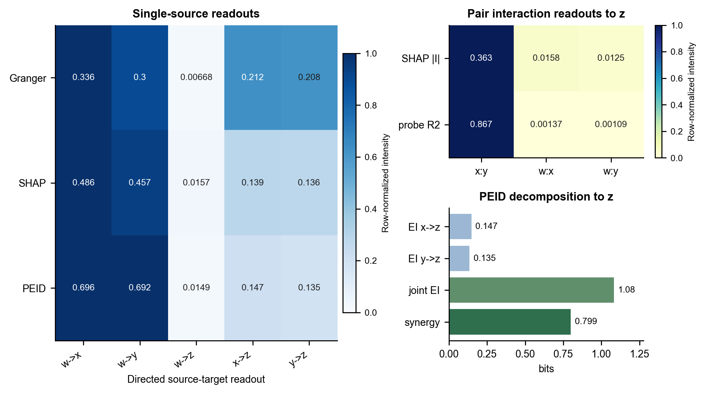
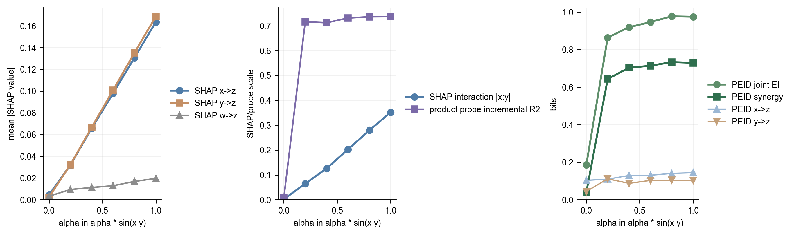
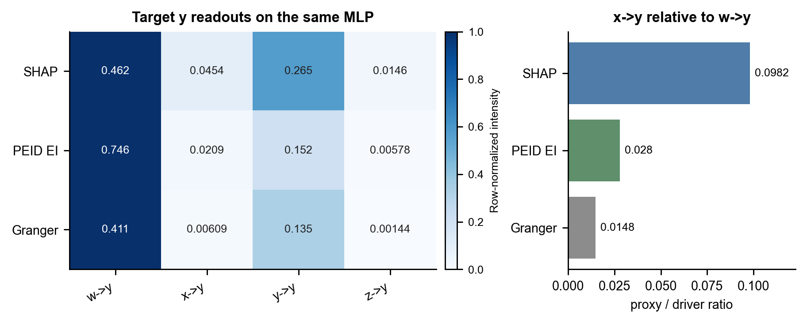

# 统一动力系统：共同驱动 + sine 协同

这个例子把两种容易混淆的结构放进同一个动力系统：一方面，`w` 是 `x`、`y` 背后的共同原因；另一方面，`x`、`y` 对 `z` 的作用不是两条可分离的 pairwise 边，而是一个二源协同项。系统为

$$
\begin{aligned}
w_{t+1} &= 0.78w_t + \eta^w_t,\\
x_{t+1} &= 0.42x_t + 0.82w_t + \eta^x_t,\\
y_{t+1} &= 0.38y_t + 0.76w_t + \eta^y_t,\\
z_{t+1} &= 0.22z_t + \alpha\sin\left(x_t y_t\right) + \eta^z_t.
\end{aligned}
$$

其中 `w` 不直接进入 `z` 的结构方程。真实机制应读成两层：

- pairwise 层面：`w -> x`、`w -> y`；
- 高阶层面：`{x, y} -> z`；
- 非结构边：`w -> z` 不是直接机制边，单独的 `x -> z`、`y -> z` 也只是 sine 协同项的 pairwise 投影。

## 读出方式

同一条模拟时间序列先用于训练一个 MLP 一步转移模型，输入为 `[x_t, y_t, z_t, w_t]`，输出为 `[x_{t+1}, y_{t+1}, z_{t+1}, w_{t+1}]`。随后在同一轨迹或固定 MLP 上读出几类量：

- Granger/ablation：把某个 source 的输入列替换为均值，记录目标预测 MSE 的增量。它回答“去掉这个变量会不会损害预测”。
- Neural Granger：对每个 target 单独训练带 group-lasso 的 cMLP，并读取第一层按 source lag group 聚合的权重范数。它回答“target-wise 非线性预测器是否使用这个 source 的历史输入”，仍是 pairwise 预测结构读出。
- SHAP 类归因：在同一 fitted MLP 上只保留一个常用背景替换式 SHAP 基线，用经验背景替换未给定特征。单特征 SHAP 报告 mean absolute attribution；二阶 SHAP interaction 报告 `x:y` 的 mean absolute interaction。前者回答“某个特征分到多少预测贡献”，后者回答“两个特征的非加性预测贡献有多大”。
- 交互项 probe：在同一 fitted MLP 的最大熵干预预测面上，用标准化主效应加一个二阶乘积项拟合目标输出，并记录该乘积项相对于主效应模型的 incremental `R^2`。它回答“固定这个预测器时，响应面是否含有可由 `x:y` 近似的二阶非加性形状”。
- PEID：先做最大熵独立干预，再计算 single-source EI、joint EI 和 synergy：

$$
\mathrm{Syn}(\{x,y\}\to z)
= EI(\{x,y\}\to z)-EI(x\to z)-EI(y\to z).
$$

- Observational SURD：直接在自然轨迹的 `(x_t,y_t,z_{t+1})` 上，按原论文方式先用 transport map 估计逐目标状态的 specific MI：

$$
R_{xy}(z)=\min\{i_x(z),i_y(z)\},\quad
U_x(z)=i_x(z)-R_{xy}(z),\quad
U_y(z)=i_y(z)-R_{xy}(z),\quad
S_{xy}(z)=i_{xy}(z)-\max\{i_x(z),i_y(z)\}.
$$

最后对目标状态积分得到 `Rxy/Ux/Uy/Sxy`，满足 `Rxy + Ux + Uy + Sxy = I({x,y};z)`。SURD 描述观测分布中的冗余、特有与协同；PEID 描述独立干预后机制映射的信息约束，两者回答的问题不同。PEID 当前定义不单独分配冗余原子，因此报告中其 redundancy 显式记为零。

独立入口 `scripts/reproduce_surd_synergistic_collider.py` 保留用于原论文 Q1 的 11 原子复现；Q1 的主导原子应为 `S23`。该验证只确认 SURD specific-MI transport-map 实现，不进入共同驱动 sine 主方法排名。

## 第一章：二源协同情形：`{x,y} -> z`

### 代表性结果

| quantity | value |
| --- | ---: |
| fitted MLP final training loss | 0.153 |
| Granger/ablation `w -> x` | 0.3711 |
| Granger/ablation `w -> y` | 0.3192 |
| Granger/ablation `w -> z` | 0.008312 |
| Granger/ablation `x -> z` | 0.2256 |
| Granger/ablation `y -> z` | 0.2072 |
| Neural Granger `w -> x` | 0.6491 |
| Neural Granger `w -> y` | 0.6591 |
| Neural Granger `w -> z` | 0.005079 |
| Neural Granger `x -> z` | 1.258 |
| Neural Granger `y -> z` | 1.216 |
| SHAP mean abs `w -> x` | 0.4956 |
| SHAP mean abs `w -> y` | 0.4614 |
| SHAP mean abs `w -> z` | 0.03569 |
| SHAP mean abs `x -> z` | 0.1816 |
| SHAP mean abs `y -> z` | 0.1746 |
| SHAP interaction mean abs `x:y -> z` | 0.3946 |
| product interaction `x:y -> z` incremental `R^2` | 0.7946 |
| product interaction `x:y -> z` coefficient | 0.3652 |
| product interaction `w:x -> z` incremental `R^2` | 0.001036 |
| product interaction `w:y -> z` incremental `R^2` | 0.0007202 |
| PEID pairwise EI `w -> x` | 0.6188 |
| PEID pairwise EI `w -> y` | 0.6915 |
| PEID pairwise EI `w -> z` | 0.007138 |
| PEID pairwise EI `x -> z` | 0.1071 |
| PEID pairwise EI `y -> z` | 0.1305 |
| PEID joint EI `{x, y} -> z` | 0.9957 |
| PEID synergy `{x, y} -> z` | 0.7581 |

图中左侧热图把 Granger、Neural Granger、SHAP 和 PEID 的单源读出放在同一组边上比较。因为各行单位不同，颜色只在每一行内部归一化，格子里的数字才是原始读数。右上角显示标准化乘积项对 `z` 的增量解释度：`x:y` 明显高于 `w:x` 与 `w:y`。右下角显示 PEID 对 `z` 的信息分解，联合 EI 与 synergy 高于单源 EI。

### alpha 扫描：SHAP 交互与 PEID 协同

Neural Granger 单图单独展示 target-wise cMLP 的 first-layer source-group norm。该读数在 `alpha=0.2` 和 `alpha=0.8` 处把 sine 协同响应投影到 `x->z`、`y->z` 两条 pairwise 边，而 `w->z` 保持较低，说明它更像预测结构读出而不是源集合干预语义下的协同分解。

| alpha | SHAP `x->z` | SHAP `y->z` | SHAP `w->z` | SHAP interaction `|x:y|` | Granger `x->z` | Granger `y->z` | Granger `w->z` | Neural Granger `x->z` | Neural Granger `y->z` | Neural Granger `w->z` | TM PEID joint EI `{x,y}->z` | TM PEID synergy `{x,y}->z` | TM PEID `w->z` |
| ---: | ---: | ---: | ---: | ---: | ---: | ---: | ---: | ---: | ---: | ---: | ---: | ---: | ---: |
| 0.00 | 0.001942 | 0.001324 | 0.0007372 | 0.0006254 | 1.843e-05 | 1.302e-05 | 1.777e-05 | 0.00401 | 0.001838 | 0.001802 | 0.08449 | 0.01985 | 0.02464 |
| 0.20 | 0.03113 | 0.03195 | 0.01068 | 0.05843 | 0.008518 | 0.008888 | 0.0001599 | 1.379 | 1.513 | 0.1148 | 0.532 | 0.4755 | 0.05535 |
| 0.40 | 0.06357 | 0.06288 | 0.01511 | 0.139 | 0.03565 | 0.03363 | 0.001393 | 0.002616 | 0.002186 | 0.003615 | 0.5887 | 0.5323 | 0.04073 |
| 0.60 | 0.09526 | 0.09575 | 0.02041 | 0.2181 | 0.07952 | 0.07362 | 0.00362 | 0.001875 | 0.002594 | 0.001373 | 0.6143 | 0.5381 | 0.03565 |
| 0.80 | 0.127 | 0.1283 | 0.02525 | 0.2961 | 0.1417 | 0.1317 | 0.006221 | 1.044 | 0.9415 | 0.02982 | 0.619 | 0.5468 | 0.03178 |
| 1.00 | 0.1588 | 0.1605 | 0.03084 | 0.3733 | 0.2229 | 0.2085 | 0.009188 | 0.003042 | 0.008678 | 0.00208 | 0.6167 | 0.5529 | 0.03054 |

这里的 `alpha` 是 sine 项前面的强度系数。`alpha=0` 时，`z` 只剩自身记忆与噪声，SHAP 二阶交互接近零；TM PEID 仅保留少量连续估计底噪。随着 `alpha` 增大，SHAP 单源 `x->z`、`y->z` 与 SHAP interaction 同时上升，但单源项是对协同响应的归因分摊，不是结构边；Granger/ablation 的 `x->z`、`y->z` 也会随 `alpha` 上升，因为它衡量单源置换对 fitted MLP 预测误差的影响；Neural Granger 的 cMLP group norm 同样是 pairwise 预测结构读出，会把 sine 协同响应投影到 `x->z` 与 `y->z`；这里的 PEID 曲线改用连续 transport-map EI，在同一最大熵联合干预样本上直接读出 `{x,y}` 对连续目标预测的机制信息约束。

### beta 扫描：共同驱动增强但结构协同固定

这里固定 `alpha=1`，只改变 `x,y` 的共同驱动强度 `beta`。生成式中 `beta` 增大只让 `x` 与 `y` 在观测轨迹上更相关，并没有增强 `z_{t+1}` 中的 `sin(x_t y_t)` 结构项。因此理论预期是：`{x,y}->z` 的 PEID 协同不应因为 `beta` 增大而单调增加。

beta 扫描对应的动力学为

$$
\begin{aligned}
w_{t+1} &= 0.78w_t + \eta^w_t,\\
x_{t+1} &= 0.42x_t + 0.82\left(\beta w_t + \sqrt{1-\beta^2}\,\xi^x_t\right) + \eta^x_t,\\
y_{t+1} &= 0.38y_t + 0.76\left(\beta w_t + \sqrt{1-\beta^2}\,\xi^y_t\right) + \eta^y_t,\\
z_{t+1} &= 0.22z_t + \sin\left(x_t y_t\right) + \eta^z_t.
\end{aligned}
$$

其中 `beta=0` 时，`x` 与 `y` 主要由各自私有扰动驱动；`beta=1` 时，它们的新增驱动完全共享同一个 `w_t`。`\sqrt{1-\beta^2}` 是 `beta` 的互补私有驱动权重，使共享驱动项和私有驱动项的平方权重和保持为 1；这样 beta 扫描主要改变源变量之间的观测相关性，而不是简单放大或缩小 `x,y` 的总驱动强度。`z` 的结构项始终是同一个 `sin(x_t y_t)`，因此 beta 不改变二源机制本身。

| beta | corr(`x`,`y`) | observational WMS | SHAP `x` | SHAP `y` | SHAP `x:y` | Neural Granger `x/y->z` | PCMCI-CMIknn `x/y/w->z` | SURD R/Ux/Uy/S | MLP+PEID Ux/Uy/S |
| ---: | ---: | ---: | ---: | ---: | ---: | --- | --- | --- | --- |
| 0.00 | 0.01436 | 0.5862 | 0.09309 | 0.0856 | 0.1803 | 1.636/1.627 | 0.2242/0.2299/0.003024 | 0.003486/0.003278/0.007816/0.1935 | 0.0126/0.009989/0.5657 |
| 0.20 | 0.1014 | 0.5943 | 0.09906 | 0.09415 | 0.2094 | 1.535/1.582 | 0.1556/0.1642/0.002715 | 0.004451/0.001839/0.008352/0.2037 | 0.01241/0.01089/0.5624 |
| 0.40 | 0.3089 | 0.5903 | 0.1177 | 0.1171 | 0.2919 | 1.623/1.584 | 0.1403/0.1564/0.002716 | 0.002588/0.002315/0.005618/0.302 | 0.007841/0.006555/0.5812 |
| 0.60 | 0.5427 | 0.4562 | 0.1435 | 0.1429 | 0.4229 | 0.9167/0.9461 | 0.1144/0.1353/0.002189 | 0.001861/0.002627/0.004727/0.3991 | 0.01201/0.01212/0.5859 |
| 0.80 | 0.7463 | 0.2195 | 0.1519 | 0.1581 | 0.538 | 1.061/1.107 | 0.08539/0.1027/0.002883 | 0.007804/0.002845/0.007263/0.1592 | 0.01808/0.01729/0.5971 |
| 1.00 | 0.9052 | -0.05886 | 0.167 | 0.175 | 0.4702 | 1.547/1.558 | 0.04799/0.0593/0.002557 | 0.004404/0.004633/0.004019/0.02776 | 0.03436/0.03172/0.5977 |

每个 `beta × seed` 只生成一次轨迹并训练一个 MLP。Observational SURD 直接作用于这条自然轨迹；左上角 WMS 也直接使用该自然轨迹上对齐的 `(x_t,y_t,z_{t+1})`，计算 `I([x_t,y_t];z_{t+1}) - I(x_t;z_{t+1}) - I(y_t;z_{t+1})`。三个 MI 均由相同的四分位离散经验联合分布直接计算，并保留 WMS 负值；MLP+SHAP 与 MLP+PEID 共享同一个 fitted MLP，PEID 与 Oracle+PEID 共享同一组独立干预源样本。Neural Granger 在同一自然轨迹上训练 target-wise cMLP，并以 first-layer source-group norm 作为 pairwise 读出。PCMCI-CMIknn 在同一自然轨迹上运行非线性条件独立检验，图中显示 lag-1 pairwise 依赖强度的绝对值。SURD 与 PEID 的 transport-map 输入均为原始源变量，信息量单位统一为 bits。SHAP、Neural Granger 与 PCMCI-CMIknn 保留自身原始读出尺度，不与信息量绝对值直接比较。

线性趋势读数显示，observational WMS 的 beta 斜率为 -0.6405 (bootstrap 95% CI [-0.7826, -0.4787])；SHAP interaction 的 beta 斜率为 0.3666 (bootstrap 95% CI [0.2956, 0.4617])；Observational SURD synergy 的 beta 斜率为 -0.1236 (bootstrap 95% CI [-0.249, 0.04224])；PCMCI-CMIknn `x/y->z` 合计强度的 beta 斜率为 -0.3108 (bootstrap 95% CI [-0.3379, -0.2695])；MLP+PEID synergy 的 beta 斜率为 0.03836 (bootstrap 95% CI [-0.01003, 0.08451])。

验证图中的 Oracle+PEID 只用于检查 learned MLP 的 PEID 趋势是否偏离真实转移方程；SURD Q1 原子用于确认原论文 specific-MI transport-map 复现入口。二者都不进入主方法排名。

### 解释

`w -> x` 和 `w -> y` 在 Granger/ablation、Neural Granger 与 PEID pairwise EI 中都很强，说明预测器学到了共同驱动结构。`w -> z` 很小，符合结构方程中 `w` 不直接进入 `z` 的设定；若某些归因方法给出非零 `w -> z`，应解释为 `w` 通过诱导 `x,y` 相关性形成的代理贡献，而不是直接结构边。

对 `z` 来说，Granger/ablation 和 Neural Granger 会给出明显的 `x -> z` 与 `y -> z`，SHAP 类单特征归因也会倾向把 sine 项拆成单变量贡献。交互项 probe 则能进一步指出 fitted MLP 的响应面中确实存在强 `x:y` 二阶非加性项，因此它比纯单特征 SHAP 更接近“有交互”的诊断；但它仍然是响应面形状分析，不是源侧最大熵干预语义下的机制信息分解。这些读出有预测解释价值，但它们把

$$
\alpha\sin(x_t y_t)
$$

投影成了 pairwise 贡献或低阶乘积项，不能单独表达“只有联合给定 `x_t` 和 `y_t` 时才稳定确定目标响应”的机制事实。

PEID 的关键读数是 `EI({x, y} -> z)` 与 `Syn({x, y} -> z)` 均显著高于单源投影。它说明联合干预 `{x,y}` 后，目标分布的约束远超过两个单源 EI 的加和。因此这个例子的结论不是“PEID 消除了所有代理效应”，而是：在同一个 learned transition surrogate 上，PEID 可以同时保留 `w -> x,y` 的共同驱动边，以及 `{x,y} -> z` 的协同超边；Granger、Neural Granger 和 SHAP 单特征方法主要给出预测贡献的 pairwise 投影，交互项 probe 可以提示 `x:y` 非加性存在，但 PEID 才把这个非加性读成源集合到目标的协同有效信息。

## 第二章：代理变量情形：`x` 作为 `w -> y` 的 proxy

同一个动力系统还包含一个不需要额外造数的代理变量实验。对目标 `y_{t+1}`，结构方程中有直接项 `w_t -> y_{t+1}` 与自回归项 `y_t -> y_{t+1}`，但没有 `x_t -> y_{t+1}`。不过 `x_t` 由自相关的 `w` 驱动，因此在观测分布上是 `w_t` 的代理变量。

| method | `w->y` true driver | `x->y` proxy | `y->y` memory | `x/w` ratio |
| --- | ---: | ---: | ---: | ---: |
| SHAP | 0.4614 | 0.01679 | 0.3203 | 0.03639 |
| PEID EI | 0.6915 | 0.01548 | 0.1752 | 0.02239 |
| Granger | 0.3192 | 0.003122 | 0.1357 | 0.009779 |

这里不再区分不同 SHAP 口径，只保留当前应用最常见的背景替换式 SHAP 基线。该读出在同一 fitted MLP 上计算 mean absolute attribution，用来表示特征对预测输出的平均贡献；PEID 使用最大熵独立干预读出，主要保留直接 driver `w->y` 与自回归 `y->y`，而不是把观测 proxy 当作强机制边。
