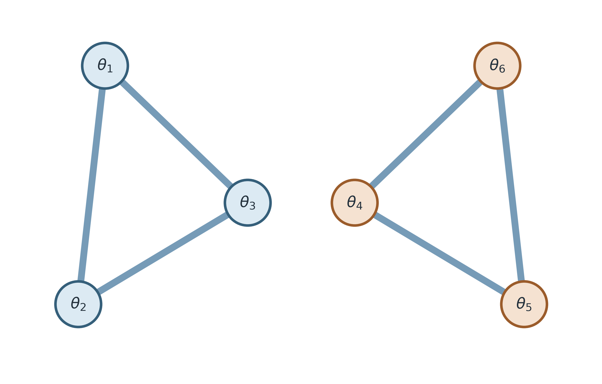
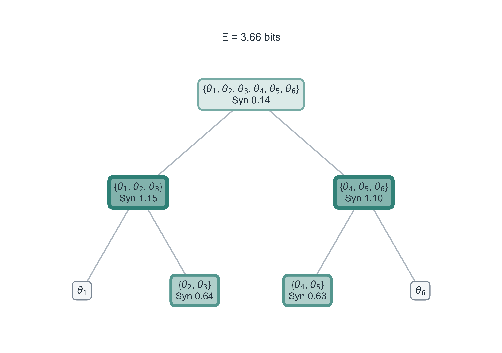
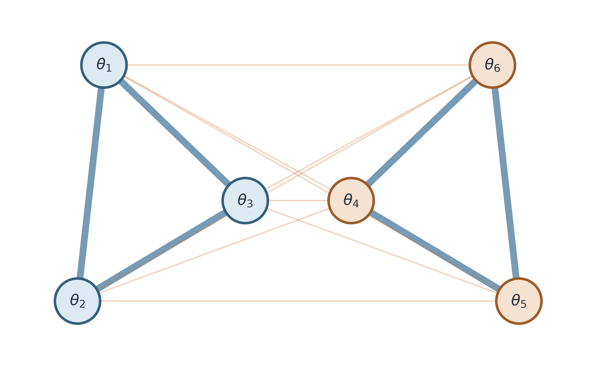
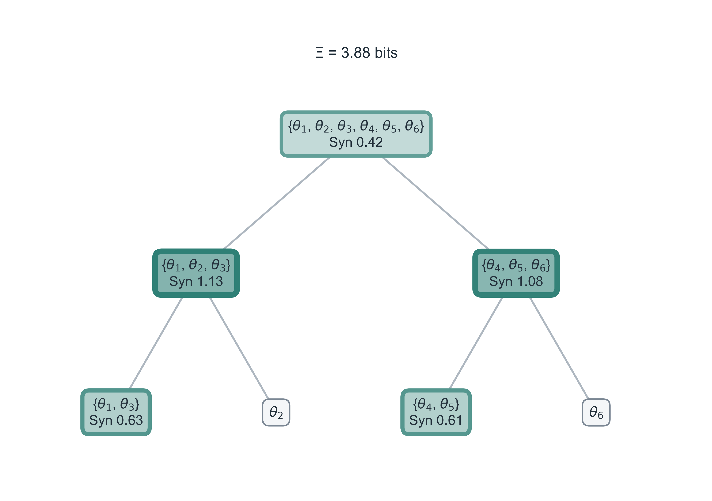
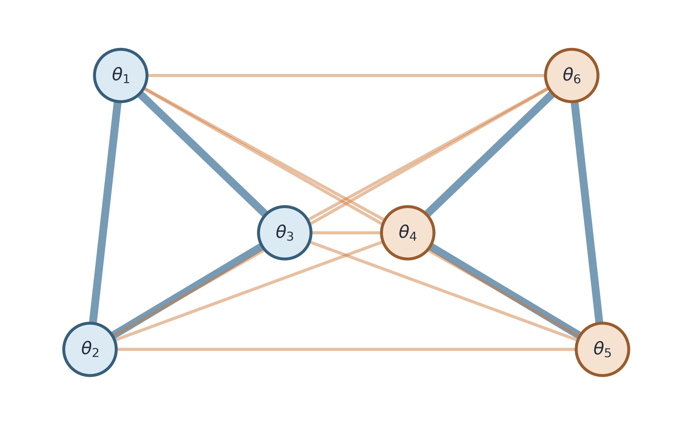
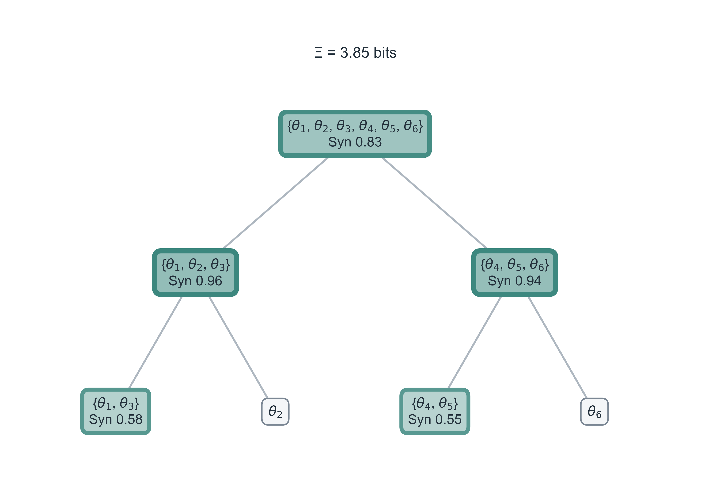
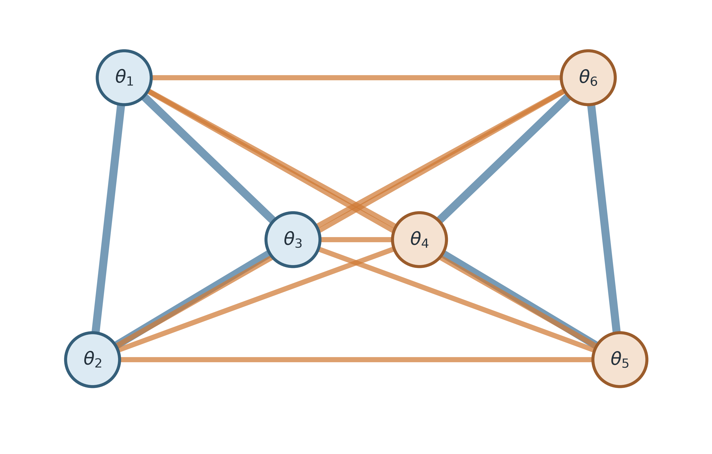
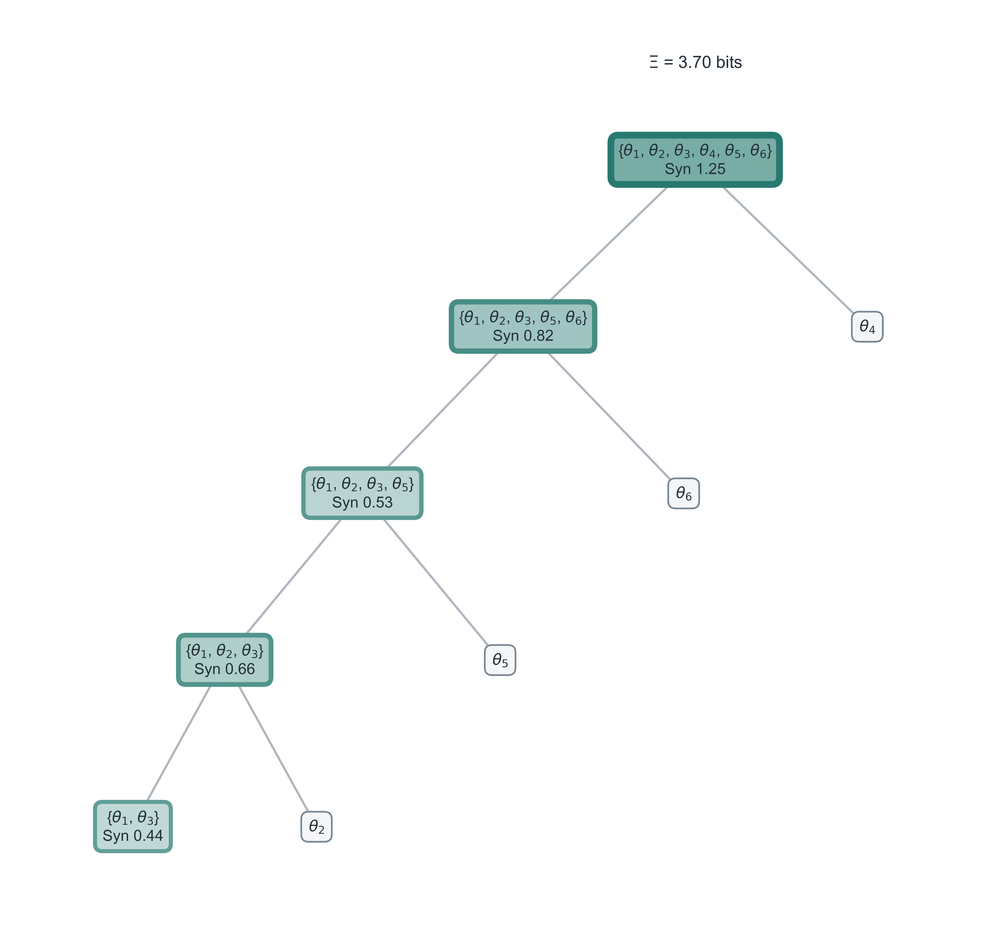

# Kuramoto 网络结构与整合信息层级分解

## 1. 模型与可视化约定

考虑六个异质 Kuramoto 振子：

$$
\dot{\theta}_i
=
\omega_i
+
\sum_j K_{ij}\sin(\theta_j-\theta_i).
$$

振子被预设为两个三节点模块
$\{\theta_1,\theta_2,\theta_3\}$ 与
$\{\theta_4,\theta_5,\theta_6\}$。模块内总耦合固定为
$K_{\mathrm{in}}=1.5$，所以每条模块内边的权重为 $0.75$；仅改变模块间总耦合
$K_{\mathrm{out}}$，每条跨模块边的权重为 $K_{\mathrm{out}}/3$。

左图展示实际耦合网络：蓝边为模块内连接，橙边为跨模块连接，边宽随耦合权重增加。右图展示同一条件下算法得到的层级分解：

- 整体整合信息 $\Xi$ 独立放在树的上方，不属于任何树节点；
- 每个非叶节点只标记该子集及其局部 `Syn`；
- `Syn` 越大，节点填色越深、边框越粗；四棵树共用同一个颜色与线宽标尺；
- 灰色叶节点是单个振子，不承载高阶 `Syn`；
- 图中使用原始 `Syn` 数值，没有为着色进行截断或重标定。

本报告中的树使用 seed 0 的配对数据，以保持四种网络结构的输入与噪声可比。每个条件均采用 1,200 个样本、独立均匀相位干预、噪声尺度 0.08，以及二阶三角 transport map 估计。树中各节点的 `Syn` 相加得到该条件的 $\Xi$。

## 2. 不同网络结构的结果

### 2.1 无跨模块耦合：$K_{\mathrm{out}}=0$

| 网络连边 | 层级分解树 |
|:---:|:---:|
|  |  |

网络由两个完全断开的三节点模块组成。树的根立即恢复为对应的 3–3 分裂；较深颜色集中在两个模块内部，而根节点 `Syn` 仅为 0.14 bits。这说明主要协同由模块内部承担，跨模块高阶协同很弱。

### 2.2 弱跨模块耦合：$K_{\mathrm{out}}=0.25$

| 网络连边 | 层级分解树 |
|:---:|:---:|
|  |  |

加入较弱的跨模块边后，树仍稳定恢复原有的 3–3 模块结构；根节点 `Syn` 增至 0.42 bits，并呈现更深的颜色与更粗的边框。网络的跨模块相互作用已经进入整体协同，但尚未改变主分裂结构。

### 2.3 中等跨模块耦合：$K_{\mathrm{out}}=0.75$

| 网络连边 | 层级分解树 |
|:---:|:---:|
|  |  |

跨模块边进一步增强，根节点 `Syn` 上升至 0.83 bits，已接近两个模块内部三阶节点的 `Syn`。树仍保持 3–3 根分裂，但颜色分布表明整体协同正在从“模块内部主导”过渡到“跨模块贡献显著”。

### 2.4 强跨模块耦合：$K_{\mathrm{out}}=1.5$

| 网络连边 | 层级分解树 |
|:---:|:---:|
|  |  |

强跨模块连接使原有模块边界不再对应最优根分裂。树转为更深的混合层级，根节点 `Syn` 达到 1.25 bits，并成为四种条件中颜色最深、边框最粗的节点。此时结构已经从两个相对独立模块转向全局耦合主导。

## 3. 定量对照

| $K_{\mathrm{out}}$ | 单条跨模块边 | seed 0 的 $\Xi$ | seed 0 的根 `Syn` | seed 0 的根分裂 | 三个 seed 恢复 3–3 分裂 |
|---:|---:|---:|---:|:---|---:|
| 0.00 | 0.0000 | 3.663 | 0.144 | 3–3 | 3/3 |
| 0.25 | 0.0833 | 3.876 | 0.423 | 3–3 | 3/3 |
| 0.75 | 0.2500 | 3.854 | 0.827 | 3–3 | 3/3 |
| 1.50 | 0.5000 | 3.701 | 1.255 | 5–1 | 0/3 |

三个配对 seed 的结果进一步支持图中的变化：当 $K_{\mathrm{out}}$ 从 0 增至 1.5，模块内 `Syn` 质量占比由 $0.960\pm0.002$ 降至 $0.299\pm0.001$，跨模块占比由 $0.040\pm0.002$ 升至 $0.701\pm0.001$；根节点 `Syn` 则由 $0.145\pm0.009$ bits 增至 $1.273\pm0.019$ bits（均值 $\pm$ SEM）。

## 4. 结论与边界

这组图能够直观地区分三类结构状态：断开的模块、保留模块边界但跨模块协同逐渐增强、以及强耦合下模块边界被重组。$\Xi$ 的总量变化不大，但 `Syn` 在树上的位置发生显著迁移，因此层级树比单独报告 $\Xi$ 更能揭示结构差异。

该树是由子集整合信息构造的贪心层级表示，适合表达嵌套协同，但不是物理网络连边的逐边复制，也不能同时表达所有可能重叠的非层级子集。图中的单个树来自代表性 seed；跨 seed 的稳定性应结合根分裂恢复率和汇总统计共同判断。
