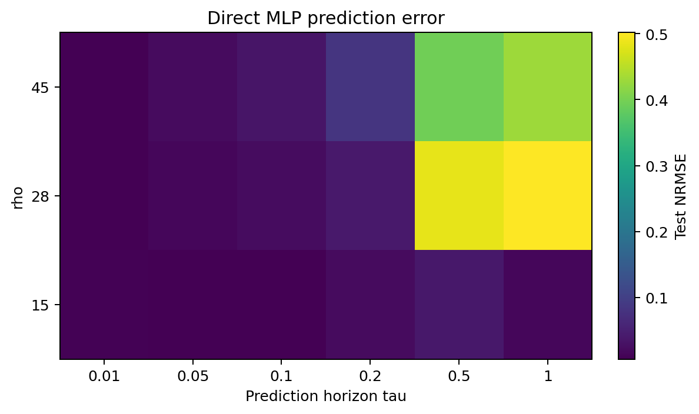
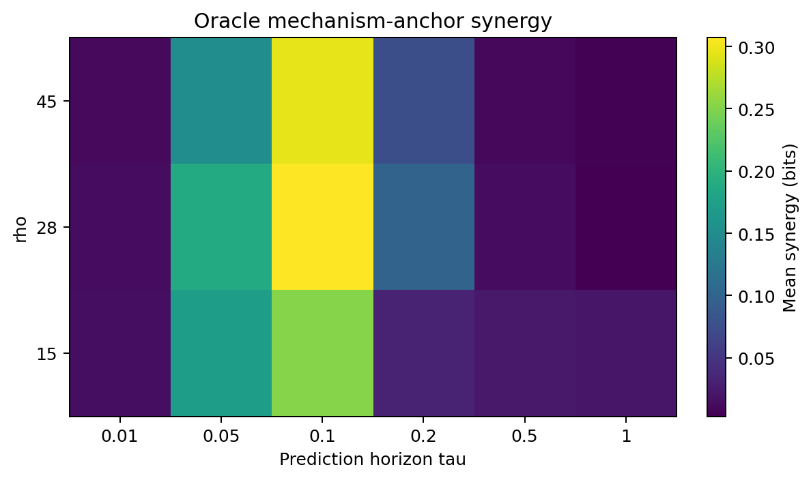
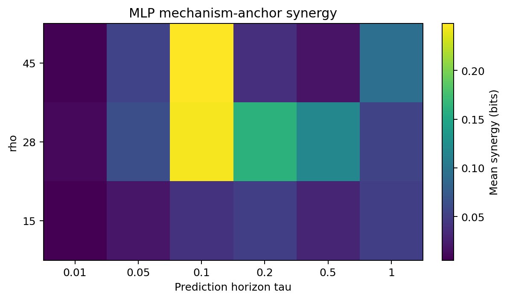
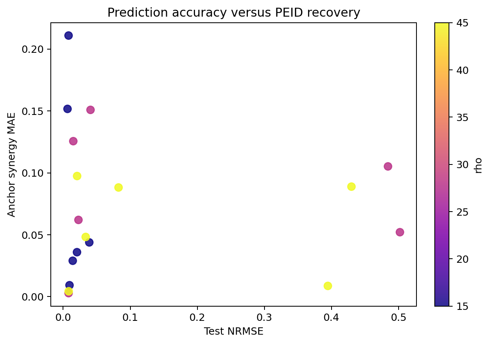
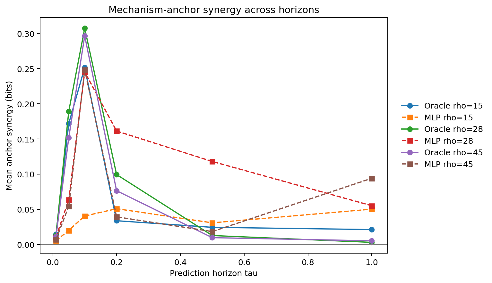

# Lorenz-3D 多步 MLP+PEID 实验

本实验仅使用自然轨迹训练每个 horizon 的直接预测 MLP，并在独立均匀干预盒上比较 Oracle 与 MLP+PEID。

## 协议

- rho: `[15.0, 28.0, 45.0]`
- horizon: `[0.01, 0.05, 0.1, 0.2, 0.5, 1.0]`
- training seeds: `[0]`
- intervention samples: `500`
- PEID 解释：确定性连续映射上的有限样本、有限分辨率估计，不解释为精确连续 EI。

## 预测摘要

最低测试 NRMSE 为 0.0065，对应 rho=15、tau=0.05。

| rho | tau | NRMSE | R2 |
| ---: | ---: | ---: | ---: |
| 15 | 0.01 | 0.0095 | 0.9998 |
| 15 | 0.05 | 0.0065 | 0.9999 |
| 15 | 0.1 | 0.0081 | 0.9998 |
| 15 | 0.2 | 0.0206 | 0.9989 |
| 15 | 0.5 | 0.0389 | 0.9959 |
| 15 | 1 | 0.0143 | 0.9995 |
| 28 | 0.01 | 0.0081 | 0.9998 |
| 28 | 0.05 | 0.0151 | 0.9995 |
| 28 | 0.1 | 0.0228 | 0.9988 |
| 28 | 0.2 | 0.0408 | 0.9961 |
| 28 | 0.5 | 0.4843 | 0.4298 |
| 28 | 1 | 0.5021 | 0.4179 |
| 45 | 0.01 | 0.0082 | 0.9997 |
| 45 | 0.05 | 0.0208 | 0.9980 |
| 45 | 0.1 | 0.0336 | 0.9946 |
| 45 | 0.2 | 0.0826 | 0.9673 |
| 45 | 0.5 | 0.3947 | 0.2818 |
| 45 | 1 | 0.4298 | 0.0241 |

## PEID 摘要

机制锚点的平均 Oracle--MLP 协同绝对误差为 0.0730 bits。

## 图表

## 结论边界

短 horizon 的 `{x,z}->y` 与 `{x,y}->z` 是机制锚点；长 horizon 的协同表示有限时间流映射的联合状态约束。预测误差低不自动意味着干预域中的机制恢复准确。
