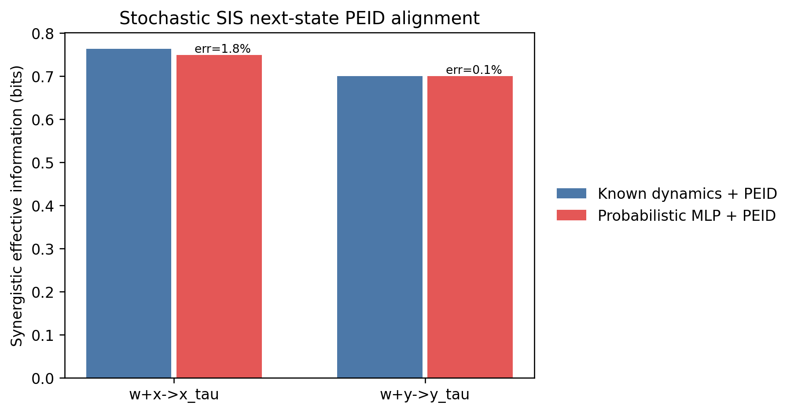

# SIS 下一状态 PEID 对齐实验

本实验比较已知随机 SIS 动力学与概率 MLP 所定义的有限时间转移通道。输入输出间隔为 `tau=1.0`，即 50 个 RK4 步。

随机性来自 SIS 动力学过程噪声：每个积分步加入标准差为 `0.05 * sqrt(dt)` 的 Wiener 增量。PEID 估计阶段不额外添加噪声。概率 MLP 使用条件高斯负对数似然学习完整的未来状态分布，而不是只学习条件均值。

训练输入由等量自然轨迹状态和独立均匀干预域状态组成。Oracle 与 MLP 均以当前完整状态为输入，以 $\mathbf{x}(t+\tau)$ 为目标。

| 关系 | 已知动力学 PEID | MLP+PEID | 相对误差 |
| --- | ---: | ---: | ---: |
| `w+x->x_tau` | 0.7631 | 0.7496 | 1.77% |
| `w+y->y_tau` | 0.6999 | 0.7002 | 0.05% |

验收阈值为每条目标关系相对误差不超过 20%。本次结果：**通过**。

该结果支持一个有限结论：当训练分布覆盖 PEID 干预域、MLP 学习随机有限时间转移分布时，MLP+PEID 可以在 SIS 系统上逼近已知动力学 PEID。它不代表所有经典系统都自动满足这一性质。
