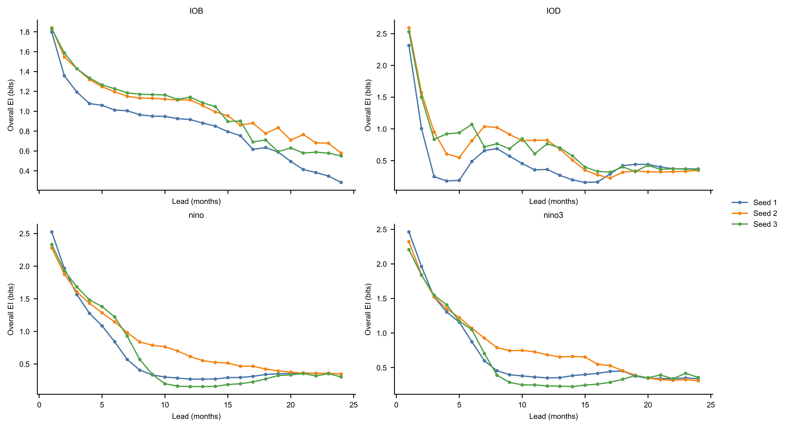
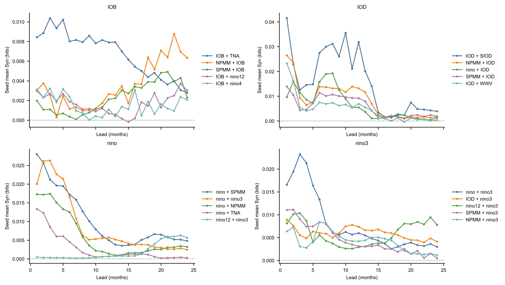

# UniCM Modeformer 全历史 EI/Syn 关键结果

## 核心结论

在 frozen UniCM Modeformer 上，用全历史最大熵干预评估 12 个月历史 mode 输入对未来 24 个月输出的机制信号。当前最可保留的设置是 `intervention_bound=4.0`、`1024` samples、checkpoint seeds `1,2,3`、CPU 推理。

主要结论是：IOB 是最稳定的目标 mode。它的 full-history overall EI 在 `1..24` lead 平均为 `0.969541` bits，在 `6..18` lead 平均为 `0.980145` bits；seed 间曲线相关和 lead 排序都高度一致。二源 mode-pair Syn 的量级比 overall EI 小一个到两个数量级，因此更适合作为候选机制筛查，而不是最终 PEID 分解结论。

对 ENSO 相关 target（`nino` 与 `nino3`），结果支持一个更谨慎的解释：NPMM/TNA 的信号确实出现在 ENSO 的 EI/Syn 结构中，但更像对 ENSO 自身状态或赤道太平洋 mode 的远程调制，而不是 `NPMM + TNA` 两个外部 mode 单独构成强二源协同驱动。

## 干预与读数口径

每个干预样本同时采样 12 个历史月份和 11 个 UniCM mode 维度，形成完整的 mode-history 输入。该历史张量写入 Modeformer encoder 的 12 个月历史段，未来 24 个月由 decoder 在 `train=False` 下自回归生成。

overall EI 读数衡量完整历史 mode 输入对单个目标 mode、单个 lead 输出的有效信息。由于源维度较高，这里使用 Gaussian log-det MI 作为快速筛查口径。mode-pair Syn 使用两个 source mode 的 12 个月历史向量作为二源输入，其他 mode 作为同一最大熵 ensemble 中的 nuisance variables 被边缘化。

## Full-history overall EI

| Target | mean EI 1..24 | mean EI 6..18 | Pearson min | Spearman min | top-3 overlap min |
|---|---:|---:|---:|---:|---:|
| IOB | 0.969541 | 0.980145 | 0.979 | 0.989 | 3 |
| nino3 | 0.707364 | 0.506813 | 0.930 | 0.451 | 3 |
| nino | 0.698131 | 0.468970 | 0.952 | 0.483 | 3 |
| IOD | 0.630610 | 0.560768 | 0.846 | 0.317 | 2 |

*图 1. Full-history overall EI lead 曲线。每个面板对应一个目标 mode，三条曲线对应 checkpoint seeds `1,2,3`。IOB 不仅在平均 EI 上最高，而且三条曲线从短 lead 到长 lead 的下降结构最一致。*

物理解释上，IOB 表示热带印度洋盆尺度 SST。它在 UniCM 的 learned mechanism 中表现出接近 1 bit 的整体有效信息，说明模型输出的 IOB 未来演化强烈依赖完整历史气候 mode 状态，而不是只由局部噪声或单一 lead 偏差驱动。曲线随 lead 增加整体下降，符合可预报性随时间递减的直觉；同时 seed 间排序稳定，说明该下降结构更像模型机制中的稳定记忆读数，而不是单个 checkpoint 的偶然形状。

nino 和 nino3 的短 lead EI 较高并快速衰减，说明太平洋 ENSO 相关目标在模型中主要携带短期记忆信号。IOD 的短 lead EI 也很高，但中长 lead 曲线更起伏，提示印度洋偶极子在该模型里可能更依赖阶段性耦合或非线性状态，而不是平滑单调的全历史记忆。

## UniCM mode 地理映射

*图 2. UniCM mode 输入的地理经纬区域。前 10 个 mode 来自 SST 区域指数，第 11 个 WWV-like mode 来自 t20d/so20chgt。*

这些区域让 EI/Syn 结果具有可解释的物理含义。IOB、IOD、SIOD 对应印度洋盆尺度或偶极型 SST 结构；nino、nino12、nino3、nino4 和 WWV 对应赤道太平洋 ENSO 相关热状态；NPMM、SPMM 和 TNA 则分别提供太平洋经向模态与热带北大西洋背景。因而，mode-pair Syn 的高值组合可以被解读为跨盆地或同盆地不同区域共同约束目标 mode 的候选机制。

## Full-history mode-pair Syn

| Target | Rank 1 | mean Syn | Rank 2 | mean Syn | Rank 3 | mean Syn |
|---|---|---:|---|---:|---|---:|
| IOB | IOB + TNA | 0.006756 | NPMM + IOB | 0.003512 | SPMM + IOB | 0.002265 |
| IOD | IOD + SIOD | 0.015832 | NPMM + IOD | 0.008335 | nino + IOD | 0.006568 |
| nino | nino + SPMM | 0.010349 | nino + nino3 | 0.008912 | nino + NPMM | 0.006007 |
| nino3 | nino + nino3 | 0.008014 | IOD + nino3 | 0.005958 | nino12 + nino3 | 0.005884 |

*图 3. 每个目标 mode 的 top mode-pair Syn lead 曲线。曲线为 checkpoint seed 均值，横轴为预测 lead，纵轴为 Gaussian log-det Syn。*

mode-pair Syn 的主要物理读法如下：

- IOB 的最高组合是 `IOB + TNA`，随后是 `NPMM + IOB` 和 `SPMM + IOB`。这说明 IOB 目标主要由自身历史提供信息，TNA 或太平洋经向模态提供较弱但可见的二源补充信号。
- IOD 的最高组合是 `IOD + SIOD`。这有明确物理含义：IOD 和 SIOD 都是印度洋偶极型 SST 结构，二者共同约束 IOD 输出时可能捕捉到热带印度洋与南印度洋之间的形态协同。
- nino 的最高组合是 `nino + SPMM`，其次是 `nino + nino3` 和 `nino + NPMM`。这与 ENSO 和太平洋经向模态之间的已知耦合方向一致：目标 nino 的未来状态不仅包含赤道太平洋自身记忆，也受南北太平洋背景态调制。
- nino3 的最高组合是 `nino + nino3`，说明 nino3 输出的二源候选机制首先来自 ENSO 相关指数之间的内部协同；`IOD + nino3` 和 `nino12 + nino3` 则分别指向印度洋-太平洋跨盆地联系和赤道太平洋内部东西向结构。

## ENSO target EI/Syn insight

原文命题认为，在强厄尔尼诺事件发生前，NPMM 和 TNA 与 ENSO 的相互作用增强。以 UniCM Modeformer 的 full-history maximum-entropy 机制读数来看，这个命题得到的是有条件的支持：NPMM/TNA 的信号确实出现在 ENSO target 的 EI/Syn 结构中，但更像对 ENSO 自身状态或赤道太平洋 mode 的远程调制，而不是 `NPMM + TNA` 两个外部 mode 单独构成强二源协同驱动。

具体地，`nino` target 中 `nino + NPMM` 的平均 Syn 为 `0.006007` bits，`nino + TNA` 为 `0.002799` bits，分别排在该 target 的前列；但 `NPMM + TNA` 直接到 `nino` 的平均 Syn 只有 `-0.000034` bits。`nino3` target 也类似：`NPMM + nino3` 为 `0.004185` bits，`TNA + nino3` 为 `0.000975` bits，而 `NPMM + TNA` 直接到 `nino3` 为 `-0.000424` bits。由此得到的新 insight 是：NPMM/TNA 对 ENSO 的贡献不宜表述为两个远程 mode 本身的强协同，而应表述为它们在 ENSO 已有背景态、赤道太平洋热状态和区域 ENSO 指数共同存在时提供增益。

### EI 证据：ENSO target 主要携带短中期记忆

| Target | mean EI 1..24 | mean EI 6..18 | Pearson min | Spearman min | top-3 overlap min |
|---|---:|---:|---:|---:|---:|
| nino | 0.698131 | 0.468970 | 0.952 | 0.483 | 3 |
| nino3 | 0.707364 | 0.506813 | 0.930 | 0.451 | 3 |

*图 4. `nino` 与 `nino3` target 的 full-history overall EI lead 曲线。彩色细线为 checkpoint seed，黑线为 seed mean，阴影为 seed standard deviation。两个 ENSO target 都在短 lead 具有较高 EI，随后快速衰减并在中长 lead 进入较低平台。*

这个趋势说明，UniCM learned mechanism 对 ENSO target 的有效信息主要集中在短中期。`nino` 和 `nino3` 在 lead 1 到 6 个月的 EI 明显高于后期，符合 ENSO 预测中短期记忆强、长期不确定性上升的物理直觉。与此同时，`nino` 和 `nino3` 的 Pearson 相关较高但 Spearman 排序不足，说明不同 checkpoint 对整体衰减形状一致，但对具体 lead 优先级的排序仍有不确定性。

### 单源 EI：NPMM 是更稳定的远程信号，TNA 更像弱调制项

| Target | self EI | strongest non-self sources | NPMM EI | TNA EI |
|---|---:|---|---:|---:|
| nino | 0.476540 | IOD 0.023806; nino12 0.022249; nino4 0.021995; NPMM 0.020633 | 0.020633 | 0.010692 |
| nino3 | 0.477284 | nino4 0.024784; NPMM 0.024031; IOD 0.023595; nino12 0.023010 | 0.024031 | 0.012799 |

*图 5. ENSO target 的非自身 source EI 排名。红色突出 NPMM 和 TNA；蓝色突出与 ENSO 或太平洋热状态相关的 mode。*

单源 EI 显示，ENSO 自身区域指数仍是主要信息来源：`nino` 对自身历史的 EI 约为 `0.476540` bits，`nino3` 对自身历史的 EI 约为 `0.477284` bits。排除自身后，NPMM 在两个 ENSO target 上都处于前列，说明北太平洋经向模态在 UniCM 中确实携带 ENSO 输出的远程信息。TNA 的单源 EI 较小，说明它不是最强的独立 ENSO source；它更可能通过与 ENSO 背景态或其他太平洋 mode 的组合产生可见影响。

### Syn 证据：增强主要发生在 ENSO 背景态参与时

| Target | Source pair | rank | mean Syn | joint EI | left EI | right EI |
|---|---|---:|---:|---:|---:|---:|
| nino | nino + SPMM | 1 | 0.010349 | 0.504303 | 0.476540 | 0.017415 |
| nino | nino + nino3 | 2 | 0.008912 | 0.503791 | 0.476540 | 0.018340 |
| nino | nino + NPMM | 3 | 0.006007 | 0.503180 | 0.476540 | 0.020633 |
| nino | nino + TNA | 4 | 0.002799 | 0.490031 | 0.476540 | 0.010692 |
| nino | nino12 + nino3 | 5 | 0.001859 | 0.042447 | 0.022249 | 0.018340 |
| nino | NPMM + nino3 | 10 | 0.001039 | 0.040012 | 0.020633 | 0.018340 |
| nino | TNA + nino3 | 16 | 0.000573 | 0.029605 | 0.010692 | 0.018340 |
| nino | NPMM + TNA | 34 | -0.000034 | 0.031292 | 0.020633 | 0.010692 |
| nino3 | nino + nino3 | 1 | 0.008014 | 0.500480 | 0.015182 | 0.477284 |
| nino3 | IOD + nino3 | 2 | 0.005958 | 0.506837 | 0.023595 | 0.477284 |
| nino3 | nino12 + nino3 | 3 | 0.005884 | 0.506178 | 0.023010 | 0.477284 |
| nino3 | SPMM + nino3 | 4 | 0.004530 | 0.498129 | 0.016316 | 0.477284 |
| nino3 | NPMM + nino3 | 5 | 0.004185 | 0.505500 | 0.024031 | 0.477284 |
| nino3 | nino + NPMM | 10 | 0.001282 | 0.040495 | 0.015182 | 0.024031 |
| nino3 | nino + TNA | 12 | 0.001125 | 0.029106 | 0.015182 | 0.012799 |
| nino3 | TNA + nino3 | 15 | 0.000975 | 0.491058 | 0.012799 | 0.477284 |
| nino3 | NPMM + TNA | 49 | -0.000424 | 0.036406 | 0.024031 | 0.012799 |

*图 6. ENSO target 的 mode-pair Syn lead 曲线。实线包含 top pairs 和计划指定的候选远程调制 pair；黑色虚线为 `NPMM + TNA` 直接二源 Syn。*

对 `nino` target，最高 Syn pair 包含 `nino + SPMM`、`nino + nino3`、`nino + NPMM` 和 `nino + TNA`。这说明 NPMM/TNA 的增强更依赖 ENSO 自身历史参与：它们不是替代赤道太平洋记忆，而是在已有 ENSO 背景态上增加额外解释量。对 `nino3` target，`NPMM + nino3` 也进入前列，进一步说明 NPMM 对 eastern Pacific ENSO 区域存在候选调制作用。相比之下，`NPMM + TNA` 直接二源 Syn 在两个 ENSO target 上都接近零或为负，不能作为强协同驱动的主证据。

## 解释边界

这些结果只刻画 frozen UniCM Modeformer learned mechanism，不是 reanalysis 预测技能评估，也不是 1983 或 1997 个例归因。Gaussian log-det EI/Syn 适合筛查候选 source pairs，但不能替代更高样本或非线性 transport-map PEID 的最终分解。当前可作为主结论保留的是：full-history maximum-entropy 输入下存在非微小整体机制信号，其中 IOB 的 lead 结构最稳定；mode-pair Syn 给出了具备物理意义的候选跨区域协同关系；ENSO 相关结果则提示 NPMM/TNA 更像远程调制项，而不是独立强二源协同驱动。
