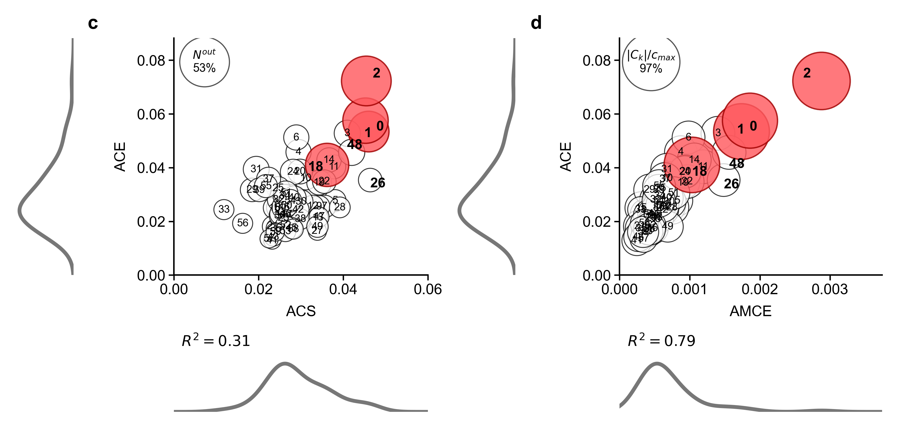
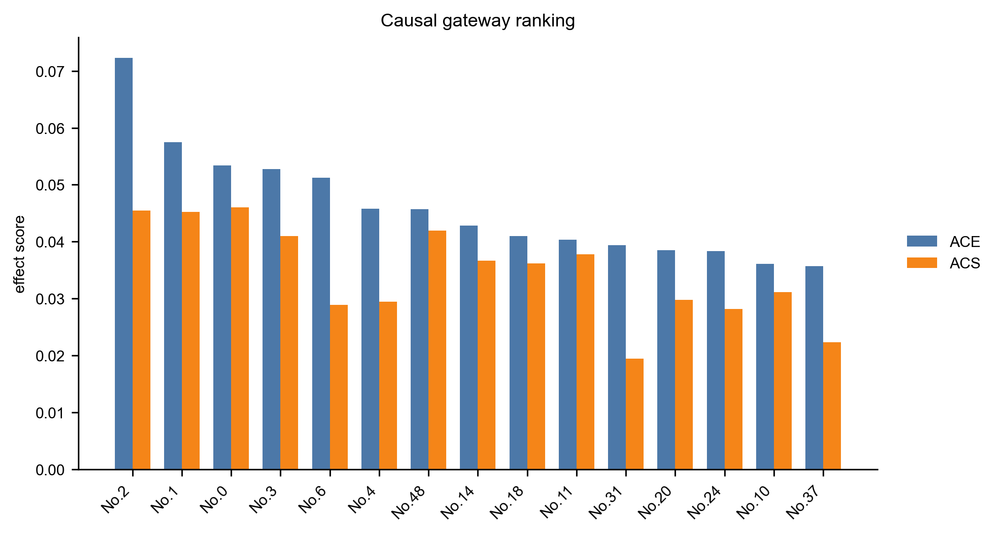
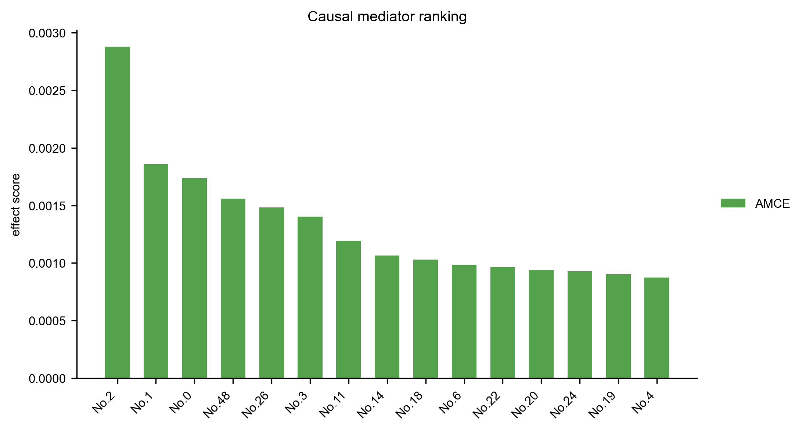
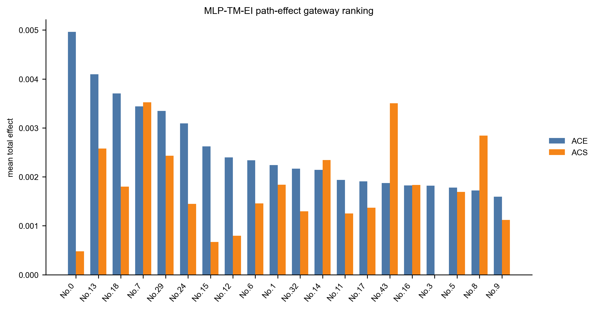
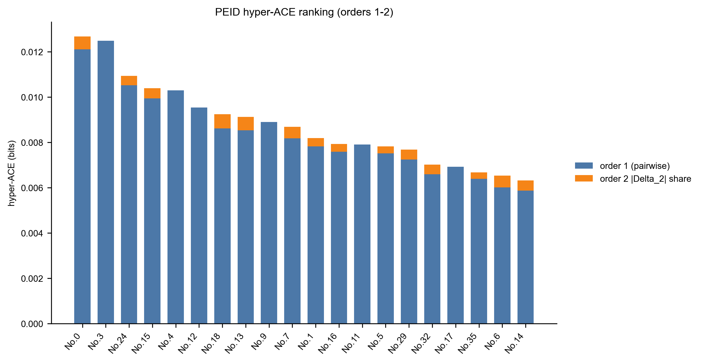
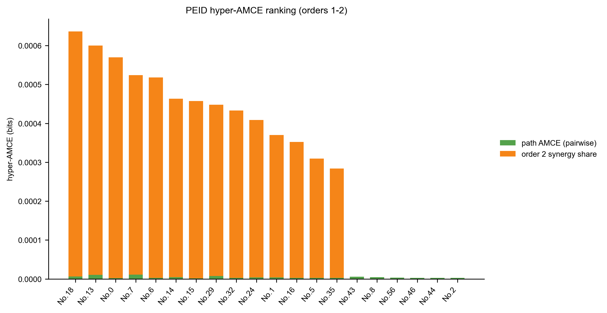
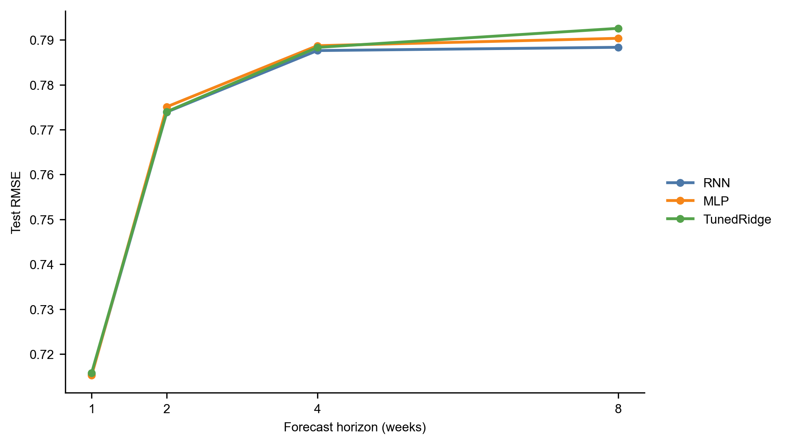

# Runge 因果网关与 PEID 高阶协同实验

本文整理仓库中与 Runge 时空因果网关相关的实验，目标是把线性 Runge 复现、非线性 MLP-TM-EI 读出、以及二阶 PEID 超图扩展放在同一个方法与结果叙事中。所有数值均来自当前仓库中的已保存实验产物；本文只做整理、定义和解释，不新增实验结论。

## 摘要

我们以 NCEP/NCAR 海平面气压场为输入，先复现 Runge 等人关于复杂时空系统中 causal gateway 与 mediator 的线性递归分析，再用同一组 60 个周尺度 Varimax 分量训练非线性一步转移模型，并以 transport-map mutual information 估计源分量对下一期目标分量的 effective information。最后，我们用 PEID 的 Möbius 反演定义精确二阶 EI interaction，把 pairwise EI 图扩展为二阶协同超图。

结果显示，线性 Runge 复现实验在当前 paper-label 校准下把 No.2、No.1、No.0、No.3、No.6 识别为最高 ACE 网关，并把 No.2、No.1、No.0、No.48、No.26 识别为最高 AMCE 中介。当前校准把本地 component No.7、No.8、No.21 分别对应到原文 No.18、No.26、No.48，使原文特别讨论的 No.26/No.48 mediator 重新出现在高 AMCE 区域。

## 1. 问题设定

设周尺度气候状态由 \(n=60\) 个旋转主成分表示。第 \(t\) 周的向量写为

```math
\mathbf{x}_t=(x_{1,t},\ldots,x_{n,t})^\top\in\mathbb{R}^{n}.
\tag{1}
```

给定最大滞后 \(\tau_{\max}=4\)，Runge 线性复现用滞后回归描述目标分量：

```math
x_{j,t}
=\sum_{\tau=1}^{\tau_{\max}}\sum_{i=1}^{n}
a_{j i}^{(\tau)}x_{i,t-\tau}+\epsilon_{j,t}.
\tag{2}
```

非线性读出则把四周历史拼接成输入向量

```math
\mathbf{z}_t=
(\mathbf{x}_{t-3}^\top,\mathbf{x}_{t-2}^\top,\mathbf{x}_{t-1}^\top,\mathbf{x}_{t}^\top)^\top
\in\mathbb{R}^{240},
\tag{3}
```

并学习一步转移

```math
\widehat{\mathbf{x}}_{t+1}=f_\theta(\mathbf{z}_t).
\tag{4}
```

本文关心三个问题。第一，经典线性递归能否在本地数据与代码路径上复现 Runge 式 gateway/mediator 排序。第二，若用非线性转移模型和 EI 替代线性系数，pairwise 因果读出会给出怎样的 gateway/mediator 排序。第三，pairwise 图忽略的二阶源对协同是否会改变这些排序。

## 2. Method

### 2.1 线性 Runge gateway/mediator 复现

原始日尺度 SLP 场先被转为标准化日异常、去线性趋势，并按纬度面积加权。随后在月尺度场上拟合 Varimax 旋转 PCA，再把旋转分量投影回日尺度并聚合到周尺度。Tigramite/ParCorr 先筛选候选父节点，稀疏标准化 OLS 再估计式 (2) 的滞后系数；最后按目标 cross-link density 对边进行阈值化。

滞后总效应用 Runge 式递归得到。令 \(\mathbf{A}^{(\tau)}\) 为滞后 \(\tau\) 的系数矩阵，\(\mathbf{\Phi}^{(\tau)}\) 为滞后 \(\tau\) 的总效应矩阵，则

```math
\mathbf{\Phi}^{(\tau)}
=\mathbf{A}^{(\tau)}
+\sum_{s=1}^{\tau-1}\mathbf{A}^{(s)}\mathbf{\Phi}^{(\tau-s)},
\qquad 1\leq \tau\leq \tau_{\max}.
\tag{5}
```

对分量 \(i\)，平均因果效应 ACE 与平均因果易感性 ACS 分别定义为

```math
\mathrm{ACE}(i)
=\frac{1}{n-1}\sum_{j\ne i}\max_{1\leq\tau\leq\tau_{\max}}
|\Phi_{j i}^{(\tau)}|,
\tag{6}
```

```math
\mathrm{ACS}(i)
=\frac{1}{n-1}\sum_{j\ne i}\max_{1\leq\tau\leq\tau_{\max}}
|\Phi_{i j}^{(\tau)}|.
\tag{7}
```

Mediator 分数通过阻断候选中介 \(m\) 的入边后重新计算总效应得到。设 \(\Phi_{j i}^{(\tau,-m)}\) 为阻断 \(m\) 后的总效应，则源 \(i\)、目标 \(j\)、中介 \(m\) 的最大 mediated causal effect 为

```math
\mathrm{MCE}(i,m,j)
=\max_{\tau}
\left|\Phi_{j i}^{(\tau)}-\Phi_{j i}^{(\tau,-m)}\right|.
\tag{8}
```

AMCE 是式 (8) 在所有合法源-目标对上的平均。

### 2.2 MLP-TM-EI pairwise path-effect 读出

非线性实验使用与线性复现相同的 60 个周尺度分量。转移模型是残差 MLP 与 Ridge 线性模型的验证集加权融合；当前保存运行中 MLP 权重为 0.54，Ridge 权重为 0.46，Ridge \(\alpha=1000\)。在 held-out test period 上，融合模型整体 RMSE 为 0.714863、MAE 为 0.569984、相关系数为 0.450806；相对 tuned Ridge 的 RMSE 改进为 0.001376，paired circular block bootstrap 的 95% CI 为 [0.000893, 0.001825]，单侧非正改进检验 \(p=0.0002\)。

对 pairwise EI，源分量 \(i\) 在最大熵干预分布下被采样，目标为模型预测的下一期 \(j\) 分量。用 transport-map mutual information 估计

```math
\mathrm{EI}_{i\to j}
=I_{\mathrm{do}}(X_i;\widehat{X}_{j,t+1}).
\tag{9}
```

所有 \(\mathrm{EI}_{i\to j}\) 组成非负矩阵 \(\mathbf{E}\)。为了得到 Runge 风格的 path-effect 读出，先按每个 source 的 top-k 保留稀疏边，并令缩放后的直接 EI 图为 \(\widetilde{\mathbf{E}}\)。总 EI path effect 用有限 Neumann 型路径和近似：

```math
\mathbf{T}_{\mathrm{EI}}
=\sum_{\ell=1}^{n}\widetilde{\mathbf{E}}^\ell.
\tag{10}
```

由式 (10) 可以定义 pairwise 版本的 ACE、ACS 与 AMCE。对中介 \(m\)，路径贡献近似为从源到 \(m\) 的直接 EI 与从 \(m\) 到目标的总 EI path effect 的乘积：

```math
\mathrm{MCE}_{\mathrm{EI}}(i,m,j)
=\widetilde{E}_{i m}\,T_{\mathrm{EI},m j}.
\tag{11}
```

### 2.3 二阶 PEID 超图扩展

Pairwise EI 只能描述单个源对目标的影响。PEID 扩展把源集合 \(K\) 对目标 \(T\) 的 joint EI 写为

```math
F(A)=\mathrm{EI}(X_A\to T),\qquad A\subseteq K,\;A\ne\varnothing,
\tag{12}
```

其中 \(X_A=(X_i)_{i\in A}\)。精确 \(k\) 阶 EI interaction 由布尔子集格上的 Möbius 反演给出：

```math
\Delta_K(T)
=\sum_{\varnothing\ne A\subseteq K}
(-1)^{|K|-|A|}F(A).
\tag{13}
```

二阶情形为

```math
\Delta_{\{i,j\}}(T)
=\mathrm{EI}(X_i,X_j\to T)
-\mathrm{EI}(X_i\to T)
-\mathrm{EI}(X_j\to T).
\tag{14}
```

当干预分布下源变量相互独立时，式 (14) 等价于 \(I(X_i;X_j\mid T)\)，因此二阶项非负。三阶及以上的式 (13) 不保证非负，本次运行限制为 order_max=2，所以本文只把显著正二阶项解释为源对协同。

二阶超图先枚举 candidate source pairs 与 targets，再对每个候选超边构造 circular block-shift null distribution。显著性阈值使用 \(|z|\geq 2\)。Hyper-ACE 把一阶 pairwise 贡献与显著二阶超边贡献分配给源分量：

```math
\mathrm{HyperACE}(i)
=\mathrm{ACE}_{1}(i)
+\frac{1}{n-1}\sum_{\substack{K\ni i\\ |K|=2}}
\frac{|\Delta_K(T)|}{|K|}\,\mathbf{1}\{|z_K|\geq 2\}.
\tag{15}
```

Hyper-AMCE 保留 pairwise path AMCE，同时加入该分量作为二阶协同源成员的贡献：

```math
\mathrm{HyperAMCE}(m)
=\mathrm{AMCE}_{\mathrm{path}}(m)
+\frac{1}{n-1}\sum_{\substack{K\ni m\\ |K|=2}}
\frac{|\Delta_K(T)|}{|K|}\,\mathbf{1}\{|z_K|\geq 2\}.
\tag{16}
```

## 3. Experimental Setup

三组实验共用同一组 60 个周尺度 Runge 分量。线性复现覆盖 1948-2011 年，日样本数为 23376，周样本数为 3339，最大周滞后为 4，link density target 为 0.2，最终保留 837 条滞后因果边。

为了缓解组件编号差异，本文的线性复现结果同时报告内部 `component` 与映射后的 `paper_component`。当前代码采用更接近原作者实现的 orthomax/Varimax 路径：对未按特征值缩放的 PCA 空间向量旋转，并按 \(\mathbf{R}^{\top}\operatorname{diag}(\lambda)\mathbf{R}\) 的对角线排序。再结合原文 Fig.2/Fig.4 的空间位置，对原文重点讨论的分量做显式校准：`component=No.7 -> paper_component=No.18`、`component=No.8 -> paper_component=No.26`、`component=No.21 -> paper_component=No.48`，并保持对应逆置换以避免编号重复。

MLP-TM-EI 与 PEID 实验使用 lag=4、horizon=1，因此有效滞后样本数为 3335，输入维度为 \(4\times 60=240\)。MLP 设置为 hidden_dim=128、num_layers=1、dropout=0.5、epochs=120；ensemble ridge alphas 为 10、100、1000、3000；EI intervention samples 为 4096。Pairwise path-effect 图采用 source-topk sparsification，graph_topk=5，path_alpha=0.8。PEID 运行限制为 order_max=2，candidate counts 为 order1=3600、order2=1630、order3=0；null reps=20，block size=26。

注意：线性 Runge 组件已在本次整理中按 orthomax 路径重新生成并校准编号；后续 MLP-TM-EI 与 PEID 的已保存数值仍来自此前组件基底。本节不重跑 EI/PEID 估计，只在呈现层把本地 `component_index` 按同一组 local-paper 映射重标，因此数值排序不变，但表格、图轴与文字解释中的 paper 编号已按校准后的标签读取。

## 4. Results

### 4.1 线性 Runge 复现实验识别出强全局 gateway 与 mediator

线性递归复现的 paper-label ACE 排序由 No.2、No.1、No.0、No.3、No.6 领跑；No.18 排第 9，仍处于较高 gateway 区域。Mediator 排序把 No.2、No.1、No.0、No.48、No.26 放在前五，No.18 排第 9。这样原文正文中特别提到的 No.26 和 No.48 已经能在复现图与 AMCE 表中体现出来。

需要注意的是，原文没有在仓库中提供机器可读的 60 个官方 loading 表；因此当前映射对原文重点讨论的 No.0、No.1、No.2、No.18、No.26、No.48 已做空间与结果校准，但低排名分量的逐一编号仍应视为按当前 orthomax 排序得到的复现编号，而不是官方逐点认证表。

下图复现原文 Fig.4c/d 的核心读出：面板 c 展示 ACE 与 ACS 的关系，点面积表示该分量显著影响的输出分量比例 \(N_i^{out}\)；面板 d 展示 ACE 与 AMCE 的关系，点面积表示 mediated component set 的相对大小 \(|C_k|/c_{\max}\)。红色点为原文重点讨论的 No.0、No.1、No.2、No.18。当前复现使用已保存的线性 Runge 结果重建散点、边缘密度和 \(R^2\)，未伪造原文 residual bootstrap 误差条。







| rank | paper component | internal component | ACE | ACS | direct out | direct in |
| ---: | --- | --- | ---: | ---: | ---: | ---: |
| 1 | No.2 | No.2 | 0.072274 | 0.045445 | 0.059432 | 0.035419 |
| 2 | No.1 | No.1 | 0.057493 | 0.045248 | 0.041264 | 0.036852 |
| 3 | No.0 | No.0 | 0.053431 | 0.045995 | 0.039771 | 0.034503 |
| 4 | No.3 | No.3 | 0.052788 | 0.040959 | 0.039547 | 0.030817 |
| 5 | No.6 | No.6 | 0.051232 | 0.028901 | 0.033773 | 0.021636 |

| rank | paper component | internal component | AMCE | mediated fraction |
| ---: | --- | --- | ---: | ---: |
| 1 | No.2 | No.2 | 0.002879 | 0.968732 |
| 2 | No.1 | No.1 | 0.001859 | 0.813559 |
| 3 | No.0 | No.0 | 0.001738 | 0.859147 |
| 4 | No.48 | No.21 | 0.001561 | 0.930742 |
| 5 | No.26 | No.8 | 0.001483 | 0.806546 |

### 4.2 非线性 EI path-effect 保留 No.0 的主导地位，但改变部分 gateway 次序

MLP-TM-EI path-effect 的 top gateways 在 paper-label 校准后为 No.0、No.13、No.18、No.7、No.29。No.0 仍是最强 outgoing gateway；原文重点讨论的 paper No.18 对应本地 `component=No.7`，在非线性 EI path-effect 中排第 3。Pairwise EI 与线性系数矩阵的 Spearman 相关为 0.5163；只看 off-diagonal 元素时 Spearman 为 0.4827，说明 EI 读出与线性系数相关但不是同一个对象。



| rank | component | ACE | ACS | direct out | direct in |
| ---: | --- | ---: | ---: | ---: | ---: |
| 1 | No.0 | 0.004964 | 0.000480 | 0.256552 | 0.026167 |
| 2 | No.13 | 0.004099 | 0.002580 | 0.208253 | 0.144555 |
| 3 | No.18 | 0.003707 | 0.001799 | 0.196691 | 0.096736 |
| 4 | No.7 | 0.003443 | 0.003524 | 0.185037 | 0.185373 |
| 5 | No.29 | 0.003347 | 0.002434 | 0.180194 | 0.127612 |
| 6 | No.24 | 0.003094 | 0.001450 | 0.161276 | 0.080278 |
| 7 | No.15 | 0.002624 | 0.000671 | 0.144387 | 0.037221 |
| 8 | No.12 | 0.002397 | 0.000797 | 0.127024 | 0.042591 |
| 9 | No.6 | 0.002338 | 0.001459 | 0.129927 | 0.074105 |
| 10 | No.1 | 0.002243 | 0.001837 | 0.119804 | 0.098457 |

Pairwise mediator 排序的 top five 为 No.7、No.13、No.29、No.18、No.43。这里第一名是本地 `component=No.18` 经过逆置换后的 paper No.7；paper No.18 仍在第 4。与线性 AMCE 相比，这里的 AMCE 数值更小，因为它来自稀疏 EI 图中的 path product，而不是线性 SEM 系数递归。

| rank | component | AMCE | mediated fraction |
| ---: | --- | ---: | ---: |
| 1 | No.7 | 0.00001098 | 0.078993 |
| 2 | No.13 | 0.00001020 | 0.073359 |
| 3 | No.29 | 0.00000735 | 0.052886 |
| 4 | No.18 | 0.00000617 | 0.044412 |
| 5 | No.43 | 0.00000599 | 0.043109 |

### 4.3 二阶 PEID 主要改变 gateway 解释，并将 mediator 解释转向协同参与

PEID Hyper-ACE 把显著二阶 source-pair interaction 加回到网关分数中。Top gateways 变为 No.0、No.3、No.24、No.15、No.4。No.3 和 No.4 在 pairwise path-effect top five 中并不靠前，但在 Hyper-ACE 中由于一阶 EI 总量较高而上升；No.18、No.13、No.7 仍在 top ten，说明这些重点分量的 pairwise 地位并未消失，只是 paper-label 校准后顺序应按映射重读。



| rank | component | order 1 | order 2 | total |
| ---: | --- | ---: | ---: | ---: |
| 1 | No.0 | 0.012109 | 0.000568 | 0.012677 |
| 2 | No.3 | 0.012483 | 0.000000 | 0.012483 |
| 3 | No.24 | 0.010523 | 0.000405 | 0.010928 |
| 4 | No.15 | 0.009936 | 0.000456 | 0.010391 |
| 5 | No.4 | 0.010293 | 0.000000 | 0.010293 |
| 6 | No.12 | 0.009534 | 0.000000 | 0.009534 |
| 7 | No.18 | 0.008610 | 0.000630 | 0.009240 |
| 8 | No.13 | 0.008528 | 0.000590 | 0.009118 |
| 9 | No.9 | 0.008900 | 0.000000 | 0.008900 |
| 10 | No.7 | 0.008175 | 0.000513 | 0.008688 |

Hyper-AMCE 的变化更容易解释：它几乎由二阶协同 membership 主导。paper-label 校准后 No.18、No.13、No.0、No.7、No.6 排名前五，说明 paper No.18 不仅出现在 pairwise path 中，也最频繁地作为二阶源对的一员共同解释目标的下一期变化；而表中第 4 的 No.7 是本地 `component=No.18` 的逆置换标签。



| rank | component | path AMCE | order 2 synergy | total |
| ---: | --- | ---: | ---: | ---: |
| 1 | No.18 | 0.00000617 | 0.000630 | 0.000637 |
| 2 | No.13 | 0.00001020 | 0.000590 | 0.000600 |
| 3 | No.0 | 0.00000203 | 0.000568 | 0.000570 |
| 4 | No.7 | 0.00001098 | 0.000513 | 0.000524 |
| 5 | No.6 | 0.00000299 | 0.000515 | 0.000518 |
| 6 | No.14 | 0.00000477 | 0.000459 | 0.000463 |
| 7 | No.15 | 0.00000164 | 0.000456 | 0.000457 |
| 8 | No.29 | 0.00000735 | 0.000441 | 0.000448 |
| 9 | No.32 | 0.00000255 | 0.000431 | 0.000433 |
| 10 | No.24 | 0.00000384 | 0.000405 | 0.000409 |

### 4.4 Pairwise 与 PEID 排序的差异

PEID 与 pairwise baseline 的 gateway 排序相关性为 Spearman 0.7663、Kendall 0.5797，说明二阶协同确实改变了 gateway 的优先级。Top-5 gateway 只有 No.0 重合；Top-10 gateway 有 7 个重合：No.0、No.18、No.12、No.13、No.15、No.7、No.24。

Mediator 排序更稳定，Spearman 0.9530、Kendall 0.8915。Top-5 mediator 重合 3 个：No.18、No.13、No.7；Top-10 mediator 重合 6 个：No.18、No.13、No.14、No.7、No.24、No.29。也就是说，二阶 PEID 不完全推翻 pairwise mediator 结论，而是把原本偏 path-effect 的解释转化为“二阶协同参与强度”的解释。

## 5. Discussion

这组实验给出一个清晰的层级结论。线性 Runge 复现回答了“哪些气候分量在线性滞后因果传播中最像网关和中介”；MLP-TM-EI 回答了“在非线性预测模型和 intervention EI 读出下，pairwise 因果传播结构是否仍相似”；PEID 超图进一步回答了“若目标变化由两个源共同解释，pairwise 图会漏掉什么”。

从结果看，No.0 是三种视角中最稳定的 gateway 候选。经过 local-paper 编号校准后，paper No.18 在 MLP pairwise gateway 中排第 3、在 PEID Hyper-ACE 中排第 7、在 PEID Hyper-AMCE 中排第 1，是最稳定的协同/传播节点之一；No.13 也在 pairwise 与 PEID mediator 结果中保持高位。PEID 对 gateway 的改变大于对 mediator 的改变，这表明二阶协同主要影响“源侧输出能力”的排序，而 mediator 排序仍保留相当多 pairwise path-effect 结构。

当前限制也很明确。第一，PEID 运行只估计到二阶；三阶 interaction 在理论上可为负，本次没有估计。第二，二阶候选集合经过 pairwise EI 预筛选，因此弱 pairwise 但强纯协同的源对仍可能被漏掉。第三，MLP 的 RMSE 改进虽经 block bootstrap 支持，但幅度很小；EI 结果应被视为结构读出，而不是大幅预测性能提升的副产品。第四，组件编号仍是旋转 PCA 分量编号；若要做气候物理解释，需要结合空间 loading 图和区域标签。

## 6. Reproducibility Notes

- 线性复现结果：`results/runge/2015_gateways/`
- Fig.4c/d 复现脚本：`scripts/reproduce_runge_fig4cd.py`
- Pairwise MLP-TM-EI path-effect 结果：`results/runge/pairwise_mlp_tm_ei_path_effects/`
- 二阶 PEID hypergraph 结果：`results/runge/peid_hypergraph/`
- RNN 多步预测结果：`results/runge/rnn_forecast_comparison/`
- RNN history sweep 结果：`results/runge/rnn_history_sweep/`
- 关键图像：`fig/runge/2015_gateways/`、`fig/runge/pairwise_mlp_tm_ei_path_effects/`、`fig/runge/peid_hypergraph/`、`fig/runge/rnn_forecast_comparison/`、`fig/runge/rnn_history_sweep/`
- 本文引用的 PNG 图像均已人工快速查看，图例没有覆盖数据区域。

## Appendix A. GRU 多步预测训练报告

本实验将 Runge weekly component score 序列表示为 60 维状态向量 \(\mathbf{x}_t\)，用最近 4 周状态预测未来 \(1,2,4,8\) 周。最终用于测试表的 RNN 条目不是裸 GRU，而是“GRU 残差转移模型 + validation-selected Ridge 融合”的预测系统。最新重跑结果显示，该系统在 2、4、8 周预测上降低 RMSE，其中 4 周和 8 周相对每个 horizon 的最强 baseline 达到 bootstrap 显著；1 周预测上 MLP 的 RMSE 略低，因此不能宣称 GRU 在全部 horizon 上显著优于 MLP 和线性模型。

原始序列包含 3339 个周样本，时间范围为 1948-01-01 至 2011-12-22，每周有 60 个 component score。监督样本由 lag-4 滑动窗口构造：输入为 \([\mathbf{x}_{t-3};\mathbf{x}_{t-2};\mathbf{x}_{t-1};\mathbf{x}_{t}]\)，维度为 \(4\times 60=240\)；目标为 \(\mathbf{x}_{t+h}\)，其中 \(h\in\{1,2,4,8\}\)。考虑最大 horizon 后得到 3328 个监督样本，按时间顺序切分为 train/validation/test = 2330/499/499。

GRU 为单层 recurrent transition model，hidden dimension 为 192，dropout 为 0。模型包含一个线性 skip 分支：先在训练集上选择 Ridge baseline，验证集最优 \(\alpha=1000\)，再用该 Ridge 映射初始化 skip 分支并冻结；GRU head 学习相对线性转移的残差，最终 residual scale 为 1.0。训练目标使用 rollout-multistep loss：

\[
\mathcal{L}=\frac{1}{|\mathcal{H}|}\sum_{h\in\mathcal{H}}
\left\|\hat{\mathbf{x}}_{t+h}-\mathbf{x}_{t+h}\right\|_2^2,\quad
\mathcal{H}=\{1,2,4,8\}.
\]

最终 RNN 测试预测还使用 validation set 选择的 horizon-wise Ridge/GRU 线性融合：

\[
\hat{\mathbf{x}}^{final}_{t+h}
=w_h\hat{\mathbf{x}}^{GRU}_{t+h}+(1-w_h)\hat{\mathbf{x}}^{Ridge}_{t+h}.
\]

验证集选择的 GRU 权重为：h=1 时 0.70，h=2 时 0.12，h=4 时 0.33，h=8 时 1.00。GRU 训练共记录 42 个 epoch，并因 early stopping 结束。训练 loss 从 0.839249 降至 0.747342；validation loss 在第 2 个 epoch 达到最低 0.955566，之后整体上升，最终保存的是第 2 个 epoch 的最佳验证状态。

| horizon | RNN RMSE | MLP RMSE | Ridge RMSE | RNN MAE | MLP MAE | Ridge MAE | RNN corr |
|---:|---:|---:|---:|---:|---:|---:|---:|
| 1 | 0.715441 | 0.715250 | 0.715798 | 0.570881 | 0.570838 | 0.571185 | 0.455635 |
| 2 | 0.773920 | 0.775089 | 0.774004 | 0.617649 | 0.618565 | 0.617722 | 0.273318 |
| 4 | 0.787609 | 0.788698 | 0.788317 | 0.628887 | 0.629704 | 0.629409 | 0.198739 |
| 8 | 0.788341 | 0.790339 | 0.792561 | 0.629554 | 0.630992 | 0.632601 | 0.196747 |

| horizon | best baseline | RMSE improvement | 95% CI | p(improvement <= 0) | 判断 |
|---:|---|---:|---:|---:|---|
| 1 | MLP | -0.000191 | [-0.000689, 0.000264] | 0.7816 | 不优于最强 baseline |
| 2 | Ridge | 0.000083 | [-0.000030, 0.000215] | 0.0846 | 数值更低但不显著 |
| 4 | Ridge | 0.000709 | [0.000198, 0.001364] | 0.0012 | 显著提升 |
| 8 | MLP | 0.001999 | [0.000740, 0.003385] | 0.0002 | 显著提升 |

当前实验支持一个较窄但稳健的结论：rollout-multistep GRU 在固定 lag=4 的 weekly component 预测任务上改善了多步预测，尤其是 4 周和 8 周 horizon；它没有在 1 周预测上击败 MLP，也没有在 2 周上显著击败最强线性 baseline。

## Appendix B. 固定 lag=4 的 RNN 多步预测对比

该补充实验用 RNN 类模型替换原 MLP 预测器，并在 held-out test split 上比较 RNN、MLP 和 validation-selected best Ridge 的一步与多步预测误差。

- 数据：`results/runge/2015_gateways/component_weekly_scores.csv`
- 输入：最近 4 周的 60 个 component scores，输入维度 `4 * 60 = 240`
- 测试 horizons：`1, 2, 4, 8` 周
- RNN 候选：`GRU`，`hidden_dim=192`，`rollout_multistep` 目标
- RNN 后处理：按 horizon 在验证集上选择 GRU/Ridge 混合权重
- 对照模型：原 MLP-style transition 递归预测、best Ridge `alpha=1000` 递归预测



| Horizon | RNN RMSE | MLP RMSE | Tuned Ridge RMSE | RNN MAE | MLP MAE | Tuned Ridge MAE |
|---:|---:|---:|---:|---:|---:|---:|
| 1 | 0.716519 | 0.716536 | 0.716933 | 0.571571 | 0.571506 | 0.571879 |
| 2 | 0.775186 | 0.776164 | 0.775329 | 0.618448 | 0.619117 | 0.618529 |
| 4 | 0.787876 | 0.789146 | 0.788532 | 0.628011 | 0.628918 | 0.628377 |
| 8 | 0.788618 | 0.790837 | 0.792085 | 0.628899 | 0.630680 | 0.631388 |

| Horizon | Best baseline | RMSE improvement | Bootstrap 95% CI | p(improvement <= 0) |
|---:|---|---:|---:|---:|
| 1 | MLP | 0.000017 | [-0.000440, 0.000483] | 0.4732 |
| 2 | Tuned Ridge | 0.000144 | [-0.000095, 0.000415] | 0.1364 |
| 4 | Tuned Ridge | 0.000656 | [0.000032, 0.001368] | 0.0174 |
| 8 | MLP | 0.002219 | [0.000628, 0.004007] | 0.0022 |

产物：

- 指标：`results/runge/rnn_forecast_comparison/multistep_metrics.csv`
- 显著性：`results/runge/rnn_forecast_comparison/prediction_significance.json`
- 配置与训练摘要：`results/runge/rnn_forecast_comparison/manifest.json`
- 图像：`fig/runge/rnn_forecast_comparison/multistep_rmse.png`

## Appendix C. RNN History-Length Sweep

该实验在真实 Runge weekly component-score 数据上训练 recurrent forecasters，不再固定输入历史长度为 `lag=4`。它预测 `1,2,4,8` 周 horizons，并用 validation RMSE 选择 history length、RNN capacity、regularization、random seed 和 horizon-wise RNN/Ridge blend weights。Test split 只在 selection 后用于报告 held-out metrics 和 paired circular block bootstrap significance。

从仓库根目录运行 sweep：

```bash
python scripts/run_runge_rnn_forecast_comparison.py \
  --history-grid 1,2,4,8,12,16,24,32,52 \
  --candidate-output-root results/runge/rnn_history_sweep \
  --rank-metric val_avg_rmse \
  --top-k-refine 3 \
  --final-seeds 42,43,44 \
  --horizons 1,2,4,8 \
  --rnn-type gru \
  --rnn-objective rollout_multistep \
  --rnn-linear-blend-grid-steps 101 \
  --epochs 180 \
  --hidden-dim 192 \
  --batch-size 256 \
  --learning-rate 8e-4 \
  --weight-decay 1e-4 \
  --ridge-alphas 10,100,1000,3000 \
  --bootstrap-reps 5000 \
  --bootstrap-block-size 26
```

第一阶段只 sweep history length。Refinement stage 会把 validation top histories 重新跑过 `hidden_dim=[64,128,192,256]`、`dropout=[0,0.1,0.2]` 和 `weight_decay=[1e-5,1e-4,1e-3]`。Final stage 会把 validation-leading configurations 在 seeds `42,43,44` 上重跑。

输出：

- `results/runge/rnn_history_sweep/leaderboard.csv`: all candidates ranked by `val_avg_rmse`.
- `results/runge/rnn_history_sweep/final_test_metrics.csv`: held-out metrics for the validation-selected final candidate, with `BestBaseline` rows added.
- `results/runge/rnn_history_sweep/final_prediction_significance.json`: paired circular block bootstrap for the selected candidate.
- `fig/runge/rnn_history_sweep/history_sweep_rmse.png`: validation RMSE by history length and stage.
- `fig/runge/rnn_history_sweep/final_multistep_rmse.png`: final held-out multi-step RMSE plot.

Each candidate also writes its own `manifest.json`, `validation_metrics.csv`, `multistep_metrics.csv`, `prediction_significance.json`, and model caches under `results/runge/rnn_history_sweep/<candidate>/`.

Final test table 应被读作 validation-selected forecast system 的性能，而不是 test-tuned hyperparameter search。若 selected history 不等于 `4`，该结果回答的是更长或更短 recurrent context 是否能在相同 held-out split 下改善预测，同时保留早先 fixed-lag experiment 作为受约束参考。
