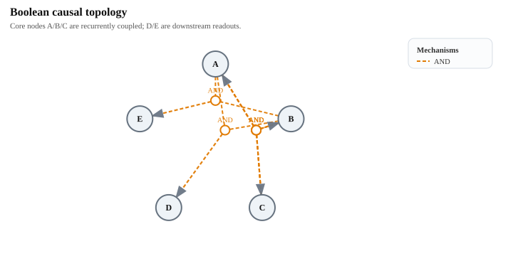

- **与 IIT 2.0 `main complex` 的补充对照**：为了进一步检验 EI 分解与 IIT 2.0 在离散系统上的联系与差异，这里额外考虑一个 5 节点离散布尔马尔可夫系统。令 `A/B/C` 构成递归耦合核心：三个核心节点都由另外两个核心节点的 `AND` 联合决定；`D/E` 则不再反馈回核心，而只是作为下游 readout，由 `A_t AND B_t` 前馈驱动。这个拓扑的作用，是在一个仍可全状态枚举的最小系统中，直接比较“按 IIT 2.0 的 $\Phi$ 选 complex”和“按 EI 分解的协同量选 complex”是否给出同样的边界。

  

  这张静态因果图强调了一个有意设计的结构不对称性：`A/B/C` 之间存在递归联合依赖，而 `D/E` 只是从核心读出、并不把新的约束反馈回去。因此，若 IIT 2.0 的 `main complex` 真在追踪“不可约整体性”，它应更偏向把 `A/B/C` 识别为一个整合核心，而不是机械地偏向包含更多节点的全集。

  对当前状态 `00000`，把所有候选子系统按 IIT 2.0 的 $\Phi$ 从大到小排序，并把同一批子系统对应的

$$
\Phi^{\mathrm{EID}}(S_t)
:=
EI(S_t \to S_{t+1}) - \sum_{i \in S} EI(i_t \to S_{t+1})
\tag{6.2-7}
$$

  并列写出后，可得到下面这个最关键的对照表：

| subset | Phi | Phi^EID | IIT complex? |
| --- | ---: | ---: | --- |
| {A, B, C} | 1.000000 | 0.216917 | yes |
| {A, B, D} | 0.500000 | 0.061278 | yes |
| {A, B, E} | 0.500000 | 0.061278 | yes |
| {A, B} | 0.078072 | 0.012483 | no |
| {A, C} | 0.078072 | 0.012483 | no |
| {B, C} | 0.078072 | 0.012483 | no |
| {A, D} | 0.029049 | 0.000000 | no |
| {A, E} | 0.029049 | 0.000000 | no |
| {B, D} | 0.029049 | 0.000000 | no |
| {B, E} | 0.029049 | 0.000000 | no |
| {A, B, C, D, E} | 0.000000 | 0.216917 | no |
| {A, B, C, D} | 0.000000 | 0.216917 | no |
| {A, B, C, E} | 0.000000 | 0.216917 | no |
| {A, B, D, E} | 0.000000 | 0.061278 | no |

  这个对照支持两个紧邻但并不相同的结论。第一，EI 分解的 $\Phi^{\mathrm{EID}}$ 和 IIT 2.0 的 $\Phi$ 都能看出 `A/B/C` 是系统中最关键的联合结构：`{A,B,C}` 同时取得最高的 $\Phi = 1.000000$ 与最高一档的 `\Phi^{\mathrm{EID}} = 0.216917`。第二，**若直接用 $\Phi^{\mathrm{EID}}$ 来选 complex，其结果并不会自动与 IIT 2.0 一致**。原因是 `\Phi^{\mathrm{EID}}` 会把 `{A,B,C}`、`{A,B,C,D}`、`{A,B,C,E}` 与全集 `{A,B,C,D,E}` 放在同一最高档，而 IIT 2.0 的 $\Phi$ 则会把这些更大集合压到 `0`，从而把 `main complex` 明确收缩到三节点核心 `{A,B,C}`。换句话说，在这个离散布尔例子里，$\Phi^{\mathrm{EID}}$ 更像是在衡量“整体相对单节点分解的联合增益”，而 IIT 2.0 的 $\Phi$ 更像是在衡量“经过 MIP 之后仍然剩下的不可约整体性”；两者都与“联合性”相关，但并不是同一个函数，因此也不应预期它们在 complex 的边界选择上处处重合
