# Partial Effective Information Decomposition

## 目录

- [1 问题设定](#1-问题设定与干预口径)
  - [1.1 最大熵干预](#11-源侧最大熵干预)
  - [1.2 EI 定义](#12-ei-的定义)
  - [1.3 三变量情形下的 PID 对齐基础](#13-三变量情形下的-pid-对齐基础)
- [2 EI 分解](#2-源侧-ei-信息分解)
  - [2.1 特有项与协同项](#21-特有项与协同项)
  - [2.2 非负性](#22-非负性与其解释)
  - [2.3 层级可加性](#23-层级可加性)
- [3 EI 因果图](#3-ei-因果图与协同超边)
  - [3.1 Pairwise EI 边](#31-pairwise-ei-边成对边)
  - [3.2 协同超边](#32-协同超边)
  - [3.3 多尺度应用](#33-多尺度应用)
- [4 计算方式](#4-线性高斯系统与神经网络中的计算方式)
  - [4.1 线性高斯主公式](#41-线性高斯机制与局部线性化的主公式)
  - [4.2 非线性与神经网络](#42-非线性动力学与神经网络实现)
- [5 向下因果](#5-向下因果的定义)
- [6 实验设计](#6-实验设计与验证方案)
  - [6.1 核心问题](#61-核心研究问题)
  - [6.2 实验一](#62-实验一rq1-的验证)
  - [6.3 实验二](#63-实验二rq2-的验证)
  - [6.4 实验三](#64-实验三rq3-的验证)
  - [6.5 实验四](#65-实验四rq4-的验证)
  - [6.6 实验五](#66-实验五rq5-的验证)
  - [6.7 实验六](#67-实验六rq6-的验证)
- [参考文献](#参考文献)
- [附录](./研究框架_附录.md)

本文档按更接近正式论文成稿的方式整理现有材料。正文只保留研究问题、核心定义、主要定理与引理、方法边界、计算框架与实验设计；较长的证明、连续情形下的推导、Jacobian--Covariance 公式展开、复杂度估算及扩展定理与引理统一移至文末附录。若后续要直接改写成论文正文，可基本沿用本文件前 7 节；附录 A--M 另存为独立文件 [研究框架_附录](./研究框架_附录.md)，作为理论、计算、方法边界与实验补充材料。

全文中的展示公式采用分层编号：若公式位于第 $k$ 节，则记为式 $(k.m)$；若公式位于第 $k.\ell$ 或第 $k.\ell.r$ 小节，则分别记为式 $(k.\ell-m)$ 或式 $(k.\ell.r-m)$。附录公式分别记为 $(A.m)$ 至 $(M.m)$。为便于阅读，正文的组织顺序是：第 1--3 节先给出问题设定、EI 分解与因果图定义，第 4--5 节说明连续情形下的计算口径与向下因果解释，第 6 节集中整理按 `RQ1` 到 `RQ6` 顺序排列的实验设计与当前结果。

## 1. 问题设定与干预口径

考虑一个离散时间 Markov 动力学系统：

$$
X_{t+1} \sim p(x_{t+1}\mid x_t), \qquad
X_t = \bigl(X_t^{(1)}, \dots, X_t^{(n)}\bigr).
\tag{1.1}
$$

其中，$X_t^{(i)}$ 表示第 $i$ 个微观随机变量；对应的具体取值仍记为小写 $x_t^{(i)}$。若系统经过粗粒化或表征学习，也可以将其理解为宏观变量或潜变量。本文不追求对任意输入与输出同时做完全信息分解，而是固定目标为完整下一时刻状态 $X_{t+1}$，只对源变量 $X_t$ 进行划分，从而得到一个可计算、可解释，且在离散情形下具有非负性的机制层协同分解框架。

### 1.1 源侧最大熵干预

对时间 $t$ 的源变量实施最大熵干预，得到干预分布

$$
q^{\max}(x_t) = \prod_{i=1}^n q_i^{\max}\bigl(x_t^{(i)}\bigr).
\tag{1.1-1}
$$

- 对离散系统，$q_i^{\max}$ 取各变量支持集上的均匀分布，因此 $q^{\max}$ 就是输入状态空间上的最大熵分布。与 Yang 等（2025）及其补充材料 Appendix B 的口径一致 [1]，这可以写作

$$
\mathrm{do}\bigl(X_t \sim \mathcal{U}(\Omega_{X_t})\bigr).
\tag{1.1-2}
$$

- 对连续系统，无界状态空间上不存在无约束的最大熵分布，因此需要先规定约束条件。本文正文默认以“有界支撑上的独立均匀干预”作为主口径，因为它最接近离散情形中“对可达输入范围做最大熵探测”的直觉；协方差约束下的高斯分布只作为辅助代理，用于给出更紧凑的闭式公式与近似计算。二者的关系与适用边界见附录 C。

干预后的联合分布写为

$$
q(x_t, x_{t+1}) = q^{\max}(x_t)\, p(x_{t+1}\mid x_t),
\tag{1.1-3}
$$

正文以下默认把目标直接取为随机变量 $X_{t+1}$。若只关心单个变量、变量子集或某个宏观变量，则可把它们视为 $X_{t+1}$ 的函数，并在相同干预分布下按同样方式定义对应的 EI。为与此前使用过的其他信息分解指标区分，本文只给源侧 EI 分解所得到的特有项、协同项及其派生量统一加上上角标 $\mathrm{EID}$；原始 EI 定义本身保持不变。

### 1.2 EI 的定义

记 $A, B \subseteq \{1,\dots,n\}$ 分别为源侧与目标侧的指标子集。对应地，$X_t^A$ 表示时间 $t$ 的源子变量组，$X_{t+1}^B$ 表示完整下一时刻状态 $X_{t+1}$ 中由指标集 $B$ 选出的目标子变量组。若讨论某个由 $X_{t+1}^B$ 诱导出的宏观变量，也仍把它视为目标侧子对象。定义源子集 $A$ 对目标子集 $B$ 的有效信息（effective information, EI）为

$$
EI(X_t^A \to X_{t+1}^B) \equiv I_{q^{\max}}\bigl(X_t^A; X_{t+1}^B\bigr),
\tag{1.2-1}
$$

其中 $I_{q^{\max}}$ 表示在源侧最大熵干预分布 $q^{\max}$ 下计算的互信息。式 (1.2-1) 强调，所有 EI 都在同一源侧最大熵干预下计算，因此整体 EI、部分 EI 与协同项在输入变量分布上都共享同一组干预下的分布。

下面先给出一个对全文至关重要的理论支点。它虽然只在最基本的 $2 \to 1$ 三变量场景下陈述，但恰好回答了“为什么我们可以把单部分 EI 直接解释为特有项、把联合 EI 扣除各部分 EI 后的剩余解释为协同项”这一核心问题。其关键点在于：在源侧联合最大熵独立干预下，PID 意义下的冗余项会自动退化为零，于是本文第二节所采用的“单部分 EI + 协同差值”写法，不再只是一个操作性定义，而有了明确的 PID 公理化依据。

### 1.3 三变量情形下的 PID 对齐基础

考虑最基本的 two-sources-to-one-target 场景：两个源变量为 $X_t^{(1)}$ 与 $X_t^{(2)}$，目标变量为 $X_{t+1}$。在联合最大熵独立干预下，源侧分布因子化，因此

$$
X_t^{(1)} \perp X_t^{(2)}.
\tag{1.3-1}
$$

在 PID 公理体系 $(S,I,M,LC,Id)$ 下，这一独立性会直接压掉冗余项。

这里先只简要列出引理真正会用到的几条公理含义：$(I)$ 表示单源时冗余退化为普通互信息，$(M)$ 表示加入更多源后冗余不会增大，$(LC)$ 表示目标扩展时冗余满足左链式分解，$(Id)$ 表示当目标就是两个源自身时，冗余退化为两源互信息。对称性 $(S)$ 在该引理里不是关键步骤，但仍属于本文采用的 PID 公理体系。更完整的数学表达见附录 A.0。

**引理 1（独立源导致 PID 冗余为零）**  
对任意三个随机变量 $U,V,T$，若 $U \perp V$，则

$$
Red(U,V;T)=0.
\tag{1.3-2}
$$

这个引理的意义在于：源侧联合最大熵独立干预不仅消除了观测层面的源间相关性，还在 PID 的公理体系内把“两个源都能单独重复提供给目标的那部分信息”压缩为零。也正因为如此，后文才可以把单部分 EI 解释为特有项，把联合差值解释为协同项。严格证明见附录 A.3。

**命题 1（本文定义的理论支点：三变量情形下与 PID 公理体系的相容性）**  
对源变量集合

$$
\mathcal{P}=\{X_t^{(1)},X_t^{(2)}\},
\tag{1.3-3}
$$

在式 (1.3-1) 的源侧独立干预下，PID 冗余项为零，且 PID 特有项与协同项分别退化为

$$
\begin{aligned}
Un\bigl(X_t^{(1)};X_{t+1}\mid X_t^{(2)}\bigr)
&= EI(X_t^{(1)} \to X_{t+1}), \\
Un\bigl(X_t^{(2)};X_{t+1}\mid X_t^{(1)}\bigr)
&= EI(X_t^{(2)} \to X_{t+1}), \\
Syn\bigl(X_t^{(1)},X_t^{(2)};X_{t+1}\bigr)
&=
Syn_{\mathcal{P}}^{\mathrm{EID}}\bigl((X_t^{(1)},X_t^{(2)}) \to X_{t+1}\bigr).
\end{aligned}
\tag{1.3-4}
$$

换言之，在最基本的 $2 \to 1$ 场景中，本文后续对“特有项”和“协同项”的命名并不是人为指定，而是与 PID 公理体系在该场景下严格对齐。这个结论之所以重要，是因为它为第二节的整个 EI 分解框架提供了最直接的理论正当性：我们不是先任意定义出一个差值，再去寻找解释；而是在冗余已经被独立干预消去之后，顺势得到与 PID 语义一致的特有项与协同项。其详细证明与公理展开见附录 A.3。

## 2. 源侧 EI 信息分解

设 $A \subseteq \{1,\dots,n\}$ 为任意给定的源侧指标子集，$\mathcal{P} = \{M_1, \dots, M_m\}$ 是 $X_t^A$ 的一个合法划分。于是

$$
M_i \cap M_j = \varnothing \quad (i \neq j), \qquad
\bigcup_{i=1}^m M_i = X_t^A.
\tag{2.1}
$$

同时，$B$ 沿用第 1.2 节的约定，始终表示完整下一时刻状态 $X_{t+1}$ 上的目标指标子集；相应目标变量记为 $X_{t+1}^B$。

### 2.1 特有项与协同项

由第 1.3 节的引理 1 与命题 1 可知，在最基本的 $2 \to 1$ 三变量场景中，源侧独立干预会把 PID 冗余项压到零，从而使单部分 EI 与 PID 特有项对齐、联合差值与 PID 协同项对齐。下面把这一思路推广到任意源划分：对每个部分，直接记录其单独对目标的 EI；对整体，再把联合 EI 扣除各部分 EI 之和，剩余部分定义为协同项。

定义第 $i$ 个部分对目标的特有项为

$$
Un_{\mathcal{P}}^{\mathrm{EID}}(M_i \to X_{t+1}^B) := EI(M_i \to X_{t+1}^B),
\tag{2.1-1}
$$

定义划分 $\mathcal{P}$ 下的协同项为

$$
Syn_{\mathcal{P}}^{\mathrm{EID}}(X_t^A \to X_{t+1}^B)
:=
EI(X_t^A \to X_{t+1}^B) - \sum_{i=1}^m EI(M_i \to X_{t+1}^B).
\tag{2.1-2}
$$

于是有直接的分解恒等式

$$
EI(X_t^A \to X_{t+1}^B)
=
\sum_{i=1}^m Un_{\mathcal{P}}^{\mathrm{EID}}(M_i \to X_{t+1}^B)
+
Syn_{\mathcal{P}}^{\mathrm{EID}}(X_t^A \to X_{t+1}^B).
\tag{2.1-3}
$$

特别地，当源子集取为完整系统 $A = \{1,\dots,n\}$、目标固定为完整下一时刻状态 $X_{t+1}$ 时，记最细划分为

$$
\mathcal{P}_{\mathrm{fine}}
:=
\bigl\{X_t^{(1)},\dots,X_t^{(n)}\bigr\}.
\tag{2.1-4}
$$

定义对应的系统级指标 $\Phi^{\mathrm{EID}}$ 为

$$
\Phi^{\mathrm{EID}}(X_t)
:=
Syn_{\mathcal{P}_{\mathrm{fine}}}^{\mathrm{EID}}(X_t \to X_{t+1})
:=
EI(X_t \to X_{t+1}) - \sum_{i=1}^n EI(X_t^{(i)} \to X_{t+1}).
\tag{2.1-5}
$$

也就是说，$\Phi^{\mathrm{EID}}(X_t)$ 不是一个依赖任意划分 $\mathcal{P}$ 的族，而是把完整系统 $X_t$ 固定按最细划分切成 $n$ 个单变量部分后得到的特定系统级协同量。

这里刻意不再单独引入冗余函数。与传统 PID 文献更强调冗余-特有-协同的完整原子分解不同（见 [2,3]），本文采取更具操作性的立场：在源侧做最大熵独立干预后，源变量之间的观测相关性被主动打散，因此研究重点放在“哪些贡献可由部分单独解释”与“哪些贡献必须联合出现”上。

### 2.2 非负性与其解释

**定理 1（源侧协同非负性）**  
在源侧最大熵干预

$$
q^{\max}(x_t) = \prod_i q_i^{\max}\bigl(x_t^{(i)}\bigr)
\tag{2.2-1}
$$

下，对任意源指标子集 $A \subseteq \{1,\dots,n\}$、任意目标指标子集 $B \subseteq \{1,\dots,n\}$，以及任意 $X_t^A$ 的合法划分 $\mathcal{P} = \{M_1, \dots, M_m\}$，都有

$$
Syn_{\mathcal{P}}^{\mathrm{EID}}(X_t^A \to X_{t+1}^B) \ge 0.
\tag{2.2-2}
$$

正文只保留证明的关键逻辑：在源侧因子化干预下，整体源熵恰好分解为各部分熵之和，因此式 (2.1-2) 中的协同差值可以化成“给定目标之后，源各部分之间还剩下多少条件耦合”。更具体地，

$$
Syn_{\mathcal{P}}^{\mathrm{EID}}(X_t^A \to X_{t+1}^B)
=
TC_{q^{\max}}(M_1, \dots, M_m \mid X_{t+1}^B),
\tag{2.2-3}
$$

其中 $TC_{q^{\max}}(\cdot \mid X_{t+1}^B)$ 是源侧最大熵干预分布下的条件总相关。条件总相关恒非负，于是定理成立。详细推导见附录 A。

这一定理给出两个核心结论：

1. 在离散源侧最大熵干预下，本文定义的协同项具有严格的非负性。
2. 协同项不是抽象的“额外信息”，而是“给定目标之后源各部分仍然必须协调起来的那部分条件耦合”。

进一步地，由式 (2.1-3) 可立即得到

$$
0 \le Syn_{\mathcal{P}}^{\mathrm{EID}}(X_t^A \to X_{t+1}^B) \le EI(X_t^A \to X_{t+1}^B).
\tag{2.2-4}
$$

因此，总 EI 高是高协同的必要条件，但不是高协同的充分条件，因为高 EI 也可能主要由特有项构成。这也为“先最大化 EI、再分析 EI 分解”的两阶段流程提供了理论依据：高 EI 只说明该尺度有潜力承载丰富因果结构；真正的高阶协同，还需要进一步做源侧分解才能显现。

### 2.3 层级可加性

**定理 2（层级可加性）**  
若

$$
\mathcal{P}' = \bigl(\mathcal{P} \setminus \{M^\star\}\bigr) \cup \mathcal{R},
\qquad
\mathcal{R} = \{R_1, \dots, R_k\},
\tag{2.3-1}
$$

其中 $\mathcal{R}$ 是 $M^\star$ 的进一步划分，则

$$
Syn_{\mathcal{P}'}^{\mathrm{EID}}(X_t^A \to X_{t+1}^B)
=
Syn_{\mathcal{P}}^{\mathrm{EID}}(X_t^A \to X_{t+1}^B)
+
Syn_{\mathcal{R}}^{\mathrm{EID}}(M^\star \to X_{t+1}^B).
\tag{2.3-2}
$$

该式表明，协同可以沿着“微观 $\to$ 介观 $\to$ 宏观”的路径逐层拆解，并满足严格的加和关系。对于 $3 \to 1$ 场景，可理解为此时 $A = \{1,2,3\}$，典型恒等式可写成

$$
Syn_{1/2}^{\mathrm{EID}}(X_{t+1}^B) + Syn_{12/3}^{\mathrm{EID}}(X_{t+1}^B) = Syn_{1/2/3}^{\mathrm{EID}}(X_{t+1}^B),
\tag{2.3-3}
$$

以及其余两个对称关系。也就是说，本文不需要通过莫比乌斯反演先恢复所有最细原子，再去合成关心的尺度；相反，可以直接在任意关心的划分层级上计算协同项。详细代数推导见附录 A.4。

**定理 3（最细划分极大性）**  
固定源子集 $A \subseteq \{1,\dots,n\}$ 与目标子集 $B \subseteq \{1,\dots,n\}$。对任意 $X_t^A$ 的合法划分
$\mathcal{P}=\{M_1,\dots,M_m\}$，都有

$$
Syn_{\mathcal{P}}^{\mathrm{EID}}(X_t^A \to X_{t+1}^B)
\le
Syn_{\mathcal{P}_{\mathrm{fine}}(A)}^{\mathrm{EID}}(X_t^A \to X_{t+1}^B),
\tag{2.3-4}
$$

其中 $\mathcal{P}_{\mathrm{fine}}(A)$ 表示 $X_t^A$ 的最细划分，即把 $A$ 中每个单变量都作为一个独立部分。也就是说，在固定源子集 $A$ 与固定目标子集 $B$ 的前提下，最细划分对应的协同量是所有源划分中最大的。
特别地，当 $A=\{1,\dots,n\}$ 且 $B=\{1,\dots,n\}$ 时，右端正好退化为 $\Phi^{\mathrm{EID}}(X_t)$。
一般情形下，式 (2.3-4) 的右端不能再进一步统一上界为 $\Phi^{\mathrm{EID}}(X_t)$，因为一旦改变目标子集 $B$，协同量本身也会改变，其大小与完整目标下的系统级协同之间不存在普遍的单调关系。

**证明**  
记 $X_t^A$ 的最细划分为
$\mathcal{P}_{\mathrm{fine}}(A)=\{X_t^{(i)}: i\in A\}$。
任取一个合法划分 $\mathcal{P}$，总可以通过有限步细分，把它逐步变成最细划分：

$$
\mathcal{P}=\mathcal{P}_0 \prec \mathcal{P}_1 \prec \cdots \prec \mathcal{P}_r=\mathcal{P}_{\mathrm{fine}}(A),
\tag{2.3-5}
$$

其中每一步 $\mathcal{P}_{k+1}$ 都只是把 $\mathcal{P}_k$ 中的某一个部分进一步细分。由定理 2，

$$
Syn_{\mathcal{P}_{k+1}}^{\mathrm{EID}}(X_t^A \to X_{t+1}^B)
=
Syn_{\mathcal{P}_k}^{\mathrm{EID}}(X_t^A \to X_{t+1}^B)
+
Syn_{\mathcal{R}_k}^{\mathrm{EID}}(M_k^\star \to X_{t+1}^B),
\tag{2.3-6}
$$

其中 $\mathcal{R}_k$ 是被细分部分 $M_k^\star$ 的子划分。再由定理 1，

$$
Syn_{\mathcal{R}_k}^{\mathrm{EID}}(M_k^\star \to X_{t+1}^B) \ge 0.
\tag{2.3-7}
$$

因此对每一步都有

$$
Syn_{\mathcal{P}_{k+1}}^{\mathrm{EID}}(X_t^A \to X_{t+1}^B)
\ge
Syn_{\mathcal{P}_{k}}^{\mathrm{EID}}(X_t^A \to X_{t+1}^B).
\tag{2.3-8}
$$

沿链式细分反复应用式 (2.3-8)，得到

$$
Syn_{\mathcal{P}}^{\mathrm{EID}}(X_t^A \to X_{t+1}^B)
\le
Syn_{\mathcal{P}_{\mathrm{fine}}(A)}^{\mathrm{EID}}(X_t^A \to X_{t+1}^B).
\tag{2.3-9}
$$

证毕。

## 3. EI 因果图与协同超边

在上述分解基础上，本文进一步定义一个跨时间的 EI 因果图（EI causal graph）。

### 3.1 Pairwise EI 边（成对边）

对任意源变量 $\mathbf{x}_t^{(i)}$ 与目标变量 $\mathbf{x}_{t+1}^{(j)}$，定义边权

$$
w_{i \to j} := EI\bigl(X_t^{(i)} \to X_{t+1}^{(j)}\bigr).
\tag{3.1-1}
$$

这给出一个从时间 $t$ 指向时间 $t+1$ 的加权有向图。其含义不是观测相关，而是：在源侧最大熵干预下，第 $i$ 个变量对第 $j$ 个变量下一时刻状态的机制性影响强度。

### 3.2 协同超边

协同超边的定义仍保持为“任意源子集到任意目标子集”的一般形式。也就是说，对一个源子集
$A = \{i_1, \dots, i_r\}$ 与一个目标子集 $B = \{j_1, \dots, j_s\}$，定义对应的协同超边权为

$$
w_{A \Rightarrow B}^{\mathrm{syn}}
:=
EI\bigl(X_t^A \to X_{t+1}^B\bigr)
- \sum_{a \in A} EI\bigl(X_t^{(a)} \to X_{t+1}^B\bigr).
\tag{3.2-1}
$$

当 $r = 2$ 时，它是最直接的二阶协同超边；当 $r \ge 3$ 时，它表示“该源子集只有联合作用时，才会对目标子集 $B$ 额外贡献出的那部分机制性影响”，不一定等于最细协同原子。目标侧同样不要求是一维变量；当 $|B| > 1$ 时，它描述的是对联合下一时刻子系统的协同作用。若需要恢复更细的层级结构，可结合第 2.3 节的层级可加性，在若干嵌套划分上分别计算协同项。

在此基础上，定义协同超边集合为

$$
\mathcal{E}_{\mathrm{syn}}
:=
\bigl\{
(A,B) : |A| \ge 2,\; |B| \ge 1,\; w_{A \Rightarrow B}^{\mathrm{syn}} \neq 0
\bigr\},
\tag{3.2-2}
$$

其中 $\mathcal{V}=\{1,\dots,n\}$。于是，本文实际使用的 EI 因果图不再按目标阶数分层，而是把两类结构统一放在同一个跨时间图对象中：

1. 普通 pairwise 边 $i \to j$，权重为式 (3.1-1)；
2. 从源子集 $A$ 指向目标子集 $B$ 的协同超边 $A \Rightarrow B$，权重为式 (3.2-1)。

换言之，后续若说“EI 因果图”，默认就是“普通边 + 协同超边”的统一表示，而不再额外区分第 $0$ 阶、第 $1$ 阶等分层超图。若出于可视化或实验评估便利而只展示单目标情形，那只是把这里的一般定义限制到 $|B|=1$ 的特例，而不是重新改变协同超边的数学定义。

### 3.3 多尺度应用

若 $\psi_\ell$ 表示第 $\ell$ 个尺度上的粗粒化映射，定义宏观变量

$$
Z_t^{(\ell)} = \psi_\ell(X_t).
\tag{3.3-1}
$$

则 EI 因果图可无缝迁移到宏观尺度：

$$
w_{u \to v}^{(\ell)} = EI\bigl(Z_t^{(\ell,u)} \to Z_{t+1}^{(\ell,v)}\bigr).
\tag{3.3-2}
$$

这就把“先找最有涌现性的尺度，再分析该尺度内部因果结构”自然串联起来：先用总 EI 做尺度筛选，再在候选尺度上做分解与因果图构建。这一思路与 causal emergence 文献中“比较不同尺度机制效力”的方向相呼应 [4]，但本文关注的是**固定尺度后的机制分解与图结构恢复**。

若进一步只在时刻 $t$ 对源变量做粗粒化，而把目标固定为完整下一时刻状态
$Y:=X_{t+1}$，则当前理论框架还能给出一个更具体的结论：微观 EI 与宏观 EI 的差值，可以被“跨块协同”与“块级差额项”共同上界。设一个源侧 coarse-graining 为

$$
g = \{C_1,\dots,C_m\},
\qquad
Z_t^{(j)} = \psi_j(X_t^{C_j}),
\qquad
Z_t^g = \bigl(Z_t^{(1)},\dots,Z_t^{(m)}\bigr),
\tag{3.3-3}
$$

其中各块 $C_j$ 两两不交并覆盖全部源指标。记该 coarse-graining 在微观源上诱导的分块划分为

$$
\mathcal{P}_g
:=
\{X_t^{C_1},\dots,X_t^{C_m}\}.
\tag{3.3-4}
$$

对微观块 $X_t^{C_j}$ 的 EI，仍按正文前文的做法在微观源侧最大熵独立干预下计算；而对宏观变量
$Z_t^{(j)}$ 或宏观源
$Z_t^g$ 的 EI，则约定在其自身支持集上重新施加最大熵独立干预。也就是说，这里的宏观 EI 对应的是“把粗粒化后的宏观变量当作新的输入层”所得到的 EI，而不是由同一微观干预诱导出来的随机变量互信息。

对固定目标 $Y$，定义该分块下的跨块协同为

$$
Syn_g^{\mathrm{EID}}(X_t \to Y)
:=
Syn_{\mathcal{P}_g}^{\mathrm{EID}}(X_t \to Y)
:=
EI(X_t \to Y) - \sum_{j=1}^m EI(X_t^{C_j} \to Y).
\tag{3.3-5}
$$

这里的 $Syn_g^{\mathrm{EID}}(X_t \to Y)$ 衡量的是：当完整微观源 $X_t$ 被按块
$C_1,\dots,C_m$ 划分后，那些不能由各块单独对目标 $Y$ 的 EI 之和解释、而必须由多个块联合作用才能体现出来的目标相关机制性影响。

进一步，对每个块定义其相对于完整目标 $Y$ 的块级差额项为

$$
L_j(\psi)
:=
EI(X_t^{C_j} \to Y)
-
EI(Z_t^{(j)} \to Y),
\tag{3.3-6}
$$

其中
$EI(Z_t^{(j)} \to Y)$
表示在宏观变量
$Z_t^{(j)}$
的自身支持集上重新施加最大熵干预后得到的 EI。由于
$EI(X_t^{C_j} \to Y)$
与
$EI(Z_t^{(j)} \to Y)$
对应的是两个不同的干预实验，$L_j(\psi)$ 在此定义下一般不再保证非负。在源侧最大熵独立干预下，由于各块
$X_t^{C_j}$ 相互独立，而 $Z_t^{(j)}$ 又只依赖于本块，因此宏观源块
$Z_t^{(1)},\dots,Z_t^{(m)}$ 也仍然相互独立。

**命题 2（只在源侧粗粒化时的 EI 差值上界）**  
在上述设定下，总有

$$
EI(X_t \to Y) - EI(Z_t^g \to Y)
\le
Syn_g^{\mathrm{EID}}(X_t \to Y)
+
\sum_{j=1}^m L_j(\psi).
\tag{3.3-7}
$$

其中 $Syn_g^{\mathrm{EID}}(X_t \to Y)$ 表示把微观源按粗粒化 $g$ 分块后，相对于完整目标 $Y$ 仍然跨块保留下来的协同量。换言之，若一个 coarse-graining 既能把更多与目标相关的协同吸收到块内部，从而使
$Syn_g^{\mathrm{EID}}(X_t \to Y)$ 变小，又能让各块对应的差额项 $\sum_j L_j(\psi)$ 变小，那么其宏观 EI 就会更接近微观 EI。

进一步，由第 2.3 节的层级可加性，对固定目标 $Y$ 定义块内目标相关协同

$$
s_Y(C_j)
:=
Syn_{\mathcal{P}_{\mathrm{fine}}(C_j)}^{\mathrm{EID}}(X_t^{C_j}\to Y),
\tag{3.3-8}
$$

则最细划分下的总协同可以分解为

$$
Syn_{\mathcal{P}_{\mathrm{fine}}}^{\mathrm{EID}}(X_t\to Y)

=
Syn_g^{\mathrm{EID}}(X_t\to Y)
+
\sum_{j=1}^m s_Y(C_j).
\tag{3.3-9}
$$

因此，在固定系统与固定目标 $Y$ 的前提下，最小化跨块协同
$Syn_g^{\mathrm{EID}}(X_t\to Y)$，等价于最大化被各个宏观块吸收到内部的目标相关协同和 $\sum_j s_Y(C_j)$。

**推论 1（零差额打包时的 EI 不减）**  
若某个 coarse-graining 满足

$$
Syn_g^{\mathrm{EID}}(X_t \to Y)=0,
\qquad
L_j(\psi)=0\quad (j=1,\dots,m),
\tag{3.3-10}
$$

则有

$$
EI(Z_t^g \to Y)\ge EI(X_t \to Y).
\tag{3.3-11}
$$

这说明：在“只粗粒化源侧、目标保持完整”的设定下，截图中那句“尽可能把协同大的模块打包成单个宏观变量”可以被改写成一个可证命题：**若 coarse-graining 能把所有与目标相关的细粒度协同都吸收到块内部，并且各块的差额项都为零，那么该 coarse-graining 就不会降低总 EI。** 严格推导见附录 F.2。需要强调的是，这里给出的是一个可证的充分条件与差值上界，而不是对任意系统都成立的“充要条件”。

## 4. 线性高斯系统与神经网络中的计算方式

### 4.1 线性高斯机制与局部线性化的主公式

设状态变量 $\mathbf{x}_t \in \mathbb{R}^n$ 与下一时刻状态 $\mathbf{x}_{t+1} \in \mathbb{R}^m$ 满足线性高斯机制

$$
\mathbf{x}_{t+1} = \mathbf{A} \mathbf{x}_t + \boldsymbol{\eta}_t,
\qquad
\boldsymbol{\eta}_t \sim \mathcal{N}(0, \boldsymbol{\Sigma}).
\tag{4.1-1}
$$

在本文的连续叙述里，我们优先考虑有界盒上的独立均匀干预

$$
\mathbf{x}_t \sim \mathcal{U}\!\left(\left[-\frac{L}{2},\frac{L}{2}\right]^n\right),
\qquad
\mathrm{Cov}(\mathbf{x}_t)=\frac{L^2}{12}I_n.
\tag{4.1-2}
$$

这对应于“在一个给定可解释范围内，对每个输入维度做均匀扫描”的机制探测口径，也更贴近前文离散最大熵干预的延续。对这一主口径，若采用补充材料中的高信噪比近似，则均匀干预下的 EI 可先写为

$$
EI_{\mathrm{U}}(\mathbf{A},\boldsymbol{\Sigma};L)
\approx
\ln\!\left(
\frac{\left|\mathrm{pdet}\!\left(\mathbf{A}^\top\boldsymbol{\Sigma}^{-1}\mathbf{A}\right)\right|^{1/2} L^n}
{(2\pi e)^{n/2}}
\right)
\tag{4.1-3}
$$

这就是正文在线性高斯情形下优先采用的连续 EI 表达式。正文中不再继续展开高斯干预下的闭式公式，而统一把式 (4.1-3) 视为线性高斯情形的主表达式，也就是“有界均匀盒上的最大熵干预”口径。这样做的好处是，连续部分与前文离散最大熵干预的叙述保持一致，读者不需要在正文里同时跟踪“均匀盒最大熵”与“协方差约束高斯代理”两套解释框架。若需要查看高斯代理下的闭式公式、以及它与均匀盒口径之间的关系，统一见附录 C；若需要查看子集 EI 与几何协同公式的完整推导和更多特例，见附录 D。若噪声协方差退化，则使用伪逆与伪行列式实现稳定计算。

### 4.2 非线性动力学与神经网络实现

对于连续非线性系统，正文不再把计算口径写成“先在某个参考点做局部线性化，再把 Jacobian 和残差协方差代入某个高斯代理闭式”这一种单点近似；更统一的做法是，直接把一步动力学视为一个平方映射

$$
\boldsymbol{\mu} : \mathbb{R}^d \to \mathbb{R}^d,
\qquad
\mathbf{x}_{t+1} = \boldsymbol{\mu}(\mathbf{x}_t) + \boldsymbol{\epsilon}_t,
\qquad
\boldsymbol{\epsilon}_t \sim \mathcal{N}(0,\boldsymbol{\Sigma}_{\epsilon}),
\tag{4.2-1}
$$

并在给定边长参数 $L>0$ 的均匀干预盒

$$
\mathbf{x}_t \sim \mathcal{U}\!\left(\left[-\frac{L}{2},\frac{L}{2}\right]^d\right)
\tag{4.2-2}
$$

的前提下，直接按附录 D.1 的公式计算 dimension-averaged effective information：

$$
dEI(\boldsymbol{\mu})
=
\frac{1}{d}
\left[
\log L^d
+ \mathbb{E}_{\mathbf{x}_t}
\log\left|
\det \mathbf{J}_{\mu}(\mathbf{x}_t)
\right|
- \frac{1}{2}\log\det\!\bigl((2\pi e)^d \boldsymbol{\Sigma}_{\epsilon}\bigr)
\right],
\tag{4.2-3}
$$

等价地，也可以把第一项写成 $\log L$，因为 $\log L^d / d = \log L$；这里保留 $\log L^d$ 的写法，只是为了让它和附录 D.1 里的一般表达式保持一一对应。而

$$
\mathbf{J}_{\mu}(\mathbf{x}_t)
:=
\frac{\partial \boldsymbol{\mu}(\mathbf{x}_t)}{\partial \mathbf{x}_t}.
\tag{4.2-4}
$$

若要比较宏观与微观两个动力学的因果涌现强度，则进一步计算

$$
dCE(\boldsymbol{\mu}_{\mathrm{macro}},\boldsymbol{\mu}_{\mathrm{micro}})
:=
dEI(\boldsymbol{\mu}_{\mathrm{macro}})
- dEI(\boldsymbol{\mu}_{\mathrm{micro}}).
\tag{4.2-5}
$$

这一定义的好处是，它把**一般已知动力学函数**和**神经网络近似动力学**放进了同一个实现框架里。也就是说，只要能提供一个一步映射 $\boldsymbol{\mu}$、一个显式给定的输出协方差矩阵 $\boldsymbol{\Sigma}_{\epsilon}$，以及一个明确的均匀干预盒，就可以按同一条公式计算 `dEI`；并不要求输入一定是神经网络。

若 $\boldsymbol{\mu}$ 恰好是神经网络，例如 $\boldsymbol{\mu}=\hat f_{\theta}$，则计算方式也应按式 (4.2-3) 来做，而不是回退到旧的“只在参考点附近局部线性化”表述。此时神经网络只是在 Jacobian 获取方式上更方便：

1. 对 `torch` 可微网络，用自动微分计算 $\mathbf{J}_{\mu}(\mathbf{x}_t)$；
2. 对一般 Python / NumPy 函数句柄，用有限差分近似同一个 Jacobian；
3. 在干预盒内做 Monte Carlo 采样，用样本平均近似式 (4.2-3) 中的期望项。

需要特别强调的是，当前实现要求输出噪声协方差 $\boldsymbol{\Sigma}_{\epsilon}$ 由调用方**显式提供**。对神经网络来说，它可以来自外部估计、验证残差统计或单独建模的噪声假设；但在正文口径上，不再把“残差协方差自动估计”写成定义的一部分。这样做的原因是：一旦把输入扩展到一般动力学函数，噪声尺度就不一定能自然地由训练残差给出，因此必须把机制映射与噪声假设在数学上明确分开。

若进一步关心任意源子集 $A$ 到任意目标子集 $B$ 的联合有效信息，需要先将所有符号的含义精确地固定下来，再给出定义公式。

**符号说明。** 设全局状态维度为 $d$，时间步为整数 $t$。

- $A \subseteq \{1,\dots,d\}$：**源子集**，即参与本次干预的输入坐标指标的集合；$m_1 := |A|$ 是其大小。
- $B \subseteq \{1,\dots,d\}$：**目标子集**，即我们关注的输出坐标指标的集合；$m_2 := |B|$ 是其大小。
- $\bar{A} := \{1,\dots,d\} \setminus A$：$A$ 的**补集**，即未被显式干预的那些输入坐标。
- $\mathbf{x}_t \in \mathbb{R}^d$：$t$ 时刻的完整状态向量，其中 $\mathbf{x}_t^A \in \mathbb{R}^{m_1}$ 是源坐标对应的分量，$\mathbf{x}_t^{\bar{A}} \in \mathbb{R}^{d-m_1}$ 是补集坐标的分量。
- $L > 0$：均匀干预盒的边长参数；对源子集 $A$ 施加最大熵干预时，$\mathbf{x}_t^A$ 在边长为 $L$ 的超立方体 $[-L/2,\,L/2]^{m_1}$ 上均匀分布，其微分熵为 $\log L^{m_1}$。
- $\mathbf{J}_{B,A}(\mathbf{x}_t) \in \mathbb{R}^{m_2 \times m_1}$：动力学映射 $\boldsymbol{\mu}$ 在 $\mathbf{x}_t$ 处的 **Jacobian 子矩阵**，即第 $i$ 行第 $j$ 列元素为 $\partial \mu_{b_i}(\mathbf{x}_t)/\partial x_{a_j}$，其中 $b_i \in B$，$a_j \in A$。它刻画了从源子集 $A$ 到目标子集 $B$ 的局部线性灵敏度。类似地，$\mathbf{J}_{B,\bar{A}}(\mathbf{x}_t) \in \mathbb{R}^{m_2 \times (d-m_1)}$ 是从补集 $\bar{A}$ 到目标子集 $B$ 的 Jacobian 子矩阵。
- $\boldsymbol{\Sigma}^{\mathrm{do}}_{\bar{A}} \in \mathbb{R}^{(d-m_1)\times(d-m_1)}$：对**补集坐标** $\bar{A}$ 施加均匀干预盒时对应的协方差矩阵（对于边长为 $L$ 的均匀分布，其方差为 $L^2/12$）。当 $\bar{A}$ 上也施加均匀干预时，$\boldsymbol{\Sigma}^{\mathrm{do}}_{\bar{A}} = \frac{L^2}{12} \mathbf{I}_{d-m_1}$。
- $\boldsymbol{\Sigma}_{\epsilon,BB} \in \mathbb{R}^{m_2 \times m_2}$：外部加性噪声 $\boldsymbol{\epsilon}_t$ 在目标坐标 $B$ 上的**噪声协方差子矩阵**，即 $\boldsymbol{\Sigma}_{\epsilon}$ 取行列均属于 $B$ 的子块。

基于以上符号，定义**点态有效噪声协方差**
$$
\boldsymbol{\Sigma}^{\mathrm{eff}}_{B\mid A}(\mathbf{x}_t)
:= \mathbf{J}_{B,\bar{A}}(\mathbf{x}_t)\,\boldsymbol{\Sigma}^{\mathrm{do}}_{\bar{A}}\,\mathbf{J}_{B,\bar{A}}(\mathbf{x}_t)^\top + \boldsymbol{\Sigma}_{\epsilon,BB}.
$$

这个量的直觉是：目标子集 $B$ 在 $\mathbf{x}_t$ 处所面临的”等效不确定性”由两部分叠加构成——第一项 $\mathbf{J}_{B,\bar{A}}\boldsymbol{\Sigma}^{\mathrm{do}}_{\bar{A}}\mathbf{J}_{B,\bar{A}}^\top$ 是**未被干预的补集方向 $\bar{A}$ 通过局部线性传播到目标 $B$ 的不确定性**（因为 $\bar{A}$ 的输入仍在随机波动，其波动经由 Jacobian 传播到输出），第二项 $\boldsymbol{\Sigma}_{\epsilon,BB}$ 是**外部加性输出噪声在目标坐标上的直接贡献**。两者合并，$\boldsymbol{\Sigma}^{\mathrm{eff}}_{B\mid A}(\mathbf{x}_t)$ 就是：在固定 $\mathbf{x}_t^A$ 之后，目标输出 $\mathbf{x}_{t+1}^B$ 仍然剩余的全部不确定性来源。

此外，$\operatorname{pdet}(\cdot)$ 表示**伪行列式**（pseudo-determinant），即矩阵所有非零特征值的乘积。当矩阵满秩时，它退化为普通行列式；当矩阵奇异时（如目标维度超过源维度），伪行列式仍有意义，保证公式的数值稳定性。$\mathbb{E}_{\mathbf{x}_t}[\cdot]$ 是在均匀干预分布下对 $\mathbf{x}_t^A$ 以及观测分布下对 $\mathbf{x}_t^{\bar{A}}$ 取的**期望**，用于对局部 Jacobian 在干预盒上做全局平均。

基于以上准备，定义**未归一化的子集总有效信息**（non-isolated subset effective information）为

$$
\begin{aligned}
EI^{\mathrm{nis}}(A \to B)
=\;&
\underbrace{\log L^{m_1}}_{\text{干预熵：均匀盒的微分熵}}
- \underbrace{\frac{m_1}{2}\log(2\pi e)}_{\text{归一化基准（最大熵参考）}} \\
&+ \underbrace{\frac{1}{2}\,
\mathbb{E}_{\mathbf{x}_t}
\log \operatorname{pdet}\!\left(
\mathbf{J}_{B,A}(\mathbf{x}_t)^\top
\bigl(\boldsymbol{\Sigma}^{\mathrm{eff}}_{B\mid A}(\mathbf{x}_t)\bigr)^{-1}
\mathbf{J}_{B,A}(\mathbf{x}_t)
\right)}_{\text{信号-噪声比对数：源 $A$ 对目标 $B$ 的局部几何增益的期望}},
\end{aligned}
\tag{4.2-6}
$$

这三项的含义依次是：（1）$\log L^{m_1}$ 是对源子集 $A$ 施加边长为 $L$ 的均匀干预盒时，干预分布的微分熵，也就是”可以注入的最大不确定性”；（2）$\frac{m_1}{2}\log(2\pi e)$ 是 $m_1$ 维标准高斯的微分熵，作为归一化基准，使得总量在不存在任何信息传递时为零；（3）期望项中的 $\mathbf{J}_{B,A}^\top (\boldsymbol{\Sigma}^{\mathrm{eff}}_{B\mid A})^{-1} \mathbf{J}_{B,A}$ 是一个 $m_1 \times m_1$ 的半正定矩阵，称为**有效 Fisher 信息矩阵**：其伪行列式的对数刻画了源 $A$ 对目标 $B$ 在有效噪声背景下的局部”信息传输体积”，对 $\mathbf{x}_t$ 取期望后得到全局平均增益。因此，$EI^{\mathrm{nis}}(A \to B)$ 可以理解为：干预 $A$ 能够在 $B$ 上留下多少”超出噪声本底的信息痕迹”，以 nats 为单位。

**单维对单维特例（$A=\{i\}$，$B=\{j\}$）。** 当源和目标各取单个坐标时，所有矩阵退化为标量，公式大幅简化。此时 $m_1=1$，$\mathbf{J}_{B,A}(\mathbf{x}_t)$ 退化为单个偏导数 $\partial_i \mu_j(\mathbf{x}_t) \in \mathbb{R}$，$\boldsymbol{\Sigma}^{\mathrm{eff}}_{B\mid A}(\mathbf{x}_t)$ 退化为标量有效方差

$$
\sigma^{\mathrm{eff}}_{j\mid i}(\mathbf{x}_t)^2
:= \sum_{k \notin A} \left(\frac{\partial \mu_j}{\partial x_k}(\mathbf{x}_t)\right)^2 \frac{L^2}{12} + \sigma_{\epsilon,jj}^2,
$$

其中第一项对补集中所有坐标 $k \notin \{i\}$ 求和，$\sigma_{\epsilon,jj}^2$ 是目标坐标 $j$ 上的外部噪声方差。于是式 (4.2-6) 化为

$$
EI^{\mathrm{nis}}(\{i\} \to \{j\})
= \log L
- \frac{1}{2}\log(2\pi e)
+ \frac{1}{2}\,\mathbb{E}_{\mathbf{x}_t}
\log\frac{\bigl(\partial_i \mu_j(\mathbf{x}_t)\bigr)^2}{\sigma^{\mathrm{eff}}_{j\mid i}(\mathbf{x}_t)^2}.
\tag{4.2-6$'$}
$$

这个形式直观地揭示了 $EI^{\mathrm{nis}}$ 的物理含义：期望项正是**局部信噪比** $(\partial_i \mu_j)^2 / (\sigma^{\mathrm{eff}}_{j\mid i})^2$ 的对数的期望，即坐标 $i$ 对坐标 $j$ 的局部线性灵敏度平方与有效输出方差之比在干预盒上的平均对数。当 $\partial_i \mu_j$ 较大（强耦合）而 $\sigma^{\mathrm{eff}}_{j\mid i}$ 较小（低噪声）时，$EI^{\mathrm{nis}}$ 增大；当耦合消失（$\partial_i \mu_j = 0$）或噪声淹没信号时，$EI^{\mathrm{nis}}$ 降低。若系统为线性（$\mu_j(\mathbf{x}_t) = \sum_k W_{jk} x_{k,t}$），则 $\partial_i \mu_j = W_{ji}$ 为常数，期望可以直接去掉，$EI^{\mathrm{nis}}(\{i\}\to\{j\}) = \log L - \frac{1}{2}\log(2\pi e) + \frac{1}{2}\log(W_{ji}^2 / \sigma^{\mathrm{eff},2}_{j\mid i})$，与线性高斯闭式结论完全一致。

再在这个未归一化总量上定义带划分的几何协同。设 $\mathcal{P}=\{A_1,\dots,A_k\}$ 是 $A$ 的一个**合法划分**，即各部分 $A_r$ 两两不交且并集覆盖整个 $A$（$A_r \cap A_s = \emptyset$ 对 $r \neq s$，且 $\bigcup_r A_r = A$）。对每个部分 $A_r$，单独将其视为源，定义其对 $B$ 的有效噪声 $\boldsymbol{\Sigma}^{\mathrm{eff}}_{B\mid A_r}(\mathbf{x}_t)$（此时补集变为 $\overline{A_r} = \{1,\dots,d\}\setminus A_r$，即除 $A_r$ 之外的全部坐标，包括 $A$ 中其余部分在内），以及对应的 Jacobian 子矩阵 $\mathbf{J}_{B,A_r}(\mathbf{x}_t) \in \mathbb{R}^{m_2 \times |A_r|}$。**划分协同**定义为

$$
\begin{aligned}
Syn_{\mathcal{P}}^{\mathrm{nis}}(A \to B)
=\;&
\frac{1}{2}\,
\mathbb{E}_{\mathbf{x}_t}
\log
\frac{
\operatorname{pdet}\!\left(
\mathbf{J}_{B,A}(\mathbf{x}_t)^\top
\bigl(\boldsymbol{\Sigma}^{\mathrm{eff}}_{B\mid A}(\mathbf{x}_t)\bigr)^{-1}
\mathbf{J}_{B,A}(\mathbf{x}_t)
\right)
}{
\prod_{r=1}^k
\operatorname{pdet}\!\left(
\mathbf{J}_{B,A_r}(\mathbf{x}_t)^\top
\bigl(\boldsymbol{\Sigma}^{\mathrm{eff}}_{B\mid A_r}(\mathbf{x}_t)\bigr)^{-1}
\mathbf{J}_{B,A_r}(\mathbf{x}_t)
\right)
}.
\end{aligned}
\tag{4.2-7}
$$

式 (4.2-7) 正是由差值定义
$Syn_{\mathcal{P}}^{\mathrm{nis}}(A \to B):= EI^{\mathrm{nis}}(A \to B)-\sum_{r=1}^k EI^{\mathrm{nis}}(A_r \to B)$
化简得到的主公式：分子是全体源 $A$ 联合作用于 $B$ 时的有效 Fisher 信息体积（伪行列式），分母是各部分 $A_r$ 分别独立作用时有效 Fisher 信息体积的乘积，因此对数比值直接刻画了”联合建模相较于部分分解的额外几何增益”。附录 D.2 保留这组定义的完整推导、线性高斯特例以及进一步的简化形式。需要继续保留的一点是：在连续线性高斯近似框架中，EI 差分构造出的协同项一般不保证非负，因此这里更稳妥的解释仍是”额外几何增益”，而不是离散定理 1 下那种严格非负的条件总相关。

## 5. 向下因果的定义

为避免现有定义中“系统对谁发生向下因果”不够明确的问题，本文把向下因果定义为：**整个系统对某个个体下一时刻状态的协同作用。**

对目标个体 $j$，定义

$$
DC_j
:=
EI(X_t \to X_{t+1}^{(j)})
- \sum_{i=1}^n EI\bigl(X_t^{(i)} \to X_{t+1}^{(j)}\bigr).
\tag{5.1}
$$

令环境 $E_t = X_t \setminus X_t^{(j)}$，则它可以进一步写成

$$
\begin{aligned}
DC_j
=\;&
\underbrace{
EI(X_t \to X_{t+1}^{(j)})
- EI\bigl(X_t^{(j)} \to X_{t+1}^{(j)}\bigr)
- EI(E_t \to X_{t+1}^{(j)})
}_{\text{个体-环境联合作用}} \\
&+
\underbrace{
EI(E_t \to X_{t+1}^{(j)})
- \sum_{i \neq j} EI\bigl(X_t^{(i)} \to X_{t+1}^{(j)}\bigr)
}_{\text{环境内部对该个体的协同}}.
\end{aligned}
\tag{5.2}
$$

因此，向下因果可解释为：个体与环境之间必须联合起来才能影响该个体下一时刻状态的那部分机制作用，再加上环境内部必须协调起来才能作用到该个体的那部分协同。

为便于后文实验叙述，下文把式 (5.2) 的第一项简称为该目标个体相对于环境的 `flexibility`，把第二项简称为环境对该个体的 `environment synergy`。这种记号只是实验讨论中的便捷名称，不改变式 (5.2) 本身的定义。

## 6. 实验设计与验证方案

### 6.1 核心研究问题

本文围绕以下六个问题组织实验：

- **RQ1**：在离散布尔网络上，EI分解的物理意义是否与我们预期一致？
- **RQ2**：EI 因果图与协同超边能否恢复真实动态因果结构？
- **RQ3**：多尺度上的因果图与EI最大化之间的关系？
- **RQ4**：向下因果的定义与物理意义是否一致？
- **RQ5**：对于强非线性的连续系统，是否有合适的方法在应用中合理地估计EI分解？
- **RQ6**：在空气质量的真实数据上应用，试图发现大气污染中协同的动力学

### 6.2 实验一：RQ1 的验证

- **离散基准设置**：固定目标指标子集为全体指标

$$
B = \{1,\dots,n\},
\tag{6.2-1}
$$

并分别按式 (1.2-1) 计算整体 EI，按式 (2.1-5) 计算最细划分下的系统级协同 $\Phi^{\mathrm{EID}}(X_t)$，

动力学上使用统一的离散概率布尔机制

$$
P\bigl(x_{t+1}^{(j)} = 1 \mid \mathbf{x}_t\bigr)
=
\sigma\!\Bigl(
b_j
+ \alpha_j \, \mathrm{copy}_j(\mathbf{x}_t)
+ \beta_j \, \mathrm{coop}_j(\mathbf{x}_t)
+ \gamma_j \, \mathrm{parity}_j(\mathbf{x}_t)
\Bigr),
\tag{6.2-3}
$$

其中 $\sigma(z)=1/(1+e^{-z})$ 是 logistic sigmoid，用来把节点的 logit 映射成下一时刻取值为 1 的概率。为避免把不同 benchmark 写成彼此无关的特例，本文将三类机制统一写成一般形式。首先，`copy` 项表示来自一组输入节点的中心化线性汇总；对实现中的二元状态 $x_t^{(i)} \in \{0,1\}$，其写法为

 $$
 \mathrm{copy}_j(\mathbf{x}_t)
 =
 \sum_{i \in \mathcal{N}_j^{\mathrm{copy}}}
 w_{ij}^{\mathrm{copy}} \left(2x_t^{(i)} - 1\right).
\tag{6.2-4}
 $$

其次，`coop` 项表示一组输入只有在整体同时激活时才会对目标节点产生额外约束。对独立均匀干预下的二元布尔输入，本文现在统一把它写成该组输入的居中后整体乘积：

$$
\mathrm{coop}_j(\mathbf{x}_t)
=
\prod_{i \in \mathcal{C}_j} x_t^{(i)}
- 2^{-|\mathcal{C}_j|}.
\tag{6.2-5}
$$

最后，`parity` 项表示目标并不主要响应某一输入是否取值为 1，而是响应一组输入整体的奇偶关系；实现里先对 `parity_sources` 指定的全部输入做求和，再取模 2，因此可写成

$$
\mathrm{parity}_j(\mathbf{x}_t)
=
\eta_j \left(
2 \left[
\left(
\sum_{i \in \mathcal{P}_j} x_t^{(i)}
\right)
\bmod 2
\right]
- 1
\right),
\tag{6.2-6}
$$

这里 $\mathcal{N}_j^{\mathrm{copy}}$、$\mathcal{C}_j$ 与 $\mathcal{P}_j$ 分别表示作用于节点 $j$ 的 copy 输入集、cooperative 输入集合与 parity 输入源集合；若 `parity_sources` 为空，则实现中该项取 $0$。此外，代码里 `copy` 权重默认读取邻接矩阵第 $j$ 列，也允许用显式的 `copy_weights` 覆盖；对本节八节点 benchmark，只要某个节点被指定为 cooperative 节点，就把该节点的全部入边来源作为 `coop_sources`，直接按式 (6.2-5) 做整体乘积；`parity` 项则先由 $\eta_j$ 缩放，再与外层系数 $\gamma_j$ 一起进入 logit。这样的写法保留了同一更新族中的连续参数调节能力，也避免把 `copy / coop / parity` 误解为彼此孤立的逻辑门。更重要的是，它把三类机制对应的统计结构区分得更清楚：`copy` 主要沿单源可预测通道传播信息，因此通常优先提升单节点 EI 预算；`coop` 要求多个输入在共同激活时才对目标产生额外约束，因此会提高联合观察的必要性；`parity` 则把信息编码在输入源集合的整体奇偶关系而非单个输入边际本身之中，因此最容易形成“任何单源都不足以解释、但联合状态却高度可预测”的协同结构。按照这一机制预期，若系统中 `copy` 成分占主导，则 $\sum_i EI(X_t^{(i)} \to X_{t+1})$ 会更接近整体 EI；若 `coop` 或 `parity` 成分增强，则前面定义的 $\Phi^{\mathrm{EID}}(X_t)$ 及其相对占比应随之上升。

- **八节点离散 benchmark**：下面先给出对应的八节点布尔网络拓扑图。图中只保留拓扑与机制痕迹本身，不再把参数写进右侧方框；各网络使用的 `copy / coop / parity` 参数均服从式 (6.2-3)--(6.2-6) 所定义的统一机制形式。

  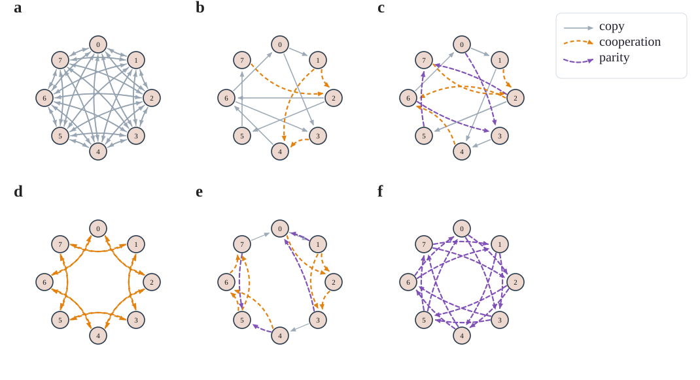

把这组六个拓扑先摆在结果图之前，有一个直接好处：读者可以先区分“稠密连接、环形连接、双社区弱桥接、以及显式 cooperative/parity 注入”这几类结构来源，再去理解后面的 EI 与协同排序究竟是在响应整体连边密度，还是在响应更强的高阶协调机制。这里新的 `E` 被特意设计成一个更有代表性的对照：它不再追求和 `F` 完全同边数，而是让两个 4 节点社区在内部形成更密的局部连接，同时社区之间仍只保留两条弱桥接边。这样一来，图形上更容易看出 `E` 的模块化结构，也更便于检验“社区内更密”是否会自动抬高系统级协同。

为了让 notebook 和正文都更聚焦，本节只保留一张最直接的系统级结果汇总图：左侧汇总总 `EI`，右侧汇总系统级 `\Phi^{\mathrm{EID}}`。图中仍使用小写 `a-f` 标记六个网络，与上面的六联拓扑子图编号一一对应。

  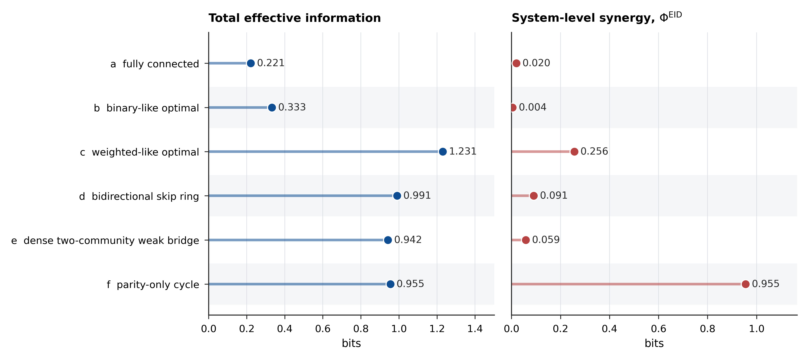

从按新 `coop` 口径重算后的结果看，这组六个拓扑仍然呈现出清楚的分层趋势：`F` 网络的总 `EI` 最高（1.932），且 `\Phi^{\mathrm{EID}}` 也最高（0.564）；`C` 网络次之（分别为 1.231 与 0.256）；`D/E` 处于中间区间，其中新的密社区 `E` 得到 `EI=0.931` 与 `\Phi^{\mathrm{EID}}=0.048`，而 `D` 为 `EI=1.035`、`\Phi^{\mathrm{EID}}=0.047`；`A/B` 则整体较低，其中 `B` 虽然总 `EI` 仍略高于 `A`（0.333 对 0.221），但其系统级协同只有 `0.004`，几乎退回到接近纯 pairwise / copy 型传播的区域。这个重算后的 `B/C/F` 对照更直接地说明了本文想强调的区分：当 cooperative 作用改为“目标节点全部输入的整体乘积”以后，只有那些确实依赖更大范围联合约束的网络，才会稳定抬高 `\Phi^{\mathrm{EID}}`；单纯拥有较优 pairwise 拓扑或较高局部连边密度，并不会自动推出显著的系统级协同。这说明在离散布尔网络上，EI 分解确实能够把“整体因果强度较高”和“高阶协同占比较高”这两个层面区分开来，从而支持 `RQ1`。

### 6.3 实验二：RQ2 的验证

- **目的**：测试 EI 因果图是否能恢复真实动态因果结构，并把主示例压缩到一个可以完整枚举所有非零边与超边的最小系统。

- **三变量主示例**：正文不再使用此前的五节点 mixed-motif 网络，而改用一个三变量离散布尔系统。其动力学写为

$$
x_{0,t+1} = x_{2,t}, \qquad
x_{1,t+1} = x_{0,t} \land x_{1,t}, \qquad
x_{2,t+1} = x_{0,t} \land x_{1,t}.
\tag{6.3-1}
$$

这个设计只保留两类最基本的原始机制：

1. 一个普通的 `COPY(x_2)` 机制，对应单边 `x_{2,t} \to x_{0,t+1}`；
2. 一个被重复读出两次的 `AND(x_0,x_1)` 机制，对应两个单目标读出 `x_{1,t+1}` 与 `x_{2,t+1}`。

其好处是，图里出现的每一条非零结构都能直接追溯到这两个原始机制之一，而不会再混入额外的节点或门型。更重要的是，它还允许我们把目标既取为单节点，也取为联合目标子集：正文主图展示 $|B|=1$ 的单目标情况，而 $|B|>1$ 的目标集合则单独列成数值表，从而既保留一般定义，又避免图面过于拥挤。

- **比较对象**：对同一主示例并排构建两类主图：
  1. **真实机制图**：只画 1 条 `COPY` 边与 2 个 `AND` 超边；
  2. **合并后 EI 图**：在第 3.2 节一般定义的基础上，先取 $|B|=1$ 的单目标特例，把普通 EI 边与单目标协同超边放在同一张图里。普通边权定义为

$$
w_{i \to j} = EI\bigl(X_t^{(i)} \to X_{t+1}^{(j)}\bigr).
\tag{6.3-2}
$$

  对同一单目标节点 $j$，协同超边权重定义为

$$
w_{\{i,k\} \Rightarrow j}^{\mathrm{syn}}
=
EI\bigl(X_t^{(i,k)} \to X_{t+1}^{(j)}\bigr)
- EI\bigl(X_t^{(i)} \to X_{t+1}^{(j)}\bigr)
- EI\bigl(X_t^{(k)} \to X_{t+1}^{(j)}\bigr).
\tag{6.3-3}
$$

  对联合目标 $B=\{1,2\}$ 的情形，则不再把它强行画进同一张图，而是直接按第 3.2 节的一般定义计算

$$
w_{\{0,1\}\Rightarrow\{1,2\}}^{\mathrm{syn}}
=
EI\bigl((X_t^{(0)},X_t^{(1)}) \to (X_{t+1}^{(1)},X_{t+1}^{(2)})\bigr)
- EI\bigl(X_t^{(0)} \to (X_{t+1}^{(1)},X_{t+1}^{(2)})\bigr)
- EI\bigl(X_t^{(1)} \to (X_{t+1}^{(1)},X_{t+1}^{(2)})\bigr),
\tag{6.3-4}
$$

并把结果列为补充表格。换言之，本轮主展示把“单目标普通边”和“单目标协同超边”统一视作一张最小 EI 机制图的两个组成部分；而多目标协同则保留在同一主示例下的联合目标对照表中。

- **当前实现结果**：notebook 已把主示例网络的图导出到 `fig/boolean_motif_causal_graphs/`。最关键的对照仍是“真实机制图 vs. 合并后 EI 图”，只是图内不再额外放标题，而把标题留给正文与图注：

  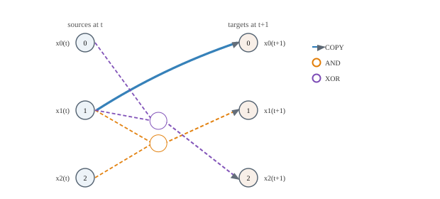
  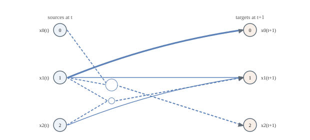

  这个三变量主例子里，所有非零结构都可以一一对应回式 (6.3-1) 的原始机制：

  - `x_{2,t} \to x_{0,t+1}` 是唯一一条由 `COPY(x_2)` 直接产生的普通边，权重为 `1.000`；
  - `x_{0,t} \to x_{1,t+1}`、`x_{1,t} \to x_{1,t+1}` 与超边 `\{x_{0,t},x_{1,t}\}\Rightarrow x_{1,t+1}`，对应 `AND(x_0,x_1)` 的第一个读出；其中两条单边 EI 都约为 `0.311`，额外协同约为 `0.189`；
  - `x_{0,t} \to x_{2,t+1}`、`x_{1,t} \to x_{2,t+1}` 与超边 `\{x_{0,t},x_{1,t}\}\Rightarrow x_{2,t+1}`，对应同一个 `AND(x_0,x_1)` 机制的第二个读出；其数值与前一读出完全相同；
  - 当目标改成联合目标 `B=\{1,2\}` 时，仍有
    `w_{\{0,1\}\Rightarrow\{1,2\}}^{\mathrm{syn}} \approx 0.189` bit，说明目标不必限制为单个节点，联合目标子系统同样可以承载可解释的协同机制。

  因而，这个更小的主示例已经足以支撑本节最核心的主张：**EI 因果图的普通边负责暴露“单源可见”的机制投影，而协同超边负责补上“只有联合观察才会出现”的那部分机制贡献；当目标换成变量子集时，这一解释仍然成立。**

### 6.4 实验三：RQ3 的验证

- **目的**：直接仿照 Hoel 的 causal emergence 思路 [4,5]，先在一个可以全状态枚举的手工设计布尔网络上搜索“总 EI 最大的宏观尺度”，再检查该尺度上的 EI 因果图与总协同是否也更清晰、更突出。这样可以把“用 EI 选尺度”和“在选出的尺度上做 EI 分解”串成一个闭环。
- **系统设计**：采用一个 6 节点离散布尔网络，微观节点写作 `a1, a2, b1, b2, c1, c2`。网络被有意设计成“微观上带有上下文门控，宏观上只保留 pairwise 因果边”的结构。令三对节点 `\{a1,a2\}`、`\{b1,b2\}`、`\{c1,c2\}` 形成候选宏观块，并规定

$$
a_{1,t+1} = (b_{1,t} \lor b_{2,t}) \land (c_{1,t} \lor c_{2,t}), \quad
a_{2,t+1} = (b_{1,t} \lor b_{2,t}) \land \neg (c_{1,t} \lor c_{2,t}),
$$

$$
b_{1,t+1} = (c_{1,t} \lor c_{2,t}) \land (a_{1,t} \lor a_{2,t}), \quad
b_{2,t+1} = (c_{1,t} \lor c_{2,t}) \land \neg (a_{1,t} \lor a_{2,t}),
$$

$$
c_{1,t+1} = (a_{1,t} \lor a_{2,t}) \land (b_{1,t} \lor b_{2,t}), \quad
c_{2,t+1} = (a_{1,t} \lor a_{2,t}) \land \neg (b_{1,t} \lor b_{2,t}).
\tag{6.4-1}
$$

  这组更新规则的关键点在于：每个宏观值都不是被简单复制到两个微观 readout 上，而是被另一个模块的当前状态“分流”到左或右节点。例如，`a1/a2` 这对 readout 共同编码的是 `B_t := b_{1,t} \lor b_{2,t}`，而 `C_t := c_{1,t} \lor c_{2,t}` 只负责决定这份信息落到 `a1` 还是 `a2`。若将三对节点分别粗粒化为
  `A_t = a_{1,t} \lor a_{2,t}`、`B_t = b_{1,t} \lor b_{2,t}`、`C_t = c_{1,t} \lor c_{2,t}`，则立刻得到

$$
A_{t+1} = B_t, \qquad B_{t+1} = C_t, \qquad C_{t+1} = A_t.
\tag{6.4-2}
$$

  也就是说，粗粒化之后的宏观动力学只是一个纯 pairwise 的三节点环：`B \to A`、`C \to B`、`A \to C`，并不存在宏观超边；微观层那些看起来像高阶机制的门控依赖，会被吸收到宏观节点的内部编码里。
- **实验流程**：
  1. 在一族可解释的候选粗粒化映射 $\psi$ 上搜索宏观模型。这里不做任意状态映射的全空间暴搜，而只考虑“节点分组 + 每组二值聚合”的候选族，以保证粗粒化结果仍具有机制可解释性。
  2. 对每个候选粗粒化映射 $\psi$，按照 Hoel 的 macro perturbation 方式构造宏观 TPM，并计算该尺度上的总 EI

$$
EI(\psi) := EI\bigl(Z_t^{(\psi)} \to Z_{t+1}^{(\psi)}\bigr).
\tag{6.4-3}
$$

  3. 取 $\psi^\star = \arg\max_{\psi} EI(\psi)$ 作为最优粗粒化映射，并在该尺度上构建 EI 因果图与协同超边图。
  4. 将微观尺度 `micro`、最优粗粒化映射 $\psi^\star$，以及若干个具有相同宏观节点数的随机粗粒化映射 $\psi_{\mathrm{rand}}$ 做并列比较。
- **指标**：总 EI、总协同

$$
Syn^{\mathrm{EID}}
=
EI(Z_t \to Z_{t+1})
-
\sum_i EI\bigl(Z_t^{(i)} \to Z_{t+1}\bigr),
\tag{6.4-4}
$$

  以及 EI 因果图中的 pairwise 边与协同超边结构。这里 `Syn` 关注“当目标取为整体下一时刻联合变量时，必须联合观察源侧各部分才会出现的额外因果贡献”。
- **比较重点**：本实验不要求“EI 最大的尺度”与“总协同绝对值最大的尺度”完全重合；更关键的是检查，$\psi^\star$ 是否会优先选择那些能够把局部门控依赖吸收到宏观节点内部的粗粒化，从而让宏观动力学本身变得更接近 pairwise 图。为此，结果展示时主要包含三部分：微观拓扑与更新规则、候选粗粒化的 EI 排名、以及最优粗粒化下的宏微观因果图对照。
- **预期结果**：若 EI 最大化确实捕捉到了更合适的因果尺度，则最优粗粒化 $\psi^\star$ 不应只是“总 EI 更大”；它还应把原本散落在模块内部的局部门控依赖吸收到宏观节点内部，使宏观图只剩更稀疏、更模块化、也更容易解释的 pairwise 机制。若这一现象出现，就可以较直接地说明：**EI 最大化不仅能作为“先找对分析尺度”的步骤，还会系统性地减少宏观层显式暴露出来的协同。**

在进入 EI 因果图之前，先看一下这个手工系统本身的微观拓扑。图 7.4(a) 只展示布尔网络的机制结构，不涉及粗粒化映射，因此更适合说明“为什么这个系统有机会在宏观尺度上变得更简单”。图中的灰色实线表示 copy 关系，橙色虚线表示 `AND/OR` 形式的局部门控。可以直接看到，`a1/a2`、`b1/b2`、`c1/c2` 三对节点各自承担一个宏观变量的读出功能，但具体是落到左节点还是右节点，要由另一个模块的当前状态决定；也正因为如此，微观层看上去比真正的宏观机制更“拥挤”。

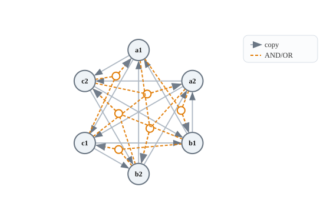

这张图对应的更新式正是式 (6.4-1)。它想表达的不是“宏观上会新长出一个超边”，而是相反：**同一个宏观 bit 在微观层被拆成一对条件 readout 之后，会制造出局部高阶结构；而一旦用正确的粗粒化把这对 readout 重新合并，这些高阶结构就会被吸收到宏观节点内部。**

为使这一点更直观，图 7.4(b) 给出了手工系统在最优粗粒化下的总览图：上半部分是宏观 EI 因果图，下半部分是微观 EI 因果图；左右两侧的彩色曲线分别表示时刻 $t$ 与 $t+1$ 的粗粒化映射。图中采用“小写表示微观、大写表示宏观”的记号，因此 `a1/a2`、`b1/b2`、`c1/c2` 三对节点分别被压缩为宏观节点 `A,B,C`。这样做的目的不是改变前文公式中的记号，而是让图上的宏微观对应关系更容易一眼看清。

  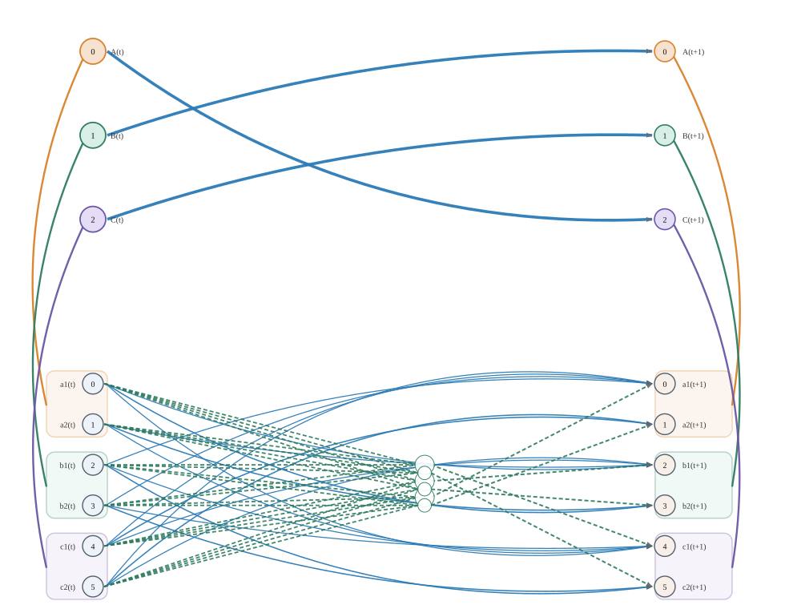

从该图可以直接看到：EI 最优粗粒化并不是简单地“删边”或“合并节点”，而是把微观层较分散的依赖重新组织成一个更清楚的宏观机制图。就当前手工系统而言，最优粗粒化仍对应三对自然模块 `\{a1,a2\}`、`\{b1,b2\}`、`\{c1,c2\}`，其宏观尺度总 EI 达到 `3.000`，明显高于同规模随机粗粒化均值 `1.255`。更关键的是，最优尺度上的宏观图只剩下 `B \to A`、`C \to B`、`A \to C` 这三条 pairwise 因果边，而宏观总协同降到 `0.000`；相对地，随机粗粒化的平均宏观协同约为 `0.265`。这正是本节想强调的现象：**EI 最大化倾向于把拥有局部协同的微观模块收缩成宏观节点，从而让宏观动力学变得更接近无超边的 pairwise 图。**

### 6.5 实验四：RQ4 的验证

**TODO**：在一个更真实的例子上检验向下因果，比如鸟群，Couzin模型。

**主实验**：直接复现 `Rosas et al. (2020)` Figure 1 右图对应的最小例子。设系统由 $n$ 个二值节点组成，规定

$$
x_{t+1}^{(1)} = x_t^{(1)} \oplus x_t^{(2)} \oplus \cdots \oplus x_t^{(n)},
\tag{6.5-1}
$$

  而其余 $x_{t+1}^{(j)}$（$j \neq 1$）均为与 $\mathbf{x}_t$ 独立的公平硬币。于是整体状态 $\mathbf{x}_t$ 可以完美预测目标节点 $x_{t+1}^{(1)}$，但任一单节点 $x_t^{(i)}$ 都不能单独预测它。
- **检验指标**：对每个目标节点 $j$，计算

$$
DC_j
=
EI(\mathbf{x}_t \to x_{t+1}^{(j)})
- \sum_{i=1}^n EI\bigl(x_t^{(i)} \to x_{t+1}^{(j)}\bigr).
\tag{6.5-2}
$$

  在这一指标下，本实验的叙述顺序分成两步。**第一步先并列看 `Rosas et al. (2020)` Figure 1 的两个原始最小例子**：
  - 右图 `Downward causation`：式 (6.5-1) 的 XOR 目标节点例子。这里预期 `DC_1 > 0` 且其余目标节点的 `DC_j \approx 0`。若把式 (5.2) 的第一项记为 `flexibility`、第二项记为 `environment synergy`，则这个 Rosas 原始 XOR 例子只会激活前者，而后者应为 0。
  - 左图 `Causal decoupling`：未来整体 parity 倾向保持，但任一单个未来节点都不由过去整体定向决定。这个例子给出的是“宏观 parity 通道有信息，但所有单节点目标的 `DC_j` 仍接近 0”。
- **实现形态**：建议把该部分做成独立 notebook，并用全状态枚举精确计算；当前仓库中的 `exp/experiment6_downward_causation.ipynb` 即用于承载这一验证。
- **第一步的当前实现结果**：该 notebook 已将 Rosas 的两个原始最小例子导出为 `fig/experiment6_downward_causation/downward_causation_vs_decoupling.svg`。下面这张图只对应 Rosas 的两个原始 motif，应当先于任何 mixed-case 图出现：

  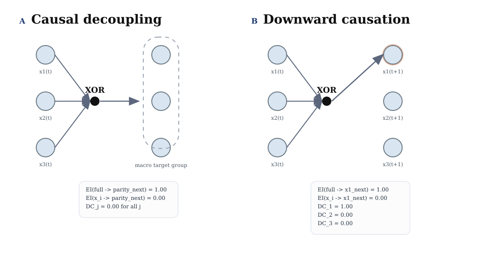

  这两个原始例子先把第 5 节定义中的两种边界条件分开了：
  - 在 Rosas 的 `Downward causation` 例子中，`EI(X_t \to X_{t+1}^{(1)}) = 1.00`，而三个单源项 `EI(X_t^{(i)} \to X_{t+1}^{(1)})` 全部为 `0.00`，因此 `DC_1 = 1.00`；并且这个正值完全来自 `flexibility`，`environment synergy = 0.00`；
  - 同一个系统里其余两个目标节点只是独立随机硬币，所以 `DC_2 = DC_3 = 0.00`；
  - 在 `Causal decoupling` 对照中，宏观 parity 通道仍有 `EI^EID(full \to parity_next) = 1.00`，但任一单节点目标都没有向下因果，因此所有 `DC_j = 0.00`。

  也就是说，Rosas 的两个原始最小例子已经足以区分两件事：一是“整体信息真正压到某个单目标上”的向下因果，二是“整体层只是在宏观层自我延续”的 causal decoupling。
- **第二步：在 Rosas 两个原始例子之后，再加入本文的 mixed case 扩展**。这个最小 3 节点系统不再承担“定义向下因果是否存在”的任务，而是专门用来把式 (5.2) 的两部分进一步拆开：

$$
x_{t+1}^{(1)} = \bigl(x_t^{(1)} \land x_t^{(2)}\bigr) \oplus x_t^{(3)},
\tag{6.5-3}
$$

  等价地，也可以把它直接读成 `(x_t^{(1)} AND x_t^{(2)}) XOR x_t^{(3)}`。其余 $x_{t+1}^{(j)}$（$j \neq 1$）仍为独立公平硬币。这个构造的作用是：目标节点既不能脱离环境单独决定，也不能被环境内部的单边作用完全解释，因此两个组成项都应为正。对 `n=3` 的均匀干预，当前 notebook 给出的典型结果是：
  - `EI(X_t \to X_{t+1}^{(1)}) = 1.00`；
  - `EI(\{X_t^{(2)}, X_t^{(3)}\} \to X_{t+1}^{(1)}) = 0.50`；
  - `EI(X_t^{(3)} \to X_{t+1}^{(1)}) = 0.189`，其余两个单源项为 `0.00`；
  - 因而 `flexibility = 0.50`、`environment synergy = 0.311`，从而 `DC_1 = 0.811`。

  在 Rosas 两图之后，notebook 再把这个 mixed-case 机制单独画成一张新图。下面这张图应被理解为“第二步”的扩展图，而不是与 Rosas 原图并列的第三个原始例子；图中只保留机制结构，相关数值结果直接在正文里说明：

  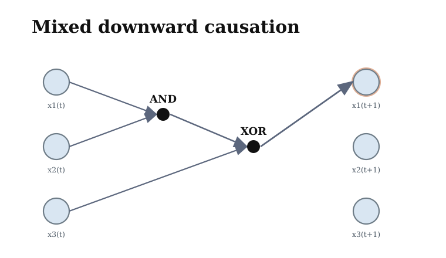

  这张结构图支持的结论比单纯列数值更直观：目标节点 `x_1(t+1)` 并不是由一个单独源直接复制出来的，而是要先经过 `x_1(t)` 与 `x_2(t)` 的 `AND`，再与 `x_3(t)` 经过 `XOR` 才能得到。因此：
  - `EI^EID(env -> x1_next) = 0.50` 说明环境整体已经携带了一半 bit 的有效信息；
  - 但环境内部又不能拆成两个独立的单边作用，因为只有 `x_3(t)` 单独保留了 `0.189` bit，而剩余的 `0.311` bit 只能以 `environment synergy` 的形式出现；
  - 同时，整体到目标的 1 bit 信息也不能被“个体单独 + 环境整体”完全拼出，所以还保留了 `flexibility = 0.50`。

  因而，这个 mixed case 应被理解为建立在 Rosas 两个原始例子之后的进一步扩展：它不是为了重新定义向下因果，而是在 Rosas 已经区分“向下因果”和“causal decoupling”之后，再把 `DC_j` 继续拆成 `flexibility` 与 `environment synergy` 两种来源。
- **预期结果**：若 Rosas 的 XOR 目标节点给出“纯 `flexibility`”的正 $DC_j$，Rosas 的 causal decoupling 对照不给出虚假的单节点 $DC_j$，而新增 mixed case 又进一步给出“`flexibility + environment synergy` 同时为正”的 $DC_j$，则说明第 5 节给出的定义不仅能识别向下因果，还能把其内部来源进一步区分开。

### 6.6 实验五：RQ5 的验证

- **目的**：验证对于强非线性的连续系统，`transport map` 是否可以从样本分布中恢复 EI 分解的结构变化，而不必把主结果建立在全局线性高斯 surrogate 上。这里把机制强度压缩成单个参数 $\alpha$，并显式扫描外部输出噪声强度 $\sigma_{\epsilon}$。
- **实验设置**：当前 notebook `exp/tm_nonlinear.ipynb` 固定两个源变量的独立均匀干预分布为

$$
X_2^n, X_3^n
\sim
\mathrm{Uniform}\!\left[-\frac{L}{2},\frac{L}{2}\right],
\qquad L=2.
\tag{6.6-1}
$$

目标变量采用已知动力学

$$
X_1^{n+1}
=
\alpha\,\sin\!\bigl(X_2^n X_3^n\bigr)
+ (1-\alpha)X_2^n
+ \sigma_{\epsilon}\epsilon^n,
\qquad
\epsilon^n \sim \mathcal{N}(0,1),
\qquad
\alpha \in \{0,0.2,\dots,1\}.
\tag{6.6-2}
$$

等价地，给定源变量后，目标条件分布为

$$
p_{\sigma_{\epsilon}}\!\left(x_1^{n+1}\mid x_2^n,x_3^n\right)
=
\mathcal{N}\!\left(
\alpha\sin(x_2^n x_3^n)+(1-\alpha)x_2^n,
\sigma_{\epsilon}^2
\right).
\tag{6.6-3}
$$

式 (6.6-2) 的设计把两种机制放在同一个连续谱上：当 $\alpha=0$ 时，目标退化成纯单源通道 $X_2^n \to X_1^{n+1}$；当 $\alpha=1$ 时，目标只由 $\sin(X_2^nX_3^n)$ 的联合乘积项驱动，单独观察 $X_2^n$ 或 $X_3^n$ 都难以解释目标。外部噪声 $\sigma_{\epsilon}\epsilon^n$ 不改变无噪声机制的函数结构，但会增大条件熵 $H(X_1^{n+1}\mid X_2^n,X_3^n)$，从而压低可由样本分布恢复出来的绝对信息量。

- **估计量**：对每个 $\alpha$ 和 $\sigma_{\epsilon}$，从同一干预分布重复采样并用 transport map 估计

$$
\begin{aligned}
EI_{\mathrm{TM}}(X_2,X_3 \to X_1)
&:=
I_{\mathrm{TM}}\!\left((X_2^n,X_3^n);X_1^{n+1}\right), \\
EI_{\mathrm{TM}}(X_2 \to X_1)
&:=
I_{\mathrm{TM}}\!\left(X_2^n;X_1^{n+1}\right), \\
EI_{\mathrm{TM}}(X_3 \to X_1)
&:=
I_{\mathrm{TM}}\!\left(X_3^n;X_1^{n+1}\right).
\end{aligned}
\tag{6.6-4}
$$

对应的协同项定义为

$$
Syn_{\mathrm{TM}}
:=
EI_{\mathrm{TM}}(X_2,X_3 \to X_1)
- EI_{\mathrm{TM}}(X_2 \to X_1)
- EI_{\mathrm{TM}}(X_3 \to X_1).
\tag{6.6-5}
$$

图中蓝色虚线对应联合 $EI_{\mathrm{TM}}(X_2,X_3 \to X_1)$，橙色实线对应式 (6.6-5) 的 $Syn_{\mathrm{TM}}$，绿色和红色实线分别对应两个单源项。legend 中只保留线型，以便直接区分联合 EI 的虚线和其余实线。

这里需要区分两个变化：$\alpha$ 改变的是无噪声机制本身，$\sigma_{\epsilon}$ 改变的是该机制在样本分布中还能被恢复出的信息量。当 $\alpha=0$ 时，目标几乎是纯 $X_2^n$ 单源通道，联合 EI 主要由 $EI_{\mathrm{TM}}(X_2\to X_1)$ 贡献，协同项应接近零；随着 $\alpha$ 增大，线性单源项 $(1-\alpha)X_2^n$ 被削弱，而 $\sin(X_2^nX_3^n)$ 的二源联合项变强，因此单源 EI 下降、协同项上升。联合 EI 本身不必随协同单调上升，因为它衡量的是两源合起来对目标的总可恢复信息，而纯线性通道与压缩后的正弦乘积通道具有不同的输出熵与信噪比。

- **低噪声结果**：第一张结果图取 $\sigma_{\epsilon}=0.05$。这可以视为相对低噪声的样本分布层 benchmark，结果已保存为 `fig/transport_map_mutual_information/tm_alpha_ei_decomposition.png`。

  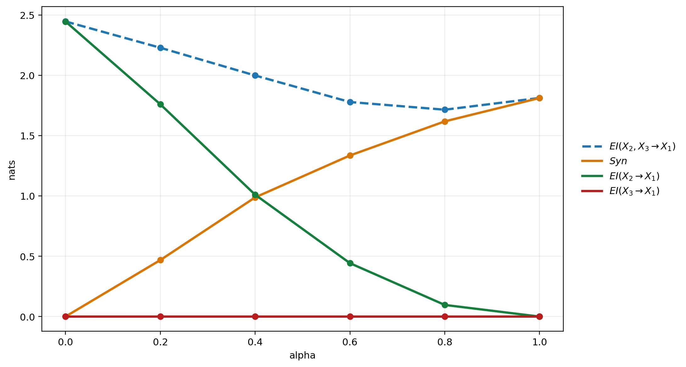

  在低噪声条件下，估计结果清楚地跟随式 (6.6-2) 的结构参数变化：当 $\alpha=0$ 时，联合 EI 几乎完全由 $EI_{\mathrm{TM}}(X_2 \to X_1)$ 解释，$Syn_{\mathrm{TM}}\approx 0.0004$ nats；随着 $\alpha$ 增大，绿色单源项从约 `2.447` nats 下降到接近 `0`，橙色协同项则从接近 `0` 上升到约 `1.813` nats。到 $\alpha=1$ 时，联合 EI 与协同项几乎重合，说明 transport map 估计到的信息主要来自 $X_2^n$ 与 $X_3^n$ 的联合作用，而不是任一单源边际。

- **SHAP 对照实验**：为了把 PEID 的机制信息分解与常用预测解释方法区分开，notebook 还在同一组低噪声动力学上加入 TreeSHAP 对照。具体做法是：对每个 $\alpha$ 重新采样式 (6.6-1)--(6.6-3) 的数据，用随机森林回归器拟合 $(X_2^n,X_3^n)\mapsto X_1^{n+1}$，再计算 TreeSHAP 的单变量 mean absolute SHAP 值和二阶 interaction value。当前实现使用 `n_samples=2000`、`repeats=2`、`shap_sample_size=500`、随机森林 `n_estimators=120`、`min_samples_leaf=5`，结果保存为 `fig/transport_map_mutual_information/tm_alpha_shap_runs.csv`、`tm_alpha_shap_summary.csv` 和 `tm_alpha_shap_peid_comparison.csv`。

  单变量 SHAP 归因对应 Shapley 边际贡献

$$
\phi_i
=
\sum_{S\subseteq N\setminus\{i\}}
\frac{|S|!(|N|-|S|-1)!}{|N|!}
\left[
v(S\cup\{i\})-v(S)
\right],
\tag{6.6-6}
$$

  其中 $v(S)$ 是只观察特征集合 $S$ 时预测模型输出的条件期望或背景期望。本文只把 SHAP 作为模型解释基线，不把 $\phi_i$ 直接解释为机制 EI。图中左面板比较 PEID 协同比例

$$
\rho_{\mathrm{PEID}}
=
\frac{Syn_{\mathrm{TM}}}{EI_{\mathrm{TM}}(X_2,X_3\to X_1)}
\tag{6.6-7}
$$

  与 TreeSHAP 的二阶交互占比；右面板比较 PEID 的单源占比和 SHAP 的 mean $|\phi_i|$。实线表示 PEID，虚线表示 SHAP，所有数据点使用统一 marker，legend 只保留线型以强调两类方法的区别。

  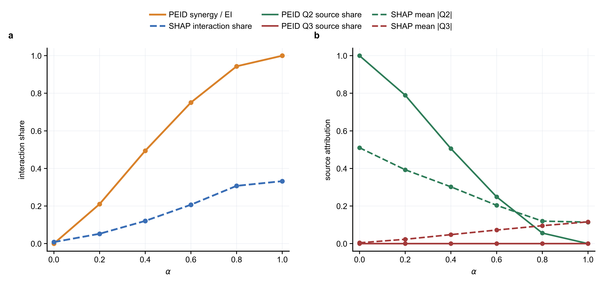

  这张图给出一个重要的解释边界：SHAP interaction share 与 $\rho_{\mathrm{PEID}}$ 都随 $\alpha$ 增大而上升，说明随机森林预测器和 TM/PEID 都捕捉到了联合项逐渐增强的趋势；但二者数值并不相等，因为 TreeSHAP 分解的是预测模型输出的边际贡献，而 PEID 分解的是干预分布下的有效信息。尤其是 $X_3$ 的 SHAP 归因会随 $\alpha$ 增大而上升，这并不表示 $X_3$ 单独形成了稳定机制通道；它主要反映 $X_3$ 通过 $\sin(X_2^nX_3^n)$ 参与了联合预测项，Shapley 归因会把不可约联合机制的一部分分摊到单变量贡献中。因此，在协同系统里，单看 mean $|\phi_{X_3}|$ 容易把“联合机制中的必要变量”误读为“单变量机制强”。更稳妥的读法是：用 SHAP interaction share 检查预测模型是否学到交互趋势，用式 (6.6-7) 判断干预机制中的协同信息强度。

- **高噪声结果**：第二张结果图只把外部噪声增大到 $\sigma_{\epsilon}=0.6$，其余 `L`、`alpha` 网格、样本数与重复次数保持一致；对应结果保存为 `fig/transport_map_mutual_information/tm_alpha_high_noise_ei_decomposition.png`，明细表保存为 `tm_alpha_high_noise_summary.csv`。

  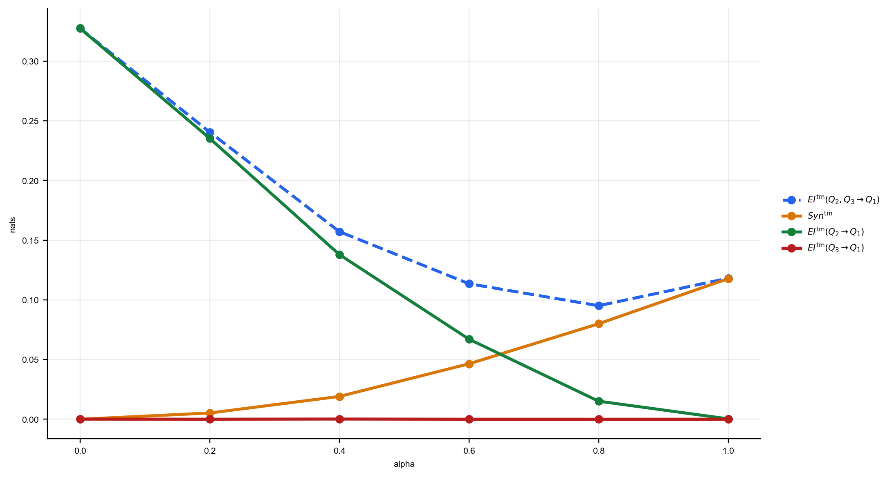

  高噪声条件下，结构趋势仍然存在，但所有绝对信息量都被明显压低。$\alpha=0$ 时，联合 EI 从低噪声下约 `2.447` nats 降到约 `0.328` nats，且协同仍在零附近（`-0.00002` nats，可视为有限样本估计误差）；$\alpha=1$ 时，协同从约 `1.813` nats 降到约 `0.118` nats，但 $Syn_{\mathrm{TM}}/EI_{\mathrm{TM}}$ 仍约为 `0.997`。原因是 $\sigma_{\epsilon}$ 会增大式 (6.6-3) 中的条件不确定性 $H(X_1^{n+1}\mid X_2^n,X_3^n)$，从而压低联合 EI 与协同项的绝对值；同时，正弦乘积通道的有效输出幅度和局部灵敏度不同于纯线性通道，因此噪声还会改变曲线在不同 $\alpha$ 区间的弯曲程度。中间区间也呈现同样趋势：例如 $\alpha=0.6$ 时，联合 EI 约为 `0.114` nats，其中协同约为 `0.046` nats，单源 $X_2$ 仍保留约 `0.067` nats；这对应于式 (6.6-2) 中单源项与联合项共同存在的混合机制。

- **对 RQ5 的回应**：这组双噪声实验把连续强非线性验证改成更直接的已知机制检验。结果表明，transport map 不仅能在低噪声下恢复“单源解释逐步让位于联合协同”的结构转移，也能在外部噪声增大时保留正确的机制排序。需要同时强调的是，$\sigma_{\epsilon}$ 的增大会通过式 (6.6-3) 提高目标条件不确定性，因此会系统性压低 $EI_{\mathrm{TM}}$ 和 $Syn_{\mathrm{TM}}$ 的绝对值；所以后续跨实验比较时，不能只比较协同的 nats 数值，还必须同时报告噪声强度、干预盒宽 $L$ 与总 EI 基准。

### 6.7 实验六：RQ6 的验证

- **实验目标**：把第 6.6 节已经确立的连续 EI 分解口径推进到真实空气质量数据。本节聚焦杭州站点网络，在同一个多站点 `JointStationMLP` 预测器上比较三类 `12h` 结构：`O3 -> O3` 的单污染物跨站作用、`PM2.5 -> O3` 的单污染物跨站作用，以及同一源站点 `O3 + PM2.5 -> O3` 的二元协同作用。这里要回答的不是“哪一个站点的浓度最高”，而是：在当前污染物与气象联合状态给定时，哪些站点的当前状态对 `12h` 后全网 `O3` 具有更强的信息性作用，哪些作用更像单变量传播，哪些作用需要 `O3` 与 `PM2.5` 联合起来才出现额外解释力。
- **实验定位**：这一节使用杭州 `12` 个空气质量站点的当前污染物与气象联合状态预测 `12h` 后的目标变量，再用 `transport map` 口径对目标 `O3` 的站点间信息作用做 Monte Carlo 汇总。当前配置为 support-cover `L_v`，`gamma=1.00`，采样数 `M=4096`，随机种子为 `42`；图中展示每类结构的 top-10 非 self 连边，并让三个子图共享同一个节点 self-loop 色标。需要强调的是，这些边是分布层面的可解释因果摘要，不等同于某一次污染过程的物理烟羽路径；合理解释必须同时结合站点类型、地形通道、交通和工业源、以及 `O3-NOx-VOCs-PM2.5` 的化学耦合。

  先看预测任务是否足够可用。杭州 `12h` 设置下，`JointStationMLP` 的总体 `RMSE` 为 `26.006`，明显低于持续性基线的 `50.565`；只看 `O3` 时，模型 `RMSE` 为 `33.052`，持续性基线为 `68.753`，相关系数也从 `-0.087` 提升到 `0.713`。因此，后续图结构不是在一个完全失效的预测器上做解释，而是在一个已经优于简单基线的多站点状态转移模型上检查 `EI^{\mathrm{tm}}` 与 `Syn^{\mathrm{tm}}` 的空间分布。

  站点背景给这张图提供了一个必要的现实坐标。`1228A（浙江农大）` 属于主城区交通混合站，更像交通、商业居住活动、溶剂使用和二次污染共同作用后的城市综合背景代理；`1231A（临平镇）` 位于城郊居住与制造业园区叠加区，适合代表城东北工业-交通走廊和城市扩张边界；`3558A（市府大楼）` 位于临安山前县城背景区，三面环山和山间盆地特征会放大输送滞后与累积效应；`1227A（卧龙桥）` 和 `1233A（云栖）` 更接近西湖景区/山前背景站，适合观察局地环流和背景浓度。这个站点差异意味着，图上的强边不能简单解释为“源站排放量最大”，而应理解为不同站点所代理的污染背景、地形过滤和时间滞后的综合结果。

  这一解释也符合杭州已有观测研究。杭州城区 VOCs 研究表明，机动车尾气、溶剂使用、二次生成、工艺过程和燃烧源共同构成 VOCs 来源，其中机动车尾气贡献最高，且芳烃、醛酮类和烯烃是臭氧生成潜势较高的活性组分 [10]。基于二次有机气溶胶（SOA）和 `O3` 生成潜势的杭州协同控制研究进一步指出，芳香烃对 SOA 贡献很高，烯烃和芳香烃是 `O3` 生成潜势的主要贡献组分，甲苯、间/对二甲苯和邻二甲苯等物种是 `PM2.5` 与 `O3` 协同控制中的关键对象 [11]。因此，`PM2.5 -> O3` 图中的 `PM2.5` 不应被狭义理解为一次颗粒物质量浓度，它还常常代理交通排放、VOCs 前体物、二次气溶胶和气象累积背景。更一般地，近期机器学习研究也表明，`PM2.5` 会调制不同 VOCs 来源对臭氧生成的响应，交通颗粒物、化石燃料/工业 VOCs 和气象条件之间存在非线性交互 [12]。这些文献共同支持本节的口径：`PM2.5` 到 `O3` 的边既可能表示颗粒物直接影响光化学，也可能表示一组与 VOCs、NOx 和城市活动共变的综合污染状态。

  图中三个面板分别对应：(a) `O3 -> O3` pairwise 图，(b) `PM2.5 -> O3` pairwise 图，(c) `O3 + PM2.5 -> O3` 协同图。三个面板中的节点均放在真实经纬度位置上，节点颜色共享同一个 self-loop strength colorbar；箭头表示跨站 top-10 连边，线宽在各自面板内表示该类连边的相对强度。

  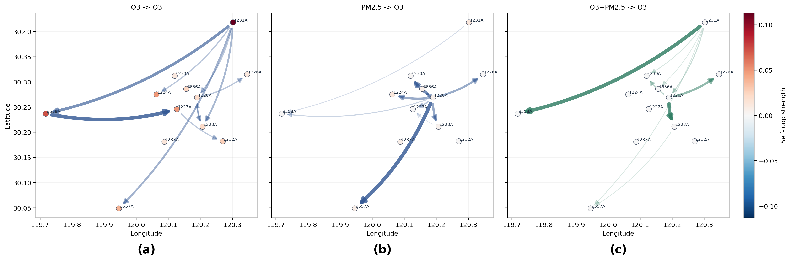

  面板 (a) 表明，杭州 `12h` 的 `O3 -> O3` 作用不是均匀铺满全网，而是由少数强边支配。当前最强边为 `3558A -> 1227A`，平均强度约 `0.151`；`1231A` 也非常突出，分别指向 `3558A`、`3557A`、`1223A`、`1228A`、`1224A` 等多个目标站点。这说明 `1231A` 更像一个稳定的 `O3` 外向 hub，而 `3558A -> 1227A` 则是在 `12h` 尺度下最强的单条跨站 `O3` 领先关系。前者与临平站“制造业园区和城市扩张叠加”的背景相吻合：它未必是单一排放点源，却能够代表城东北方向交通、产业和区域输送共同形成的 `O3` 状态。后者则更像地形过滤后的滞后信号：临安市府大楼位于山前盆地型环境，已有临安研究指出该区域受三面山地包围，颗粒物和气象因子存在明显滞后关系 [13]；因此，`3558A` 既可作为受体，也可能在 `12h` 尺度上把经过盆地和山前环流过滤后的区域信号传递到相邻景区背景站 `1227A`。

  面板 (b) 给出 `PM2.5 -> O3` 的 pairwise 结构。与面板 (a) 不同，这里最强连边高度集中在 `1228A` 发出的边上：`1228A -> 3557A` 的均值约为 `0.056`，随后是 `1228A -> 1230A`、`1228A -> 1223A`、`1228A -> 1224A`、`1228A -> 1226A` 和 `1228A -> 3656A`。这说明在 `12h` 预测窗口里，`1228A` 的当前 `PM2.5` 对多个站点未来 `O3` 的解释力最集中，和 `O3 -> O3` 图中 `1231A` 更分散的外向结构不同。结合站点背景，这一结果更适合解释为“主城区混合污染态”的中长尺度影响，而不是浙江农大附近存在一个独立的强颗粒物点源。主城区交通、商业活动、溶剂使用和燃烧源共同影响 VOCs、NOx、二次气溶胶和 `PM2.5`，这些变量又会共同改变 `O3` 生成和输送条件；所以当预测窗口拉长到 `12h` 及以上时，`1228A` 的 `PM2.5` 变量会成为城市累积背景的有效代理。杭州市空气质量改善规划也把 `PM2.5` 与 `O3` 协同控制、VOCs 与 NOx 协同治理列为核心问题，并指出移动源、区域传输和产业结构仍是杭州空气质量改善的重要压力 [14]，这与本图中主城区交通混合站外向作用增强的结果并不矛盾。

  面板 (c) 展示二元协同项，其定义为同一源站点当前 `O3` 与 `PM2.5` 联合指向目标站点未来 `O3` 时，相比两个单变量项之和额外增加的 `Syn^{\mathrm{tm}}`。当前最强协同边为 `1231A -> 3558A`，均值约 `0.00150`；`1228A -> 1223A`、`1228A -> 1226A`、`1228A -> 1230A` 也进入前列。但整体量级比 pairwise 边低一到两个数量级，且全量协同边的负值比例约为 `0.462`。因此，这里的协同结构更适合被理解为“少数站点对上存在额外联合收益”，而不是已经形成可以压倒 pairwise 传播的主导机制。这个结果也解释了为什么 `1228A -> 3557A` 可以在 `PM2.5 -> O3` 中最强，却不一定在协同图中最强：`Syn^{\mathrm{tm}}` 衡量的是非加性的新增信息，而不是两个单变量影响的总和。若 `1228A` 的 `PM2.5` 和 `O3` 都在代理同一套主城区上游污染背景，那么二者各自都可能对 `3557A` 的未来 `O3` 有解释力，但联合之后未必再产生很大的额外协同剩余。

  把三张图合在一起，可以得到更具体的科学解释。短时间尺度上，杭州 `O3` 网络更容易被城东北的临平走廊牵引，`1231A` 因而表现为稳定的 `O3` 外向枢纽；当影响间隔拉到中长尺度，网络主导因素逐步从快速传播转向累积背景，`1228A` 代表的主城区交通-商业-二次污染混合态开始主导 `PM2.5 -> O3` 外向作用，并在若干站点对上产生弱协同；`3558A` 则更像地形过滤后的敏感受体，能记录来自主城区和临平方向的滞后信号，同时在特定 `12h` 链路上向山前景区站输出经过过滤后的 `O3` 状态。由此看，杭州 `O3` 演化不是由单一排放源或单一站点控制，而更像由“城东北快速传播走廊 + 主城区综合污染背景 + 西部山前/盆地受体”共同构成的多尺度网络。

  因而，`RQ6` 在杭州 `12h` 真实空气质量实验中得到的结论是：`transport map` 首先恢复出清晰的 pairwise 跨站结构，其中 `O3 -> O3` 更突出 `1231A` 与 `3558A -> 1227A` 这类 `O3` 领先关系，`PM2.5 -> O3` 则更集中在 `1228A` 的外向边；二元 `O3 + PM2.5 -> O3` 协同确实存在，但主要表现为弱量级、少数边上的额外收益。这与前面连续机制实验的预期一致：真实空气质量系统中可以观察到协同信息，但在当前 `12h` 杭州任务里，它仍然弱于主导的 pairwise 跨站传播结构。更重要的是，本实验给出的治理含义应保持克制：`1228A` 的中长尺度作用支持关注主城区交通、VOCs 和 SOA 共同前体物，`1231A` 的外向 hub 支持关注临平及城东北工业-交通走廊，`3558A` 的受体属性提示西部山前地形会放大输送和滞后累积；但这些结果仍是站点网络层面的因果摘要，不能直接替代排放清单、风场诊断和源解析实验。

## 参考文献

1. Yang, M., Pan, L., & Zhang, J. (2025). Quantifying System‑Environment Synergistic Information by Effective Information Decomposition. Digital Technologies Research and Applications, 4(3), 22–34. https://doi.org/10.54963/dtra.v4i3.1492
2. Williams, P. L., & Beer, R. D. (2010). Nonnegative Decomposition of Multivariate Information. *arXiv preprint* arXiv:1004.2515.
3. Bertschinger, N., Rauh, J., Olbrich, E., Jost, J., & Ay, N. (2014). Quantifying Unique Information. *Entropy*, 16(4), 2161--2183.
4. Hoel, E. P., Albantakis, L., & Tononi, G. (2013). Quantifying causal emergence shows that macro can beat micro. *Proceedings of the National Academy of Sciences*, 110(49), 19790--19795.
5. Hoel, E. P. (2017). When the Map Is Better Than the Territory. *Entropy*, 19(5), 188. https://doi.org/10.3390/e19050188
6. Mediano, P., Seth, A., & Barrett, A. (2018). Measuring Integrated Information: Comparison of Candidate Measures in Theory and Simulation. Entropy, 21(1), 17. https://doi.org/10.3390/e21010017
7. Oizumi, M., Amari, S., Yanagawa, T., Fujii, N., & Tsuchiya, N. (2016). Measuring Integrated Information from the Decoding Perspective. *PLoS Computational Biology*, 12(1), e1004654. https://doi.org/10.1371/journal.pcbi.1004654
8. Baptista, R., Marzouk, Y. M., & Zahm, O. (2024). On the Representation and Learning of Monotone Triangular Transport Maps. *Foundations of Computational Mathematics*, 24, 2063--2108. https://doi.org/10.1007/s10208-023-09630-x
9. Marzouk, Y., Moselhy, T., Parno, M., & Spantini, A. (2017). Sampling via Measure Transport: An Introduction. In R. Ghanem, D. Higdon, & H. Owhadi (Eds.), *Handbook of Uncertainty Quantification* (pp. 785--825). Springer. https://doi.org/10.1007/978-3-319-12385-1_23
10. Jing, S., Gao, Y., Shen, J., Wang, Q., Peng, Y., Li, Y., & Wang, H. (2020). Characteristics and Reactivity of Ambient VOCs in Urban Hangzhou, China. *Environmental Science*, 41(12), 5306--5315. https://doi.org/10.13227/j.hjkx.202004021
11. Xu, L., Yan, R., Jin, J., & Xu, K. (2022). Coordinated Control of PM2.5 and O3 in Hangzhou Based on SOA and O3 Formation Potential. *Environmental Science*, 43(4), 1799--1807. https://doi.org/10.13227/j.hjkx.202108082
12. Tao, C., Zhang, Q., Huo, S., Ren, Y., Han, S., Wang, Q., & Wang, W. (2024). PM2.5 pollution modulates the response of ozone formation to VOC emitted from various sources: Insights from machine learning. *Science of the Total Environment*, 916, 170009. https://doi.org/10.1016/j.scitotenv.2024.170009
13. Lin, X., Chen, J., Lu, T., Huang, D., & Zhang, J. (2019). Air Pollution Characteristics and Meteorological Correlates in Lin'an, Hangzhou, China. *Aerosol and Air Quality Research*, 19, 2770--2780. https://doi.org/10.4209/aaqr.2019.03.0104
14. 杭州市生态环境局. (2022). 杭州市空气质量改善“十四五”规划. https://epb.hangzhou.gov.cn/art/2022/1/7/art_1229354834_4008171.html

附录内容已拆分至 [研究框架_附录](./研究框架_附录.md)。
