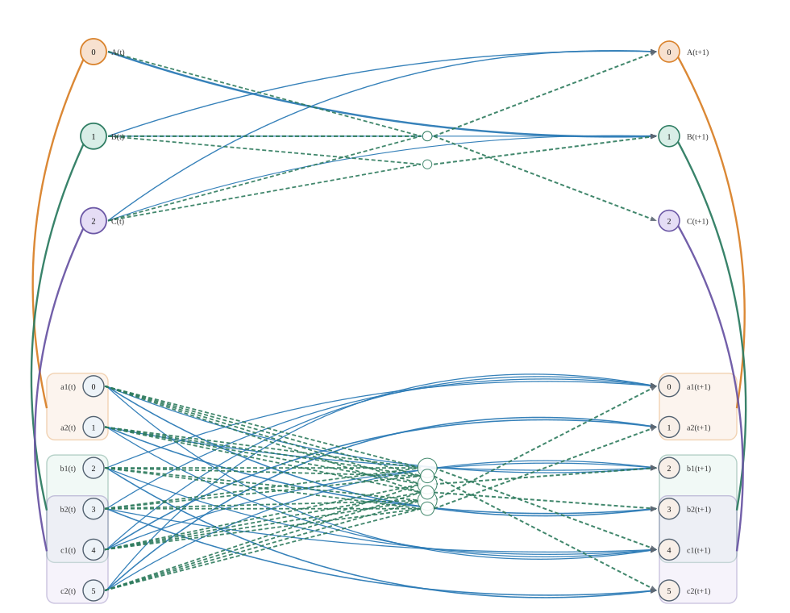
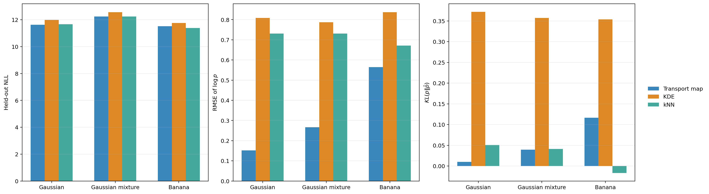
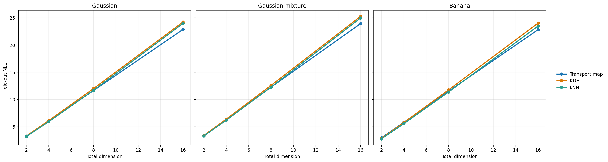
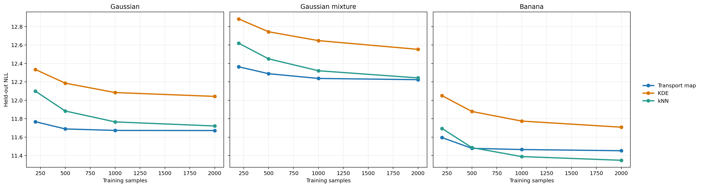
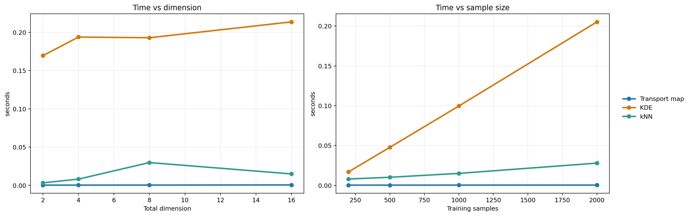
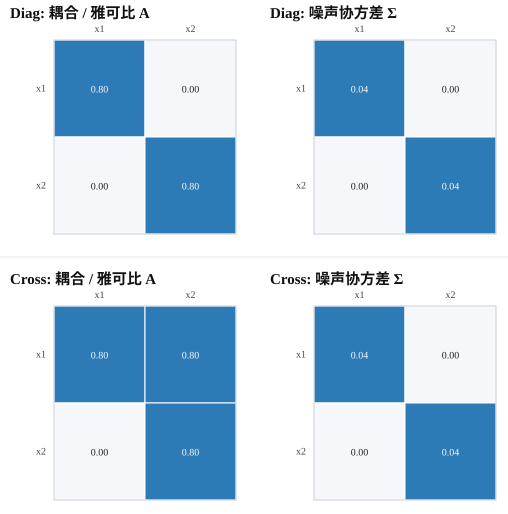
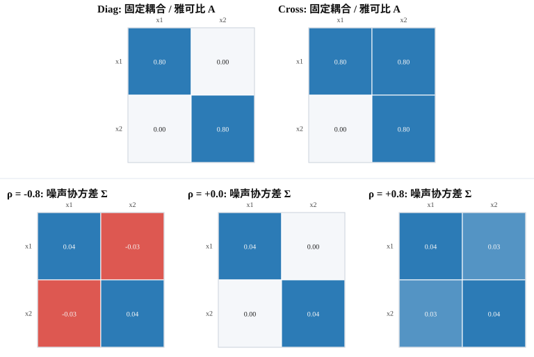
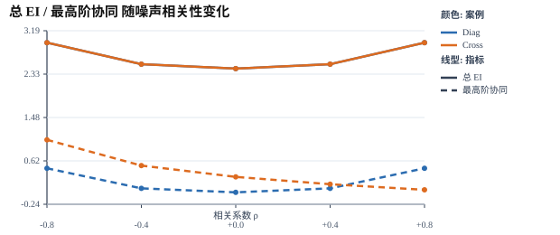

# 研究框架_附录

本文档收录《研究框架》的全部附录内容，正文与参考文献见 [研究框架](./研究框架.md)。

## 目录

- [附录 A 证明与推导](#附录-a-证明与推导)
  - [A.0 PID 理论背景与本文使用的公理体系](#a0-pid-理论背景与本文使用的公理体系)
  - [A.1 源侧协同非负性的完整证明](#a1-源侧协同非负性的完整证明)
  - [A.2 置换型最大 EI 系统的协同为零](#a2-置换型最大-ei-系统的协同为零)
  - [A.3 三变量情形下与 PID 公理相容的补充证明](#a3-三变量情形下与-pid-公理相容的补充证明)
  - [A.4 面向粗粒化的直接下界与目标充分块摘要](#a4-面向粗粒化的直接下界与目标充分块摘要)
- [附录 C 连续情形](#附录-c-连续情形中的干预口径与线性高斯公式)
  - [C.1 最大熵约束](#c1-为什么连续情形下要先说明最大熵相对于什么约束)
  - [C.2 高斯 EI 闭式](#c2-高斯代理口径下的一般线性高斯-ei-闭式)
  - [C.3 均匀盒近似](#c3-有界均匀盒干预下的高信噪比近似)
- [附录 D EI 展开](#附录-d-jacobian--covariance-形式下的任意子集-ei-展开)
  - [D.1 通用函数句柄的 dEI / dCE 实现口径](#d1-面向通用动力学函数句柄的-dei--dce-实现口径)
  - [D.2 任意输入子集到任意输出子集的 dEI 与 syn](#d2-任意输入子集到任意输出子集的-dei-与-syn)
- [附录 E 复杂度与搜索](#附录-e-计算复杂度估算与搜索策略)
- [附录 F 扩展定理与引理](#附录-f-更适合放在附录或讨论中的扩展定理与引理)
  - [F.1 三对一原子恢复](#f1-三对一最细原子的恢复)
  - [F.2 EI 最大化与 IT2.0](#f2-ei-最大化与-it20-最优划分的关系)
  - [F.3 Phi 公式](#f3-iit-20-phi-的离散状态依赖公式)
  - [F.4 与 \Phi_I 的关系](#f4-与-phi_i-的关系)
- [附录 G 离散 TPM 计算](#附录-g-离散-tpm-中-ei-的精确计算)
- [附录 H 方法边界](#附录-h-方法边界为什么只切源不任意切目标)
- [附录 I RQ3 补充图](#附录-i-rq3-中的非最优粗粒化补充图)
- [附录 J RQ3 随机实验说明](#附录-j-rq3-随机实验的系统构造粗粒化与宏观动力学诱导)
- [附录 K RQ5 补充图](#附录-k-rq5-中的连续密度估计器-benchmark-补充图)
  - [K.1 连续密度估计器 benchmark 补充图与说明](#k1-连续密度估计器-benchmark-补充图与说明)
- [附录 L RQ5 线性高斯补充实验](#附录-l-rq5-中的线性高斯最小机制与相关噪声补充结果)
  - [L.1 二维最小机制对照](#l1-二维最小机制对照)
  - [L.2 固定机制下的相关噪声扫描](#l2-固定机制下的相关噪声扫描)

## 附录 A. 证明与推导

### A.0 PID 理论背景与本文使用的公理体系

本附录后续会借用 PID（partial information decomposition）中的公理语言，说明正文命题 1 在三变量情形下为何成立。为避免读者把这里的论证误解为“本文完整采用了某一种 PID 计算方案”，先简要说明本文实际使用的内容。

PID 关注的是：当两个或多个源变量共同指向同一个目标变量时，联合互信息如何拆成冗余信息、特有信息和协同信息。对最基本的两个源一个目标情形，可写成

$$
I(X_1,X_2;Y)
=
Red(X_1,X_2;Y)
+
Un(X_1;Y\mid X_2)
+
Un(X_2;Y\mid X_1)
+
Syn(X_1,X_2;Y).
\tag{A.P1}
$$

其中：

1. $Red(X_1,X_2;Y)$ 表示两个源都能单独提供给目标的重叠部分。
2. $Un(X_1;Y\mid X_2)$ 与 $Un(X_2;Y\mid X_1)$ 分别表示仅由某一个源单独提供的部分。
3. $Syn(X_1,X_2;Y)$ 表示只有把两个源联合起来时才能读出的部分。

与传统“直接给出一个分解公式”不同，PID 的一条核心思路是：先为冗余项 $Red(\cdot)$ 指定公理体系，再由这些公理诱导特有项与协同项的形式。本文后续只会用到 Williams--Beer 路线及其后续讨论中最常见的五条公理 $(S,I,M,LC,Id)$。它们都作用在冗余项上。

**(S) 对称性**  
冗余项对源变量的排列不敏感：

$$
Red(A_1,\dots,A_k;S)
=
Red(A_{\pi(1)},\dots,A_{\pi(k)};S),
\tag{A.P2}
$$

其中 $\pi$ 是任意置换。它表达的意思是：冗余只取决于“哪些源被拿来比较”，而不取决于它们的书写顺序。

**(I) 单变量一致性**  
当只剩一个源时，冗余退化为普通互信息：

$$
Red(A;S)=I(A;S).
\tag{A.P3}
$$

这条公理确保 PID 不是凭空引入的新对象，而是在单源情形下与标准信息论量完全对齐。

**(M) 单调性**  
加入更多源之后，冗余不会增大；特别地，若新加入的源被已有某个源包含，则取等号：

$$
Red(A_1,\dots,A_k;S)\le Red(A_1,\dots,A_{k-1};S),
\tag{A.P4}
$$

且若 $A_{k-1}\subseteq A_k$，则

$$
Red(A_1,\dots,A_k;S)=Red(A_1,\dots,A_{k-1};S).
\tag{A.P5}
$$

直观上，要求“所有源都共同拥有”的那部分信息，在比较对象变多时只会更难满足，不会更多。

**(LC) 目标链式一致性**  
若把目标从 $S$ 扩展为联合目标 $(S,S')$，则冗余满足链式分解：

$$
Red(A_1,\dots,A_k;S,S')
=
Red(A_1,\dots,A_k;S)
+
Red(A_1,\dots,A_k;S'\mid S).
\tag{A.P6}
$$

其中条件冗余可理解为“在已知 $S$ 之后，各源对附加目标 $S'$ 仍然共同拥有的那部分信息”。这条公理是后续证明里最关键的一步，因为它允许我们把大目标拆成分步分析。

**(Id) 恒等公理**  
当目标本身就是两个源的并时，冗余退化为它们之间的普通互信息：

$$
Red(A_1,A_2;A_1\cup A_2)=I(A_1;A_2).
\tag{A.P7}
$$

其含义是：如果目标只是在重复呈现两个源自身，那么两源对该目标的“共同信息”就应当恰好等于它们彼此共享的统计依赖。

在这五条公理下，特有项和协同项可由

$$
Un(X_1;Y\mid X_2)
=
I(X_1;Y)-Red(X_1,X_2;Y),
\tag{A.P8}
$$

以及式 (A.P1) 唯一确定。本文在正文和附录中**并不尝试构造一个完整可计算的 PID 冗余函数**；我们只在最基本的 $2\to 1$ 三变量场景中借用上述公理体系，证明：当源侧经过联合最大熵独立干预后，两个源变量相互独立，于是 PID 冗余项为零，而本文的 EID 协同项就恰好与 PID 协同项一致。

### A.1 源侧协同非负性的完整证明

本小节给出正文第 2.2 节“源侧协同非负性”的完整推导。

由定义，

$$
Syn_{\mathcal{P}}^{\mathrm{EID}}(X_t^A \to X_{t+1}^B)
=
EI(X_t^A \to X_{t+1}^B) - \sum_{i=1}^m EI(M_i \to X_{t+1}^B).
\tag{A.1}
$$

将互信息按熵展开，

$$
\begin{aligned}
Syn_{\mathcal{P}}^{\mathrm{EID}}(X_t^A \to X_{t+1}^B)
=\;&
H_{q^{\max}}(X_t^A) - H_{q^{\max}}(X_t^A\mid X_{t+1}^B) \\
&- \sum_{i=1}^m H_{q^{\max}}(M_i) + \sum_{i=1}^m H_{q^{\max}}(M_i\mid X_{t+1}^B).
\end{aligned}
\tag{A.2}
$$

由于源侧最大熵干预在划分 $\mathcal{P}$ 上因子化，

$$
q^{\max}(x) = \prod_{i=1}^m q^{\max}(m_i),
\tag{A.3}
$$

故源变量的总熵满足

$$
H_{q^{\max}}(X_t^A) = \sum_{i=1}^m H_{q^{\max}}(M_i).
\tag{A.4}
$$

将式 (A.4) 代回式 (A.2)，得到

$$
Syn_{\mathcal{P}}^{\mathrm{EID}}(X_t^A \to X_{t+1}^B)
=
\sum_{i=1}^m H_{q^{\max}}(M_i\mid X_{t+1}^B) - H_{q^{\max}}(X_t^A\mid X_{t+1}^B).
\tag{A.5}
$$

右端正是条件总相关（conditional total correlation）的定义，因此

$$
Syn_{\mathcal{P}}^{\mathrm{EID}}(X_t^A \to X_{t+1}^B)
=
TC_{q^{\max}}(M_1,\dots,M_m\mid X_{t+1}^B).
\tag{A.6}
$$

进一步地，条件总相关可以写成条件 KL 散度的期望：

$$
TC_{q^{\max}}(M_1,\dots,M_m\mid X_{t+1}^B)
=
\mathbb{E}_{q^{\max}(x_{t+1}^B)}
\Bigl[
D_{\mathrm{KL}}\!\Bigl(
q^{\max}(m_1,\dots,m_m\mid x_{t+1}^B)
\;\Big\|\;
\prod_{i=1}^m q^{\max}(m_i\mid x_{t+1}^B)
\Bigr)
\Bigr].
\tag{A.7}
$$

由于 KL 散度恒非负，故

$$
TC_{q^{\max}}(M_1,\dots,M_m\mid X_{t+1}^B) \ge 0,
\tag{A.8}
$$

从而推出

$$
Syn_{\mathcal{P}}^{\mathrm{EID}}(X_t^A \to X_{t+1}^B) \ge 0.
\tag{A.9}
$$

这也说明了协同项的机制解释：当给定第 1.2 节所约定的目标子变量组 $X_{t+1}^B$ 之后，若源各部分依然不能条件独立，那么这些剩余的条件耦合就恰好构成了本文的源侧协同。

### A.2 置换型最大 EI 系统的协同为零

本小节补充一个与正文框架相容、但更适合放在附录中的结构性命题：在离散有限状态、完整目标以及最大熵均匀干预的设定下，若完整状态转移本身是一个置换，那么系统虽然把总 EI 做到理论最大值，但相对于任意源划分的源侧协同都严格为零。这说明“最大 EI”与“强协同”在本文框架里是两个不同维度的性质。

**命题 A.2（置换型最大 EI 系统的协同为零）**  
设 $X_t$ 是一个有限离散状态马尔可夫系统的完整当前状态，$X_{t+1}$ 是其完整下一时刻状态。记共同状态空间为

$$
\Omega=\Omega_{X_t}=\Omega_{X_{t+1}},
\qquad
|\Omega|=N<\infty,
$$

并采用附录 G 中离散 TPM 的最大熵干预口径

$$
q^{\max}(x_t)=\frac{1}{N},
\qquad
x_t\in\Omega.
$$

对任意源划分

$$
\mathcal{P}=\{M_1,\dots,M_m\},
$$

定义源侧协同为

$$
Syn_{\mathcal{P}}^{\mathrm{EID}}(X_t\to X_{t+1})
=
EI(X_t\to X_{t+1})-\sum_{i=1}^m EI(M_i\to X_{t+1}).
\tag{A.2.1}
$$

若系统的 TPM 是一个置换矩阵，即存在双射

$$
f:\Omega\to\Omega
$$

使得

$$
P(X_{t+1}=y\mid X_t=x)=\mathbf{1}\{y=f(x)\},
\tag{A.2.2}
$$

则有：

1. $EI(X_t\to X_{t+1})=\log N$，并且这是所有 $N\times N$ 离散 TPM 中的最大值。
2. 对任意源划分 $\mathcal{P}$，都有

$$
Syn_{\mathcal{P}}^{\mathrm{EID}}(X_t\to X_{t+1})=0.
\tag{A.2.3}
$$

其中单位阵情形只是 $f=\mathrm{id}$ 的特例。

**证明**  
先证第 1 点。附录 G 已说明，在离散 TPM 与最大熵均匀干预下，完整源到完整目标的 EI 可以写成互信息形式

$$
EI(X_t\to X_{t+1})
=
\sum_{x_t,x_{t+1}} q^{\max}(x_t)\,p(x_{t+1}\mid x_t)
\log\frac{p(x_{t+1}\mid x_t)}{q(x_{t+1})}
=
I(X_t;X_{t+1}).
\tag{A.2.4}
$$

由互信息与熵的一般上界，

$$
I(X_t;X_{t+1})\le H(X_{t+1})\le \log N,
\tag{A.2.5}
$$

故任意 $N\times N$ 的离散 TPM 都满足

$$
EI(X_t\to X_{t+1})\le \log N.
\tag{A.2.6}
$$

若 TPM 为置换矩阵，则由式 (A.2.2) 可知 $X_{t+1}=f(X_t)$ 几乎处处成立，因此动力学是确定性的，从而

$$
H(X_{t+1}\mid X_t)=0.
\tag{A.2.7}
$$

又由于 $f$ 是双射，而 $X_t$ 在 $\Omega$ 上服从均匀分布，故 $X_{t+1}=f(X_t)$ 仍在 $\Omega$ 上均匀分布，于是

$$
H(X_{t+1})=\log N.
\tag{A.2.8}
$$

代回互信息分解即得

$$
EI(X_t\to X_{t+1})
=
I(X_t;X_{t+1})
=
H(X_{t+1})-H(X_{t+1}\mid X_t)
=
\log N.
\tag{A.2.9}
$$

从而第 1 点成立，并说明置换矩阵确实达到总 EI 的理论最大值。

再证第 2 点。由附录 A.1 的结论，完整源到完整目标的源侧协同可写成

$$
Syn_{\mathcal{P}}^{\mathrm{EID}}(X_t\to X_{t+1})
=
\sum_{i=1}^m H(M_i\mid X_{t+1})-H(X_t\mid X_{t+1}).
\tag{A.2.10}
$$

因为 $f$ 是双射，反函数 $f^{-1}$ 存在，且 $X_t=f^{-1}(X_{t+1})$，所以 $X_t$ 是 $X_{t+1}$ 的确定性函数，从而

$$
H(X_t\mid X_{t+1})=0.
\tag{A.2.11}
$$

对任意一个源块 $M_i$，它只是完整状态 $X_t$ 的一个确定性函数。若记

$$
M_i=\pi_i(X_t),
$$

其中 $\pi_i$ 表示取第 $i$ 个块的投影映射，那么由 $X_t=f^{-1}(X_{t+1})$ 可得

$$
M_i=\pi_i\bigl(f^{-1}(X_{t+1})\bigr),
$$

这说明每个 $M_i$ 也是 $X_{t+1}$ 的确定性函数，因此

$$
H(M_i\mid X_{t+1})=0,
\qquad i=1,\dots,m.
\tag{A.2.12}
$$

将式 (A.2.11) 与式 (A.2.12) 代入式 (A.2.10)，得到

$$
Syn_{\mathcal{P}}^{\mathrm{EID}}(X_t\to X_{t+1})
=
\sum_{i=1}^m 0-0
=
0.
\tag{A.2.13}
$$

由于 $\mathcal{P}$ 是任意源划分，故结论对所有源划分同时成立。证毕。

这个命题比“置换型系统不具有强协同”更强：它说明在完整目标 $X_{t+1}$ 已知时，只要动力学是双射，过去完整状态 $X_t$ 以及其任意源块都可被逐点无歧义恢复，因此条件下不再残留任何块间耦合。换言之，置换型系统达到最大 EI 的机制是“全局可逆、无损恢复”，而不是“必须联合多个源块才能解释目标”的协同机制。

### A.3 三变量情形下与 PID 公理相容的补充证明

正文命题 1 只陈述了结论：在最基本的 $2 \to 1$ 三变量场景下，本文定义的协同项与 PID 的公理化框架相容。这里根据 Yang 等（2025）补充材料 Appendix C 的证明思路，把这一结论改写成与当前中文文档一致的记号体系。

设两个源变量为 $X_t^{(1)}$ 与 $X_t^{(2)}$，目标变量为 $X_{t+1}$。在源侧联合最大熵独立干预下，

$$
X_t^{(1)} \perp X_t^{(2)}.
\tag{A.10}
$$

同时记 PID 冗余项、特有项与协同项分别为
$Red(\cdot,\cdot;\cdot)$、$Un(\cdot;\cdot\mid\cdot)$ 与 $Syn(\cdot,\cdot;\cdot)$，并采用 PID 常见的五条公理
$(S,I,M,LC,Id)$：对称性、单变量一致性、单调性、目标链式一致性与恒等公理。

先给出一个与正文命题 1 直接相关的引理。

**引理 A.1**  
在 PID 公理 $(S,I,M,LC,Id)$ 下，对任意三个随机变量 $U,V,T$，若

$$
U \perp V,
\tag{A.11}
$$

则有

$$
Red(U,V;T)=0.
\tag{A.12}
$$

**证明**  
由目标链式一致性公理 $(LC)$，把目标扩展为 $(U,V,T)$，可得

$$
Red\bigl(U,V;(U,V,T)\bigr)
=
Red\bigl(U,V;(U,V)\bigr)
+
Red\bigl(U,V;T\mid U,V\bigr).
\tag{A.13}
$$

另一方面，同一公理也可按“先看 $T$，再看 $(U,V)$ 条件于 $T$”的顺序展开：

$$
Red\bigl(U,V;(U,V,T)\bigr)
=
Red(U,V;T)
+
Red\bigl(U,V;(U,V)\mid T\bigr).
\tag{A.14}
$$

将式 (A.13) 与式 (A.14) 对比，得到

$$
Red\bigl(U,V;(U,V)\bigr)
+
Red\bigl(U,V;T\mid U,V\bigr)
=
Red(U,V;T)
+
Red\bigl(U,V;(U,V)\mid T\bigr).
\tag{A.15}
$$

由恒等公理 $(Id)$，

$$
Red\bigl(U,V;(U,V)\bigr)=I(U;V).
\tag{A.16}
$$

再结合独立性假设 $U\perp V$，有

$$
Red\bigl(U,V;(U,V)\bigr)=I(U;V)=0.
\tag{A.17}
$$

下面把“条件冗余不超过对应的条件联合互信息”这一步展开说明。按照 Bertschinger 等（2013）对左链式公理 $(LC)$ 的条件化约定，条件冗余定义为对条件态逐点计算后再取平均，即

$$
Red(U,V;T\mid W)
:=
\sum_{w} p(w)\, Red(U,V;T\mid W=w).
\tag{A.18a}
$$

对任意固定的 $w$，把条件分布 $p(\cdot\mid W=w)$ 看成一个新的底层分布。此时由单变量一致性 $(I)$，

$$
Red(U;T\mid W=w)=I(U;T\mid W=w).
\tag{A.18b}
$$

再由单调性 $(M)$，在两源情形下有

$$
Red(U,V;T\mid W=w)\le Red(U;T\mid W=w)=I(U;T\mid W=w).
\tag{A.18c}
$$

同理也有

$$
Red(U,V;T\mid W=w)\le I(V;T\mid W=w).
\tag{A.18d}
$$

因此逐点可得

$$
Red(U,V;T\mid W=w)
\le
\min\{I(U;T\mid W=w),\, I(V;T\mid W=w)\}.
\tag{A.18e}
$$

另一方面，由互信息对源变量并集的单调性，

$$
\min\{I(U;T\mid W=w),\, I(V;T\mid W=w)\}
\le
I(U,V;T\mid W=w).
\tag{A.18f}
$$

把式 (A.18e)--式 (A.18f) 对 $w$ 按照式 (A.18a) 求平均，得到

$$
Red(U,V;T\mid W)
\le
I(U,V;T\mid W).
\tag{A.18g}
$$

在本文这里取 $W=(U,V)$，并结合冗余项非负性，便有

$$
0 \le Red\bigl(U,V;T\mid U,V\bigr)
\le
I(U,V;T\mid U,V)=0,
\tag{A.18}
$$

从而

$$
Red\bigl(U,V;T\mid U,V\bigr)=0.
\tag{A.19}
$$

把式 (A.17) 与式 (A.19) 代回式 (A.15)，得到

$$
Red(U,V;T)
+
Red\bigl(U,V;(U,V)\mid T\bigr)=0.
\tag{A.20}
$$

由于两项都非负，只能同时为零，因此

$$
Red(U,V;T)=0,
\qquad
Red\bigl(U,V;(U,V)\mid T\bigr)=0.
\tag{A.21}
$$

引理得证。

现在回到正文的三变量情形。由式 (A.10) 和引理 A.1，直接有

$$
Red\bigl(X_t^{(1)},X_t^{(2)};X_{t+1}\bigr)=0.
\tag{A.22}
$$

根据 PID 的特有项定义，

$$
Un\bigl(X_t^{(1)};X_{t+1}\mid X_t^{(2)}\bigr)
=
I\bigl(X_t^{(1)};X_{t+1}\bigr)
-
Red\bigl(X_t^{(1)},X_t^{(2)};X_{t+1}\bigr),
\tag{A.23}
$$

故由式 (A.22) 得

$$
Un\bigl(X_t^{(1)};X_{t+1}\mid X_t^{(2)}\bigr)
=
I\bigl(X_t^{(1)};X_{t+1}\bigr).
\tag{A.24}
$$

同理，

$$
Un\bigl(X_t^{(2)};X_{t+1}\mid X_t^{(1)}\bigr)
=
I\bigl(X_t^{(2)};X_{t+1}\bigr).
\tag{A.25}
$$

再利用 PID 的联合互信息分解恒等式，

$$
\begin{aligned}
I\bigl(X_t^{(1)},X_t^{(2)};X_{t+1}\bigr)
=\;&
Red\bigl(X_t^{(1)},X_t^{(2)};X_{t+1}\bigr) \\
&+
Un\bigl(X_t^{(1)};X_{t+1}\mid X_t^{(2)}\bigr) \\
&+
Un\bigl(X_t^{(2)};X_{t+1}\mid X_t^{(1)}\bigr) \\
&+
Syn\bigl(X_t^{(1)},X_t^{(2)};X_{t+1}\bigr),
\end{aligned}
\tag{A.26}
$$

并代入式 (A.22)、式 (A.24) 与式 (A.25)，可得

$$
Syn\bigl(X_t^{(1)},X_t^{(2)};X_{t+1}\bigr)
=
I\bigl(X_t^{(1)},X_t^{(2)};X_{t+1}\bigr)
-
I\bigl(X_t^{(1)};X_{t+1}\bigr)
-
I\bigl(X_t^{(2)};X_{t+1}\bigr).
\tag{A.27}
$$

而正文第 2.1 节在三变量划分
$\mathcal{P}=\{X_t^{(1)},X_t^{(2)}\}$ 下给出的 EID 协同项正是

$$
Syn_{\mathcal{P}}^{\mathrm{EID}}\bigl((X_t^{(1)},X_t^{(2)})\to X_{t+1}\bigr)
=
I\bigl(X_t^{(1)},X_t^{(2)};X_{t+1}\bigr)
-
I\bigl(X_t^{(1)};X_{t+1}\bigr)
-
I\bigl(X_t^{(2)};X_{t+1}\bigr).
\tag{A.28}
$$

于是由式 (A.27) 与式 (A.28) 立刻得到

$$
Syn_{\mathcal{P}}^{\mathrm{EID}}\bigl((X_t^{(1)},X_t^{(2)})\to X_{t+1}\bigr)
=
Syn\bigl(X_t^{(1)},X_t^{(2)};X_{t+1}\bigr).
\tag{A.29}
$$

这就说明：在最基本的 $2 \to 1$ 三变量情形下，只要源侧干预保证两个源变量相互独立，则 PID 的冗余项必为零，EID 协同项就恰好退化成 PID 意义下的协同项。换言之，正文命题 1 所说的“与 PID 公理体系相容”，在该场景下实际上可以强化为**与 PID 协同项完全一致**。

### A.4 面向粗粒化的直接下界与目标充分块摘要

前面的 A.1--A.3 说明了：在源侧最大熵独立干预下，本文的 EID 协同既有严格非负性，也能在最基本的三变量情形下与 PID 协同项对齐；进一步，在完整目标与置换型动力学下，即使总 EI 达到理论最大值，任意源划分上的协同也仍可严格为零。若再把这些结果用于“什么样的 coarse-graining 更有利于得到较大的宏观 EI”这一问题，则还可以把正文第 3.3 节的结论改写成一个更直接的下界形式。这个版本比“差值上界”更贴近如下直观命题：**为了最大化宏观 EI，应尽可能把相对于固定目标 $X_{t+1}$ 的内部协同大的微观模块打包成同一个宏观块，并尽量减少块内映射带来的目标相关信息损失。**

只在时刻 $t$ 对源变量做 coarse-graining。给定一个源侧分块

$$
g=\{C_1,\dots,C_m\},
\qquad
Z_t^{(j)}=\psi_j(X_t^{C_j}),
\qquad
Z_t^g=(Z_t^{(1)},\dots,Z_t^{(m)}).
\tag{A.30}
$$

仍按正文第 3.3 节的记号，定义跨块协同

$$
Syn_g^{\mathrm{EID}}(X_t\to X_{t+1})
:=
EI(X_t\to X_{t+1})-\sum_{j=1}^m EI(X_t^{C_j}\to X_{t+1}),
\tag{A.31}
$$

以及块级差额项

$$
L_j(\psi)
:=
EI(X_t^{C_j}\to X_{t+1})-EI(Z_t^{(j)}\to X_{t+1}).
\tag{A.32}
$$

同时，对每个块定义其相对于固定目标 $X_{t+1}$ 的块内目标相关协同

$$
s_{X_{t+1}}(C_j)
:=
Syn_{\mathcal{P}_{\mathrm{fine}}(C_j)}^{\mathrm{EID}}(X_t^{C_j}\to X_{t+1}).
\tag{A.33}
$$

再定义粗粒化后宏观块之间相对于完整目标 $X_{t+1}$ 的协同项：

$$
Syn_g^{\mathrm{EID}}(Z_t^g\to X_{t+1})
:=
EI(Z_t^g\to X_{t+1})
-
\sum_{j=1}^m EI(Z_t^{(j)}\to X_{t+1}).
\tag{A.34}
$$

下面不先写不等式，而是从宏观 EI 本身出发，按严格等式逐步展开。首先，对宏观块划分直接应用 EID 分解：

$$
EI(Z_t^g\to X_{t+1})
=
\sum_{j=1}^m EI(Z_t^{(j)}\to X_{t+1})
+
Syn_g^{\mathrm{EID}}(Z_t^g\to X_{t+1}).
\tag{A.35}
$$

接着，把每个宏观块的 EI 用块级差额项 $L_j(\psi)$ 改写：

$$
\sum_{j=1}^m EI(Z_t^{(j)}\to X_{t+1})
=
\sum_{j=1}^m \Bigl(EI(X_t^{C_j}\to X_{t+1})-L_j(\psi)\Bigr).
\tag{A.36}
$$

把式 (A.36) 代回式 (A.35)，得到

$$
\begin{aligned}
EI(Z_t^g\to X_{t+1})
=\;&
\sum_{j=1}^m EI(X_t^{C_j}\to X_{t+1})
-
\sum_{j=1}^m L_j(\psi) \\
&+
Syn_g^{\mathrm{EID}}(Z_t^g\to X_{t+1}).
\end{aligned}
\tag{A.37}
$$

式 (A.37) 已经把宏观 EI 精确拆成三类项：

1. 各微观块单独对完整目标的 EI 总和 $\sum_j EI(X_t^{C_j}\to X_{t+1})$；
2. 宏观化导致的块级损失 $-\sum_j L_j(\psi)$；
3. 粗粒化后仍保留在宏观层上的跨块协同 $Syn_g^{\mathrm{EID}}(Z_t^g\to X_{t+1})$。

为了继续看清第 1 项内部还包含什么，再对微观块总和做一次展开。由微观划分 $g$ 上的 EID 分解，

$$
EI(X_t\to X_{t+1})
=
\sum_{j=1}^m EI(X_t^{C_j}\to X_{t+1})
+
Syn_g^{\mathrm{EID}}(X_t\to X_{t+1}),
\tag{A.38}
$$

于是

$$
\sum_{j=1}^m EI(X_t^{C_j}\to X_{t+1})
=
EI(X_t\to X_{t+1})
-
Syn_g^{\mathrm{EID}}(X_t\to X_{t+1}).
\tag{A.39}
$$

把式 (A.39) 代入式 (A.37)，可得

$$
\begin{aligned}
EI(Z_t^g\to X_{t+1})
=\;&
EI(X_t\to X_{t+1})
-
Syn_g^{\mathrm{EID}}(X_t\to X_{t+1}) \\
&-
\sum_{j=1}^m L_j(\psi)
+
Syn_g^{\mathrm{EID}}(Z_t^g\to X_{t+1}).
\end{aligned}
\tag{A.40}
$$

由系统级协同定义

$$
Syn_{\mathcal{P}_{\mathrm{fine}}}^{\mathrm{EID}}(X_t\to X_{t+1})
=
EI(X_t\to X_{t+1})-\sum_{i=1}^n EI(X_t^{(i)}\to X_{t+1}),
\tag{A.41}
$$

另一方面，由正文第 2.3 节层级可加性，最细划分下的总协同满足

$$
Syn_{\mathcal{P}_{\mathrm{fine}}}^{\mathrm{EID}}(X_t\to X_{t+1})
=
Syn_g^{\mathrm{EID}}(X_t\to X_{t+1})
+
\sum_{j=1}^m s_{X_{t+1}}(C_j).
\tag{A.42}
$$

故

$$
Syn_g^{\mathrm{EID}}(X_t\to X_{t+1})
=
Syn_{\mathcal{P}_{\mathrm{fine}}}^{\mathrm{EID}}(X_t\to X_{t+1})
-
\sum_{j=1}^m s_{X_{t+1}}(C_j).
\tag{A.43}
$$

把式 (A.41) 与式 (A.43) 代入式 (A.40)，就得到把所有关键影响项都完全展开后的严格等式：

$$
\begin{aligned}
EI(Z_t^g\to X_{t+1})
=\;&
\sum_{i=1}^n EI(X_t^{(i)}\to X_{t+1}) \\
&+
\sum_{j=1}^m s_{X_{t+1}}(C_j) \\
&-
\sum_{j=1}^m L_j(\psi) \\
&+
Syn_g^{\mathrm{EID}}(Z_t^g\to X_{t+1}).
\end{aligned}
\tag{A.44}
$$

式 (A.44) 是本小节最关键的等式分解。它说明，宏观 EI 精确地由四类项共同决定：

1. **单变量基线项** $\sum_i EI(X_t^{(i)}\to X_{t+1})$；
2. **被块内部吸收到宏观变量中的目标相关协同** $\sum_j s_{X_{t+1}}(C_j)$；
3. **块映射损失项** $-\sum_j L_j(\psi)$；
4. **宏观层残余协同项** $Syn_g^{\mathrm{EID}}(Z_t^g\to X_{t+1})$。

只有在把这些项都看清之后，才适合在最后一步把严格等式近似成下界。由定理 1，

$$
Syn_g^{\mathrm{EID}}(Z_t^g\to X_{t+1})\ge 0,
\tag{A.45}
$$

故式 (A.44) 立刻推出

$$
EI(Z_t^g\to X_{t+1})
\ge
\sum_{i=1}^n EI(X_t^{(i)}\to X_{t+1})
+
\sum_{j=1}^m s_{X_{t+1}}(C_j)
-
\sum_{j=1}^m L_j(\psi).
\tag{A.46}
$$

因此，在固定系统与固定目标的前提下，最大化宏观 EI 的一个最直接结构原则，是尽量增大

$$
\sum_{j=1}^m s_{X_{t+1}}(C_j)
-
\sum_{j=1}^m L_j(\psi),
\tag{A.47}
$$

并同时注意宏观层残余协同 $Syn_g^{\mathrm{EID}}(Z_t^g\to X_{t+1})$ 也是宏观 EI 的正向组成部分。特别地，若块映射损失相对较小，则主要的结构驱动力就变成最大化
$\sum_j s_{X_{t+1}}(C_j)$，也就是尽可能让更多相对于目标 $X_{t+1}$ 的细粒度协同被吸收到块内部。换言之，“应该把哪些微观变量打包成同一个宏观变量”这一问题，在当前框架下并不是由任意相关性、任意块内耦合或任意自选子目标决定的，而是由**相对于固定目标 $X_{t+1}$ 的目标相关协同**决定的。

上面的推导也帮助澄清了一个自然但过强的设想：是否存在一种“理想的”块映射 $\psi_j$，既把一个高维微观块压成单个宏观变量，又完全不损失信息。若这里的“完全不损失信息”理解为保留块
$X_t^{C_j}$ 的全部微观信息，那么除非 $\psi_j$ 实际上没有真正压缩状态空间，否则这在一般情形下不可能成立；因为 $\psi_j$ 是确定映射，只要它真的减少了可区分状态数，就不可能对块的全部信息保持一一对应。

但若把“无损”改成**只针对固定目标 $X_{t+1}$ 无损**，则可以得到一个更合理、也更贴合本文目标的条件：对每个块 $C_j$，若存在块摘要变量
$Z_t^{(j)}=\psi_j(X_t^{C_j})$ 使得

$$
I(X_t^{C_j};X_{t+1}\mid Z_t^{(j)})=0,
\tag{A.48}
$$

则 $Z_t^{(j)}$ 就是 $X_t^{C_j}$ 关于目标 $X_{t+1}$ 的一个充分块摘要。此时，虽然 $Z_t^{(j)}$ 未必保留了块内全部微观状态信息，但它保留了该块对目标 $X_{t+1}$ 的全部可用因果信息，因此更符合宏观 EI 分析真正关心的对象。只有在这种“相对于固定目标的充分性”意义下，把一个模块压成单个宏观变量而近乎无损才是可能的。

需要注意的是，在本文当前口径下，
$L_j(\psi)$ 比较的是两个不同干预实验下的 EI：一项使用微观块自身的最大熵干预，另一项使用宏观变量支持集上的最大熵干预。因此，式 (A.48) 本身并**不自动推出**

$$
L_j(\psi)=0.
\tag{A.49}
$$

若要进一步把“目标充分块摘要”强化成“零差额块摘要”，还需要附加一个干预相容性条件：宏观层所采用的最大熵干预，应与微观最大熵干预经 $\psi_j$ 推送到宏观空间后的分布保持一致，或至少在 EI 计算上给出相同的目标相关统计量。只有在这种额外条件下，式 (A.48) 才有希望进一步推出
$EI(Z_t^{(j)}\to X_{t+1})=EI(X_t^{C_j}\to X_{t+1})$，从而使块级差额项消失。

综上，当前框架下最稳妥、也最直接的结论可以写成：

1. 宏观 EI 的精确逐步展开由式 (A.35)--式 (A.44) 给出；
2. 宏观 EI 的直接下界由最后一步式 (A.46) 给出；
3. 在固定目标 $X_{t+1}$ 时，最大化宏观 EI 倾向于增大 $\sum_j s_{X_{t+1}}(C_j)-\sum_j L_j(\psi)$；若块映射损失较小，则主要倾向于最大化块内目标相关协同总量 $\sum_j s_{X_{t+1}}(C_j)$；
4. 真正需要的“理想粗粒化”不是保留块的全部微观信息，而是寻找相对于目标 $X_{t+1}$ 的充分块摘要，并尽量让相应差额项 $\sum_j L_j(\psi)$ 足够小。

## 附录 B. 定理 2 的详细推导

本附录给出第 2.3 节层级可加性这一定理的完整代数展开。

设原划分为 $\mathcal{P}$，其中一个部分 $M^\star$ 被细分为

$$
\mathcal{R} = \{R_1,\dots,R_k\},
\qquad
\mathcal{P}' = \bigl(\mathcal{P}\setminus\{M^\star\}\bigr)\cup\mathcal{R}.
\tag{B.1}
$$

则由协同定义，

$$
Syn_{\mathcal{P}'}^{\mathrm{EID}}(X_t^A \to X_{t+1}^B)
=
EI(X_t^A \to X_{t+1}^B)
- \sum_{M \in \mathcal{P}\setminus\{M^\star\}} EI(M \to X_{t+1}^B)
- \sum_{r=1}^k EI(R_r \to X_{t+1}^B).
\tag{B.2}
$$

在右端加上再减去 $EI(M^\star \to X_{t+1}^B)$，得

$$
\begin{aligned}
Syn_{\mathcal{P}'}^{\mathrm{EID}}(X_t^A \to X_{t+1}^B)
=\;&
\Bigl[
EI(X_t^A \to X_{t+1}^B)
- \sum_{M \in \mathcal{P}\setminus\{M^\star\}} EI(M \to X_{t+1}^B)
- EI(M^\star \to X_{t+1}^B)
\Bigr] \\
&+
\Bigl[
EI(M^\star \to X_{t+1}^B)
- \sum_{r=1}^k EI(R_r \to X_{t+1}^B)
\Bigr].
\end{aligned}
\tag{B.3}
$$

第一项恰是 $Syn_{\mathcal{P}}^{\mathrm{EID}}(X_t^A \to X_{t+1}^B)$，第二项恰是 $Syn_{\mathcal{R}}^{\mathrm{EID}}(M^\star \to X_{t+1}^B)$，因此

$$
Syn_{\mathcal{P}'}^{\mathrm{EID}}(X_t^A \to X_{t+1}^B)
=
Syn_{\mathcal{P}}^{\mathrm{EID}}(X_t^A \to X_{t+1}^B)
+
Syn_{\mathcal{R}}^{\mathrm{EID}}(M^\star \to X_{t+1}^B).
\tag{B.4}
$$

对于 $3 \to 1$ 场景，若把整体划分写作 $\{1,2,3\}$，则有三组典型关系：

$$
Syn_{1/2}^{\mathrm{EID}}(S) + Syn_{12/3}^{\mathrm{EID}}(S) = Syn_{1/2/3}^{\mathrm{EID}}(S),
\tag{B.5}
$$

$$
Syn_{1/3}^{\mathrm{EID}}(S) + Syn_{13/2}^{\mathrm{EID}}(S) = Syn_{1/2/3}^{\mathrm{EID}}(S),
\tag{B.6}
$$

$$
Syn_{2/3}^{\mathrm{EID}}(S) + Syn_{23/1}^{\mathrm{EID}}(S) = Syn_{1/2/3}^{\mathrm{EID}}(S).
\tag{B.7}
$$

这些恒等式说明，协同并不是“只能在最细尺度上定义”的对象，而是可以在若干嵌套划分之间稳定传递和累计。

## 附录 C. 连续情形中的干预口径与线性高斯公式

### C.1 为什么连续情形下要先说明“最大熵”相对于什么约束

在离散有限状态空间中，均匀分布天然是最大熵分布；但在无界连续空间上，不存在无约束的最大熵分布。因此，“连续系统的最大熵干预”必须相对于某种约束来定义：

1. 若状态空间本身具有可信的有界支撑，例如 $X_t \subset \mathbb{R}^n$ 是一个有限区域，则在“支撑集固定”的约束下，最大熵分布就是该区域上的均匀分布。
2. 若状态空间无界，而只有能量尺度或二阶矩自然可比，则在“协方差固定”的约束下，最大熵分布是高斯分布。

因此，连续系统中的 EI 不是脱离干预分布而独立存在的单一数值，而必须相对于所选的“最大熵约束”来解释。

### C.2 高斯代理口径下的一般线性高斯 EI 闭式

这一节的作用主要是给正文提供一个计算上紧凑的辅助表达。概念上，正文连续情形的默认干预仍是有界支撑上的独立均匀干预；这里只是因为在线性高斯机制下，高斯代理能够把 EI 写成标准的 `log det` 闭式，所以先把这条辅助公式完整记下。

设

$$
\mathbf{x}_{t+1} = \mathbf{A} \mathbf{x}_t + \boldsymbol{\eta}_t,
\qquad
\boldsymbol{\eta}_t \sim \mathcal{N}(0, \boldsymbol{\Sigma}),
\tag{C.1}
$$

且干预分布为

$$
\mathbf{x}_t \sim \mathcal{N}(0, \boldsymbol{\Sigma}^{\mathrm{do}}).
\tag{C.2}
$$

则 EI 定义为

$$
EI(x_t \to x_{t+1})
:=
EI(\mathbf{x}_t \to \mathbf{x}_{t+1})
=
h_{q^{\max}}(\mathbf{x}_{t+1}) - h_{q^{\max}}(\mathbf{x}_{t+1}\mid \mathbf{x}_t).
\tag{C.3}
$$

由于 $\mathbf{x}_{t+1}\mid \mathbf{x}_t=x$ 的条件分布恒为 $\mathcal{N}(\mathbf{A}x,\boldsymbol{\Sigma})$，其条件熵为

$$
h_q(\mathbf{x}_{t+1}\mid \mathbf{x}_t)
=
\frac{1}{2}\log\!\Bigl[(2\pi e)^m \det(\boldsymbol{\Sigma})\Bigr].
\tag{C.4}
$$

又因为

$$
\mathbf{x}_{t+1} \sim \mathcal{N}\!\Bigl(0,\; \mathbf{A}\boldsymbol{\Sigma}^{\mathrm{do}}\mathbf{A}^\top + \boldsymbol{\Sigma}\Bigr),
\tag{C.5}
$$

故输出熵为

$$
h_q(\mathbf{x}_{t+1})
=
\frac{1}{2}\log\!\Bigl[
(2\pi e)^m \det\!\bigl(\mathbf{A}\boldsymbol{\Sigma}^{\mathrm{do}}\mathbf{A}^\top + \boldsymbol{\Sigma}\bigr)
\Bigr].
\tag{C.6}
$$

两式相减即得

$$
EI_{\mathrm{G}}(\mathbf{A},\boldsymbol{\Sigma};\boldsymbol{\Sigma}^{\mathrm{do}})
=
\frac{1}{2}\log
\frac{\det\!\bigl(\mathbf{A}\boldsymbol{\Sigma}^{\mathrm{do}}\mathbf{A}^\top + \boldsymbol{\Sigma}\bigr)}
{\det(\boldsymbol{\Sigma})}
\tag{C.7}
$$

以及等价写法

$$
EI_{\mathrm{G}}(\mathbf{A},\boldsymbol{\Sigma};\boldsymbol{\Sigma}^{\mathrm{do}})
=
\frac{1}{2}\log\det\!\Bigl(
I_m + \boldsymbol{\Sigma}^{-1} \mathbf{A}\boldsymbol{\Sigma}^{\mathrm{do}}\mathbf{A}^\top
\Bigr).
\tag{C.8}
$$

若 $\boldsymbol{\Sigma}$ 仅半正定，则使用 Moore--Penrose 伪逆与伪行列式即可。

### C.3 有界均匀盒干预下的高信噪比近似

若直接采用有界均匀盒干预

$$
\mathbf{x}_t \sim \mathcal{U}\!\left(\left[-\frac{L}{2},\frac{L}{2}\right]^n\right),
\tag{C.9}
$$

则其协方差为

$$
\boldsymbol{\Sigma}^{\mathrm{do}} = \frac{L^2}{12}I_n.
\tag{C.10}
$$

在高信噪比且 $\mathbf{A}$ 的像空间维数为 $m$ 的情况下，可得到每个目标维度上的平均 EI 近似

$$
J(\mathbf{A},\boldsymbol{\Sigma})
=
-\ln\!\Bigl[(2 \pi e)^{1/2}\det(\boldsymbol{\Sigma})^{\frac{1}{2m}}\Bigr]
+ \ln\!\Bigl(|\mathrm{pdet}(\mathbf{A})|^{1/m} L\Bigr).
\tag{C.11}
$$

对单个目标变量（$m=1$）而言，上式化为

$$
J(\mathbf{A},\sigma^2)
=
-\ln\!\bigl(\sqrt{2 \pi e}\,\sigma\bigr)
+ \ln\!\bigl(L\,|\mathrm{pdet}(\mathbf{A})|\bigr).
\tag{C.12}
$$

因此，正文中出现的 `log det` 形式应被理解为“以均匀盒干预为概念主线、以高斯代理协方差为计算近似”的写法。更具体地说，它可以对应两层口径：

1. 在高斯代理干预下的精确线性高斯 EI；
2. 在均匀盒干预下，通过匹配二阶矩得到的近似表达。

成文时最好始终把第二层口径放在前面，把第一层口径说明为“便于计算的辅助代理”；否则读者会误以为正文默认讨论的是高斯最大熵，而不是有界均匀干预。

## 附录 D. Jacobian--Covariance 形式下的任意子集 EI 展开

本附录把正文第 4.2 节中“任意源子集 $\to$ 单目标变量”的计算公式完整展开。

令

$$
(\mathbf{A}_t)_{ji} = \frac{\partial \hat x_{t+1}^{(j)}}{\partial x_t^{(i)}},
\qquad
\mathbf{A}_t = \frac{\partial \hat f_\theta(x_t)}{\partial x_t} \in \mathbb{R}^{d \times d}.
\tag{D.1}
$$

对某个目标变量 $j$，取第 $j$ 行并记为

$$
\mathbf{a}_j^\top = \mathbf{A}_t[j,:] \in \mathbb{R}^{1 \times d}.
\tag{D.2}
$$

给定源子集 $S \subseteq \{1,\dots,d\}$，记其补集为 $\bar S$，则

$$
\mathbf{a}_j^\top = \bigl[\mathbf{a}_{j,S}^\top,\; \mathbf{a}_{j,\bar S}^\top\bigr].
\tag{D.3}
$$

于是目标变量可写成

$$
x_{t+1}^{(j)}
=
\mathbf{a}_{j,A}^\top x_t^{(A)}
+ \mathbf{a}_{j,\bar A}^\top x_t^{(\bar A)}
+ \epsilon_{t,j}.
\tag{D.4}
$$

若把补集 $\bar A$ 视为未显式建模的环境，则可定义有效噪声项

$$
\eta_{j\mid A}
:=
\mathbf{a}_{j,\bar A}^\top x_t^{(\bar A)} + \epsilon_{t,j},
\tag{D.5}
$$

从而

$$
x_{t+1}^{(j)} = \mathbf{a}_{j,A}^\top x_t^{(A)} + \eta_{j\mid A}.
\tag{D.6}
$$

有效噪声方差为

$$
\sigma_{j\mid A}^2
=
\sigma_{0,j}^2 + \mathbf{a}_{j,\bar A}^\top \boldsymbol{\Sigma}_{\bar A} \mathbf{a}_{j,\bar A}.
\tag{D.7}
$$

在独立均匀干预下，

$$
\boldsymbol{\Sigma}_{\bar A} = \frac{L^2}{12} I_{|\bar A|},
\tag{D.8}
$$

故

$$
\sigma_{j\mid A}^2
=
\sigma_{0,j}^2 + \frac{L^2}{12}\lVert \mathbf{a}_{j,\bar A}\rVert_2^2.
\tag{D.9}
$$

由于 $\mathbf{a}_{j,A}^\top$ 作为行向量只有一个非零奇异值，因此

$$
|\mathrm{pdet}(\mathbf{a}_{j,A}^\top)| = \lVert \mathbf{a}_{j,A}\rVert_2.
\tag{D.10}
$$

于是，源子集 $A$ 对单个目标变量 $j$ 的 EI 可写成

$$
EI(A \to j)
=
\frac{1}{2}
\ln\!\frac{L^2 \lVert \mathbf{a}_{j,A} \rVert_2^2}
{2 \pi e\, \sigma_{j\mid A}^2}.
\tag{D.11}
$$

若 $A = \{i\}$ 只包含一个源变量，则

$$
EI(i \to j)
=
\frac{1}{2}
\ln
\frac{L^2 |(\mathbf{A}_t)_{ji}|^2}
{2 \pi e \left(
\sigma_{0,j}^2 + \frac{L^2}{12}\sum_{\ell \neq i} (\mathbf{A}_t)_{j\ell}^2
\right)}.
\tag{D.12}
$$

若 $S = \{1,\dots,n\}$ 为全部候选源变量，则

$$
EI(1{:}n \to j)
=
\frac{1}{2}
\ln
\frac{L^2 \lVert \mathbf{a}_j \rVert_2^2}
{2 \pi e\, \sigma_{0,j}^2}.
\tag{D.13}
$$

由此可定义任意划分

$$
\mathcal{P} = \{A_1,\dots,A_m\},
\qquad
\bigcup_{r=1}^m A_r = A,
\qquad
A_r \cap A_s = \varnothing
\tag{D.14}
$$

下对目标 $j$ 的协同项：

$$
Syn_{\mathcal{P}}^{\mathrm{EID}}(A \to j)
:=
EI(A \to j) - \sum_{r=1}^m EI(A_r \to j).
\tag{D.15}
$$

需要再次强调：在连续线性高斯近似框架中，式 (D.15) 的数值不保证非负。若 $Syn_{\mathcal{P}}^{\mathrm{EID}}(A \to j) > 0$，它表示联合建模相较于部分求和具有额外增益；若其为负，则说明部分项之和已超过整体项，联合建模没有带来额外收益。

### D.1 面向通用动力学函数句柄的 dEI / dCE 实现口径

上面式 (D.1)--(D.15) 更贴近“单目标、源子集展开”的理论书写；而在实际实现里，我们往往希望直接接收一个一般的动力学函数句柄

$$
\boldsymbol{\mu} : \mathbb{R}^d \to \mathbb{R}^d,
\qquad
\mathbf{y} = \boldsymbol{\mu}(\mathbf{x}),
\tag{D.16}
$$

其中 $\boldsymbol{\mu}$ 可以是已知解析动力学、数值仿真得到的一步映射、也可以是神经网络或其他可微近似器。为了与正文第 4 节的连续口径一致，这里把 $\boldsymbol{\mu}$ 统一理解为条件高斯机制的均值函数，即

$$
p(\mathbf{y}\mid \mathbf{x})
=
\mathcal{N}\!\bigl(
\boldsymbol{\mu}(\mathbf{x}),
\boldsymbol{\Sigma}_{\epsilon}
\bigr),
\tag{D.17}
$$

其中 $\boldsymbol{\Sigma}_{\epsilon}\in\mathbb{R}^{d\times d}$ 是输出噪声协方差。与早期文献中“用测试残差去估计 $\boldsymbol{\Sigma}_{\epsilon}$”的经验做法不同，当前实现明确要求这个协方差矩阵由调用方**显式提供**。原因是：当输入不再限定为神经网络，而可以是任意已知动力学函数时，噪声尺度不再总能由训练残差自然给出；若把它静默设为零或某个默认 $\varepsilon I$，就会把机制强度和噪声假设混在一起，导致数值解释不再透明。

不过，对**神经网络一步预测器**来说，$\boldsymbol{\Sigma}_{\epsilon}$ 仍然可以有一个自然且与 `MSE` 一致的构造方式。若网络输出的是条件均值 $\boldsymbol{\mu}_{\theta}(\mathbf{x})$，对每个样本先计算一步残差 $\boldsymbol{\epsilon}(\mathbf{x},\mathbf{y})=\mathbf{y}-\boldsymbol{\mu}_{\theta}(\mathbf{x})$，则矩阵形式的噪声估计可写成目标干预分布下的二阶矩期望

$$
\boldsymbol{\Sigma}_{\epsilon}

=
\mathbb{E}_{(\mathbf{x},\mathbf{y})\sim q^{\mathrm{do}}}
\bigl[
\boldsymbol{\epsilon}(\mathbf{x},\mathbf{y})
\boldsymbol{\epsilon}(\mathbf{x},\mathbf{y})^\top
\bigr].
$$

对应的标量 `MSE` 则正是这个矩阵的迹再按输出维度做平均，即 $\mathrm{MSE}=d^{-1}\operatorname{tr}(\boldsymbol{\Sigma}_{\epsilon})$。这里要特别注意：在连续 `dEI` 里，目标输入分布 $q^{\mathrm{do}}$ 取的是式 (D.18) 的**均匀盒干预分布**，而训练或验证样本通常来自非均匀的经验分布 $p_{\mathrm{data}}$。因此，如果这些样本并不是直接从均匀盒中独立采样，就不能直接用普通样本平均去近似上式，而应使用样本重加权，把经验分布下的残差期望改写成对均匀目标分布的加权期望；一个自然的选择是重要性权重 $w_s \propto q^{\mathrm{do}}(\mathbf{x}^{(s)})/p_{\mathrm{data}}(\mathbf{x}^{(s)})$，再用归一化权重 $\tilde w_s=w_s/\sum_r w_r$ 形成 Monte Carlo 估计。这样得到的 $\boldsymbol{\Sigma}_{\epsilon}$，才与本文要求的“均匀干预”口径严格对齐。

设干预分布取为文献中常用的边长为 $L$ 的有界盒上的独立均匀分布

$$
\mathbf{x}
\sim
\mathcal{U}\!\left(\left[-\frac{L}{2},\frac{L}{2}\right]^d\right),
\qquad
L > 0.
\tag{D.18}
$$

若 $\boldsymbol{\mu}$ 在该盒内几乎处处可微，且 Jacobian

$$
\mathbf{J}_{\mu}(\mathbf{x})
:=
\frac{\partial \boldsymbol{\mu}(\mathbf{x})}{\partial \mathbf{x}}
\in\mathbb{R}^{d\times d}
\tag{D.19}
$$

在采样点附近非奇异，则按照 Zhang and Liu (2022) 与 Yang 等 (2025) 补充材料中的连续 EI 口径，可把平方映射的 dimension-averaged effective information 写成

$$
dEI(\boldsymbol{\mu})
=
\frac{1}{d}
\left[
\log L^d
+ \mathbb{E}_{\mathbf{x}\sim \mathcal{U}([-\tfrac{L}{2},\tfrac{L}{2}]^d)}
\log\left|
\det \mathbf{J}_{\mu}(\mathbf{x})
\right|
- \frac{1}{2}\log\det\!\bigl((2\pi e)^d \boldsymbol{\Sigma}_{\epsilon}\bigr)
\right].
\tag{D.20}
$$

式 (D.20) 其实就是把文献中的连续 EI 公式改写成更适合实现的形式：输入范围贡献由参数 $L$ 给出；严格地说，前面的项是 $\log L^d$，按维数平均后等价于 $\log L$。机制的局部体积伸缩由 $\log|\det \mathbf{J}_{\mu}|$ 给出，而输出噪声只通过 $\boldsymbol{\Sigma}_{\epsilon}$ 的 `log det` 惩罚项进入。若对数改用 $\log_2$，则结果单位从 nat 变为 bit。

在数值实现上，式 (D.20) 通过 Monte Carlo 近似成

$$
\widehat{dEI}(\boldsymbol{\mu})
=
\frac{1}{d}
\left[
\log L^d
+ \frac{1}{N}\sum_{s=1}^N
\log\left|
\det \mathbf{J}_{\mu}(\mathbf{x}^{(s)})
\right|
- \frac{1}{2}\log\det\!\bigl((2\pi e)^d \boldsymbol{\Sigma}_{\epsilon}\bigr)
\right],
\qquad
\mathbf{x}^{(s)} \overset{\mathrm{i.i.d.}}{\sim} \mathcal{U}\!\left(\left[-\frac{L}{2},\frac{L}{2}\right]^d\right).
\tag{D.21}
$$

因此，当前通用计算接口只需要四类输入：动力学映射 $\boldsymbol{\mu}$、状态维数 $d$、显式给定的输出协方差 $\boldsymbol{\Sigma}_{\epsilon}$、以及干预边长参数 $L$。至于 Jacobian 的获得方式，则由映射本身决定：若 $\boldsymbol{\mu}$ 是可微神经网络或其他 `torch` 可微对象，可用自动微分得到式 (D.19)；若 $\boldsymbol{\mu}$ 只是一般 Python / NumPy 函数句柄，则用有限差分近似同一个 Jacobian。无论采用哪一种后端，最终代入的都是同一条式 (D.21)。

相应地，若要比较一个宏观动力学 $\boldsymbol{\mu}_{\mathrm{macro}}:\mathbb{R}^{d_M}\to\mathbb{R}^{d_M}$ 与一个微观动力学 $\boldsymbol{\mu}_{\mathrm{micro}}:\mathbb{R}^{d_m}\to\mathbb{R}^{d_m}$ 的 dimension-averaged causal emergence，则直接定义

$$
dCE(\boldsymbol{\mu}_{\mathrm{macro}}, \boldsymbol{\mu}_{\mathrm{micro}})
:=
dEI(\boldsymbol{\mu}_{\mathrm{macro}})
- dEI(\boldsymbol{\mu}_{\mathrm{micro}}).
\tag{D.22}
$$

把式 (D.20) 代入即可得到

$$
\begin{aligned}
dCE
=\;&
\frac{1}{d_M}
\left[
\log L_M^{d_M}
+ \mathbb{E}_{\mathbf{z}}
\log\left|\det \mathbf{J}_{\mu_M}(\mathbf{z})\right|
- \frac{1}{2}\log\det\!\bigl((2\pi e)^{d_M}\boldsymbol{\Sigma}_{\epsilon}^{(M)}\bigr)
\right] \\
&-
\frac{1}{d_m}
\left[
\log L_m^{d_m}
+ \mathbb{E}_{\mathbf{x}}
\log\left|\det \mathbf{J}_{\mu_m}(\mathbf{x})\right|
- \frac{1}{2}\log\det\!\bigl((2\pi e)^{d_m}\boldsymbol{\Sigma}_{\epsilon}^{(m)}\bigr)
\right].
\end{aligned}
\tag{D.23}
$$

若宏观与微观两边采用相同类型的盒约束，则式 (D.23) 清楚地把三类来源分开了：输入可达范围的体积项、机制 Jacobian 的几何放大/压缩项、以及输出噪声协方差的惩罚项。也正因为这三部分都显式出现，当前实现才把干预盒和协方差矩阵都作为外部输入，而不是在函数内部替调用方默认决定。

### D.2 任意输入子集到任意输出子集的 dEI 与 syn

上面的式 (D.20)--(D.23) 处理的是“全部 $d$ 维输入 $\to$ 全部 $d$ 维输出”的平方映射情形。若已知

$$
\boldsymbol{\mu} : \mathbb{R}^n \to \mathbb{R}^n,
\tag{D.24}
$$

并希望计算任意输入子集 $A \subseteq \{1,\dots,n\}$ 对任意输出子集 $B \subseteq \{1,\dots,n\}$ 的有效信息，则更自然的对象不再是整体 Jacobian，而是相应的子块 Jacobian。

记

$$
|A| = m_1,\qquad |B| = m_2,
\tag{D.25}
$$

并令 $\mathbf{P}_A \in \mathbb{R}^{m_1\times n}$、$\mathbf{P}_B \in \mathbb{R}^{m_2\times n}$ 为对应的坐标投影矩阵。定义输出子集映射

$$
\boldsymbol{\mu}_B(\mathbf{x}) := \mathbf{P}_B \boldsymbol{\mu}(\mathbf{x}) \in \mathbb{R}^{m_2},
\tag{D.26}
$$

以及子集 Jacobian

$$
\mathbf{J}_{B,A}(\mathbf{x})
:=
\frac{\partial \boldsymbol{\mu}_B(\mathbf{x})}{\partial \mathbf{x}_A}
=
\mathbf{P}_B \mathbf{J}_{\mu}(\mathbf{x}) \mathbf{P}_A^\top
\in \mathbb{R}^{m_2\times m_1}.
\tag{D.27}
$$

对应的输出噪声协方差子块记为

$$
\boldsymbol{\Sigma}_{\epsilon,BB}
:=
\mathbf{P}_B \boldsymbol{\Sigma}_{\epsilon} \mathbf{P}_B^\top.
\tag{D.28}
$$

若 $\boldsymbol{\mu}$ 来自神经网络 surrogate，则这里的 $\boldsymbol{\Sigma}_{\epsilon,BB}$ 也应理解为上面那个**按均匀干预分布重加权后的残差协方差**在输出子集 $B$ 上的子块，而不是任意经验采样分布下未经校正的残差经验协方差。

若 $A$ 的补集 $\bar A$ 仍在同一个边长为 $L$ 的均匀盒上自由变化，则其对输出子集 $B$ 的影响应并入有效噪声。设干预协方差为

$$
\boldsymbol{\Sigma}^{\mathrm{do}}_{\bar A}
=
\frac{L^2}{12} I_{n-m_1},
\tag{D.29}
$$

则定义

$$
\boldsymbol{\Sigma}^{\mathrm{eff}}_{B\mid A}(\mathbf{x})
:=
\mathbf{J}_{B,\bar A}(\mathbf{x})
\boldsymbol{\Sigma}^{\mathrm{do}}_{\bar A}
\mathbf{J}_{B,\bar A}(\mathbf{x})^\top
+
\boldsymbol{\Sigma}_{\epsilon,BB}.
\tag{D.30}
$$

这里的含义是：当我们只把 $A$ 视为显式输入时，其余输入方向 $\bar A$ 通过 Jacobian 耦合传到 $B$ 的扰动，与基线输出噪声共同构成**点态**的有效噪声背景。由于这一项仍随 $\mathbf{x}$ 变化，后续子集 EI 公式会直接使用式 (D.30) 的点态形式，而不是先把它单独平均成一个统一协方差矩阵：

在这里我们不再对式 (D.30) 先单独求期望，而是把点态的 $\boldsymbol{\Sigma}^{\mathrm{eff}}_{B\mid A}(\mathbf{x})$ 直接带入后面的子集 EI 公式，并在 `log det` 的外面对整个局部表达式统一求期望。这样，Jacobian 的局部体积伸缩与补集输入诱导出的局部有效噪声会在同一个状态点上共同进入计算。

在这个约定下，定义未归一化的子集总有效信息为

$$
EI^{\mathrm{nis}}(A \to B)
:=
\log L^{m_1}
- \frac{m_1}{2}\log(2\pi e)
+ \frac{1}{2}\,
\mathbb{E}_{\mathbf{x}\sim \mathcal{U}([-\tfrac{L}{2},\tfrac{L}{2}]^n)}
\log \operatorname{pdet}\!\left(
\mathbf{J}_{B,A}(\mathbf{x})^\top
\bigl(\boldsymbol{\Sigma}^{\mathrm{eff}}_{B\mid A}(\mathbf{x})\bigr)^{-1}
\mathbf{J}_{B,A}(\mathbf{x})
\right),
\tag{D.31}
$$

并据此定义按输入维数归一化的子集 dEI：

$$
dEI(A \to B)
:=
\frac{1}{m_1} EI^{\mathrm{nis}}(A \to B).
\tag{D.32}
$$

式 (D.32) 是与当前全维公式最一致的推广：归一化仍然按输入维数 $m_1$ 进行，而不是按输出维数 $m_2$。当 $A=B=\{1,\dots,n\}$ 时，$\bar A=\varnothing$，$\boldsymbol{\Sigma}^{\mathrm{eff}}_{B\mid A}(\mathbf{x})=\boldsymbol{\Sigma}_{\epsilon}$，于是式 (D.31)--(D.32) 立即退化回式 (D.20)。

若进一步有 $m_1=m_2$ 且 $\mathbf{J}_{B,A}(\mathbf{x})$ 在考虑区域内可逆，则

$$
\frac{1}{2}\log \det\!\left(
\mathbf{J}_{B,A}(\mathbf{x})^\top
\bigl(\boldsymbol{\Sigma}^{\mathrm{eff}}_{B\mid A}(\mathbf{x})\bigr)^{-1}
\mathbf{J}_{B,A}(\mathbf{x})
\right)
=
\log \left|\det \mathbf{J}_{B,A}(\mathbf{x})\right|
- \frac{1}{2}\log \det \boldsymbol{\Sigma}^{\mathrm{eff}}_{B\mid A}(\mathbf{x}),
\tag{D.33}
$$

因此它与正文当前的“$\log |\det \mathbf{J}|$ 减去协方差 `log det`”结构完全同构，只不过把整体 Jacobian 换成了输入-输出子块 Jacobian；不同之处在于，这里两项都保留为逐点量，再在 `log` 的外部统一对 $\mathbf{x}$ 求期望。

接下来讨论 `syn`。这里最重要的一个技术点是：因为 $dEI(A \to B)$ 已经除以 $|A|$ 做了归一化，所以**不能**直接把不同大小的输入子集的 `dEI` 不加权相减；那样会把“总量差异”和“归一化尺度差异”混在一起。更自然的做法是先在未归一化总量上定义协同，再回到平均量。

设 $\mathcal{P}=\{A_1,\dots,A_k\}$ 是输入子集 $A$ 的一个划分，则定义总协同为

$$
Syn^{\mathrm{nis}}_{\mathcal{P}}(A \to B)
:=
EI^{\mathrm{nis}}(A \to B)
- \sum_{r=1}^k EI^{\mathrm{nis}}(A_r \to B).
\tag{D.34}
$$

把式 (D.31) 代入后，所有与 $L$ 和 $(2\pi e)$ 相关的常数项自动相消，于是得到一个非常简洁的表达式：

$$
\begin{aligned}
Syn^{\mathrm{nis}}_{\mathcal{P}}(A \to B)
=\;&
\frac{1}{2}\,
\mathbb{E}_{\mathbf{x}}
\log
\frac{
\operatorname{pdet}\!\left(
\mathbf{J}_{B,A}(\mathbf{x})^\top
\bigl(\boldsymbol{\Sigma}^{\mathrm{eff}}_{B\mid A}(\mathbf{x})\bigr)^{-1}
\mathbf{J}_{B,A}(\mathbf{x})
\right)
}{
\prod_{r=1}^k
\operatorname{pdet}\!\left(
\mathbf{J}_{B,A_r}(\mathbf{x})^\top
\bigl(\boldsymbol{\Sigma}^{\mathrm{eff}}_{B\mid A_r}(\mathbf{x})\bigr)^{-1}
\mathbf{J}_{B,A_r}(\mathbf{x})
\right)
}.
\end{aligned}
\tag{D.35}
$$

这就是正文式 (4.2-6) 的详细推导版本；正文保留主公式，附录继续保留推导细节与后续特例。

这说明在当前连续 Jacobian--Covariance 框架里，`syn` 仍然可以理解为一个**几何增益比**：它衡量“把整个 $A$ 作为联合输入来观察”时的有效信息几何体积，相对于把各个部分 $A_r$ 分开观察时几何体积乘积的对数增益。

对线性高斯机制，这个表达式还能进一步简化。若

$$
\boldsymbol{\mu}(\mathbf{x})=\mathbf{A}\mathbf{x},
\qquad
\mathbf{A}_{B,A}:=\mathbf{P}_B\mathbf{A}\mathbf{P}_A^\top,
$$

则子块 Jacobian 不再依赖于 $\mathbf{x}$，即 $\mathbf{J}_{B,A}(\mathbf{x})\equiv \mathbf{A}_{B,A}$，从而式 (D.35) 中的期望号消失。进一步，若沿用第 4.1 节的均匀盒高信噪比近似，则得到

$$
Syn^{\mathrm{nis}}_{\mathcal{P}}(A \to B)
\approx
\frac{1}{2}\log
\frac{
\operatorname{pdet}\!\left(
\mathbf{A}_{B,A}^\top
\bigl(\boldsymbol{\Sigma}^{\mathrm{eff}}_{B\mid A}\bigr)^{-1}
\mathbf{A}_{B,A}
\right)
}{
\prod_{r=1}^k
\operatorname{pdet}\!\left(
\mathbf{A}_{B,A_r}^\top
\bigl(\boldsymbol{\Sigma}^{\mathrm{eff}}_{B\mid A_r}\bigr)^{-1}
\mathbf{A}_{B,A_r}
\right)
}.
\tag{D.35a}
$$

它正是正文式 (4.1-3) 在任意输入子集 $A$、任意输出子集 $B$ 以及划分 $\mathcal{P}$ 下的 `syn` 版本：联合输入所对应的“信号几何体积”放在分子，各子块单独计算后再相乘放在分母。若再取 $B=\{j\}$ 为单目标，则式 (D.35a) 会退化为前面单目标情形中 `joint - singles` 的对数比形式。

若仍希望保留按输入维数归一化的版本，则应定义

$$
dSyn_{\mathcal{P}}^{\mathrm{EID}}(A \to B)
:=
\frac{1}{m_1} Syn^{\mathrm{nis}}_{\mathcal{P}}(A \to B)
=
dEI(A \to B)
- \sum_{r=1}^k \frac{|A_r|}{|A|} dEI(A_r \to B).
\tag{D.36}
$$

式 (D.36) 给出了一个加权分解恒等式：

$$
dEI(A \to B)
=
\sum_{r=1}^k \frac{|A_r|}{|A|} dEI(A_r \to B)
+ dSyn_{\mathcal{P}}^{\mathrm{EID}}(A \to B).
\tag{D.37}
$$

因此，如果坚持在 dimension-averaged 口径下工作，最自然的 `syn` 不是“整体 dEI 减去各部分 dEI 的普通和”，而是“整体 dEI 减去按输入维数加权的部分 dEI 之和”。

最后，还存在一个更强的简化特例：若计算时不是把 $\bar A$ 边缘化掉，而是把它固定在某个参考值或条件化掉，那么对所有 $\mathbf{x}$ 都有

$$
\boldsymbol{\Sigma}^{\mathrm{eff}}_{B\mid A}(\mathbf{x})
=
\boldsymbol{\Sigma}_{\epsilon,BB},
\tag{D.38}
$$

于是式 (D.35) 进一步化为

$$
Syn^{\mathrm{nis,cond}}_{\mathcal{P}}(A \to B)
=
\frac{1}{2}\,
\mathbb{E}_{\mathbf{x}}
\log
\frac{
\operatorname{pdet}\!\left(
\mathbf{J}_{B,A}(\mathbf{x})^\top
\boldsymbol{\Sigma}_{\epsilon,BB}^{-1}
\mathbf{J}_{B,A}(\mathbf{x})
\right)
}{
\prod_{r=1}^k
\operatorname{pdet}\!\left(
\mathbf{J}_{B,A_r}(\mathbf{x})^\top
\boldsymbol{\Sigma}_{\epsilon,BB}^{-1}
\mathbf{J}_{B,A_r}(\mathbf{x})
\right)
},
\tag{D.39}
$$

这就是当前框架下最简洁的 `syn` 形式。需要继续强调的是：与离散源侧最大熵干预下的定理 1 不同，式 (D.35)--(D.39) 一般不保证非负；它们更稳妥的解释仍然是“联合建模相较于部分分解的额外几何增益”。

## 附录 E. 计算复杂度估算与搜索策略

本附录集中给出与正文第 4 节相关的复杂度估算。估算分成两层：

1. **单次 EI 评估的代价**：给定一个源子集 $A$ 与目标子集 $B$，计算一次 $EI(A \to B)$ 要花多少时间。
2. **在候选子集上搜索的总代价**：为了恢复 pairwise 边与二阶、三阶协同超边，需要做多少次这样的 EI 评估。

下面的估算默认不额外利用稀疏矩阵、低秩结构或批量并行化，只按正文当前给出的公式做直接计算。

先看离散情形。记

$$
N_A = |\Omega_A|,\qquad
N_{\bar A} = |\Omega_{\bar A}|,\qquad
N = |\Omega_X| = N_A N_{\bar A},\qquad
M = |\Omega_B|.
\tag{E.1}
$$

由式 (G.4)，若要得到所有 $a \in \Omega_A$ 与 $x_{t+1}^B \in \Omega_B$ 上的条件输出分布 $q(x_{t+1}^B\mid a)$，需要对每个 $(a,x_{t+1}^B)$ 枚举一次补集状态 $x_{\bar A}$，因此代价为

$$
O(N_A N_{\bar A} M) = O(NM).
\tag{E.2}
$$

随后，计算输出边缘分布 $q(x_{t+1}^B)$ 的代价为 $O(N_A M)$，再按式 (G.5) 累加互信息的代价也为 $O(N_A M)$，都低于前面的主项。因此，离散 TPM 下任意一次 EI 精确计算的主导复杂度为

$$
C_{\mathrm{disc}}(A \to B) = O(NM) = O\!\bigl(|\Omega_X|\,|\Omega_B|\bigr).
\tag{E.3}
$$

若每个源变量都是 $k$ 元离散变量，而目标由 $m$ 个同样的离散变量组成，则

$$
|\Omega_X| = k^n,\qquad |\Omega_B| = k^m,
\tag{E.4}
$$

从而

$$
C_{\mathrm{disc}}(A \to B) = O(k^{n+m}).
\tag{E.5}
$$

特别地，若目标只是单个变量，则 $m=1$，复杂度降为 $O(k^{n+1})$；二值系统中就是 $O(2^{n+1})$。这说明离散精确 EI 的主要瓶颈是**状态空间枚举**，而不是后面的子集搜索本身。

再看连续情形。对附录 D.2 中的一般矩阵公式，记源子集大小为 $a = |A|$，目标子集大小为 $b = |B|$。若不假设协方差具有特殊结构，则一次 EI 评估主要包含三步：

1. 构造环境项 $\mathbf{J}_{B,\bar A}\boldsymbol{\Sigma}_{\bar A}^{\mathrm{do}}\mathbf{J}_{B,\bar A}^\top$，代价为 $O\!\bigl(b(n-a)^2 + b^2(n-a)\bigr)$。
2. 构造信号项 $\mathbf{J}_{B,A}\boldsymbol{\Sigma}_A^{\mathrm{do}}\mathbf{J}_{B,A}^\top$，代价为 $O(ba^2 + b^2 a)$。
3. 对 $b \times b$ 的有效噪声矩阵做求逆或分解，并计算 `log det`，代价为 $O(b^3)$。

因此，连续线性高斯或局部线性化框架下，一次 EI 评估的复杂度可估为

$$
C_{\mathrm{cont}}(A \to B)
=
O\!\bigl(
bn^2 + b^2 n + b^3
\bigr).
\tag{E.6}
$$

在最一般的全维情形 $a,b = O(n)$ 下，上式退化为

$$
C_{\mathrm{cont}}(A \to B) = O(n^3).
\tag{E.7}
$$

不过，正文真正用于构图时更常见的是“任意源子集 $\to$ 单目标变量”的情形。这时可以直接使用附录 D 的标量公式。由式 (D.11)--(D.12) 可见，单目标 EI 只需要 $\lVert a_{j,S}\rVert_2^2$ 与 $\lVert a_{j,\bar S}\rVert_2^2$ 两个范数：若直接计算，一次评估代价是 $O(n)$；若先对每个目标 $j$ 预计算整行范数 $\lVert a_j\rVert_2^2$，则

$$
\lVert a_{j,\bar S}\rVert_2^2
=
\lVert a_j\rVert_2^2 - \lVert a_{j,S}\rVert_2^2,
\tag{E.8}
$$

从而固定阶数 $|S|=r$ 时，一次评估只需 $O(r)$。对 pairwise、二阶、三阶搜索而言，$r$ 是常数，因此可把单次 EI 评估视为 $O(1)$。

在此基础上，若直接枚举所有高阶超边，候选数量仍随 $2^n$ 增长。本文因此建议采用两阶段搜索：

1. 先计算所有 pairwise EI 边 $w_{i \to j}$。
2. 对每个目标 $j$，只保留前 $d$ 个候选父节点。
3. 仅在这 $d$ 个候选中搜索二阶或三阶超边。

于是，搜索总代价应理解为“候选数 $\times$ 单次 EI 评估代价”：

1. 对离散精确公式，
$$
O\!\bigl((n^2 + nd^2 + nd^3)\, NM\bigr).
\tag{E.9}
$$
也就是说，即便只搜索到三阶，离散情形的主瓶颈依然是每次 EI 计算中对状态空间的枚举。
2. 对连续单目标 Jacobian--Covariance 公式，在完成行范数预计算后，
$$
O(n^2 + nd^2 + nd^3).
\tag{E.10}
$$
这时主瓶颈不再是指数级状态枚举，而是候选组合数本身。
3. 若连续情形的每一步都回到附录 D.2 的一般矩阵 `log det` 公式，则上式还需再乘上式 (E.6) 中的矩阵代数代价；在全维稠密情形下，可粗略写成
$$
O\!\bigl((n^2 + nd^2 + nd^3)\, n^3\bigr).
\tag{E.11}
$$

因此，当前框架下离散与连续 EI 的复杂度瓶颈是不同的：离散情形主要受限于状态空间大小，呈指数增长；连续情形主要受限于矩阵运算与候选组合搜索，通常表现为多项式复杂度。

## 附录 F. 更适合放在附录或讨论中的扩展定理与引理

### F.1 三对一最细原子的恢复

可以进一步研究：是否能用 7 个可计算协同项去约束 $3 \to 1$ 场景下的最细原子，并检验“缺失的那个交集冗余原子是否为 0”。这一问题具有理论价值，但与本文主线相比更偏向附加的理论注记，适合放在附录而不是主文。

### F.2 EI 最大化与 IT2.0 最优划分的关系

“EI 最大化是否自然导出最优粗粒化或最优划分”是一个值得继续推进的方向，但若不附加额外条件，仍不宜直接写成一般性的“充要条件”。原因是：当实验只在时刻 $t$ 对源侧做粗粒化时，粗粒化后的宏观 EI 不仅取决于粗粒化是否把协同模块收进块内部，还取决于块内映射本身是否损失了与完整下一时刻状态 $X_{t+1}$ 相关的信息。下面把正文第 3.3 节的结果写成一个可证的版本。

设只在时刻 $t$ 对源变量做 coarse-graining，而把目标固定为完整下一时刻状态 $X_{t+1}$。

给定一个源侧分块

$$
g=\{C_1,\dots,C_m\},
\qquad
C_i \cap C_j = \varnothing \ (i\neq j),
\qquad
\bigcup_{j=1}^m C_j = \{1,\dots,n\},
\tag{F.2b}
$$

并在每个块上定义宏观变量

$$
Z_t^{(j)} = \psi_j(X_t^{C_j}),
\qquad
Z_t^g = \bigl(Z_t^{(1)},\dots,Z_t^{(m)}\bigr).
\tag{F.2c}
$$

在这一设定下，所有 EI 与协同量都统一以完整目标 $X_{t+1}$ 为目标变量，而不是再对 $t+1$ 时刻做一次对应的粗粒化。对微观块
$X_t^{C_j}$
的 EI，仍在微观源侧最大熵独立干预下计算；而对宏观变量
$Z_t^{(j)}$
与宏观源
$Z_t^g$
的 EI，则约定在它们各自支持集上重新施加最大熵独立干预。对每个块，定义其块级差额项为

$$
L_j(\psi)
:=
EI(X_t^{C_j}\to X_{t+1}) - EI(Z_t^{(j)}\to X_{t+1}).
\tag{F.2d}
$$

接下来，可以分别对微观块划分
$g$ 与宏观块划分 $\{Z_t^{(1)},\dots,Z_t^{(m)}\}$ 使用正文第 2.1 节的 EID 分解：

$$
EI(X_t\to X_{t+1})
=
\sum_{j=1}^m EI(X_t^{C_j}\to X_{t+1})
+
Syn_g^{\mathrm{EID}}(X_t\to X_{t+1}),
\tag{F.2f}
$$

以及

$$
EI(Z_t^g\to X_{t+1})
=
\sum_{j=1}^m EI(Z_t^{(j)}\to X_{t+1})
+
Syn_g^{\mathrm{EID}}(Z_t^g\to X_{t+1}).
\tag{F.2g}
$$

把式 (F.2d) 代入式 (F.2f)--式 (F.2g)，消去块项之后得到

$$
\begin{aligned}
EI(X_t\to X_{t+1})-EI(Z_t^g\to X_{t+1})
=\;&
Syn_g^{\mathrm{EID}}(X_t\to X_{t+1})
+
\sum_{j=1}^m L_j(\psi) \\
&-
Syn_g^{\mathrm{EID}}(Z_t^g\to X_{t+1}).
\end{aligned}
\tag{F.2h}
$$

再由正文定理 1，宏观块之间的协同项也非负：

$$
Syn_g^{\mathrm{EID}}(Z_t^g\to X_{t+1})\ge 0.
\tag{F.2i}
$$

因此立刻推出正文命题 2：

$$
EI(X_t\to X_{t+1})-EI(Z_t^g\to X_{t+1})
\le
Syn_g^{\mathrm{EID}}(X_t\to X_{t+1})
+
\sum_{j=1}^m L_j(\psi).
\tag{F.2j}
$$

这条不等式的解释非常直接：微观 EI 与宏观 EI 的差值至多来自两种来源：

1. 有一部分目标相关协同仍然跨越不同宏观块，尚未被“吸收到块内部”；
2. 各块对应的差额项 $L_j(\psi)$ 仍然较大。

接着，把正文第 2.3 节层级可加性专门用于固定目标 $X_{t+1}$。对任意指标子集 $A\subseteq\{1,\dots,n\}$，定义其系统级子集协同为

$$
s(A)
:=
Syn_{\mathcal{P}_{\mathrm{fine}}(A)}^{\mathrm{EID}}(X_t^A\to X_{t+1}).
\tag{F.2k}
$$

于是对每个块 $C_j$ 都有
$$
s(C_j)
=
Syn_{\mathcal{P}_{\mathrm{fine}}(C_j)}^{\mathrm{EID}}(X_t^{C_j}\to X_{t+1}).
\tag{F.2k'}
$$

从粗划分 $g$ 逐步细分到最细划分，并反复使用式 (2.3-2)，可得

$$
Syn_{\mathcal{P}_{\mathrm{fine}}}^{\mathrm{EID}}(X_t\to X_{t+1})
=
Syn_g^{\mathrm{EID}}(X_t\to X_{t+1})
+
\sum_{j=1}^m s(C_j).
\tag{F.2l}
$$

对固定系统和固定目标 $X_{t+1}$ 而言，左端是常数。因此：

$$
\text{最小化 } Syn_g^{\mathrm{EID}}(X_t\to X_{t+1})
\quad\Longleftrightarrow\quad
\text{最大化 } \sum_{j=1}^m s(C_j).
\tag{F.2m}
$$

也就是说，若把“把高协同模块打包成单个宏观变量”精确理解为“尽量让更多相对于完整目标 $X_{t+1}$ 的最细划分协同质量被块内部吸收”，那么这一定性说法在当前框架下是可以被严格表达的。换言之，此处的 $s(A)$ 始终表示

$$
s(A)=Syn_{\mathcal{P}_{\mathrm{fine}}(A)}^{\mathrm{EID}}(X_t^A\to X_{t+1}),
\tag{F.2m'}
$$

而不是 $X_t^A\to X_{t+1}^A$ 或某个同步粗粒化后的目标。

最后，若进一步满足

$$
Syn_g^{\mathrm{EID}}(X_t\to X_{t+1})=0,
\qquad
L_j(\psi)=0\ \ (j=1,\dots,m),
\tag{F.2n}
$$

则由式 (F.2h) 以及式 (F.2i) 立刻得到

$$
EI(Z_t^g\to X_{t+1})\ge EI(X_t\to X_{t+1}).
\tag{F.2o}
$$

这正是正文推论 1 的内容：在“只粗粒化源侧、目标保持完整”的设定下，若 coarse-graining 同时满足“跨块协同完全消失”与“块级差额项为零”，那么宏观 EI 不会低于微观 EI。

因此，当前框架已经能够严格支持如下**修正版命题**：

> 若只在时刻 $t$ 对源变量做粗粒化，则微观 EI 与宏观 EI 的差值至多等于“跨块残余协同”与“块级差额项”之和。特别地，若 coarse-graining 尽可能把目标相关协同吸收到块内部，并且各块的差额项为零，则该 coarse-graining 不会降低总 EI。

但原始截图中的那句“`EI(Z_t^{(\ell)}\to X_{t+1})` 最大化的一个充分必要条件，是在粗粒化时尽可能把协同大的模块打包成单个宏观变量”仍然偏强。它至少还缺两类前提：

1. 必须把“协同大的模块”限定为**相对于固定目标 $Y$ 的目标相关协同**，而不是任意自选目标下的子系统协同；
2. 必须同时控制各块的差额项 $\sum_j L_j(\psi)$，否则即便分块选对了，微观 EI 与宏观 EI 之间仍可能出现显著偏差。

因此，当前更稳妥的表述是：**“尽可能把目标相关协同吸收到块内部”是获得较高宏观 EI 的一条关键结构条件，但只有和“各块差额项足够小”结合起来，才能形成严格的充分条件。**

### F.3 IIT 2.0 $\Phi$ 的离散状态依赖公式

为便于理解第 6.2 节 `main complex` 对照表中 `\Phi` 的来源，这里简要写出当前 notebook `exp/main_complex.ipynb` 使用的离散、状态依赖版本。对候选子系统 $S$，先取其到自身下一时刻的 TPM

$$
P_{S_t \to S_{t+1}},
\tag{F.1}
$$

并固定当前子系统状态 $s_t$。记该状态下的整体 effective information 为

$$
EI_{\mathrm{whole}}(S_t;s_t).
\tag{F.2}
$$

对 $S$ 的任意非平凡划分 $\pi = \{B_1,\dots,B_m\}$，定义对应的 partitioned effective information 为

$$
EI_{\pi}(S_t;s_t)
:=
D_{\mathrm{KL}}\!\left(
p(S_t \mid s_{t+1})
\;\middle\|\;
\prod_{r=1}^m p(B_{r,t} \mid b_{r,t+1})
\right).
\tag{F.3}
$$

随后按 IIT 2.0 的做法，引入归一化量

$$
N(\pi) := (m-1)\min_{1 \le r \le m}|B_r|,
\tag{F.4}
$$

并把最小信息划分（MIP）定义为

$$
\pi^{\mathrm{MIP}}
:=
\arg\min_{\pi}
\frac{EI_{\pi}(S_t;s_t)}{N(\pi)}.
\tag{F.5}
$$

最后，将该 MIP 上的 partitioned effective information 记作该子系统的状态依赖 integrated information：

$$
\Phi(S_t;s_t)
:=
EI_{\pi^{\mathrm{MIP}}}(S_t;s_t).
\tag{F.6}
$$

也就是说，第 6.2 节表中的 `Phi` 不是简单的整体 EI，也不是源侧协同项，而是“先枚举所有非平凡划分，找到归一化后最弱的那一个，再取该划分上的 partitioned EI”所得的量。

在得到每个候选子系统 $S$ 的 $\Phi(S_t;s_t)$ 之后，当前 notebook 进一步按包含关系筛选 `complex`。具体地，记全部候选子系统的集合为 $\mathcal{C}$，则一个子系统 $S \in \mathcal{C}$ 被保留为 `complex`，当且仅当

$$
\Phi(S) > 0,
\tag{F.7}
$$

并且不存在一个真超集 $T \supset S$ 使得

$$
\Phi(T) > \Phi(S).
\tag{F.8}
$$

也就是说，`complex` 是“在包含序上不被更高 $\Phi$ 的真超集支配”的正 $\Phi$ 子系统。

在这些 `complex` 之中，若某个 $S$ 还满足其所有真子集的 $\Phi$ 都严格更小，即

$$
\Phi(U) < \Phi(S),
\qquad
\forall\, U \subset S,
\tag{F.9}
$$

则在当前实现里把它标记为 `main complex`。因此，第 6.2 节表中的 `IIT complex?` 一列本质上是在做两步判断：先看该子系统是否是局部不可约的正 $\Phi$ 峰值，再看它是否同时压过自身内部的所有真子系统。

### F.4 与 \(\Phi_I\) 的关系

本节比较正文第 2.1 节定义的系统级指标
$\Phi^{\mathrm{EID}}$ 与 Oizumi 等（2016）讨论的 mutual-information-based
integrated information 形式 [7]。为避免经验分布与最大熵分布的差异干扰比较，这里统一固定在同一个源侧最大熵干预分布 $q^{\max}$ 下讨论。

在这一比较中，固定源侧最细划分

$$
\mathcal{P}_{\mathrm{fine}}
:=
\{X_t^{(1)},\dots,X_t^{(n)}\}.
\tag{F.10}
$$

并把完整下一时刻状态写成

$$
X_{t+1} = \bigl(X_{t+1}^{(1)}, \dots, X_{t+1}^{(n)}\bigr).
\tag{F.11}
$$

对每个 $i$，记

$$
X_{t+1}^{(-i)}
:=
\bigl(X_{t+1}^{(1)}, \dots, X_{t+1}^{(i-1)}, X_{t+1}^{(i+1)}, \dots, X_{t+1}^{(n)}\bigr).
\tag{F.12}
$$

在同一最大熵干预下，定义

$$
\Phi_I(X_t)
:=
EI(X_t \to X_{t+1})
- \sum_{i=1}^n EI(X_t^{(i)} \to X_{t+1}^{(i)}).
\tag{F.13}
$$

它与正文中的

$$
\Phi^{\mathrm{EID}}(X_t)
:=
EI(X_t \to X_{t+1})
- \sum_{i=1}^n EI(X_t^{(i)} \to X_{t+1})
\tag{F.14}
$$

只有被减去的部分 EI 项的目标不同：$\Phi_I$ 只让每个单变量部分预测其自身未来分量，而 $\Phi^{\mathrm{EID}}$ 让每个单变量部分都去预测完整目标 $X_{t+1}$。

**命题 F.1（\(\Phi^{\mathrm{EID}}\) 与 \(\Phi_I\) 的差值分解）**  
在同一最大熵干预分布 $q^{\max}$ 下，为保持记号统一，把
$I_{q^{\max}}(X_t^{(i)}; X_{t+1}^{(-i)} \mid X_{t+1}^{(i)})$
简记为条件 EI
$EI(X_t^{(i)} \to X_{t+1}^{(-i)} \mid X_{t+1}^{(i)})$。则

$$
\Phi_I(X_t) - \Phi^{\mathrm{EID}}(X_t)
=
\sum_{i=1}^n EI(X_t^{(i)} \to X_{t+1}^{(-i)} \mid X_{t+1}^{(i)})
\ge 0.
\tag{F.15}
$$

因此

$$
\Phi^{\mathrm{EID}}(X_t) \le \Phi_I(X_t).
\tag{F.16}
$$

并且等号成立，当且仅当对所有 $i$ 都有

$$
EI(X_t^{(i)} \to X_{t+1}^{(-i)} \mid X_{t+1}^{(i)}) = 0.
\tag{F.17}
$$

**证明**  
由式 (F.13) 与式 (F.14) 直接相减，得到

$$
\Phi_I(X_t) - \Phi^{\mathrm{EID}}(X_t)
=
\sum_{i=1}^n \Bigl[ EI(X_t^{(i)} \to X_{t+1}) - EI(X_t^{(i)} \to X_{t+1}^{(i)}) \Bigr].
\tag{F.18}
$$

将
$X_{t+1}=(X_{t+1}^{(i)}, X_{t+1}^{(-i)})$
代入互信息链式法则，并按上面的记号约定改写为条件 EI，可得

$$
EI(X_t^{(i)} \to X_{t+1})
=
EI(X_t^{(i)} \to X_{t+1}^{(i)})
+ EI(X_t^{(i)} \to X_{t+1}^{(-i)} \mid X_{t+1}^{(i)}).
\tag{F.20}
$$

将式 (F.20) 代回式 (F.18)，即得

$$
\Phi_I(X_t) - \Phi^{\mathrm{EID}}(X_t)
=
\sum_{i=1}^n EI(X_t^{(i)} \to X_{t+1}^{(-i)} \mid X_{t+1}^{(i)}).
\tag{F.21}
$$

条件互信息恒非负，因此式 (F.15) 与式 (F.16) 成立。等号成立当且仅当每一项条件互信息都为零，即式 (F.17) 成立。证毕。

**解释与备注**  
式 (F.15) 说明，$\Phi_I$ 比 $\Phi^{\mathrm{EID}}$ 多出来的，恰好是“每个过去单变量 $X_t^{(i)}$ 对其他未来分量 $X_{t+1}^{(-i)}$ 的额外可预测性”，而且这部分可预测性是在其自身未来分量 $X_{t+1}^{(i)}$ 已知之后仍然剩下的部分。

若借用冗余-特有-协同的语言来理解这一条件互信息，则对固定的 $i$ 而言，
$EI(X_t^{(i)} \to X_{t+1}^{(-i)} \mid X_{t+1}^{(i)})$
不会计入已经被 $X_{t+1}^{(i)}$ 单独携带的冗余部分；它保留下来的，是“其他未来分量相对于 $X_{t+1}^{(i)}$ 的特有信息”，以及“只有把 $(X_{t+1}^{(i)}, X_{t+1}^{(-i)})$ 联合起来时才能读出的目标侧协同部分”。换句话说，纯冗余会在条件化 $X_{t+1}^{(i)}$ 后被抵消，而跨分量特有项与目标侧协同项会进入式 (F.15) 的差值。

因此，$\Phi^{\mathrm{EID}}$ 更纯粹地度量“多个源单变量为了共同解释同一个完整目标 $X_{t+1}$ 所必需的联合贡献”；而 $\Phi_I$ 除了这部分之外，还把“过去某一维度对其他未来维度的跨块预测作用”一并计入。只有在每个过去单变量除了其自身未来分量之外，不再额外预测其他未来分量时，这两个量才会重合。

## 附录 G. 离散 TPM 中 EI 的精确计算

对于已知转移概率矩阵（TPM）的离散系统，可直接枚举干预状态并计算。设 $P_{X_t \to X_{t+1}}$ 是一个从输入状态 $x_t \in \Omega_{X_t}$ 到输出状态 $x_{t+1} \in \Omega_{X_{t+1}}$ 的 TPM，其矩阵元素记为

$$
p_{x_t x_{t+1}} := P(X_{t+1} = x_{t+1} \mid X_t = x_t).
\tag{G.1}
$$

在最大熵干预下，输入分布为

$$
q^{\max}(x_t) = \frac{1}{|\Omega_{X_t}|}, \qquad x_t \in \Omega_{X_t}.
\tag{G.2}
$$

于是输出边缘分布为

$$
q(x_{t+1}) = \sum_{x_t} q^{\max}(x_t)\, p_{x_t x_{t+1}}
= \frac{1}{|\Omega_{X_t}|}\sum_{x_t} p_{x_t x_{t+1}}.
\tag{G.3}
$$

若只固定源子集 $A$ 的取值为 $a$，其余变量 $\bar A$ 仍保持最大熵干预，则条件输出分布为

$$
q(x_{t+1}\mid a) = \sum_{x_{\bar A}} q^{\max}(x_{\bar A})\, p(x_{t+1}\mid a, x_{\bar A}).
\tag{G.4}
$$

因此，源子集 $A$ 指向目标随机变量 $X_{t+1}$ 的 EI 可写为

$$
EI(A \to X_{t+1}) = \sum_{a,x_{t+1}} q^{\max}(a)\, q(x_{t+1}\mid a)\log\frac{q(x_{t+1}\mid a)}{q(x_{t+1})}.
\tag{G.5}
$$

特别地，当整个输入随机变量 $X_t$ 作为源时，上式退化为文献中常用的 TPM 显式公式。若记 $N = |\Omega_{X_t}|$，则

$$
EI(P_{X_t \to X_{t+1}})
=
\frac{1}{N}\sum_{x_t=1}^N \sum_{x_{t+1}} p_{x_t x_{t+1}}
\log\frac{N\, p_{x_t x_{t+1}}}{\sum_{\tilde x_t=1}^N p_{\tilde x_t x_{t+1}}}.
\tag{G.6}
$$

若对数取 $\log_2$，结果单位为 bit；若取自然对数，结果单位为 nat。式 (G.6) 与 Yang 等（2025）补充材料 Appendix B 中给出的 EI(TPM) 写法一致 [1]，并直接说明 EI 是 TPM 的函数，而不依赖观测到的经验状态分布。

## 附录 H. 方法边界：为什么只切源，不任意切目标

本文的方法是**源侧分解**，而不是一般的 $N \to N$ 完全分解。原因在于：目标侧任意切分时，非负性一般不再成立。最简单的反例是复制系统

$$
S_1 = X_t, \qquad S_2 = X_t.
\tag{H.1}
$$

若 $X_t$ 是 1 bit 的二值变量，则

$$
EI\bigl(X_t \to (S_1, S_2)\bigr) = 1, \qquad
EI(X_t \to S_1) = 1, \qquad
EI(X_t \to S_2) = 1,
\tag{H.2}
$$

从而

$$
EI\bigl(X_t \to (S_1, S_2)\bigr) - EI(X_t \to S_1) - EI(X_t \to S_2) = -1.
\tag{H.3}
$$

这说明：源侧最大熵干预能消除源侧的观测相关性，但不能自动消除目标侧复制或分叉结构带来的冗余；这与 PID 文献中关于目标侧复制会显式诱发冗余的基本观察是一致的 [2,3]。因此本文主方法严格限制为：

1. 目标 $S$ 可以是单个变量、变量组或宏观变量。
2. 主分解只对源侧 $\mathbf{x}_t$ 做划分。
3. 目标侧的进一步分解只放在扩展讨论，不作为主结论。

### H.1 为什么子目标协同不能统一上界为系统级 \(\Phi^{\mathrm{EID}}\)

正文定理 3 证明了：在固定源子集 $A$ 与固定目标子集 $B$ 的前提下，最细划分给出的协同量

$$
Syn_{\mathcal{P}_{\mathrm{fine}}(A)}^{\mathrm{EID}}(X_t^A \to X_{t+1}^B)
\tag{H.4}
$$

是所有源划分中的最大者。但若进一步把它与完整目标下的系统级指标 $\Phi^{\mathrm{EID}}(X_t)$ 比较，则一般不存在普遍不等式。下面给出一个两输入两输出的反例。

设在最大熵独立干预下，

$$
X_{t+1}^{(1)} = X_t^{(1)} \oplus X_t^{(2)}, \qquad
X_{t+1}^{(2)} = X_t^{(1)},
\tag{H.5}
$$

其中 $X_t^{(1)}, X_t^{(2)}$ 为独立均匀的 1 bit 变量。先看目标子集 $B=\{1\}$。由于异或门对任一单个输入都不携带信息，而对联合输入携带 1 bit 信息，因此

$$
EI\bigl(X_t \to X_{t+1}^{(1)}\bigr)=1,\qquad
EI\bigl(X_t^{(1)} \to X_{t+1}^{(1)}\bigr)=0,\qquad
EI\bigl(X_t^{(2)} \to X_{t+1}^{(1)}\bigr)=0.
\tag{H.6}
$$

于是

$$
Syn_{\mathcal{P}_{\mathrm{fine}}}^{\mathrm{EID}}\bigl(X_t \to X_{t+1}^{(1)}\bigr)=1.
\tag{H.7}
$$

再看完整目标 $(X_{t+1}^{(1)},X_{t+1}^{(2)})$。由于映射
\[
(X_t^{(1)},X_t^{(2)}) \mapsto (X_t^{(1)} \oplus X_t^{(2)}, X_t^{(1)})
\]
是双射，因此

$$
EI\bigl(X_t \to X_{t+1}\bigr)=2.
\tag{H.8}
$$

另一方面，

$$
EI\bigl(X_t^{(1)} \to X_{t+1}\bigr)=1,\qquad
EI\bigl(X_t^{(2)} \to X_{t+1}\bigr)=1.
\tag{H.9}
$$

其中第二个等式虽然满足
\[
I\bigl(X_t^{(2)};X_{t+1}^{(2)}\bigr)=0,
\]
但并不意味着
\[
I\bigl(X_t^{(2)};(X_{t+1}^{(1)},X_{t+1}^{(2)})\bigr)=0,
\]
因为给定 $X_{t+1}^{(2)}=X_t^{(1)}$ 后，$X_{t+1}^{(1)}=X_t^{(1)} \oplus X_t^{(2)}$ 仍能唯一恢复 $X_t^{(2)}$。故

$$
\Phi^{\mathrm{EID}}(X_t)
=
EI\bigl(X_t \to X_{t+1}\bigr)
-EI\bigl(X_t^{(1)} \to X_{t+1}\bigr)
-EI\bigl(X_t^{(2)} \to X_{t+1}\bigr)
=0.
\tag{H.10}
$$

于是得到

$$
Syn_{\mathcal{P}_{\mathrm{fine}}}^{\mathrm{EID}}\bigl(X_t \to X_{t+1}^{(1)}\bigr)
>
\Phi^{\mathrm{EID}}(X_t).
\tag{H.11}
$$

这说明：一旦目标从完整 $X_{t+1}$ 改为某个真子集 $X_{t+1}^B$，对应的协同量与系统级 $\Phi^{\mathrm{EID}}(X_t)$ 之间并不存在普遍的单调关系，因此正文定理 3 的右端不能再进一步统一上界为 $\Phi^{\mathrm{EID}}(X_t)$。

## 附录 I. RQ3 中的非最优粗粒化补充图

作为第 6.4 节图 7.4(b) 的补充，下面给出同一手工布尔系统在“代表性非最优粗粒化”下的宏微观因果图对照。该粗粒化对应的分组为
\[
\{a1,a2\}\;|\;\{b1,c1\}\;|\;\{b2,c2\},
\]
它把原本属于不同宏观块的微观变量混合在了一起，因此可用来直观看“错误分组”会怎样把本该被块内部吸收的局部门控协同重新暴露为宏观层上的伪超边。

这张图与 notebook 当前输出一致：在该代表性非最优粗粒化下，宏观总 EI 只有 `1.658`，显著低于最优粗粒化的 `3.000`；同时宏观总协同升到 `0.393`，而最优粗粒化对应值为 `0.000`。图中的宏观层也重新出现了明显的协同超边，其最强宏观超边约为 `0.150` bit。因而，这张补充图进一步支持第 6.4 节的核心解释：**EI 没有被最大化时，宏观图上出现的往往不是更清楚的 pairwise 机制，而是由错误粗粒化制造出来的额外高阶依赖。**

## 附录 J. RQ3 随机实验的系统构造、粗粒化与宏观动力学诱导

为便于替换第 6.4 节旧版 RQ3 随机实验，这里把新版数据生成机制统一写明。新版实验不再从“任意局部布尔规则拼接的一般系统”出发，也不再把横轴定义为 `S_{\mathrm{intra}}` 或 `S_{\mathrm{compact}}` 的系统内相关性问题；相反，它直接采样一族更贴近 Hoel 等（2013）Fig. 2 / Fig. 4 思路的微观系统，并检验这些微观机制在粗粒化后是否会诱导出更高效的宏观动力学。核心问题因此改写为：**什么样的微观布尔机制，更容易在粗粒化后产生 `EI(S_M) > EI(S_m)` 的 causal emergence。**

### J.1 Hoel-style 微观系统族的构造

对每个随机系统，先固定微观节点数 $n=2m$，并把节点指标集合分成 $m$ 个候选二元块

$$
X_t = \bigl(X_t^{(1)},\dots,X_t^{(n)}\bigr),
\qquad
B_r = \{2r-1,\,2r\},
\qquad r=1,\dots,m.
\tag{J.1}
$$

在当前实验中主要采用 `n=6, m=3` 与 `n=8, m=4` 两种规模。这里的 $B_r$ 不是直接写死的“真实宏观块”，而只是**生成微观系统时使用的候选局部机制容器**：它决定了哪些微观节点共享同一组局部输入模板，但并不直接决定最后 `EI` 搜索的最优粗粒化一定与之重合。

随后在块层随机采样一个有向模板图

$$
\mathbf{G}^{\mathrm{blk}} = ( \{1,\dots,m\}, E^{\mathrm{blk}} ),
\tag{J.2}
$$

其中每个块 $B_r$ 至少有一个块级前驱 $\pi(r)$。实际实现中优先从 `ring`、`feedforward`、`reciprocal-pair plus tail`、`sparse-dense hybrid` 等少量可解释模板中抽样，而不是在全部块图上做完全无结构的均匀抽样。这样做的目的不是预埋答案，而是保证样本系统确实包含 Hoel 式“抗噪”或“去简并”机制，从而使“宏观动力学如何由微观机制诱导出来”这一问题可被稳定观察。

对每个块 $B_r$ 内的两个微观节点，先定义一个块内汇总变量

$$
u_r(x_t)
:=
\mathbf{1}\!\left[x_t^{(2r-1)} = 1,\; x_t^{(2r)} = 1\right],
\tag{J.3}
$$

即只有当块内两个微观节点同时激活时，候选块级状态才记为“on”。这正是 Hoel Fig. 2 中 `\{00,01,10\}\mapsto \mathrm{off}`、`\{11\}\mapsto \mathrm{on}` 的微观判别思想在随机实验中的统一版本。

给定块 $B_r$ 的块级前驱 $\pi(r)$ 及其局部机制类型 $\kappa_r$ 后，块内第 $\ell \in \{1,2\}$ 个微观节点的无噪声更新规则写成

$$
\widetilde{X}_{t+1}^{(2r-2+\ell)}
=
F_{\kappa_r,\ell}\!\Bigl(
X_t^{(2r-2+\ell^\ast)},
X_t^{(2\pi(r)-1)},
X_t^{(2\pi(r))}
\Bigr),
\tag{J.4}
$$

其中 $\ell^\ast = 3-\ell$ 表示同块内的配对节点。实验中使用的局部机制库限定为下列几类 Hoel-style 原语：

1. `redundant-copy`：块内两个节点都复制同一块级前驱的同一微观输入；
2. `split-copy`：块内两个节点分别复制同一块级前驱中的两个不同输入；
3. `convergent-and`：块内节点对前驱块的两个输入做相同的 `and` 门控；
4. `context-route`：以上下文节点 $X_t^{(2r-2+\ell^\ast)}$ 为开关，在前驱块的两个输入之间做条件分流；
5. `majority-within-block`：把同块上下文与前驱块输入共同送入局部多数表决。

这些规则共同覆盖了两类最关键的 emergence 来源：一类通过吸收块内噪声来提升 determinism，另一类通过把多个微观后继折叠成同一块级效应来降低 degeneracy。

最后，对每个微观节点再施加独立的输出翻转噪声：

$$
X_{t+1}^{(j)}
=
\widetilde{X}_{t+1}^{(j)} \oplus N_t^{(j)},
\qquad
N_t^{(j)} \sim \mathrm{Bernoulli}(\varepsilon_j),
\tag{J.5}
$$

其中 $\oplus$ 表示异或，$\varepsilon_j \in [0,\tfrac12)$ 为节点级噪声参数。参数较大的 $\varepsilon_j$ 会压低微观 determinism；而 `redundant-copy`、`convergent-and` 一类规则则更容易在粗粒化后抵消这种噪声。由此，整套随机实验生成的不是“完全任意的布尔网络”，而是**一族由可解释的局部 noisy-gate 原语拼装出来的微观 TPM**。

### J.2 二元块粗粒化与宏观状态映射

新版 RQ3 不再在给定宏观维度下枚举任意大小的全部划分，而是固定只搜索**二元块构成的合法粗粒化**。记一次粗粒化为

$$
g = \{C_1,\dots,C_m\},
\qquad
|C_j| = 2,
\tag{J.6}
$$

并满足

$$
C_i \cap C_j = \varnothing \quad (i \neq j),
\qquad
\bigcup_{j=1}^m C_j = \{1,\dots,n\}.
\tag{J.7}
$$

因此，`n=6` 时搜索空间是全部把 6 个节点配成 3 对的划分，`n=8` 时则是全部把 8 个节点配成 4 对的划分。这样做有两点原因：第一，它与 Hoel Fig. 2 的二元块 `off/on` 映射严格对应；第二，在保持搜索空间可穷举的同时，仍足以检验“哪些配对方式会诱导出更好的宏观动力学”。

对每个候选块 $C_j=\{a_j,b_j\}$，定义对应的宏观变量

$$
Z_t^{(j)}
:=
\psi_{C_j}(X_t^{(a_j)}, X_t^{(b_j)})
=
\mathbf{1}\!\left[X_t^{(a_j)} = 1,\; X_t^{(b_j)} = 1\right].
\tag{J.8}
$$

等价地说，

$$
\{00,01,10\}\mapsto \mathrm{off},\qquad \{11\}\mapsto \mathrm{on}.
\tag{J.9}
$$

于是一次粗粒化 $g$ 对应的整体宏观状态映射为

$$
Z_t^g = \psi_g(X_t)
:=
\bigl(Z_t^{(1)},\dots,Z_t^{(m)}\bigr).
\tag{J.10}
$$

这里最重要的约束是：宏观变量只保留“这一对是否共同激活”的信息，而不保留块内两个微观节点各自的身份。正因为这一步显式丢弃了块内细节，宏观层若仍能取得更高 `EI`，才可以解释为宏观机制在因果上真正优于微观机制，而不是偷偷保留了额外的微观标签信息。

### J.3 由微观 TPM 诱导宏观 TPM

设微观系统的状态空间为 $\mathcal{X}_m$，其一步转移概率矩阵为

$$
\mathbf{T}_m(x' \mid x) = \Pr(X_{t+1}=x' \mid X_t=x).
\tag{J.11}
$$

给定粗粒化 $g$ 后，宏观状态空间记为 $\mathcal{Z}_g$。对于任意宏观当前态 $z \in \mathcal{Z}_g$，先取其全部微观原像

$$
\psi_g^{-1}(z)
:=
\{x \in \mathcal{X}_m : \psi_g(x)=z\}.
\tag{J.12}
$$

随后按照 Hoel 等（2013）的宏观干预口径，对这些原像微观态做等权平均，并把一步后的微观后继重新映回宏观态。于是诱导宏观 TPM 定义为

$$
\mathbf{T}_M^{(g)}(z' \mid z)
:=
\frac{1}{|\psi_g^{-1}(z)|}
\sum_{x \in \psi_g^{-1}(z)}
\;
\sum_{x' : \psi_g(x')=z'}
\mathbf{T}_m(x' \mid x).
\tag{J.13}
$$

这一步是新版实验与旧版“相关性散点”实验最根本的不同：宏观动力学不再是额外写入的一套规则，而是**由微观 TPM 在粗粒化映射下诱导出来的马尔可夫动力学**。因此，每个候选粗粒化 $g$ 都对应一个不同的宏观系统 $S_M^{(g)}$，而 RQ3 比较的正是这些诱导系统的因果效力。

### J.4 宏观胜出的判据与统计量

对每个随机生成的微观系统 $S_m$ 及每个候选粗粒化 $g$，分别计算

$$
EI(S_m),\qquad EI\!\bigl(S_M^{(g)}\bigr),
\tag{J.14}
$$

以及对应的 effectiveness、determinism 与 degeneracy 分解。记 causal emergence 为

$$
CE(g)
:=
EI\!\bigl(S_M^{(g)}\bigr) - EI(S_m).
\tag{J.15}
$$

若存在某个粗粒化 $g^\star$ 使得

$$
CE(g^\star) > 0,
\tag{J.16}
$$

则称该微观系统在当前搜索空间内发生了 causal emergence。进一步地，沿用 Hoel 等（2013）的分解方式，把

$$
\Delta I_{\mathrm{eff}}
\quad\text{与}\quad
\Delta I_{\mathrm{size}}
\tag{J.17}
$$

分别记为从微观到宏观时，由 effectiveness 改变与状态空间缩减带来的两部分信息变化，则有

$$
CE(g)
=
\Delta I_{\mathrm{eff}}(g) + \Delta I_{\mathrm{size}}(g).
\tag{J.18}
$$

在此基础上，新版 RQ3 的统计重点不再是“系统内 `S_{\mathrm{intra}}` -- `EI` 是否正相关”，而转为下面四类问题：

1. 在不同机制族与不同噪声强度下，`CE>0` 的系统比例有多大；
2. 最优粗粒化 $g^\star$ 有多大概率能够恢复生成时使用的候选二元块；
3. 宏观胜出主要来自 determinism 提升、degeneracy 降低，还是两者兼有；
4. 哪些代表系统能够清楚展示“微观 noisy gate 经粗粒化后变成更干净宏观机制”的过程。

因此，附录 J 在新版实验中的作用也相应改变：它不再为旧版图 7.4(c) 的横轴指标作补充说明，而是为整个 RQ3 随机实验提供一个更接近 Hoel 式 causal emergence 构造的生成模型与计算口径。后续 notebook 与缓存结果只需按式 (J.1)--(J.18) 实现，即可得到新的随机实验数据、诱导宏观 TPM、`CE` 分解以及代表系统可视化。

## 附录 K. RQ5 中的连续密度估计器 benchmark 补充图

### K.1 连续密度估计器 benchmark 补充图与说明

本节对应正文第 6.6 节开头的前置 benchmark。正文仅保留这组实验在论证链中的作用，这里集中给出四张补充图与详细解读。

- **比较对象**：在进入 `EI^{\mathrm{nis}} / Syn^{\mathrm{nis}}` 的连续协同案例之前，先对三种连续密度估计方案做统一 benchmark：
  - `transport map`：仿射下三角 transport-map 风格密度估计器；
  - `kde`：`sklearn.neighbors.KernelDensity`；
  - `knn`：基于 `sklearn.neighbors.NearestNeighbors` 的标准 kNN density 公式。
- **比较目标**：直接比较密度层准确性、对维度与样本量的鲁棒性，以及计算时间。为保证真值可控，统一采用三类带解析 `\log p(\mathbf{z})` 的连续分布：
  - 单峰高斯；
  - 双峰高斯混合；
  - 非线性 banana / warped Gaussian。
- **实验设置**：
  - 准确性总览：固定 `d = 8`、`n_{\mathrm{train}} = 2000`，三类分布各重复 `4` 次；
  - 维度鲁棒性：固定 `n_{\mathrm{train}} = 2000`，扫描 `d = 2, 4, 8, 16`；
  - 样本量鲁棒性：固定 `d = 8`，扫描 `n_{\mathrm{train}} = 200, 500, 1000, 2000`；
  - 时间图：直接复用维度扫描与样本量扫描中的拟合时间与测试集打分时间。

  

  

  

  

- **主要结果**：
  - 在固定 `d = 8`、`n_{\mathrm{train}} = 2000` 的准确性总览中，`transport map` 在高斯与高斯混合两类分布上都给出最低的 held-out NLL，并且 `\log p` 的 RMSE 明显最小。例如在高斯分布上，三种方法的 `\mathrm{RMSE}_{\log p}` 约为 `0.151`、`0.731`、`0.809`；在高斯混合上约为 `0.267`、`0.731`、`0.787`，对应顺序同样是 `transport map`、`knn`、`kde`。
  - 在 banana 分布上，`knn` 的 held-out NLL 略低于 `transport map`（约 `11.391` 对 `11.524`），说明在弯曲支撑上局部邻域估计仍有竞争力；但 `transport map` 的 `\log p` RMSE 仍然最小（约 `0.564` 对 `0.671` 与 `0.837`），因此从整体密度逼近误差看，它仍然是更稳的方案。
  - 随维度升高，三类分布上的 held-out NLL 都会增大，但 `transport map` 的退化最慢。在最高维 `d = 16` 时，`transport map` 在 Gaussian / GMM / Banana 三类分布上都维持了最低的 held-out NLL；与此同时，`kde` 的性能与耗时都恶化最快。
  - 随样本量增加，三种方法都会改善，但时间代价的层级非常稳定：`transport map` 最快，`knn` 次之，`kde` 最慢。以当前默认配置为例，`transport map` 的总时间通常维持在 `10^{-4}` 到 `10^{-3}` 秒量级，而 `kde` 在 `n_{\mathrm{train}} = 2000` 时已接近 `0.2` 秒。

这一组补充图的作用，是为正文后续把 `transport map` 与真实非线性机制上的 `EI^{\mathrm{nis}} / Syn^{\mathrm{nis}}` 并排比较提供一个更扎实的前提：在“已知真密度”的连续 benchmark 上，当前 transport-map 路线不仅能给出合理的信息量估计，而且在密度逼近误差与计算代价之间取得了更稳定的折中。

## 附录 L. RQ5 中的线性高斯最小机制与相关噪声补充结果

本节收纳原本放在正文实验章中的线性高斯最小实验。这样调整后，正文第 6 节可以严格按 `RQ1` 到 `RQ6` 的顺序组织，而这组更偏“方法校准”的二维 benchmark 则保留为 `RQ5` 的附录补充支撑：它负责回答在最小可解释的连续机制中，EI 分解是否已经能把“单源可加贡献”和“联合几何增益”区分开。

### L.1 二维最小机制对照

为了把正文式 (4.1-3) 所代表的均匀干预连续口径先压缩到一个最小可解释例子，当前 notebook `exp/linear_gaussian_benchmark.ipynb` 比较了两组二维线性高斯机制。这里的数值解释仍以均匀盒干预为主，只是把其二阶矩写成协方差矩阵代入计算。`Diag` 使用对角形式的 $\mathbf{A}_{\mathrm{diag}}$，表示两个源分别驱动两个彼此独立的输出方向；`Cross` 使用上三角形式的

$$
\mathbf{A}_{\mathrm{cross}}
=
\begin{bmatrix}
0.8 & 0.8 \\
0.0 & 0.8
\end{bmatrix},
\tag{L.1}
$$

与 `Diag` 保持相同的对角线强度，只额外加入一条 `x_2 \to x_1` 的非对角耦合；二者共享同一个噪声协方差

$$
\boldsymbol{\Sigma} = \mathrm{diag}(0.04, 0.04).
\tag{L.2}
$$

这组结果已经从 notebook 导出到 `fig/mediano_linear_gaussian_benchmark/`：

  

把总 EI 与最高阶协同单独列出来后，这个最小对照会更清楚：

| 系统 | A 结构 | 总 EI ($EI_{\mathrm{full}}^{\mathrm{EID}}$) | 最高阶协同 ($Syn_{\mathrm{high}}^{\mathrm{EID}}$) |
| --- | --- | ---: | ---: |
| Diag | 各源各管一个目标 | 2.440 | 0.000 |
| Cross | 保持相同对角线，只额外加入 `x_2 \to x_1` | 2.440 | 0.304 |

这个结果说明了一个更干净的区分：`Diag` 与 `Cross` 在 `\rho = 0` 时的总 EI 几乎相同，说明两者的总体信号强度并没有被明显改写；但 `Cross` 因为额外加入了 `x_2 \to x_1` 的非对角耦合，最高阶协同会从 `0.000` 抬升到 `0.304`。换句话说，在固定同一噪声协方差 $\boldsymbol{\Sigma}$ 且保持对角线强度不变时，仅仅增加非对角耦合，就已经足以把“几乎完全可加的机制”和“具有正联合增益的机制”区分开来。

### L.2 固定机制下的相关噪声扫描

同一个 notebook 还额外固定了两种二维机制矩阵 $\mathbf{A}$，并让噪声协方差在

$$
\boldsymbol{\Sigma}(\rho) = 0.04
\begin{bmatrix}
1 & \rho \\
\rho & 1
\end{bmatrix}
\tag{L.3}
$$

之间扫描，以检查非对角相关项是否也会系统性改变 EI 分解。对应图像已经导出到 `fig/mediano_linear_gaussian_benchmark/`：

  

  

这组补充结果把上面的最小几何对照再推进了一步：当 `Diag` 的 $\mathbf{A}$ 保持对角形式不变时，`Syn_{\mathrm{high}}^{\mathrm{EID}}` 会从 $\rho = 0$ 的 `0.000` 上升到 $|\rho| = 0.8$ 时的 `0.473`；而对新的 `Cross`，由于本身已经包含一条 `x_2 \to x_1` 的非对角耦合，所以在 $\rho = 0$ 时就有 `0.304` 的正协同。继续改变噪声相关结构后，`Cross` 的协同会出现明显的不对称响应：在 `\rho=-0.8` 时升到 `1.036`，而在 `\rho=+0.8` 时反而降到 `0.049`。与此同时，总 EI 在两种机制下仍会随 $|\rho|$ 上升而增大。因而，对连续 GIS 口径来说，需要区分两类来源：一类是 $\mathbf{A}$ 本身带来的基础跨变量耦合，另一类是 $\boldsymbol{\Sigma}$ 的相关结构；二者都会影响“整体 EI 有多大”和“其中有多少必须依赖联合方向来读出”。
