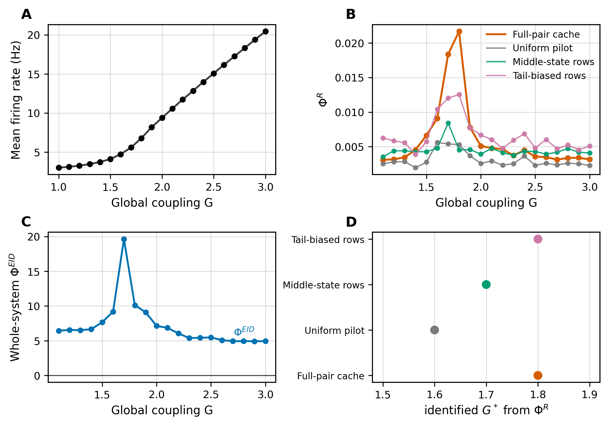

# IID Fig. 6 与 whole-system Phi^EID 对照



本文档给出 Mediano et al. (2025) Fig. 6 的近似复现与 PEID 对照。当前结果使用 Lausanne-33 count 派生的 83 区近似矩阵，不使用论文中未随数据包公开的 HCP Lausanne-83 精确结构连接矩阵。

图中 A 面板给出全局耦合 `G` 扫描下的平均 firing rate；B 面板给出 `Phi^R` 在不同经验采样口径下的曲线；C 面板给出 whole-system `Phi^EID`；D 面板汇总不同 `Phi^R` 采样口径识别到的峰值位置 `G*`。这张图的核心用途是把相变附近的经验状态分布读数和最大熵干预机制读数放在同一组 `G` 上比较。

## 实验设计

1. 扫描全局耦合强度 `G`，记录每个 `G` 下的平均 firing rate。这个曲线用于说明系统从低 firing-rate regime 进入高 firing-rate regime，但不再用单个最大斜率点作为可靠相变标签，因为相邻几个 `G` 的离散斜率很接近：
  - `G=1.8`: `d rate / dG ≈ 13.06`
  - `G=1.9`: `d rate / dG ≈ 13.03`
  - `G=2`: `d rate / dG ≈ 11.87`
2. 在相同 `G` 扫描上计算两类信息指标：`Phi^R` 使用经验 lagged distribution，whole-system `Phi^EID` 使用标准化最大熵源干预下的线性 Gaussian transition。
3. 为测试 `Phi^R` 对采样分布的敏感性，额外构造三条 pilot 曲线：全部时间点、靠近中位 activity 的 middle-state rows、远离中位 activity 的 tail-biased rows。每条曲线各自寻找 `G>1.0` 范围内的最大值位置。
4. `G=1.0` 是扫描边界点，主图绘制和峰值识别对 `Phi^R` 与 `Phi^EID` 都统一使用 `G>1.0`；原始数值保留在缓存中用于审计。

## 指标口径

- `Phi^R`：在滞后样本的经验 Gaussian 分布上计算 pairwise whole-minus-sum 与 double-redundancy 修正，再对脑区 pair 求平均。因此它会随经验采样窗口、重采样权重和状态分布改变。
- `Phi^EID`：先拟合全脑线性 Gaussian transition `X_(t+tau)=A X_t+eps`，再在独立标准化最大熵源干预下计算 whole-system `I_do(X_t;X_(t+tau))-sum_i I_do(X_t^i;X_(t+tau))`。该量等价于源侧条件 total correlation，因此数值非负。

## 当前结果

- 平均 firing rate 在 `G≈1.7-1.9` 附近进入快速上升区，但最大斜率点本身不够稳定，因此图中不再画相变虚线。
- `Phi^R` 的主曲线峰值位置为 `G ≈ 1.8`，落在 firing-rate 快速上升区附近。
- 对 `Phi^R` 使用不同采样分布时，识别到的峰值位置会改变：
  - `Full-pair cache`: `G* ≈ 1.8`
  - `Uniform pilot`: `G* ≈ 1.6`
  - `Middle-state rows`: `G* ≈ 1.7`
  - `Tail-biased rows`: `G* ≈ 1.8`
- whole-system `Phi^EID` 的峰值位置为 `G ≈ 1.7`，最小值为 `4.927`，保持非负。

## 结论

这张图要表达的不是 `Phi^R` 完全无效，而是它的临界点判断依赖经验状态分布。主 `Phi^R` 曲线在本次近似复现中确实可以标出 `G≈1.8` 附近的相变；但当 source sampling distribution 改变时，`Phi^R` 的峰值会移动到 `G≈1.6` 或 `G≈1.7`。相比之下，whole-system `Phi^EID` 使用统一的最大熵干预分布，并且保持非负，更适合作为机制口径下的稳定相变对照指标。

## G = 1.0 的高 Phi 值如何解释

`G=1.0` 处的 whole-system `Phi^EID` 或部分 `Phi^R` 采样曲线偏高不应解释为物理相变。它没有对应 firing-rate 曲线的最大斜率，也不对应论文 Fig. 6 中的临界区。更合理的解释是估计口径造成的边界/瞬态效应：低耦合、低 firing-rate regime 中的 lagged dynamics 更接近自保持和低噪声线性预测，线性 Gaussian `EI` 会因为残差协方差较小而升高。这个点说明估计器对边界 regime 敏感，不是相变证据。因此主图绘制和峰值识别对 `Phi^R` 与 `Phi^EID` 均使用 `G>1.0`，原始 `G=1.0` 数值保留在缓存中用于审计。

## 为什么这里的 Phi 或 Syn 可以在临界区峰值

这个 DMF 例子里的峰值来自两个条件同时成立。第一，`G` 真的改变了系统的动力学 regime：平均 firing rate 在 `G≈1.7-1.9` 附近从低活动态进入快速上升区，线性化转移矩阵和残差结构会在这一带同时改变。第二，`Phi^R` 和 whole-system `Phi^EID` 都是全系统读数，不只看一条二源边。临界区附近，单个脑区的下一步状态不再能由自身或少数局部源独立解释，跨区域联合状态对未来状态的解释力上升；但进入高 `G` 后，系统更接近同步或共同饱和，很多区域开始携带相似信息，联合信息会更多表现为冗余而不是额外的 source-side synergy。因此 `Phi^EID` 可以在临界区附近达到峰值，而不是随 `G` 单调增大。

换句话说，临界峰值不是“耦合越强，协同越强”的结果，而是“低耦合下各部分太独立，高耦合下各部分太同步，中间区联合状态最不可约”的结果。这个解释也说明为什么 B 面板中的 `Phi^R` 对采样分布敏感：它使用经验 lagged distribution，强调哪些状态被采到；而 C 面板的 `Phi^EID` 使用标准化最大熵干预源分布，更接近机制层面的 whole-system 对照。

## 与当前 Kuramoto joint-target PEID 的差异


当前 Kuramoto 实验还没有清晰复现“临界相变处 Syn 峰值”，主要不是 PEID 定义本身的问题，而是实验口径还没有把临界相变读出来。

1. 当前 Kuramoto 读数是即时向量场 `(\dot{\theta}_1,\dot{\theta}_2)` 的二源 joint-target PEID，干预分布是独立均匀相位。它读的是方程右端的机制几何，而不是自然轨迹在锁相临界点附近的状态分布变化。DMF 图中相变则来自经验动力学 regime 转换，并且 firing-rate 曲线直接提供了相变参照。
2. 这个二振子 Kuramoto 方程很小，且 `\dot{\theta}_2=0.9+0.2\sin\theta_2` 不受 `K` 影响；`K` 只是在 `\dot{\theta}_1` 中放大 `\sin(\theta_2-\theta_1)`。在最大熵相位干预下，提高 `K` 主要是提高耦合项在目标中的可见尺度，因此 Oracle Syn 从低 `K` 上升，并在扩展扫描中到 `K=5` 左右达到内部峰值后缓慢回落，但这个峰不等同于明确的锁相临界点。
3. MLP+PEID 曲线在高 `K` 下没有回落，峰值到 `K=20` 仍在高端；但同一 JSON 里 `mlp_test_mse_mean` 从 `K=5` 的 `0.2285` 增到 `K=20` 的 `3.8286`，说明高 `K` 的 learned readout 已经受模型误差影响。当前机制判断应优先看 Oracle 曲线。
4. Kuramoto 的相变通常应通过有限时间相位锁定、相干度或 order parameter 来定义，而不是仅看即时向量场的二源协同。要让 Kuramoto 更接近 DMF 这类临界峰值实验，需要把 target 改为有限时间 next state 或相位差/order-parameter response，在自然或噪声稳态轨迹上同步记录 PLV/order parameter，并把峰值识别限制在锁相转变附近，而不是只在均匀相位盒上读方程右端。

因此，当前结论应写成：DMF whole-system `Phi^EID` 支持“临界区附近不可约全系统信息最大”的机制解释；Kuramoto 目前的 joint-target PEID 只说明耦合项增强会提高二源机制协同，并且 Oracle 曲线在大 `K` 后有轻微回落，但实验还没有把锁相临界相变本身作为 target 或采样分布显式纳入。

## Kuramoto phase-response PEID 复核


为更接近 DMF 的相变读法，补充了一个 finite-time phase-locking response 实验。这里不再把 target 设为即时向量场，而是把每个初始相位状态推进到 `tau=4.0` 后，读取未来相位差和基线校正后的同步度：

$$
\mathbf{y}_{\tau}
=\left(\cos(\theta_{2,\tau}-\theta_{1,\tau}),\,
\sin(\theta_{2,\tau}-\theta_{1,\tau}),\,
r_{\mathrm{excess},\tau}\right).
$$

这里没有直接使用两个振子的原始瞬时 order parameter $r_{\tau}$。原因是对两个振子而言，随机独立相位下

$$
\mathbb{E}\left[\left|\frac{e^{i\theta_1}+e^{i\theta_2}}{2}\right|\right]
=\frac{2}{\pi}\approx 0.637,
$$

所以原始 $r_{\tau}$ 在非锁相或混沌相也不会接近 0。当前图中使用

$$
r_{\mathrm{excess},\tau}
=\mathrm{clip}\left(\frac{r_{\tau}-2/\pi}{1-2/\pi},0,1\right),
$$

并在结果 JSON 里保留 `natural_order_raw` 用于审计。PEID 仍用当前两相位 `theta1+theta2` 作为二源，但 target 变成有限时间后的锁相响应。这个设置让指标回答的问题从“当前方程右端有没有二源机制项”变成“两个当前相位是否共同决定未来锁相状态”。

结果显示，finite-time 口径下的 Oracle Syn 峰值已经被推到同步转变前沿附近。自然轨迹的 PLV 最大斜率在 `K≈0.08`，校正 order excess 最大斜率在 `K≈0.10`；Oracle phase-response Syn 在 `K≈0.05` 达峰。也就是说，Oracle Syn 峰值没有落在高 `K` 饱和同步区，而是落在从未锁相到锁相的前沿。进入 `K≥0.2` 后，自然轨迹几乎完全锁相，Oracle Syn 从 `0.4813` 降到 `0.3340`，再到高 `K` 继续接近零。这与 DMF 图中的机制一致：中间区最需要联合状态解释未来响应，高同步区则更多变成冗余或近确定响应。

修正 target 后，MLP+PEID Syn 的全局峰值仍出现在高 `K`，不能作为临界相变证据；当前应把它视为 learned readout 在强锁相、近确定响应区的外推/拟合风险。机制判断以 Oracle phase-response Syn、PLV 和校正 order excess 的共同位置为准。

这个复核也说明为什么前一个即时向量场实验没有清楚识别临界点。即时向量场 PEID 在均匀相位盒上读的是 `K sin(theta2-theta1)` 的机制强度；finite-time phase-response PEID 读的是自然动力学会不会把系统带向共同锁相响应。后者才把相变变量放进 target 和诊断曲线里，因此更接近 “Phi / Syn 识别临界相变” 的实验设计。

## Large-N classic Kuramoto Phi/Syn 复核


进一步把模型改成经典全局耦合 Kuramoto：

$$
\dot{\theta}_i=\omega_i+\frac{K}{N}\sum_{j=1}^{N}\sin(\theta_j-\theta_i),
$$

其中 `N=128`，$\omega_i$ 从零均值 Gaussian 抽样并按 seed 重缩放到 `sigma=1`。理论临界耦合为

$$
K_c=\frac{2}{\pi g(0)}\approx 1.596.
$$

PEID/Phi 口径也相应改成 whole-system macro partition：把 128 个振子分成两个 64 振子半群，分别用半群平均相位向量作为两个 source，target 只取 `tau=5.0` 后的全局 `order_excess_tau`。这里刻意不把全局相位方向放进 target；否则高 `K` 下最终相位仍高度可预测，Phi/Syn 会继续单调升高，读到的是相位可预测性而不是同步临界性。

这个大 `N` 版本已经体现出临界识别效果。低 `K` 时 corrected global order 约为 `0.02-0.05`，高 `K` 饱和到约 `0.96`；order 最大斜率在 `K≈2.2`。Whole-system Phi/Syn 在 `K≈2.6` 达峰，均值约 `0.038` bits，随后在 `K=3.2` 降到约 `0.0246`，在 `K=4.0` 降到约 `0.0106`。因此它不再是“耦合越强越大”的曲线，而是在锁相转变后沿附近出现峰值。

峰值相对理论 $K_c\approx1.596$ 偏右，主要来自有限 `N`、有限时间 `tau=5.0`、从均匀随机初相出发而非绝热稳态扫描，以及 finite-time order response 的滞后。当前图更适合表述为：大 `N` 经典 Kuramoto + order-only finite-time target 可以让 PEID/Phi 捕捉同步相变区；精确对齐理论临界点还需要延长 `tau`、加密 `K` 网格，并用稳态/缓慢退火协议估计临界斜率。

## 文献与边界

- Zotero item `26Q48H8Y`：Mediano et al. (2025), *Toward a unified taxonomy of information dynamics via Integrated Information Decomposition*。
- Zotero item `MYATYWAJ`：Yang, Wang, and Zhang (2026), *Partial Effective Information Decomposition for Synergistic Causality*。
- 本实验的核心解释是：`Phi^R` 是基于经验状态分布的 ΦID 派生指标，适合作为相变附近信息动力学变化的描述量；`Phi^EID` 是机制干预口径下的 whole-system source-side synergy，更适合作为非负、机制归一化的相变对照指标。

## Reproducibility Metadata

```json
{
  "mode": "lausanne33_approximation",
  "source_results": "exp/brain/result_lausanne_fig6/count_00_fig6b_mean_rate.npz",
  "state_series": "excitatory_rate",
  "tau": 1,
  "ridge": 1e-06,
  "g_stride": 1,
  "main_phi_r_source": "cached_full_pair_curve",
  "plot_and_peak_detection_omit_g": 1.0,
  "caveat": "Approximate reproduction using Lausanne-33 count-derived 83-region matrices, not the exact HCP Lausanne-83 paper matrix."
}
```
